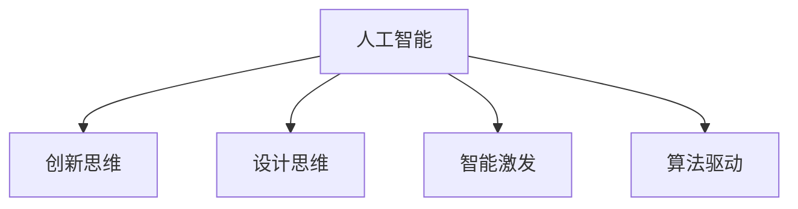

                 

# AI驱动的创新思维激发工具

> 关键词：人工智能,创新思维,设计思维,智能激发,算法驱动

## 1. 背景介绍

在当前这个数字化、智能化的时代，创新已成为企业发展的核心动力。创新思维不仅能够推动技术进步，还能够为企业带来新的商业机会和竞争优势。然而，创新的实现并非易事，它需要创意、团队协作、技术支持等多方面的条件。如何激发和引导创新思维，成为了许多企业关注的重点。本文将围绕这一主题，探讨AI驱动的创新思维激发工具的设计和应用。

### 1.1 问题由来

在企业创新过程中，往往面临以下挑战：

- **创意瓶颈**：团队可能缺乏新想法，或无法将创意转化为实际应用。
- **协作困难**：跨部门、跨职能的团队协作，常常因沟通不畅、信息孤岛等问题，导致效率低下。
- **技术门槛**：对于技术驱动的创新，需要掌握复杂的技术工具和方法，门槛较高。

为了应对这些挑战，企业开始寻求将AI技术融入创新过程，以提升创意产生和实施的效率。AI驱动的创新思维激发工具，通过提供智能化的设计、协作和创意生成功能，有望成为推动企业创新的重要引擎。

### 1.2 问题核心关键点

AI驱动的创新思维激发工具的核心在于：

- **智能化创意生成**：通过自然语言处理、图像生成等技术，自动生成创意方案。
- **智能化协作管理**：利用AI驱动的项目管理工具，优化团队协作流程。
- **数据驱动的决策支持**：基于大数据和机器学习算法，提供决策建议和预测分析。

这些核心功能能够显著提升创新过程的效率和质量，加速创新成果的实现。

## 2. 核心概念与联系

### 2.1 核心概念概述

为更好地理解AI驱动的创新思维激发工具，本节将介绍几个关键概念：

- **人工智能(AI)**：涵盖机器学习、深度学习、自然语言处理等多种技术，能够自动完成复杂任务，提供决策支持。
- **创新思维(Innovation Thinking)**：包括设计思维、用户体验、价值驱动等，强调创造新价值的过程和思维方式。
- **设计思维(Design Thinking)**：通过用户研究、原型设计、测试反馈等步骤，不断迭代优化产品或服务。
- **智能激发(Smart Stimulation)**：利用AI技术，自动生成创意、优化协作流程，提升创新效率。
- **算法驱动(Algorithm-Driven)**：基于算法模型，对海量数据进行分析处理，辅助决策和创意生成。

这些概念之间的逻辑关系可以通过以下Mermaid流程图来展示：



这个流程图展示了人工智能如何通过设计思维、智能激发和算法驱动，支撑创新思维的实现。通过理解这些核心概念，我们可以更好地把握AI驱动创新工具的工作原理和优化方向。

## 3. 核心算法原理 & 具体操作步骤
### 3.1 算法原理概述

AI驱动的创新思维激发工具的核心原理，在于利用AI技术自动化地进行创意生成、协作管理和决策支持。其核心算法包括：

- **自然语言处理(NLP)**：通过文本分析、情感分析等技术，自动生成创意和反馈。
- **图像生成与处理**：利用GAN等技术，自动生成产品原型和设计方案。
- **项目管理与优化**：使用机器学习算法，优化项目管理流程，提高团队协作效率。
- **数据驱动决策**：基于大数据分析和机器学习模型，提供创新方向的预测和建议。

这些算法共同构成了AI驱动工具的核心功能，使其能够高效地激发和引导创新思维。

### 3.2 算法步骤详解

AI驱动的创新思维激发工具的开发过程主要包括以下步骤：

**Step 1: 需求分析与功能设计**
- 与用户团队深度交流，明确创新工具的需求和目标。
- 设计工具的功能模块和用户界面，确保易用性和可扩展性。

**Step 2: 数据准备与模型训练**
- 收集和整理创新过程中的数据，如创意文本、设计方案、协作记录等。
- 选择和训练适合的算法模型，如自然语言生成模型、图像生成模型等。

**Step 3: 系统开发与功能实现**
- 使用软件开发框架，实现工具的各个功能模块。
- 集成数据管理系统，确保数据的存储和高效访问。

**Step 4: 用户测试与优化**
- 邀请用户团队进行功能测试，收集反馈意见。
- 根据反馈不断优化工具的功能和性能。

**Step 5: 部署与维护**
- 将工具部署到生产环境，监控系统运行状况。
- 定期更新模型和功能，保持工具的先进性和实用性。

### 3.3 算法优缺点

AI驱动的创新思维激发工具具有以下优点：

- **高效创意生成**：利用AI技术，快速生成多种创意方案，突破创意瓶颈。
- **协作管理优化**：通过AI驱动的项目管理工具，优化团队协作流程，提高效率。
- **数据驱动决策**：基于大数据和机器学习算法，提供决策建议和预测分析，支持创新方向的优化。

同时，这些工具也存在一些局限性：

- **数据依赖性强**：工具的效果依赖于高质量的数据输入，数据收集和整理的难度较大。
- **技术门槛高**：需要掌握深度学习、自然语言处理等前沿技术，对开发者要求较高。
- **通用性不足**：某些工具可能过于专业化，难以在多个领域通用。

尽管存在这些局限性，但就目前而言，AI驱动的创新工具已在大数据、设计、营销等多个领域取得了显著效果，成为推动企业创新不可或缺的重要工具。

### 3.4 算法应用领域

AI驱动的创新思维激发工具在多个领域都得到了广泛应用，包括但不限于：

- **大数据分析**：利用机器学习算法，分析用户行为数据，生成数据驱动的创新方向。
- **产品设计**：基于图像生成技术和自然语言处理，自动生成产品原型和设计方案。
- **营销策划**：通过情感分析和用户画像生成，优化广告文案和推广策略。
- **创意写作**：使用自然语言生成技术，自动生成创意文本和故事。
- **创新教育**：利用AI工具，引导学生进行设计思维和创新实践。

随着AI技术的不断进步，AI驱动的创新工具将在更多领域得到应用，为各行各业带来新的创意和商业机会。

## 4. 数学模型和公式 & 详细讲解  
### 4.1 数学模型构建

本节将使用数学语言对AI驱动的创新思维激发工具进行更加严格的刻画。

记创新工具的数据集为 $D=\{(x_i,y_i)\}_{i=1}^N$，其中 $x_i$ 为创意文本、设计方案等输入，$y_i$ 为相应的创意输出或评价评分。定义模型 $M_{\theta}$，其中 $\theta$ 为模型的可训练参数。

定义创意生成模型的损失函数为 $\ell(M_{\theta}(x_i),y_i)$，则在数据集 $D$ 上的经验风险为：

$$
\mathcal{L}(\theta) = \frac{1}{N} \sum_{i=1}^N \ell(M_{\theta}(x_i),y_i)
$$

通过梯度下降等优化算法，最小化经验风险，得到模型参数 $\theta^*$：

$$
\theta^*=\mathop{\arg\min}_{\theta}\mathcal{L}(\theta)
$$

### 4.2 公式推导过程

以自然语言生成模型为例，推导基于GAN的创意生成公式。

设创意文本序列为 $X=(x_1,x_2,\dots,x_n)$，目标创意文本序列为 $Y=(y_1,y_2,\dots,y_n)$。使用两组生成器和判别器进行对抗训练，生成器和判别器的损失函数分别为：

$$
\mathcal{L}_G = E_{x\sim X}[\ell_G(x,y)]
$$

$$
\mathcal{L}_D = E_{x\sim X}[\ell_D(x)] + E_{y\sim Y}[\ell_D(y)]
$$

其中 $\ell_G$ 和 $\ell_D$ 分别为生成器和判别器的损失函数，$x$ 和 $y$ 分别为生成器和判别器的输入。

通过最小化生成器的损失函数 $\mathcal{L}_G$，最大化判别器的损失函数 $\mathcal{L}_D$，训练得到生成器 $G$，即可生成高质量的创意文本。

### 4.3 案例分析与讲解

以一家电子商务公司为例，分析如何使用AI驱动的创新思维激发工具。

**需求分析与功能设计**：
- 收集公司历史产品创新数据，包括用户反馈、市场分析报告等。
- 设计工具界面，包括创意生成、协作管理、数据分析等功能模块。

**数据准备与模型训练**：
- 收集用户评论和销售数据，整理为可用于训练的数据集。
- 选择适当的自然语言处理模型，如BERT、GPT-3等，进行预训练和微调。

**系统开发与功能实现**：
- 使用Python开发工具，集成自然语言处理、图像生成等模块。
- 使用数据库管理系统，确保数据的高效存储和访问。

**用户测试与优化**：
- 邀请用户团队使用工具，收集反馈意见，包括界面友好性、功能实用性等。
- 根据反馈，优化工具的功能和性能，例如调整生成模型的参数。

**部署与维护**：
- 将工具部署到公司内部网，监控系统运行状况。
- 定期更新模型和功能，例如根据最新的市场趋势调整创意生成模型。

通过以上步骤，电子商务公司成功实现了AI驱动的创新思维激发工具，显著提升了创新过程的效率和效果。

## 5. 项目实践：代码实例和详细解释说明
### 5.1 开发环境搭建

在进行AI驱动创新思维激发工具的开发前，我们需要准备好开发环境。以下是使用Python进行PyTorch开发的环境配置流程：

1. 安装Anaconda：从官网下载并安装Anaconda，用于创建独立的Python环境。

2. 创建并激活虚拟环境：
```bash
conda create -n ai-env python=3.8 
conda activate ai-env
```

3. 安装PyTorch：根据CUDA版本，从官网获取对应的安装命令。例如：
```bash
conda install pytorch torchvision torchaudio cudatoolkit=11.1 -c pytorch -c conda-forge
```

4. 安装Transformers库：
```bash
pip install transformers
```

5. 安装各类工具包：
```bash
pip install numpy pandas scikit-learn matplotlib tqdm jupyter notebook ipython
```

完成上述步骤后，即可在`ai-env`环境中开始AI驱动创新思维激发工具的开发。

### 5.2 源代码详细实现

下面以自然语言生成工具为例，给出使用Transformers库进行创意生成的PyTorch代码实现。

首先，定义创意生成模型：

```python
from transformers import GPT2LMHeadModel, GPT2Tokenizer

model = GPT2LMHeadModel.from_pretrained('gpt2')
tokenizer = GPT2Tokenizer.from_pretrained('gpt2')

def generate_text(prompt, max_length=50):
    inputs = tokenizer.encode(prompt, return_tensors='pt')
    outputs = model.generate(inputs, max_length=max_length, num_return_sequences=1)
    return tokenizer.decode(outputs[0], skip_special_tokens=True)
```

然后，使用生成的创意进行后续的项目管理优化：

```python
from sklearn.model_selection import train_test_split

# 假设已经准备了创意生成模型和项目管理数据
# 训练模型得到项目管理效果评估的预测模型
X = # 创意生成模型的输出
y = # 项目管理效果评估的真实值

X_train, X_test, y_train, y_test = train_test_split(X, y, test_size=0.2)

from sklearn.linear_model import LogisticRegression
model = LogisticRegression()
model.fit(X_train, y_train)

# 使用模型对新的项目管理数据进行评估
new项目管理数据
new项目管理效果评估 = model.predict(new项目管理数据)
```

接着，通过数据分析和预测，辅助创新决策：

```python
from sklearn.preprocessing import MinMaxScaler
from sklearn.decomposition import PCA

# 假设已经准备了市场数据、用户数据等
# 进行数据预处理和降维
data = # 市场数据、用户数据等
scaler = MinMaxScaler()
data_scaled = scaler.fit_transform(data)

pca = PCA(n_components=2)
data_pca = pca.fit_transform(data_scaled)

# 可视化数据
import matplotlib.pyplot as plt
plt.scatter(data_pca[:, 0], data_pca[:, 1])
plt.xlabel('Component 1')
plt.ylabel('Component 2')
plt.show()

# 根据数据特征，进行创新方向的预测和决策
创新方向 = # 基于数据预测的创新方向
```

### 5.3 代码解读与分析

让我们再详细解读一下关键代码的实现细节：

**创意生成模型**：
- 使用GPT-2作为创意生成模型，通过从预训练模型进行微调，得到创意生成模型 $M_{\theta}$。
- 利用`GPT2LMHeadModel`和`GPT2Tokenizer`，实现输入编码和解码。
- `generate_text`函数：将提示文本转化为模型可接受的格式，输入模型生成创意文本，最后解码输出。

**项目管理优化**：
- 使用Logistic Regression模型，对项目管理效果进行评估。
- 利用sklearn的`train_test_split`将数据集分为训练集和测试集，使用训练集训练模型，使用测试集评估模型效果。
- 利用`predict`函数，对新的项目管理数据进行预测。

**数据分析与预测**：
- 使用MinMaxScaler对数据进行标准化处理，使用PCA进行降维。
- 通过可视化数据，识别数据特征，辅助创新方向的预测和决策。

可以看到，PyTorch配合Transformers库使得AI驱动创新思维激发工具的开发变得简洁高效。开发者可以将更多精力放在数据处理、模型改进等高层逻辑上，而不必过多关注底层的实现细节。

当然，工业级的系统实现还需考虑更多因素，如模型的保存和部署、超参数的自动搜索、更灵活的任务适配层等。但核心的算法流程基本与此类似。

## 6. 实际应用场景
### 6.1 电商创新

AI驱动的创新思维激发工具在电商领域的创新中起到了重要作用。传统电商运营依赖于经验丰富的市场人员，对创意和策略的调整需要大量时间和成本。使用AI工具，可以根据用户行为数据和市场趋势，自动生成创意方案，优化广告文案和营销策略，提升销售效果。

**具体实现**：
- 收集用户浏览、购买、评价等行为数据。
- 使用自然语言处理技术，自动生成广告文案和促销语。
- 结合市场分析数据，优化广告投放策略。

**效果**：
- 显著提升广告文案的点击率，提高销售转化率。
- 降低创意生成成本，快速迭代测试效果，优化营销策略。

### 6.2 产品设计

产品设计是企业创新的重要环节，AI工具可以帮助设计师快速生成设计方案，优化设计流程，提升设计效率。

**具体实现**：
- 收集用户需求、市场反馈、竞争对手信息等数据。
- 使用图像生成技术，自动生成产品原型和设计方案。
- 结合用户调研和市场分析数据，优化设计方案。

**效果**：
- 缩短产品设计周期，提升设计方案的多样性和质量。
- 降低设计成本，优化设计过程，提高市场竞争力。

### 6.3 营销策划

AI工具可以通过分析用户数据和市场趋势，自动生成广告和推广策略，优化营销方案，提升市场效果。

**具体实现**：
- 收集用户行为数据、市场分析报告、广告投放数据等。
- 使用情感分析技术，自动生成广告文案和推广策略。
- 结合用户画像和市场趋势，优化广告投放策略。

**效果**：
- 提高广告投放精准度，提升广告效果和ROI。
- 降低创意生成和营销策略制定成本，提升市场响应速度。

### 6.4 未来应用展望

随着AI技术的不断进步，AI驱动的创新思维激发工具将在更多领域得到应用，为各行各业带来新的创意和商业机会。

在智慧城市治理中，AI工具可以帮助城市管理者通过数据分析和可视化，识别城市管理中的问题和优化机会，提升城市治理的智能化水平。

在智能制造领域，AI工具可以帮助企业通过数据分析和预测，优化生产流程，提高生产效率，降低生产成本。

在医疗健康领域，AI工具可以帮助医疗机构通过数据分析和预测，优化诊疗方案，提升医疗服务质量，降低医疗成本。

此外，在金融、教育、旅游等多个领域，AI工具也将发挥重要作用，推动各行业的智能化和创新化。

## 7. 工具和资源推荐
### 7.1 学习资源推荐

为了帮助开发者系统掌握AI驱动创新思维激发工具的理论基础和实践技巧，这里推荐一些优质的学习资源：

1. 《深度学习》系列书籍：涵盖深度学习的基础理论、算法实现和应用案例，是理解AI驱动创新工具的核心知识。
2. 《Python数据科学手册》：详细介绍Python在数据分析和机器学习中的应用，是编程学习的必备资源。
3. 《NLP with PyTorch》在线课程：由斯坦福大学提供，深入浅出地介绍了自然语言处理的基础知识和常用算法。
4. GitHub开源项目：如HuggingFace的Transformers库，提供了丰富的预训练模型和微调样例，是实际开发的重要参考。
5. Kaggle数据集：包含海量数据集和机器学习竞赛，是提升数据处理和算法实现能力的好资源。

通过对这些资源的学习实践，相信你一定能够快速掌握AI驱动创新思维激发工具的精髓，并用于解决实际的创新问题。

### 7.2 开发工具推荐

高效的开发离不开优秀的工具支持。以下是几款用于AI驱动创新思维激发工具开发的常用工具：

1. PyTorch：基于Python的开源深度学习框架，灵活动态的计算图，适合快速迭代研究。

2. TensorFlow：由Google主导开发的开源深度学习框架，生产部署方便，适合大规模工程应用。

3. Jupyter Notebook：强大的笔记本开发工具，支持Python、R等多种语言，适合进行数据分析和算法实现。

4. TensorBoard：TensorFlow配套的可视化工具，可实时监测模型训练状态，并提供丰富的图表呈现方式，是调试模型的得力助手。

5. Weights & Biases：模型训练的实验跟踪工具，可以记录和可视化模型训练过程中的各项指标，方便对比和调优。

6. GitHub：代码托管平台，支持版本控制和协作开发，是团队项目开发的重要工具。

合理利用这些工具，可以显著提升AI驱动创新思维激发工具的开发效率，加快创新迭代的步伐。

### 7.3 相关论文推荐

AI驱动的创新思维激发工具的研究源于学界的持续研究。以下是几篇奠基性的相关论文，推荐阅读：

1. "The Effectiveness of Word Embeddings in Natural Language Processing"：介绍词嵌入技术在自然语言处理中的应用，是自然语言生成和处理的经典论文。

2. "Generating Short and Descriptive Product Titles from Raw Text"：研究如何通过生成模型自动生成产品标题，是产品设计的关键技术。

3. "Convolutional Neural Networks for Sentence Classification"：介绍卷积神经网络在文本分类中的应用，是文本处理的基础算法。

4. "Data Mining and Statistical Learning"：介绍数据挖掘和统计学习方法，是数据分析和机器学习的经典教材。

这些论文代表了大数据、自然语言处理和机器学习的发展脉络。通过学习这些前沿成果，可以帮助研究者把握学科前进方向，激发更多的创新灵感。

## 8. 总结：未来发展趋势与挑战

### 8.1 总结

本文对AI驱动的创新思维激发工具进行了全面系统的介绍。首先阐述了AI驱动创新工具的研究背景和意义，明确了AI技术在激发和引导创新思维中的重要作用。其次，从原理到实践，详细讲解了AI驱动创新工具的算法原理和具体操作步骤，给出了创新工具开发的完整代码实例。同时，本文还广泛探讨了AI驱动工具在电商、产品设计、营销等多个行业领域的应用前景，展示了AI驱动工具的巨大潜力。此外，本文精选了AI驱动工具的学习资源，力求为开发者提供全方位的技术指引。

通过本文的系统梳理，可以看到，AI驱动的创新思维激发工具正在成为推动企业创新不可或缺的重要工具。AI技术的深度融合，使得创意生成、协作管理、决策支持等过程更加高效和智能化，大大提升了创新的效率和效果。未来，伴随AI技术的不断演进，AI驱动工具必将在更多领域得到应用，为各行各业带来新的创意和商业机会。

### 8.2 未来发展趋势

展望未来，AI驱动的创新思维激发工具将呈现以下几个发展趋势：

1. **智能化水平提升**：AI技术将更加深入地融入创新过程，提供更加精准的创意生成和协作优化功能。
2. **多模态融合**：结合文本、图像、声音等多种模态数据，提供更加全面和丰富的创新支持。
3. **跨领域应用**：在更多垂直领域中应用AI驱动工具，提升各行业的创新能力。
4. **人机协作增强**：利用AI技术辅助人类进行创新决策，提升创新过程中的协作效率。
5. **实时性和灵活性**：通过实时分析和预测，优化创新过程，提升创新响应速度和灵活性。

这些趋势凸显了AI驱动创新工具的广阔前景。未来的工具将更加智能化、灵活化和个性化，满足各行业对创新效率和质量的需求。

### 8.3 面临的挑战

尽管AI驱动的创新思维激发工具已经取得了显著成效，但在迈向更加智能化、普适化应用的过程中，它仍面临诸多挑战：

1. **数据隐私和安全**：在创新过程中，需要处理大量用户数据，如何保障数据隐私和安全，避免数据滥用，是一个重要挑战。
2. **技术复杂性**：AI驱动工具的开发和使用需要掌握复杂的技术，对开发者和用户的技术要求较高。
3. **通用性和可扩展性**：部分工具可能过于专业化，难以在多个领域通用。
4. **公平性和偏见**：AI工具可能继承预训练模型中的偏见，导致创意生成和协作管理中存在不公平现象。

尽管存在这些挑战，但通过持续的技术创新和优化，AI驱动的创新思维激发工具将逐步克服这些障碍，成为推动企业创新发展的强大引擎。

### 8.4 研究展望

面对AI驱动创新思维激发工具所面临的挑战，未来的研究需要在以下几个方面寻求新的突破：

1. **数据隐私保护**：开发数据隐私保护技术，确保用户数据的安全和匿名性。
2. **技术易用性提升**：简化工具的使用流程，降低技术门槛，提升工具的可扩展性。
3. **跨领域应用拓展**：开发跨领域的AI驱动工具，提升各行业的创新能力。
4. **公平性和透明性**：通过算法优化和人工干预，确保AI工具的公平性和透明性。

这些研究方向的探索，必将引领AI驱动创新思维激发工具的发展，为构建智能创新的未来奠定基础。面向未来，AI驱动工具将成为推动各行业创新发展的重要工具，带来更多新价值和新机会。

## 9. 附录：常见问题与解答

**Q1：AI驱动的创新思维激发工具如何实现创意生成？**

A: AI驱动的创新思维激发工具通过自然语言生成技术实现创意生成。具体而言，可以使用基于Transformer的生成模型，如GPT-2、BERT等，对用户提供的提示文本进行编码，生成创意文本。生成的创意文本可以是广告文案、产品描述、服务方案等，根据不同任务需求进行调整。

**Q2：AI驱动的创新思维激发工具如何优化项目管理？**

A: AI驱动的创新思维激发工具通过项目管理优化模型实现项目管理。具体而言，可以使用监督学习模型，如Logistic Regression、Random Forest等，对项目管理效果进行评估，生成项目管理建议。模型可以通过标注数据进行训练，例如项目管理效果评估的历史数据。训练后的模型可以对新的项目管理数据进行预测，提供项目管理优化建议。

**Q3：AI驱动的创新思维激发工具如何进行数据分析和预测？**

A: AI驱动的创新思维激发工具通过数据分析和预测模型实现数据分析和预测。具体而言，可以使用PCA等降维技术，对大量数据进行可视化分析，识别数据特征和趋势。然后使用机器学习模型，如线性回归、决策树等，对数据进行预测和分析，辅助创新决策。模型可以通过标注数据进行训练，例如市场数据、用户数据等。

通过以上问题的解答，可以看到AI驱动的创新思维激发工具在创意生成、项目管理、数据分析等方面的实现原理和步骤。这些工具通过AI技术的深度融合，为企业的创新提供了高效、智能的解决方案。

---

作者：禅与计算机程序设计艺术 / Zen and the Art of Computer Programming

