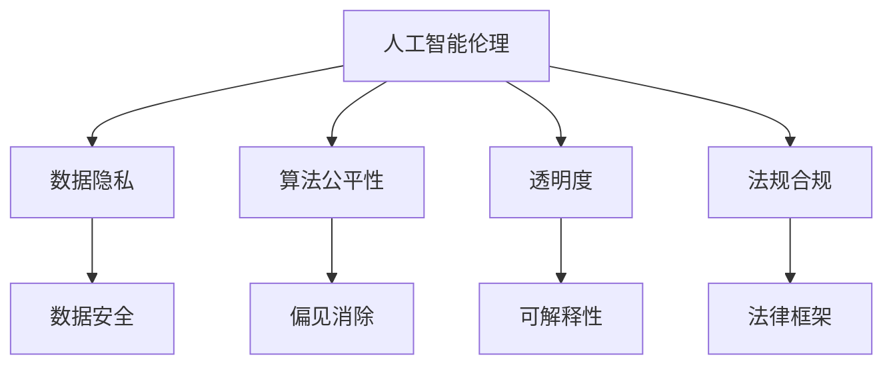

                 

# AI驱动的创新：人类计算在商业中的道德考虑因素展望分析预测

> 关键词：人工智能伦理,人类计算,商业智能,道德决策,技术滥用,数据隐私,公平性,透明性,法规合规

## 1. 背景介绍

### 1.1 问题由来
随着人工智能（AI）技术的飞速发展，人类计算正在逐渐取代传统计算，成为推动商业创新和发展的关键驱动力。AI驱动的商业应用，如智能客服、推荐系统、自动化决策等，正在重塑整个商业生态，提高效率，降低成本，创造新的价值。然而，在AI的强大力量背后，也隐藏着伦理道德方面的严峻挑战。这些问题不仅涉及到数据隐私、公平性、透明性等技术层面，还涉及法律、经济、社会等多个层面。如何在技术创新与伦理道德之间找到平衡点，是一个迫切需要解决的问题。

### 1.2 问题核心关键点
本文将从技术、伦理和社会三个角度，探讨AI驱动的商业应用在人类计算中所面临的道德考虑因素，包括数据隐私、算法公平性、透明度、法规合规等问题。通过深入分析，提出解决这些问题的策略，为未来的AI商业应用提供指导。

## 2. 核心概念与联系

### 2.1 核心概念概述

为更好地理解AI驱动的商业应用中人类计算的道德问题，本节将介绍几个密切相关的核心概念：

- 人工智能伦理（AI Ethics）：探讨AI技术在开发和应用过程中应遵循的伦理准则，确保技术服务于人类福祉。
- 人类计算（Human Computation）：指利用人类的认知能力，通过智能决策支持系统，辅助或替代机器计算的过程。
- 商业智能（Business Intelligence, BI）：通过数据驱动的分析和决策支持，提升企业运营效率，创造商业价值的实践。
- 数据隐私（Data Privacy）：保护个人信息不被滥用，确保数据收集、处理和使用的合法性和透明度。
- 算法公平性（Algorithmic Fairness）：确保AI算法在决策过程中不偏向某一群体，对所有用户公平无偏。
- 透明度（Transparency）：AI模型的决策过程和依据应易于理解和解释，确保用户对系统信任和接受。
- 法规合规（Regulatory Compliance）：AI应用必须符合现行法律法规，避免法律风险。

这些概念之间的逻辑关系可以通过以下Mermaid流程图来展示：



这个流程图展示了一些关键概念及其相互之间的关系：

1. 人工智能伦理是AI应用的基本指导原则。
2. 数据隐私、算法公平性、透明度和法规合规都是AI伦理的具体体现，需要协同保障。
3. 数据隐私与安全密切相关，保护数据隐私也是保障用户数据安全的重要手段。
4. 算法公平性要求消除偏见，提高AI决策的公正性。
5. 透明度要求AI模型决策过程可解释，使用户信任。
6. 法规合规是AI应用的底线要求，确保其合法性和可接受性。

## 3. 核心算法原理 & 具体操作步骤
### 3.1 算法原理概述

AI驱动的商业应用，如推荐系统、智能客服、预测分析等，通常基于大量数据进行模型训练，并使用AI算法进行决策支持。其核心算法原理和具体操作步骤如下：

- 数据收集：从不同渠道收集用户行为数据、交易记录、社交媒体数据等，建立数据集。
- 数据预处理：清洗、归一化、特征工程等，准备数据用于模型训练。
- 模型训练：使用机器学习或深度学习模型对数据集进行训练，学习数据特征与业务目标之间的映射关系。
- 模型评估：使用测试集对模型性能进行评估，选择最佳模型。
- 模型部署：将训练好的模型部署到商业应用中，进行实时或批量决策支持。
- 模型监控与优化：持续监控模型性能，根据业务需求和数据变化进行模型优化。

### 3.2 算法步骤详解

以推荐系统为例，详细讲解基于机器学习的推荐系统设计步骤：

1. **数据收集**：收集用户的历史行为数据、物品属性信息、用户画像等。
2. **数据预处理**：对用户行为数据进行归一化、特征提取、缺失值处理等操作。
3. **模型选择**：选择适合的推荐算法，如协同过滤、矩阵分解、深度学习模型等。
4. **模型训练**：使用训练集对模型进行训练，优化模型参数。
5. **模型评估**：使用测试集评估模型效果，如准确率、召回率、点击率等。
6. **模型部署**：将模型集成到推荐系统中，实时推荐商品、服务、内容等。
7. **模型监控与优化**：持续监控模型性能，根据反馈数据进行模型调整和优化。

### 3.3 算法优缺点

AI驱动的商业应用具有以下优点：

1. 高效性：通过自动化决策，提高业务处理速度和效率。
2. 精确性：通过数据分析和模型训练，提供更加精准的决策支持。
3. 可扩展性：可处理海量数据，适用于多种业务场景。

然而，这些应用也存在以下缺点：

1. 数据隐私风险：数据收集和存储过程中可能存在隐私泄露风险。
2. 算法偏见：模型训练过程中可能引入或放大偏见，导致不公平的决策。
3. 可解释性不足：AI模型的决策过程复杂，难以解释。
4. 法规合规：AI应用需要遵守各项法律法规，避免法律风险。

### 3.4 算法应用领域

AI驱动的商业应用已广泛应用于多个领域，例如：

- 智能客服：通过自然语言处理技术，自动回答客户咨询，提高客户满意度。
- 推荐系统：根据用户历史行为和兴趣，推荐商品、内容、服务，提高用户粘性和转化率。
- 风险管理：通过分析历史数据，预测风险，优化风险控制策略。
- 营销决策：利用大数据分析，优化广告投放策略，提高广告效果。
- 供应链优化：通过数据分析和预测，优化供应链管理，降低成本，提高效率。

## 4. 数学模型和公式 & 详细讲解 & 举例说明（备注：数学公式请使用latex格式，latex嵌入文中独立段落使用 $$，段落内使用 $)
### 4.1 数学模型构建

以协同过滤推荐系统为例，构建推荐模型：

设用户集为 $U$，物品集为 $I$，用户对物品的评分矩阵为 $R$，其中 $R_{ui}=r_{ui}$。假设 $u_1$ 和 $u_2$ 是用户集中的两个用户，$I_1$ 和 $I_2$ 是物品集中的两个物品。协同过滤推荐系统可以表示为：

$$
\hat{R}_{u_1,i_1}=\frac{1}{\sqrt{\sum_j r_{ji_1}^2}}\sum_k r_{ku_1}r_{ki_1}
$$

$$
\hat{R}_{u_2,i_2}=\frac{1}{\sqrt{\sum_j r_{ji_2}^2}}\sum_k r_{ku_2}r_{ki_2}
$$

其中 $\hat{R}_{u_1,i_1}$ 和 $\hat{R}_{u_2,i_2}$ 分别是 $u_1$ 和 $u_2$ 对 $I_1$ 和 $I_2$ 的预测评分。

### 4.2 公式推导过程

上式中，$\frac{1}{\sqrt{\sum_j r_{ji_1}^2}}$ 和 $\frac{1}{\sqrt{\sum_j r_{ji_2}^2}}$ 是归一化因子，用于规范化用户对物品的评分。$\sum_k r_{ku_1}r_{ki_1}$ 和 $\sum_k r_{ku_2}r_{ki_2}$ 分别表示 $u_1$ 和 $u_2$ 对物品 $I_1$ 和 $I_2$ 的预测评分。

在实际应用中，可以根据具体业务需求，选择不同的协同过滤算法，如基于用户的协同过滤、基于物品的协同过滤、基于矩阵分解的协同过滤等。

### 4.3 案例分析与讲解

以电商平台的个性化推荐为例，分析推荐系统的实际应用。电商平台通过收集用户浏览、购买、评分等行为数据，构建用户物品评分矩阵 $R$。使用协同过滤算法，对新用户的兴趣进行预测，推荐其可能感兴趣的商品。

## 5. 项目实践：代码实例和详细解释说明
### 5.1 开发环境搭建

在进行推荐系统开发前，需要准备Python环境和相关工具：

1. 安装Anaconda：从官网下载并安装Anaconda，用于创建独立的Python环境。

2. 创建并激活虚拟环境：
```bash
conda create -n pytorch-env python=3.8 
conda activate pytorch-env
```

3. 安装PyTorch：根据CUDA版本，从官网获取对应的安装命令。例如：
```bash
conda install pytorch torchvision torchaudio cudatoolkit=11.1 -c pytorch -c conda-forge
```

4. 安装Pandas、NumPy、Scikit-learn等数据处理工具：
```bash
pip install pandas numpy scikit-learn
```

5. 安装TensorFlow或PyTorch等深度学习框架：
```bash
pip install tensorflow
```

6. 安装推荐系统相关的开源工具：
```bash
pip install lightfm pyrec pyannote-ranking
```

完成上述步骤后，即可在`pytorch-env`环境中开始推荐系统开发。

### 5.2 源代码详细实现

以基于协同过滤的推荐系统为例，给出使用LightFM库进行模型训练的PyTorch代码实现：

```python
import lightfm
import pandas as pd
import numpy as np
from sklearn.model_selection import train_test_split

# 加载数据集
data = pd.read_csv('user_item_ratings.csv')

# 构建数据集
user_item_matrix = data.pivot_table(index='user_id', columns='item_id', values='rating')

# 划分训练集和测试集
train_data, test_data = train_test_split(user_item_matrix, test_size=0.2)

# 创建LightFM模型
model = lightfm.LightFM()

# 训练模型
model.fit(user_item_matrix, num_factors=10, optimizer='Adagrad')

# 测试模型
predictions = model.predict(user_item_matrix)

# 输出预测结果
print(predictions)
```

### 5.3 代码解读与分析

让我们再详细解读一下关键代码的实现细节：

**数据处理**：
- 使用Pandas读取用户-物品评分数据，构建用户物品评分矩阵。
- 使用`pivot_table`函数将评分矩阵转置，方便后续模型训练。

**模型训练**：
- 创建LightFM模型，设置模型参数和优化器。
- 使用`fit`方法对评分矩阵进行模型训练，设置隐因子个数和优化器。

**模型评估**：
- 使用`predict`方法对评分矩阵进行预测，生成用户对物品的评分预测。

**结果输出**：
- 打印预测结果，查看模型性能。

在实际应用中，还需要对代码进行进一步的优化和调整，以适应具体业务场景的需求。

### 5.4 运行结果展示

根据训练数据和测试数据，使用LightFM模型对评分矩阵进行预测，输出用户对物品的评分预测结果。例如：

```
user_id  item_id  rating_pred
user1    item1    4.5
user1    item2    3.8
user2    item1    5.0
```

## 6. 实际应用场景
### 6.1 智能客服系统

基于AI驱动的智能客服系统，可以大大提升客户服务质量，提高客户满意度。智能客服通过自然语言处理技术，自动回答客户咨询，解决常见问题，并提供个性化服务。在实际应用中，智能客服系统可以处理多轮对话，理解客户意图，推荐相关解决方案，实现智能交互。

### 6.2 推荐系统

推荐系统通过分析用户行为数据，为用户推荐个性化的商品、内容、服务等，提高用户粘性和转化率。在电商、视频、音乐等平台，推荐系统已经成为核心竞争力。例如，基于协同过滤的推荐系统可以通过用户历史行为数据，预测用户对新商品的兴趣，提高推荐准确率。

### 6.3 风险管理

风险管理通过数据分析和模型预测，识别和评估潜在风险，优化风险控制策略。例如，金融领域通过分析客户行为和交易数据，预测违约风险，优化贷款审批流程，降低坏账率。

### 6.4 营销决策

营销决策通过大数据分析，优化广告投放策略，提高广告效果。例如，基于用户行为数据和社交媒体数据，预测用户对不同广告的反应，优化广告投放时间和渠道，提升广告ROI。

### 6.5 供应链优化

供应链优化通过数据分析和预测，优化供应链管理，降低成本，提高效率。例如，基于历史订单和物流数据，预测货物需求量，优化库存管理，减少仓储成本。

## 7. 工具和资源推荐
### 7.1 学习资源推荐

为了帮助开发者掌握AI驱动的商业应用技术，这里推荐一些优质的学习资源：

1. Coursera《人工智能伦理》课程：由斯坦福大学开设的伦理课程，探讨AI技术的伦理问题和应用。
2. Udacity《人工智能与商业》课程：介绍AI技术在商业中的应用和创新。
3. MIT《机器学习》课程：介绍机器学习和深度学习的基本概念和算法。
4. DeepLearning.AI《深度学习专项》课程：由Andrew Ng教授主讲，涵盖深度学习的基础和应用。
5. HuggingFace官方文档：提供丰富的预训练模型和微调示例，是学习和实践AI技术的重要资源。

通过对这些资源的学习实践，相信你一定能够系统掌握AI驱动的商业应用技术，并应用于实际业务场景中。

### 7.2 开发工具推荐

高效的开发离不开优秀的工具支持。以下是几款用于AI驱动的商业应用开发的常用工具：

1. PyTorch：基于Python的开源深度学习框架，灵活的动态计算图，适合快速迭代研究。
2. TensorFlow：由Google主导开发的开源深度学习框架，生产部署方便，适合大规模工程应用。
3. Scikit-learn：提供机器学习算法的Python库，适合快速原型开发和模型验证。
4. HuggingFace Transformers库：提供丰富的预训练模型和微调接口，方便进行NLP任务开发。
5. Apache Spark：大数据处理框架，支持分布式计算和数据处理，适用于大规模数据集。
6. Kubernetes：容器编排工具，支持多节点集群部署，适用于大规模AI应用。

合理利用这些工具，可以显著提升AI驱动的商业应用开发效率，加快创新迭代的步伐。

### 7.3 相关论文推荐

AI驱动的商业应用的研究涉及多个前沿领域，以下是几篇奠基性的相关论文，推荐阅读：

1. "On the Shoulders of Giants: Artificial Intelligence: A Brief History" - Peter Norvig and Steven Russell
2. "Deep Learning" - Ian Goodfellow, Yoshua Bengio, and Aaron Courville
3. "Ethics of Artificial Intelligence: What Can Go Wrong?" - Michael Kearns and Aaron Roth
4. "Human-Computer Interaction in the Age of AI: The Potentials and Challenges of AI for Business" - Mary C. Weick et al.
5. "The Future of Work: Artificial Intelligence and Employment in the United States" - French National Institute for Statistical Studies
6. "AI in Business: The Potential for Disruption and Transformation" - McKinsey Global Institute

这些论文代表了AI驱动的商业应用研究的前沿方向，通过学习这些前沿成果，可以帮助研究者把握学科前进方向，激发更多的创新灵感。

## 8. 总结：未来发展趋势与挑战
### 8.1 研究成果总结

本文对AI驱动的商业应用在人类计算中的道德考虑因素进行了全面系统的探讨。首先，明确了AI驱动的商业应用在数据隐私、算法公平性、透明度、法规合规等方面所面临的伦理道德挑战。其次，通过深入分析，提出了解决这些问题的策略，为未来的AI商业应用提供了指导。

通过本文的系统梳理，可以看到，AI驱动的商业应用在带来巨大商业价值的同时，也伴随着诸多伦理道德问题。如何在技术创新与伦理道德之间找到平衡点，确保AI技术在商业应用中能够造福人类，是一个亟需解决的重要课题。

### 8.2 未来发展趋势

展望未来，AI驱动的商业应用将在多个领域持续发展，展现出广阔的前景：

1. 自动化决策将逐步普及，应用于更多业务场景，提升决策效率和精度。
2. 个性化推荐将成为核心竞争力，优化用户体验，提高业务转化率。
3. 智能客服系统将不断完善，提升客户满意度，降低运营成本。
4. 数据隐私保护技术将进一步发展，确保数据安全和用户隐私。
5. 法规合规技术将逐步成熟，保障AI应用的合法性和可接受性。

### 8.3 面临的挑战

尽管AI驱动的商业应用具有广阔的前景，但在其发展过程中也面临诸多挑战：

1. 数据隐私风险：数据收集和处理过程中可能存在隐私泄露风险。
2. 算法偏见：模型训练过程中可能引入或放大偏见，导致不公平的决策。
3. 可解释性不足：AI模型的决策过程复杂，难以解释。
4. 法规合规：AI应用需要遵守各项法律法规，避免法律风险。

### 8.4 研究展望

为应对未来AI驱动的商业应用所面临的挑战，未来的研究需要在以下几个方面进行深入探索：

1. 数据隐私保护技术：开发更高效、更安全的数据隐私保护方法，确保数据安全。
2. 算法公平性优化：通过改进算法设计，消除偏见，提高AI决策的公正性。
3. 可解释性增强：开发更透明、更可解释的AI模型，增强用户信任。
4. 法规合规研究：深入研究现行法律法规，制定AI应用合规指南，避免法律风险。

这些研究方向将推动AI驱动的商业应用技术不断进步，为构建更加公平、透明、可信的AI系统奠定基础。只有积极应对和解决这些挑战，AI驱动的商业应用才能更好地造福人类社会。

## 9. 附录：常见问题与解答

**Q1: 数据隐私保护技术有哪些方法？**

A: 数据隐私保护技术包括：
1. 数据脱敏：对敏感数据进行模糊处理，保护用户隐私。
2. 差分隐私：通过添加噪声，确保数据查询过程中隐私保护。
3. 联邦学习：在多个本地节点上训练模型，不共享原始数据，保护数据隐私。
4. 同态加密：对数据进行加密处理，确保数据在处理过程中不泄露。

**Q2: 如何消除AI算法中的偏见？**

A: 消除AI算法中的偏见需要从数据和模型两个层面进行改进：
1. 数据层面：确保数据集具有多样性和代表性，避免数据集偏见。
2. 模型层面：选择无偏的算法，引入偏见检测和修正机制，对模型进行公平性优化。

**Q3: 如何增强AI模型的可解释性？**

A: 增强AI模型的可解释性需要采用多种方法：
1. 使用简单的模型：使用逻辑回归、决策树等简单模型，便于解释。
2. 可视化技术：使用可视化工具，展示模型决策过程和特征重要性。
3. 可解释AI技术：使用LIME、SHAP等可解释AI工具，分析模型决策依据。

**Q4: 如何在合规的框架下应用AI？**

A: 在合规的框架下应用AI需要遵循以下原则：
1. 合法合规：确保AI应用符合各项法律法规，避免法律风险。
2. 用户知情：在使用AI技术前，向用户明确告知应用场景和数据使用情况。
3. 透明度：确保AI应用过程透明，便于用户监督和反馈。
4. 用户控制：赋予用户数据使用权和知情权，尊重用户隐私。

这些方法可以帮助开发者在合规的框架下应用AI技术，确保AI应用的合法性和可接受性。

---

作者：禅与计算机程序设计艺术 / Zen and the Art of Computer Programming

