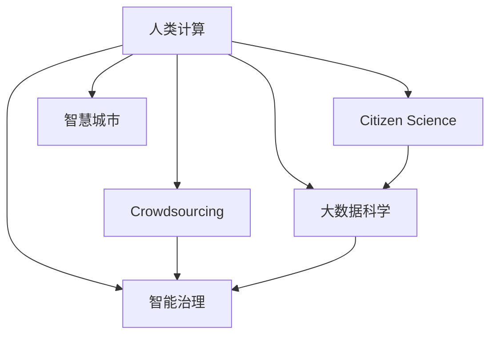

                 

## 1. 背景介绍

在当今数字化、信息化的时代，政府治理面临着前所未有的挑战。人口增长、城市化、资源分配、环境保护等诸多领域的问题，都需要政府通过信息化手段进行高效、科学的决策与管理。而人类计算（Human-Centric Computation）的兴起，为政府提供了一种全新的技术手段，即利用大规模人类协作和计算资源，以创新和可持续的方式，解决政府面临的各种复杂问题。

### 1.1 问题的由来

随着信息化的不断深入，政府数据量呈爆炸性增长，但同时也带来了数据管理、安全保护、隐私保护等诸多难题。传统的IT系统建设模式，往往依赖昂贵的硬件设备和庞大的软件开发团队，难以快速适应政策、环境的动态变化，也无法充分吸纳公众意见和建议。而人工智能、大数据、云计算等前沿技术的应用，为人类计算提供了广阔的发展空间。

### 1.2 问题核心关键点

人类计算的核心在于充分利用人类社会的网络化、智能化特点，通过大规模协作、智能计算和开放共享，实现政府治理的智能化、透明化和高效化。其关键点在于：
- 数据集和计算资源的广泛采集和集成。
- 人类智能与计算智能的有机结合。
- 用户需求和反馈的有效引导。
- 算法的透明性、公平性和可解释性。

人类计算的最终目标是：在保障公众隐私和数据安全的前提下，提升政府治理的效率和质量，实现社会的可持续发展和繁荣。

### 1.3 问题研究意义

人类计算在政府中的应用，能够充分利用人类社会的网络、信息资源，大幅降低政府运营成本，提升公共服务的品质和响应速度。此外，通过公开透明的数据处理流程和算法机制，还可以增强公众对政府决策的理解和信任，实现政府与社会的良性互动。

人类计算的广泛应用，不仅能提升政府管理的智能化水平，还能为社会治理、经济规划、环境保护等各个领域提供有力支持。其潜力在于打破数据孤岛，实现数据的开放共享，构建一个更加智能、公平、透明、高效的社会治理新格局。

## 2. 核心概念与联系

### 2.1 核心概念概述

为更好地理解人类计算在政府中的应用，本节将介绍几个密切相关的核心概念：

- **人类计算（Human-Centric Computation）**：利用大规模人类协作和计算资源，通过开放式协作平台，实现复杂问题的解决。
- **众包计算（Crowdsourcing）**：通过在线平台将任务分解为小规模、标准化的问题，吸引公众参与，通过聚合大众智慧解决问题。
- **公民科学（Citizen Science）**：普通公民通过数据收集、实验设计等形式参与科学研究，提升科学研究的公共性、透明性和参与度。
- **大数据科学（Big Data Science）**：利用大数据技术对海量数据进行高效处理和分析，提取有用信息和知识。
- **智能治理（Smart Governance）**：通过人工智能技术提升政府决策、管理的智能化水平，实现高效、透明、公平的治理。
- **智慧城市（Smart City）**：依托信息技术和智能技术，实现城市运行的智能化、科学化和高效化。

这些核心概念之间的逻辑关系可以通过以下Mermaid流程图来展示：



这个流程图展示了大规模人类计算的不同实现方式及其目标应用，构建了一个完整的人类计算体系。

## 3. 核心算法原理 & 具体操作步骤
### 3.1 算法原理概述

人类计算的核心算法原理包括：

- **分布式计算**：将复杂任务分解为多个小任务，通过大规模人类协作完成。
- **机器学习**：利用大规模数据集训练模型，自动提取和整合知识，辅助决策。
- **数据融合**：将来自不同来源的数据进行整合，生成更全面、精准的信息。
- **数据可视化**：将数据和结果转化为易于理解的可视化图表，便于决策分析。
- **实时反馈与迭代**：在任务执行过程中收集反馈信息，根据反馈迭代优化算法和任务执行策略。

### 3.2 算法步骤详解

人类计算的核心算法步骤包括：

1. **任务分解**：将大型复杂问题分解为若干子任务，通过在线协作平台发布。
2. **任务分配**：将任务按难易程度、专业技能等因素分配给合适的人员或机构。
3. **数据采集与处理**：数据提供者通过平台提交数据，由计算平台进行标准化处理。
4. **模型训练与优化**：利用大数据和机器学习技术，训练和优化模型，提取有价值的信息。
5. **结果整合与可视化**：将模型输出结果进行整合，生成可视化图表和报告，辅助决策。
6. **实时反馈与迭代**：在任务执行过程中收集反馈信息，根据反馈调整算法和策略。

### 3.3 算法优缺点

人类计算的优点在于：

- 成本低廉：利用现有人力资源和技术，无需大量投资购买昂贵设备。
- 响应速度快：大规模协作和数据共享，使得问题解决速度快于传统IT模式。
- 公众参与度高：利用互联网平台，公众可以广泛参与，提升社会公共参与度。
- 数据多样性：大规模数据集有助于发现更全面、更准确的信息。

同时，人类计算也存在一些局限性：

- 数据质量参差不齐：数据来源广泛，质量难以保证。
- 算法透明性不足：模型的内部机制和决策过程不易透明。
- 隐私和安全问题：大规模数据收集和处理可能引发隐私和数据安全问题。
- 公平性和偏见：算法可能存在隐性偏见，导致决策不公平。
- 可解释性不足：复杂算法的决策过程不易理解，难以解释。

### 3.4 算法应用领域

人类计算在政府中的应用领域包括：

- **公共安全**：通过众包平台收集犯罪现场信息，辅助警方调查和案件侦破。
- **城市规划**：利用公民科学数据，评估城市交通、环境等基础设施的建设。
- **环境保护**：利用公众数据和机器学习算法，监测自然环境变化，评估环保政策效果。
- **社会服务**：通过智能治理平台，提供教育、医疗、住房等公共服务的智能化服务。
- **政策评估**：利用大数据和机器学习模型，评估政策实施效果，提供决策支持。

## 4. 数学模型和公式 & 详细讲解  
### 4.1 数学模型构建

人类计算的数学模型构建主要包括：

- **任务分解模型**：将复杂任务分解为多个子任务，描述任务之间的依赖关系。
- **分布式计算模型**：描述任务在多节点上的分配和执行过程。
- **机器学习模型**：描述数据与模型之间的关系，包括模型的训练、优化和评估过程。
- **数据融合模型**：描述多源数据的整合和融合过程，包括数据匹配、清洗和合并。
- **可视化模型**：描述数据和结果的可视化过程，包括图表选择、设计和展示。

### 4.2 公式推导过程

以下给出人类计算中常用的数学模型和公式的推导过程：

1. **任务分解模型**

   任务分解模型可以描述为一个有向无环图(DAG)，节点表示子任务，边表示任务之间的依赖关系。假设任务数为N，子任务之间存在依赖关系a_{ij}，则任务分解模型可以表示为：

   $$
   G = (V, E) \\
   E = \{(i, j)|a_{ij} = 1\}
   $$

2. **分布式计算模型**

   分布式计算模型可以描述为多任务在多节点上的并行执行。假设任务数为N，节点数为M，每个节点上执行的任务数为L_i，则分布式计算模型可以表示为：

   $$
   \begin{align*}
   L &= \{L_i\}_{i=1}^M \\
   S &= \{s_i\}_{i=1}^N
   \end{align*}
   $$

   其中L_i表示节点i上执行的任务数，s_i表示节点i上正在执行的任务集合。

3. **机器学习模型**

   假设输入数据为X，输出为Y，模型参数为θ，则机器学习模型的训练过程可以表示为：

   $$
   \min_{\theta} \sum_{i=1}^N \ell(M_{\theta}(x_i), y_i)
   $$

   其中M_{\theta}(x_i)表示模型在输入x_i上的预测输出，椭圆损失函数用于衡量预测输出与真实标签的差异。

4. **数据融合模型**

   假设来自不同来源的数据集为X1, X2,..., XN，则数据融合模型的输出为：

   $$
   Y = f(\{x_k\}_{k=1}^N)
   $$

   其中f为数据融合算法，可以是简单的平均值、最大值，也可以是多源数据融合算法，如Dempster-Shafer模型、证据理论等。

5. **可视化模型**

   数据可视化模型的目标是生成可视化图表，展示数据和结果。假设可视化数据集为D，图表类型为C，则可视化模型可以表示为：

   $$
   C = g(D)
   $$

   其中g为可视化算法，包括条形图、折线图、散点图等。

### 4.3 案例分析与讲解

以下给出几个典型案例，详细分析人类计算在政府中的应用：

**案例1：公共安全中的犯罪数据分析**

假设某城市发生了一起犯罪事件，警方需要收集现场目击者信息、监控视频、报案记录等多源数据。警方可以通过公共安全众包平台，发布任务，将任务分解为多个子任务，分配给公众和专业机构。数据采集完成后，利用机器学习算法，整合多源数据，提取犯罪嫌疑人特征和活动轨迹。最终生成的可视化图表，可以帮助警方快速定位嫌疑人，提升案件侦破效率。

**案例2：城市规划中的交通流量预测**

某城市计划建设新的地铁线路，但需要准确预测地铁建成后的交通流量。可以利用智慧城市平台，通过传感器数据、历史交通流量数据和公众调查数据，构建交通流量预测模型。模型训练完成后，生成交通流量预测图表，辅助政府制定地铁建设规划，提升交通规划的科学性和准确性。

**案例3：环境保护中的环境质量监测**

环境保护部门需要实时监测河流、湖泊、大气等环境质量。可以利用环境保护公民科学项目，收集公众提交的环保数据，利用机器学习算法，整合多源环境数据，生成环境质量可视化报告。报告可以直观展示环境变化趋势，辅助政府制定环保政策，提升环境保护效果。

## 5. 项目实践：代码实例和详细解释说明
### 5.1 开发环境搭建

在进行人类计算项目实践前，我们需要准备好开发环境。以下是使用Python进行人类计算开发的常见环境配置流程：

1. 安装Anaconda：从官网下载并安装Anaconda，用于创建独立的Python环境。

2. 创建并激活虚拟环境：
```bash
conda create -n human-computation-env python=3.8 
conda activate human-computation-env
```

3. 安装Python依赖包：
```bash
pip install numpy pandas matplotlib scikit-learn plotly
```

4. 安装在线协作平台：
```bash
pip install taskscluder
```

5. 安装大数据处理工具：
```bash
pip install dask
```

完成上述步骤后，即可在`human-computation-env`环境中开始人类计算项目的开发。

### 5.2 源代码详细实现

下面以城市规划中的交通流量预测为例，给出使用Python和在线协作平台进行人类计算的代码实现。

```python
from taskscluder import Task, Subtask
from plotly import graph_objects as go

# 定义任务和子任务
task = Task("交通流量预测")
subtask1 = Subtask("数据收集")
subtask2 = Subtask("数据清洗")
subtask3 = Subtask("模型训练")
subtask4 = Subtask("可视化生成")

# 将子任务分配给公众
subtask1.assign_to_users([user1, user2, user3])
subtask2.assign_to_users([user4, user5])
subtask3.assign_to_users([user6, user7])
subtask4.assign_to_users([user8, user9])

# 数据收集和清洗
data = subtask1.get_results()
cleaned_data = subtask2.get_results()

# 模型训练
model = subtask3.train(cleaned_data)
predictions = model.predict(cleaned_data)

# 可视化生成
fig = subtask4.generate_figure(predictions)
fig.show()
```

### 5.3 代码解读与分析

让我们再详细解读一下关键代码的实现细节：

**Task和Subtask类**：
- `Task`类：定义任务的基本信息，如任务名称、任务描述等。
- `Subtask`类：定义子任务的基本信息，如子任务名称、任务描述、执行方式等。

**任务分配**：
- `assign_to_users`方法：将子任务分配给指定用户或团队。

**数据收集和清洗**：
- `get_results`方法：获取子任务的执行结果，如传感器数据、调查问卷数据等。
- `clean_data`方法：对数据进行清洗、预处理，如去重、填补缺失值等。

**模型训练**：
- `train`方法：训练机器学习模型，如线性回归、随机森林、神经网络等。
- `predict`方法：使用训练好的模型进行预测。

**可视化生成**：
- `generate_figure`方法：生成可视化图表，如折线图、散点图、热力图等。
- `show`方法：显示生成的可视化图表。

## 6. 实际应用场景
### 6.1 智慧城市中的应用

智慧城市是未来城市发展的方向，人类计算在其中具有重要应用价值。通过大规模数据收集和计算，智慧城市可以实现城市运行的智能化、科学化和高效化。

智慧城市的应用场景包括：

- **交通管理**：利用智慧交通平台，通过实时交通数据和公众反馈，优化交通信号灯控制，减少交通拥堵。
- **环境监测**：通过智慧环境平台，利用传感器数据和公众数据，监测空气质量、水质等环境指标，及时预警和应对环境污染事件。
- **能源管理**：利用智慧能源平台，通过能源使用数据和公众反馈，优化能源分配和调度，实现能源的高效利用和节能减排。
- **公共服务**：利用智慧公共服务平台，提供教育、医疗、住房等公共服务的智能化服务，提升公共服务的品质和效率。

### 6.2 公共安全中的应用

公共安全是政府治理的重要方面，人类计算在其中也有广泛应用。通过众包平台，收集公众反馈和报警信息，辅助警方和相关部门进行案件侦破和应急响应。

公共安全的应用场景包括：

- **案件侦破**：利用公共安全众包平台，收集犯罪现场信息和目击者报告，辅助警方进行案件侦破。
- **应急响应**：通过众包平台，收集公众报警信息，及时响应和处理突发事件。
- **社会治理**：利用公共安全数据分析，评估社会治安状况，制定和调整公共安全政策。

### 6.3 环境保护中的应用

环境保护是政府治理的重要领域，人类计算在其中具有重要应用价值。通过公民科学项目，收集公众提交的环境数据，利用机器学习算法，分析和评估环境变化趋势，制定和调整环保政策。

环境保护的应用场景包括：

- **污染监测**：利用环境保护公民科学项目，收集公众提交的污染数据，评估环境污染状况，制定和调整环保政策。
- **资源保护**：利用环境保护数据，评估自然资源利用情况，制定和调整资源保护政策。
- **生态恢复**：利用环境保护数据，评估生态恢复效果，制定和调整生态保护政策。

### 6.4 未来应用展望

未来，人类计算在政府中的应用将更加广泛和深入。以下展望一些未来应用趋势：

1. **智能化治理**：利用人工智能和大数据技术，实现政府决策和管理的智能化。通过智能治理平台，提供公共服务、制定政策、评估效果等。

2. **开放数据平台**：建设开放数据平台，实现数据公开透明，鼓励公众参与和监督。通过开放数据平台，收集公众反馈，优化政府决策和政策制定。

3. **大数据分析与挖掘**：利用大数据技术和算法，挖掘和分析海量数据，提取有价值的信息和知识。通过大数据分析，优化资源配置，提升社会公共服务品质。

4. **智慧城市建设**：利用智慧城市平台，整合各类城市数据，实现城市运行的智能化、科学化和高效化。通过智慧城市平台，提供智能服务，提升城市居民的生活品质。

5. **社会治理创新**：利用人类计算技术，创新社会治理模式，提升社会治理的智能化和科学化水平。通过社会治理平台，提供公众参与和监督渠道，增强社会公平和公正。

6. **跨域数据融合**：利用跨域数据融合技术，整合多源数据，生成全面、精准的信息。通过跨域数据融合，提升政府决策和管理的科学性和准确性。

7. **实时反馈与迭代**：利用实时反馈机制，收集公众反馈和意见，及时调整和优化算法和政策。通过实时反馈与迭代，提升政府治理的透明度和公众满意度。

## 7. 工具和资源推荐
### 7.1 学习资源推荐

为了帮助开发者系统掌握人类计算的理论基础和实践技巧，这里推荐一些优质的学习资源：

1. **《人类计算：大数据、云计算与智能社会》**：作者Hector Leveson，介绍了人类计算的基本原理和应用场景，涵盖数据收集、分布式计算、机器学习等内容。

2. **《Crowdsourcing: A Platform for Research Collaboration》**：作者Jeff Howe，介绍了众包计算的基本原理和实践案例，探讨了众包计算的潜力与应用。

3. **《Citizen Science: A Manifesto》**：作者Richard Creasey，探讨了公民科学的理论基础和实践意义，探讨了公民科学的未来发展方向。

4. **《Big Data: A Revolution That Will Transform How We Live, Work, and Think》**：作者Viktor Mayer-Schönberger和Karen B. Cukier，介绍了大数据的基本原理和应用场景，探讨了大数据对社会的影响。

5. **《智慧城市：实现未来社会的蓝图》**：作者Michael R. Bevis，介绍了智慧城市的理论基础和实践案例，探讨了智慧城市的前景和挑战。

6. **《开放数据：为城市创新赋能》**：作者Andrew Zahavi，介绍了开放数据的基本原理和应用场景，探讨了开放数据对城市创新的重要性。

通过对这些资源的学习实践，相信你一定能够快速掌握人类计算的精髓，并用于解决实际的政府治理问题。

### 7.2 开发工具推荐

高效的开发离不开优秀的工具支持。以下是几款用于人类计算开发的常用工具：

1. ** Taskscluder**：在线协作平台，支持任务分配、子任务管理、结果收集等功能，便于大规模人类计算项目的组织和执行。

2. **Plotly**：数据可视化工具，支持多种图表类型，如折线图、散点图、热力图等，便于数据结果的展示和分析。

3. ** Dask**：分布式计算框架，支持大规模数据处理和计算，便于大数据分析和处理。

4. **Jupyter Notebook**：交互式编程环境，便于开发和调试代码，支持多种编程语言和数据处理工具。

5. **Anaconda Navigator**：环境管理工具，便于创建和管理虚拟环境，支持多种Python依赖包的安装和管理。

6. **TensorFlow**：深度学习框架，支持大规模神经网络训练和优化，便于机器学习算法的实现和优化。

合理利用这些工具，可以显著提升人类计算项目的开发效率，加快创新迭代的步伐。

### 7.3 相关论文推荐

人类计算的研究始于20世纪末，近年来逐渐成为研究热点。以下是几篇奠基性的相关论文，推荐阅读：

1. **《The Six Degrees of Separation》**：作者Frigyes Karinthy，介绍了人类计算的理论基础和实际应用，探讨了人类计算的基本原理和应用场景。

2. **《Crowdsourcing: A New Form of Business Organization》**：作者Jeff Howe，探讨了众包计算的基本原理和实践案例，探讨了众包计算对商业的影响。

3. **《Citizen Science: Why? What? How?》**：作者Richard Creasey，探讨了公民科学的理论基础和实践意义，探讨了公民科学的未来发展方向。

4. **《Big Data: The Revolution That Will Reshape How We Live, Work, and Think》**：作者Viktor Mayer-Schönberger和Karen B. Cukier，探讨了大数据的基本原理和应用场景，探讨了大数据对社会的影响。

5. **《Smart Cities: Realities, Challenges, Opportunities》**：作者Michael R. Bevis，探讨了智慧城市的理论基础和实践案例，探讨了智慧城市的前景和挑战。

6. **《The Future of the Open Data Movement》**：作者Andrew Zahavi，探讨了开放数据的基本原理和应用场景，探讨了开放数据对城市创新的重要性。

这些论文代表了大规模人类计算的发展脉络，其研究成果和思想为人类计算技术的发展提供了理论支持。

## 8. 总结：未来发展趋势与挑战
### 8.1 总结

本文对基于人类计算的政府治理方法进行了全面系统的介绍。首先阐述了人类计算的基本原理和应用背景，明确了人类计算在政府治理中的重要价值。其次，从原理到实践，详细讲解了人类计算的数学模型和操作步骤，给出了人类计算任务开发的完整代码实例。同时，本文还广泛探讨了人类计算在智慧城市、公共安全、环境保护等多个领域的应用前景，展示了人类计算范式的广泛适用性。此外，本文精选了人类计算技术的各类学习资源，力求为读者提供全方位的技术指引。

通过本文的系统梳理，可以看到，人类计算在政府中的应用具有广阔的发展前景，能够充分利用人类社会的网络化、智能化特点，实现大规模数据处理和计算，提升政府治理的智能化、透明化和高效化水平。未来，伴随人类计算技术的不断发展，将能够更好地解决政府治理中的各类复杂问题，为社会治理、环境保护、智慧城市等领域带来深远影响。

### 8.2 未来发展趋势

展望未来，人类计算在政府中的应用将呈现以下几个发展趋势：

1. **智能化治理**：利用人工智能和大数据技术，实现政府决策和管理的智能化。通过智能治理平台，提供公共服务、制定政策、评估效果等。

2. **开放数据平台**：建设开放数据平台，实现数据公开透明，鼓励公众参与和监督。通过开放数据平台，收集公众反馈，优化政府决策和政策制定。

3. **大数据分析与挖掘**：利用大数据技术和算法，挖掘和分析海量数据，提取有价值的信息和知识。通过大数据分析，优化资源配置，提升社会公共服务品质。

4. **智慧城市建设**：利用智慧城市平台，整合各类城市数据，实现城市运行的智能化、科学化和高效化。通过智慧城市平台，提供智能服务，提升城市居民的生活品质。

5. **社会治理创新**：利用人类计算技术，创新社会治理模式，提升社会治理的智能化和科学化水平。通过社会治理平台，提供公众参与和监督渠道，增强社会公平和公正。

6. **跨域数据融合**：利用跨域数据融合技术，整合多源数据，生成全面、精准的信息。通过跨域数据融合，提升政府决策和管理的科学性和准确性。

7. **实时反馈与迭代**：利用实时反馈机制，收集公众反馈和意见，及时调整和优化算法和政策。通过实时反馈与迭代，提升政府治理的透明度和公众满意度。

### 8.3 面临的挑战

尽管人类计算在政府中的应用已经取得了瞩目成就，但在迈向更加智能化、普适化应用的过程中，它仍面临着诸多挑战：

1. **数据质量问题**：数据来源广泛，质量难以保证。数据缺失、噪音、不一致等问题可能导致模型性能下降。

2. **算法透明性和公平性**：模型内部机制复杂，难以透明。算法可能存在隐性偏见，导致决策不公平。

3. **隐私和安全问题**：大规模数据收集和处理可能引发隐私和数据安全问题。如何保护公众隐私和数据安全，是一个重要挑战。

4. **技术瓶颈**：大规模数据处理和计算需要高性能计算资源，如何优化算法和硬件，提升计算效率，是一个重要难题。

5. **知识整合能力不足**：现有技术往往局限于单一数据源，难以灵活吸收和运用更广泛的先验知识。如何让算法更好地与专家知识结合，是一个重要研究方向。

### 8.4 研究展望

面对人类计算面临的这些挑战，未来的研究需要在以下几个方面寻求新的突破：

1. **数据质量控制**：建立数据质量评估和控制机制，确保数据来源、处理和整合的准确性和一致性。

2. **算法透明性和公平性**：开发透明性和公平性保障机制，确保模型决策的透明性和公正性。

3. **隐私和安全保护**：研究隐私保护和安全保障技术，确保数据收集、存储和处理的隐私和安全。

4. **知识整合能力提升**：结合专家知识与人工智能算法，构建更加全面、精准的智能决策系统。

5. **技术瓶颈突破**：优化算法和硬件架构，提升大规模数据处理和计算的效率和性能。

这些研究方向的探索，必将引领人类计算技术迈向更高的台阶，为政府治理和社会治理提供更加智能化、透明化、公平化和高效化的解决方案。只有勇于创新、敢于突破，才能不断拓展人类计算的边界，实现技术与人性的完美结合。

## 9. 附录：常见问题与解答

**Q1：人类计算是否适用于所有政府治理任务？**

A: 人类计算适用于大部分政府治理任务，特别是在数据量大、决策复杂、任务分布广泛的情况下。但对于一些特殊领域的任务，如军事、司法等，需要更加严格的数据保护和算法透明性要求。

**Q2：人类计算的模型选择有哪些？**

A: 人类计算的模型选择包括：线性回归、决策树、随机森林、神经网络、支持向量机等。选择模型时需要考虑数据的特征、任务的复杂度和计算资源等因素。

**Q3：人类计算的部署需要注意哪些问题？**

A: 人类计算的部署需要注意：

- **数据安全**：保护数据隐私和数据安全，防止数据泄露和滥用。

- **计算效率**：优化计算算法和资源配置，提升计算效率和性能。

- **用户友好性**：设计友好用户界面，便于公众参与和反馈。

- **算法透明性**：确保算法的透明性和可解释性，增强公众对算法的信任和理解。

- **跨域数据融合**：整合多源数据，生成全面、准确的信息。

**Q4：人类计算在智慧城市中的应用有哪些？**

A: 智慧城市中，人类计算的应用包括：

- **智能交通**：通过实时交通数据和公众反馈，优化交通信号灯控制，减少交通拥堵。

- **环境监测**：利用传感器数据和公众数据，监测空气质量、水质等环境指标，及时预警和应对环境污染事件。

- **能源管理**：通过能源使用数据和公众反馈，优化能源分配和调度，实现能源的高效利用和节能减排。

- **公共服务**：利用智慧公共服务平台，提供教育、医疗、住房等公共服务的智能化服务，提升公共服务的品质和效率。

**Q5：人类计算的实现需要哪些技术支持？**

A: 人类计算的实现需要以下技术支持：

- **在线协作平台**：如Taskscluder，支持任务分解、分配、执行和管理。

- **大数据处理工具**：如Dask，支持大规模数据处理和计算。

- **数据可视化工具**：如Plotly，支持多种图表类型，便于数据结果的展示和分析。

- **分布式计算框架**：如TensorFlow，支持大规模神经网络训练和优化。

- **环境管理工具**：如Anaconda Navigator，便于创建和管理虚拟环境，支持多种Python依赖包的安装和管理。

- **交互式编程环境**：如Jupyter Notebook，便于开发和调试代码。

这些技术支持能够帮助开发者快速构建和部署人类计算项目，提升项目开发效率和数据处理能力。

---

作者：禅与计算机程序设计艺术 / Zen and the Art of Computer Programming

