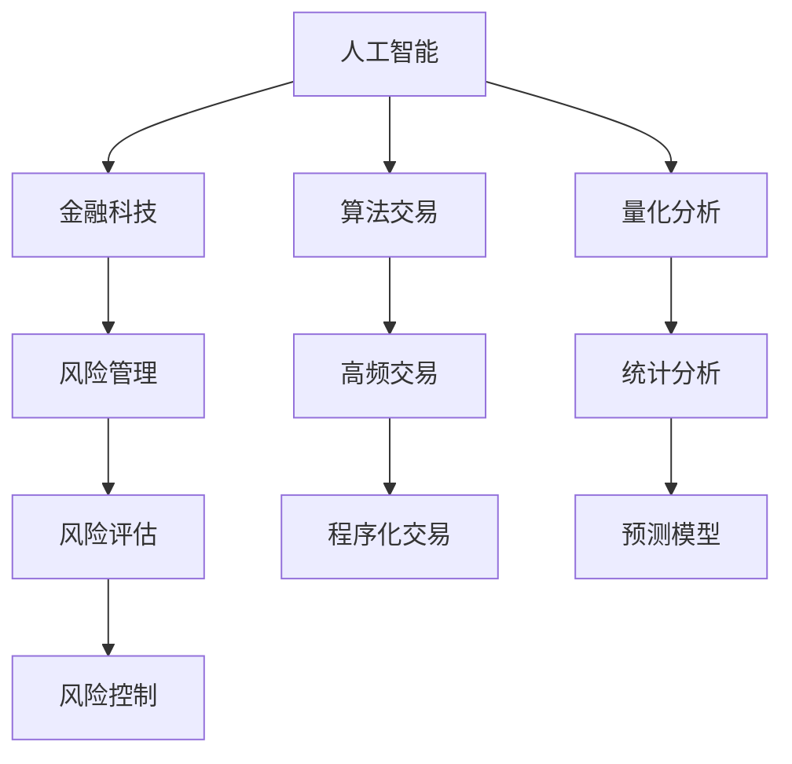

                 

# AI驱动的创新：人类计算在金融中的应用

> 关键词：人工智能,金融科技,机器学习,算法交易,风险管理,量化分析

## 1. 背景介绍

### 1.1 问题由来

金融行业长期以来一直依赖传统的人类计算，包括定期的数据分析和复杂的数学模型计算，这使得行业运营效率受到极大限制。近年来，随着人工智能技术的快速发展，特别是深度学习、机器学习等技术在金融领域的应用，使得金融计算和决策过程变得更加智能和高效。通过人工智能技术，金融行业可以更快、更准确地处理大量数据，优化投资策略，降低风险，提升客户体验。

### 1.2 问题核心关键点

人工智能技术在金融中的应用核心在于其处理大量数据和复杂模型的能力。利用机器学习算法，可以从历史数据中提取有价值的模式，预测未来市场走势，辅助决策者做出更加精准的投资决策。此外，基于深度学习的算法交易和量化分析方法，可以在毫秒级别进行高频交易，显著提升投资收益。然而，这些技术应用的同时也带来了数据隐私、模型鲁棒性等挑战。

### 1.3 问题研究意义

人工智能技术在金融中的应用，不仅能够提升金融服务的效率和质量，还能够推动金融创新，带来新的业务模式和增长点。具体研究意义包括：

1. **提升运营效率**：利用AI自动化金融流程，减少人工干预，提高服务效率。
2. **优化投资决策**：基于大数据和机器学习模型的投资决策更加科学和准确。
3. **降低风险管理**：实时监控和分析市场数据，及时发现风险并采取应对措施。
4. **增强客户体验**：通过智能客服、个性化推荐等手段，提升客户满意度和忠诚度。
5. **推动业务创新**：AI驱动的金融产品和服务，如智能投顾、智能合约等，为金融创新带来新的思路和机会。

## 2. 核心概念与联系

### 2.1 核心概念概述

为了更好地理解人工智能技术在金融中的应用，本文将介绍几个关键概念：

- **人工智能**：利用计算机模拟和实现人类智能，通过机器学习、深度学习、自然语言处理等技术，使计算机具备类似人类的认知能力。
- **金融科技**：以金融服务创新为核心，通过技术手段提升金融服务的效率、可访问性和安全性。
- **算法交易**：利用计算机程序自动进行金融产品的买卖操作，以获取交易利润。
- **量化分析**：通过数学和统计学方法，对金融市场和金融产品进行量化研究和分析。
- **风险管理**：通过模型和算法对金融风险进行评估、预测和控制。
- **深度学习**：一种基于神经网络的机器学习技术，可以处理大规模的非结构化数据，具备很强的非线性拟合能力。

这些概念之间的逻辑关系可以通过以下Mermaid流程图来展示：



这个流程图展示了一系列概念之间的联系：

1. 人工智能技术为金融科技提供技术支持。
2. 算法交易和量化分析是人工智能在金融领域的具体应用。
3. 风险管理利用人工智能技术提升决策精准性。
4. 高频交易和程序化交易通过算法实现。
5. 统计分析和预测模型是量化分析的重要组成部分。
6. 风险评估和控制是风险管理的核心内容。

## 3. 核心算法原理 & 具体操作步骤

### 3.1 算法原理概述

人工智能在金融中的应用，通常采用监督学习、无监督学习、强化学习等机器学习算法。其中，监督学习是应用最为广泛的一种方式。监督学习通过给定有标签的数据集，训练模型进行预测或分类。

在金融领域，常用的监督学习算法包括线性回归、决策树、支持向量机、随机森林、神经网络等。这里以神经网络为例，介绍基于监督学习的人工智能在金融中的应用。

神经网络是一种模拟人脑神经元的网络结构，通过多层神经元的组合，实现复杂的模式识别和分类任务。在金融领域，神经网络可以用于股票价格预测、信用风险评估、金融市场预测等任务。

### 3.2 算法步骤详解

基于监督学习的人工智能在金融中的应用通常包括以下几个步骤：

**Step 1: 数据准备**

- 收集金融市场的历史数据、交易数据、公司财务数据等，准备用于模型训练的数据集。
- 对数据进行清洗、归一化等预处理操作，确保数据质量和一致性。

**Step 2: 模型构建**

- 选择合适的神经网络架构，如卷积神经网络、循环神经网络、注意力机制等，根据具体任务需求进行模型设计。
- 定义损失函数和优化器，选择合适的损失函数（如均方误差、交叉熵等）和优化算法（如梯度下降、Adam等）。

**Step 3: 模型训练**

- 将数据集划分为训练集和测试集，使用训练集数据进行模型训练。
- 在每个epoch中，前向传播计算损失函数，反向传播更新模型参数。
- 使用验证集进行模型性能评估，避免过拟合。

**Step 4: 模型评估**

- 使用测试集评估模型性能，计算准确率、召回率、F1分数等指标。
- 对模型进行优化，调整超参数、改进模型结构，提升模型精度。

**Step 5: 模型部署**

- 将训练好的模型部署到生产环境，实现实时预测和决策。
- 实时监控模型性能，进行模型更新和维护。

### 3.3 算法优缺点

基于监督学习的人工智能在金融中的应用具有以下优点：

- **精度高**：通过大规模数据训练，模型能够捕捉复杂的非线性关系，提升预测精度。
- **适应性强**：能够适应不同类型的金融数据和任务，具有较好的泛化能力。
- **自动化程度高**：通过算法自动化处理大量数据和复杂模型，减少人工干预。

然而，这些算法也存在一些缺点：

- **数据依赖性强**：需要大量高质量标注数据进行训练，数据获取成本高。
- **模型复杂度高**：神经网络模型结构复杂，难以解释和调试。
- **需要专业知识**：开发和维护模型需要较强的数据科学和机器学习背景。

### 3.4 算法应用领域

基于监督学习的人工智能在金融领域的应用非常广泛，具体包括：

- **股票价格预测**：利用历史股价数据和相关因素，训练模型预测未来股价走势。
- **信用风险评估**：通过分析借款人的信用记录、财务数据等，预测其还款能力。
- **金融市场预测**：分析市场数据，预测市场走势，辅助投资者决策。
- **算法交易**：基于机器学习模型，实现高频交易和程序化交易。
- **量化投资**：通过量化分析，优化投资组合，提升收益。
- **智能投顾**：基于自然语言处理和机器学习，实现个性化投资建议。
- **风险管理**：利用模型预测金融风险，及时采取应对措施。

## 4. 数学模型和公式 & 详细讲解 & 举例说明

### 4.1 数学模型构建

在本节中，我们将以线性回归模型为例，介绍金融领域的监督学习模型构建方法。

假设我们有一个金融市场的数据集，其中包含n个样本，每个样本有p个特征变量x和一个标签y。我们的目标是找到一个线性回归模型，使得预测值y_hat与真实值y尽可能接近。数学表达式如下：

$$
y_{hat} = \theta_0 + \theta_1 x_1 + \theta_2 x_2 + ... + \theta_p x_p
$$

其中，$\theta$为模型参数。

### 4.2 公式推导过程

在线性回归中，我们通常使用均方误差（Mean Squared Error, MSE）作为损失函数，其表达式为：

$$
MSE = \frac{1}{n} \sum_{i=1}^{n} (y_i - y_{hat_i})^2
$$

我们需要最小化MSE，即：

$$
\mathop{\min}_{\theta} MSE(\theta)
$$

通过求导，可以得到最优参数$\theta$的表达式：

$$
\theta = (X^T X)^{-1} X^T y
$$

其中，$X$为样本的特征矩阵，$y$为样本的标签向量。

### 4.3 案例分析与讲解

假设我们有一个金融市场数据集，其中包含100个样本，每个样本有4个特征变量，分别是收盘价、成交量、市盈率、市净率。我们想预测未来一个月的股价变化率。

我们可以使用线性回归模型进行预测，首先对数据进行标准化处理，然后构建特征矩阵$X$和标签向量$y$。假设使用随机梯度下降（Stochastic Gradient Descent, SGD）算法进行模型训练，定义损失函数为均方误差。

训练过程中，每次随机抽取一个样本，计算梯度并更新模型参数。最终得到最优模型参数$\theta$，用于预测新样本的股价变化率。

## 5. 项目实践：代码实例和详细解释说明

### 5.1 开发环境搭建

在开始项目实践之前，我们需要准备好开发环境。以下是使用Python进行TensorFlow开发的常见环境配置流程：

1. 安装Anaconda：从官网下载并安装Anaconda，用于创建独立的Python环境。

2. 创建并激活虚拟环境：
```bash
conda create -n tf-env python=3.8 
conda activate tf-env
```

3. 安装TensorFlow：根据CUDA版本，从官网获取对应的安装命令。例如：
```bash
conda install tensorflow -c pytorch -c conda-forge
```

4. 安装各类工具包：
```bash
pip install numpy pandas scikit-learn matplotlib tqdm jupyter notebook ipython
```

完成上述步骤后，即可在`tf-env`环境中开始项目实践。

### 5.2 源代码详细实现

以下是使用TensorFlow进行线性回归模型开发的完整代码实现。

```python
import tensorflow as tf
import numpy as np
from sklearn.model_selection import train_test_split

# 准备数据
X = np.random.rand(100, 4)  # 特征矩阵
y = np.random.rand(100)     # 标签向量

# 分割数据集
X_train, X_test, y_train, y_test = train_test_split(X, y, test_size=0.2)

# 定义模型
def linear_regression(X, y, learning_rate=0.01, epochs=100):
    theta = tf.Variable(tf.zeros([X.shape[1], 1]))
    mse = tf.reduce_mean(tf.square(y - tf.matmul(X, theta)))

    optimizer = tf.train.GradientDescentOptimizer(learning_rate)
    train_op = optimizer.minimize(mse)

    with tf.Session() as sess:
        sess.run(tf.global_variables_initializer())

        for epoch in range(epochs):
            _, mse_value = sess.run([train_op, mse])
            if epoch % 10 == 0:
                print("Epoch {0}, MSE: {1}".format(epoch, mse_value))

        return sess.run(theta)

# 训练模型
theta = linear_regression(X_train, y_train)

# 评估模型
mse_test = tf.reduce_mean(tf.square(y_test - tf.matmul(X_test, theta)))
print("Test MSE: {0}".format(sess.run(mse_test)))
```

### 5.3 代码解读与分析

让我们再详细解读一下关键代码的实现细节：

**数据准备**：
- 使用numpy生成100个样本的随机数据，其中每个样本有4个特征变量。
- 使用sklearn的train_test_split方法将数据集划分为训练集和测试集。

**模型定义**：
- 定义一个线性回归模型，其中theta为模型参数，mse为均方误差。
- 定义优化器为随机梯度下降算法，训练操作为optimizer.minimize(mse)。
- 在会话中初始化全局变量，进行模型训练。

**训练模型**：
- 调用linear_regression函数，训练模型参数theta。
- 在每个epoch结束时，输出均方误差mse_value。

**评估模型**：
- 计算测试集上的均方误差mse_test，并输出结果。

通过这段代码，我们可以理解TensorFlow实现线性回归模型的基本流程。当然，实际的金融项目中，数据获取、模型训练和评估会更加复杂，需要更加细致和专业的处理。

## 6. 实际应用场景

### 6.1 智能投顾系统

智能投顾系统利用人工智能技术，通过分析客户财务状况、风险偏好等数据，为其提供个性化的投资建议和组合优化方案。通过自然语言处理和机器学习，智能投顾系统可以理解客户的投资需求，为其制定最优的投资策略。

在实际应用中，可以使用多层次神经网络模型，对客户数据进行分析和处理，提取有价值的信息，实现智能投顾服务。智能投顾系统还可以与外部金融数据接口进行对接，实时获取市场数据，提升决策的实时性和准确性。

### 6.2 算法交易系统

算法交易系统通过机器学习算法，自动进行高频交易和程序化交易，实现快速、精准的投资决策。算法交易系统可以处理海量的交易数据，实时分析市场走势，预测未来价格变化，自动执行买卖操作，获取交易利润。

在实际应用中，可以使用深度学习模型，如卷积神经网络、循环神经网络等，对历史交易数据进行分析，提取交易模式和规律，实现智能交易决策。此外，算法交易系统还可以与高频数据接口进行对接，获取毫秒级别的市场数据，进一步提升交易效率和收益。

### 6.3 信用风险评估系统

信用风险评估系统通过机器学习算法，分析借款人的信用记录、财务数据等，预测其还款能力和信用风险。信用风险评估系统可以实时监控借款人的还款行为，评估其信用状况，及时发现违约风险，采取相应的风险控制措施。

在实际应用中，可以使用随机森林、支持向量机等算法，对借款人数据进行分析，提取有价值的特征，构建信用风险评估模型。信用风险评估系统还可以与外部信用数据接口进行对接，获取更全面的信用信息，提升风险评估的准确性和可靠性。

### 6.4 金融市场预测系统

金融市场预测系统通过机器学习算法，分析市场数据，预测未来市场走势和交易机会。金融市场预测系统可以实时监控市场数据，提取重要的市场特征，预测未来的市场变化，辅助投资者进行投资决策。

在实际应用中，可以使用深度学习模型，如LSTM、GRU等，对历史市场数据进行分析，提取市场特征，构建预测模型。金融市场预测系统还可以与高频数据接口进行对接，获取实时市场数据，进一步提升预测的准确性和实时性。

### 6.5 风险管理预警系统

风险管理预警系统通过机器学习算法，分析市场数据和财务数据，预测金融风险，及时发出预警信号，辅助金融机构进行风险控制。风险管理预警系统可以实时监控市场数据和财务数据，评估金融风险，及时采取应对措施，降低风险损失。

在实际应用中，可以使用异常检测算法，如One-Class SVM、孤立森林等，对金融数据进行异常检测，发现潜在的风险点。风险管理预警系统还可以与外部金融数据接口进行对接，获取更全面的市场和财务信息，提升风险预警的准确性和可靠性。

## 7. 工具和资源推荐

### 7.1 学习资源推荐

为了帮助开发者系统掌握人工智能技术在金融中的应用，这里推荐一些优质的学习资源：

1. Coursera《Machine Learning for Trading》课程：由Coursera和Andrew Ng合作的课程，涵盖金融领域机器学习的基础知识和应用实践。

2. Udacity《Quantitative Analyst Nanodegree》项目：Udacity的金融量化分析师纳米学位项目，涵盖量化分析、算法交易、风险管理等金融领域的核心内容。

3. TensorFlow官方文档：TensorFlow的官方文档，提供了丰富的API参考和示例代码，是学习TensorFlow的重要资源。

4. Kaggle金融领域数据集：Kaggle提供的金融领域数据集，涵盖股票价格、信用数据、市场数据等，是进行金融领域机器学习项目的好资源。

5. QuantConnect平台：QuantConnect提供的开源交易平台，基于C#语言，提供丰富的金融数据接口和机器学习算法库，是进行金融量化交易的好工具。

通过对这些资源的学习实践，相信你一定能够快速掌握人工智能技术在金融领域的应用方法，并用于解决实际的金融问题。

### 7.2 开发工具推荐

高效的开发离不开优秀的工具支持。以下是几款用于人工智能在金融领域开发的常用工具：

1. Jupyter Notebook：轻量级的交互式开发环境，支持Python、R等语言，便于编写和调试代码。

2. PyCharm：由JetBrains开发的Python IDE，提供了丰富的代码编辑器、调试工具和插件支持，适合大型的金融项目开发。

3. TensorFlow：由Google主导开发的深度学习框架，支持分布式计算和GPU加速，适合大规模金融数据处理和模型训练。

4. Keras：基于TensorFlow的高级API，提供了简单易用的API接口，适合快速原型开发和模型实验。

5. Scikit-learn：Python的机器学习库，提供了丰富的机器学习算法和数据预处理工具，适合金融数据分析和模型构建。

6. Matplotlib和Seaborn：Python的数据可视化库，提供了丰富的图表绘制功能，适合金融数据可视化分析。

合理利用这些工具，可以显著提升人工智能在金融领域开发的效率，加快创新迭代的步伐。

### 7.3 相关论文推荐

人工智能技术在金融领域的应用源于学界的持续研究。以下是几篇奠基性的相关论文，推荐阅读：

1. "Machine Learning for Trading"（机器学习在金融交易中的应用）：由Machine Learning Year 2018系列文章集结而成，涵盖了机器学习在金融交易中的广泛应用。

2. "Quantitative Modeling and Hedge Fund Management"（量化模型与对冲基金管理）：Quantitative Finance的经典书籍，详细介绍了量化模型在金融领域的构建和应用。

3. "Artificial Intelligence in Finance"（人工智能在金融中的应用）：金融科技专家撰写，系统介绍了人工智能技术在金融领域的各种应用场景。

4. "Deep Learning in Credit Scoring: A Survey"（信用评分中的深度学习）：系统综述了深度学习在信用评分中的应用，分析了深度学习模型在信用风险评估中的优势和挑战。

5. "Alpha Trading with Deep Learning"（基于深度学习的阿尔法交易）：详细介绍了深度学习在算法交易中的应用，分析了深度学习模型在算法交易中的优势和挑战。

这些论文代表了大规模人工智能在金融领域的研究方向，通过学习这些前沿成果，可以帮助研究者把握学科前进方向，激发更多的创新灵感。

## 8. 总结：未来发展趋势与挑战

### 8.1 总结

本文对人工智能技术在金融中的应用进行了全面系统的介绍。首先阐述了人工智能技术在金融领域的背景和研究意义，明确了机器学习在金融计算和决策中的重要价值。其次，从原理到实践，详细讲解了机器学习在金融领域的具体应用，包括股票价格预测、信用风险评估、金融市场预测等，并提供了具体的代码实现。

通过本文的系统梳理，可以看到，人工智能技术在金融领域的应用已经取得了显著的成果，对提升金融服务的效率和质量、降低金融风险、提升客户体验等方面具有重要意义。未来，随着技术的不断进步和应用场景的拓展，人工智能在金融领域的应用将更加广泛和深入。

### 8.2 未来发展趋势

展望未来，人工智能技术在金融领域的发展趋势如下：

1. **深度学习的应用将更加广泛**：随着深度学习技术的不断进步，其在金融领域的应用也将更加广泛和深入，如基于深度学习的量化分析、信用风险评估等。

2. **模型解释性和透明度将提高**：随着金融监管的加强，模型解释性和透明度将成为重要指标。未来的金融应用将更加注重模型的可解释性，便于监管和审计。

3. **多模态数据融合将更加普遍**：传统的金融数据多为结构化数据，未来金融应用将更加注重多模态数据融合，如文本、图像、视频等多源数据的融合，提升金融模型的决策能力和鲁棒性。

4. **实时计算和处理能力将提升**：随着计算能力的提升，金融应用将更加注重实时计算和处理能力，支持高频交易、实时风险预警等场景。

5. **智能投顾将更加普及**：智能投顾系统将更加普及，通过自然语言处理和机器学习技术，提升客户体验和投资效率。

### 8.3 面临的挑战

尽管人工智能技术在金融领域的应用已经取得了显著的成果，但在迈向更加智能化、普适化应用的过程中，它仍面临着诸多挑战：

1. **数据隐私问题**：金融数据的隐私保护是重要挑战之一，需要采用隐私保护技术，如差分隐私、联邦学习等，确保数据安全。

2. **模型鲁棒性不足**：金融市场数据存在噪声和异常，模型的鲁棒性不足可能导致预测不准确，需要进一步优化模型鲁棒性。

3. **计算资源限制**：大规模金融数据的处理和计算需要高计算资源，当前计算资源仍面临限制，需要采用分布式计算、模型压缩等技术。

4. **模型解释性不足**：金融模型的复杂性和非线性可能导致解释性不足，需要采用可解释性技术，如LIME、SHAP等，提高模型的可解释性。

5. **监管合规问题**：金融领域的监管要求严格，需要确保模型的合规性，避免模型风险。

### 8.4 研究展望

面对人工智能技术在金融领域面临的挑战，未来的研究需要在以下几个方面寻求新的突破：

1. **隐私保护技术**：采用隐私保护技术，如差分隐私、联邦学习等，保护金融数据隐私。

2. **模型鲁棒性提升**：通过引入对抗训练、鲁棒性训练等方法，提升模型的鲁棒性，提高预测准确性。

3. **高效计算技术**：采用分布式计算、模型压缩等技术，优化计算资源利用，支持大规模金融数据处理和计算。

4. **可解释性增强**：采用可解释性技术，如LIME、SHAP等，提高金融模型的可解释性，增强模型的可信度。

5. **多源数据融合**：探索多源数据融合技术，提升金融模型的决策能力和鲁棒性，支持多模态数据融合。

6. **实时计算能力提升**：探索实时计算技术，支持高频交易、实时风险预警等场景，提高金融服务的实时性。

这些研究方向将推动人工智能在金融领域的应用走向更加成熟和深入，为金融行业带来更多的创新和发展机遇。

## 9. 附录：常见问题与解答

**Q1：人工智能在金融领域的应用前景如何？**

A: 人工智能在金融领域的应用前景广阔，能够显著提升金融服务的效率和质量，降低风险，提升客户体验。未来，随着技术的不断进步和应用场景的拓展，人工智能在金融领域的应用将更加广泛和深入。

**Q2：金融领域的数据隐私问题如何解决？**

A: 金融领域的数据隐私问题需要通过差分隐私、联邦学习等隐私保护技术来解决。差分隐私可以在数据共享过程中保护个体隐私，联邦学习可以在分布式环境下保护数据隐私，确保数据安全。

**Q3：人工智能模型在金融领域的应用过程中需要注意哪些问题？**

A: 人工智能模型在金融领域的应用过程中需要注意数据隐私、模型鲁棒性、计算资源、模型解释性等挑战。数据隐私问题需要通过隐私保护技术来解决，模型鲁棒性需要通过鲁棒性训练等方法来提升，计算资源限制需要通过分布式计算、模型压缩等技术来优化，模型解释性需要通过可解释性技术来增强。

**Q4：金融领域的人工智能应用有哪些实际案例？**

A: 金融领域的人工智能应用案例包括智能投顾系统、算法交易系统、信用风险评估系统、金融市场预测系统、风险管理预警系统等。智能投顾系统通过自然语言处理和机器学习技术，提升客户体验和投资效率。算法交易系统通过机器学习算法，实现高频交易和程序化交易，获取交易利润。信用风险评估系统通过机器学习算法，分析借款人数据，预测还款能力和信用风险。金融市场预测系统通过机器学习算法，分析市场数据，预测市场走势和交易机会。风险管理预警系统通过机器学习算法，分析市场和财务数据，评估金融风险，及时发出预警信号，辅助金融机构进行风险控制。

**Q5：人工智能在金融领域的应用是否存在风险？**

A: 人工智能在金融领域的应用存在一定的风险，如模型过拟合、模型鲁棒性不足、计算资源限制、模型解释性不足等。这些风险需要通过数据隐私保护、模型鲁棒性提升、高效计算技术、可解释性增强等方法来解决。此外，还需要考虑监管合规问题，确保模型符合监管要求，避免模型风险。

---

作者：禅与计算机程序设计艺术 / Zen and the Art of Computer Programming

