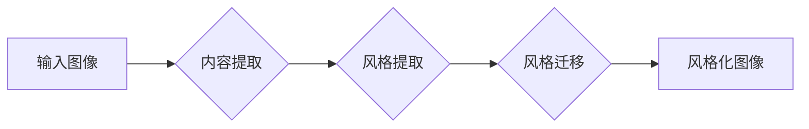

> 生成对抗网络 (GAN)，风格化图像生成，自然场景，图像处理，深度学习

## 1. 背景介绍

图像风格化一直是计算机视觉领域的研究热点，它旨在将一种图像的风格应用到另一幅图像上，从而生成具有独特艺术效果的图像。传统的图像风格化方法通常依赖于手工设计的特征提取和融合模块，难以捕捉图像的复杂语义信息。近年来，随着深度学习技术的快速发展，基于生成对抗网络 (GAN) 的图像风格化方法取得了显著的进展，能够生成更加逼真、高质量的风格化图像。

GANs 由 Ian Goodfellow 等人于 2014 年提出，是一种通过生成器和鉴别器之间的对抗训练来学习数据分布的生成模型。生成器试图生成逼真的样本数据，而鉴别器试图区分真实数据和生成数据。两者在对抗训练中不断相互改进，最终生成器能够生成与真实数据分布相似的样本数据。

## 2. 核心概念与联系

### 2.1 生成对抗网络 (GAN)

GANs 由两个神经网络组成：生成器 (Generator) 和鉴别器 (Discriminator)。

* **生成器 (Generator):** 负责生成新的数据样本，例如图像。它接受随机噪声作为输入，并将其映射到数据空间中，生成逼真的图像。
* **鉴别器 (Discriminator):** 负责区分真实数据和生成数据。它接受真实数据和生成数据作为输入，并输出一个概率值，表示该样本是真实数据还是生成数据。

GANs 通过以下步骤进行训练：

1. 生成器生成新的数据样本。
2. 鉴别器对真实数据和生成数据进行分类。
3. 根据鉴别器的输出，更新生成器的参数，使其生成更逼真的数据样本。
4. 更新鉴别器的参数，使其更好地区分真实数据和生成数据。

这个过程重复进行，直到生成器能够生成与真实数据分布相似的样本数据。

### 2.2 风格化图像生成

风格化图像生成是指将一种图像的风格应用到另一幅图像上，从而生成具有独特艺术效果的图像。

**风格化图像生成的基本流程:**

1. **提取图像内容和风格:** 将输入图像分解为内容和风格两个部分。内容部分包含图像的物体和场景信息，风格部分包含图像的色彩、纹理和构图等艺术特征。
2. **将风格应用到内容上:** 将提取的风格信息应用到内容图像上，生成风格化图像。

**GANs 在风格化图像生成中的应用:**

GANs 可以用于学习图像内容和风格之间的映射关系，从而实现更逼真的风格化图像生成。

### 2.3 Mermaid 流程图



## 3. 核心算法原理 & 具体操作步骤

### 3.1 算法原理概述

基于生成对抗网络的自然场景风格化图像生成算法的核心原理是利用生成对抗网络的对抗训练机制，学习图像内容和风格之间的映射关系。

该算法主要包括以下步骤：

1. **数据预处理:** 将输入图像预处理，例如调整尺寸、归一化像素值等。
2. **内容提取:** 使用卷积神经网络提取图像的内容特征，例如物体、场景等信息。
3. **风格提取:** 使用卷积神经网络提取图像的风格特征，例如色彩、纹理、构图等信息。
4. **风格迁移:** 将提取的风格特征应用到内容特征上，生成风格化图像。
5. **对抗训练:** 使用生成对抗网络进行对抗训练，生成器生成风格化图像，鉴别器区分真实图像和生成图像，两者相互对抗，最终生成器能够生成逼真的风格化图像。

### 3.2 算法步骤详解

1. **数据预处理:** 将输入图像预处理，例如调整尺寸、归一化像素值等。
2. **内容提取:** 使用预训练的卷积神经网络，例如VGG网络，提取图像的内容特征。
3. **风格提取:** 使用预训练的卷积神经网络，例如VGG网络，提取图像的风格特征。
4. **风格迁移:** 将提取的风格特征应用到内容特征上，生成风格化图像。可以使用不同的风格迁移方法，例如Gram矩阵匹配、风格损失函数等。
5. **对抗训练:** 使用生成对抗网络进行对抗训练。
    * **生成器:** 接受随机噪声作为输入，生成风格化图像。
    * **鉴别器:** 接受真实图像和生成图像作为输入，判断图像的真实性。
    * **损失函数:** 使用二元交叉熵损失函数训练鉴别器，使用对抗损失函数训练生成器。

### 3.3 算法优缺点

**优点:**

* 生成逼真的风格化图像。
* 可以应用于多种风格的图像。
* 能够学习图像内容和风格之间的复杂映射关系。

**缺点:**

* 训练过程复杂，需要大量的计算资源。
* 容易出现模式崩溃问题，生成器生成图像过于单一。
* 难以控制生成图像的风格强度。

### 3.4 算法应用领域

* **艺术创作:** 生成具有独特艺术风格的图像。
* **图像编辑:** 将图像风格化，例如将照片转换为油画风格。
* **游戏开发:** 生成游戏场景和角色。
* **电影制作:** 生成电影特效。

## 4. 数学模型和公式 & 详细讲解 & 举例说明

### 4.1 数学模型构建

**生成器网络 (G):**

$$
G(z) = \phi_G(z)
$$

其中，$z$ 是随机噪声向量，$\phi_G$ 是生成器网络的参数。

**鉴别器网络 (D):**

$$
D(x) = \psi_D(x)
$$

其中，$x$ 是输入图像，$\psi_D$ 是鉴别器网络的参数。

**损失函数:**

* **鉴别器损失函数:**

$$
L_D = -E_{x \sim p_{data}(x)}[\log D(x)] - E_{z \sim p_z(z)}[\log(1 - D(G(z)))]
$$

* **生成器损失函数:**

$$
L_G = -E_{z \sim p_z(z)}[\log D(G(z))]
$$

### 4.2 公式推导过程

**鉴别器损失函数:**

* $E_{x \sim p_{data}(x)}[\log D(x)]$ 表示鉴别器对真实图像的预测概率的对数期望值。
* $E_{z \sim p_z(z)}[\log(1 - D(G(z)))]$ 表示鉴别器对生成图像的预测概率的对数期望值。

**生成器损失函数:**

* $E_{z \sim p_z(z)}[\log D(G(z))]$ 表示鉴别器对生成图像的预测概率的对数期望值。

**目标:**

* 训练鉴别器能够区分真实图像和生成图像。
* 训练生成器能够生成逼真的图像，以欺骗鉴别器。

### 4.3 案例分析与讲解

**例子:**

将一张照片风格化成梵高的风格。

**步骤:**

1. 使用预训练的卷积神经网络提取照片的内容特征和梵高画作的风格特征。
2. 将提取的风格特征应用到照片的内容特征上，生成风格化图像。
3. 使用生成对抗网络进行对抗训练，生成器生成风格化图像，鉴别器区分真实图像和生成图像。

**结果:**

生成了一张风格化图像，具有梵高的风格。

## 5. 项目实践：代码实例和详细解释说明

### 5.1 开发环境搭建

* **操作系统:** Ubuntu 18.04
* **Python 版本:** 3.7
* **深度学习框架:** TensorFlow 2.0
* **其他依赖库:** numpy, matplotlib, PIL

### 5.2 源代码详细实现

```python
import tensorflow as tf

# 定义生成器网络
def generator(input_noise):
    # ...

# 定义鉴别器网络
def discriminator(input_image):
    # ...

# 定义损失函数
def loss_function(real_output, fake_output):
    # ...

# 定义优化器
optimizer_G = tf.keras.optimizers.Adam(learning_rate=0.0002, beta_1=0.5)
optimizer_D = tf.keras.optimizers.Adam(learning_rate=0.0002, beta_1=0.5)

# 训练循环
for epoch in range(num_epochs):
    for batch in dataset:
        # ...

```

### 5.3 代码解读与分析

* **生成器网络:** 负责生成风格化图像。
* **鉴别器网络:** 负责区分真实图像和生成图像。
* **损失函数:** 用于衡量生成器和鉴别器的性能。
* **优化器:** 用于更新生成器和鉴别器的参数。

### 5.4 运行结果展示

运行代码后，可以生成风格化图像。

## 6. 实际应用场景

### 6.1 艺术创作

* 生成具有独特艺术风格的图像。
* 为艺术家提供新的创作灵感。

### 6.2 图像编辑

* 将照片转换为油画风格、水彩风格等。
* 为图像编辑提供新的工具和方法。

### 6.3 游戏开发

* 生成游戏场景和角色。
* 为游戏开发提供更逼真的视觉效果。

### 6.4 未来应用展望

* **个性化图像风格化:** 根据用户的喜好生成个性化的风格化图像。
* **跨域风格迁移:** 将一种域的风格应用到另一种域的图像上，例如将绘画风格应用到照片上。
* **视频风格化:** 将视频的风格进行迁移。

## 7. 工具和资源推荐

### 7.1 学习资源推荐

* **论文:**

* **书籍:**

### 7.2 开发工具推荐

* **TensorFlow:** 深度学习框架。
* **PyTorch:** 深度学习框架。
* **Keras:** 深度学习框架。

### 7.3 相关论文推荐

* **《Image Style Transfer Using Convolutional Neural Networks》**
* **《Generative Adversarial Networks》**

## 8. 总结：未来发展趋势与挑战

### 8.1 研究成果总结

基于生成对抗网络的自然场景风格化图像生成算法取得了显著的进展，能够生成逼真的风格化图像。

### 8.2 未来发展趋势

* **提高生成图像的质量:** 探索新的生成器和鉴别器网络架构，提高生成图像的质量和细节。
* **增强风格控制:** 开发新的风格迁移方法，增强对生成图像风格的控制。
* **扩展应用场景:** 将风格化图像生成技术应用到更多领域，例如视频风格化、3D模型风格化等。

### 8.3 面临的挑战

* **训练效率:** 训练生成对抗网络需要大量的计算资源和时间。
* **模式崩溃:** 生成器容易陷入模式崩溃，生成图像过于单一。
* **风格控制:** 难以控制生成图像的风格强度和细节。

### 8.4 研究展望

未来将继续研究生成对抗网络在图像风格化领域的应用，探索新的算法和方法，提高生成图像的质量和控制能力，并将其应用到更多领域。

## 9. 附录：常见问题与解答

* **Q: 如何选择合适的风格迁移方法？**

* **A:** 选择合适的风格迁移方法取决于具体的应用场景和需求。

* **Q: 如何提高生成图像的质量？**

* **A:** 可以尝试使用更复杂的生成器和鉴别器网络架构，增加训练数据量，调整训练参数等。

* **Q: 如何控制生成图像的风格强度？**

* **A:** 可以通过调整风格损失函数的权重来控制生成图像的风格强度。


作者：禅与计算机程序设计艺术 / Zen and the Art of Computer Programming 
<end_of_turn>