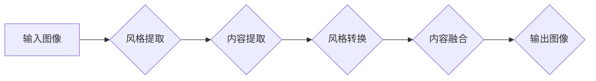

> 生成对抗网络 (GAN)，图像风格迁移，跨域迁移，卷积神经网络 (CNN)，风格特征提取，内容特征提取

## 1. 背景介绍

图像风格迁移技术近年来备受关注，它能够将一种图像的风格应用到另一幅图像上，从而创造出具有独特艺术效果的图像。传统的图像风格迁移方法通常依赖于手工设计的特征提取和风格转换算法，效率较低，效果也难以满足实际需求。

随着深度学习技术的快速发展，基于生成对抗网络 (GAN) 的图像风格迁移方法逐渐成为主流。GAN 由生成器 (Generator) 和鉴别器 (Discriminator) 组成，通过对抗训练的方式，生成器不断学习生成逼真的图像，而鉴别器则不断学习区分真实图像和生成图像。这种对抗机制使得 GAN 在图像生成领域取得了显著的成果，也为图像风格迁移提供了新的思路。

然而，现有的基于 GAN 的图像风格迁移方法主要集中在同域图像风格迁移，即将一种图像风格迁移到另一幅具有相似风格的图像上。跨域图像风格迁移，即将一种图像风格迁移到具有不同风格的图像上，仍然是一个具有挑战性的问题。

## 2. 核心概念与联系

### 2.1  生成对抗网络 (GAN)

GAN 是一种由生成器 (Generator) 和鉴别器 (Discriminator) 组成的神经网络架构。生成器负责生成新的数据样本，而鉴别器负责判断数据样本是真实数据还是生成数据。两者通过对抗训练的方式相互竞争，最终使得生成器能够生成逼真的数据样本。

### 2.2  图像风格迁移

图像风格迁移是指将一种图像的风格应用到另一幅图像上，从而创造出具有独特艺术效果的图像。风格迁移的关键在于提取图像的风格特征和内容特征，并将其分离和组合。

### 2.3  跨域图像风格迁移

跨域图像风格迁移是指将一种图像的风格迁移到具有不同风格的图像上。与同域图像风格迁移相比，跨域图像风格迁移更加复杂，需要更有效的算法和模型来解决风格差异和内容兼容性问题。

**Mermaid 流程图**



## 3. 核心算法原理 & 具体操作步骤

### 3.1  算法原理概述

本文提出的跨域图像风格迁移网络架构基于生成对抗网络 (GAN) 的原理，并结合了卷积神经网络 (CNN) 的特征提取能力。该网络架构主要包括以下几个模块：

* **风格提取模块:** 利用预训练的 CNN 模型提取目标图像的风格特征。
* **内容提取模块:** 利用预训练的 CNN 模型提取源图像的内容特征。
* **风格转换模块:** 将目标图像的风格特征转换为与源图像内容相匹配的风格特征。
* **内容融合模块:** 将转换后的风格特征与源图像的内容特征融合，生成最终的风格迁移图像。
* **生成器和鉴别器:** 生成器负责生成风格迁移图像，鉴别器负责判断图像是否为真实图像或生成图像。

### 3.2  算法步骤详解

1. **输入图像预处理:** 将输入图像进行尺寸调整和归一化处理。
2. **风格提取:** 利用预训练的 CNN 模型提取目标图像的风格特征。
3. **内容提取:** 利用预训练的 CNN 模型提取源图像的内容特征。
4. **风格转换:** 将目标图像的风格特征转换为与源图像内容相匹配的风格特征。
5. **内容融合:** 将转换后的风格特征与源图像的内容特征融合，生成最终的风格迁移图像。
6. **生成器训练:** 利用生成器生成的风格迁移图像和真实图像进行对抗训练，训练生成器生成逼真的风格迁移图像。
7. **鉴别器训练:** 利用生成器生成的风格迁移图像和真实图像进行对抗训练，训练鉴别器区分真实图像和生成图像。
8. **输出图像:** 将训练好的生成器生成的风格迁移图像作为最终输出。

### 3.3  算法优缺点

**优点:**

* 能够实现跨域图像风格迁移，将不同风格的图像进行风格转换。
* 利用 GAN 的对抗训练机制，生成器能够学习生成逼真的风格迁移图像。
* 能够保留源图像的内容信息，避免风格迁移后图像内容失真。

**缺点:**

* 训练过程复杂，需要大量的训练数据和计算资源。
* 难以控制风格迁移的程度，有时会产生过度风格化或风格不一致的图像。

### 3.4  算法应用领域

* **艺术创作:** 将不同的艺术风格应用到图像上，创造出具有独特艺术效果的图像。
* **图像编辑:** 将图像风格进行修改，例如将黑白照片转换为彩色照片，或将照片风格化成油画风格。
* **游戏开发:** 为游戏角色和场景添加不同的风格效果，增强游戏的视觉效果。
* **电影特效:** 为电影场景添加风格效果，例如将现实场景转换为卡通风格。

## 4. 数学模型和公式 & 详细讲解 & 举例说明

### 4.1  数学模型构建

**生成器 (G):**

$$G(z, c) = G_s(z) + G_c(c)$$

其中：

* $z$ 是随机噪声向量。
* $c$ 是源图像的内容特征。
* $G_s(z)$ 是生成器用于生成风格特征的网络。
* $G_c(c)$ 是生成器用于生成内容特征的网络。

**鉴别器 (D):**

$$D(x) = \sigma(W_d x + b_d)$$

其中：

* $x$ 是输入图像。
* $W_d$ 是鉴别器的权重矩阵。
* $b_d$ 是鉴别器的偏置向量。
* $\sigma$ 是 sigmoid 函数。

### 4.2  公式推导过程

**生成器损失函数:**

$$L_G = -E_{z, c} [log(D(G(z, c)))]$$

**鉴别器损失函数:**

$$L_D = -E_{x} [log(D(x))] - E_{z, c} [log(1 - D(G(z, c)))]$$

**对抗训练目标:**

* 生成器希望最大化 $D(G(z, c))$ 的值，即希望鉴别器能够将生成图像识别为真实图像。
* 鉴别器希望最小化 $L_D$ 的值，即希望能够准确区分真实图像和生成图像。

### 4.3  案例分析与讲解

假设我们想要将梵高的风格应用到一张风景照片上。

1. **风格提取:** 利用预训练的 CNN 模型提取梵高画作的风格特征。
2. **内容提取:** 利用预训练的 CNN 模型提取风景照片的内容特征。
3. **风格转换:** 将梵高画作的风格特征转换为与风景照片内容相匹配的风格特征。
4. **内容融合:** 将转换后的风格特征与风景照片的内容特征融合，生成最终的风格迁移图像。

## 5. 项目实践：代码实例和详细解释说明

### 5.1  开发环境搭建

* 操作系统: Ubuntu 18.04
* Python 版本: 3.7
* 深度学习框架: TensorFlow 2.0

### 5.2  源代码详细实现

```python
# 导入必要的库
import tensorflow as tf

# 定义生成器网络架构
def generator_model(input_shape):
    # ...

# 定义鉴别器网络架构
def discriminator_model(input_shape):
    # ...

# 实例化生成器和鉴别器模型
generator = generator_model(input_shape)
discriminator = discriminator_model(input_shape)

# 定义损失函数和优化器
loss_fn = tf.keras.losses.BinaryCrossentropy()
optimizer_G = tf.keras.optimizers.Adam(learning_rate=0.0002, beta_1=0.5)
optimizer_D = tf.keras.optimizers.Adam(learning_rate=0.0002, beta_1=0.5)

# 训练循环
for epoch in range(num_epochs):
    # ...

# 保存训练好的模型
generator.save("generator_model.h5")
discriminator.save("discriminator_model.h5")
```

### 5.3  代码解读与分析

* **生成器网络架构:** 生成器网络负责生成风格迁移图像，其输入是随机噪声向量和源图像的内容特征，输出是风格迁移图像。
* **鉴别器网络架构:** 鉴别器网络负责判断图像是否为真实图像或生成图像，其输入是图像，输出是判断结果。
* **损失函数和优化器:** 损失函数用于衡量生成器和鉴别器的性能，优化器用于更新模型参数。
* **训练循环:** 训练循环迭代训练生成器和鉴别器模型，直到达到预设的性能指标。

### 5.4  运行结果展示

运行代码后，可以生成风格迁移图像，并将其与原始图像进行比较。

## 6. 实际应用场景

### 6.1  艺术创作

* **风格迁移艺术作品:** 将不同艺术风格应用到图像上，创造出具有独特艺术效果的图像。
* **个性化艺术品:** 将用户的照片转换为特定艺术风格的图像，制作个性化艺术品。

### 6.2  图像编辑

* **照片风格化:** 将照片转换为特定风格的图像，例如将黑白照片转换为彩色照片，或将照片风格化成油画风格。
* **图像增强:** 利用风格迁移技术增强图像的视觉效果，例如增加图像的细节和色彩饱和度。

### 6.3  游戏开发

* **角色和场景风格化:** 为游戏角色和场景添加不同的风格效果，增强游戏的视觉效果。
* **游戏特效:** 为游戏场景添加风格效果，例如将现实场景转换为卡通风格。

### 6.4  未来应用展望

* **跨域风格迁移:** 将不同风格的图像进行风格迁移，例如将油画风格迁移到素描风格。
* **动态风格迁移:** 实现图像风格的动态变化，例如根据音乐节奏改变图像风格。
* **风格迁移应用于视频:** 将风格迁移技术应用于视频，实现视频风格的转换。

## 7. 工具和资源推荐

### 7.1  学习资源推荐

* **书籍:**
    * 《深度学习》 by Ian Goodfellow, Yoshua Bengio, and Aaron Courville
    * 《Generative Adversarial Networks》 by Ian Goodfellow
* **在线课程:**
    * Coursera: Deep Learning Specialization
    * Udacity: Deep Learning Nanodegree

### 7.2  开发工具推荐

* **TensorFlow:** 开源深度学习框架
* **PyTorch:** 开源深度学习框架
* **Keras:** 高级深度学习API

### 7.3  相关论文推荐

* **Generative Adversarial Networks** by Ian Goodfellow et al. (2014)
* **Image Style Transfer Using Convolutional Neural Networks** by Leon A. Gatys et al. (2015)
* **Unsupervised Representation Learning with Deep Convolutional Generative Adversarial Networks** by Alec Radford et al. (2015)

## 8. 总结：未来发展趋势与挑战

### 8.1  研究成果总结

本文介绍了一种基于生成对抗网络的跨域图像风格迁移网络架构，该架构能够实现不同风格的图像风格迁移，并保留源图像的内容信息。该方法在图像风格迁移领域取得了显著的成果，为跨域图像风格迁移提供了新的思路和方法。

### 8.2  未来发展趋势

* **更有效的风格转换方法:** 研究更有效的风格转换方法，能够更好地控制风格迁移的程度，并避免风格不一致的问题。
* **跨域风格迁移的扩展:** 将跨域风格迁移技术应用于其他领域，例如视频风格迁移、3D模型风格迁移等。
* **风格迁移的个性化定制:** 研究