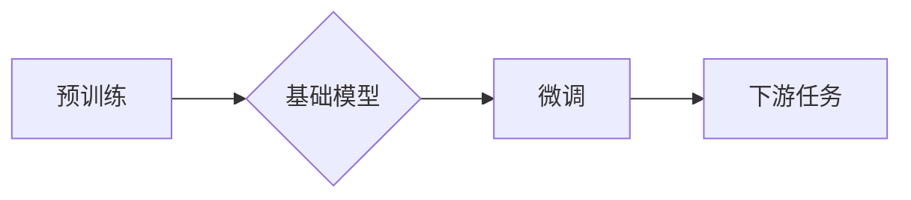

> 基础模型、大规模语言模型、深度学习、迁移学习、泛化能力、可解释性、效率、安全

## 1. 背景介绍

近年来，深度学习技术取得了飞速发展，基础模型（Foundation Models）作为其重要组成部分，展现出强大的学习能力和泛化能力，在自然语言处理、计算机视觉、语音识别等领域取得了突破性进展。基础模型通常是指在海量数据上预训练的大规模模型，能够在多种下游任务中进行微调，实现高效的跨任务学习。

然而，基础模型的训练和应用也面临着诸多技术挑战：

* **数据规模和质量:** 基础模型的训练需要海量高质量数据，而获取和处理如此庞大的数据资源是一个巨大的挑战。
* **计算资源和成本:** 基础模型的训练需要消耗大量的计算资源，这导致训练成本高昂，难以普及。
* **模型规模和复杂度:** 基础模型往往具有庞大的参数规模和复杂的架构，这使得模型训练和部署更加困难。
* **泛化能力和鲁棒性:** 基础模型在面对新的任务或数据分布时，其泛化能力和鲁棒性仍然存在不足。
* **可解释性和安全性:** 基础模型的决策过程往往难以解释，其潜在的安全风险也需要得到重视。

## 2. 核心概念与联系

基础模型的核心概念包括：

* **预训练:** 在未标记数据上进行大规模训练，学习通用知识和表示。
* **微调:** 在特定任务数据上进行少量训练，调整模型参数，使其适应特定任务。
* **迁移学习:** 将预训练模型的知识迁移到新的任务或领域。

基础模型的架构通常基于深度神经网络，例如 Transformer、BERT、GPT 等。这些模型通过多层神经网络结构和自注意力机制，学习捕捉文本或图像中的复杂语义关系。

**Mermaid 流程图:**

## 3. 核心算法原理 & 具体操作步骤

### 3.1  算法原理概述

基础模型的训练主要基于深度学习算法，例如反向传播算法和梯度下降算法。

* **反向传播算法:** 用于计算模型参数的梯度，指导模型参数更新。
* **梯度下降算法:** 用于更新模型参数，使其朝着最小化损失函数的方向移动。

### 3.2  算法步骤详解

1. **数据预处理:** 将原始数据进行清洗、格式化和编码，使其适合模型训练。
2. **模型初始化:** 为模型参数赋予初始值。
3. **前向传播:** 将输入数据通过模型层级进行处理，得到输出结果。
4. **损失函数计算:** 计算模型输出与真实标签之间的差异，即损失值。
5. **反向传播:** 计算模型参数的梯度，根据梯度更新模型参数。
6. **迭代训练:** 重复步骤3-5，直到模型性能达到预设目标。

### 3.3  算法优缺点

**优点:**

* **强大的学习能力:** 深度学习算法能够学习复杂的非线性关系，从而实现更精准的预测和分类。
* **泛化能力强:** 预训练模型在海量数据上学习到的通用知识能够迁移到新的任务和领域。
* **自动化程度高:** 深度学习模型的训练和部署可以自动化，降低人工成本。

**缺点:**

* **数据依赖性强:** 深度学习模型的性能依赖于训练数据的质量和数量。
* **计算资源消耗大:** 深度学习模型的训练需要消耗大量的计算资源，成本较高。
* **可解释性差:** 深度学习模型的决策过程难以解释，这使得其应用在某些领域受到限制。

### 3.4  算法应用领域

基础模型在自然语言处理、计算机视觉、语音识别、机器翻译、文本生成等领域都有广泛的应用。

## 4. 数学模型和公式 & 详细讲解 & 举例说明

### 4.1  数学模型构建

基础模型的数学模型通常基于神经网络，其核心是权重矩阵和激活函数。

* **权重矩阵:** 用于存储模型参数，决定输入数据在不同层之间的传递方式。
* **激活函数:** 用于引入非线性，使得模型能够学习复杂的函数关系。

### 4.2  公式推导过程

模型的输出可以表示为：

$$
y = f(W_L x_L + b_L)
$$

其中：

* $y$ 是模型输出
* $f$ 是激活函数
* $W_L$ 是最后一层权重矩阵
* $x_L$ 是最后一层输入
* $b_L$ 是最后一层偏置

### 4.3  案例分析与讲解

例如，在自然语言处理任务中，基础模型可以将文本序列编码为向量表示，然后利用这些向量表示进行分类或生成文本。

## 5. 项目实践：代码实例和详细解释说明

### 5.1  开发环境搭建

使用 Python 语言和深度学习框架（例如 TensorFlow 或 PyTorch）搭建开发环境。

### 5.2  源代码详细实现

使用预训练模型（例如 BERT 或 GPT）作为基础，进行微调训练。

### 5.3  代码解读与分析

解释代码中使用的函数、类和参数，以及模型训练过程中的关键步骤。

### 5.4  运行结果展示

展示模型在特定任务上的性能指标，例如准确率、召回率和 F1 值。

## 6. 实际应用场景

基础模型在各个领域都有广泛的应用场景，例如：

* **自然语言处理:** 文本分类、情感分析、机器翻译、文本生成等。
* **计算机视觉:** 图像识别、物体检测、图像分割等。
* **语音识别:** 语音转文本、语音合成等。

### 6.4  未来应用展望

基础模型的应用前景广阔，未来将应用于更多领域，例如：

* **医疗保健:** 疾病诊断、药物研发等。
* **金融科技:** 风险评估、欺诈检测等。
* **教育科技:** 个性化学习、智能辅导等。

## 7. 工具和资源推荐

### 7.1  学习资源推荐

* **书籍:** 《深度学习》、《自然语言处理》
* **在线课程:** Coursera、edX、Udacity 等平台上的深度学习课程。
* **博客和论坛:** TensorFlow、PyTorch 等深度学习框架的官方博客和论坛。

### 7.2  开发工具推荐

* **深度学习框架:** TensorFlow、PyTorch、Keras 等。
* **云计算平台:** AWS、Google Cloud、Azure 等。

### 7.3  相关论文推荐

* **BERT:** Devlin et al., BERT: Pre-training of Deep Bidirectional Transformers for Language Understanding.
* **GPT:** Radford et al., Language Models are Few-Shot Learners.
* **Transformer:** Vaswani et al., Attention Is All You Need.

## 8. 总结：未来发展趋势与挑战

### 8.1  研究成果总结

基础模型在自然语言处理、计算机视觉等领域取得了显著进展，展现出强大的学习能力和泛化能力。

### 8.2  未来发展趋势

* **模型规模和能力的提升:** 随着计算资源的不断发展，基础模型的规模和能力将进一步提升。
* **多模态学习:** 基础模型将融合文本、图像、音频等多模态数据，实现更全面的知识表示。
* **可解释性和安全性:** 研究者将致力于提高基础模型的可解释性和安全性，使其在更多领域得到应用。

### 8.3  面临的挑战

* **数据获取和隐私保护:** 基础模型的训练需要海量数据，如何获取高质量数据并保护用户隐私是一个挑战。
* **计算资源和成本:** 基础模型的训练和部署需要消耗大量的计算资源，成本较高。
* **伦理和社会影响:** 基础模型的应用可能带来伦理和社会问题，需要进行深入的思考和讨论。

### 8.4  研究展望

未来，基础模型的研究将继续深入，探索更强大的模型架构、更有效的训练方法和更广泛的应用场景。

## 9. 附录：常见问题与解答

**常见问题:**

* **基础模型和深度学习模型有什么区别？**
* **如何选择合适的预训练模型？**
* **如何进行基础模型的微调训练？**
* **如何评估基础模型的性能？**

**解答:**

...

作者：禅与计算机程序设计艺术 / Zen and the Art of Computer Programming 

<end_of_turn>