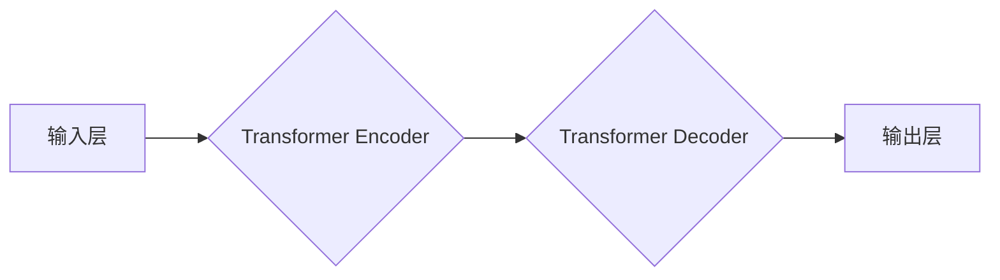

> 基础模型、人工智能、社会效益、社会风险、伦理、可解释性、公平性、隐私、监管

## 1. 背景介绍

人工智能（AI）技术近年来取得了飞速发展，基础模型作为AI领域的新兴技术，正在深刻地改变着我们生活和工作方式。基础模型是指在海量数据上预训练的大规模语言模型或多模态模型，具有强大的泛化能力和适应性，能够在各种下游任务中取得优异的性能。

基础模型的出现，为人工智能的发展带来了新的机遇和挑战。一方面，基础模型能够显著提升人工智能应用的效率和效果，推动人工智能技术在各个领域的广泛应用，例如自然语言处理、计算机视觉、语音识别等。另一方面，基础模型也带来了新的社会风险，例如算法偏见、数据隐私泄露、恶意利用等，需要我们认真思考和应对。

## 2. 核心概念与联系

**2.1 基础模型的定义**

基础模型是指在海量数据上进行预训练的大规模人工智能模型，其核心特点是：

* **规模庞大:** 基础模型通常拥有数十亿甚至数千亿的参数，拥有强大的计算能力和存储能力。
* **预训练:** 基础模型在海量数据上进行预训练，学习了语言或多模态数据的通用知识和表示能力。
* **泛化能力强:** 基础模型能够在各种下游任务中进行微调，并取得优异的性能。

**2.2 基础模型的类型**

基础模型主要分为以下几种类型：

* **语言模型:** 主要处理文本数据，例如GPT-3、BERT、LaMDA等。
* **图像模型:** 主要处理图像数据，例如DALL-E 2、Stable Diffusion、Imagen等。
* **多模态模型:** 可以处理多种数据类型，例如文本、图像、音频等，例如FLAN-T5、CLIP等。

**2.3 基础模型的架构**

基础模型通常采用 Transformer 架构，其核心是注意力机制，能够有效地捕捉文本或图像中的长距离依赖关系。



## 3. 核心算法原理 & 具体操作步骤

**3.1 算法原理概述**

Transformer 模型的核心是注意力机制，它能够学习到文本或图像中不同元素之间的关系，并根据这些关系生成输出。注意力机制可以看作是一种加权求和操作，每个元素都会被赋予一个权重，权重高的元素对输出的影响更大。

**3.2 算法步骤详解**

1. **输入处理:** 将输入文本或图像转换为数字向量。
2. **编码器:** 使用 Transformer Encoder 将输入向量编码成隐藏状态向量。
3. **解码器:** 使用 Transformer Decoder 将隐藏状态向量解码成输出向量。
4. **输出:** 将输出向量转换为文本或图像。

**3.3 算法优缺点**

**优点:**

* 能够有效地捕捉长距离依赖关系。
* 训练效率高，能够在海量数据上进行预训练。
* 泛化能力强，能够在各种下游任务中取得优异的性能。

**缺点:**

* 计算量大，需要强大的计算资源。
* 参数量大，需要大量的存储空间。
* 训练过程复杂，需要专业的技术人员。

**3.4 算法应用领域**

Transformer 模型在自然语言处理、计算机视觉、语音识别等领域都有广泛的应用，例如：

* **机器翻译:** 将一种语言翻译成另一种语言。
* **文本摘要:** 将长篇文本压缩成短篇摘要。
* **问答系统:** 回答用户提出的问题。
* **图像识别:** 将图像分类或识别出其中的物体。
* **语音合成:** 将文本转换为语音。

## 4. 数学模型和公式 & 详细讲解 & 举例说明

**4.1 数学模型构建**

Transformer 模型的数学模型主要基于注意力机制和多层感知机。

**4.2 公式推导过程**

注意力机制的公式如下：

$$
Attention(Q, K, V) = softmax(\frac{QK^T}{\sqrt{d_k}})V
$$

其中：

* $Q$：查询矩阵
* $K$：键矩阵
* $V$：值矩阵
* $d_k$：键向量的维度
* $softmax$：softmax 函数

**4.3 案例分析与讲解**

假设我们有一个句子 "The cat sat on the mat"，我们想要计算每个词与其他词之间的注意力权重。

1. 将句子中的每个词转换为词向量。
2. 计算每个词的查询向量、键向量和值向量。
3. 使用注意力机制计算每个词与其他词之间的注意力权重。
4. 将注意力权重与值向量相乘，得到每个词的上下文表示。

## 5. 项目实践：代码实例和详细解释说明

**5.1 开发环境搭建**

* Python 3.7+
* PyTorch 1.7+
* CUDA 10.2+

**5.2 源代码详细实现**

```python
import torch
import torch.nn as nn

class Transformer(nn.Module):
    def __init__(self, vocab_size, embedding_dim, num_heads, num_layers):
        super(Transformer, self).__init__()
        self.embedding = nn.Embedding(vocab_size, embedding_dim)
        self.encoder = nn.TransformerEncoder(nn.TransformerEncoderLayer(embedding_dim, num_heads), num_layers)
        self.decoder = nn.TransformerDecoder(nn.TransformerDecoderLayer(embedding_dim, num_heads), num_layers)
        self.fc = nn.Linear(embedding_dim, vocab_size)

    def forward(self, src, tgt):
        src = self.embedding(src)
        tgt = self.embedding(tgt)
        src = self.encoder(src)
        tgt = self.decoder(tgt, src)
        output = self.fc(tgt)
        return output
```

**5.3 代码解读与分析**

* `__init__` 方法初始化模型参数，包括词嵌入层、编码器、解码器和全连接层。
* `forward` 方法定义模型的正向传播过程，将输入序列编码和解码，并输出预测序列。

**5.4 运行结果展示**

使用预训练的 Transformer 模型进行机器翻译任务，例如将英文翻译成中文。

## 6. 实际应用场景

基础模型在各个领域都有广泛的应用，例如：

* **自然语言处理:** 机器翻译、文本摘要、问答系统、聊天机器人等。
* **计算机视觉:** 图像识别、物体检测、图像生成等。
* **语音识别:** 语音转文本、语音合成等。
* **医疗保健:** 疾病诊断、药物研发等。
* **金融服务:** 风险评估、欺诈检测等。

**6.4 未来应用展望**

基础模型的应用前景广阔，未来将应用于更多领域，例如：

* **个性化教育:** 根据学生的学习情况提供个性化的学习内容和辅导。
* **智能家居:** 通过语音或图像识别控制家居设备。
* **自动驾驶:** 帮助车辆理解周围环境并做出决策。

## 7. 工具和资源推荐

**7.1 学习资源推荐**

* **书籍:**
    * 《深度学习》
    * 《自然语言处理》
    * 《计算机视觉》
* **在线课程:**
    * Coursera
    * edX
    * Udacity

**7.2 开发工具推荐**

* **PyTorch:** 深度学习框架
* **TensorFlow:** 深度学习框架
* **Hugging Face:** 预训练模型库

**7.3 相关论文推荐**

* 《Attention Is All You Need》
* 《BERT: Pre-training of Deep Bidirectional Transformers for Language Understanding》
* 《GPT-3: Language Models are Few-Shot Learners》

## 8. 总结：未来发展趋势与挑战

**8.1 研究成果总结**

基础模型在人工智能领域取得了显著的进展，其强大的泛化能力和适应性推动了人工智能技术的广泛应用。

**8.2 未来发展趋势**

* **模型规模进一步扩大:** 随着计算资源的不断提升，基础模型的规模将继续扩大，模型能力将进一步增强。
* **多模态模型发展:** 多模态模型将能够处理多种数据类型，例如文本、图像、音频等，应用场景将更加广泛。
* **可解释性研究:** 研究基础模型的决策过程，提高模型的可解释性和透明度。

**8.3 面临的挑战**

* **数据安全和隐私:** 基础模型的训练需要海量数据，如何保护数据安全和隐私是一个重要挑战。
* **算法偏见:** 基础模型可能存在算法偏见，需要采取措施 mitigating 偏见。
* **恶意利用:** 基础模型可能被恶意利用，例如生成虚假信息、进行网络攻击等，需要加强监管和安全防护。

**8.4 研究展望**

未来，基础模型的研究将继续深入，探索更强大的模型架构、更有效的训练方法和更广泛的应用场景。同时，需要加强对基础模型的伦理和社会影响的思考，确保基础模型的健康发展和可持续应用。

## 9. 附录：常见问题与解答

**9.1 如何选择合适的基础模型？**

选择合适的基础模型需要根据具体的应用场景和需求进行考虑，例如：

* **任务类型:** 不同的任务类型需要不同的基础模型，例如机器翻译需要语言模型，图像识别需要图像模型。
* **数据规模:** 基础模型的训练需要海量数据，如果数据规模较小，可以选择预训练好的小型模型。
* **计算资源:** 基础模型的训练需要强大的计算资源，如果计算资源有限，可以选择参数量较小的模型。

**9.2 如何训练基础模型？**

训练基础模型需要以下步骤：

1. **准备数据:** 收集和预处理训练数据。
2. **选择模型架构:** 选择合适的模型架构，例如 Transformer。
3. **设置超参数:** 设置模型的超参数，例如学习率、批处理大小等。
4. **训练模型:** 使用训练数据训练模型。
5. **评估模型:** 使用测试数据评估模型的性能。

**9.3 如何部署基础模型？**

部署基础模型可以采用以下方式：

* **云端部署:** 将模型部署在云平台上，例如 AWS、Azure、Google Cloud。
* **边缘部署:** 将模型部署在边缘设备上，例如手机、物联网设备。
* **本地部署:** 将模型部署在本地服务器上。


作者：禅与计算机程序设计艺术 / Zen and the Art of Computer Programming 
<end_of_turn>