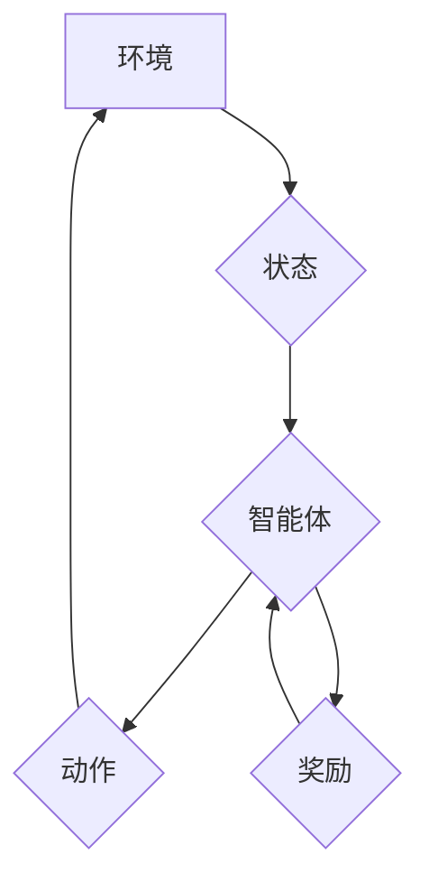

> 强化学习，深度学习，Q-learning，SARSA，Bellman方程，价值函数，策略梯度，环境，状态，动作，奖励

## 1. 背景介绍

在人工智能领域，强化学习 (Reinforcement Learning，RL) 作为一种重要的机器学习范式，近年来取得了显著进展，并在许多应用场景中展现出强大的潜力。与监督学习和无监督学习不同，强化学习的核心在于让智能体通过与环境的交互学习最优策略，以最大化累积的奖励。

强化学习的灵感来源于动物行为学和心理学，它模拟了动物通过试错学习行为的机制。在强化学习中，智能体被视为一个“学习者”，环境则是一个“世界”，智能体与环境交互，根据环境的反馈（奖励或惩罚）调整自己的行为，最终学习到最优策略。

强化学习的应用领域非常广泛，包括游戏、机器人控制、推荐系统、医疗诊断、金融交易等。例如，AlphaGo通过强化学习战胜了世界围棋冠军，自动驾驶汽车也依赖于强化学习算法来学习驾驶技能。

## 2. 核心概念与联系

**核心概念：**

* **环境 (Environment):** 智能体所处的外部世界，它提供状态信息和对智能体动作的反馈。
* **智能体 (Agent):** 学习和决策的实体，它根据环境的状态选择动作并与环境交互。
* **状态 (State):** 环境的当前描述，它包含了所有与智能体决策相关的关键信息。
* **动作 (Action):** 智能体可以采取的行动，它会改变环境的状态。
* **奖励 (Reward):** 环境对智能体动作的反馈，它可以是正向的（奖励）或负向的（惩罚）。
* **策略 (Policy):** 智能体选择动作的规则，它将状态映射到动作。
* **价值函数 (Value Function):** 评估状态或状态-动作对的价值，它衡量了从当前状态开始执行策略所能获得的长期奖励。

**Mermaid 流程图：**



## 3. 核心算法原理 & 具体操作步骤

### 3.1  算法原理概述

强化学习算法的核心是通过迭代更新价值函数或策略来学习最优策略。常见的强化学习算法包括：

* **Q-learning:** 是一种基于价值函数的算法，它学习一个Q表，Q表存储了每个状态-动作对的期望奖励。
* **SARSA:** 与Q-learning类似，但SARSA在更新Q表时使用的是当前策略，而不是最优策略。
* **策略梯度:** 是一种基于策略的算法，它直接优化策略参数，以最大化奖励。

### 3.2  算法步骤详解

**Q-learning算法步骤：**

1. 初始化Q表，将所有状态-动作对的Q值设置为0。
2. 在环境中进行交互，观察状态、采取动作、获得奖励和下一个状态。
3. 更新Q值：

```
Q(s, a) = Q(s, a) + α [r + γ max Q(s', a') - Q(s, a)]
```

其中：

* s：当前状态
* a：当前动作
* r：获得的奖励
* s'：下一个状态
* a'：在下一个状态下采取的动作
* α：学习率
* γ：折扣因子

4. 重复步骤2和3，直到Q值收敛。

### 3.3  算法优缺点

**Q-learning算法优点：**

* 能够学习最优策略。
* 适用于离散状态和动作空间。

**Q-learning算法缺点：**

* 对于连续状态和动作空间，Q表会变得非常庞大。
* 学习过程可能比较慢。

### 3.4  算法应用领域

Q-learning算法广泛应用于：

* 游戏
* 机器人控制
* 医疗诊断
* 金融交易

## 4. 数学模型和公式 & 详细讲解 & 举例说明

### 4.1  数学模型构建

强化学习的核心数学模型是**Bellman方程**，它描述了价值函数与奖励和下一个状态之间的关系。

**Bellman方程:**

$$
V(s) = \max_a \sum_{s'} P(s'|s,a) [r(s,a,s') + \gamma V(s')]
$$

其中：

* V(s)：状态s的价值
* a：智能体可以采取的动作
* s'：下一个状态
* P(s'|s,a)：从状态s采取动作a到达状态s'的概率
* r(s,a,s')：从状态s采取动作a到达状态s'获得的奖励
* γ：折扣因子

### 4.2  公式推导过程

Bellman方程的推导过程基于**期望奖励**的概念。

期望奖励是指从当前状态开始执行策略，在未来所有时间步长获得的奖励的总和。

Bellman方程将期望奖励表示为当前状态的价值与未来状态的价值的函数。

### 4.3  案例分析与讲解

**举例说明：**

假设有一个简单的环境，智能体可以采取两种动作：向上或向下。

* 状态：智能体的当前位置
* 动作：向上或向下
* 奖励：到达终点获得100的奖励，其他情况下获得0奖励

Bellman方程可以用来计算每个状态的价值。

例如，如果智能体当前位于起点，那么它的价值为：

$$
V(起点) = \max_{向上,向下} \sum_{下一个状态} P(下一个状态|起点,动作) [r(起点,动作,下一个状态) + \gamma V(下一个状态)]
$$

通过迭代计算Bellman方程，可以得到每个状态的价值，从而学习最优策略。

## 5. 项目实践：代码实例和详细解释说明

### 5.1  开发环境搭建

* Python 3.x
* TensorFlow 或 PyTorch

### 5.2  源代码详细实现

```python
import numpy as np

# 定义环境
class Environment:
    def __init__(self):
        self.state = 0

    def step(self, action):
        if action == 0:  # 向上
            self.state = max(0, self.state - 1)
        elif action == 1:  # 向下
            self.state = min(9, self.state + 1)
        reward = 0
        if self.state == 9:
            reward = 100
        return self.state, reward

# 定义Q-learning算法
class QLearning:
    def __init__(self, env, alpha=0.1, gamma=0.9, epsilon=0.1):
        self.env = env
        self.alpha = alpha
        self.gamma = gamma
        self.epsilon = epsilon
        self.q_table = np.zeros((10, 2))

    def choose_action(self, state):
        if np.random.uniform(0, 1) < self.epsilon:
            return np.random.choice(2)
        else:
            return np.argmax(self.q_table[state])

    def learn(self, num_episodes):
        for episode in range(num_episodes):
            state = self.env.reset()
            done = False
            while not done:
                action = self.choose_action(state)
                next_state, reward = self.env.step(action)
                self.q_table[state, action] += self.alpha * (reward + self.gamma * np.max(self.q_table[next_state]) - self.q_table[state, action])
                state = next_state
                if next_state == 9:
                    done = True

# 创建环境和Q-learning算法实例
env = Environment()
agent = QLearning(env, alpha=0.1, gamma=0.9, epsilon=0.1)

# 训练Q-learning算法
agent.learn(num_episodes=1000)

# 测试Q-learning算法
state = env.reset()
while True:
    action = agent.choose_action(state)
    next_state, reward = env.step(action)
    print(f"State: {state}, Action: {action}, Reward: {reward}")
    state = next_state
    if next_state == 9:
        break
```

### 5.3  代码解读与分析

* **环境类 (Environment):** 定义了环境的规则，包括状态、动作、奖励等。
* **Q-learning类 (QLearning):** 实现Q-learning算法，包括初始化Q表、选择动作、更新Q表等方法。
* **训练过程:** 使用循环迭代的方式，让智能体与环境交互，更新Q表。
* **测试过程:** 使用训练好的Q表，让智能体在环境中进行测试，观察其行为。

### 5.4  运行结果展示

运行代码后，可以观察到智能体在环境中学习并最终到达终点的过程。

## 6. 实际应用场景

### 6.1  游戏

强化学习在游戏领域应用广泛，例如：

* **AlphaGo:** 利用强化学习战胜了世界围棋冠军。
* **Dota 2:** OpenAI Five团队训练的强化学习代理在Dota 2比赛中取得了优异成绩。

### 6.2  机器人控制

强化学习可以用于训练机器人执行各种任务，例如：

* **自主导航:** 让机器人自主地在环境中导航。
* **抓取:** 让机器人学习如何抓取物体。
* **运动控制:** 让机器人学习如何执行复杂的运动动作。

### 6.3  推荐系统

强化学习可以用于个性化推荐，例如：

* **电影推荐:** 根据用户的观看历史推荐电影。
* **商品推荐:** 根据用户的购买历史推荐商品。

### 6.4  未来应用展望

强化学习在未来将有更广泛的应用，例如：

* **自动驾驶:** 强化学习可以帮助自动驾驶汽车学习驾驶技能。
* **医疗诊断:** 强化学习可以帮助医生诊断疾病。
* **金融交易:** 强化学习可以帮助交易员进行交易决策。

## 7. 工具和资源推荐

### 7.1  学习资源推荐

* **书籍:**
    * Reinforcement Learning: An Introduction by Richard S. Sutton and Andrew G. Barto
    * Deep Reinforcement Learning Hands-On by Maxim Lapan
* **课程:**
    * Stanford CS234: Reinforcement Learning
    * DeepMind's Reinforcement Learning Specialization

### 7.2  开发工具推荐

* **TensorFlow:** 深度学习框架，支持强化学习算法的实现。
* **PyTorch:** 深度学习框架，支持强化学习算法的实现。
* **OpenAI Gym:** 强化学习环境库，提供各种标准环境。

### 7.3  相关论文推荐

* **Deep Q-Network (DQN):** https://arxiv.org/abs/1312.5602
* **Proximal Policy Optimization (PPO):** https://arxiv.org/abs/1707.06347
* **Trust Region Policy Optimization (TRPO):** https://arxiv.org/abs/1502.05477

## 8. 总结：未来发展趋势与挑战

### 8.1  研究成果总结

近年来，强化学习取得了显著进展，在许多应用领域取得了成功。

* **深度强化学习:** 将深度神经网络与强化学习结合，取得了更优的性能。
* **多智能体强化学习:** 研究多个智能体在同一环境中交互学习的算法。
* **离线强化学习:** 利用离线数据进行强化学习训练，无需与环境交互。

### 8.2  未来发展趋势

* **更强大的算法:** 开发更强大、更鲁棒的强化学习算法。
* **更复杂的应用场景:** 将强化学习应用于更复杂的应用