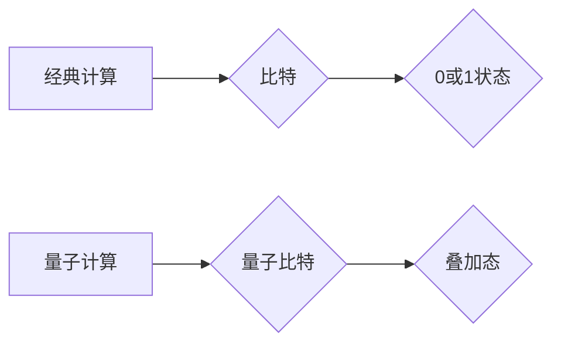

>  比特，原子，量子计算，经典计算，算法，量子力学，信息处理

## 1. 背景介绍

在过去的几十年里，计算机科学经历了飞速发展，从简单的电子管计算机到如今的强大云计算平台，我们见证了信息处理能力的指数级增长。这种进步的核心在于我们对“比特”的理解和利用。比特，作为计算机的基本信息单位，用0和1来表示信息，构成了我们数字世界的基石。然而，随着技术的不断进步，我们开始意识到，仅仅依靠比特来处理信息可能已经无法满足未来发展的需求。

量子力学，作为描述微观世界规律的物理学分支，为我们提供了全新的视角。它揭示了原子和亚原子粒子具有独特的性质，例如叠加和纠缠，这些性质与经典物理学截然不同。这些量子特性为我们提供了新的可能性，即利用量子力学原理构建全新的计算模型——量子计算。

## 2. 核心概念与联系

### 2.1  经典计算与量子计算

经典计算依赖于比特，它只能处于0或1的其中一个状态。而量子计算利用量子比特（qubit），它可以同时处于0和1的叠加态，这使得量子计算拥有超越经典计算的巨大潜力。

**Mermaid 流程图：**



### 2.2  比特与量子比特

| 特性 | 比特 | 量子比特 |
|---|---|---|
| 状态 | 0 或 1 | 0、1 或 叠加态 |
| 操作 | 逻辑门 | 量子门 |
| 信息存储 | 单个比特 | 多个量子比特 |

## 3. 核心算法原理 & 具体操作步骤

### 3.1  算法原理概述

量子计算的核心算法原理是利用量子叠加和纠缠特性来实现信息处理。

* **量子叠加:** 量子比特可以同时处于多个状态的叠加态，这使得量子计算可以并行处理多个可能性，从而大大提高计算效率。
* **量子纠缠:** 两个或多个量子比特可以相互纠缠，这意味着它们的状态相互关联，即使相隔很远，改变一个量子比特的状态也会立即影响其他纠缠的量子比特的状态。

### 3.2  算法步骤详解

1. 将经典信息编码为量子比特。
2. 利用量子门对量子比特进行操作，实现量子算法的逻辑运算。
3. 将量子计算结果进行测量，得到经典输出。

### 3.3  算法优缺点

**优点:**

* 计算效率高，可以解决经典算法难以解决的问题。
* 具有并行计算能力，可以大幅缩短计算时间。

**缺点:**

* 量子计算技术还处于发展初期，硬件和软件都面临着挑战。
* 量子比特容易受到环境干扰，需要严格的控制环境。

### 3.4  算法应用领域

* **药物研发:** 模拟分子结构，加速药物设计。
* **材料科学:** 探索新材料，优化材料性能。
* **金融建模:** 优化投资策略，降低风险。
* **密码学:** 构建更安全的加密算法。

## 4. 数学模型和公式 & 详细讲解 & 举例说明

### 4.1  数学模型构建

量子计算的数学模型基于线性代数和量子力学。

* **量子态:** 量子比特的状态可以用一个复数向量来表示，例如：

$$
|ψ⟩ = α|0⟩ + β|1⟩
$$

其中，|0⟩和|1⟩是量子比特的基本态，α和β是复数系数，满足|α|^2 + |β|^2 = 1。

* **量子门:** 量子门是量子计算的基本操作，它可以改变量子比特的状态。例如，Hadamard门可以将量子比特从|0⟩状态变换到叠加态：

$$
H|0⟩ = \frac{1}{\sqrt{2}}(|0⟩ + |1⟩)
$$

### 4.2  公式推导过程

量子门操作的数学推导过程通常涉及到矩阵运算。例如，Hadamard门的矩阵表示为：

$$
H = \begin{pmatrix}
\frac{1}{\sqrt{2}} & \frac{1}{\sqrt{2}} \\
\frac{1}{\sqrt{2}} & -\frac{1}{\sqrt{2}}
\end{pmatrix}
$$

### 4.3  案例分析与讲解

通过对量子门操作的数学分析，我们可以理解其对量子比特状态的影响。例如，Hadamard门将量子比特从|0⟩状态变换到叠加态，这为量子计算的并行计算提供了基础。

## 5. 项目实践：代码实例和详细解释说明

### 5.1  开发环境搭建

量子计算开发环境通常需要安装量子计算软件库和模拟器或云平台访问。例如，可以使用Qiskit库在Python环境中进行量子计算编程。

### 5.2  源代码详细实现

```python
from qiskit import QuantumCircuit, Aer, execute

# 创建量子电路
qc = QuantumCircuit(1)

# 应用Hadamard门
qc.h(0)

# 测量量子比特
qc.measure(0, 0)

# 模拟运行
simulator = Aer.get_backend('qasm_simulator')
job = execute(qc, simulator, shots=1024)
result = job.result()
counts = result.get_counts(qc)

# 打印结果
print(counts)
```

### 5.3  代码解读与分析

这段代码演示了如何使用Qiskit库实现一个简单的量子计算程序。

* `QuantumCircuit(1)` 创建一个包含一个量子比特的量子电路。
* `qc.h(0)` 应用Hadamard门到第一个量子比特。
* `qc.measure(0, 0)` 将第一个量子比特测量到经典比特0。
* `Aer.get_backend('qasm_simulator')` 获取模拟器。
* `execute(qc, simulator, shots=1024)` 模拟运行量子电路1024次。
* `result.get_counts(qc)` 获取测量结果。

### 5.4  运行结果展示

运行这段代码后，你会得到一个包含测量结果的字典。由于量子叠加特性，测量结果会呈现出0和1的概率分布，而不是固定的0或1。

## 6. 实际应用场景

### 6.1  药物研发

量子计算可以模拟分子结构和化学反应，加速药物设计和开发。例如，可以利用量子模拟器预测药物与蛋白质的相互作用，从而筛选出更有效的药物候选者。

### 6.2  材料科学

量子计算可以帮助探索新材料和优化材料性能。例如，可以利用量子模拟器研究材料的电子结构和热力学性质，从而设计出具有特定功能的材料。

### 6.3  金融建模

量子计算可以用于优化金融建模和风险管理。例如，可以利用量子算法进行复杂的金融建模，预测市场趋势和优化投资策略。

### 6.4  未来应用展望

量子计算技术还在发展初期，但其潜力巨大。未来，量子计算有望在更多领域得到应用，例如人工智能、密码学、天气预报等。

## 7. 工具和资源推荐

### 7.1  学习资源推荐

* **Qiskit:** https://qiskit.org/
* **Cirq:** https://quantumai.google/cirq
* **PennyLane:** https://pennylane.ai/

### 7.2  开发工具推荐

* **IBM Quantum Experience:** https://quantum-computing.ibm.com/
* **Google Quantum AI:** https://quantumai.google/
* **Rigetti Computing:** https://rigetti.com/

### 7.3  相关论文推荐

* **Quantum Supremacy Using a Programmable Superconducting Processor:** https://arxiv.org/abs/1907.01293
* **Quantum Computing for Chemistry:** https://arxiv.org/abs/1803.01447

## 8. 总结：未来发展趋势与挑战

### 8.1  研究成果总结

近年来，量子计算领域取得了显著进展，例如实现量子霸权、开发量子算法、构建量子硬件等。这些成果为量子计算的未来发展奠定了基础。

### 8.2  未来发展趋势

未来，量子计算的发展趋势包括：

* **硬件性能提升:** 提高量子比特的稳定性和纠缠时间，增加量子比特数量。
* **算法开发:** 开发更多高效的量子算法，解决更复杂的问题。
* **应用拓展:** 将量子计算应用于更多领域，例如人工智能、材料科学、金融等。

### 8.3  面临的挑战

量子计算还面临着许多挑战，例如：

* **量子比特稳定性:** 量子比特容易受到环境干扰，需要严格控制环境。
* **量子算法开发:** 开发高效的量子算法仍然是一个难题。
* **成本问题:** 量子计算硬件成本高昂，需要进一步降低成本。

### 8.4  研究展望

尽管面临挑战，但量子计算仍然是一个充满希望的领域。未来，随着技术的不断进步，量子计算有望成为颠覆性技术，改变我们的世界。

## 9. 附录：常见问题与解答

### 9.1  什么是量子叠加？

量子叠加是指量子比特可以同时处于多个状态的叠加态。

### 9.2  什么是量子纠缠？

量子纠缠是指两个或多个量子比特相互关联，即使相隔很远，改变一个量子比特的状态也会立即影响其他纠缠的量子比特的状态。

### 9.3  量子计算与经典计算有什么区别？

量子计算利用量子叠加和纠缠特性，可以并行处理多个可能性，从而提高计算效率。而经典计算只能处理一个可能性，计算效率相对较低。

### 9.4  量子计算的应用领域有哪些？

量子计算的应用领域包括药物研发、材料科学、金融建模、密码学等。

### 9.5  量子计算的未来发展趋势是什么？

未来，量子计算的发展趋势包括硬件性能提升、算法开发、应用拓展等。


作者：禅与计算机程序设计艺术 / Zen and the Art of Computer Programming 
<end_of_turn>