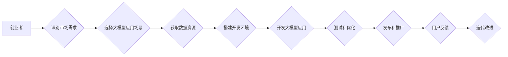

> 大模型、创业、人工智能、技术突破、商业模式、市场竞争、未来趋势

## 1. 背景介绍

近年来，人工智能（AI）技术突飞猛进，特别是大模型的出现，为各行各业带来了前所未有的机遇。大模型，指的是参数规模庞大、训练数据海量的人工智能模型，能够在自然语言处理、计算机视觉、语音识别等领域展现出强大的能力。

对于创业者来说，大模型的出现无疑是一个巨大的挑战和机遇。一方面，大模型的强大能力可以帮助创业者开发出更智能、更便捷的应用，提升产品竞争力；另一方面，大模型的开发和应用需要大量的技术积累和资源投入，创业者需要克服技术门槛和商业模式难题。

本文将从创业者的角度出发，探讨大模型时代创业者的困惑、突破和成长历程，希望能为创业者提供一些启示和帮助。

## 2. 核心概念与联系

### 2.1 大模型的概念

大模型是指参数规模庞大、训练数据海量的人工智能模型。其核心特点是：

* **参数规模庞大:** 大模型通常拥有数十亿甚至数千亿个参数，这使得模型能够学习到更复杂的模式和关系。
* **训练数据海量:** 大模型的训练需要海量的数据，才能保证模型的准确性和泛化能力。
* **强大的泛化能力:** 由于参数规模庞大，大模型能够在不同领域和任务上表现出强大的泛化能力，可以应用于自然语言处理、计算机视觉、语音识别等多个领域。

### 2.2 大模型与创业的联系

大模型为创业者提供了以下机遇：

* **开发智能应用:** 大模型可以帮助创业者开发出更智能、更便捷的应用，例如智能客服、智能写作、智能翻译等。
* **提升产品竞争力:** 大模型可以帮助创业者提升产品的智能化水平，增强产品的竞争力。
* **开拓新市场:** 大模型可以帮助创业者开拓新的市场，例如提供个性化定制服务、智能化解决方案等。

### 2.3 大模型的挑战

大模型也给创业者带来了以下挑战：

* **技术门槛高:** 大模型的开发和应用需要大量的技术积累和资源投入，创业者需要克服技术门槛。
* **数据获取困难:** 大模型的训练需要海量的数据，获取高质量的数据是一个难题。
* **成本高昂:** 大模型的训练和部署成本很高，创业者需要考虑成本问题。

**Mermaid 流程图**



## 3. 核心算法原理 & 具体操作步骤

### 3.1 算法原理概述

大模型的训练主要基于深度学习算法，其中Transformer模型是目前最流行的大模型架构之一。Transformer模型的核心思想是利用注意力机制来捕捉文本序列中的长距离依赖关系，从而提高模型的理解和生成能力。

### 3.2 算法步骤详解

大模型的训练过程可以概括为以下步骤：

1. **数据预处理:** 将原始数据进行清洗、格式化和编码，使其能够被模型理解。
2. **模型构建:** 根据具体的应用场景选择合适的模型架构，并设置模型参数。
3. **模型训练:** 使用训练数据训练模型，通过调整模型参数来最小化模型的损失函数。
4. **模型评估:** 使用测试数据评估模型的性能，例如准确率、召回率、F1-score等。
5. **模型调优:** 根据评估结果对模型参数进行调整，以提高模型性能。
6. **模型部署:** 将训练好的模型部署到生产环境中，用于实际应用。

### 3.3 算法优缺点

**优点:**

* 强大的泛化能力
* 可以处理复杂的任务
* 能够学习到复杂的模式和关系

**缺点:**

* 训练成本高昂
* 数据依赖性强
* 容易受到攻击

### 3.4 算法应用领域

大模型的应用领域非常广泛，包括：

* 自然语言处理：文本分类、情感分析、机器翻译、文本生成等
* 计算机视觉：图像识别、目标检测、图像分割等
* 语音识别：语音转文本、语音合成等
* 其他领域：药物研发、金融预测、医疗诊断等

## 4. 数学模型和公式 & 详细讲解 & 举例说明

### 4.1 数学模型构建

大模型的训练过程可以看作是一个优化问题，目标是找到一个模型参数向量，使得模型在训练数据上的损失函数最小。损失函数通常是模型预测值与真实值的差值，例如均方误差（MSE）或交叉熵损失（Cross-Entropy Loss）。

### 4.2 公式推导过程

假设模型的输出为 $y$，真实值是 $t$，损失函数为 $L(y,t)$，则模型的训练目标可以表示为：

$$
\min_{\theta} \mathcal{L}(\theta) = \frac{1}{N} \sum_{i=1}^{N} L(y_i, t_i)
$$

其中，$\theta$ 是模型参数向量，$N$ 是训练数据的数量。

为了找到最优的模型参数，可以使用梯度下降算法。梯度下降算法的基本思想是：沿着梯度方向更新模型参数，直到损失函数达到最小值。

梯度下降算法的更新公式为：

$$
\theta = \theta - \eta \nabla_{\theta} \mathcal{L}(\theta)
$$

其中，$\eta$ 是学习率，$\nabla_{\theta} \mathcal{L}(\theta)$ 是损失函数对模型参数的梯度。

### 4.3 案例分析与讲解

例如，在机器翻译任务中，模型的输出是翻译后的文本，真实值是目标语言的文本。可以使用交叉熵损失函数来衡量模型的性能。

交叉熵损失函数的公式为：

$$
L(y, t) = - \sum_{i=1}^{M} t_i \log(y_i)
$$

其中，$M$ 是目标语言文本的长度，$t_i$ 是目标语言文本的第 $i$ 个词的 one-hot 编码，$y_i$ 是模型预测的第 $i$ 个词的概率。

## 5. 项目实践：代码实例和详细解释说明

### 5.1 开发环境搭建

大模型的开发需要强大的计算资源，通常需要使用GPU加速训练。

常用的开发环境包括：

* **PyTorch:** 一个开源的深度学习框架，支持GPU加速。
* **TensorFlow:** 另一个开源的深度学习框架，也支持GPU加速。
* **HuggingFace Transformers:** 一个开源的库，提供预训练的大模型和训练工具。

### 5.2 源代码详细实现

以下是一个使用PyTorch训练BERT模型的简单代码示例：

```python
import torch
from torch.utils.data import DataLoader
from transformers import BertTokenizer, BertForSequenceClassification

# 加载预训练模型和 tokenizer
tokenizer = BertTokenizer.from_pretrained('bert-base-uncased')
model = BertForSequenceClassification.from_pretrained('bert-base-uncased', num_labels=2)

# 定义训练数据加载器
train_dataset = ...
train_dataloader = DataLoader(train_dataset, batch_size=32)

# 定义优化器和损失函数
optimizer = torch.optim.Adam(model.parameters(), lr=2e-5)
loss_fn = torch.nn.CrossEntropyLoss()

# 训练模型
for epoch in range(3):
    for batch in train_dataloader:
        input_ids = batch['input_ids']
        attention_mask = batch['attention_mask']
        labels = batch['labels']

        outputs = model(input_ids=input_ids, attention_mask=attention_mask, labels=labels)
        loss = outputs.loss

        optimizer.zero_grad()
        loss.backward()
        optimizer.step()

# 保存训练好的模型
model.save_pretrained('bert-model')
```

### 5.3 代码解读与分析

这段代码首先加载预训练的BERT模型和 tokenizer。然后定义训练数据加载器，使用Adam优化器和交叉熵损失函数训练模型。

训练过程循环遍历训练数据，计算模型的损失，并使用梯度下降算法更新模型参数。最后保存训练好的模型。

### 5.4 运行结果展示

训练完成后，可以使用测试数据评估模型的性能。

## 6. 实际应用场景

### 6.1 智能客服

大模型可以用于构建智能客服系统，能够自动回答用户的问题，提供24小时不间断服务。

### 6.2 智能写作

大模型可以辅助用户进行写作，例如生成文章标题、段落内容、甚至整篇文章。

### 6.3 个性化推荐

大模型可以根据用户的历史行为和偏好，推荐个性化的商品、服务或内容。

### 6.4 未来应用展望

大模型的应用场景还在不断扩展，未来可能会应用于更多领域，例如：

* 医疗诊断
* 法律咨询
* 教育培训
* 科学研究

## 7. 工具和资源推荐

### 7.1 学习资源推荐

* **课程:**
    * 深度学习 Specialization (Coursera)
    * Machine Learning (Stanford)
* **书籍:**
    * Deep Learning (Goodfellow et al.)
    * Hands-On Machine Learning with Scikit-Learn, Keras & TensorFlow (Aurélien Géron)
* **博客:**
    * The Gradient
    * Towards Data Science

### 7.2 开发工具推荐

* **深度学习框架:** PyTorch, TensorFlow
* **预训练模型库:** HuggingFace Transformers
* **云计算平台:** Google Cloud AI Platform, Amazon SageMaker, Microsoft Azure AI

### 7.3 相关论文推荐

* Attention Is All You Need (Vaswani et al., 2017)
* BERT: Pre-training of Deep Bidirectional Transformers for Language Understanding (Devlin et al., 2018)
* GPT-3: Language Models are Few-Shot Learners (Brown et al., 2020)

## 8. 总结：未来发展趋势与挑战

### 8.1 研究成果总结

近年来，大模型在自然语言处理、计算机视觉等领域取得了显著的成果，展现出强大的能力。

### 8.2 未来发展趋势

未来，大模型的发展趋势包括：

* **模型规模更大:** 模型参数规模将继续扩大，以提高模型的性能。
* **多模态学习:** 大模型将能够处理多种数据类型，例如文本、图像、音频等。
* **可解释性增强:** 研究人员将致力于提高大模型的可解释性，使其决策过程更加透明。

### 8.3 面临的挑战

大模型的发展也面临着一些挑战：

* **计算资源需求高:** 训练大模型需要大量的计算资源，成本很高。
* **数据安全和隐私问题:** 大模型的训练需要海量数据，如何保证数据安全和隐私是一个重要问题。
* **伦理问题:** 大模型的应用可能会带来一些伦理问题，例如算法偏见、信息操纵等。

### 8.4 研究展望

未来，大模型的研究将继续深入，探索其更广泛的应用场景，并解决其面临的挑战。

## 9. 附录：常见问题与解答

### 9.1 如何选择合适的预训练模型？

选择预训练模型需要根据具体的应用场景和任务需求。

### 9.2 如何训练自己的大模型？

训练自己的大模型需要强大的计算资源和专业知识。

### 9.3 如何评估大模型的性能？

大模型的性能可以通过多种指标进行评估，例如准确率、召回率、F1-score等。

### 9.4 如何解决大模型的过拟合问题？

可以使用正则化技术