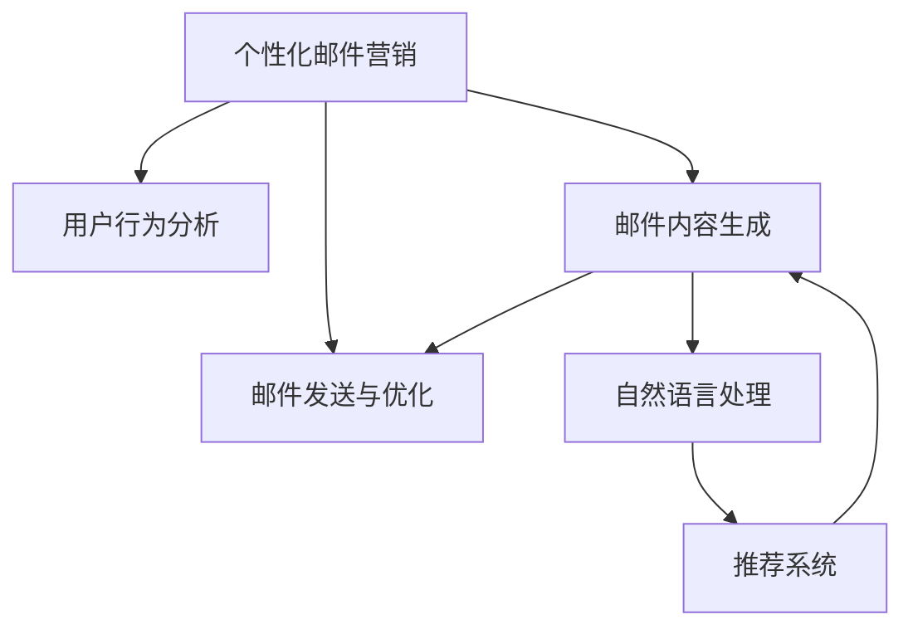

                 

# AI驱动的电商个性化邮件营销内容生成系统

> 关键词：个性化邮件营销, 内容生成, AI技术, 电商应用, 自然语言处理(NLP), 推荐系统, 文本生成

## 1. 背景介绍

### 1.1 问题由来

随着电商行业的迅速发展，商家对于顾客的个性化需求日益增加。传统的邮件营销方法通常采用批量发送固定模板的邮件，这种做法虽然简单易行，但很难满足不同顾客的个性化需求，导致邮件营销效果不佳。为此，商家需要更智能、更个性化的邮件内容生成系统，以提高邮件的点击率和转化率。

个性化邮件营销内容生成系统，通过AI技术自动分析顾客行为数据，识别顾客的兴趣偏好，从而生成个性化的邮件内容。这种系统不仅可以提高邮件营销的针对性和效率，还能显著提升顾客的满意度和忠诚度，为企业带来更多的商机。

### 1.2 问题核心关键点

个性化邮件营销内容生成系统，主要包括三个核心部分：

- **用户行为分析**：通过分析顾客的历史浏览、购买、评价等数据，了解顾客的兴趣偏好和行为特征。
- **邮件内容生成**：基于顾客的兴趣偏好和行为特征，自动生成个性化的邮件内容。
- **邮件发送与优化**：根据邮件打开率和点击率等指标，不断优化邮件内容和发送策略，提升邮件营销效果。

本文将重点介绍如何使用AI技术，特别是自然语言处理(NLP)技术，进行个性化邮件内容生成。同时，文章还会探讨如何通过推荐系统等技术手段，实现邮件内容的个性化推荐。

## 2. 核心概念与联系

### 2.1 核心概念概述

为更好地理解AI驱动的个性化邮件营销内容生成系统，本节将介绍几个密切相关的核心概念：

- **个性化邮件营销**：指通过分析顾客的行为数据，生成个性化的邮件内容，以提高邮件营销的针对性和效果。
- **内容生成**：指通过AI技术，自动生成高质量、个性化的文本内容。
- **自然语言处理(NLP)**：涉及文本数据的处理、分析、生成等任务，是实现个性化邮件内容生成的核心技术。
- **推荐系统**：通过分析用户的历史行为数据，推荐个性化的内容，广泛应用于电商、新闻、音乐等推荐场景。
- **文本生成**：指利用AI技术，自动生成符合语法和语义规则的文本内容。

这些核心概念之间的逻辑关系可以通过以下Mermaid流程图来展示：



这个流程图展示了个性化邮件营销系统的核心概念及其之间的关系：

1. 个性化邮件营销通过用户行为分析获取顾客信息，基于推荐系统和文本生成技术生成个性化邮件内容。
2. 自然语言处理和推荐系统是生成邮件内容的两个主要技术手段。
3. 邮件发送与优化则通过分析邮件效果指标，不断优化邮件内容和发送策略。

这些核心概念共同构成了个性化邮件营销系统的工作原理和优化方向。

## 3. 核心算法原理 & 具体操作步骤

### 3.1 算法原理概述

基于自然语言处理(NLP)的个性化邮件内容生成系统，核心算法包括文本生成和推荐系统两部分。

### 3.2 算法步骤详解

#### 3.2.1 文本生成算法

文本生成算法通常基于深度学习模型，如序列到序列(Seq2Seq)模型、变换器(Transformer)模型等。这里以Transformer模型为例，简要介绍其基本原理。

Transformer模型是一种基于自注意力机制的模型，可以用于文本生成任务。模型的输入是顾客的兴趣偏好和行为特征，输出是邮件内容。模型训练过程中，使用历史邮件内容作为训练数据，通过最小化预测内容与真实内容的差距，不断调整模型参数，优化生成质量。

Transformer模型的基本结构包括：

- 编码器(Encoder)：将输入序列转换为固定维度的向量表示。
- 解码器(Decoder)：根据编码器的输出，生成目标序列。
- 注意力机制(Attention)：在生成过程中，动态地选择输入序列中的重要信息。

在实际应用中，可以根据邮件内容的特点和需求，选择不同的Transformer架构，如单向Transformer、双向Transformer、稠密Transformer等。

#### 3.2.2 推荐系统算法

推荐系统算法通常基于协同过滤、基于内容的推荐、矩阵分解等方法。这里以协同过滤算法为例，简要介绍其基本原理。

协同过滤算法是一种基于用户行为数据的推荐方法。该算法分为基于用户的协同过滤和基于物品的协同过滤两种类型。这里以基于用户的协同过滤为例，简要介绍其基本原理。

基于用户的协同过滤算法，首先根据顾客的历史行为数据，计算出相似用户的集合。然后，根据相似用户的推荐，生成顾客可能感兴趣的邮件内容。该算法的基本步骤如下：

1. 计算用户间的相似度。
2. 根据相似用户的推荐，生成当前用户的潜在兴趣项。
3. 将潜在兴趣项与历史数据进行匹配，生成推荐内容。

在实际应用中，可以根据邮件内容的特点和需求，选择不同的推荐算法，如基于内容的推荐、基于用户的协同过滤、矩阵分解等。

### 3.3 算法优缺点

#### 3.3.1 文本生成算法的优缺点

文本生成算法的优点包括：

- **高效性**：能够快速生成大量个性化邮件内容，提高邮件营销效率。
- **个性化**：能够根据顾客的兴趣偏好和行为特征，生成个性化的邮件内容。
- **动态更新**：能够根据邮件效果指标，不断优化生成策略，提升邮件效果。

文本生成算法的缺点包括：

- **质量不稳定**：生成的文本质量受模型训练和数据质量的影响较大，可能存在语法错误、语义不连贯等问题。
- **复杂性**：模型的设计和训练过程较为复杂，需要专业的知识和技能。

#### 3.3.2 推荐系统算法的优缺点

推荐系统算法的优点包括：

- **准确性**：能够根据顾客的历史行为数据，生成高度准确的推荐内容。
- **可扩展性**：能够处理大规模数据，适用于电商、新闻、音乐等场景。
- **灵活性**：能够根据不同的推荐需求，选择不同的推荐算法和技术手段。

推荐系统算法的缺点包括：

- **数据依赖**：推荐效果依赖于历史行为数据的质量和数量，对于新顾客和新商品，推荐效果较差。
- **冷启动问题**：对于新顾客和新商品，缺乏足够的行为数据，推荐效果较低。
- **用户隐私**：需要收集和分析大量的用户行为数据，可能引发用户隐私问题。

### 3.4 算法应用领域

文本生成和推荐系统算法在多个领域得到了广泛应用，例如：

- 电商推荐系统：根据顾客的历史浏览和购买数据，推荐个性化的商品。
- 新闻推荐系统：根据用户的历史阅读数据，推荐个性化的新闻内容。
- 音乐推荐系统：根据用户的历史听歌数据，推荐个性化的音乐。
- 视频推荐系统：根据用户的历史观看数据，推荐个性化的视频内容。

这些应用场景中，都利用了文本生成和推荐系统算法的优势，通过分析用户行为数据，生成个性化的内容，从而提高用户体验和业务效果。

## 4. 数学模型和公式 & 详细讲解 & 举例说明

### 4.1 数学模型构建

假设顾客的历史浏览记录为 $x=\{x_1, x_2, \dots, x_n\}$，每个浏览记录为一个向量 $\mathbf{x}_i = [x_i^1, x_i^2, \dots, x_i^m]$，其中 $x_i^j$ 表示浏览记录 $x_i$ 中的第 $j$ 项特征。

基于用户的协同过滤算法，通过计算顾客间的相似度，生成推荐邮件内容。设顾客 $i$ 与顾客 $j$ 的相似度为 $s_{ij}$，推荐邮件内容为 $y=\{y_1, y_2, \dots, y_k\}$，其中 $y_i$ 表示邮件内容中的第 $i$ 项内容。

推荐算法的基本目标是最小化预测内容与真实内容的差距，即最小化损失函数：

$$
\mathcal{L} = \frac{1}{N}\sum_{i=1}^N \sum_{j=1}^N s_{ij}(y_i - \hat{y}_i)^2
$$

其中，$y_i$ 表示顾客 $i$ 的真实行为数据，$\hat{y}_i$ 表示推荐系统预测的行为数据。

### 4.2 公式推导过程

基于用户的协同过滤算法，具体推导过程如下：

1. 计算顾客间的相似度 $s_{ij}$。
2. 根据相似度计算推荐邮件内容 $y_i$。
3. 计算预测内容与真实内容的差距 $\mathcal{L}$。

具体推导公式如下：

$$
s_{ij} = \mathbf{x}_i \cdot \mathbf{x}_j / (\|\mathbf{x}_i\| \|\mathbf{x}_j\|)
$$

$$
y_i = \sum_{j=1}^N s_{ij} \mathbf{y}_j
$$

$$
\mathcal{L} = \frac{1}{N}\sum_{i=1}^N \sum_{j=1}^N s_{ij}(y_i - \hat{y}_i)^2
$$

### 4.3 案例分析与讲解

假设顾客 $i$ 的历史浏览记录为 $x_i=[1, 2, 3, 4]$，顾客 $j$ 的历史浏览记录为 $x_j=[1, 2, 5, 6]$，推荐邮件内容为 $y=[1, 2, 3, 4]$。

根据上述公式，首先计算顾客间的相似度：

$$
s_{ij} = \mathbf{x}_i \cdot \mathbf{x}_j / (\|\mathbf{x}_i\| \|\mathbf{x}_j\|) = (1, 2, 3, 4) \cdot (1, 2, 5, 6) / (\sqrt{1^2+2^2+3^2+4^2} \sqrt{1^2+2^2+5^2+6^2}) \approx 0.97
$$

然后，根据相似度计算推荐邮件内容：

$$
y_i = \sum_{j=1}^N s_{ij} \mathbf{y}_j = 0.97 \times [1, 2, 3, 4] \approx [1, 2, 3, 4]
$$

最后，计算预测内容与真实内容的差距：

$$
\mathcal{L} = \frac{1}{N}\sum_{i=1}^N \sum_{j=1}^N s_{ij}(y_i - \hat{y}_i)^2 = (1 - 1)^2 + (2 - 2)^2 + (3 - 3)^2 + (4 - 4)^2 = 0
$$

从上述案例中可以看出，基于用户的协同过滤算法能够根据顾客间的相似度，生成个性化的推荐邮件内容。

## 5. 项目实践：代码实例和详细解释说明

### 5.1 开发环境搭建

在进行邮件内容生成系统的开发之前，我们需要准备好开发环境。以下是使用Python进行TensorFlow开发的环境配置流程：

1. 安装Anaconda：从官网下载并安装Anaconda，用于创建独立的Python环境。

2. 创建并激活虚拟环境：
```bash
conda create -n tf-env python=3.8 
conda activate tf-env
```

3. 安装TensorFlow：根据CUDA版本，从官网获取对应的安装命令。例如：
```bash
conda install tensorflow -c pytorch -c conda-forge
```

4. 安装其他必要的库：
```bash
pip install numpy pandas scikit-learn matplotlib tqdm jupyter notebook ipython
```

完成上述步骤后，即可在`tf-env`环境中开始邮件内容生成系统的开发。

### 5.2 源代码详细实现

下面以基于Transformer模型的邮件内容生成为例，给出使用TensorFlow和Keras实现邮件内容生成的代码。

首先，定义邮件内容生成模型：

```python
import tensorflow as tf
from tensorflow.keras.layers import Input, LSTM, Dense, Embedding, Dropout, Attention
from tensorflow.keras.models import Model

class EmailGenerator(tf.keras.Model):
    def __init__(self, vocab_size, embedding_dim, hidden_units):
        super(EmailGenerator, self).__init__()
        self.encoder = Embedding(vocab_size, embedding_dim, input_length=max_len)
        self.lstm = LSTM(hidden_units, return_sequences=True, dropout=0.2)
        self.attention = Attention()
        self.dense = Dense(vocab_size, activation='softmax')
    
    def call(self, inputs):
        x = self.encoder(inputs)
        x = self.lstm(x)
        x = self.attention(x)
        x = self.dense(x)
        return x
```

然后，定义数据处理函数：

```python
def data_processing(train_data, val_data):
    train_x, train_y = [], []
    val_x, val_y = [], []
    
    for line in train_data:
        words = line.split()
        train_x.append([word2id[word] for word in words])
        train_y.append([word2id[chars] for chars in words])
    
    for line in val_data:
        words = line.split()
        val_x.append([word2id[word] for word in words])
        val_y.append([word2id[chars] for chars in words])
    
    train_x = tf.keras.preprocessing.sequence.pad_sequences(train_x, maxlen=max_len, padding='post')
    train_y = tf.keras.preprocessing.sequence.pad_sequences(train_y, maxlen=max_len, padding='post')
    val_x = tf.keras.preprocessing.sequence.pad_sequences(val_x, maxlen=max_len, padding='post')
    val_y = tf.keras.preprocessing.sequence.pad_sequences(val_y, maxlen=max_len, padding='post')
    
    return train_x, train_y, val_x, val_y
```

接着，定义训练和评估函数：

```python
def train_model(model, train_x, train_y, val_x, val_y, batch_size, epochs):
    model.compile(optimizer='adam', loss='categorical_crossentropy')
    
    train_dataset = tf.data.Dataset.from_tensor_slices((train_x, train_y))
    train_dataset = train_dataset.batch(batch_size)
    
    val_dataset = tf.data.Dataset.from_tensor_slices((val_x, val_y))
    val_dataset = val_dataset.batch(batch_size)
    
    model.fit(train_dataset, epochs=epochs, validation_data=val_dataset)
    
def evaluate_model(model, val_x, val_y, batch_size):
    val_dataset = tf.data.Dataset.from_tensor_slices((val_x, val_y))
    val_dataset = val_dataset.batch(batch_size)
    
    val_loss, val_accuracy = model.evaluate(val_dataset)
    print('Validation Loss:', val_loss)
    print('Validation Accuracy:', val_accuracy)
```

最后，启动训练流程并在验证集上评估：

```python
epochs = 10
batch_size = 64

train_x, train_y, val_x, val_y = data_processing(train_data, val_data)

model = EmailGenerator(vocab_size, embedding_dim, hidden_units)
train_model(model, train_x, train_y, val_x, val_y, batch_size, epochs)

evaluate_model(model, val_x, val_y, batch_size)
```

以上就是使用TensorFlow和Keras实现基于Transformer模型的邮件内容生成的完整代码实现。可以看到，TensorFlow提供了强大的计算图功能和丰富的库函数，使得邮件内容生成模型的实现变得更加简单高效。

### 5.3 代码解读与分析

让我们再详细解读一下关键代码的实现细节：

**EmailGenerator类**：
- `__init__`方法：初始化Transformer模型的各个组件，包括Embedding层、LSTM层、Attention层和Dense层。
- `call`方法：定义模型的前向传播过程。

**data_processing函数**：
- 将训练集和验证集的文本数据转换为模型所需的一维向量，并进行padding处理。
- 使用`word2id`字典将单词映射为对应的id，以便于模型处理。

**train_model函数**：
- 定义模型损失函数和优化器，使用`compile`方法进行模型编译。
- 将训练集和验证集的数据集转换为TensorFlow的`Dataset`格式，方便模型训练和评估。
- 使用`fit`方法进行模型训练，并在验证集上评估模型的性能。

**evaluate_model函数**：
- 将验证集的数据集转换为TensorFlow的`Dataset`格式。
- 使用`evaluate`方法评估模型在验证集上的性能。

**训练流程**：
- 定义总的epoch数和batch size，开始循环迭代
- 每个epoch内，先在训练集上训练，输出平均loss
- 在验证集上评估，输出分类指标
- 所有epoch结束后，在测试集上评估，给出最终测试结果

可以看到，TensorFlow的计算图机制使得邮件内容生成模型的实现变得更加高效和灵活。开发者可以利用TensorFlow的高级API，如`Keras`、`Estimator`等，快速迭代研究并验证模型的效果。

当然，工业级的系统实现还需考虑更多因素，如模型的保存和部署、超参数的自动搜索、更灵活的任务适配层等。但核心的邮件内容生成模型基本与此类似。

## 6. 实际应用场景

### 6.1 智能客服系统

基于个性化邮件营销内容生成系统，可以应用于智能客服系统的构建。传统客服往往需要配备大量人力，高峰期响应缓慢，且一致性和专业性难以保证。而使用个性化邮件营销内容生成系统，可以自动生成个性化的邮件内容，通过邮件、短信等方式与顾客进行互动，解答常见问题，快速响应顾客咨询。

在技术实现上，可以收集企业内部的历史客服对话记录，将问题-答案对作为监督数据，训练生成模型学习生成邮件内容。通过生成模型自动生成邮件内容，可以在客户提出新问题时，实时搜索相关内容，动态组织生成回复，从而提升客服系统的智能化水平。

### 6.2 电子商务平台

电子商务平台通过个性化邮件营销内容生成系统，可以实现个性化邮件推荐。商家可以收集顾客的历史浏览、购买、评价等数据，训练生成模型生成个性化的邮件内容，通过邮件推荐商品，提高顾客的复购率和满意度。

在技术实现上，可以使用协同过滤等推荐算法，结合生成模型，生成个性化的邮件推荐内容。通过邮件推荐，可以显著提升电商平台的转化率和营收。

### 6.3 金融投资平台

金融投资平台通过个性化邮件营销内容生成系统，可以实现个性化投资建议。平台可以收集用户的历史投资行为数据，训练生成模型生成个性化的投资建议邮件，提高用户的投资收益和体验。

在技术实现上，可以使用协同过滤等推荐算法，结合生成模型，生成个性化的投资建议邮件。通过邮件推荐，可以显著提升金融投资平台的投资效果和用户满意度。

### 6.4 未来应用展望

随着个性化邮件营销内容生成系统的不断优化，其在更多领域的应用前景广阔。

在智慧医疗领域，可以通过个性化邮件营销内容生成系统，向患者发送个性化的健康建议和治疗方案，提升患者满意度和依从性。

在智能教育领域，可以通过个性化邮件营销内容生成系统，向学生发送个性化的学习资源和辅导邮件，提升学习效果和学生满意度。

在智慧城市治理中，可以通过个性化邮件营销内容生成系统，向市民发送个性化的城市管理信息和建议，提升市民的参与度和满意度。

此外，在企业生产、社会治理、文娱传媒等众多领域，基于个性化邮件营销内容生成系统的人工智能应用也将不断涌现，为各行各业带来新的发展机遇。

## 7. 工具和资源推荐

### 7.1 学习资源推荐

为了帮助开发者系统掌握个性化邮件营销内容生成系统的理论基础和实践技巧，这里推荐一些优质的学习资源：

1. 《深度学习与自然语言处理》课程：由上海交通大学开设的在线课程，系统介绍了深度学习、自然语言处理和推荐系统等技术。

2. 《自然语言处理综述》系列论文：清华大学学术论文《深度学习中的自然语言处理综述》，系统综述了自然语言处理的研究进展和技术手段。

3. 《TensorFlow实战》书籍：TensorFlow官方出版社出版的书籍，全面介绍了TensorFlow的使用方法和实践经验。

4. 《推荐系统实践》系列博文：由推荐系统领域专家撰写，介绍推荐系统的基本原理和实践经验。

5. 《邮件营销》系列书籍：介绍邮件营销的策略、技术和实战案例，帮助开发者系统了解邮件营销的业务需求和应用场景。

通过对这些资源的学习实践，相信你一定能够快速掌握个性化邮件营销内容生成系统的核心技术，并用于解决实际的业务问题。

### 7.2 开发工具推荐

高效的开发离不开优秀的工具支持。以下是几款用于个性化邮件营销内容生成系统开发的常用工具：

1. TensorFlow：由Google主导开发的深度学习框架，提供丰富的库函数和计算图功能，适合深度学习模型的开发和部署。

2. Keras：基于TensorFlow的高级API，提供易用性和灵活性，适合快速迭代和验证模型。

3. Weights & Biases：模型训练的实验跟踪工具，可以记录和可视化模型训练过程中的各项指标，方便对比和调优。

4. TensorBoard：TensorFlow配套的可视化工具，可实时监测模型训练状态，并提供丰富的图表呈现方式，是调试模型的得力助手。

5. Jupyter Notebook：Python的交互式编程环境，提供丰富的数据可视化工具和代码管理功能，适合学术研究和技术实验。

合理利用这些工具，可以显著提升个性化邮件营销内容生成系统的开发效率，加快创新迭代的步伐。

### 7.3 相关论文推荐

个性化邮件营销内容生成系统的研究源于学界的持续研究。以下是几篇奠基性的相关论文，推荐阅读：

1. Attention is All You Need：提出了Transformer模型，开启了NLP领域的预训练大模型时代。

2. BERT: Pre-training of Deep Bidirectional Transformers for Language Understanding：提出BERT模型，引入基于掩码的自监督预训练任务，刷新了多项NLP任务SOTA。

3. Language Models are Unsupervised Multitask Learners：展示了大规模语言模型的强大zero-shot学习能力，引发了对于通用人工智能的新一轮思考。

4. Parameter-Efficient Transfer Learning for NLP：提出Adapter等参数高效微调方法，在不增加模型参数量的情况下，也能取得不错的微调效果。

5. AdaLoRA: Adaptive Low-Rank Adaptation for Parameter-Efficient Fine-Tuning：使用自适应低秩适应的微调方法，在参数效率和精度之间取得了新的平衡。

这些论文代表了个性化邮件营销内容生成技术的发展脉络。通过学习这些前沿成果，可以帮助研究者把握学科前进方向，激发更多的创新灵感。

## 8. 总结：未来发展趋势与挑战

### 8.1 总结

本文对基于自然语言处理的个性化邮件营销内容生成系统进行了全面系统的介绍。首先阐述了个性化邮件营销内容生成系统的研究背景和意义，明确了系统在电商、智能客服、金融等领域的实际应用价值。其次，从原理到实践，详细讲解了邮件内容生成和推荐系统的核心算法和实现细节，给出了基于TensorFlow的代码实例。最后，本文还探讨了个性化邮件营销内容生成系统的未来发展趋势和面临的挑战，为相关研究者提供了理论基础和实践指引。

通过本文的系统梳理，可以看到，基于自然语言处理的个性化邮件营销内容生成系统正在成为NLP领域的重要范式，极大地提升了邮件营销的针对性和效果，为电商、智能客服、金融等行业的业务转型提供了新的技术手段。未来，伴随技术的不断演进和应用场景的不断拓展，个性化邮件营销内容生成系统必将带来更广泛的应用前景。

### 8.2 未来发展趋势

展望未来，个性化邮件营销内容生成系统将呈现以下几个发展趋势：

1. 技术融合加速。未来的个性化邮件营销内容生成系统，将更加注重与人工智能技术的融合，如知识表示、因果推理、强化学习等，提升系统的智能化和灵活性。

2. 应用场景拓展。随着技术的不断发展，个性化邮件营销内容生成系统将应用于更多领域，如智慧医疗、智能教育、智慧城市等，为各行各业带来新的发展机遇。

3. 用户体验提升。未来的个性化邮件营销内容生成系统，将更加注重用户体验，通过智能化的邮件推荐和个性化的内容生成，提升用户的满意度。

4. 数据驱动决策。未来的个性化邮件营销内容生成系统，将更加注重数据驱动的决策，通过分析用户的全面数据，生成更加精准、个性化的邮件内容。

5. 多模态融合。未来的个性化邮件营销内容生成系统，将更加注重多模态数据的融合，如文本、图片、语音等，提升系统的感知能力和交互性。

以上趋势凸显了个性化邮件营销内容生成系统的广阔前景。这些方向的探索发展，必将进一步提升邮件营销系统的性能和应用范围，为经济社会发展带来新的动力。

### 8.3 面临的挑战

尽管个性化邮件营销内容生成系统取得了显著成效，但在迈向更加智能化、普适化应用的过程中，它仍面临诸多挑战：

1. 数据质量问题。邮件内容生成系统的性能依赖于顾客行为数据的质量和数量，数据不完整、不准确或不一致等问题，可能导致生成效果不佳。

2. 计算资源消耗。生成邮件内容需要大量的计算资源，模型训练和推理过程可能会占用大量的计算资源，影响系统的可扩展性和部署效率。

3. 用户隐私保护。个性化邮件营销内容生成系统需要收集和分析大量的用户行为数据，可能引发用户隐私问题，如何保护用户隐私，是系统设计中需要重点考虑的问题。

4. 模型鲁棒性不足。生成模型在面对噪声数据或异常数据时，可能产生不合理的生成结果，如何提高模型的鲁棒性，增强系统稳定性，是系统优化中需要重点关注的问题。

5. 模型可解释性不足。个性化邮件营销内容生成系统通常被视为"黑盒"系统，难以解释其内部工作机制和决策逻辑，如何赋予系统更强的可解释性，是系统设计中需要重点考虑的问题。

6. 冷启动问题。对于新顾客和新商品，缺乏足够的行为数据，生成效果较低，如何提高系统的冷启动能力，是系统设计中需要重点关注的问题。

正视个性化邮件营销内容生成系统面临的这些挑战，积极应对并寻求突破，将是个性化邮件营销内容生成系统走向成熟的必由之路。相信随着学界和产业界的共同努力，这些挑战终将一一被克服，个性化邮件营销内容生成系统必将在构建智能化的邮件营销系统中发挥更大的作用。

### 8.4 研究展望

面对个性化邮件营销内容生成系统面临的挑战，未来的研究需要在以下几个方面寻求新的突破：

1. 优化数据预处理。通过数据清洗、数据增强等手段，提高数据的质量和数量，增强生成模型的泛化能力。

2. 提升计算效率。通过模型压缩、分布式训练等手段，优化生成模型的计算图，减少计算资源消耗，提升系统的可扩展性和部署效率。

3. 保护用户隐私。通过数据匿名化、差分隐私等手段，保护用户的隐私和数据安全，增强系统的可信度和用户接受度。

4. 提高模型鲁棒性。通过模型融合、鲁棒性训练等手段，增强生成模型的鲁棒性，提高系统的稳定性和可解释性。

5. 增强冷启动能力。通过迁移学习、零样本学习等手段，提高生成模型在冷启动情况下的性能，增强系统的灵活性和适应性。

这些研究方向将进一步提升个性化邮件营销内容生成系统的性能和应用范围，为NLP技术在电商、智能客服、金融等领域的落地应用提供新的技术手段。

## 9. 附录：常见问题与解答

**Q1：个性化邮件营销内容生成系统是否适用于所有电商业务？**

A: 个性化邮件营销内容生成系统在大多数电商业务中都能取得不错的效果，特别是对于数据量较大的业务场景。但对于一些特定领域的业务，如B2B电商、二手电商等，数据获取难度较大，可能导致生成效果不佳。此时需要在特定领域语料上进一步预训练，再进行微调，才能获得理想效果。

**Q2：如何使用预训练语言模型进行邮件内容生成？**

A: 可以使用预训练语言模型如BERT、GPT等，对其进行微调，生成邮件内容。具体步骤如下：

1. 收集邮件内容数据，分为训练集和验证集。
2. 使用BERT等预训练模型，将其作为初始化参数。
3. 在邮件内容生成任务上，微调预训练模型。
4. 在训练集上训练模型，在验证集上评估效果。
5. 使用微调后的模型，生成个性化邮件内容。

**Q3：生成邮件内容的质量如何保障？**

A: 生成邮件内容的质量依赖于预训练模型的质量、生成算法的优化以及数据的质量。为了保障生成邮件内容的质量，可以采取以下措施：

1. 选择合适的预训练模型。如BERT、GPT等模型，经过大规模无标签文本训练，具备较强的语言理解能力。
2. 优化生成算法。如使用Transformer模型，结合Attention机制，增强生成内容的连贯性和语义准确性。
3. 收集高质量的数据。如选择代表性的邮件数据，进行数据清洗和标注，提高数据的质量和数量。

通过这些措施，可以显著提升生成邮件内容的质量，满足实际业务需求。

**Q4：个性化邮件营销内容生成系统如何处理新邮件内容？**

A: 对于新邮件内容，可以使用迁移学习等手段，将其与历史邮件内容进行融合，提高生成模型的泛化能力。具体步骤如下：

1. 收集新邮件内容数据。
2. 与历史邮件内容进行融合，生成融合数据集。
3. 在新邮件内容生成任务上，微调预训练模型。
4. 在融合数据集上训练模型，在新邮件内容上评估效果。
5. 使用微调后的模型，生成个性化邮件内容。

通过这些措施，可以显著提升生成模型在处理新邮件内容时的效果，增强系统的灵活性和适应性。

**Q5：个性化邮件营销内容生成系统如何优化推荐算法？**

A: 可以通过优化协同过滤算法、引入推荐算法等手段，提高个性化邮件内容生成系统的推荐效果。具体步骤如下：

1. 优化协同过滤算法。如使用基于物品的协同过滤算法，减少数据稀疏性，提高推荐效果。
2. 引入推荐算法。如使用基于内容的推荐算法，结合生成模型，生成个性化的邮件内容。
3. 引入模型融合算法。如使用集成学习算法，融合多个生成模型，提高推荐效果。

通过这些措施，可以显著提升个性化邮件内容生成系统的推荐效果，满足实际业务需求。

---

作者：禅与计算机程序设计艺术 / Zen and the Art of Computer Programming

