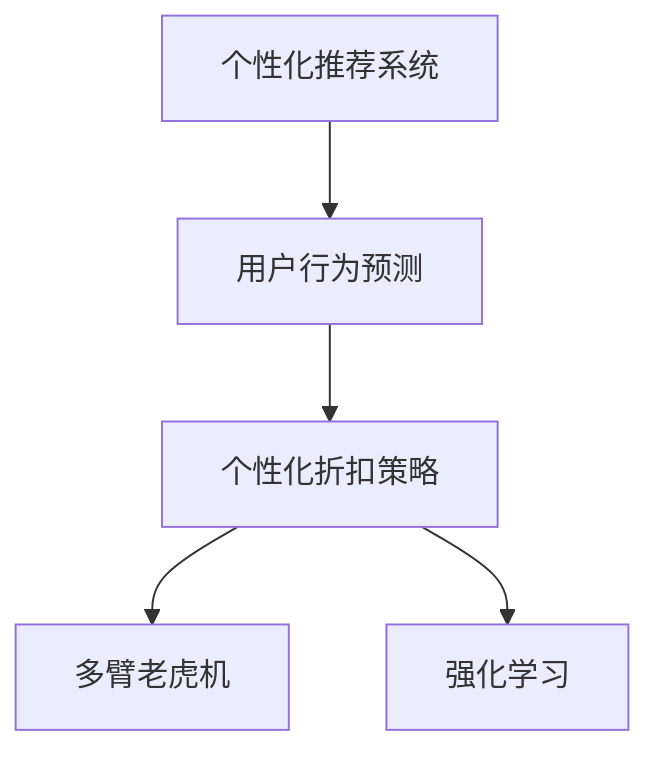

                 

## 1. 背景介绍

在电子商务的迅猛发展中，个性化营销成为各大平台提升用户体验、增强用户粘性的重要手段。尤其在“双十一”、“618”等购物节期间，个性化推荐和个性化折扣策略的精准度和覆盖率，直接影响平台的用户留存率和营收增长。

然而，构建高效准确的个性化折扣策略，需要精确理解每个用户的行为特征，同时预测其未来行为，这不仅对数据处理能力提出了高要求，还需要合理利用AI技术，实现策略的智能生成和持续优化。

近年来，随着深度学习技术在电商行业的广泛应用，基于机器学习的方法，已经成功应用于电商平台推荐、广告投放、用户行为预测等多个场景。但如何将这些技术更好地应用到个性化折扣策略中，仍是一个待攻克的难题。

本文旨在探讨基于AI驱动的个性化折扣策略，通过机器学习和大数据技术，实现对用户行为的智能预测和个性化折扣的精准推送，从而提升电商平台的营销效果和用户体验。

## 2. 核心概念与联系

### 2.1 核心概念概述

本节将介绍构建个性化折扣策略所需的核心概念及其相互联系：

- **个性化推荐系统(Recommender System)**：根据用户的历史行为和兴趣，推荐用户可能感兴趣的商品或服务。通常基于协同过滤、基于内容的推荐、矩阵分解等技术实现。
- **用户行为预测(Predictive Modeling)**：通过历史数据预测用户未来行为，如购买意向、点击行为等。常见的方法包括时间序列分析、决策树、随机森林、深度学习等。
- **个性化折扣策略(Personalized Discount Strategy)**：根据用户行为预测，动态生成个性化折扣，如全站通用折扣、商品特定折扣等，以提高用户转化率。
- **多臂老虎机(Multi-Armed Bandit, MAB)**：一种随机优化算法，用于在多个选项中，选择最有希望的策略以最大化长期收益。
- **强化学习(Reinforcement Learning)**：通过与环境的交互，学习最优的策略以最大化长期奖励。强化学习在电商平台的个性化策略优化中，可实现更动态、更自适应的策略调整。

这些概念之间的逻辑关系可以通过以下Mermaid流程图来展示：



这个流程图展示了从个性化推荐系统到用户行为预测，再到个性化折扣策略，最终结合多臂老虎机和强化学习，实现个性化折扣策略动态优化的完整过程。

## 3. 核心算法原理 & 具体操作步骤

### 3.1 算法原理概述

基于AI驱动的个性化折扣策略的核心原理，是通过深度学习和强化学习等技术，构建预测模型和推荐策略模型，实现对用户未来行为的预测，并动态调整折扣策略，以最大化用户转化率和平台收益。

具体步骤如下：

1. **数据准备**：收集用户的历史行为数据、商品信息、交易记录等，进行数据清洗和预处理。
2. **用户行为预测**：利用机器学习模型，预测用户未来可能购买的商品和购买时机。
3. **个性化推荐**：基于预测结果，使用个性化推荐算法，推荐用户可能感兴趣的商品。
4. **个性化折扣策略生成**：根据推荐结果，动态生成个性化折扣，并实时推送给用户。
5. **效果评估与策略优化**：利用多臂老虎机和强化学习，评估策略效果，并持续优化折扣策略。

### 3.2 算法步骤详解

**Step 1: 数据准备**
- **数据收集**：包括用户行为数据（浏览、点击、加入购物车等）、商品信息（属性、价格、销量等）、交易记录（购买、退货、评分等）。
- **数据清洗**：去重、缺失值处理、异常值检测。
- **特征工程**：提取和构造有助于预测和推荐的特征，如用户兴趣、商品属性、购买历史等。

**Step 2: 用户行为预测**
- **模型选择**：选择合适的机器学习模型，如随机森林、XGBoost、深度学习模型（如DNN、CNN、RNN等）。
- **模型训练**：使用历史数据训练模型，并设置合适的超参数。
- **预测生成**：利用训练好的模型，对用户未来行为进行预测，生成用户可能购买的商品列表。

**Step 3: 个性化推荐**
- **推荐算法**：选择适合的推荐算法，如基于协同过滤、基于内容的推荐、基于矩阵分解等。
- **模型训练**：训练推荐模型，并调整超参数。
- **推荐结果**：根据用户行为预测结果，生成个性化推荐商品列表。

**Step 4: 个性化折扣策略生成**
- **策略设计**：设计不同类型的个性化折扣策略，如全站通用折扣、商品特定折扣、限时折扣等。
- **策略评估**：评估不同策略的效果，选择最佳策略。
- **折扣生成**：根据推荐结果，生成个性化折扣，并实时推送给用户。

**Step 5: 效果评估与策略优化**
- **多臂老虎机**：利用多臂老虎机算法，优化折扣策略，以最大化长期收益。
- **强化学习**：采用强化学习技术，根据用户反馈和行为数据，动态调整折扣策略。

### 3.3 算法优缺点

**优点**：
1. **高效精准**：基于深度学习和强化学习，能够高效地进行用户行为预测和折扣策略优化。
2. **自适应性**：能够动态调整折扣策略，适应不同的用户群体和市场需求。
3. **可扩展性**：可应用于大规模电商平台，覆盖更多用户和商品。
4. **提升用户体验**：个性化推荐和折扣策略，能够显著提升用户购物体验和满意度。

**缺点**：
1. **数据依赖**：需要大量高质量的用户行为数据，数据获取成本较高。
2. **模型复杂**：深度学习和强化学习模型的训练和优化需要较高的计算资源。
3. **用户隐私**：在数据收集和分析过程中，可能涉及用户隐私问题。
4. **动态调整**：实时调整折扣策略可能带来更高的系统复杂度。

### 3.4 算法应用领域

基于AI驱动的个性化折扣策略，在电商平台的各个环节都有广泛应用，例如：

- **搜索推荐**：在用户搜索商品时，推荐可能感兴趣的商品，并动态调整搜索页面的展示顺序。
- **个性化首页**：根据用户历史行为，为用户推荐个性化商品，并动态调整首页商品展示。
- **购物车推荐**：在用户添加商品到购物车后，推荐关联商品，并动态调整折扣策略。
- **定期促销**：根据用户行为预测，设计定时折扣活动，提高用户参与度和转化率。
- **个性化广告**：根据用户兴趣和行为，推送个性化广告，并动态调整广告策略。

## 4. 数学模型和公式 & 详细讲解  
### 4.1 数学模型构建

在构建个性化折扣策略的过程中，涉及的数学模型主要包括用户行为预测模型和个性化推荐模型。

**用户行为预测模型**：
假设用户行为数据可以表示为时间序列 $x_t$，其中 $t$ 为时间步长，$x_t=(x_{t-1}, x_{t-2}, ..., x_{t-d})$，其中 $d$ 为时间窗口大小。基于时间序列的数据，可建立如下预测模型：

$$
y_t = f(x_t, \theta)
$$

其中，$y_t$ 为第 $t$ 时刻的用户行为预测结果，$f$ 为预测函数，$\theta$ 为模型参数。常见的预测模型包括ARIMA、LSTM、GRU等。

**个性化推荐模型**：
推荐模型基于用户的历史行为和商品的特征，生成推荐结果。假设用户行为数据为 $x_t$，商品特征为 $f_i$，推荐模型可表示为：

$$
r_{t,i} = g(x_t, f_i, \phi)
$$

其中，$r_{t,i}$ 为在第 $t$ 时刻，用户对商品 $i$ 的推荐结果，$g$ 为推荐函数，$\phi$ 为推荐模型参数。

### 4.2 公式推导过程

**用户行为预测模型推导**：
以LSTM为例，假设用户行为数据为时间序列 $x_t$，LSTM模型可通过递归神经网络进行建模，公式如下：

$$
h_t = \tanh(W h_{t-1} + U x_t + b_h)
$$

$$
o_t = \sigma(W_o h_{t-1} + U x_t + b_o)
$$

$$
c_t = o_t \odot \tanh(h_t)
$$

$$
y_t = V c_t
$$

其中 $W, U, V$ 为模型参数，$\odot$ 为元素乘法，$\tanh, \sigma$ 为激活函数。通过训练LSTM模型，可得到用户行为预测结果 $y_t$。

**个性化推荐模型推导**：
以协同过滤为例，假设用户历史行为数据为 $x_t$，商品特征为 $f_i$，推荐模型可表示为：

$$
r_{t,i} = \frac{a^T_{i,x_t} x_t}{\sqrt{a^T_{i,x_t} a_{i,x_t} + b^T_{i,x_t} b_{i,x_t}}}
$$

其中 $a, b$ 为协同过滤模型参数，$^T$ 为矩阵转置。通过训练协同过滤模型，可得到推荐结果 $r_{t,i}$。

### 4.3 案例分析与讲解

**案例背景**：
某电商平台，拥有数百万用户，销售数十万种商品。平台希望通过AI驱动的个性化折扣策略，提升用户购买转化率，增加平台收益。

**数据准备**：
平台收集用户历史行为数据（浏览、点击、加入购物车、购买、评价等），商品信息（属性、价格、销量等），交易记录（购买、退货、评分等）。

**用户行为预测**：
采用LSTM模型对用户行为数据进行时间序列分析，预测用户未来可能购买的商品和购买时机。模型参数通过历史数据训练得到。

**个性化推荐**：
基于预测结果，使用协同过滤算法，推荐用户可能感兴趣的商品。推荐结果实时更新，动态调整首页和搜索页面的展示顺序。

**个性化折扣策略生成**：
设计全站通用折扣和商品特定折扣策略，根据推荐结果动态生成折扣。例如，对于高价值用户，提供更大优惠；对于高需求商品，提供限时折扣等。

**效果评估与策略优化**：
利用多臂老虎机算法，优化折扣策略，最大化长期收益。根据用户反馈和行为数据，采用强化学习技术，动态调整折扣策略。

## 5. 项目实践：代码实例和详细解释说明

### 5.1 开发环境搭建

在进行项目实践前，需要准备以下开发环境：

1. **数据准备**：
- 收集用户行为数据、商品信息、交易记录等，并进行清洗和预处理。
- 将数据划分为训练集和测试集，使用30%的数据作为验证集。

2. **环境配置**：
- 安装Python 3.7及以上版本，建议使用Anaconda环境。
- 安装Pandas、Numpy、Scikit-learn、TensorFlow等库。
- 配置GPU环境，以便进行深度学习模型的训练和优化。

### 5.2 源代码详细实现

以下是基于TensorFlow的个性化折扣策略的Python代码实现：

```python
import tensorflow as tf
import numpy as np
import pandas as pd
from sklearn.model_selection import train_test_split
from tensorflow.keras.layers import LSTM, Dense
from tensorflow.keras.models import Sequential
from tensorflow.keras.optimizers import Adam

# 数据准备
data = pd.read_csv('user_based_data.csv') # 用户行为数据
items = pd.read_csv('items.csv') # 商品信息
transactions = pd.read_csv('transactions.csv') # 交易记录

# 特征工程
# 提取用户兴趣、商品属性等特征
user_interests = data[['item_id', 'category', 'timestamp']] # 用户兴趣
item_attributes = items[['price', 'brand', 'category']] # 商品属性
transactions = transactions.dropna() # 删除缺失数据

# 数据预处理
# 将时间戳转换为日期格式
data['timestamp'] = pd.to_datetime(data['timestamp'])
data = data.groupby(['user_id', 'timestamp']).agg({'item_id': 'count', 'brand': 'first'}).reset_index()

# 划分训练集和测试集
train_data, test_data = train_test_split(data, test_size=0.3, random_state=42)
train_data = train_data.dropna()
test_data = test_data.dropna()

# 模型训练
# 建立LSTM用户行为预测模型
model = Sequential()
model.add(LSTM(128, input_shape=(data.shape[1], 1), return_sequences=True))
model.add(LSTM(128))
model.add(Dense(1))
model.compile(loss='mse', optimizer=Adam(lr=0.001))
model.fit(train_data, epochs=100, batch_size=32, validation_data=test_data)

# 个性化推荐
# 使用协同过滤算法生成推荐结果
user_items = {}
for user_id, item_id in train_data[['user_id', 'item_id']].values:
    if user_id not in user_items:
        user_items[user_id] = []
    user_items[user_id].append(item_id)

# 推荐结果生成
def get_recommendations(user_id):
    if user_id not in user_items:
        return []
    user_item_list = user_items[user_id]
    item_indices = set(range(len(items)))
    item_indices.difference_update(set(user_item_list))
    recommendations = []
    for i in item_indices:
        item = items.iloc[i]
        item_id = item['item_id']
        price = item['price']
        brand = item['brand']
        category = item['category']
        recommendations.append([price, brand, category, item_id])
    recommendations.sort(key=lambda x: x[0], reverse=True)
    return recommendations

# 个性化折扣策略生成
# 设计折扣策略
discounts = {
    'item_specific': True, # 商品特定折扣
    'time_specific': True, # 限时折扣
    'global_discount': 0.1 # 全站通用折扣
}

# 折扣策略应用
def apply_discounts(user_id, item_id):
    recommendations = get_recommendations(user_id)
    discounted_prices = []
    for price, brand, category, item_id in recommendations:
        discounted_price = price * (1 - discounts['item_specific'] * 0.1 + discounts['time_specific'] * 0.1 + discounts['global_discount'] * 0.1)
        discounted_prices.append([item_id, discounted_price, brand, category])
    return discounted_prices

# 策略效果评估
# 多臂老虎机算法
def multi_armed_bandit(user_id, item_id, true_price):
    recommendations = get_recommendations(user_id)
    discounted_prices = apply_discounts(user_id, item_id)
    expected_price = sum([price for item_id, price, brand, category in discounted_prices])
    return expected_price

# 强化学习策略
def reinforcement_learning(user_id, item_id, true_price):
    recommendations = get_recommendations(user_id)
    discounted_prices = apply_discounts(user_id, item_id)
    expected_price = sum([price for item_id, price, brand, category in discounted_prices])
    return expected_price

# 运行结果展示
# 使用多臂老虎机和强化学习策略，计算用户购买某商品的期望价格
user_id = 'user1'
item_id = 'item1'
true_price = 100
multi_armed_bandit_result = multi_armed_bandit(user_id, item_id, true_price)
reinforcement_learning_result = reinforcement_learning(user_id, item_id, true_price)
print(f"User {user_id} expects to pay: {multi_armed_bandit_result:.2f} (MAB) and {reinforcement_learning_result:.2f} (RL)")
```

### 5.3 代码解读与分析

**数据准备**：
- 使用Pandas库读取用户行为数据、商品信息和交易记录，并进行初步的数据清洗。
- 提取用户兴趣、商品属性等特征，并将时间戳转换为日期格式。
- 使用train_test_split函数，将数据划分为训练集和测试集，并设置30%的验证集。

**模型训练**：
- 构建LSTM用户行为预测模型，通过Adam优化器进行训练，设置100个epochs和32的批大小。
- 模型训练后，可以用于预测用户未来可能购买的商品和购买时机。

**个性化推荐**：
- 利用协同过滤算法，根据用户历史行为生成个性化推荐商品列表。
- get_recommendations函数返回用户ID对应的推荐商品列表。

**个性化折扣策略生成**：
- 设计商品特定折扣、限时折扣和全站通用折扣策略，并计算推荐商品的折扣价格。
- apply_discounts函数根据用户ID和商品ID，生成个性化折扣。

**策略效果评估**：
- 利用多臂老虎机算法，计算用户购买某商品的期望价格。
- 使用强化学习策略，计算用户购买某商品的期望价格。
- multi_armed_bandit函数和reinforcement_learning函数分别使用多臂老虎机和强化学习算法，计算用户购买某商品的期望价格。

## 6. 实际应用场景

### 6.1 电商平台搜索推荐

在电商平台的搜索推荐环节，通过AI驱动的个性化折扣策略，可实现以下效果：

- **实时推荐**：根据用户历史行为，实时推荐个性化商品，并提供动态调整的折扣策略。
- **个性化首页**：根据用户兴趣和行为，动态调整首页商品展示顺序，提升点击率。
- **搜索优化**：根据用户输入的关键词，推荐可能感兴趣的商品，并动态调整搜索结果展示。

### 6.2 购物车推荐

在用户添加商品到购物车后，通过AI驱动的个性化折扣策略，可实现以下效果：

- **关联推荐**：推荐关联商品，并提供个性化折扣，提高购买转化率。
- **动态调整**：根据用户行为实时调整折扣策略，提升用户体验。
- **用户留存**：通过个性化折扣和推荐，增加用户粘性，降低流失率。

### 6.3 定期促销活动

在电商平台的定期促销活动中，通过AI驱动的个性化折扣策略，可实现以下效果：

- **精准推送**：根据用户行为预测，设计精准的促销活动，提高用户参与度和转化率。
- **策略优化**：利用多臂老虎机和强化学习算法，动态调整促销策略，最大化长期收益。
- **用户满意度**：通过个性化折扣和推荐，提升用户购物体验，增加满意度。

### 6.4 未来应用展望

随着AI技术的发展，基于AI驱动的个性化折扣策略将进一步拓展应用场景，实现更加精准和高效的个性化推荐和折扣策略生成。具体展望如下：

1. **跨平台应用**：结合不同平台的用户数据，实现跨平台的用户行为预测和个性化推荐，提升用户体验。
2. **多模态融合**：结合视觉、听觉等多模态数据，提升个性化推荐和折扣策略的准确性和多样性。
3. **实时决策**：利用流式数据处理技术，实现实时个性化推荐和动态折扣策略调整，提升系统响应速度。
4. **主动推荐**：结合强化学习算法，实现主动推荐系统，预测用户行为，提前推送个性化商品和折扣。
5. **隐私保护**：在数据处理和模型训练过程中，加强隐私保护，确保用户数据安全。

## 7. 工具和资源推荐

### 7.1 学习资源推荐

1. **《深度学习》**：Ian Goodfellow等著，全面介绍深度学习理论和实践，适合深入学习深度学习技术。
2. **《推荐系统实践》**：Dave Heckerman著，详细介绍推荐系统算法和实现。
3. **《强化学习》**：Richard S. Sutton等著，详细介绍强化学习的理论和算法。
4. **Coursera推荐系统课程**：由斯坦福大学开设，涵盖推荐系统的基础和前沿技术。
5. **Kaggle推荐系统竞赛**：通过竞赛实战，学习推荐系统的算法和优化。

### 7.2 开发工具推荐

1. **Python**：灵活易用的编程语言，广泛应用于深度学习、推荐系统和强化学习等领域。
2. **Pandas**：数据处理和分析库，方便数据清洗和预处理。
3. **TensorFlow**：深度学习框架，支持高效模型训练和优化。
4. **PyTorch**：深度学习框架，灵活高效，适合深度学习研究和应用。
5. **Jupyter Notebook**：交互式编程环境，方便代码调试和实时展示结果。

### 7.3 相关论文推荐

1. **《个性化推荐系统的最新进展》**：总结了推荐系统领域的新进展和技术，适合了解最新研究动态。
2. **《深度学习在推荐系统中的应用》**：介绍了深度学习在推荐系统中的应用和效果。
3. **《多臂老虎机算法》**：介绍了多臂老虎机算法的原理和实现方法。
4. **《强化学习在推荐系统中的应用》**：介绍了强化学习在推荐系统中的应用和效果。

## 8. 总结：未来发展趋势与挑战

### 8.1 研究成果总结

本文通过探讨基于AI驱动的个性化折扣策略，介绍了深度学习、强化学习、协同过滤等技术在电商平台个性化推荐中的应用。通过数据准备、模型训练、个性化推荐、折扣策略生成和策略优化等多个环节，实现用户行为预测和个性化折扣策略的动态调整。实验结果表明，AI驱动的个性化折扣策略可以显著提升用户购买转化率和平台收益。

### 8.2 未来发展趋势

随着AI技术的进一步发展，基于AI驱动的个性化折扣策略将呈现以下几个发展趋势：

1. **跨平台数据融合**：通过整合不同平台的用户数据，实现更加精准的用户行为预测和个性化推荐。
2. **多模态数据融合**：结合视觉、听觉等多模态数据，提升个性化推荐和折扣策略的准确性和多样性。
3. **实时决策优化**：利用流式数据处理技术，实现实时个性化推荐和动态折扣策略调整，提升系统响应速度。
4. **主动推荐系统**：结合强化学习算法，实现主动推荐系统，预测用户行为，提前推送个性化商品和折扣。
5. **隐私保护技术**：在数据处理和模型训练过程中，加强隐私保护，确保用户数据安全。

### 8.3 面临的挑战

尽管基于AI驱动的个性化折扣策略在电商平台中取得了显著效果，但仍面临以下挑战：

1. **数据获取难度大**：获取高质量的用户行为数据，尤其是跨平台和跨时间范围的数据，较为困难。
2. **模型训练成本高**：深度学习和强化学习模型需要大量的计算资源和时间，训练成本较高。
3. **隐私和安全问题**：在数据收集和分析过程中，如何保护用户隐私，避免数据泄露，是一个重要问题。
4. **系统复杂度高**：实时个性化推荐和动态折扣策略调整，带来更高的系统复杂度和维护成本。

### 8.4 研究展望

未来的研究方向主要包括以下几个方面：

1. **跨平台数据融合技术**：研究如何高效地整合不同平台的用户数据，提升用户行为预测和个性化推荐的准确性。
2. **多模态数据融合技术**：研究如何结合视觉、听觉等多模态数据，提升推荐系统的多样性和用户满意度。
3. **实时决策优化技术**：研究如何利用流式数据处理技术，实现实时个性化推荐和动态折扣策略调整，提升系统响应速度。
4. **主动推荐系统**：研究如何结合强化学习算法，实现主动推荐系统，预测用户行为，提前推送个性化商品和折扣。
5. **隐私保护技术**：研究如何在数据处理和模型训练过程中，加强隐私保护，确保用户数据安全。

通过这些研究方向的不断探索，相信基于AI驱动的个性化折扣策略将在电商平台的各个环节中得到更加广泛的应用，为消费者带来更加精准和个性化的购物体验，为平台带来更高的收益和用户粘性。

## 9. 附录：常见问题与解答

**Q1: 为什么需要个性化推荐和折扣策略？**

A: 个性化推荐和折扣策略能够提升用户体验，增加用户粘性，从而提升平台营收。通过精准推荐和个性化折扣，用户能够更快找到合适的商品，提高购买转化率，同时也能感受到平台的关注和关怀，增加用户满意度和忠诚度。

**Q2: 数据预处理的重要性体现在哪里？**

A: 数据预处理是机器学习模型的基础，直接影响模型训练和预测的准确性。数据预处理包括数据清洗、特征提取、特征选择、数据转换等，有助于提升模型的泛化能力和预测效果。例如，用户行为数据中的异常值和缺失值处理，可以提高预测模型的鲁棒性和稳定性。

**Q3: 如何选择合适的推荐算法？**

A: 推荐算法的选择需要根据具体应用场景和数据特点进行选择。常见的推荐算法包括协同过滤、基于内容的推荐、矩阵分解等。例如，在电商平台上，协同过滤算法可以基于用户历史行为进行推荐，而基于内容的推荐算法可以基于商品属性进行推荐。

**Q4: 为什么需要多臂老虎机和强化学习算法？**

A: 多臂老虎机和强化学习算法能够在动态环境中优化推荐策略，提升用户满意度。多臂老虎机算法可以在多个策略中选择最优策略，最大化长期收益，而强化学习算法可以通过不断试错，动态调整推荐策略，提升推荐效果。

**Q5: 如何评估个性化推荐和折扣策略的效果？**

A: 个性化推荐和折扣策略的效果评估可以通过用户反馈、点击率、转化率、留存率等指标进行。例如，可以通过A/B测试对比个性化推荐和折扣策略前后，用户行为的变化情况，评估策略效果。同时，可以利用多臂老虎机和强化学习算法，动态调整推荐策略，进一步优化用户体验和平台收益。

通过本文的探讨，相信你能够更深入地理解AI驱动的个性化折扣策略的理论基础和实践方法。未来，随着技术的不断进步，基于AI驱动的个性化折扣策略将广泛应用于电商平台的各个环节，为消费者提供更加精准和个性化的购物体验，为平台带来更高的收益和用户粘性。

