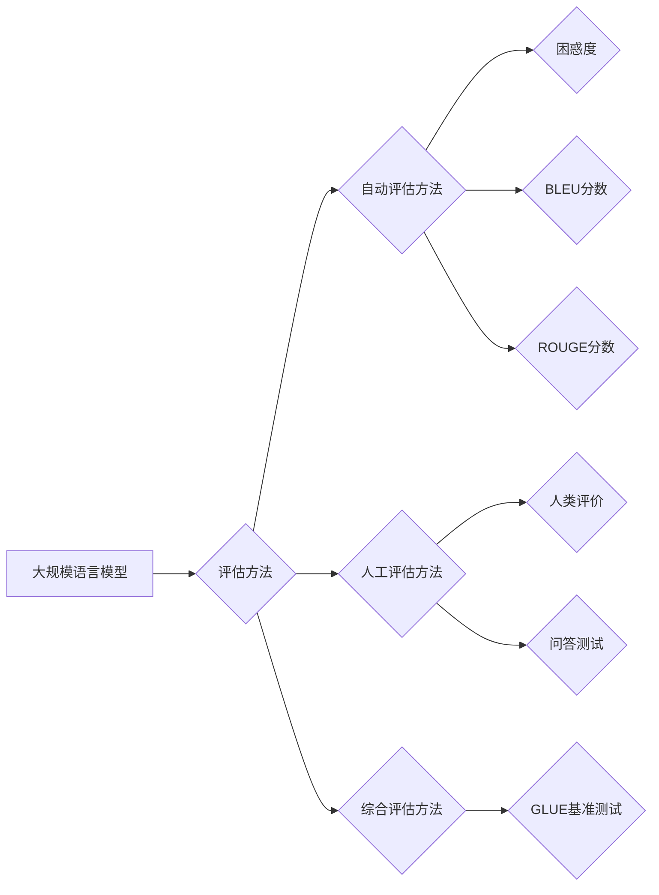

> 大规模语言模型，评估方法，性能指标，基准测试，自然语言处理

## 1. 背景介绍

近年来，大规模语言模型（Large Language Models，LLMs）在自然语言处理（Natural Language Processing，NLP）领域取得了显著的进展。从 GPT-3 到 LaMDA，这些模型展现出惊人的文本生成、翻译、问答和代码生成能力，引发了学术界和工业界的广泛关注。然而，随着模型规模和复杂度的不断增加，如何有效地评估 LLMs 的性能和泛化能力成为了一个关键问题。

传统的评估方法，例如困惑度（Perplexity）和BLEU分数，在衡量文本生成质量方面存在局限性。它们往往侧重于语法和结构的准确性，而忽略了文本的语义理解、逻辑推理和创造性等方面。此外，这些方法通常依赖于人工标注的数据，成本高且效率低。

因此，需要开发更加全面、客观和可重复的 LLMs 评估方法，以更好地理解模型的优缺点，并指导模型的进一步发展。

## 2. 核心概念与联系

### 2.1  大规模语言模型

大规模语言模型是指参数数量庞大（通常超过数十亿甚至千亿）的深度学习模型，其训练数据也通常包含海量的文本信息。这些模型通过学习语言的统计规律和语义关系，能够生成流畅、连贯的文本，并执行各种自然语言理解和生成任务。

### 2.2  评估方法

评估方法是指用于衡量 LLMs 性能的工具和指标。这些方法可以分为以下几类：

* **自动评估方法:** 不依赖人工标注，例如困惑度、ROUGE分数等。
* **人工评估方法:** 依赖人工评判，例如人类评价、问答测试等。
* **综合评估方法:** 将自动评估和人工评估相结合，例如GLUE基准测试等。

### 2.3  评估指标

评估指标是用于量化 LLMs 性能的具体数值。常见的评估指标包括：

* **困惑度:** 衡量模型预测下一个词的概率分布与真实分布的差异。
* **BLEU分数:** 衡量机器翻译模型的准确率。
* **ROUGE分数:** 衡量文本摘要模型的覆盖率和流畅度。
* **准确率、召回率、F1-score:** 衡量分类任务的性能。

### 2.4  基准测试

基准测试是指针对特定任务设计的标准化评估数据集和评估协议。基准测试可以帮助比较不同 LLMs 的性能，并跟踪模型在特定任务上的进展。

**Mermaid 流程图**



## 3. 核心算法原理 & 具体操作步骤

### 3.1  算法原理概述

大规模语言模型的训练主要基于深度学习的Transformer架构。Transformer模型利用自注意力机制（Self-Attention）来捕捉文本序列中的长距离依赖关系，并通过多层编码器-解码器结构进行文本生成。

### 3.2  算法步骤详解

1. **数据预处理:** 将文本数据进行清洗、分词、词嵌入等预处理操作。
2. **模型训练:** 使用训练数据训练Transformer模型，优化模型参数以最小化预测误差。
3. **模型评估:** 使用验证集或测试集评估模型的性能，选择最佳模型参数。
4. **模型部署:** 将训练好的模型部署到生产环境中，用于实际应用。

### 3.3  算法优缺点

**优点:**

* 能够捕捉文本序列中的长距离依赖关系。
* 训练效率高，能够处理海量文本数据。
* 在文本生成、翻译、问答等任务上表现出色。

**缺点:**

* 模型参数量庞大，需要大量的计算资源进行训练。
* 训练过程复杂，需要专业的技术人员进行操作。
* 模型的解释性和可解释性较差。

### 3.4  算法应用领域

* **自然语言理解:** 文本分类、情感分析、问答系统等。
* **自然语言生成:** 文本摘要、机器翻译、对话系统等。
* **代码生成:** 自动生成代码、代码修复等。
* **其他领域:** 医疗诊断、法律分析、金融预测等。

## 4. 数学模型和公式 & 详细讲解 & 举例说明

### 4.1  数学模型构建

大规模语言模型的数学模型通常基于概率论和统计学。模型的目标是学习一个概率分布，该分布能够描述文本序列的生成概率。

### 4.2  公式推导过程

Transformer模型的核心是自注意力机制。自注意力机制通过计算每个词与其他词之间的相关性，来捕捉文本序列中的长距离依赖关系。

**自注意力机制公式:**

$$
Attention(Q, K, V) = softmax(\frac{QK^T}{\sqrt{d_k}})V
$$

其中：

* $Q$：查询矩阵
* $K$：键矩阵
* $V$：值矩阵
* $d_k$：键向量的维度
* $softmax$：softmax函数

### 4.3  案例分析与讲解

假设我们有一个文本序列“The cat sat on the mat”。

使用自注意力机制，我们可以计算每个词与其他词之间的相关性。例如，"cat" 与 "sat" 之间的相关性较高，因为它们在语义上紧密相关。

通过计算所有词之间的相关性，我们可以得到一个注意力权重矩阵，该矩阵表示每个词对其他词的影响程度。

## 5. 项目实践：代码实例和详细解释说明

### 5.1  开发环境搭建

* Python 3.7+
* PyTorch 1.7+
* CUDA 10.2+

### 5.2  源代码详细实现

```python
import torch
import torch.nn as nn

class Transformer(nn.Module):
    def __init__(self, vocab_size, embedding_dim, num_heads, num_layers):
        super(Transformer, self).__init__()
        self.embedding = nn.Embedding(vocab_size, embedding_dim)
        self.transformer_layers = nn.ModuleList([
            nn.TransformerEncoderLayer(embedding_dim, num_heads)
            for _ in range(num_layers)
        ])
        self.linear = nn.Linear(embedding_dim, vocab_size)

    def forward(self, x):
        x = self.embedding(x)
        for layer in self.transformer_layers:
            x = layer(x)
        x = self.linear(x)
        return x
```

### 5.3  代码解读与分析

* `__init__` 方法初始化模型参数，包括词嵌入层、Transformer编码器层和线性输出层。
* `forward` 方法定义模型的正向传播过程，将输入序列经过词嵌入层、Transformer编码器层和线性输出层，最终得到输出序列。

### 5.4  运行结果展示

训练好的模型可以用于各种自然语言处理任务，例如文本生成、机器翻译、问答系统等。

## 6. 实际应用场景

### 6.1  文本生成

LLMs 可以用于生成各种类型的文本，例如故事、诗歌、新闻报道、代码等。

### 6.2  机器翻译

LLMs 可以用于将文本从一种语言翻译成另一种语言。

### 6.3  问答系统

LLMs 可以用于构建问答系统，能够回答用户提出的问题。

### 6.4  未来应用展望

LLMs 在未来将应用于更广泛的领域，例如医疗诊断、法律分析、金融预测等。

## 7. 工具和资源推荐

### 7.1  学习资源推荐

* **书籍:**
    * 《深度学习》
    * 《自然语言处理》
* **在线课程:**
    * Coursera: 自然语言处理
    * edX: 深度学习

### 7.2  开发工具推荐

* **PyTorch:** 深度学习框架
* **TensorFlow:** 深度学习框架
* **Hugging Face Transformers:** 预训练 LLMs 库

### 7.3  相关论文推荐

* 《Attention Is All You Need》
* 《BERT: Pre-training of Deep Bidirectional Transformers for Language Understanding》
* 《GPT-3: Language Models are Few-Shot Learners》

## 8. 总结：未来发展趋势与挑战

### 8.1  研究成果总结

近年来，LLMs 在自然语言处理领域取得了显著的进展，展现出强大的文本生成、理解和推理能力。

### 8.2  未来发展趋势

* 模型规模和能力的进一步提升
* 更加高效的训练方法和算法
* 增强模型的可解释性和安全性
* 拓展 LLMs 到更多领域应用

### 8.3  面临的挑战

* 模型训练成本高
* 数据标注成本高
* 模型的偏见和误导性
* 模型的安全性与可控性

### 8.4  研究展望

未来，LLMs 将继续朝着更加强大、智能、安全的方向发展，并为人类社会带来更多福祉。

## 9. 附录：常见问题与解答

### 9.1  什么是困惑度？

困惑度是衡量语言模型预测能力的指标，越低的困惑度表示模型预测能力越强。

### 9.2  什么是BLEU分数？

BLEU分数是衡量机器翻译模型准确率的指标，分数越高表示翻译质量越好。

### 9.3  什么是GLUE基准测试？

GLUE基准测试是自然语言理解任务的标准化评估协议，包含多个下游任务，例如文本分类、问答等。


作者：禅与计算机程序设计艺术 / Zen and the Art of Computer Programming 
<end_of_turn>