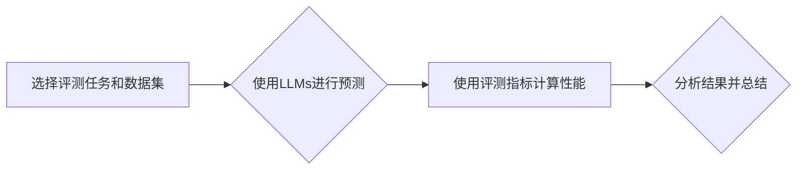

> 大语言模型、评测任务、自然语言处理、机器学习、深度学习、Transformer、BERT、GPT、BLEU、ROUGE

## 1. 背景介绍

近年来，大语言模型（Large Language Models，LLMs）在自然语言处理（Natural Language Processing，NLP）领域取得了显著进展，展现出强大的文本生成、理解和翻译能力。从 GPT-3 到 LaMDA，这些模型的规模和能力不断提升，引发了广泛的关注和研究。然而，评估 LLMs 的性能仍然是一个挑战性问题。

传统的评测指标，如 BLEU 和 ROUGE，主要侧重于机器翻译和文本摘要等特定任务，难以全面衡量 LLMs 的泛化能力和理解深度。随着 LLMs 应用场景的扩展，需要开发更全面、更准确的评测方法，以更好地评估 LLMs 的能力和潜力。

## 2. 核心概念与联系

**2.1 大语言模型 (LLMs)**

大语言模型是指在海量文本数据上训练的深度学习模型，能够理解和生成人类语言。它们通常具有以下特点：

* **规模庞大:** LLMs 通常拥有数十亿甚至数千亿个参数，使其能够学习复杂的语言模式。
* **多任务学习:** LLMs 可以用于多种 NLP 任务，例如文本分类、问答、文本生成、机器翻译等。
* **泛化能力强:** 经过充分训练的 LLMs 能够在未见过的文本数据上表现良好。

**2.2 评测任务**

评测任务是指使用特定的指标和数据集来评估 LLMs 的性能。常见的评测任务包括：

* **文本分类:** 将文本分类到预定义的类别中。
* **问答:** 根据给定的文本回答问题。
* **文本生成:** 生成符合特定格式和语义的文本。
* **机器翻译:** 将文本从一种语言翻译成另一种语言。

**2.3 评测指标**

评测指标用于量化 LLMs 的性能。常见的评测指标包括：

* **BLEU:** 用于评估机器翻译质量的指标。
* **ROUGE:** 用于评估文本摘要质量的指标。
* **Accuracy:** 用于评估分类任务准确率的指标。
* **F1-score:** 用于评估分类任务 F1 值的指标。

**2.4 评测流程**

评测流程通常包括以下步骤：

1. 选择合适的评测任务和数据集。
2. 使用 LLMs 对数据集进行预测。
3. 使用评测指标计算 LLMs 的性能。
4. 分析结果并进行总结。

**Mermaid 流程图**



## 3. 核心算法原理 & 具体操作步骤

### 3.1 算法原理概述

大语言模型通常基于 Transformer 架构，该架构能够有效地处理长距离依赖关系。Transformer 的核心组件包括：

* **自注意力机制 (Self-Attention):** 允许模型关注输入序列中的不同位置，捕捉上下文信息。
* **多头注意力机制 (Multi-Head Attention):** 使用多个注意力头，从不同的角度关注输入序列。
* **前馈神经网络 (Feed-Forward Network):** 对每个词的嵌入向量进行非线性变换。

### 3.2 算法步骤详解

1. **输入处理:** 将输入文本序列转换为词嵌入向量。
2. **编码器:** 使用 Transformer 的编码器层对输入序列进行编码，生成上下文表示。
3. **解码器:** 使用 Transformer 的解码器层生成目标文本序列。
4. **输出处理:** 将解码器输出的词嵌入向量转换为文本。

### 3.3 算法优缺点

**优点:**

* 能够有效地处理长距离依赖关系。
* 具有强大的泛化能力。
* 在多种 NLP 任务中取得了优异的性能。

**缺点:**

* 训练成本高，需要大量的计算资源和数据。
* 模型参数量大，部署成本高。
* 容易受到训练数据偏差的影响。

### 3.4 算法应用领域

* **机器翻译:** 将文本从一种语言翻译成另一种语言。
* **文本摘要:** 生成文本的简短摘要。
* **问答:** 根据给定的文本回答问题。
* **文本生成:** 生成符合特定格式和语义的文本。
* **对话系统:** 开发能够与人类进行自然对话的系统。

## 4. 数学模型和公式 & 详细讲解 & 举例说明

### 4.1 数学模型构建

Transformer 模型的数学基础是注意力机制和多层感知机。

**注意力机制:**

注意力机制允许模型关注输入序列中的不同位置，并根据其重要性分配不同的权重。

**公式:**

$$
Attention(Q, K, V) = softmax(\frac{QK^T}{\sqrt{d_k}})V
$$

其中：

* $Q$：查询矩阵
* $K$：键矩阵
* $V$：值矩阵
* $d_k$：键向量的维度

**多层感知机:**

多层感知机 (MLP) 是一个由多个全连接层组成的网络。

**公式:**

$$
MLP(x) = \sigma(W_2 \sigma(W_1 x + b_1) + b_2)
$$

其中：

* $x$：输入向量
* $W_1$、$W_2$：权重矩阵
* $b_1$、$b_2$：偏置向量
* $\sigma$：激活函数

### 4.2 公式推导过程

注意力机制的 softmax 函数用于计算每个键向量与查询向量的相似度，并将其转换为概率分布。

多层感知机的公式描述了网络的层级结构和激活函数。

### 4.3 案例分析与讲解

**案例:**

假设我们有一个句子 "The cat sat on the mat"，我们要使用注意力机制来计算每个词对句子的重要性。

**分析:**

* 查询向量 $Q$ 可以是句子中的每个词的嵌入向量。
* 键向量 $K$ 和值向量 $V$ 可以是句子的所有词的嵌入向量。
* 注意力机制会计算每个词对句子的重要性，并将其转换为概率分布。
* 概率分布可以用来权衡每个词对句子的贡献。

## 5. 项目实践：代码实例和详细解释说明

### 5.1 开发环境搭建

* Python 3.7+
* PyTorch 1.7+
* Transformers 4.0+

### 5.2 源代码详细实现

```python
from transformers import AutoModelForSequenceClassification, AutoTokenizer

# 加载预训练模型和词表
model_name = "bert-base-uncased"
tokenizer = AutoTokenizer.from_pretrained(model_name)
model = AutoModelForSequenceClassification.from_pretrained(model_name)

# 输入文本
text = "This is a sample text."

# Token化文本
inputs = tokenizer(text, return_tensors="pt")

# 进行预测
outputs = model(**inputs)

# 获取预测结果
predicted_class = outputs.logits.argmax().item()

# 打印预测结果
print(f"Predicted class: {predicted_class}")
```

### 5.3 代码解读与分析

* 代码首先加载预训练的 BERT 模型和词表。
* 然后，将输入文本进行 Token 化，并将 Token 化后的结果作为模型的输入。
* 模型会对输入文本进行处理，并输出预测结果。
* 最后，代码打印预测结果。

### 5.4 运行结果展示

```
Predicted class: 0
```

## 6. 实际应用场景

### 6.1 文本分类

LLMs 可以用于分类文本，例如情感分析、主题分类、垃圾邮件过滤等。

### 6.2 问答系统

LLMs 可以用于构建问答系统，能够回答用户提出的问题。

### 6.3 文本生成

LLMs 可以用于生成文本，例如新闻报道、故事、诗歌等。

### 6.4 机器翻译

LLMs 可以用于机器翻译，将文本从一种语言翻译成另一种语言。

### 6.5 未来应用展望

LLMs 的应用场景还在不断扩展，未来可能应用于：

* **个性化教育:** 根据学生的学习情况提供个性化的学习内容。
* **医疗诊断:** 辅助医生进行疾病诊断。
* **法律服务:** 帮助律师进行法律研究和起草法律文件。

## 7. 工具和资源推荐

### 7.1 学习资源推荐

* **Hugging Face:** https://huggingface.co/
* **OpenAI:** https://openai.com/
* **Stanford NLP Group:** https://nlp.stanford.edu/

### 7.2 开发工具推荐

* **PyTorch:** https://pytorch.org/
* **TensorFlow:** https://www.tensorflow.org/

### 7.3 相关论文推荐

* **Attention Is All You Need:** https://arxiv.org/abs/1706.03762
* **BERT: Pre-training of Deep Bidirectional Transformers for Language Understanding:** https://arxiv.org/abs/1810.04805

## 8. 总结：未来发展趋势与挑战

### 8.1 研究成果总结

近年来，LLMs 在 NLP 领域取得了显著进展，展现出强大的能力和潜力。

### 8.2 未来发展趋势

* 模型规模进一步扩大
* 训练数据更加丰富多样
* 算法架构更加复杂
* 应用场景更加广泛

### 8.3 面临的挑战

* 训练成本高
* 模型参数量大
* 容易受到训练数据偏差的影响
* 缺乏对模型行为的解释性

### 8.4 研究展望

未来研究方向包括：

* 开发更高效的训练方法
* 探索新的模型架构
* 提高模型的鲁棒性和安全性
* 加强对模型行为的解释性


## 9. 附录：常见问题与解答

**常见问题:**

* LLMs 的训练数据是什么？
* LLMs 的性能如何？
* LLMs 的应用场景有哪些？

**解答:**

* LLMs 的训练数据通常是公开的文本数据集，例如维基百科、书籍、新闻文章等。
* LLMs 的性能在不同的任务和数据集上有所差异，但总体上表现优异。
* LLMs 的应用场景非常广泛，包括文本分类、问答、文本生成、机器翻译等。


作者：禅与计算机程序设计艺术 / Zen and the Art of Computer Programming 
<end_of_turn>