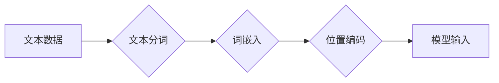

> 大语言模型，输入模块，文本预处理，词嵌入，词向量，BERT，Transformer，自然语言处理

## 1. 背景介绍

大语言模型（Large Language Model，LLM）近年来在自然语言处理（Natural Language Processing，NLP）领域取得了显著进展，展现出强大的文本生成、翻译、问答和代码生成能力。这些模型通常拥有数十亿甚至数千亿个参数，能够学习和理解复杂的语言结构和语义关系。

输入模块是LLM的核心组成部分之一，负责将原始文本数据转换为模型能够理解的格式。高质量的输入模块对于模型的性能至关重要，因为它直接影响着模型对文本信息的理解和处理能力。

## 2. 核心概念与联系

输入模块的主要任务是将文本数据转换为模型可处理的数值表示。这个过程通常包括以下几个步骤：

1. **文本分词（Tokenization）：** 将文本分割成一个个独立的单位，例如单词、子词或字符。
2. **词嵌入（Word Embedding）：** 将每个词语映射到一个低维度的向量空间中，每个向量代表一个词语的语义信息。
3. **位置编码（Positional Encoding）：** 为每个词语添加位置信息，因为语言模型是顺序处理文本的，所以需要知道每个词语在句子中的位置。

**Mermaid 流程图**



## 3. 核心算法原理 & 具体操作步骤

### 3.1  算法原理概述

词嵌入是将词语映射到向量空间的核心算法。常用的词嵌入算法包括：

* **Word2Vec:** 基于神经网络的词嵌入模型，包括CBOW（Continuous Bag-of-Words）和Skip-gram两种训练方式。
* **GloVe (Global Vectors for Word Representation):** 基于全局词共现矩阵的词嵌入模型，能够捕捉词语之间的全局语义关系。
* **FastText:** 基于Word2Vec的改进模型，能够处理词语的子词信息，提升词语的语义表示能力。

### 3.2  算法步骤详解

以Word2Vec为例，其训练过程可以概括为以下步骤：

1. **构建词语上下文窗口:** 对于每个词语，选择一个固定大小的上下文窗口，包含该词语前后出现的词语。
2. **训练神经网络:** 使用神经网络模型学习词语和上下文之间的关系，将词语映射到向量空间中。
3. **更新词向量:** 通过反向传播算法更新词向量的参数，使模型能够更好地预测上下文词语。

### 3.3  算法优缺点

**Word2Vec:**

* **优点:** 训练速度快，效果好，能够捕捉词语之间的语义相似性。
* **缺点:** 无法处理长距离依赖关系，对稀有词语的表示能力较弱。

**GloVe:**

* **优点:** 能够捕捉词语之间的全局语义关系，对稀有词语的表示能力较强。
* **缺点:** 训练时间较长，参数量较大。

**FastText:**

* **优点:** 能够处理词语的子词信息，提升词语的语义表示能力。
* **缺点:** 训练速度相对较慢。

### 3.4  算法应用领域

词嵌入算法广泛应用于NLP领域，例如：

* **文本分类:** 将文本分类到不同的类别，例如情感分析、主题分类等。
* **文本相似度计算:** 计算两个文本之间的相似度，例如文档检索、信息提取等。
* **机器翻译:** 将文本从一种语言翻译成另一种语言。
* **问答系统:** 回答用户提出的问题。

## 4. 数学模型和公式 & 详细讲解 & 举例说明

### 4.1  数学模型构建

Word2Vec模型的核心是神经网络，其结构通常包括输入层、隐藏层和输出层。

* **输入层:** 接收词语的one-hot编码表示。
* **隐藏层:** 使用非线性激活函数对输入进行处理，学习词语的语义表示。
* **输出层:** 预测上下文词语的概率分布。

### 4.2  公式推导过程

Word2Vec模型的训练目标是最大化上下文词语的预测概率。可以使用交叉熵损失函数来衡量模型的预测误差。

$$
Loss = -\sum_{w \in context(w_t)} \log p(w \mid w_t)
$$

其中：

* $w_t$ 是目标词语。
* $context(w_t)$ 是目标词语的上下文词语集合。
* $p(w \mid w_t)$ 是模型预测上下文词语 $w$ 的概率。

### 4.3  案例分析与讲解

假设我们有一个句子 "The cat sat on the mat"，目标词语是 "cat"。

Word2Vec模型会将 "cat" 映射到一个向量空间中，并根据上下文词语 "The"、"sat"、"on" 和 "the" 来更新 "cat" 的向量表示。

## 5. 项目实践：代码实例和详细解释说明

### 5.1  开发环境搭建

* Python 3.6+
* TensorFlow 或 PyTorch

### 5.2  源代码详细实现

```python
import tensorflow as tf

# 定义Word2Vec模型
class Word2Vec(tf.keras.Model):
    def __init__(self, embedding_dim, vocab_size):
        super(Word2Vec, self).__init__()
        self.embedding = tf.keras.layers.Embedding(vocab_size, embedding_dim)

    def call(self, inputs):
        return self.embedding(inputs)

# 训练Word2Vec模型
model = Word2Vec(embedding_dim=128, vocab_size=10000)
model.compile(optimizer='adam', loss='categorical_crossentropy')
# ... 训练代码 ...

# 获取词向量
word_vectors = model.get_weights()[0]
```

### 5.3  代码解读与分析

* `Word2Vec` 类定义了Word2Vec模型的结构，包含一个嵌入层 `embedding`。
* `call` 方法定义了模型的正向传播过程，将输入词语映射到向量空间。
* `compile` 方法配置了模型的训练参数，包括优化器、损失函数等。
* `get_weights` 方法获取模型的权重，即词向量。

### 5.4  运行结果展示

训练完成后，我们可以使用 `get_weights` 方法获取词向量，并进行分析和应用。例如，我们可以计算两个词语之间的余弦相似度，来衡量它们之间的语义相关性。

## 6. 实际应用场景

输入模块在各种NLP应用场景中发挥着重要作用，例如：

* **搜索引擎:** 将用户查询的文本转换为向量表示，与数据库中的文档向量进行比较，找到最相关的文档。
* **聊天机器人:** 将用户输入的文本转换为向量表示，与预训练的对话模型进行交互，生成自然流畅的回复。
* **机器翻译:** 将源语言文本转换为向量表示，然后使用机器翻译模型将其翻译成目标语言文本。

### 6.4  未来应用展望

随着大语言模型的不断发展，输入模块也将迎来新的发展趋势，例如：

* **多模态输入:** 将文本、图像、音频等多种模态信息融合到输入模块中，实现更全面的信息理解。
* **动态输入:** 根据上下文信息动态调整词嵌入和位置编码，提升模型对长文本和复杂语境的理解能力。
* **个性化输入:** 根据用户的偏好和需求，定制化输入模块，提供更精准的文本理解和生成服务。

## 7. 工具和资源推荐

### 7.1  学习资源推荐

* **书籍:**
    * "Speech and Language Processing" by Jurafsky and Martin
    * "Deep Learning" by Goodfellow, Bengio, and Courville
* **在线课程:**
    * Stanford CS224N: Natural Language Processing with Deep Learning
    * Coursera: Natural Language Processing Specialization

### 7.2  开发工具推荐

* **TensorFlow:** 开源深度学习框架，支持多种模型构建和训练。
* **PyTorch:** 开源深度学习框架，以其灵活性和易用性而闻名。
* **Hugging Face Transformers:** 提供预训练的语言模型和工具，方便进行NLP任务开发。

### 7.3  相关论文推荐

* "Word2Vec: A Simple and Efficient Method for Learning Word Representations" by Mikolov et al.
* "GloVe: Global Vectors for Word Representation" by Pennington et al.
* "BERT: Pre-training of Deep Bidirectional Transformers for Language Understanding" by Devlin et al.

## 8. 总结：未来发展趋势与挑战

### 8.1  研究成果总结

大语言模型的输入模块已经取得了显著进展，能够有效地将文本数据转换为模型可处理的格式。

### 8.2  未来发展趋势

未来，输入模块将朝着多模态、动态和个性化的方向发展，以更好地理解和处理复杂的信息。

### 8.3  面临的挑战

* **数据效率:** 大语言模型需要大量的训练数据，而高质量的文本数据往往稀缺。
* **计算资源:** 训练大型语言模型需要大量的计算资源，这对于资源有限的机构或个人来说是一个挑战。
* **伦理问题:** 大语言模型可能被用于生成虚假信息或进行恶意攻击，因此需要关注其伦理问题。

### 8.4  研究展望

未来，我们需要继续探索新的输入模块架构和训练方法，提高模型的效率、准确性和鲁棒性。同时，还需要加强对大语言模型伦理问题的研究，确保其安全和可持续发展。

## 9. 附录：常见问题与解答

* **Q: 如何选择合适的词嵌入算法？**

* **A:** 选择词嵌入算法需要根据具体任务和数据特点进行考虑。Word2Vec适合于文本分类、文本相似度计算等任务，GloVe适合于处理语义关系更复杂的场景，FastText适合于处理词语的子词信息。

* **Q: 如何评估输入模块的性能？**

* **A:** 可以使用BLEU、ROUGE等指标来评估输入模块的性能，例如机器翻译任务的BLEU分数。

* **Q: 如何处理稀有词语？**

* **A:** 可以使用以下方法处理稀有词语：
    * 使用<unk>标记表示未知词语。
    * 使用词向量聚类技术将稀有词语聚类到已知词语的类别中。
    * 使用预训练语言模型来学习稀有词语的表示。


作者：禅与计算机程序设计艺术 / Zen and the Art of Computer Programming 
<end_of_turn>