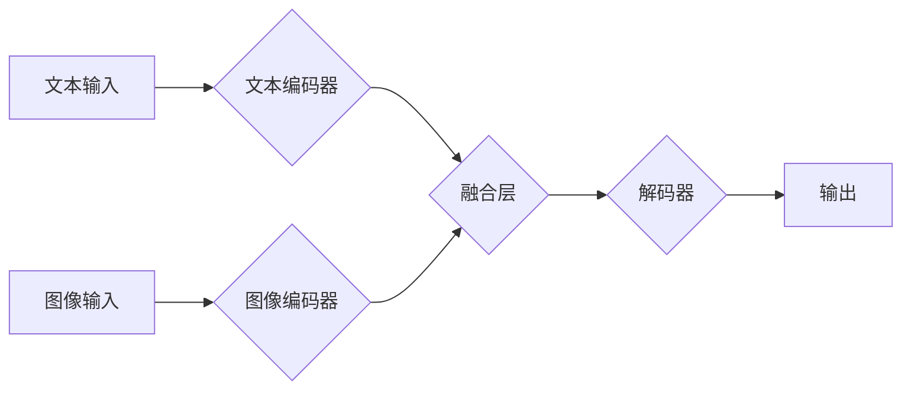

> 大语言模型、图文联合训练、Transformer、BERT、视觉语言理解、自然语言处理、深度学习

## 1. 背景介绍

近年来，深度学习技术取得了飞速发展，特别是大语言模型（Large Language Model，LLM）的出现，为自然语言处理（Natural Language Processing，NLP）领域带来了革命性的变革。LLM 能够理解和生成人类语言，在文本生成、机器翻译、问答系统等领域展现出强大的能力。然而，传统的文本语言模型难以处理多模态信息，例如图像、音频等。

图文联合训练（Multimodal Training）作为一种新兴的研究方向，旨在融合文本和视觉信息，构建更智能、更全面的模型。图文联合训练的目标是让模型能够理解和生成跨模态的表示，从而实现更丰富的应用场景，例如图像字幕生成、视觉问答、图像检索等。

## 2. 核心概念与联系

图文联合训练的核心概念是融合文本和视觉信息，构建一个能够理解和生成跨模态表示的模型。

**2.1 图文联合训练的流程:**



**2.2 核心概念解释:**

* **文本编码器:** 将文本输入转换为向量表示，捕捉文本语义信息。
* **图像编码器:** 将图像输入转换为向量表示，捕捉图像视觉信息。
* **融合层:** 将文本和图像的向量表示融合在一起，形成跨模态的表示。
* **解码器:** 根据融合后的表示生成最终输出，例如文本描述、视觉问答答案等。

## 3. 核心算法原理 & 具体操作步骤

### 3.1  算法原理概述

图文联合训练常用的算法包括：

* **Transformer:** Transformer是一种基于注意力机制的深度学习模型，能够有效地捕捉文本序列中的长距离依赖关系。
* **BERT:** BERT是一种基于Transformer的预训练语言模型，在大量的文本数据上进行预训练，能够捕捉丰富的文本语义信息。
* **Vision Transformer (ViT):** ViT将图像分割成patches，并将其视为文本序列进行处理，利用Transformer的注意力机制捕捉图像的全局信息。

### 3.2  算法步骤详解

1. **数据预处理:** 将文本和图像数据进行预处理，例如文本分词、图像裁剪、数据增强等。
2. **模型训练:** 使用预训练的文本编码器和图像编码器，训练融合层和解码器。
3. **模型评估:** 使用测试集评估模型的性能，例如准确率、召回率、F1-score等。

### 3.3  算法优缺点

**优点:**

* 能够融合文本和视觉信息，构建更智能、更全面的模型。
* 在图像字幕生成、视觉问答、图像检索等领域取得了优异的性能。

**缺点:**

* 数据集规模较大，训练成本较高。
* 模型复杂度较高，推理速度较慢。

### 3.4  算法应用领域

* **图像字幕生成:** 将图像转换为文本描述。
* **视觉问答:** 根据图像回答问题。
* **图像检索:** 根据文本查询图像。
* **视频理解:** 理解视频内容。
* **机器人视觉:** 帮助机器人理解和交互环境。

## 4. 数学模型和公式 & 详细讲解 & 举例说明

### 4.1  数学模型构建

图文联合训练模型通常采用以下数学模型：

* **文本编码器:** 使用Transformer或BERT模型进行文本编码。
* **图像编码器:** 使用CNN或ViT模型进行图像编码。
* **融合层:** 使用注意力机制或其他融合方法将文本和图像的向量表示融合在一起。
* **解码器:** 使用Transformer或其他解码器模型生成最终输出。

### 4.2  公式推导过程

**注意力机制公式:**

$$
Attention(Q, K, V) = \frac{exp(Q \cdot K^T / \sqrt{d_k})}{exp(Q \cdot K^T / \sqrt{d_k})} \cdot V
$$

其中:

* $Q$：查询向量
* $K$：键向量
* $V$：值向量
* $d_k$：键向量的维度

**Transformer Encoder Block 公式:**

$$
Encoder(X) = MultiHeadAttention(X, X, X) + FeedForwardNetwork(X)
$$

其中:

* $X$：输入序列
* $MultiHeadAttention$：多头注意力机制
* $FeedForwardNetwork$：前馈神经网络

### 4.3  案例分析与讲解

**图像字幕生成:**

给定一张图像，图文联合训练模型可以将图像编码为向量表示，并将其与预训练的文本编码器融合，生成图像的文本描述。例如，给定一张图片显示一只猫在睡觉，模型可以生成文本描述“一只猫在睡觉”。

## 5. 项目实践：代码实例和详细解释说明

### 5.1  开发环境搭建

* Python 3.7+
* PyTorch 1.7+
* CUDA 10.2+

### 5.2  源代码详细实现

```python
import torch
import torch.nn as nn

class ImageEncoder(nn.Module):
    def __init__(self):
        super(ImageEncoder, self).__init__()
        # ...

    def forward(self, x):
        # ...

class TextEncoder(nn.Module):
    def __init__(self):
        super(TextEncoder, self).__init__()
        # ...

    def forward(self, x):
        # ...

class FusionLayer(nn.Module):
    def __init__(self):
        super(FusionLayer, self).__init__()
        # ...

    def forward(self, image_features, text_features):
        # ...

class Decoder(nn.Module):
    def __init__(self):
        super(Decoder, self).__init__()
        # ...

    def forward(self, fused_features):
        # ...

class MultimodalModel(nn.Module):
    def __init__(self):
        super(MultimodalModel, self).__init__()
        self.image_encoder = ImageEncoder()
        self.text_encoder = TextEncoder()
        self.fusion_layer = FusionLayer()
        self.decoder = Decoder()

    def forward(self, image, text):
        image_features = self.image_encoder(image)
        text_features = self.text_encoder(text)
        fused_features = self.fusion_layer(image_features, text_features)
        output = self.decoder(fused_features)
        return output
```

### 5.3  代码解读与分析

* **ImageEncoder:** 使用CNN或ViT模型对图像进行编码，提取图像特征。
* **TextEncoder:** 使用Transformer或BERT模型对文本进行编码，提取文本特征。
* **FusionLayer:** 使用注意力机制或其他融合方法将图像特征和文本特征融合在一起。
* **Decoder:** 使用Transformer或其他解码器模型根据融合后的特征生成最终输出。

### 5.4  运行结果展示

运行模型后，可以得到图像字幕、视觉问答答案等结果。

## 6. 实际应用场景

### 6.1 图像字幕生成

图文联合训练模型可以自动生成图像的文本描述，应用于图像搜索、图像识别、辅助视障人士等领域。

### 6.2 视觉问答

图文联合训练模型可以根据图像回答问题，应用于教育、医疗、客服等领域。

### 6.3 图像检索

图文联合训练模型可以根据文本查询图像，应用于电商、新闻、搜索引擎等领域。

### 6.4 未来应用展望

图文联合训练模型在未来将有更广泛的应用场景，例如：

* **视频理解:** 理解视频内容，自动生成视频字幕、视频摘要等。
* **机器人视觉:** 帮助机器人理解和交互环境，例如识别物体、导航等。
* **虚拟现实/增强现实:** 为虚拟现实和增强现实场景提供更丰富的交互体验。

## 7. 工具和资源推荐

### 7.1  学习资源推荐

* **书籍:**
    * Deep Learning
    * Speech and Language Processing
* **课程:**
    * Stanford CS231n: Convolutional Neural Networks for Visual Recognition
    * MIT 6.S191: Introduction to Deep Learning

### 7.2  开发工具推荐

* **PyTorch:** 深度学习框架
* **TensorFlow:** 深度学习框架
* **HuggingFace Transformers:** 预训练模型库

### 7.3  相关论文推荐

* **BERT: Pre-training of Deep Bidirectional Transformers for Language Understanding**
* **Attention Is All You Need**
* **Vision Transformer**

## 8. 总结：未来发展趋势与挑战

### 8.1  研究成果总结

图文联合训练模型取得了显著的进展，在图像字幕生成、视觉问答、图像检索等领域取得了优异的性能。

### 8.2  未来发展趋势

* **模型规模和能力提升:** 随着计算资源的增加，图文联合训练模型的规模和能力将进一步提升。
* **跨模态理解的深化:** 研究者将探索更深入的跨模态理解方法，例如理解图像和文本之间的语义关系。
* **应用场景的拓展:** 图文联合训练模型将应用于更多领域，例如视频理解、机器人视觉、虚拟现实/增强现实等。

### 8.3  面临的挑战

* **数据获取和标注:** 图文联合训练模型需要大量的标注数据，数据获取和标注成本较高。
* **模型训练效率:** 图文联合训练模型的训练时间较长，需要更高效的训练方法。
* **模型解释性和可解释性:** 图文联合训练模型的决策过程较为复杂，需要提高模型的解释性和可解释性。

### 8.4  研究展望

未来，图文联合训练模型将继续朝着更智能、更全面的方向发展，为人类社会带来更多价值。

## 9. 附录：常见问题与解答

**Q1: 图文联合训练模型的训练数据有哪些？**

**A1:** 图文联合训练模型的训练数据通常包括图像和对应的文本描述、图像和对应的视觉问答答案等。

**Q2: 图文联合训练模型的训练方法有哪些？**

**A2:** 图文联合训练模型的训练方法包括监督学习、半监督学习、无监督学习等。

**Q3: 图文联合训练模型的应用场景有哪些？**

**A3:** 图文联合训练模型的应用场景包括图像字幕生成、视觉问答、图像检索、视频理解、机器人视觉等。


作者：禅与计算机程序设计艺术 / Zen and the Art of Computer Programming 
<end_of_turn>