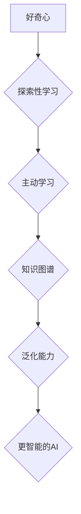

>  人工智能、好奇心、求知欲、探索、学习、创新、深度学习、机器学习

## 1. 背景介绍

在瞬息万变的科技时代，人工智能（AI）正以惊人的速度发展，深刻地改变着我们的生活和工作方式。从自动驾驶汽车到智能语音助手，从医疗诊断到金融交易，AI技术的应用领域日益广泛。然而，推动AI发展的核心动力是什么？是什么让人类不断探索未知领域，寻求更智能、更强大的AI系统？

答案是：**好奇心和求知欲**。

好奇心是人类天生的本能，它驱使我们探索世界，理解事物，寻求答案。求知欲则是我们对知识的渴望，它让我们不断学习、思考、进步。这两股强大的动力共同推动着人类文明的进步，也为AI的发展提供了源源不断的动力。

## 2. 核心概念与联系

好奇心和求知欲在AI领域体现为以下几个核心概念：

* **探索性学习（Exploratory Learning）：** 

AI系统通过探索环境，收集数据，并尝试不同的策略，来学习和理解世界。

* **主动学习（Active Learning）：** AI系统能够主动选择最能帮助其学习的数据，并主动寻求更深入的理解。
* **知识图谱（Knowledge Graph）：** AI系统通过构建知识图谱，将不同领域的知识连接起来，形成更完整的知识体系。
* **泛化能力（Generalization）：** AI系统能够将从特定任务中学到的知识应用到新的、未见过的任务中。

这些概念相互关联，共同构成了AI系统探索和学习的机制。



## 3. 核心算法原理 & 具体操作步骤

### 3.1  算法原理概述

深度学习（Deep Learning）是目前AI领域最热门的技术之一，它能够通过多层神经网络学习复杂的模式和关系。深度学习算法的核心原理是**反向传播（Backpropagation）**。

反向传播算法通过不断调整神经网络的权重，使得网络的输出与实际目标值之间的误差最小化。

### 3.2  算法步骤详解

1. **输入数据：** 将数据输入到神经网络的第一层。
2. **前向传播：** 数据通过神经网络的每一层进行计算，最终输出预测结果。
3. **计算误差：** 将预测结果与实际目标值进行比较，计算误差。
4. **反向传播：** 将误差反向传播到神经网络的每一层，调整每一层的权重。
5. **重复步骤2-4：** 重复上述步骤，直到误差达到预设阈值。

### 3.3  算法优缺点

**优点：**

* 能够学习复杂的模式和关系。
* 泛化能力强，能够应用于不同的任务。

**缺点：**

* 需要大量的训练数据。
* 计算量大，训练时间长。
* 容易过拟合。

### 3.4  算法应用领域

深度学习算法广泛应用于以下领域：

* **图像识别：** 人脸识别、物体检测、图像分类。
* **自然语言处理：** 机器翻译、文本摘要、情感分析。
* **语音识别：** 语音转文本、语音助手。
* **推荐系统：** 产品推荐、内容推荐。

## 4. 数学模型和公式 & 详细讲解 & 举例说明

### 4.1  数学模型构建

深度学习模型通常由多层神经网络组成，每一层包含多个神经元。每个神经元接收来自上一层的输入，并通过激活函数进行处理，输出到下一层。

### 4.2  公式推导过程

反向传播算法的核心是**梯度下降法**。梯度下降法通过计算误差对权重的偏导数，来更新权重的值。

**公式：**

$$
\theta = \theta - \alpha \frac{\partial Loss}{\partial \theta}
$$

其中：

* $\theta$：权重
* $\alpha$：学习率
* $Loss$：损失函数

### 4.3  案例分析与讲解

假设我们有一个简单的线性回归模型，目标是预测房价。模型的输入特征是房屋面积，输出是房价。

我们可以使用梯度下降法来训练这个模型。首先，我们需要定义损失函数，例如均方误差（MSE）。然后，我们计算损失函数对权重的偏导数，并使用梯度下降法更新权重。

## 5. 项目实践：代码实例和详细解释说明

### 5.1  开发环境搭建

为了实现深度学习模型，我们需要搭建一个开发环境。常用的开发环境包括：

* **Python:** 深度学习框架的编程语言。
* **TensorFlow/PyTorch:** 深度学习框架。
* **GPU:** 加速深度学习训练的硬件。

### 5.2  源代码详细实现

以下是一个使用TensorFlow实现简单的线性回归模型的代码示例：

```python
import tensorflow as tf

# 定义模型
model = tf.keras.Sequential([
    tf.keras.layers.Dense(units=1, input_shape=[1])
])

# 定义损失函数和优化器
model.compile(loss='mse', optimizer='sgd')

# 训练模型
model.fit(x_train, y_train, epochs=100)

# 预测
predictions = model.predict(x_test)
```

### 5.3  代码解读与分析

这段代码首先定义了一个简单的线性回归模型，包含一个全连接层。然后，我们定义了均方误差作为损失函数，并使用随机梯度下降（SGD）作为优化器。最后，我们训练模型，并使用训练好的模型进行预测。

### 5.4  运行结果展示

训练完成后，我们可以评估模型的性能，例如使用均方根误差（RMSE）来衡量预测结果与实际值之间的差异。

## 6. 实际应用场景

深度学习技术在各个领域都有着广泛的应用，例如：

* **医疗诊断：** 深度学习可以用于分析医学图像，辅助医生诊断疾病。
* **金融风险管理：** 深度学习可以用于识别欺诈交易，评估风险。
* **自动驾驶：** 深度学习可以用于识别道路场景，控制车辆行驶。

### 6.4  未来应用展望

随着深度学习技术的不断发展，其应用场景将更加广泛，例如：

* **个性化教育：** 深度学习可以根据学生的学习情况，提供个性化的学习方案。
* **智能客服：** 深度学习可以用于开发更智能的聊天机器人，提供更人性化的服务。
* **科学研究：** 深度学习可以用于分析大规模数据，加速科学发现。

## 7. 工具和资源推荐

### 7.1  学习资源推荐

* **课程：** Coursera、edX、Udacity 等平台提供深度学习相关的课程。
* **书籍：** 《深度学习》 (Deep Learning) 、《动手学深度学习》 (Hands-On Machine Learning with Scikit-Learn, Keras & TensorFlow) 等书籍。
* **博客：** TensorFlow博客、PyTorch博客等。

### 7.2  开发工具推荐

* **TensorFlow:** Google开发的开源深度学习框架。
* **PyTorch:** Facebook开发的开源深度学习框架。
* **Keras:** TensorFlow的高级API，易于使用。

### 7.3  相关论文推荐

* **AlexNet:** ImageNet Classification with Deep Convolutional Neural Networks
* **VGGNet:** Very Deep Convolutional Networks for Large-Scale Image Recognition
* **ResNet:** Deep Residual Learning for Image Recognition

## 8. 总结：未来发展趋势与挑战

### 8.1  研究成果总结

深度学习技术取得了显著的成果，在图像识别、自然语言处理等领域取得了突破性的进展。

### 8.2  未来发展趋势

* **模型更深更广：** 研究更深层次、更广阔结构的深度学习模型。
* **数据更丰富更有效：** 开发新的数据采集和处理方法，提高数据质量和效率。
* **解释性更强：** 研究深度学习模型的决策机制，提高模型的可解释性。

### 8.3  面临的挑战

* **数据隐私和安全：** 深度学习模型需要大量数据进行训练，如何保护数据隐私和安全是一个重要挑战。
* **模型可解释性：** 深度学习模型的决策机制往往难以理解，如何提高模型的可解释性是一个重要的研究方向。
* **计算资源限制：** 训练大型深度学习模型需要大量的计算资源，如何降低训练成本是一个重要的挑战。

### 8.4  研究展望

未来，深度学习技术将继续发展，并在更多领域发挥重要作用。我们需要不断探索新的算法、新的模型、新的应用场景，推动深度学习技术向更智能、更安全、更可解释的方向发展。

## 9. 附录：常见问题与解答

**Q1：深度学习和机器学习有什么区别？**

**A1：** 机器学习是人工智能的一个子领域，它通过算法学习数据，并从中提取规律。深度学习是机器学习的一种特殊形式，它使用多层神经网络来模拟人类大脑的学习过程。

**Q2：如何选择合适的深度学习框架？**

**A2：** TensorFlow和PyTorch是目前最流行的深度学习框架。TensorFlow更适合于生产环境，PyTorch更适合于研究和开发。

**Q3：如何评估深度学习模型的性能？**

**A3：** 常见的评估指标包括准确率、召回率、F1-score等。

作者：禅与计算机程序设计艺术 / Zen and the Art of Computer Programming


<end_of_turn>