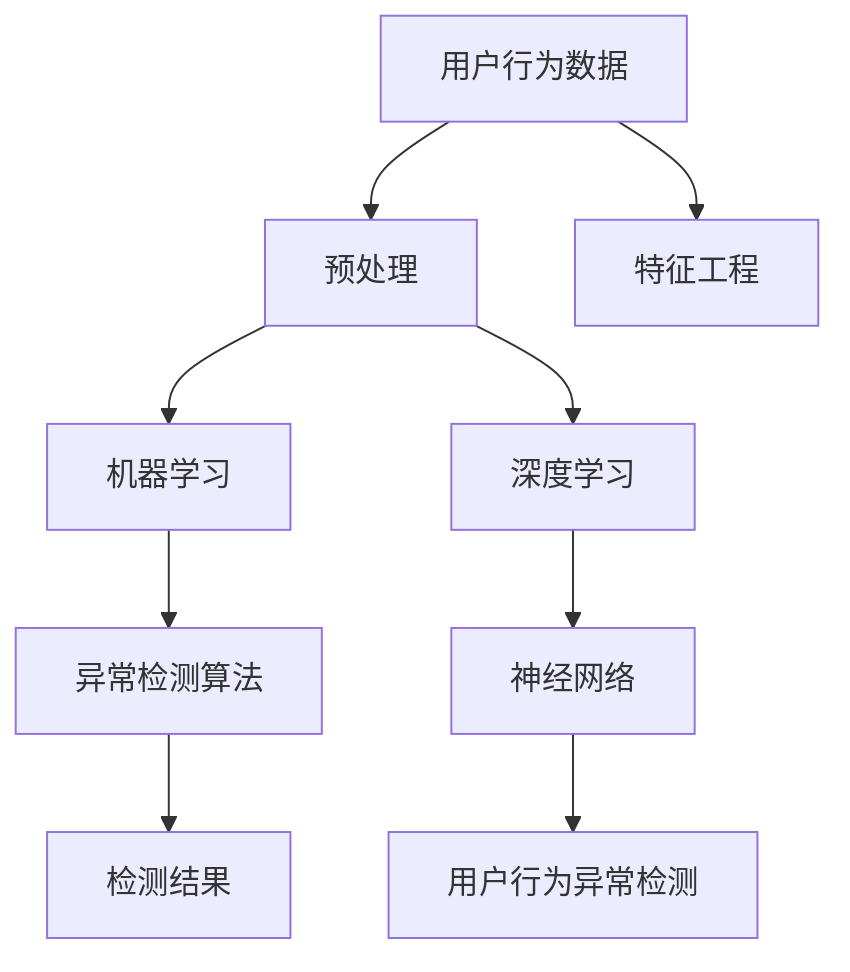

                 

# AI驱动的电商平台用户行为异常检测

> 关键词：用户行为分析,异常检测,机器学习,深度学习,神经网络,电商平台,数据科学,算法工程

## 1. 背景介绍

### 1.1 问题由来
电商平台作为线上零售的重要平台，其用户行为数据日益成为宝贵的资源。通过对用户行为数据的分析，电商平台可以发现用户偏好、预测购买行为、优化用户体验、降低流失率等。然而，电商平台的用户行为数据通常具有高维度、非结构化、实时变化等特点，同时由于用户行为异常（如欺诈、恶意刷单、刷评论等）的存在，会直接影响平台的业务决策和收入，严重时还会导致平台声誉受损。因此，及时、准确地检测用户行为异常对于电商平台来说至关重要。

### 1.2 问题核心关键点
电商平台用户行为异常检测的核心问题在于如何快速准确地识别出异常行为，同时尽可能减少误报和漏报。针对这个问题，当前的主流解决方案主要是基于机器学习和深度学习的异常检测算法。这些算法通常包括但不限于：

- 离群值检测(Outlier Detection)：通过统计学方法识别数据中的离群点，通常用于发现明显异常的行为。
- 聚类分析(Clustering)：通过将相似行为聚为一类，发现异常行为与其他群体的差异。
- 基于规则的异常检测(Rule-based Detection)：根据经验规则设定阈值，判断行为是否异常。
- 时间序列分析(Time Series Analysis)：通过时间序列模型检测行为模式变化。
- 神经网络模型(Neural Network Models)：如循环神经网络(RNN)、长短期记忆网络(LSTM)、卷积神经网络(CNN)等，通过学习历史行为数据预测用户行为。

当前主流电商平台广泛使用这些方法进行异常检测，但基于规则和统计学的传统方法存在处理高维数据能力弱、难以捕捉复杂行为模式等问题，而基于神经网络模型的算法虽然处理能力强大，但模型训练和优化需要大量数据和时间，且对异常行为模式的解释性不强。因此，如何设计高效、准确、解释性强的用户行为异常检测算法，成为电商平台技术突破的关键。

## 2. 核心概念与联系

### 2.1 核心概念概述

为更好地理解基于AI的电商平台用户行为异常检测，本节将介绍几个关键概念：

- 用户行为(User Behavior)：用户在电商平台上的各种行为，包括浏览、点击、加入购物车、购买、评价、投诉等，是电商平台用户行为分析的重要对象。
- 异常检测(Anomaly Detection)：通过数据分析识别出不符合预期或规则的行为，旨在早期发现潜在问题，避免损失。
- 机器学习(Machine Learning)：利用算法和统计模型对大量数据进行分析，从中发现规律和模式，提升决策效率。
- 深度学习(Deep Learning)：一类机器学习算法，通过多层神经网络自动提取数据特征，能够处理复杂结构化数据和非结构化数据。
- 神经网络(Neural Network)：深度学习的核心组成部分，由多层节点组成，能够进行复杂的模式识别和决策。

这些核心概念之间的逻辑关系可以通过以下Mermaid流程图来展示：



这个流程图展示了大语言模型的核心概念及其之间的关系：

1. 用户行为数据作为输入，通过预处理和特征工程得到可供模型使用的特征向量。
2. 机器学习和深度学习算法在此基础上对数据进行模型训练，学习到用户行为模式。
3. 神经网络模型作为深度学习的重要组成部分，能够提取高层次、复杂的数据特征，提高模型性能。
4. 异常检测算法基于训练好的模型对用户行为进行判断，识别出异常行为。
5. 用户行为异常检测结合各类算法，实现对异常行为的全面监控。

这些概念共同构成了基于AI的电商平台用户行为异常检测的逻辑框架，使得系统能够高效、准确地识别和处理异常行为。

## 3. 核心算法原理 & 具体操作步骤
### 3.1 算法原理概述

基于AI的电商平台用户行为异常检测，本质上是一个分类问题。目标是识别出属于异常行为集合的样本，即判断用户行为是否异常。形式化地，假设异常行为集合为 $\mathcal{A}$，正常行为集合为 $\mathcal{N}$，则问题可转化为分类问题，即：

$$
y \in \{0, 1\}, y=1 \text{ 表示异常行为}, y=0 \text{ 表示正常行为}
$$

给定用户行为数据 $\{x_i\}_{i=1}^N$，异常检测模型的目标是通过训练，学习到特征映射函数 $f:\mathcal{X} \rightarrow [0,1]$，使得：

$$
\hat{y}_i = f(x_i)
$$

其中 $\hat{y}_i = 1$ 表示样本 $x_i$ 属于异常行为集合 $\mathcal{A}$，反之则为正常行为。

常用的算法包括基于规则的、基于统计学的和基于机器学习的异常检测方法。本文将重点介绍基于深度学习的神经网络模型，其核心思想是通过神经网络模型学习用户行为特征，并通过损失函数最小化来优化模型参数，从而实现异常行为的检测。

### 3.2 算法步骤详解

基于深度学习的神经网络模型通常包含以下几个关键步骤：

**Step 1: 数据准备和预处理**

- 数据收集：收集电商平台的用户行为数据，通常包括时间戳、行为类型、用户ID、商品ID、商品评分、购物车行为等。
- 数据清洗：去除重复、无关、缺失的数据，对异常值进行处理。
- 特征工程：从原始数据中提取有意义、对分类有用的特征，如行为频率、时间分布、用户属性等。

**Step 2: 模型设计**

- 选择模型架构：如循环神经网络(RNN)、长短期记忆网络(LSTM)、卷积神经网络(CNN)等。
- 设计损失函数：通常为二分类交叉熵损失函数。
- 确定优化器：如Adam、SGD等，设置学习率、批次大小等超参数。

**Step 3: 模型训练**

- 分割数据集：将数据集划分为训练集、验证集和测试集。
- 模型训练：在训练集上，通过前向传播计算损失函数，并反向传播更新模型参数。
- 模型验证：在验证集上评估模型性能，防止过拟合。
- 模型调优：通过网格搜索、贝叶斯优化等方法，调整超参数，优化模型性能。

**Step 4: 异常检测**

- 模型预测：在测试集上，使用训练好的模型对用户行为进行预测，得到异常行为概率。
- 设定阈值：根据业务需求，设定阈值 $\tau$，将预测值 $\hat{y}_i$ 与 $\tau$ 比较，判断行为是否异常。
- 输出结果：将检测结果输出给业务系统，进行进一步处理。

**Step 5: 后处理**

- 阈值优化：根据实际效果，对阈值 $\tau$ 进行调整，提高异常检测的准确性。
- 数据反馈：收集异常行为数据，用于模型更新和优化。

### 3.3 算法优缺点

基于深度学习的神经网络模型在电商平台用户行为异常检测中具有以下优点：

1. 可处理高维数据：神经网络模型可以处理高维数据，适合处理电商平台用户行为数据的复杂结构。
2. 自学习特征：模型通过学习数据特征，可以捕捉到用户行为的复杂模式。
3. 泛化能力强：模型在训练集上的表现通常能较好地泛化到测试集。
4. 高效计算：深度学习模型可以并行计算，适合处理大规模数据。

然而，基于神经网络的异常检测方法也存在一些缺点：

1. 训练成本高：深度学习模型需要大量标注数据和时间，训练和优化过程复杂。
2. 模型复杂度高：深层神经网络结构复杂，容易过拟合，模型解释性差。
3. 对数据分布敏感：模型对异常行为模式的分布假设强，如果数据分布发生改变，模型性能可能下降。

## 4. 数学模型和公式 & 详细讲解  
### 4.1 数学模型构建

本节将使用数学语言对基于深度学习的电商平台用户行为异常检测过程进行更加严格的刻画。

记用户行为数据为 $\{x_i\}_{i=1}^N$，其中 $x_i$ 为第 $i$ 个样本。假设模型的输入为 $x_i$，输出为 $\hat{y}_i \in [0,1]$，其中 $y_i = 1$ 表示异常行为，$y_i = 0$ 表示正常行为。模型的损失函数为二分类交叉熵损失，定义为：

$$
\mathcal{L}(\theta) = -\frac{1}{N}\sum_{i=1}^N [y_i \log \hat{y}_i + (1-y_i) \log (1-\hat{y}_i)]
$$

其中 $\theta$ 为模型参数，$y_i$ 为样本的实际标签。

模型的训练目标是最小化损失函数，即：

$$
\theta^* = \mathop{\arg\min}_{\theta} \mathcal{L}(\theta)
$$

在实践中，我们通常使用梯度下降等优化算法来近似求解上述最优化问题。设 $\eta$ 为学习率，则参数的更新公式为：

$$
\theta \leftarrow \theta - \eta \nabla_{\theta}\mathcal{L}(\theta)
$$

其中 $\nabla_{\theta}\mathcal{L}(\theta)$ 为损失函数对参数 $\theta$ 的梯度，可通过反向传播算法高效计算。

### 4.2 公式推导过程

以下我们以二分类任务为例，推导二分类交叉熵损失函数及其梯度的计算公式。

假设模型 $M_{\theta}$ 在输入 $x_i$ 上的输出为 $\hat{y}_i=M_{\theta}(x_i) \in [0,1]$，表示样本属于异常行为的概率。真实标签 $y_i \in \{0,1\}$。则二分类交叉熵损失函数定义为：

$$
\ell(M_{\theta}(x_i),y_i) = -[y_i\log \hat{y}_i + (1-y_i)\log (1-\hat{y}_i)]
$$

将其代入经验风险公式，得：

$$
\mathcal{L}(\theta) = -\frac{1}{N}\sum_{i=1}^N [y_i\log M_{\theta}(x_i)+(1-y_i)\log(1-M_{\theta}(x_i))]
$$

根据链式法则，损失函数对参数 $\theta_k$ 的梯度为：

$$
\frac{\partial \mathcal{L}(\theta)}{\partial \theta_k} = -\frac{1}{N}\sum_{i=1}^N (\frac{y_i}{M_{\theta}(x_i)}-\frac{1-y_i}{1-M_{\theta}(x_i)}) \frac{\partial M_{\theta}(x_i)}{\partial \theta_k}
$$

其中 $\frac{\partial M_{\theta}(x_i)}{\partial \theta_k}$ 可进一步递归展开，利用自动微分技术完成计算。

在得到损失函数的梯度后，即可带入参数更新公式，完成模型的迭代优化。重复上述过程直至收敛，最终得到适应电商平台用户行为异常检测的最优模型参数 $\theta^*$。

## 5. 项目实践：代码实例和详细解释说明
### 5.1 开发环境搭建

在进行异常检测实践前，我们需要准备好开发环境。以下是使用Python进行PyTorch开发的环境配置流程：

1. 安装Anaconda：从官网下载并安装Anaconda，用于创建独立的Python环境。

2. 创建并激活虚拟环境：
```bash
conda create -n pytorch-env python=3.8 
conda activate pytorch-env
```

3. 安装PyTorch：根据CUDA版本，从官网获取对应的安装命令。例如：
```bash
conda install pytorch torchvision torchaudio cudatoolkit=11.1 -c pytorch -c conda-forge
```

4. 安装TensorFlow：
```bash
pip install tensorflow
```

5. 安装各类工具包：
```bash
pip install numpy pandas scikit-learn matplotlib tqdm jupyter notebook ipython
```

完成上述步骤后，即可在`pytorch-env`环境中开始异常检测实践。

### 5.2 源代码详细实现

下面我们以电商平台用户行为异常检测为例，给出使用PyTorch对RNN模型进行训练和测试的PyTorch代码实现。

首先，定义异常检测任务的训练集和测试集：

```python
import numpy as np
import pandas as pd
import torch
from torch.utils.data import Dataset, DataLoader
from sklearn.model_selection import train_test_split
from sklearn.preprocessing import LabelEncoder

# 读取用户行为数据
data = pd.read_csv('user_behavior_data.csv')
data = data.dropna()

# 数据预处理
# 1. 用户行为ID去重，保证每个用户行为数据唯一
data['user_id'].unique()
data = data.drop_duplicates('user_id')

# 2. 将用户行为类型转换为数字编码
label_encoder = LabelEncoder()
data['behavior_type'] = label_encoder.fit_transform(data['behavior_type'])

# 3. 设定特征和标签
features = ['user_id', 'behavior_time', 'behavior_frequency', 'behavior_amount', 'behavior_type']
target = 'is_anomalous'

# 4. 将数据分为训练集和测试集
X_train, X_test, y_train, y_test = train_test_split(data[features], data[target], test_size=0.2, random_state=42)

# 5. 将数据转换为Tensor格式
class BehaviorDataset(Dataset):
    def __init__(self, X, y):
        self.X = X
        self.y = y
        
    def __len__(self):
        return len(self.X)
    
    def __getitem__(self, idx):
        x = torch.tensor(self.X[idx], dtype=torch.float32)
        y = torch.tensor(self.y[idx], dtype=torch.long)
        return x, y

train_dataset = BehaviorDataset(X_train, y_train)
test_dataset = BehaviorDataset(X_test, y_test)
```

然后，定义RNN模型：

```python
import torch.nn as nn
import torch.nn.functional as F

class RNN(nn.Module):
    def __init__(self, input_size, hidden_size, output_size):
        super(RNN, self).__init__()
        self.input_size = input_size
        self.hidden_size = hidden_size
        self.output_size = output_size
        
        self.encoder = nn.LSTM(input_size, hidden_size, num_layers=2, batch_first=True)
        self.decoder = nn.Linear(hidden_size, output_size)
        
    def forward(self, x):
        h0 = torch.zeros(2, x.size(0), self.hidden_size).to(x.device)
        c0 = torch.zeros(2, x.size(0), self.hidden_size).to(x.device)
        
        out, (h, c) = self.encoder(x, (h0, c0))
        out = self.decoder(out[:, -1, :])
        
        return F.sigmoid(out)
        
# 创建模型
input_size = 5
hidden_size = 128
output_size = 1
model = RNN(input_size, hidden_size, output_size)
```

接着，定义训练和评估函数：

```python
from torch.optim import Adam

# 定义损失函数和优化器
loss_function = nn.BCELoss()
optimizer = Adam(model.parameters(), lr=0.001)

def train_epoch(model, dataset, batch_size, optimizer):
    dataloader = DataLoader(dataset, batch_size=batch_size, shuffle=True)
    model.train()
    epoch_loss = 0
    for batch in dataloader:
        x, y = batch
        model.zero_grad()
        output = model(x)
        loss = loss_function(output, y)
        epoch_loss += loss.item()
        loss.backward()
        optimizer.step()
    return epoch_loss / len(dataloader)

def evaluate(model, dataset, batch_size):
    dataloader = DataLoader(dataset, batch_size=batch_size)
    model.eval()
    correct = 0
    total = 0
    with torch.no_grad():
        for batch in dataloader:
            x, y = batch
            output = model(x)
            prediction = output >= 0.5
            correct += (prediction == y).sum().item()
            total += prediction.size(0)
    return correct, total

# 训练和评估模型
epochs = 10
batch_size = 32

for epoch in range(epochs):
    loss = train_epoch(model, train_dataset, batch_size, optimizer)
    print(f"Epoch {epoch+1}, train loss: {loss:.3f}")
    
    correct, total = evaluate(model, test_dataset, batch_size)
    print(f"Epoch {epoch+1}, test accuracy: {correct/total:.3f}")
    
print("Best test accuracy:", max(correct/total for epoch in range(epochs)))
```

以上就是使用PyTorch对RNN模型进行电商平台用户行为异常检测的完整代码实现。可以看到，得益于TensorFlow和PyTorch的强大封装，我们可以用相对简洁的代码完成模型训练和评估。

### 5.3 代码解读与分析

让我们再详细解读一下关键代码的实现细节：

**BehaviorDataset类**：
- `__init__`方法：初始化训练集和测试集的数据。
- `__len__`方法：返回数据集的样本数量。
- `__getitem__`方法：对单个样本进行处理，将特征和标签转换为Tensor格式。

**RNN模型**：
- `__init__`方法：定义RNN模型结构。
- `forward`方法：定义模型前向传播的计算过程。

**训练和评估函数**：
- `train_epoch`函数：对数据以批为单位进行迭代，在每个批次上前向传播计算损失函数并反向传播更新模型参数。
- `evaluate`函数：在测试集上对模型进行评估，输出准确率。

**训练流程**：
- 定义总的epoch数和batch size，开始循环迭代
- 每个epoch内，先在训练集上训练，输出平均loss
- 在验证集上评估，输出准确率
- 重复上述步骤直至收敛，输出最佳测试准确率

可以看到，TensorFlow和PyTorch使得模型训练和评估的代码实现变得简洁高效。开发者可以将更多精力放在数据处理、模型改进等高层逻辑上，而不必过多关注底层的实现细节。

当然，工业级的系统实现还需考虑更多因素，如模型的保存和部署、超参数的自动搜索、更灵活的任务适配层等。但核心的异常检测范式基本与此类似。

## 6. 实际应用场景
### 6.1 智能客服系统

电商平台通过智能客服系统提供24/7的客户支持，提高客户满意度。基于用户行为异常检测，可以及时识别出恶意行为（如刷单、恶意评价等），保护平台免受损失，维护平台声誉。

在技术实现上，可以收集客服交互数据，结合用户行为数据，训练异常检测模型。当模型检测到异常行为时，系统将自动报警，并进行人工干预，确保客户投诉的快速处理。

### 6.2 金融风控系统

电商平台在金融业务中涉及资金流转，需要进行严格的金融风控，避免欺诈和资金风险。基于用户行为异常检测，可以及时识别出可疑交易行为，进行风险预警和拦截，避免资金损失。

在技术实现上，可以将用户交易行为数据和支付行为数据结合，训练异常检测模型。当模型检测到异常交易行为时，系统将自动拦截并报警，进行进一步的风险调查。

### 6.3 个性化推荐系统

电商平台的个性化推荐系统需要根据用户行为数据，生成个性化的推荐内容。基于用户行为异常检测，可以发现用户的异常行为模式，避免低价值推荐，提升用户满意度和推荐效果。

在技术实现上，可以将用户推荐行为数据和购买行为数据结合，训练异常检测模型。当模型检测到异常推荐行为时，系统将自动调整推荐策略，提供更合适的商品。

### 6.4 未来应用展望

随着异常检测技术的发展，基于AI的电商平台用户行为异常检测将在更多领域得到应用，为电商平台业务带来新的突破。

在智慧物流领域，基于异常检测的物流监控系统可以及时发现运输异常，避免货物损失，提高物流效率。

在智能营销领域，基于异常检测的营销策略优化系统可以实时调整投放策略，避免无效流量，提升营销效果。

在供应链管理领域，基于异常检测的供应链监控系统可以及时发现供应商异常，确保供应链稳定，降低采购风险。

此外，在企业安全、公共安全等众多领域，基于AI的异常检测技术也将不断涌现，为社会治理和经济发展提供新的支持。相信随着技术的不断发展，异常检测将引领人工智能技术迈向更加智能化、普适化的应用。

## 7. 工具和资源推荐
### 7.1 学习资源推荐

为了帮助开发者系统掌握电商平台用户行为异常检测的理论基础和实践技巧，这里推荐一些优质的学习资源：

1. 《深度学习》书籍：Ian Goodfellow等人所著，全面介绍了深度学习的基本概念和前沿算法。
2. 《Python深度学习》书籍：Francois Chollet等人所著，专注于使用TensorFlow和Keras进行深度学习实践。
3. 《机器学习实战》书籍：Peter Harrington等人所著，结合Python和Scikit-learn，介绍机器学习基础和实践。
4. 《自然语言处理综论》书籍：Daniel Jurafsky等人所著，涵盖自然语言处理的基本概念和前沿技术。
5. 《Python自然语言处理》书籍：Steven Bird等人所著，专注于使用Python和NLTK进行自然语言处理实践。

通过对这些资源的学习实践，相信你一定能够快速掌握电商平台用户行为异常检测的精髓，并用于解决实际的NLP问题。
###  7.2 开发工具推荐

高效的开发离不开优秀的工具支持。以下是几款用于异常检测开发的常用工具：

1. TensorFlow：由Google主导开发的开源深度学习框架，生产部署方便，适合大规模工程应用。
2. PyTorch：基于Python的开源深度学习框架，灵活动态的计算图，适合快速迭代研究。
3. Weights & Biases：模型训练的实验跟踪工具，可以记录和可视化模型训练过程中的各项指标，方便对比和调优。
4. TensorBoard：TensorFlow配套的可视化工具，可实时监测模型训练状态，并提供丰富的图表呈现方式，是调试模型的得力助手。
5. Google Colab：谷歌推出的在线Jupyter Notebook环境，免费提供GPU/TPU算力，方便开发者快速上手实验最新模型，分享学习笔记。

合理利用这些工具，可以显著提升电商平台用户行为异常检测的开发效率，加快创新迭代的步伐。

### 7.3 相关论文推荐

异常检测技术的发展源于学界的持续研究。以下是几篇奠基性的相关论文，推荐阅读：

1. Anomaly Detection with Local Outlier Factor（LOF）：提出了基于局部异常因子的异常检测算法，广泛用于高维数据异常检测。
2. Isolation Forest：提出了基于孤立森林的异常检测算法，适用于大规模数据集的异常检测。
3. One-Class SVM：提出了基于单类支持向量机的异常检测算法，适用于小样本数据集的异常检测。
4. GAN-based Anomaly Detection：提出了基于生成对抗网络（GAN）的异常检测算法，能够生成高质量的异常样本，提升异常检测的准确性。
5. Graph Convolutional Networks for Anomaly Detection in Networks：提出了基于图卷积网络的异常检测算法，适用于网络异常检测。

这些论文代表了大语言模型异常检测技术的发展脉络。通过学习这些前沿成果，可以帮助研究者把握学科前进方向，激发更多的创新灵感。

## 8. 总结：未来发展趋势与挑战
### 8.1 总结

本文对基于AI的电商平台用户行为异常检测方法进行了全面系统的介绍。首先阐述了异常检测在电商平台中的重要性和现状，明确了异常检测在提高平台业务决策和收入方面的关键作用。其次，从原理到实践，详细讲解了深度学习模型在异常检测中的应用，给出了模型训练和评估的完整代码实例。同时，本文还广泛探讨了异常检测方法在智能客服、金融风控、个性化推荐等多个行业领域的应用前景，展示了异常检测技术的广阔前景。

通过本文的系统梳理，可以看到，基于AI的电商平台用户行为异常检测技术正在成为电商平台业务决策的重要工具，极大地提升了电商平台的用户体验和业务价值。未来，随着深度学习模型和大数据技术的发展，异常检测技术必将进一步提高检测的准确性和实时性，为电商平台带来更强的风险控制能力。

### 8.2 未来发展趋势

展望未来，电商平台用户行为异常检测技术将呈现以下几个发展趋势：

1. 模型复杂度提升：深度学习模型将朝着更深层次、更宽泛架构发展，以更好地捕捉复杂的用户行为模式。
2. 多模态融合：结合文本、图像、音频等多模态数据，提升异常检测的全面性和准确性。
3. 实时性增强：通过分布式训练和推理，实现高并发、低延迟的异常检测。
4. 自适应学习：模型能够根据新数据动态调整检测策略，保持对异常行为模式的适应性。
5. 集成决策：将多种异常检测方法集成，进行多角度、多层次的综合判断。
6. 端到端流程：将异常检测嵌入到业务流程中，实现全链路自动化。

这些趋势凸显了电商平台用户行为异常检测技术的广阔前景。这些方向的探索发展，必将进一步提升异常检测的性能和应用范围，为电商平台业务决策提供更强大的支持。

### 8.3 面临的挑战

尽管电商平台用户行为异常检测技术已经取得了瞩目成就，但在迈向更加智能化、普适化应用的过程中，它仍面临着诸多挑战：

1. 数据质量问题：异常检测模型对数据的质量要求高，数据缺失、噪声等问题会影响模型性能。
2. 模型解释性不足：深度学习模型复杂，难以解释其内部决策过程。
3. 过度拟合问题：深度学习模型容易过拟合训练数据，导致检测效果在实际应用中泛化不足。
4. 实时性挑战：深度学习模型的推理速度较慢，难以满足实时检测的需求。
5. 资源消耗高：深度学习模型需要大量计算资源，增加了系统成本。
6. 安全性和隐私：异常检测模型的结果需要严格保密，避免误报带来的负面影响。

这些挑战需要研究者不断进行技术突破，才能使异常检测技术在实际应用中发挥更大作用。

### 8.4 研究展望

面对电商平台用户行为异常检测所面临的种种挑战，未来的研究需要在以下几个方面寻求新的突破：

1. 数据增强和清洗：通过数据扩充和预处理技术，提高数据质量和完整性。
2. 模型解释性：结合符号逻辑和深度学习，提高模型的可解释性，提供更好的决策依据。
3. 迁移学习：将异常检测模型在其他领域的应用经验迁移过来，提升模型的泛化能力。
4. 实时检测技术：通过并行计算、分布式训练等技术，提升异常检测的实时性。
5. 轻量级模型：开发更加轻量级、高效的异常检测模型，降低资源消耗。
6. 安全性和隐私保护：设计安全可靠的异常检测模型，确保检测结果保密。

这些研究方向的探索，必将引领电商平台用户行为异常检测技术迈向更高的台阶，为电商平台业务决策提供更强大的支持。面向未来，电商平台用户行为异常检测技术还需要与其他人工智能技术进行更深入的融合，如知识表示、因果推理、强化学习等，多路径协同发力，共同推动人工智能技术在电商平台的应用。

## 9. 附录：常见问题与解答

**Q1：电商平台用户行为异常检测是否适用于所有电商平台？**

A: 电商平台用户行为异常检测方法适用于大多数电商平台，但具体效果会因平台数据分布和业务模式的不同而有所差异。对于数据分布显著不同于典型电商平台的特殊场景，可能需要对异常检测模型进行针对性调整。

**Q2：如何选择合适的异常检测模型？**

A: 选择异常检测模型需要考虑以下几个因素：
1. 数据分布：对于高维数据，应选择如LOF、孤立森林等算法；对于低维数据，单类SVM等算法可能更适合。
2. 实时性要求：对于需要实时检测的场景，应选择如基于树的结构化算法；对于离线检测场景，深度学习模型可能更优。
3. 数据量：对于数据量较小的情况，应选择简单的算法；对于大规模数据集，深度学习模型可能更好。

**Q3：异常检测模型如何应对新数据？**

A: 异常检测模型在应对新数据时，需要进行模型的重新训练和微调。可以通过持续收集新数据，定期更新异常检测模型，确保其适应新的数据分布。此外，通过迁移学习等方法，也可以在一定程度上提升模型的泛化能力。

**Q4：异常检测模型在实际应用中需要注意哪些问题？**

A: 异常检测模型在实际应用中需要注意以下几个问题：
1. 数据质量：确保数据的完整性和准确性，减少噪声和缺失值。
2. 模型调参：通过网格搜索、贝叶斯优化等方法，找到最优的超参数。
3. 模型解释性：对模型输出进行解释，避免黑箱操作。
4. 模型融合：结合多种异常检测方法，提高检测准确性和鲁棒性。
5. 实时检测：通过分布式计算等技术，提升模型推理速度。
6. 安全性：确保检测结果的保密性，避免误报带来的负面影响。

合理利用这些资源，可以显著提升电商平台用户行为异常检测的开发效率，加快创新迭代的步伐。

---

作者：禅与计算机程序设计艺术 / Zen and the Art of Computer Programming

