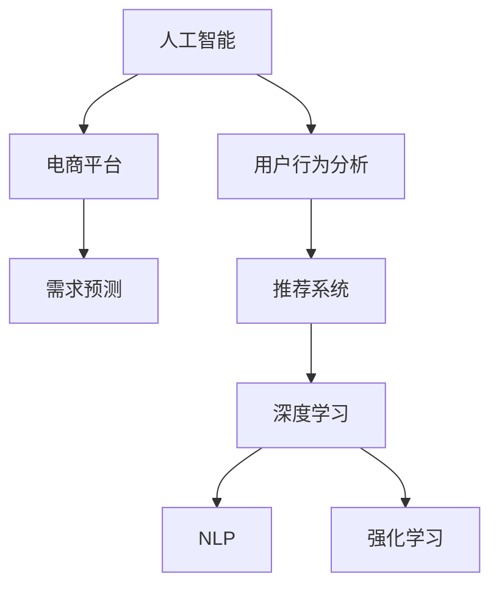

                 

# AI驱动的电商平台用户需求预测

> 关键词：人工智能,电商平台,用户行为分析,需求预测,推荐系统,深度学习,自然语言处理(NLP)

## 1. 背景介绍

### 1.1 问题由来
在当下互联网时代，电商平台已经成为人们日常生活的重要组成部分。如何更好地理解和预测用户需求，为用户提供个性化推荐，提升用户满意度和转化率，是电商企业亟待解决的挑战。传统的方法通常依赖于手动设计推荐规则、统计分析等，难以充分挖掘用户深层次需求。而随着人工智能技术的兴起，尤其是深度学习和大数据分析技术的发展，使得电商平台用户需求预测进入了一个新的阶段。

近年来，基于人工智能技术的需求预测模型在电商领域取得了显著的进展。通过用户行为数据的深入挖掘和分析，构建大规模预测模型，已经能够对用户需求进行准确的预测。文章将从算法原理、模型构建、实际应用和未来趋势等多个角度，系统介绍AI驱动的电商平台用户需求预测技术。

## 2. 核心概念与联系

### 2.1 核心概念概述

为更好地理解AI驱动的电商平台用户需求预测，本节将介绍几个密切相关的核心概念：

- **人工智能(Artificial Intelligence, AI)**：指通过计算机模拟人的智能行为，使得机器能够执行复杂的逻辑推理、问题解决、数据处理等任务。
- **电商平台(E-Commerce Platform)**：指通过互联网进行商品交易的虚拟市场，具有大规模交易数据的积累。
- **用户行为分析(User Behavior Analysis)**：指通过数据挖掘技术，对用户的操作行为、购买记录、浏览历史等进行分析，以了解用户的偏好和需求。
- **需求预测(Demand Prediction)**：指通过对历史数据的学习，预测未来用户对商品的需求量。
- **推荐系统(Recommendation System)**：指根据用户历史行为和兴趣，推荐相关商品或内容，提升用户体验和平台转化率。
- **深度学习(Deep Learning)**：指通过多层神经网络模型，自动学习数据特征，构建复杂预测模型。
- **自然语言处理(Natural Language Processing, NLP)**：指对文本数据进行自动处理，包括文本分类、情感分析、实体识别等。
- **强化学习(Reinforcement Learning)**：指通过智能体与环境的交互，学习最优策略以最大化长期奖励。

这些核心概念之间的逻辑关系可以通过以下Mermaid流程图来展示：



这个流程图展示了大模型驱动的电商平台用户需求预测的核心概念及其之间的关系：

1. 人工智能提供基础技术支持。
2. 电商平台积累了大量的用户行为数据。
3. 通过用户行为分析，获取用户偏好和需求。
4. 需求预测模型基于历史数据学习用户需求。
5. 推荐系统将预测结果转化为商品推荐。
6. 深度学习和自然语言处理提供高效的模型构建工具。
7. 强化学习通过用户反馈持续优化模型。

这些概念共同构成了AI驱动的电商平台用户需求预测的基本框架，使得电商平台能够高效、准确地预测用户需求，实现个性化推荐。

## 3. 核心算法原理 & 具体操作步骤
### 3.1 算法原理概述

AI驱动的电商平台用户需求预测，本质上是通过对历史数据的学习，构建预测模型，以预测用户对商品的需求。其核心思想是：利用深度学习模型对用户行为数据进行特征提取，再通过构建回归模型或分类模型，对未来需求进行预测。

形式化地，假设用户历史行为数据为 $D=\{(x_i,y_i)\}_{i=1}^N$，其中 $x_i$ 为历史行为特征，$y_i$ 为对应的需求量或购买量。目标是找到一个函数 $f(x)$，使得在测试数据集上的预测误差最小化。常见的方法包括：

- 线性回归：假设 $f(x)=\theta_0+\sum_{i=1}^p \theta_i x_i$，最小化均方误差。
- 逻辑回归：假设 $f(x)=\sigma(\theta_0+\sum_{i=1}^p \theta_i x_i)$，最小化交叉熵损失。
- 深度神经网络：利用多层神经网络模型，自动学习输入和输出之间的复杂映射关系。

在实际应用中，电商平台通常使用RNN、LSTM、GRU、Transformer等深度学习模型，对用户行为数据进行建模，并通过构建loss函数和优化器进行模型训练，以得到最佳的预测模型。

### 3.2 算法步骤详解

AI驱动的电商平台用户需求预测，一般包括以下几个关键步骤：

**Step 1: 数据收集与预处理**
- 收集电商平台用户的历史行为数据，包括点击、浏览、购买、评分等。
- 清洗数据，处理缺失值、异常值，构建特征集，并进行归一化处理。

**Step 2: 特征工程与模型选择**
- 设计合适的特征工程，如用户画像、商品特征、时间特征、交易场景等。
- 选择或构建合适的预测模型，如线性回归、逻辑回归、神经网络、随机森林等。
- 使用交叉验证等技术，评估模型性能，选择最优模型。

**Step 3: 模型训练与调参**
- 将数据集划分为训练集和测试集。
- 利用训练集数据对模型进行训练，调整超参数。
- 在测试集上进行模型评估，输出预测误差。

**Step 4: 模型部署与监控**
- 将训练好的模型部署到电商平台上，提供预测服务。
- 实时监控模型表现，进行异常检测和模型更新。
- 周期性地更新模型，重新训练以适应新的数据分布。

**Step 5: 推荐系统集成**
- 将预测结果输出给推荐系统。
- 根据预测结果和用户历史行为数据，生成个性化推荐。
- 反馈用户点击和购买数据，进一步优化预测模型。

以上是AI驱动的电商平台用户需求预测的一般流程。在实际应用中，还需要针对具体任务和数据特点，对模型构建和优化过程进行精细设计，以提升预测效果。

### 3.3 算法优缺点

AI驱动的电商平台用户需求预测方法具有以下优点：
1. 数据驱动：基于用户历史行为数据的深度挖掘，能够提供更精准的预测结果。
2. 自动化：通过模型训练和优化，预测过程自动化程度高，减少了人工干预。
3. 泛化能力强：深度学习模型具有较强的泛化能力，可以适应不同的电商场景。
4. 高效实用：模型训练过程可以利用GPU、TPU等高性能硬件，快速迭代。
5. 可扩展性强：模型可以集成到推荐系统，实现个性化推荐，提升用户体验。

同时，该方法也存在一定的局限性：
1. 数据依赖：对数据质量、标注工作量要求高，数据偏差可能影响预测结果。
2. 计算复杂：深度学习模型训练过程计算量大，硬件资源需求高。
3. 黑箱问题：深度学习模型决策过程复杂，难以进行解释和调试。
4. 隐私风险：用户行为数据涉及隐私，处理不当可能引发法律风险。
5. 模型过拟合：复杂模型可能出现过拟合，导致泛化性能下降。

尽管存在这些局限性，但就目前而言，基于AI的需求预测方法仍是电商平台用户需求预测的重要手段。未来相关研究的重点在于如何进一步降低数据依赖，提高模型的泛化能力和可解释性，同时兼顾隐私保护等因素。

### 3.4 算法应用领域

AI驱动的电商平台用户需求预测，已经在多个电商领域得到了广泛的应用，包括但不限于：

- **个性化推荐**：根据用户历史行为数据，预测用户对商品的需求，推荐相关商品。
- **库存管理**：预测商品需求量，优化库存管理，避免库存积压和缺货。
- **广告投放**：预测用户对广告的点击率，优化广告投放策略。
- **商品定价**：预测不同商品的需求量和用户支付意愿，制定合理定价策略。
- **用户流失预警**：预测用户流失概率，及时采取措施进行挽留。
- **市场营销分析**：分析用户购买行为，了解市场需求变化，制定营销策略。

除了上述这些经典应用外，AI驱动的电商平台用户需求预测技术还被创新性地应用于智能客服、在线教育、社交媒体等多个领域，为电商平台的智能运营提供了重要支持。

## 4. 数学模型和公式 & 详细讲解  
### 4.1 数学模型构建

本节将使用数学语言对AI驱动的电商平台用户需求预测过程进行更加严格的刻画。

假设电商平台用户行为数据为 $D=\{(x_i,y_i)\}_{i=1}^N$，其中 $x_i \in \mathbb{R}^n$ 为特征向量，$y_i \in \mathbb{R}$ 为需求量。目标是找到一个函数 $f(x)$，使得在测试数据集上的预测误差最小化。

常用的预测模型包括线性回归、逻辑回归、多层神经网络等。以线性回归为例，假设 $f(x)=\theta_0+\sum_{i=1}^p \theta_i x_i$，则最小化均方误差损失函数为：

$$
\min_{\theta} \sum_{i=1}^N (y_i - f(x_i))^2
$$

在实际应用中，通常使用随机梯度下降等优化算法进行模型训练，以最小化上述损失函数。

### 4.2 公式推导过程

以下我们以线性回归模型为例，推导最小二乘法损失函数及其梯度计算公式。

假设线性回归模型为 $y_i = \theta_0 + \sum_{j=1}^p \theta_j x_{ij}$，其中 $x_{ij}$ 为特征向量 $x_i$ 的第 $j$ 个元素。则均方误差损失函数为：

$$
L(\theta) = \frac{1}{2N} \sum_{i=1}^N (y_i - f(x_i))^2
$$

求损失函数对参数 $\theta$ 的梯度，得：

$$
\frac{\partial L(\theta)}{\partial \theta} = \frac{1}{N} \sum_{i=1}^N (y_i - f(x_i)) x_i
$$

将梯度代入随机梯度下降算法，更新模型参数，得：

$$
\theta \leftarrow \theta - \eta \nabla_{\theta}L(\theta)
$$

其中 $\eta$ 为学习率。

在得到梯度后，即可带入随机梯度下降算法，完成模型的迭代优化。重复上述过程直至收敛，最终得到适应电商需求的预测模型。

### 4.3 案例分析与讲解

以电商平台中的商品销量预测为例，具体分析模型构建和优化过程。

首先，收集商品的历史销量数据 $D=\{(x_i,y_i)\}_{i=1}^N$，其中 $x_i$ 包含商品类别、价格、销量、评价等特征。数据预处理包括缺失值处理、异常值检测、特征归一化等。

接着，设计特征工程，选择合适的特征变量 $x$，如商品类别、季节、促销活动等。构建线性回归模型 $y_i = \theta_0 + \sum_{j=1}^p \theta_j x_{ij}$，其中 $\theta_0, \theta_j$ 为模型参数。

使用交叉验证技术，评估模型性能，选择最优参数组合。最终在测试集上进行模型评估，输出预测误差。

将训练好的模型集成到推荐系统中，根据预测结果和用户历史行为数据，生成个性化推荐。同时实时监控模型表现，进行异常检测和模型更新。

## 5. 项目实践：代码实例和详细解释说明
### 5.1 开发环境搭建

在进行AI驱动的电商平台用户需求预测实践前，我们需要准备好开发环境。以下是使用Python进行PyTorch开发的环境配置流程：

1. 安装Anaconda：从官网下载并安装Anaconda，用于创建独立的Python环境。

2. 创建并激活虚拟环境：
```bash
conda create -n ai-env python=3.8 
conda activate ai-env
```

3. 安装PyTorch：根据CUDA版本，从官网获取对应的安装命令。例如：
```bash
conda install pytorch torchvision torchaudio cudatoolkit=11.1 -c pytorch -c conda-forge
```

4. 安装各类工具包：
```bash
pip install numpy pandas scikit-learn matplotlib tqdm jupyter notebook ipython
```

完成上述步骤后，即可在`ai-env`环境中开始项目实践。

### 5.2 源代码详细实现

这里我们以电商销量预测为例，给出使用PyTorch进行线性回归模型的Python代码实现。

首先，定义数据处理函数：

```python
import pandas as pd
import numpy as np

def load_data(file_path):
    data = pd.read_csv(file_path)
    features = data.drop('sales', axis=1)
    target = data['sales']
    features = features.to_numpy().astype(np.float32)
    target = target.to_numpy().astype(np.float32)
    return features, target
```

然后，定义模型和优化器：

```python
from torch.utils.data import Dataset, DataLoader
from torch import nn, optim
import torch.nn.functional as F

class SalesDataset(Dataset):
    def __init__(self, features, target):
        self.features = features
        self.target = target
        
    def __len__(self):
        return len(self.features)
    
    def __getitem__(self, item):
        return self.features[item], self.target[item]

# 数据集
features, target = load_data('sales_data.csv')
dataset = SalesDataset(features, target)

# 模型
class SalesModel(nn.Module):
    def __init__(self, in_features, out_features):
        super(SalesModel, self).__init__()
        self.linear = nn.Linear(in_features, out_features)
    
    def forward(self, x):
        return self.linear(x)

# 训练模型
model = SalesModel(in_features=8, out_features=1)
optimizer = optim.SGD(model.parameters(), lr=0.01)
criterion = nn.MSELoss()

# 训练过程
batch_size = 32
epochs = 50
for epoch in range(epochs):
    model.train()
    for batch in DataLoader(dataset, batch_size=batch_size, shuffle=True):
        inputs, targets = batch
        optimizer.zero_grad()
        outputs = model(inputs)
        loss = criterion(outputs, targets)
        loss.backward()
        optimizer.step()
```

最后，启动模型训练并在测试集上评估：

```python
# 测试模型
model.eval()
with torch.no_grad():
    test_loader = DataLoader(dataset, batch_size=batch_size)
    test_loss = 0
    for batch in test_loader:
        inputs, targets = batch
        outputs = model(inputs)
        test_loss += criterion(outputs, targets).item()
    test_loss /= len(test_loader)
print('Test loss:', test_loss)
```

以上就是使用PyTorch对电商平台销量进行预测的完整代码实现。可以看到，通过简单的数据预处理和模型构建，我们能够快速得到一个基本的销量预测模型。

### 5.3 代码解读与分析

让我们再详细解读一下关键代码的实现细节：

**SalesDataset类**：
- `__init__`方法：初始化数据集的特征和目标。
- `__len__`方法：返回数据集的大小。
- `__getitem__`方法：返回数据集中的单个样本。

**SalesModel类**：
- `__init__`方法：定义线性回归模型的结构，包含一个线性层。
- `forward`方法：定义前向传播过程，将输入数据通过线性层得到预测结果。

**训练和测试函数**：
- 使用PyTorch的DataLoader对数据集进行批次化加载，供模型训练和推理使用。
- 训练函数中，模型进入训练模式，使用随机梯度下降算法对模型参数进行更新。
- 测试函数中，模型进入评估模式，使用均方误差计算预测误差，输出测试集上的平均损失。

**训练流程**：
- 定义总的epoch数和批大小，开始循环迭代
- 每个epoch内，对数据集进行循环迭代，更新模型参数
- 在每个epoch后，输出训练集上的平均损失
- 在测试集上进行模型评估，输出测试集上的平均损失

可以看到，PyTorch提供了方便的框架支持，使得模型构建和训练过程变得简单高效。开发者可以专注于特征工程和模型优化等关键环节，而不必过多关注底层的实现细节。

当然，工业级的系统实现还需考虑更多因素，如模型的保存和部署、超参数的自动搜索、更灵活的任务适配层等。但核心的预测范式基本与此类似。

## 6. 实际应用场景
### 6.1 电商个性化推荐

基于AI驱动的电商平台用户需求预测，可以广泛应用于个性化推荐系统。传统的推荐系统通常依赖于用户历史行为数据，难以挖掘用户深层次需求。而通过需求预测模型，可以更好地了解用户的真实兴趣和偏好，生成个性化推荐。

在技术实现上，可以收集用户的历史浏览、点击、购买等行为数据，构建用户画像，通过预测模型预测用户对商品的需求，生成个性化推荐列表。同时，将预测结果和用户行为数据进行反馈，不断优化模型，提升推荐效果。

### 6.2 库存管理优化

库存管理是电商平台运营中的重要环节，通过预测商品需求量，可以优化库存配置，避免库存积压和缺货现象。通过需求预测模型，可以预测不同时间段、不同地区、不同商品的需求量，帮助商家制定合理的库存策略。

在实际应用中，可以定期对历史销售数据进行回测，评估模型性能。同时，实时监控预测结果，根据订单情况调整库存，确保库存水平合理。

### 6.3 广告投放优化

电商平台中的广告投放是流量获取的重要手段，通过需求预测模型，可以预测用户对不同广告的点击率，优化广告投放策略，提升广告转化率。

具体而言，可以收集用户对不同广告的点击数据，构建用户画像，通过预测模型预测用户对广告的点击率。同时，将预测结果反馈到广告投放平台，动态调整广告投放策略，实现最佳的广告效果。

### 6.4 未来应用展望

随着AI技术的不断进步，基于需求预测的电商应用将更加丰富和深入。

在智慧零售领域，需求预测模型将能够预测不同渠道、不同场景下的消费者需求，优化供应链管理，提升整体运营效率。同时，结合物联网、云计算等技术，可以实现实时需求预测和动态库存管理，提升用户体验。

在智能营销领域，需求预测模型将能够预测用户对不同产品和内容的兴趣，实现精准营销和个性化广告投放，提升营销效果和用户满意度。

此外，在金融、医疗、教育等多个领域，需求预测技术也将发挥重要作用。通过数据挖掘和机器学习，需求预测模型可以揭示用户的潜在需求，提供更好的服务和产品，推动各行业的智能化发展。

## 7. 工具和资源推荐
### 7.1 学习资源推荐

为了帮助开发者系统掌握AI驱动的电商平台用户需求预测的理论基础和实践技巧，这里推荐一些优质的学习资源：

1. 《深度学习基础》课程：由吴恩达教授主讲的深度学习基础课程，系统介绍了深度学习的基本概念和常用算法。

2. 《Python深度学习》书籍：由Francois Chollet撰写的深度学习入门书籍，深入浅出地介绍了深度学习的基本原理和TensorFlow框架的使用。

3. CS231n《深度学习计算机视觉》课程：斯坦福大学开设的计算机视觉课程，讲解了深度学习在图像识别、目标检测、语义分割等方面的应用。

4. 《自然语言处理综论》课程：由斯坦福大学开设的自然语言处理课程，系统讲解了NLP中的核心技术和算法。

5. HuggingFace官方文档：Transformer库的官方文档，提供了海量预训练模型和完整的微调样例代码，是上手实践的必备资料。

通过对这些资源的学习实践，相信你一定能够快速掌握AI驱动的电商平台用户需求预测的精髓，并用于解决实际的电商问题。
###  7.2 开发工具推荐

高效的开发离不开优秀的工具支持。以下是几款用于AI驱动的电商平台用户需求预测开发的常用工具：

1. PyTorch：基于Python的开源深度学习框架，灵活动态的计算图，适合快速迭代研究。大部分深度学习模型都有PyTorch版本的实现。

2. TensorFlow：由Google主导开发的开源深度学习框架，生产部署方便，适合大规模工程应用。同样有丰富的预训练语言模型资源。

3. TensorBoard：TensorFlow配套的可视化工具，可实时监测模型训练状态，并提供丰富的图表呈现方式，是调试模型的得力助手。

4. Weights & Biases：模型训练的实验跟踪工具，可以记录和可视化模型训练过程中的各项指标，方便对比和调优。

5. Jupyter Notebook：交互式编程环境，适合进行数据探索、模型构建和实验调试。

合理利用这些工具，可以显著提升AI驱动的电商平台用户需求预测任务的开发效率，加快创新迭代的步伐。

### 7.3 相关论文推荐

AI驱动的电商平台用户需求预测技术，得益于深度学习、数据挖掘和自然语言处理等领域的交叉融合。以下是几篇奠基性的相关论文，推荐阅读：

1. "The Elements of Statistical Learning"：Hastie、Tibshirani和Friedman合著的统计学习经典教材，深入浅出地讲解了机器学习的基本理论和算法。

2. "Deep Learning"：Goodfellow、Bengio和Courville合著的深度学习权威教材，全面介绍了深度学习的基本原理和实践技巧。

3. "Programming Recommendation Systems"：Resnick和Varian合著的推荐系统经典书籍，系统讲解了推荐系统的工作原理和实现方法。

4. "A Survey of Recommender Systems"：Schuemie和Shani合著的推荐系统综述论文，全面介绍了推荐系统的研究进展和应用场景。

5. "Attention Is All You Need"：提出Transformer结构的论文，标志着自注意力机制在深度学习中的重要地位。

这些论文代表了大数据驱动的电商平台用户需求预测技术的发展脉络。通过学习这些前沿成果，可以帮助研究者把握学科前进方向，激发更多的创新灵感。

## 8. 总结：未来发展趋势与挑战
### 8.1 总结

本文对AI驱动的电商平台用户需求预测技术进行了全面系统的介绍。首先阐述了AI驱动电商的背景和意义，明确了需求预测在电商领域的重要地位。其次，从算法原理到模型构建，详细讲解了AI驱动的电商平台用户需求预测方法。再次，从实践实例到应用场景，展示了需求预测技术在电商领域的具体应用和前景。最后，结合未来趋势和挑战，对需求预测技术的发展方向进行了展望。

通过本文的系统梳理，可以看到，AI驱动的电商平台用户需求预测技术正在成为电商领域的重要工具，极大地提升了电商平台的智能化水平和运营效率。随着AI技术的不断进步，需求预测技术将进一步深化，为电商平台的智能化运营提供更强大的支持。

### 8.2 未来发展趋势

展望未来，AI驱动的电商平台用户需求预测技术将呈现以下几个发展趋势：

1. **多模态数据融合**：未来的需求预测模型将能够融合用户行为数据、社交媒体数据、物流数据等多模态数据，提供更全面、更准确的预测结果。

2. **深度强化学习**：结合强化学习技术，需求预测模型将能够学习更复杂的决策策略，提升预测精度和鲁棒性。

3. **自适应模型训练**：需求预测模型将具备动态调整学习率和超参数的能力，自适应不同场景和数据分布。

4. **实时预测系统**：通过构建实时预测系统，需求预测模型将能够实现动态更新，及时应对市场变化。

5. **端到端集成**：需求预测模型将与推荐系统、库存管理、广告投放等环节进行端到端集成，实现协同优化。

6. **隐私保护技术**：为应对用户隐私保护的需求，需求预测模型将引入差分隐私、联邦学习等隐私保护技术。

以上趋势凸显了AI驱动的电商平台用户需求预测技术的广阔前景。这些方向的探索发展，必将进一步提升电商平台的预测准确性、智能化水平和运营效率，为用户带来更好的购物体验。

### 8.3 面临的挑战

尽管AI驱动的电商平台用户需求预测技术已经取得了瞩目成就，但在迈向更加智能化、普适化应用的过程中，它仍面临着诸多挑战：

1. **数据依赖**：对数据质量、标注工作量要求高，数据偏差可能影响预测结果。

2. **计算复杂**：深度学习模型训练过程计算量大，硬件资源需求高。

3. **模型鲁棒性**：复杂的预测模型容易过拟合，泛化性能差。

4. **可解释性**：深度学习模型决策过程复杂，难以进行解释和调试。

5. **隐私保护**：用户行为数据涉及隐私，处理不当可能引发法律风险。

6. **模型更新**：需求预测模型需要实时更新，以适应新的数据分布。

这些挑战凸显了AI驱动的电商平台用户需求预测技术在实际应用中的复杂性和多样性。为了更好地应对这些挑战，未来的研究需要在数据采集、模型构建、算法优化、隐私保护等多个方面进行全面提升。

### 8.4 研究展望

面向未来，AI驱动的电商平台用户需求预测技术需要在以下几个方面寻求新的突破：

1. **高效的数据预处理技术**：探索更高效的数据清洗、特征选择和归一化方法，降低数据依赖，提升数据质量。

2. **可解释的深度学习模型**：开发更可解释的深度学习模型，提升模型的透明度和可理解性。

3. **隐私保护技术**：引入差分隐私、联邦学习等隐私保护技术，保障用户数据隐私和安全。

4. **多模态数据融合**：结合多种数据源，提升需求预测模型的泛化能力和准确性。

5. **实时预测系统**：构建实时预测系统，提升模型的动态更新能力。

6. **端到端集成**：将需求预测模型与电商运营环节进行集成，实现协同优化，提升整体运营效率。

这些研究方向的探索，必将引领AI驱动的电商平台用户需求预测技术迈向更高的台阶，为电商平台的智能化运营提供更强大的技术支撑。面向未来，需求预测技术需要在保持高效、准确的同时，提升可解释性、隐私保护能力，实现多模态数据融合和实时预测，进一步拓展电商平台的智能化水平。

## 9. 附录：常见问题与解答

**Q1：电商平台的数据质量对预测结果有哪些影响？**

A: 电商平台的数据质量对需求预测结果有着重要影响。数据质量问题主要包括以下几个方面：

1. **数据缺失**：缺失数据将导致模型训练过程缺乏有效的样本，降低模型的预测准确性。可以通过数据插补、模型迁移学习等方法进行缺失值处理。

2. **数据偏差**：数据偏差可能导致模型预测结果偏斜，无法真实反映用户需求。可以通过数据清洗、特征选择、模型调参等方法消除数据偏差。

3. **数据噪声**：数据中存在的噪声将干扰模型的学习过程，导致预测结果不准确。可以通过数据清洗、特征降维、异常值检测等方法降低数据噪声。

4. **数据分布不均**：不同时间段、不同商品的数据分布不均，将影响模型的泛化能力。可以通过数据重采样、时间特征处理等方法解决数据分布不均问题。

因此，确保数据质量是需求预测模型的基础，需要从数据采集、清洗、特征工程等多个环节进行全面控制，以保证模型训练和预测的可靠性。

**Q2：电商平台的需求预测模型如何应对季节性变化？**

A: 电商平台的需求预测模型通常会受到季节性因素的影响，具体应对策略如下：

1. **时间特征工程**：在模型构建中，引入时间特征（如月份、星期、季节等），利用季节性特征进行预测。

2. **模型更新**：根据季节性变化，周期性地重新训练模型，调整模型参数，以适应新的数据分布。

3. **分解预测**：采用分解预测方法，将需求预测结果分解为长期趋势、季节性因素和随机干扰，提升预测的准确性。

4. **数据增强**：利用历史季节性数据，生成更丰富的时间特征，增强模型的泛化能力。

5. **多模型集成**：构建多个季节性模型，如线性回归模型、季节性ARIMA模型、时间序列预测模型等，结合不同模型进行集成预测。

通过这些方法，电商平台的需求预测模型可以更好地应对季节性变化，提升预测的准确性和稳定性。

**Q3：电商平台的需求预测模型如何应对用户个性化需求？**

A: 电商平台的需求预测模型通常需要考虑用户个性化需求，具体应对策略如下：

1. **用户画像**：在模型构建中，引入用户画像信息（如年龄、性别、兴趣等），利用用户画像进行个性化预测。

2. **上下文信息**：在预测过程中，引入上下文信息（如用户浏览记录、购物车内容等），提升预测的个性化程度。

3. **推荐系统集成**：将需求预测模型与推荐系统进行集成，利用推荐系统的用户行为数据进行反馈，不断优化预测模型。

4. **个性化推荐**：根据个性化需求，生成定制化的推荐内容，提升用户满意度。

5. **多模型集成**：构建多个个性化预测模型，如基于深度学习的个性化预测模型、基于规则的个性化预测模型等，结合不同模型进行集成预测。

通过这些方法，电商平台的需求预测模型可以更好地应对用户个性化需求，提供更精准、更个性化的推荐内容，提升用户体验和转化率。

**Q4：电商平台的需求预测模型如何处理用户行为数据？**

A: 电商平台的需求预测模型通常需要处理用户行为数据，具体处理策略如下：

1. **数据清洗**：对用户行为数据进行清洗，处理缺失值、异常值、噪声等，确保数据质量。

2. **特征选择**：选择与需求预测相关的重要特征，如用户点击、浏览、购买等行为数据，避免特征选择过多导致模型过拟合。

3. **特征工程**：对特征进行预处理，如归一化、编码、降维等，提升特征表示的效率和效果。

4. **数据增强**：利用数据增强技术，如回译、近义替换、数据合成等，增加训练数据的多样性，提升模型的泛化能力。

5. **模型优化**：利用模型优化技术，如正则化、dropout、early stopping等，避免过拟合，提升模型的泛化能力。

6. **在线学习**：采用在线学习技术，实时更新模型参数，提升模型的实时预测能力。

通过这些方法，电商平台的需求预测模型可以更好地处理用户行为数据，提升模型的预测精度和泛化能力，为用户提供更精准的推荐和预测服务。

---

作者：禅与计算机程序设计艺术 / Zen and the Art of Computer Programming

