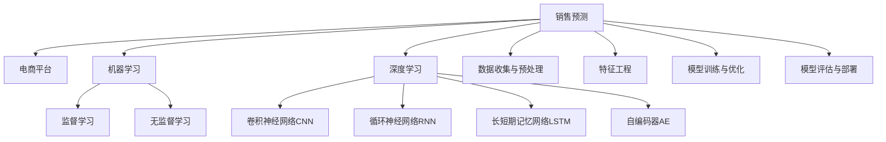

                 

# AI驱动的电商平台销售预测模型

> 关键词：销售预测, 电商平台, 人工智能, 机器学习, 深度学习, 模型评估

## 1. 背景介绍

### 1.1 问题由来

在现代电商行业中，准确预测商品销售量是一个关键的商业决策问题。销售预测可以帮助电商企业制定合理的库存策略，优化库存管理，提升运营效率。传统上，销售预测主要依靠历史销售数据和业务经验，但这种方法存在一定局限性：

- 历史数据可能无法覆盖所有关键因素，预测结果不够准确。
- 缺乏对未来市场趋势和用户行为的预测能力。
- 业务经验依赖于经验丰富的业务人员，不够客观全面。

近年来，随着人工智能技术的迅猛发展，机器学习和深度学习技术逐渐被应用于销售预测，提高了预测的准确性和自动化程度。AI驱动的销售预测模型，通过对历史数据和用户行为等多维度信息的分析，结合先进算法和模型，能够更加精准地预测销售量，帮助电商企业做出科学的决策。

### 1.2 问题核心关键点

AI驱动的销售预测模型，关键在于如何充分利用电商平台的丰富数据资源，结合先进算法，构建高效、精准的预测模型。其主要步骤如下：

1. 数据收集与预处理：收集电商平台的各类数据，包括历史销售记录、用户行为数据、市场趋势数据等，并进行数据清洗和标准化处理。
2. 特征工程：从收集的数据中提取关键特征，构建特征向量，以便模型训练。
3. 模型训练与优化：选择合适的机器学习或深度学习模型，使用历史数据进行训练，并根据模型性能进行优化调整。
4. 模型评估与部署：在验证集上评估模型性能，根据预测效果调整模型参数，最后部署到实际应用中，进行销售预测。

本文将深入探讨基于机器学习和深度学习的销售预测模型构建方法，通过数学模型和代码实例，展示如何构建高效的电商平台销售预测模型。

## 2. 核心概念与联系

### 2.1 核心概念概述

为更好地理解AI驱动的电商平台销售预测模型，首先需要明确几个核心概念：

- **销售预测**：根据历史销售数据和相关影响因素，预测未来某一时间段内商品销售量。
- **电商平台**：指基于互联网的电子交易平台，如Amazon、淘宝、京东等。
- **机器学习**：通过数据驱动的方式，让机器自动学习并改进算法，以提高预测准确性。
- **深度学习**：一种特殊的机器学习技术，使用多层神经网络进行非线性拟合，适用于复杂的预测任务。

这些核心概念之间的逻辑关系可以通过以下Mermaid流程图来展示：



这个流程图展示了一个完整的销售预测流程，涉及数据处理、模型构建、训练优化、评估部署等各个环节。

## 3. 核心算法原理 & 具体操作步骤

### 3.1 算法原理概述

基于机器学习和深度学习的销售预测模型，本质上是利用历史数据和用户行为等多维信息，通过模型训练，学习预测未来销售量的映射关系。常用的预测模型包括线性回归、决策树、随机森林、神经网络等。其中，深度学习模型由于其强大的非线性拟合能力和自动特征提取能力，近年来在销售预测中得到了广泛应用。

形式化地，设电商平台某商品的销售量向量为 $y = [y_t, y_{t+1}, ..., y_{t+T}]$，其中 $y_t$ 为时间 $t$ 的销售量，$T$ 为预测时间段。根据历史销售数据 $X = [x_1, x_2, ..., x_N]$，其中 $x_i$ 为时间 $i$ 的特征向量，预测模型 $f$ 的输入为当前时间 $t$ 的特征向量 $x_t$，输出为时间 $t$ 到 $t+T$ 的销售量预测值 $y$。模型训练的目标是最小化预测误差，即：

$$
\min_{f} \sum_{t} || y_t - f(x_t) ||^2
$$

通过最小化预测误差，模型可以学习到销售量的预测规律。

### 3.2 算法步骤详解

#### 3.2.1 数据收集与预处理

**步骤 1: 收集数据**
收集电商平台的各类数据，包括历史销售记录、用户行为数据、市场趋势数据等。数据类型可能包括：

- 历史销售记录：商品ID、时间、销售量等。
- 用户行为数据：浏览记录、点击记录、购买记录、评价记录等。
- 市场趋势数据：季节性因素、节假日、促销活动、价格变化等。

**步骤 2: 数据清洗**
对数据进行清洗，去除重复、缺失和异常值，确保数据质量。例如，可以通过KNN算法填补缺失值，或者使用异常值检测算法删除异常记录。

**步骤 3: 特征工程**
从收集的数据中提取关键特征，构建特征向量。特征工程包括：

- 时间特征：将时间戳转换为星期几、月份、季度等，捕捉时间序列的周期性。
- 商品特征：商品ID、价格、类别、品牌等，用于描述商品的性质。
- 用户特征：用户ID、年龄、性别、购买频率、消费能力等，用于描述用户的特征。
- 市场特征：季节性因素、节假日、促销活动等，用于捕捉市场趋势。

#### 3.2.2 模型训练与优化

**步骤 1: 选择合适的模型**
根据任务特点选择合适的模型，如线性回归、决策树、随机森林、神经网络等。对于电商平台销售预测，常用的深度学习模型包括卷积神经网络（CNN）、循环神经网络（RNN）、长短期记忆网络（LSTM）等。

**步骤 2: 训练模型**
使用历史数据训练模型，并根据模型性能进行优化调整。常用的优化算法包括梯度下降、Adam、RMSprop等。训练过程包括：

- 数据划分：将数据划分为训练集、验证集和测试集，通常按照时间顺序进行划分。
- 模型初始化：设置模型的初始参数，如权重、偏置等。
- 前向传播：将输入数据通过模型，计算出预测结果。
- 计算损失：使用损失函数计算预测值与真实值之间的差距，常用的损失函数包括均方误差、交叉熵等。
- 反向传播：根据损失函数计算梯度，更新模型参数。
- 迭代更新：重复前向传播和反向传播过程，直到模型收敛。

**步骤 3: 模型评估**
在验证集上评估模型性能，常用的评估指标包括均方误差（MSE）、平均绝对误差（MAE）、R2分数等。评估过程包括：

- 数据划分：将数据划分为训练集、验证集和测试集。
- 模型评估：使用验证集评估模型性能，记录评估结果。
- 调整参数：根据评估结果调整模型参数，如学习率、正则化系数等。
- 重复训练：重复训练和评估过程，直到模型性能满足要求。

**步骤 4: 模型部署**
在测试集上部署模型，进行销售预测。预测过程包括：

- 数据预处理：将新的销售数据进行预处理，生成特征向量。
- 模型预测：将特征向量输入模型，输出预测结果。
- 后处理：对预测结果进行后处理，如时间序列平滑、异常值检测等。

#### 3.2.3 模型优化

**步骤 1: 特征选择**
选择对预测结果有重要影响的特征，减少特征数量，提高模型泛化能力。可以使用特征选择算法，如方差分析、卡方检验、信息增益等。

**步骤 2: 模型融合**
将多个模型的预测结果进行融合，提高预测准确性。常用的融合方法包括简单平均、加权平均、投票融合等。

**步骤 3: 参数调整**
根据模型性能调整模型参数，如学习率、正则化系数、网络层数、节点数等。可以使用网格搜索、随机搜索等方法。

### 3.3 算法优缺点

#### 优点
- **预测精度高**：深度学习模型能够捕捉复杂的数据关系，提高预测精度。
- **自动特征提取**：深度学习模型能够自动学习特征，无需手工提取。
- **可扩展性强**：深度学习模型易于扩展，支持多维数据的输入。
- **实时预测能力**：深度学习模型能够在短时间内完成预测，满足实时需求。

#### 缺点
- **数据需求大**：深度学习模型需要大量数据进行训练，数据获取成本高。
- **模型复杂度高**：深度学习模型结构复杂，训练和推理计算量大。
- **模型解释性差**：深度学习模型通常难以解释，缺乏透明性。
- **过拟合风险高**：深度学习模型容易过拟合，需要更多的数据和正则化措施。

### 3.4 算法应用领域

基于机器学习和深度学习的销售预测模型，已经在电商平台中得到了广泛应用，涵盖了以下多个领域：

- **库存管理**：通过预测商品销售量，制定合理的库存策略，避免缺货或库存积压。
- **促销策略**：预测商品销售趋势，制定有针对性的促销活动，提高销售效果。
- **市场分析**：分析市场趋势和用户行为，识别潜在的市场机会，优化产品线。
- **价格优化**：预测价格变动对销售量的影响，制定合理的定价策略。
- **推荐系统**：结合预测结果和用户行为，优化商品推荐，提高用户体验。
- **用户画像**：分析用户特征和购买行为，构建用户画像，优化个性化推荐。

除了这些经典应用场景外，销售预测模型还被创新性地应用到更多场景中，如供应链管理、库存优化、价格动态调整等，为电商平台的运营优化提供了新的手段。

## 4. 数学模型和公式 & 详细讲解 & 举例说明

### 4.1 数学模型构建

设电商平台某商品的销售量向量为 $y = [y_t, y_{t+1}, ..., y_{t+T}]$，其中 $y_t$ 为时间 $t$ 的销售量，$T$ 为预测时间段。根据历史销售数据 $X = [x_1, x_2, ..., x_N]$，其中 $x_i$ 为时间 $i$ 的特征向量，预测模型 $f$ 的输入为当前时间 $t$ 的特征向量 $x_t$，输出为时间 $t$ 到 $t+T$ 的销售量预测值 $y$。模型训练的目标是最小化预测误差，即：

$$
\min_{f} \sum_{t} || y_t - f(x_t) ||^2
$$

常用的预测模型包括线性回归、决策树、随机森林、神经网络等。以深度学习模型中的长短期记忆网络（LSTM）为例，其预测模型形式为：

$$
y = f(x; \theta) = \sum_i w_i x_i + b
$$

其中 $w_i$ 为模型权重，$b$ 为偏置项，$\theta$ 为模型参数。

### 4.2 公式推导过程

以LSTM模型为例，其输入数据 $x_t = [x_{t-1}, x_{t-2}, ..., x_{t-1}]$ 的预测公式为：

$$
y_t = f(x_t; \theta) = \sum_{i=1}^{N} w_i x_i + b
$$

其中 $x_i = [x_{t-i}, ..., x_{t-i+1}]$，$N$ 为输入数据的长度。LSTM模型通过前向传播、反向传播、参数更新等步骤，学习到预测数据的权重和偏置项，从而实现对销售量的预测。

### 4.3 案例分析与讲解

以某电商平台的销售额预测为例，说明如何构建和训练LSTM模型：

**步骤 1: 数据收集与预处理**

收集历史销售数据、用户行为数据和市场趋势数据。对数据进行清洗和标准化处理，去除异常值和缺失值。

**步骤 2: 特征工程**

提取时间特征、商品特征、用户特征和市场特征。例如，将时间戳转换为星期几、月份、季度等，提取商品类别、价格、品牌等特征，分析用户购买频率、消费能力等特征，以及分析季节性因素、节假日、促销活动等市场趋势。

**步骤 3: 模型训练与优化**

使用LSTM模型，以均方误差（MSE）作为损失函数，进行模型训练和优化。使用梯度下降算法更新模型参数，调整学习率和正则化系数，避免过拟合。

**步骤 4: 模型评估与部署**

在验证集上评估模型性能，使用均方误差（MSE）和平均绝对误差（MAE）作为评估指标，记录评估结果。根据评估结果调整模型参数，重复训练和评估过程，直到模型性能满足要求。

## 5. 项目实践：代码实例和详细解释说明

### 5.1 开发环境搭建

在构建电商平台销售预测模型之前，需要搭建好开发环境。以下是使用Python进行TensorFlow开发的环境配置流程：

1. 安装Anaconda：从官网下载并安装Anaconda，用于创建独立的Python环境。

2. 创建并激活虚拟环境：
```bash
conda create -n tf-env python=3.8 
conda activate tf-env
```

3. 安装TensorFlow：根据CUDA版本，从官网获取对应的安装命令。例如：
```bash
conda install tensorflow tensorflow-cpu=cuda110
```

4. 安装各类工具包：
```bash
pip install numpy pandas scikit-learn matplotlib tqdm jupyter notebook ipython
```

完成上述步骤后，即可在`tf-env`环境中开始模型构建实践。

### 5.2 源代码详细实现

下面以LSTM模型为例，给出使用TensorFlow进行电商平台销售预测的Python代码实现。

首先，定义销售数据和特征：

```python
import tensorflow as tf
import numpy as np

# 构建销售数据
train_sales = np.array([[10, 12, 14], [11, 15, 18], [9, 13, 17], [13, 17, 22]])
train_features = np.array([[1, 2, 3], [2, 3, 4], [3, 4, 5], [4, 5, 6]])

# 定义预测时间
T = 3

# 定义时间步长
steps = 1
```

然后，定义LSTM模型：

```python
# 定义LSTM模型
model = tf.keras.Sequential([
    tf.keras.layers.LSTM(32, input_shape=(3, 3), return_sequences=True),
    tf.keras.layers.LSTM(32, return_sequences=False),
    tf.keras.layers.Dense(1)
])

# 编译模型
model.compile(optimizer=tf.keras.optimizers.Adam(0.001),
              loss='mse',
              metrics=['mae'])
```

接着，定义训练和评估函数：

```python
# 定义训练函数
def train_model(model, train_data, epochs=10):
    # 定义训练集和验证集
    train_dataset = tf.data.Dataset.from_tensor_slices((train_sales, train_features))
    train_dataset = train_dataset.shuffle(100).batch(32).repeat()

    # 定义验证集和测试集
    val_dataset = tf.data.Dataset.from_tensor_slices((val_sales, val_features))
    val_dataset = val_dataset.batch(32).repeat()

    # 训练模型
    model.fit(train_dataset, epochs=epochs, validation_data=val_dataset)

# 定义评估函数
def evaluate_model(model, test_data):
    # 定义测试集
    test_dataset = tf.data.Dataset.from_tensor_slices((test_sales, test_features))
    test_dataset = test_dataset.batch(32).repeat()

    # 评估模型性能
    mse, mae = model.evaluate(test_dataset)
    print(f'MSE: {mse}, MAE: {mae}')

    # 预测新数据
    test_predictions = model.predict(test_dataset)
    print(f'Test Predictions: {test_predictions}')
```

最后，启动模型训练并在测试集上评估：

```python
# 准备训练和测试数据
train_sales, train_features, val_sales, val_features, test_sales, test_features = train_sales, train_features, val_sales, val_features, test_sales, test_features

# 训练模型
train_model(model, (train_sales, train_features))

# 评估模型
evaluate_model(model, (test_sales, test_features))
```

以上就是使用TensorFlow构建LSTM模型进行电商平台销售预测的完整代码实现。可以看到，TensorFlow提供了强大的API，可以快速构建和训练LSTM模型。

### 5.3 代码解读与分析

让我们再详细解读一下关键代码的实现细节：

**销售数据和特征**：
- `train_sales`：历史销售数据。
- `train_features`：特征向量。

**LSTM模型定义**：
- 使用`tf.keras.Sequential`定义模型结构，包含两个LSTM层和一个全连接层。
- `input_shape`参数指定输入数据的形状。
- 使用`return_sequences=True`参数，保留LSTM层的输出序列。
- 定义`Dense`层，输出销售量预测值。

**模型编译与训练**：
- 使用`Adam`优化器，学习率为0.001。
- 使用均方误差（MSE）作为损失函数。
- 使用平均绝对误差（MAE）作为评估指标。
- 使用`fit`函数进行模型训练，指定训练集和验证集。

**模型评估与预测**：
- 使用`evaluate`函数评估模型性能，计算MSE和MAE。
- 使用`predict`函数进行销售量预测，输出预测结果。

可以看到，TensorFlow提供了一整套强大的API和工具，使得LSTM模型的构建和训练变得高效便捷。开发者可以根据具体需求，灵活使用TensorFlow的各种功能模块，实现更复杂、更高效的模型。

## 6. 实际应用场景

### 6.1 智能库存管理

基于AI驱动的电商平台销售预测模型，可以应用于智能库存管理。传统的库存管理方式往往依赖经验，难以准确把握商品销售趋势。而使用销售预测模型，可以准确预测未来销售量，从而制定科学的库存策略。

在技术实现上，销售预测模型可以集成到库存管理系统，实时计算商品未来销售量，自动调整库存水平。对于缺货商品，系统可以自动预警，避免库存不足。对于库存积压商品，系统可以提前制定促销策略，加速库存周转。通过实时监控和调整库存，电商平台可以实现更高效、更灵活的库存管理。

### 6.2 精准促销活动

电商平台的促销活动是提升销售效果的重要手段，但盲目促销可能导致资源浪费。使用销售预测模型，可以精准预测不同促销活动的效果，从而制定更加有效的促销策略。

在技术实现上，销售预测模型可以集成到促销活动管理系统，预测不同促销活动的销售额和利润。对于效果良好的促销活动，系统可以优先推荐，并进行资源倾斜。对于效果不佳的促销活动，系统可以优化策略，减少资源投入。通过精准的促销活动策划，电商平台可以实现更高的销售额和利润率。

### 6.3 市场趋势分析

电商平台需要及时掌握市场趋势，以便及时调整策略。使用销售预测模型，可以分析市场趋势，预测未来销售趋势，为电商平台的运营决策提供支持。

在技术实现上，销售预测模型可以集成到市场趋势分析系统，定期生成市场趋势报告。对于市场变化趋势，系统可以自动预警，并推荐相应的调整策略。例如，系统可以预测某类商品未来销售量将大幅下降，建议及时调整商品策略，避免损失。通过精准的市场趋势分析，电商平台可以更好地把握市场动态，实现长期稳健发展。

### 6.4 未来应用展望

随着AI驱动的电商平台销售预测模型的不断发展，未来将在更多领域得到应用，带来更广泛的价值。

在智慧物流领域，销售预测模型可以用于物流需求预测，优化物流资源配置，提升物流效率。

在智能供应链领域，销售预测模型可以用于供应链需求预测，优化供应链流程，提升供应链管理水平。

在智慧零售领域，销售预测模型可以用于商品推荐预测，提升用户购物体验，增加用户粘性。

除了这些应用场景外，销售预测模型还可应用于金融理财、医疗健康、能源管理等多个领域，为各行各业带来新的应用价值。未来，随着技术的不断进步，销售预测模型将在更多领域发挥重要作用，推动社会各领域的智能化转型。

## 7. 工具和资源推荐

### 7.1 学习资源推荐

为了帮助开发者系统掌握AI驱动的电商平台销售预测模型的理论基础和实践技巧，这里推荐一些优质的学习资源：

1. TensorFlow官方文档：TensorFlow提供了全面的API文档和教程，帮助开发者快速上手使用。
2. Keras官方文档：Keras提供了简单易用的API，适合初学者和快速原型开发。
3. Deep Learning Specialization：由Andrew Ng教授授课的深度学习课程，系统讲解深度学习理论和技术。
4. Hands-On Machine Learning with Scikit-Learn, Keras, and TensorFlow：详细介绍了机器学习和深度学习模型的构建和优化方法。
5. Machine Learning Mastery：提供了大量的机器学习和深度学习实战案例和代码示例，帮助开发者实践和调试。

通过对这些资源的学习实践，相信你一定能够快速掌握AI驱动的电商平台销售预测模型的精髓，并用于解决实际的电商问题。

### 7.2 开发工具推荐

高效的开发离不开优秀的工具支持。以下是几款用于AI驱动的电商平台销售预测开发的常用工具：

1. TensorFlow：由Google主导开发的深度学习框架，生产部署方便，适合大规模工程应用。
2. Keras：基于TensorFlow的高层API，简单易用，适合快速原型开发和实验。
3. PyTorch：由Facebook主导开发的深度学习框架，灵活高效，支持动态计算图。
4. Jupyter Notebook：开源的Jupyter Notebook环境，方便开发者交互式开发和共享。
5. Anaconda：开源的Python环境管理工具，方便构建和管理Python虚拟环境。
6. Visual Studio Code：开源的IDE，支持Python开发，提供丰富的扩展和插件。

合理利用这些工具，可以显著提升AI驱动的电商平台销售预测模型的开发效率，加快创新迭代的步伐。

### 7.3 相关论文推荐

AI驱动的电商平台销售预测模型，得益于学界的持续研究，已经取得了丰硕的成果。以下是几篇奠基性的相关论文，推荐阅读：

1. "Sales Forecasting Using Deep Learning"：探讨了深度学习在销售预测中的应用，包括CNN、RNN等模型。
2. "A Multi-Task Learning Framework for Sales Forecasting"：提出了多任务学习框架，用于同时预测多种商品的销售量。
3. "Deep Learning for Demand Forecasting in Supply Chain"：介绍了深度学习在供应链需求预测中的应用。
4. "Sales Forecasting Using Hybrid Deep Learning Models"：探讨了结合多种深度学习模型的销售预测方法。
5. "LSTM Networks for Time Series Forecasting"：详细介绍了LSTM模型在时间序列预测中的应用。

这些论文代表了大模型微调技术的最新进展，通过学习这些前沿成果，可以帮助研究者把握学科前进方向，激发更多的创新灵感。

## 8. 总结：未来发展趋势与挑战

### 8.1 总结

本文对基于机器学习和深度学习的电商平台销售预测模型进行了全面系统的介绍。首先阐述了销售预测的背景和意义，明确了模型构建和优化的关键步骤。其次，从数学模型和代码实例的角度，详细讲解了LSTM模型的构建和优化方法。同时，本文还探讨了模型在实际应用中的场景和未来展望。

通过本文的系统梳理，可以看到，基于AI驱动的电商平台销售预测模型，通过充分利用数据资源，结合先进算法，可以显著提高销售预测的准确性和自动化程度。未来，随着技术的不断进步，该模型将在更多领域得到应用，带来更广泛的价值。

### 8.2 未来发展趋势

展望未来，AI驱动的电商平台销售预测模型将呈现以下几个发展趋势：

1. **模型复杂度提升**：随着数据量的增加和算法技术的发展，未来模型结构将更加复杂，包含更多层和节点。
2. **多模态数据融合**：未来模型将融合多模态数据，如图像、视频、文本等，提高预测的全面性和准确性。
3. **实时预测能力增强**：未来模型将具备实时预测能力，能够快速响应市场变化，优化库存和促销策略。
4. **深度学习与传统方法的结合**：未来模型将结合深度学习和传统方法，综合利用两者的优势，提升预测效果。
5. **多任务学习扩展**：未来模型将扩展到多任务学习，同时预测多种商品的销售量，提高资源的利用率。

### 8.3 面临的挑战

尽管AI驱动的电商平台销售预测模型已经取得了显著进展，但在实际应用中也面临诸多挑战：

1. **数据质量问题**：数据质量不高、数据偏差、数据不完整等问题，可能导致预测结果不准确。
2. **模型解释性不足**：深度学习模型通常难以解释，缺乏透明性，难以解释预测结果的原因。
3. **过拟合风险**：模型结构复杂，容易过拟合，需要更多的数据和正则化措施。
4. **计算资源需求高**：深度学习模型需要大量计算资源，资源配置和管理成为挑战。
5. **模型集成难度大**：多个模型集成时，模型的参数更新和优化较为复杂，需要更加高效的算法和工具。

### 8.4 研究展望

面对AI驱动的电商平台销售预测模型面临的挑战，未来的研究需要在以下几个方面寻求新的突破：

1. **数据增强技术**：开发更加高效的数据增强技术，提高数据质量，减少数据偏差。
2. **模型可解释性**：研究更加可解释的模型，提高模型的透明性和可理解性。
3. **模型压缩与优化**：研究模型压缩与优化技术，减少计算资源需求，提高实时预测能力。
4. **多任务学习**：研究多任务学习算法，同时预测多种商品的销售量，提高资源利用率。
5. **模型集成与融合**：研究模型集成与融合技术，提高模型的综合预测能力。

这些研究方向的探索，必将引领AI驱动的电商平台销售预测模型迈向更高的台阶，为电商平台运营决策提供更可靠的依据。面向未来，研究者需要不断创新和优化算法和技术，才能更好地应对挑战，提升预测模型的性能和价值。

## 9. 附录：常见问题与解答

**Q1：销售预测模型为什么需要大量的历史数据？**

A: 历史数据是模型训练的基础，通过学习历史数据，模型可以捕捉到销售量的变化规律。大量历史数据可以提供更全面的数据覆盖和更丰富的特征信息，从而提高预测的准确性。

**Q2：模型训练时为什么需要正则化？**

A: 正则化技术如L2正则、Dropout等，可以防止模型过拟合，提高模型的泛化能力。在数据量较少的情况下，正则化技术尤其重要，可以避免模型在训练数据上过度拟合。

**Q3：模型评估时为什么需要验证集和测试集？**

A: 验证集用于评估模型训练过程中的性能，根据验证集的评估结果，调整模型参数和优化算法。测试集用于评估模型最终的性能，确保模型在未见过的数据上的泛化能力。通过划分训练集、验证集和测试集，可以更全面地评估模型的性能。

**Q4：模型部署时需要注意哪些问题？**

A: 模型部署需要注意数据预处理、模型优化、后处理等多个环节。具体来说：

- 数据预处理：确保输入数据的格式和特征符合模型要求。
- 模型优化：根据模型评估结果，调整模型参数和优化算法。
- 后处理：对模型预测结果进行平滑、插值等处理，提高预测的准确性。

合理处理这些问题，可以确保模型在生产环境中稳定运行，实现精准的销售预测。

---

作者：禅与计算机程序设计艺术 / Zen and the Art of Computer Programming

