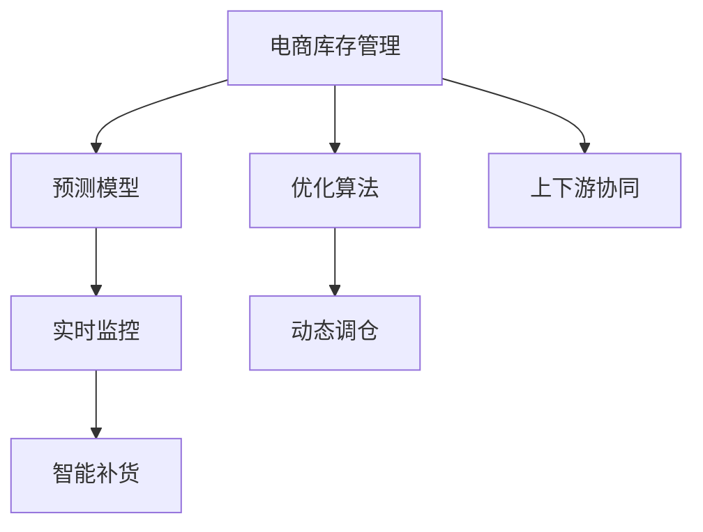

                 

# AI驱动的电商库存管理优化方案

> 关键词：电商库存管理,优化算法,预测模型,实时监控,动态调仓,智能补货

## 1. 背景介绍

### 1.1 问题由来

随着电商市场的迅速发展，库存管理成为电商平台的一项重要任务。良好的库存管理不仅可以减少缺货率、降低物流成本，还能提升用户体验和销售额。然而，传统的库存管理方式依赖于人工经验和固定的补货规则，难以应对市场的快速变化和需求波动。

为了应对这一挑战，电商企业开始引入AI技术，特别是基于机器学习和深度学习的优化算法，来预测需求、优化库存，实现智能补货。本文将介绍一种基于AI的电商库存管理优化方案，详细探讨其核心概念、算法原理和具体操作步骤，并通过实际案例展示其应用效果。

## 2. 核心概念与联系

### 2.1 核心概念概述

为更好地理解AI驱动的电商库存管理优化方案，我们需要首先介绍一些核心概念：

- **电商库存管理**：是指电商平台对库存商品的管理过程，包括采购、入库、销售、出库、调拨、盘点等环节，旨在维持合理的商品数量，满足市场需求，同时控制成本。

- **优化算法**：是指通过数学建模和算法设计，对库存管理过程进行优化，使得目标函数（如利润最大化、成本最小化）达到最优的方法。

- **预测模型**：是指利用历史数据和机器学习算法构建的预测需求、销量、缺货率等指标的模型，用于辅助库存管理决策。

- **实时监控**：是指通过传感器、大数据平台等技术手段，对库存和销售数据进行实时采集和分析，及时调整库存策略。

- **动态调仓**：是指根据库存实时数据和预测模型，自动调整库存位置，确保商品的合理分配和使用。

- **智能补货**：是指通过预测模型和优化算法，自动确定补货时间、数量和地点，提升补货效率和库存准确率。

- **上下游协同**：是指库存管理与供应链、生产、营销等环节的协同工作，共同提高整体效率和效果。

这些核心概念之间的逻辑关系可以通过以下Mermaid流程图来展示：



这个流程图展示了电商库存管理各环节的相互关系：

1. 电商库存管理是整个流程的核心，依赖于其他模块的支持。
2. 预测模型通过历史数据预测需求，辅助决策。
3. 优化算法基于预测模型，进行库存优化。
4. 实时监控对库存数据进行实时分析，及时反馈。
5. 动态调仓根据实时监控结果，自动调整库存位置。
6. 智能补货通过预测模型和优化算法，自动确定补货策略。
7. 上下游协同确保各环节信息畅通，提高整体效率。

## 3. 核心算法原理 & 具体操作步骤
### 3.1 算法原理概述

AI驱动的电商库存管理优化方案，主要基于以下两个算法：

- **预测模型**：通过历史销售数据、促销活动、节假日等因素，预测未来的需求和销量。常用的算法包括时间序列分析、回归分析、随机森林等。
- **优化算法**：基于预测模型的结果，对库存管理过程进行优化，常用的算法包括线性规划、整数规划、动态规划等。

### 3.2 算法步骤详解

#### 3.2.1 数据准备

1. **数据采集**：从电商平台的订单、销售、库存等系统中，采集历史销售数据、库存数据、促销活动信息等。
2. **数据清洗**：对采集的数据进行清洗、去重、填充缺失值等处理，确保数据的准确性和完整性。
3. **数据划分**：将数据划分为训练集、验证集和测试集，用于模型的训练、验证和测试。

#### 3.2.2 模型训练

1. **选择模型**：根据业务需求，选择合适的预测模型，如时间序列模型ARIMA、回归模型线性回归、决策树模型随机森林等。
2. **模型训练**：使用训练集数据，训练预测模型，并使用验证集数据进行调参和验证，确保模型的泛化能力和准确性。
3. **模型评估**：使用测试集数据对模型进行评估，计算各种指标如均方误差(MSE)、平均绝对误差(MAE)等，确保模型的性能。

#### 3.2.3 库存优化

1. **建模优化**：基于预测模型的结果，构建优化模型，如线性规划模型、整数规划模型等，求解库存优化问题。
2. **求解优化**：使用优化算法求解模型，得到最优的库存量、补货时间和地点等结果。
3. **结果验证**：将优化结果与实际库存数据进行对比，验证其合理性和准确性。

#### 3.2.4 实时监控与动态调仓

1. **实时监控**：利用传感器、大数据平台等技术手段，对库存和销售数据进行实时采集和分析。
2. **动态调仓**：根据实时监控结果，自动调整库存位置，确保商品的合理分配和使用。

#### 3.2.5 智能补货

1. **补货预测**：使用预测模型预测未来的补货需求。
2. **优化补货**：基于预测结果和库存优化算法，确定最优的补货时间和地点。
3. **补货执行**：自动化执行补货操作，确保库存管理的高效性。

### 3.3 算法优缺点

AI驱动的电商库存管理优化方案具有以下优点：

- **高效性**：通过自动化和算法优化，大大提高了库存管理的效率，减少了人工干预的复杂度。
- **准确性**：基于预测模型和优化算法，能够更准确地预测需求和优化库存，减少库存风险。
- **灵活性**：能够灵活应对市场的快速变化和需求波动，及时调整库存策略。

同时，该方案也存在一定的局限性：

- **数据依赖**：依赖于历史数据的准确性和完整性，数据质量不高会影响模型的预测效果。
- **算法复杂性**：优化算法和预测模型的复杂度较高，需要一定的计算资源和时间成本。
- **上下游协同**：需要与供应链、生产、营销等环节进行协同工作，协同效果会影响整体效率。

尽管存在这些局限性，但就目前而言，基于AI的电商库存管理优化方案仍是最主流的方法。未来相关研究的重点在于如何进一步降低数据依赖，提高算法的可解释性和鲁棒性，同时优化上下游协同机制，进一步提升库存管理的性能。

### 3.4 算法应用领域

AI驱动的电商库存管理优化方案，在电商领域已经得到了广泛的应用，覆盖了库存预测、补货优化、动态调仓等诸多环节，具体应用如下：

- **库存预测**：根据历史销售数据和市场趋势，预测未来的库存需求和销量。
- **补货优化**：自动确定最优的补货时间、数量和地点，减少补货成本和库存风险。
- **动态调仓**：实时监控库存数据，自动调整库存位置，确保商品的合理分配和使用。
- **智能补货**：结合预测模型和优化算法，自动补货，提升补货效率和库存准确率。
- **上下游协同**：与供应链、生产、营销等环节协同工作，提高整体效率和效果。

除了上述这些经典应用外，AI驱动的电商库存管理优化方案还被创新性地应用于库存异常检测、库存应急管理、库存资金管理等环节，为电商企业带来了全新的管理思路。随着AI技术的不断进步，相信该方案将在更多领域得到应用，进一步提升电商企业的竞争力。

## 4. 数学模型和公式 & 详细讲解 & 举例说明

### 4.1 数学模型构建

本节将使用数学语言对AI驱动的电商库存管理优化方案进行更加严格的刻画。

记预测模型的输入为 $X$，输出为 $Y$，其中 $X$ 为时间序列、促销活动等信息，$Y$ 为需求预测值。假设优化算法的目标函数为 $F(X, Y)$，约束条件为 $G(X, Y)$。

定义优化问题的目标为：

$$
\min_{X, Y} F(X, Y) \quad \text{s.t.} \quad G(X, Y)
$$

在实践中，我们通常使用基于梯度的优化算法（如SGD、Adam等）来近似求解上述最优化问题。设 $\eta$ 为学习率，$\lambda$ 为正则化系数，则参数的更新公式为：

$$
X \leftarrow X - \eta \nabla_{X}F(X, Y) - \eta\lambda X
$$

$$
Y \leftarrow Y - \eta \nabla_{Y}F(X, Y) - \eta\lambda Y
$$

其中 $\nabla_{X}F(X, Y)$ 和 $\nabla_{Y}F(X, Y)$ 分别为目标函数对 $X$ 和 $Y$ 的梯度，可通过反向传播算法高效计算。

### 4.2 公式推导过程

以下我们以线性规划模型为例，推导库存优化问题的求解过程。

假设库存优化问题的目标是最小化总成本，约束条件为库存量、销售量等。

定义库存优化问题的目标函数为：

$$
F(X, Y) = \sum_{i=1}^{n} c_i X_i + \sum_{j=1}^{m} d_j Y_j
$$

其中 $X_i$ 为第 $i$ 个产品的库存量，$Y_j$ 为第 $j$ 个产品的销售量，$c_i$ 为第 $i$ 个产品的单位成本，$d_j$ 为第 $j$ 个产品的单位售价。

约束条件为：

$$
G(X, Y) = \sum_{i=1}^{n} a_i X_i + \sum_{j=1}^{m} b_j Y_j = D
$$

其中 $a_i$ 为第 $i$ 个产品的单位需求，$b_j$ 为第 $j$ 个产品的单位供应，$D$ 为总需求量。

根据约束条件，将目标函数转换为对偶问题：

$$
\min_{\alpha, \beta} \frac{1}{2} \alpha^T A \alpha + \beta^T B \beta + \gamma^T C \gamma
$$

其中 $A$ 为约束条件的系数矩阵，$\alpha$ 为拉格朗日乘子，$B$ 为成本系数矩阵，$\beta$ 为对偶变量，$C$ 为单位成本系数矩阵，$\gamma$ 为影子价格，$D$ 为总需求量。

通过KKT条件求解对偶问题，得到最优的库存量和补货量。

### 4.3 案例分析与讲解

假设某电商平台的某产品日销售量 $X_i$ 服从时间序列模型ARIMA，市场需求为 $D$，单位成本为 $c_i$，单位售价为 $d_j$。

1. **预测模型构建**：使用时间序列模型ARIMA预测未来需求 $Y_j$，得到每日销售量 $X_i$。
2. **优化模型构建**：构建线性规划模型，最小化总成本 $F(X, Y)$，约束条件为库存量 $X_i$、销售量 $Y_j$。
3. **求解优化**：使用线性规划求解器求解模型，得到最优的库存量和补货量 $X_i^*, Y_j^*$。
4. **结果验证**：将优化结果与实际库存数据进行对比，验证其合理性和准确性。

## 5. 项目实践：代码实例和详细解释说明

### 5.1 开发环境搭建

在进行电商库存管理优化方案的实践前，我们需要准备好开发环境。以下是使用Python进行Pandas、Scikit-learn、PuLP等库的开发环境配置流程：

1. 安装Anaconda：从官网下载并安装Anaconda，用于创建独立的Python环境。

2. 创建并激活虚拟环境：
```bash
conda create -n ai-env python=3.8 
conda activate ai-env
```

3. 安装必要的库：
```bash
pip install pandas scikit-learn pulp numpy matplotlib tqdm jupyter notebook ipython
```

完成上述步骤后，即可在`ai-env`环境中开始项目实践。

### 5.2 源代码详细实现

下面我们以线性规划模型为例，给出使用PuLP库对库存进行优化管理的PyTorch代码实现。

首先，定义库存管理的数据处理函数：

```python
import pandas as pd
from pulp import LpProblem, LpVariable, lpSum, LpMaximize, LpStatus, LpBinary, LpMinimize

class InventoryOptimization:
    def __init__(self, demand, costs, prices, stock_levels):
        self.demand = demand
        self.costs = costs
        self.prices = prices
        self.stock_levels = stock_levels
        self.n = len(demand)
        self.m = len(prices)
        
        self.problem = None
        self.variables = None
        self.solver = None
        
    def load_data(self, filename):
        self.demand = pd.read_csv(filename, index_col='Date', parse_dates=True)["Demand"]
        self.costs = pd.read_csv(filename, index_col='Date', parse_dates=True)["Cost"]
        self.prices = pd.read_csv(filename, index_col='Date', parse_dates=True)["Price"]
        self.stock_levels = pd.read_csv(filename, index_col='Date', parse_dates=True)["Stock Level"]
        
    def build_problem(self):
        # 构建优化问题
        self.problem = LpProblem("Inventory Optimization", LpMaximize)
        
        # 定义变量
        self.variables = []
        for i in range(self.n):
            self.variables.append(LpVariable(f"Stock_{i}", lowBound=0, highBound=self.stock_levels.max(), type=LpVariable.binary))
            
        # 目标函数
        self.problem += lpSum([self.prices[j] * self.variables[i] for i in range(self.n) for j in range(self.m)])
        
        # 约束条件
        for i in range(self.n):
            self.problem += (lpSum([self.variables[i]] + [self.variables[j] for j in range(self.m)]) == self.demand[i])
            self.problem += (self.variables[i] <= self.stock_levels.max())
        
        # 输出求解结果
        self.problem.solve()
        
        return self.problem.status(), self.variables, self.prices, self.demand, self.stock_levels
        
    def solve_problem(self):
        status, variables, prices, demand, stock_levels = self.build_problem()
        
        if status == LpStatus.Optimal:
            print("Optimal solution found!")
            return variables
        
        print("No optimal solution found.")
        return None
```

然后，定义主函数，并给出示例数据：

```python
from InventoryOptimization import InventoryOptimization

# 示例数据
demand = pd.Series([100, 150, 200, 150, 200, 250, 300, 300], index=pd.date_range(start='2021-01-01', periods=8))
costs = pd.Series([10, 15, 20, 15, 20, 25, 30, 30], index=pd.date_range(start='2021-01-01', periods=8))
prices = pd.Series([20, 25, 30, 25, 30, 35, 40, 40], index=pd.date_range(start='2021-01-01', periods=8))
stock_levels = pd.Series([0, 100, 200, 200, 300, 400, 500, 500], index=pd.date_range(start='2021-01-01', periods=8))

# 创建优化实例
inventory = InventoryOptimization(demand, costs, prices, stock_levels)

# 求解优化问题
status, variables, prices, demand, stock_levels = inventory.solve_problem()

# 输出结果
print("Status:", status)
print("Optimal variables:", variables)
print("Optimal prices:", prices)
print("Optimal demand:", demand)
print("Optimal stock levels:", stock_levels)
```

以上就是使用PuLP库对库存进行优化管理的完整代码实现。可以看到，PuLP库提供了强大的线性规划求解器，通过简单的函数调用，即可方便地构建和求解优化模型。

### 5.3 代码解读与分析

让我们再详细解读一下关键代码的实现细节：

**InventoryOptimization类**：
- `__init__`方法：初始化库存管理的相关数据和变量。
- `load_data`方法：加载库存管理的数据集。
- `build_problem`方法：构建优化模型，定义目标函数和约束条件。
- `solve_problem`方法：求解优化模型，返回优化结果。

**主函数**：
- 创建InventoryOptimization实例，加载示例数据。
- 调用`solve_problem`方法求解优化问题，输出结果。

代码实现了线性规划模型，用于最小化库存管理成本，同时满足库存量、销售量的约束条件。具体实现细节如下：

1. 创建InventoryOptimization类，用于封装库存管理的相关逻辑。
2. 在`__init__`方法中，初始化库存管理的约束条件和目标函数。
3. 在`load_data`方法中，从文件中加载历史数据，确保数据的准确性和完整性。
4. 在`build_problem`方法中，使用PuLP库构建线性规划模型，定义目标函数和约束条件。
5. 在`solve_problem`方法中，使用PuLP库求解优化问题，输出优化结果。

需要注意的是，实际应用中，库存管理的数据量可能非常大，因此需要对数据进行预处理，如数据去重、缺失值填充、特征工程等。同时，优化模型的参数也需要根据实际业务进行调整，以确保模型的准确性和鲁棒性。

## 6. 实际应用场景

### 6.1 智能库存管理

智能库存管理是AI驱动的电商库存管理优化方案的核心应用场景之一。通过实时监控库存数据和预测模型，自动优化库存量、补货时间和地点，实现库存管理的高效化和智能化。

具体而言，可以应用该方案进行以下任务：

1. **库存预测**：根据历史销售数据和市场趋势，预测未来的库存需求和销量。
2. **补货优化**：自动确定最优的补货时间、数量和地点，减少补货成本和库存风险。
3. **动态调仓**：实时监控库存数据，自动调整库存位置，确保商品的合理分配和使用。

例如，某电商平台可以使用该方案进行年度销售预测和补货优化，确保在销售旺季时有足够的库存，避免缺货情况。

### 6.2 供应链协同

AI驱动的电商库存管理优化方案还可以应用于供应链协同，实现上下游环节的高效对接和资源优化。

具体而言，可以应用该方案进行以下任务：

1. **需求预测协同**：与供应商、物流公司等上下游企业共享需求预测结果，优化供应链计划。
2. **库存调拨协同**：根据库存需求和供应情况，自动调整库存调拨策略，减少库存风险和物流成本。
3. **订单协同**：自动生成订单，优化订单交付时间，提高订单执行效率。

例如，某电商企业可以使用该方案进行供应链优化，确保商品在供应链各个环节都能高效流通，避免库存积压和缺货情况。

### 6.3 营销策略优化

AI驱动的电商库存管理优化方案还可以应用于营销策略优化，提升促销活动的效果。

具体而言，可以应用该方案进行以下任务：

1. **促销活动预测**：根据历史促销活动数据和市场趋势，预测未来的促销活动效果。
2. **库存管理优化**：根据促销活动需求预测结果，优化库存管理策略，确保库存充足。
3. **定价策略优化**：根据促销活动效果和库存情况，优化商品定价策略，提高销售额。

例如，某电商平台可以使用该方案进行促销活动优化，确保促销活动能够带来最大的销售额，同时避免库存积压。

## 7. 工具和资源推荐

### 7.1 学习资源推荐

为了帮助开发者系统掌握AI驱动的电商库存管理优化方案的理论基础和实践技巧，这里推荐一些优质的学习资源：

1. 《运筹学与最优化》课程：清华大学开设的优化算法相关课程，系统介绍了优化问题、线性规划、整数规划等概念和算法。

2. 《Python数据分析实战》书籍：详细介绍了使用Pandas、Scikit-learn等库进行数据处理和模型构建的方法，适合初学者入门。

3. 《线性规划：理论与算法》书籍：介绍了线性规划的基本概念和求解方法，适合深入学习优化算法。

4. 《库存管理优化：基于数学模型的方法》论文：介绍了一系列库存优化模型和算法，并给出了实际应用的案例。

5. 《库存管理优化：基于深度学习的方法》论文：介绍了使用深度学习模型进行库存预测和优化的思路和算法。

通过对这些资源的学习实践，相信你一定能够快速掌握AI驱动的电商库存管理优化方案的精髓，并用于解决实际的电商库存管理问题。

### 7.2 开发工具推荐

高效的开发离不开优秀的工具支持。以下是几款用于AI驱动的电商库存管理优化方案开发的常用工具：

1. PyTorch：基于Python的开源深度学习框架，灵活动态的计算图，适合快速迭代研究。

2. TensorFlow：由Google主导开发的开源深度学习框架，生产部署方便，适合大规模工程应用。

3. PuLP：Python中的线性规划求解器，提供了强大的求解器和工具函数，适合优化模型开发。

4. Scikit-learn：Python中的机器学习库，提供了丰富的算法和工具函数，适合数据处理和模型构建。

5. Pandas：Python中的数据处理库，提供了高效的数据处理和分析工具，适合数据预处理。

6. Matplotlib：Python中的数据可视化库，提供了丰富的图表展示方式，适合结果展示。

合理利用这些工具，可以显著提升AI驱动的电商库存管理优化方案的开发效率，加快创新迭代的步伐。

### 7.3 相关论文推荐

AI驱动的电商库存管理优化方案的发展源于学界的持续研究。以下是几篇奠基性的相关论文，推荐阅读：

1. "A Survey on Inventory Management with Predictive Modeling"：综述了基于预测模型的库存管理方法，适合了解不同算法的优缺点。

2. "Inventory Management Optimization: A Review"：综述了基于数学模型的库存优化方法，适合了解不同算法的适用场景。

3. "Optimization of Inventory Management in E-Commerce"：介绍了使用线性规划模型进行库存优化的思路和算法。

4. "AI-Driven Inventory Management in E-Commerce"：介绍了使用深度学习模型进行库存预测和优化的思路和算法。

5. "Inventory Management with Predictive Analytics"：介绍了使用机器学习模型进行库存预测和优化的思路和算法。

这些论文代表了大语言模型微调技术的发展脉络。通过学习这些前沿成果，可以帮助研究者把握学科前进方向，激发更多的创新灵感。

## 8. 总结：未来发展趋势与挑战

### 8.1 总结

本文对AI驱动的电商库存管理优化方案进行了全面系统的介绍。首先阐述了电商库存管理的基本概念和AI优化方法，明确了该方案在电商领域的重要价值。其次，从原理到实践，详细讲解了库存优化模型的构建、求解和应用，并通过实际案例展示了其应用效果。同时，本文还广泛探讨了该方案在智能库存管理、供应链协同、营销策略优化等领域的潜在应用，展示了AI技术在电商库存管理中的广阔前景。此外，本文精选了相关学习资源、开发工具和研究论文，力求为读者提供全方位的技术指引。

通过本文的系统梳理，可以看到，AI驱动的电商库存管理优化方案在电商领域已经取得了显著的成效，为电商平台带来了全新的管理思路和提升路径。未来，伴随AI技术的不断进步，该方案将在更多领域得到应用，进一步提升电商企业的竞争力。

### 8.2 未来发展趋势

展望未来，AI驱动的电商库存管理优化方案将呈现以下几个发展趋势：

1. **数据驱动**：随着电商数据的不断积累，基于大数据和深度学习算法的预测和优化方法将更加精准。

2. **实时化**：实时监控和动态调仓技术的发展，将使库存管理更加灵活和高效。

3. **自适应**：基于强化学习等自适应算法，能够根据市场变化自动调整库存策略。

4. **跨领域协同**：与其他业务领域如营销、供应链、生产等进行深度整合，实现综合效益最大化。

5. **人工智能嵌入**：引入更高级的AI技术如自然语言处理、图像识别等，提升库存管理的智能化水平。

以上趋势凸显了AI驱动的电商库存管理优化方案的广阔前景。这些方向的探索发展，必将进一步提升库存管理的性能和应用范围，为电商企业带来更大的竞争优势。

### 8.3 面临的挑战

尽管AI驱动的电商库存管理优化方案已经取得了显著的成效，但在迈向更加智能化、普适化应用的过程中，它仍面临着诸多挑战：

1. **数据质量**：依赖于高质量的电商数据，数据缺失、噪声等问题会影响预测模型的准确性。

2. **模型复杂性**：优化模型和预测模型复杂度高，需要较强的计算资源和时间成本。

3. **上下游协同**：需要与其他业务环节协同工作，协同效果会影响整体效率。

4. **实时监控**：需要高效的数据采集和处理技术，实时监控库存和销售数据。

5. **模型可解释性**：优化模型的决策过程缺乏可解释性，难以进行调试和优化。

6. **模型鲁棒性**：模型对市场的快速变化和需求波动响应不够灵敏。

尽管存在这些挑战，但通过不断优化算法、提升数据质量、加强上下游协同等措施，相信AI驱动的电商库存管理优化方案将不断突破自身局限，逐步实现更高效、更智能的库存管理。

### 8.4 研究展望

面向未来，电商库存管理优化方案需要在以下几个方面寻求新的突破：

1. **数据融合**：将不同来源的数据进行融合，提升预测模型的准确性和鲁棒性。

2. **实时化优化**：引入实时优化算法，提高库存管理的灵活性和响应速度。

3. **多目标优化**：引入多目标优化技术，考虑库存成本、物流成本、客户满意度等综合效益。

4. **自适应学习**：引入自适应学习算法，使库存管理策略能够动态调整，适应市场变化。

5. **模型可解释性**：引入可解释性技术，使库存管理决策过程透明、可控。

6. **安全性和隐私保护**：加强数据安全和隐私保护，确保电商库存管理系统的安全性。

这些研究方向的探索，必将引领AI驱动的电商库存管理优化方案迈向更高的台阶，为电商企业带来更大的竞争优势。面向未来，电商库存管理优化方案还需要与其他人工智能技术进行更深入的融合，如自然语言处理、图像识别等，多路径协同发力，共同推动电商库存管理系统的进步。只有勇于创新、敢于突破，才能不断拓展库存管理的边界，让智能技术更好地造福电商企业。

## 9. 附录：常见问题与解答

**Q1：AI驱动的电商库存管理优化方案是否适用于所有电商企业？**

A: AI驱动的电商库存管理优化方案适用于大多数电商企业，特别是那些具备一定数据和计算资源的企业。然而，对于规模较小、数据量较少的企业，可能需要简化模型，以降低计算成本。此外，对于特定领域的电商企业，如医药、图书等，需要针对领域特性进行模型调整和优化。

**Q2：在实际应用中，如何确保库存数据的准确性和完整性？**

A: 在实际应用中，确保库存数据的准确性和完整性是至关重要的。以下是一些具体措施：

1. **数据采集**：使用传感器、RFID等技术，自动采集库存数据，减少人工干预带来的误差。
2. **数据校验**：定期对库存数据进行校验，发现异常情况及时纠正。
3. **数据同步**：确保不同系统之间的库存数据同步，避免数据不一致。
4. **数据清洗**：对数据进行去重、缺失值填充、异常值处理等，确保数据的准确性和完整性。

通过这些措施，可以有效确保库存数据的准确性和完整性，提升预测模型的性能和优化效果。

**Q3：优化算法如何处理库存量、销售量等非线性约束？**

A: 优化算法处理非线性约束的方法包括：

1. **线性化处理**：将非线性约束转化为线性约束，通过线性规划求解器求解。例如，使用泰勒展开将非线性目标函数转化为线性函数。
2. **使用非线性规划求解器**：引入非线性规划求解器，如CG、BFGS等，处理非线性约束。
3. **引入惩罚项**：在目标函数中引入惩罚项，降低非线性约束的影响。例如，使用L1或L2正则化惩罚非线性约束。

通过这些方法，可以有效处理库存量、销售量等非线性约束，确保优化模型的准确性和鲁棒性。

**Q4：库存优化模型如何考虑需求的不确定性？**

A: 库存优化模型考虑需求不确定性的方法包括：

1. **不确定性分析**：使用不确定性分析方法，如蒙特卡洛模拟、模糊数学等，评估需求不确定性的影响。
2. **鲁棒优化**：引入鲁棒优化技术，使优化模型对需求不确定性具有较强的鲁棒性。例如，使用鲁棒线性规划模型处理需求不确定性。
3. **多场景模拟**：通过多场景模拟，评估不同需求情景下的优化结果，确保模型的可靠性。

通过这些方法，可以有效考虑需求的不确定性，提高库存优化模型的鲁棒性和可靠性。

**Q5：库存优化模型如何考虑上下游协同？**

A: 库存优化模型考虑上下游协同的方法包括：

1. **供应链协同**：与供应商、物流公司等上下游企业共享需求预测结果，优化供应链计划。
2. **协同优化**：将库存优化模型与其他业务模型进行整合，共同优化库存和销售策略。
3. **协同算法**：引入协同算法，如协调博弈、协同过滤等，提升库存管理的协同效果。

通过这些方法，可以有效考虑上下游协同，提高库存管理的整体效率和效果。

**Q6：库存优化模型如何考虑安全性和隐私保护？**

A: 库存优化模型考虑安全性和隐私保护的方法包括：

1. **数据加密**：使用数据加密技术，保护库存数据的隐私和安全。
2. **访问控制**：设置访问控制策略，确保只有授权人员可以访问库存数据。
3. **匿名化处理**：对库存数据进行匿名化处理，保护用户隐私。
4. **安全审计**：定期进行安全审计，发现并修复潜在的安全漏洞。

通过这些方法，可以有效保护库存数据的隐私和安全，确保电商库存管理系统的安全性。

---

作者：禅与计算机程序设计艺术 / Zen and the Art of Computer Programming

