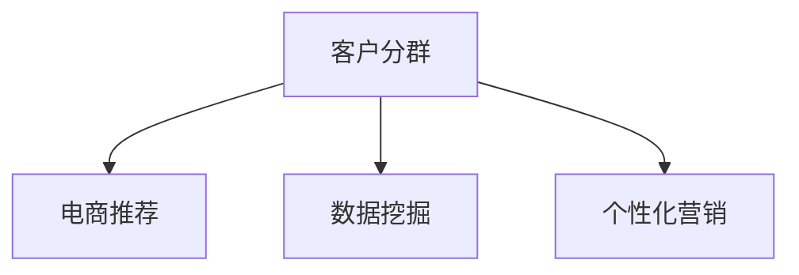

                 

# AI驱动的电商智能客户分群策略

> 关键词：人工智能,客户分群,电商推荐,数据挖掘,个性化营销

## 1. 背景介绍

### 1.1 问题由来
在电商行业，如何精准地将商品推荐给合适的客户群体，一直是企业关注的焦点。传统的推荐算法往往基于单一维度的用户特征，难以兼顾不同用户的多样需求。而随着数据的不断积累，电商客户的多元化需求逐渐暴露出来。如何基于用户的历史行为和属性，划分出不同的客户群体，实施针对性营销，成为了提高客户满意度和经营效率的重要任务。

### 1.2 问题核心关键点
客户分群的核心在于挖掘用户行为和属性的潜在关联，构建出具有实际业务意义的用户群组。常见的客户分群方法包括K-Means聚类、层次聚类、DBSCAN等基于统计学的分群算法，以及基于机器学习的分类算法。其中，基于机器学习的分类算法能够更灵活地处理多维度的用户特征，构建出更精细化的用户群体，为个性化推荐提供了有力支持。

### 1.3 问题研究意义
基于机器学习的客户分群策略，能够实现更加精准的用户画像和细分市场分析，从而实现更有效的营销策略和资源配置。这些方法在电商平台中的应用，可以显著提升客户购买转化率和用户满意度，为电商企业带来更高的商业价值。同时，这些方法也为其他行业提供了借鉴，促进了客户分群技术在各领域的广泛应用。

## 2. 核心概念与联系

### 2.1 核心概念概述

为更好地理解基于机器学习的电商客户分群方法，本节将介绍几个密切相关的核心概念：

- 客户分群(Customer Segmentation)：指将客户按照特定属性或行为特征划分为不同的群体，以便实施针对性营销。
- 电商推荐系统(e-Commerce Recommendation System)：利用用户行为数据，推荐客户可能感兴趣的商品，以提升客户购买意愿和平台销量。
- 数据挖掘(Data Mining)：从大量数据中提取有用的信息和模式，以支持决策和优化策略。
- 个性化营销(Personalized Marketing)：根据不同客户的需求和偏好，实施个性化定制的营销方案，以提高客户满意度和营销效果。

这些概念之间的逻辑关系可以通过以下Mermaid流程图来展示：



这个流程图展示出客户分群在电商推荐和个性化营销中的核心作用，以及其与数据挖掘技术之间的密切联系。

## 3. 核心算法原理 & 具体操作步骤
### 3.1 算法原理概述

基于机器学习的电商客户分群方法，核心思想是通过对用户历史行为和属性数据的建模，发现不同客户群体之间的相似性和差异性，从而构建出具有实际业务意义的用户分群。其核心算法包括聚类算法和分类算法。

聚类算法如K-Means、层次聚类、DBSCAN等，能够在用户数据中寻找自然存在的群体结构，以无监督的方式将用户划分到不同的群体中。而分类算法如决策树、随机森林、神经网络等，则能够根据已知的目标标签（如购买与否），对用户进行有监督的分类，从而构建出更加精准的用户群体。

### 3.2 算法步骤详解

电商客户分群的主要步骤如下：

**Step 1: 数据预处理**
- 收集电商客户的历史行为数据和属性数据，如购买记录、浏览历史、人口统计信息等。
- 对数据进行清洗和归一化，去除异常值和缺失值，将连续型特征进行离散化处理。
- 将数据划分为训练集和测试集，以供模型训练和评估。

**Step 2: 特征工程**
- 选取对客户行为和属性有较强解释能力的特征，构建特征向量。
- 进行特征选择和降维，去除冗余和噪声特征，以提高模型的泛化能力。
- 引入交叉特征和组合特征，如购买类别与浏览时长等，增强特征表达能力。

**Step 3: 模型选择与训练**
- 根据数据特性和业务需求，选择合适的聚类或分类模型。
- 在训练集上对模型进行训练，调整模型超参数，如树深度、学习率、正则化强度等。
- 通过交叉验证评估模型性能，选择最优模型进行保存。

**Step 4: 客户分群与评估**
- 将模型应用于测试集数据，对客户进行分群。
- 通过计算群内和群间的指标（如熵、一致性指标）评估分群效果。
- 对每个分群进行特征分析，以揭示群体的共同特征。

**Step 5: 应用与优化**
- 将分群结果应用于电商推荐系统，生成个性化的商品推荐。
- 实时监测分群结果的效果，根据反馈调整模型参数和特征选择策略。
- 定期重新训练模型，以应对数据分布的变化。

### 3.3 算法优缺点

基于机器学习的电商客户分群方法具有以下优点：
1. 适应性强。能够处理多维度的用户特征，构建出精细化的用户群体，满足不同客户的需求。
2. 灵活可调。模型参数和特征工程策略可灵活调整，以适应不同的业务场景。
3. 效果显著。在电商推荐和个性化营销中，能够显著提升转化率和用户满意度。
4. 可解释性强。通过分析模型输出，能够清晰理解不同用户群体的特征和差异。

同时，该方法也存在一定的局限性：
1. 数据依赖度高。分群效果依赖于数据的质量和完整性，数据缺失或噪声较大时，模型效果会受到影响。
2. 复杂度高。模型需要处理高维数据，对计算资源和存储空间要求较高。
3. 过拟合风险。在高维数据和噪声较多的情况下，模型容易过拟合，泛化能力下降。
4. 隐秘特征发现难度大。模型难以发现数据中隐含的潜在特征，需要结合领域知识进行深入挖掘。

尽管存在这些局限性，但就目前而言，基于机器学习的客户分群方法仍是电商推荐和个性化营销中的主流范式。未来相关研究的重点在于如何进一步降低数据依赖，提高模型的可解释性和泛化能力，同时兼顾计算效率和模型复杂度等因素。

### 3.4 算法应用领域

基于机器学习的电商客户分群策略，已经在多个电商平台上得到广泛应用，取得了显著的效果。这些方法在商品推荐、个性化定价、精准营销等方面，帮助电商平台提升了经营效率和客户满意度。

具体应用场景包括：

- 用户兴趣模型：利用聚类算法发现具有相似兴趣的用户群体，推荐相关商品。
- 行为预测模型：通过分类算法预测用户未来的购买行为，实施个性化推荐。
- 广告定向模型：分析用户群体的特征和需求，实施精准广告定向。
- 用户流失预测模型：构建用户流失模型，提前发现潜在流失用户，实施挽留策略。

除了电商领域，这些方法也适用于金融、社交、旅游等其他行业，帮助企业实现更精细化的客户管理和精准营销。

## 4. 数学模型和公式 & 详细讲解 & 举例说明

### 4.1 数学模型构建

电商客户分群的数学模型主要包括聚类模型和分类模型。这里以K-Means聚类模型为例，介绍其数学构建和计算流程。

假设电商客户的特征向量为 $x = (x_1, x_2, ..., x_n)$，其中 $x_i$ 表示客户在维度 $i$ 上的特征值。设聚类数量为 $k$，则K-Means算法的主要步骤如下：

1. 随机初始化 $k$ 个聚类中心 $\mu_1, \mu_2, ..., \mu_k$。
2. 将每个客户特征向量 $x$ 分配到距离最近的聚类中心，计算每个客户与所属聚类中心的距离 $d(x, \mu_i)$。
3. 对每个聚类，计算其内客户的平均值 $\overline{x_i}$，并将 $\overline{x_i}$ 作为新的聚类中心。
4. 重复步骤2和3，直至聚类中心不再改变或达到预设轮数。

### 4.2 公式推导过程

K-Means算法的数学推导涉及以下步骤：

1. 计算客户与聚类中心的距离：
$$
d(x, \mu_i) = \sqrt{\sum_{j=1}^n (x_j - \mu_{i,j})^2}
$$

2. 分配客户到最近聚类中心：
$$
\arg\min_{\mu} d(x, \mu)
$$

3. 更新聚类中心：
$$
\mu_i = \frac{1}{|C_i|} \sum_{x \in C_i} x
$$

其中 $C_i$ 表示聚类 $i$ 中的所有客户特征向量集合。

### 4.3 案例分析与讲解

以用户行为数据分析为例，假设有100个用户，其购买次数和消费金额分别为：

| 用户ID | 购买次数 | 消费金额(元) |
| ------ | -------- | ----------- |
| 1      | 3        | 500         |
| 2      | 5        | 1000        |
| ...    | ...      | ...         |
| 100    | 1        | 200         |

使用K-Means算法对这组数据进行聚类分析，可以发现两个主要客户群体：

- 客户群体A：购买次数较多，消费金额较大，可能为高价值客户。
- 客户群体B：购买次数较少，消费金额较小，可能为低价值客户。

根据聚类结果，可以对不同群体实施差异化的营销策略，如对高价值客户实施个性化推荐，对低价值客户进行流失预警。

## 5. 项目实践：代码实例和详细解释说明
### 5.1 开发环境搭建

在进行客户分群实践前，我们需要准备好开发环境。以下是使用Python进行Scikit-learn开发的环境配置流程：

1. 安装Anaconda：从官网下载并安装Anaconda，用于创建独立的Python环境。

2. 创建并激活虚拟环境：
```bash
conda create -n sklearn-env python=3.8 
conda activate sklearn-env
```

3. 安装Scikit-learn：
```bash
pip install scikit-learn
```

4. 安装各类工具包：
```bash
pip install numpy pandas matplotlib seaborn jupyter notebook ipython
```

完成上述步骤后，即可在`sklearn-env`环境中开始客户分群实践。

### 5.2 源代码详细实现

这里我们以K-Means聚类为例，给出Scikit-learn库对电商客户数据进行聚类分析的Python代码实现。

```python
from sklearn.cluster import KMeans
from sklearn.preprocessing import StandardScaler
import pandas as pd

# 读取数据
data = pd.read_csv('customer_data.csv')

# 数据预处理
scaler = StandardScaler()
data_scaled = scaler.fit_transform(data[['purchase_count', 'consumption_amount']])

# 聚类分析
kmeans = KMeans(n_clusters=2)
kmeans.fit(data_scaled)

# 可视化结果
import matplotlib.pyplot as plt
plt.scatter(data_scaled[:, 0], data_scaled[:, 1], c=kmeans.labels_, cmap='viridis')
plt.title('Customer Clustering')
plt.show()
```

以上代码实现了对电商客户数据的K-Means聚类分析，并通过可视化展示了聚类结果。可以看到，不同聚类中心代表了不同的客户群体，客户可以根据购买次数和消费金额被划分为两个主要群体。

### 5.3 代码解读与分析

让我们再详细解读一下关键代码的实现细节：

**数据预处理**：
- 使用`pandas`库读取电商客户数据，提取购买次数和消费金额两列作为聚类特征。
- 使用`StandardScaler`对数据进行标准化处理，去除数据的均值和方差，使得数据具有较好的聚类性能。

**模型训练**：
- 创建`KMeans`聚类模型，设置聚类数量为2。
- 调用`fit`方法，对标准化后的数据进行聚类分析，计算每个客户的聚类标签。

**可视化结果**：
- 使用`matplotlib`库绘制聚类散点图，展示每个客户在聚类空间中的位置和所属聚类标签。

可以看出，通过K-Means聚类算法，我们能够将电商客户划分为不同的群体，并根据其行为特征实施差异化的营销策略。

## 6. 实际应用场景

### 6.1 智能推荐系统

基于客户分群的智能推荐系统，可以显著提升推荐的准确性和个性化程度。通过对用户行为数据进行聚类分析，发现具有相似兴趣的客户群体，为他们推荐相关商品，以提升点击率和购买转化率。

在技术实现上，可以将聚类结果作为用户兴趣标签，输入到推荐模型中进行二次训练，生成个性化的推荐结果。同时，利用A/B测试等方法，不断优化推荐算法，提升用户满意度。

### 6.2 精准营销活动

客户分群不仅用于推荐系统，还可以应用于精准营销活动中。通过分析不同客户群体的特征和需求，实施有针对性的营销策略，以提升营销效果和ROI。

例如，对于高价值客户群体，可以实施高端定制化推荐，如VIP会员权益、专属折扣等。而对于低价值客户，可以提供更具性价比的商品推荐，激发其购买意愿。通过分群营销，电商企业可以实现更精细化的资源配置，提高营销活动的投资回报率。

### 6.3 用户流失预警

客户分群在用户流失预警中也有重要应用。通过对客户的历史行为数据进行聚类分析，发现存在流失风险的客户群体，实施流失预警和挽留策略，以减少用户流失率。

例如，对于购买次数较少且消费金额降低的客户，可以实施流失预警，提供专属优惠活动，激发其再次购买。对于长期未购买的客户，可以定期推送营销信息，维持客户关系。通过聚类分析，电商企业可以及时发现和应对客户流失问题，提升用户留存率。

### 6.4 未来应用展望

随着电商行业的不断发展，基于客户分群策略的应用场景将更加广泛。未来，客户分群技术将在智能推荐、精准营销、用户流失预警等多个环节发挥重要作用，为电商企业带来更高的商业价值。

在智能推荐方面，客户分群将与深度学习、强化学习等技术相结合，实现更加精准和个性化的推荐。在精准营销中，客户分群将结合情感分析、行为预测等技术，实现更精确的用户画像和需求分析，实施更加针对性的营销策略。在用户流失预警中，客户分群将结合机器学习、时间序列分析等技术，实时监测客户行为变化，及时发现并应对流失风险。

## 7. 工具和资源推荐
### 7.1 学习资源推荐

为了帮助开发者系统掌握电商客户分群技术，这里推荐一些优质的学习资源：

1. 《Python数据科学手册》系列博文：由数据科学家撰写，涵盖数据处理、特征工程、模型训练等电商客户分群核心内容。

2. 《数据挖掘与统计学习》课程：由斯坦福大学开设的在线课程，系统介绍了数据挖掘的基本概念和常用算法。

3. 《深度学习与机器学习》书籍：介绍深度学习和机器学习的基本原理和经典算法，涵盖聚类、分类、推荐系统等多个电商客户分群相关领域。

4. Kaggle平台：提供大量数据集和Kaggle竞赛，帮助开发者实践电商客户分群技术，提升实战能力。

5. GitHub开源项目：展示电商客户分群算法和模型，提供丰富的代码样例和解释说明，是学习参考的优质资源。

通过对这些资源的学习实践，相信你一定能够快速掌握电商客户分群的核心方法，并用于解决实际的业务问题。

### 7.2 开发工具推荐

高效的开发离不开优秀的工具支持。以下是几款用于电商客户分群开发的常用工具：

1. Jupyter Notebook：免费且功能强大的编程环境，支持Python代码的交互式编写和可视化展示。

2. Scikit-learn：基于Python的开源机器学习库，提供了丰富的聚类和分类算法，适用于电商客户分群任务。

3. TensorFlow：由Google主导开发的开源深度学习框架，支持复杂的模型结构和大规模数据处理。

4. PyTorch：基于Python的开源深度学习框架，灵活高效的计算图，适用于电商客户分群任务的深度学习模型。

5. Weights & Biases：模型训练的实验跟踪工具，可以记录和可视化模型训练过程中的各项指标，方便对比和调优。

6. Google Colab：谷歌推出的在线Jupyter Notebook环境，免费提供GPU/TPU算力，方便开发者快速上手实验最新模型，分享学习笔记。

合理利用这些工具，可以显著提升电商客户分群任务的开发效率，加快创新迭代的步伐。

### 7.3 相关论文推荐

电商客户分群技术的发展源于学界的持续研究。以下是几篇奠基性的相关论文，推荐阅读：

1. K-Means：Clustering Algorithm for Large Datasets with Space Efficiency and Scalability
2. DBSCAN: Density-Based Clustering of Points in a Spatial Database
3. Decision Trees for Multi-Class Problems and Handling Missing Values
4. Random Forests: Towards Optimal Learning Using Multiple Decision Trees
5. Learning to Recommend
6. Recommender Systems: An Introduction

这些论文代表了电商客户分群技术的发展脉络。通过学习这些前沿成果，可以帮助研究者把握学科前进方向，激发更多的创新灵感。

## 8. 总结：未来发展趋势与挑战
### 8.1 总结

本文对基于机器学习的电商客户分群方法进行了全面系统的介绍。首先阐述了客户分群在电商推荐和个性化营销中的重要性，明确了聚类和分类算法的核心作用。其次，从原理到实践，详细讲解了聚类算法的数学模型和计算流程，给出了电商客户分群任务的完整代码实现。同时，本文还广泛探讨了客户分群方法在智能推荐、精准营销、用户流失预警等多个行业领域的应用前景，展示了客户分群范式的巨大潜力。

通过本文的系统梳理，可以看到，基于机器学习的客户分群方法正在成为电商推荐和个性化营销中的重要工具，极大地提升了客户满意度与营销效果，为电商企业带来了显著的商业价值。未来，伴随数据挖掘和机器学习技术的不断发展，客户分群技术将进一步优化和扩展，在更多行业得到应用。

### 8.2 未来发展趋势

展望未来，客户分群技术将呈现以下几个发展趋势：

1. 自动化程度提升。通过自动化特征工程和模型训练，减少人工干预，提高分群算法的可操作性和可扩展性。

2. 模型融合与集成。通过融合不同分群算法的优势，构建出更加稳健和高效的分群模型。

3. 数据多源融合。将多源数据（如社交媒体、用户评论等）融合到客户分群中，提高分群模型的多维度解释能力。

4. 实时分群与动态更新。利用流式数据处理和增量学习技术，实现实时客户分群和动态更新，满足电商业务的实时性要求。

5. 跨领域应用拓展。将客户分群技术应用于更多行业，如金融、医疗、旅游等，拓展其应用范围，提升各行业的运营效率和服务质量。

6. 可解释性与透明性增强。提高分群算法的可解释性和透明性，增强模型的可信度和用户信任度。

这些趋势凸显了客户分群技术的广阔前景。这些方向的探索发展，必将进一步提升客户分群技术的性能和应用范围，为电商企业和其他行业带来更高的商业价值。

### 8.3 面临的挑战

尽管客户分群技术已经取得了显著成果，但在迈向更加智能化、普适化应用的过程中，仍面临诸多挑战：

1. 数据质量与完整性。客户分群效果依赖于高质量的数据，数据缺失或噪声较大时，模型效果会受到影响。如何保证数据的质量和完整性，将是一大难题。

2. 模型复杂度与计算资源。客户分群涉及高维数据和复杂算法，对计算资源和存储空间要求较高。如何降低模型复杂度，提升计算效率，是优化客户分群算法的关键。

3. 多维数据融合与处理。客户分群需要将多源数据进行融合，如何在保证数据一致性的同时，提取有效特征，进行高效处理，仍是一大技术难点。

4. 分群算法的鲁棒性与泛化能力。客户分群模型容易过拟合，泛化能力下降。如何在保证模型鲁棒性的同时，提升泛化能力，需要更多理论和实践的积累。

5. 隐私与安全问题。客户分群涉及用户隐私数据，如何保护用户数据安全，避免数据泄露，将是重要的研究课题。

6. 算法公平性与偏见问题。客户分群模型可能存在偏见，导致某些群体被不公平对待。如何保证算法的公平性与公正性，避免歧视性输出，仍需进一步探索。

这些挑战凸显了客户分群技术在实际应用中的复杂性和多样性，需要通过不断的研究和优化，才能实现更高效、更公平、更安全的客户分群方案。

### 8.4 研究展望

面对客户分群技术所面临的挑战，未来的研究需要在以下几个方面寻求新的突破：

1. 自动化特征工程。通过自动化特征选择和降维，提高特征工程效率和效果，减少人工干预。

2. 分布式计算优化。利用分布式计算和GPU加速技术，提高模型训练和分群速度，降低计算成本。

3. 多源数据融合与协同学习。将多源数据进行协同学习，提高分群模型的泛化能力和多维度解释能力。

4. 实时数据处理与增量学习。利用实时数据处理和增量学习技术，实现客户分群的动态更新和实时化处理。

5. 可解释性与透明性增强。通过解释性模型和可视化工具，增强客户分群算法的可解释性和透明性，提升用户信任度。

6. 隐私保护与数据安全。利用数据脱敏和加密技术，保护客户隐私数据，确保数据安全。

这些研究方向的发展，必将进一步提升客户分群技术的性能和应用范围，为电商企业和其他行业带来更高的商业价值。

## 9. 附录：常见问题与解答

**Q1：客户分群是否适用于所有电商业务场景？**

A: 客户分群适用于绝大多数电商业务场景，特别是对于个性化推荐、精准营销等业务，效果显著。但对于某些特殊场景，如优惠券投放、广告定向等，还需要结合业务规则进行定制化调整。

**Q2：客户分群时需要考虑哪些因素？**

A: 客户分群时需要考虑以下因素：
1. 数据质量：数据缺失、噪声、异常值等都会影响分群效果。
2. 业务需求：根据业务需求选择合适的聚类和分类算法。
3. 特征工程：选择和处理有业务解释能力的特征，构建特征向量。
4. 模型参数：调整模型超参数，如聚类数、特征缩放等。
5. 模型评估：选择合适的评估指标，如熵、一致性指标等。

**Q3：客户分群后如何实施个性化营销？**

A: 客户分群后，可以通过以下方式实施个性化营销：
1. 针对不同分群，设计差异化的营销策略，如个性化推荐、专属折扣等。
2. 实时监测分群效果，根据反馈调整策略，提升营销效果。
3. 利用客户画像，实施精准广告定向，提高广告投放效果。

**Q4：客户分群过程中如何进行特征选择和降维？**

A: 特征选择和降维可以通过以下方法进行：
1. 相关性分析：选择与目标变量高度相关的特征，去除冗余特征。
2. 主成分分析(PCA)：将高维特征压缩到低维空间，保留重要信息。
3. 随机森林特征选择：利用随机森林模型，选择最相关的特征。
4. 特征组合与交叉特征：将不同特征进行组合，构建新的特征，提高模型的表达能力。

**Q5：客户分群技术在电商推荐系统中的应用效果如何？**

A: 客户分群在电商推荐系统中能够显著提升推荐的准确性和个性化程度。通过聚类分析，发现具有相似兴趣的客户群体，为他们推荐相关商品，以提升点击率和购买转化率。

例如，某电商平台通过客户分群技术，将用户分为高价值客户和低价值客户两个群体。对高价值客户实施个性化推荐，提升用户粘性和购买频率。而对低价值客户，实施流失预警和挽留策略，防止客户流失。通过客户分群技术，该电商平台在推荐系统上取得了显著的效果提升，提高了客户满意度和平台销量。

---

作者：禅与计算机程序设计艺术 / Zen and the Art of Computer Programming

