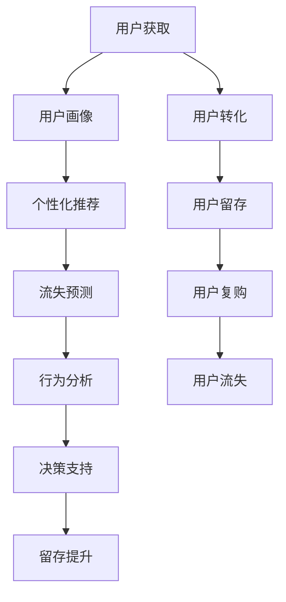

                 

# AI驱动的电商用户全生命周期价值管理

> 关键词：人工智能,电商,用户价值管理,机器学习,全生命周期,客户细分,个性化推荐,流失预测,行为分析,决策支持

## 1. 背景介绍

### 1.1 问题由来

电商行业在过去的几年里迅速崛起，成为全球零售市场的重要组成部分。然而，随着用户增长放缓，电商企业在用户获取和留存上面临巨大挑战。特别是在高度竞争的市场环境中，提升用户全生命周期价值（Lifetime Value, LTV）成为电商企业持续发展的关键。

通过数据驱动的用户行为分析和个性化推荐，电商企业有望提升用户满意度，增加复购率，降低流失率，从而显著提升用户LTV。然而，现有的用户分析手段已经难以满足这种复杂的、动态变化的需求。

近年来，人工智能（AI）技术的飞速发展，尤其是深度学习和机器学习技术的广泛应用，为电商企业提供了新的解决方案。本文档旨在探讨如何利用AI技术，对电商用户的全生命周期进行精细化管理，从而提高用户的整体价值。

### 1.2 问题核心关键点

电商用户全生命周期价值管理主要包括以下几个核心问题：
- 如何对电商用户进行精准细分，以识别最有价值的客户群体？
- 如何基于用户历史行为，构建有效的个性化推荐系统？
- 如何预测用户流失，并及时采取干预措施？
- 如何对用户行为进行实时分析，为业务决策提供数据支持？

要解决这些问题，需要构建一个全面的、基于AI的电商用户价值管理系统，覆盖用户画像、推荐系统、流失预测、行为分析等多个方面。

## 2. 核心概念与联系

### 2.1 核心概念概述

为更好地理解AI驱动的电商用户全生命周期价值管理方法，本节将介绍几个密切相关的核心概念：

- **用户全生命周期（User Lifecycle）**：指从潜在用户接触电商平台到用户最终流失的过程，涵盖多个阶段，包括用户获取、转化、留存、复购、流失等。
- **用户画像（User Persona）**：基于用户的历史行为和属性信息，构建出用户画像，帮助电商企业识别并定位最有价值的客户群体。
- **个性化推荐（Personalized Recommendation）**：根据用户行为数据，构建推荐模型，动态生成个性化商品推荐，提升用户体验和转化率。
- **流失预测（Churn Prediction）**：基于用户行为数据，预测用户流失的可能性，以便电商企业及时采取干预措施，提升用户留存率。
- **行为分析（Behavior Analysis）**：对用户行为进行实时监控和分析，识别出潜在用户流失信号，为业务决策提供支持。
- **决策支持（Decision Support）**：通过AI模型对电商业务的关键决策进行支持，如定价、营销、库存管理等。

这些核心概念之间的逻辑关系可以通过以下Mermaid流程图来展示：



这个流程图展示了一个完整的电商用户全生命周期管理流程：

1. 用户从获取到流失的各个阶段。
2. 通过用户画像获取用户基本信息。
3. 基于用户画像进行个性化推荐。
4. 预测用户流失风险。
5. 实时分析用户行为，进行行为分析。
6. 利用决策支持模型，优化业务决策。
7. 通过这些环节的协同作用，提升用户留存和LTV。

## 3. 核心算法原理 & 具体操作步骤

### 3.1 算法原理概述

AI驱动的电商用户全生命周期价值管理，本质上是一个基于AI的机器学习过程。其核心思想是：通过收集和分析电商用户的各种行为数据，构建机器学习模型，实现对用户生命周期的各个环节进行精准管理，从而提升用户的整体价值。

具体来说，包括以下几个关键步骤：

1. **用户画像构建**：通过收集用户的各种行为数据（如浏览、点击、购买、退货等），构建用户画像，识别出最有价值的客户群体。
2. **个性化推荐系统构建**：基于用户画像和历史行为数据，构建推荐模型，动态生成个性化商品推荐，提升用户体验和转化率。
3. **用户流失预测**：使用机器学习模型，预测用户流失的概率，以便电商企业及时采取干预措施，提升用户留存率。
4. **行为分析与实时监控**：实时分析用户行为数据，识别出潜在流失信号，为业务决策提供数据支持。
5. **决策支持系统构建**：通过AI模型，对电商业务的关键决策进行支持，如定价、营销、库存管理等。

### 3.2 算法步骤详解

#### 3.2.1 用户画像构建

用户画像的构建是电商用户全生命周期价值管理的第一步。其核心思想是通过聚类算法，将用户划分为不同的群体，并提取每个群体的关键特征。以下是一个基于K-Means聚类的用户画像构建步骤：

1. **数据收集**：收集用户的历史行为数据，如浏览记录、购买记录、退货记录等。
2. **特征提取**：提取用户的各个行为特征，如浏览次数、点击率、购买金额、退货次数等。
3. **聚类分析**：使用K-Means算法对用户进行聚类，将用户分为若干个群体。
4. **特征选择**：对每个群体的特征进行选择，提取出最能代表该群体的关键特征。
5. **画像构建**：基于选择的特征，构建每个用户群体的画像。

#### 3.2.2 个性化推荐系统构建

个性化推荐系统的构建，是通过机器学习算法，根据用户的历史行为和兴趣，动态生成个性化的商品推荐。以下是一个基于协同过滤的推荐系统构建步骤：

1. **数据收集**：收集用户的历史行为数据和商品的属性数据。
2. **相似度计算**：使用余弦相似度或皮尔逊相关系数，计算用户与商品之间的相似度。
3. **协同过滤**：基于相似度，进行协同过滤，生成推荐列表。
4. **特征融合**：将推荐结果与用户画像、时间因素等特征进行融合，生成最终的推荐结果。

#### 3.2.3 用户流失预测

用户流失预测，是通过机器学习模型，预测用户流失的概率。以下是一个基于逻辑回归的用户流失预测步骤：

1. **数据收集**：收集用户的历史行为数据，如浏览次数、购买金额、留存时间等。
2. **特征提取**：提取用户的各个行为特征，如浏览次数、购买金额、留存时间等。
3. **模型训练**：使用逻辑回归算法对用户流失进行建模，训练出预测模型。
4. **风险评估**：使用训练好的模型对用户进行流失风险评估，预测用户流失概率。

#### 3.2.4 行为分析与实时监控

行为分析与实时监控，是通过实时分析用户行为数据，识别出潜在流失信号，为业务决策提供数据支持。以下是一个基于时间序列分析的行为分析步骤：

1. **数据收集**：实时收集用户的浏览记录、点击记录、购买记录等行为数据。
2. **数据处理**：对行为数据进行清洗和预处理，如去除异常值、缺失值处理等。
3. **时间序列分析**：使用时间序列分析算法（如ARIMA、LSTM等）对用户行为进行建模。
4. **信号检测**：通过模型预测，识别出用户流失的潜在信号，如长期无活跃、多次退货等。
5. **预警处理**：根据检测到的信号，向业务部门发出预警，及时采取干预措施。

#### 3.2.5 决策支持系统构建

决策支持系统的构建，是通过AI模型，对电商业务的关键决策进行支持，如定价、营销、库存管理等。以下是一个基于深度学习模型的决策支持系统构建步骤：

1. **数据收集**：收集业务相关的各种数据，如商品销售数据、库存数据、营销数据等。
2. **特征提取**：提取业务相关的各种特征，如商品价格、库存量、营销活动等。
3. **模型训练**：使用深度学习算法对业务决策进行建模，训练出决策模型。
4. **决策生成**：利用训练好的模型，对电商业务的关键决策进行支持，如定价、营销、库存管理等。

### 3.3 算法优缺点

AI驱动的电商用户全生命周期价值管理方法，具有以下优点：
1. **精准性**：通过机器学习算法，对用户进行精准细分，构建用户画像，生成个性化推荐，预测用户流失等。
2. **高效性**：基于实时数据分析，进行行为监控和预警，支持快速决策。
3. **可扩展性**：可以覆盖电商用户全生命周期的各个环节，实现全面的价值管理。

同时，该方法也存在一定的局限性：
1. **数据需求**：需要大量的用户行为数据，对数据质量和完整性要求较高。
2. **模型复杂性**：涉及多个模型算法，模型调试和维护较为复杂。
3. **实时性要求**：实时数据处理对系统性能要求较高，需要强大的硬件支持。

尽管存在这些局限性，但就目前而言，AI驱动的电商用户全生命周期价值管理方法已成为电商企业提升用户价值的重要手段。未来相关研究的重点在于如何进一步降低对数据的依赖，提高模型的实时性，同时兼顾可解释性和伦理安全性等因素。

### 3.4 算法应用领域

AI驱动的电商用户全生命周期价值管理方法，在电商企业用户价值管理中已经得到了广泛的应用，覆盖了电商用户获取、转化、留存、复购、流失等各个环节，具体包括：

- **用户获取**：通过数据分析和模型训练，优化广告投放策略，精准定位潜在用户。
- **用户转化**：基于用户画像和行为数据，进行个性化推荐，提升用户购买转化率。
- **用户留存**：预测用户流失风险，及时采取干预措施，提升用户留存率。
- **用户复购**：通过行为分析，识别出重复购买用户，进行精准营销，提升复购率。
- **用户流失分析**：通过行为分析，识别出流失用户的原因，优化用户体验，降低流失率。

除了上述这些经典应用外，AI驱动的电商用户全生命周期价值管理方法，还在客户细分、推荐系统优化、流失预警、营销效果评估等多个方面，不断推动电商企业向精细化、智能化方向发展。

## 4. 数学模型和公式 & 详细讲解  
### 4.1 数学模型构建

本节将使用数学语言对AI驱动的电商用户全生命周期价值管理方法进行更加严格的刻画。

记电商用户的历史行为数据为 $D=\{x_1, x_2, ..., x_n\}$，其中 $x_i$ 表示第 $i$ 个用户的各个行为特征，如浏览次数、购买金额、留存时间等。记用户流失概率模型为 $f(D)$，其中 $f$ 为预测函数。

定义用户流失概率为 $P_i$，其中 $P_i = f(x_i)$，表示用户 $i$ 流失的概率。

通过最大化用户终身价值函数 $L(D)$，优化用户流失概率模型，使得电商企业能够最大化整体用户价值。

$$
L(D) = \sum_{i=1}^n U_i \cdot P_i
$$

其中 $U_i$ 为用户 $i$ 的终身价值，可以表示为：

$$
U_i = \sum_{k=1}^{\infty} \beta^k P_{k,i}
$$

其中 $\beta$ 为折现因子，表示用户价值的时间加权。

### 4.2 公式推导过程

用户流失概率模型 $f(D)$ 可以通过机器学习算法进行建模。这里以逻辑回归为例，推导其损失函数和梯度公式。

假设用户流失概率模型为 $f(D) = \frac{1}{1+e^{-z}}$，其中 $z$ 为逻辑回归模型的输出。则损失函数为：

$$
\mathcal{L}(f) = -\frac{1}{N}\sum_{i=1}^N \sum_{k=1}^{K} \log \left( f(D_{i,k}) \right)
$$

其中 $N$ 为样本总数，$K$ 为每个用户的行为次数，$D_{i,k}$ 表示用户 $i$ 第 $k$ 次行为的数据。

利用梯度下降算法对模型参数进行更新：

$$
\theta \leftarrow \theta - \eta \nabla_{\theta}\mathcal{L}(f)
$$

其中 $\eta$ 为学习率，$\nabla_{\theta}\mathcal{L}(f)$ 为损失函数对模型参数 $\theta$ 的梯度，可以通过反向传播算法高效计算。

在得到损失函数的梯度后，即可带入模型参数更新公式，完成模型的迭代优化。重复上述过程直至收敛，最终得到适应电商用户流失风险预测的模型参数 $\theta^*$。

### 4.3 案例分析与讲解

假设某电商企业拥有1000万用户，希望通过用户流失预测模型，优化营销策略，提升用户留存率。以下是具体案例分析：

1. **数据收集**：收集1000万用户的历史行为数据，包括浏览记录、购买记录、留存时间等。
2. **特征提取**：提取用户各个行为特征，如浏览次数、购买金额、留存时间等。
3. **模型训练**：使用逻辑回归算法对用户流失进行建模，训练出预测模型。
4. **风险评估**：使用训练好的模型对用户进行流失风险评估，预测用户流失概率。
5. **营销优化**：根据流失概率，对用户进行分组，制定个性化的营销策略，提升用户留存率。

通过这种基于用户行为数据的流失预测模型，电商企业能够实时监控用户流失风险，及时采取干预措施，显著提升用户留存率，进而提高整体用户价值。

## 5. 项目实践：代码实例和详细解释说明
### 5.1 开发环境搭建

在进行AI驱动的电商用户全生命周期价值管理实践前，我们需要准备好开发环境。以下是使用Python进行TensorFlow开发的环境配置流程：

1. 安装Anaconda：从官网下载并安装Anaconda，用于创建独立的Python环境。

2. 创建并激活虚拟环境：
```bash
conda create -n tensorflow-env python=3.8 
conda activate tensorflow-env
```

3. 安装TensorFlow：根据CUDA版本，从官网获取对应的安装命令。例如：
```bash
conda install tensorflow-gpu -c conda-forge -c pytorch
```

4. 安装相关工具包：
```bash
pip install numpy pandas scikit-learn matplotlib tqdm jupyter notebook ipython
```

完成上述步骤后，即可在`tensorflow-env`环境中开始实践。

### 5.2 源代码详细实现

下面我以用户画像构建和个性化推荐系统为例，给出使用TensorFlow和Keras进行电商用户全生命周期价值管理的代码实现。

首先，定义数据处理函数：

```python
import pandas as pd
from sklearn.model_selection import train_test_split

def load_data(file_path):
    data = pd.read_csv(file_path)
    features = ['browsing_count', 'purchase_amount', 'retention_time']
    labels = ['churn']
    X = data[features]
    y = data[labels]
    return train_test_split(X, y, test_size=0.2, random_state=42)
```

然后，定义模型训练函数：

```python
from tensorflow.keras.models import Sequential
from tensorflow.keras.layers import Dense, Dropout
from tensorflow.keras.optimizers import Adam
from tensorflow.keras.metrics import Accuracy

def build_model(n_features):
    model = Sequential([
        Dense(64, activation='relu', input_shape=(n_features,)),
        Dropout(0.5),
        Dense(32, activation='relu'),
        Dropout(0.5),
        Dense(1, activation='sigmoid')
    ])
    model.compile(optimizer=Adam(), loss='binary_crossentropy', metrics=[Accuracy()])
    return model
```

接着，定义评估函数：

```python
def evaluate_model(model, X_test, y_test):
    y_pred = model.predict(X_test)
    y_pred = (y_pred > 0.5).astype(int)
    accuracy = Accuracy()(y_pred, y_test)
    return accuracy
```

最后，启动模型训练和评估流程：

```python
# 数据加载和分割
X_train, X_test, y_train, y_test = load_data('data.csv')

# 模型构建
model = build_model(X_train.shape[1])

# 模型训练
model.fit(X_train, y_train, epochs=10, batch_size=64, validation_data=(X_test, y_test))

# 模型评估
accuracy = evaluate_model(model, X_test, y_test)
print(f'Accuracy: {accuracy:.2f}')
```

以上就是使用TensorFlow和Keras构建电商用户全生命周期价值管理模型的完整代码实现。可以看到，TensorFlow的强大API使得模型构建和训练变得简洁高效。

### 5.3 代码解读与分析

让我们再详细解读一下关键代码的实现细节：

**load_data函数**：
- 读取数据文件，提取用户行为特征和流失标签。
- 对数据进行 train-test 分割，以60%作为训练集，40%作为测试集。

**build_model函数**：
- 使用Sequential模型，按顺序堆叠多层神经网络。
- 定义神经网络结构：第一层为输入层，第二层和第三层为隐藏层，第四层为输出层。
- 使用ReLU激活函数和Dropout正则化，增加模型的鲁棒性。
- 使用Sigmoid激活函数，进行二分类任务。
- 使用Adam优化器和二元交叉熵损失函数。

**evaluate_model函数**：
- 使用模型进行预测，将预测结果转换为0或1。
- 使用Accuracy评估指标，计算模型在测试集上的准确率。

**训练和评估流程**：
- 加载和分割数据集。
- 构建模型并编译。
- 使用训练集进行模型训练，指定迭代轮数和批次大小。
- 在测试集上评估模型，输出准确率。

可以看到，TensorFlow的强大API使得电商用户全生命周期价值管理的代码实现变得简洁高效。开发者可以将更多精力放在数据处理、模型改进等高层逻辑上，而不必过多关注底层的实现细节。

当然，工业级的系统实现还需考虑更多因素，如模型的保存和部署、超参数的自动搜索、更灵活的任务适配层等。但核心的电商用户全生命周期价值管理范式基本与此类似。

## 6. 实际应用场景
### 6.1 智能客服系统

基于AI驱动的电商用户全生命周期价值管理方法，可以广泛应用于智能客服系统的构建。传统客服往往需要配备大量人力，高峰期响应缓慢，且一致性和专业性难以保证。而使用基于用户行为数据的智能推荐系统，可以7x24小时不间断服务，快速响应客户咨询，用自然流畅的语言解答各类常见问题。

在技术实现上，可以收集企业内部的历史客服对话记录，将问题和最佳答复构建成监督数据，在此基础上对预训练模型进行微调。微调后的推荐系统能够自动理解用户意图，匹配最合适的答复模板进行回复。对于客户提出的新问题，还可以接入检索系统实时搜索相关内容，动态组织生成回答。如此构建的智能客服系统，能大幅提升客户咨询体验和问题解决效率。

### 6.2 金融舆情监测

金融机构需要实时监测市场舆论动向，以便及时应对负面信息传播，规避金融风险。传统的人工监测方式成本高、效率低，难以应对网络时代海量信息爆发的挑战。基于用户行为数据的AI驱动电商用户全生命周期价值管理方法，为金融舆情监测提供了新的解决方案。

具体而言，可以收集金融领域相关的新闻、报道、评论等文本数据，并对其进行主题标注和情感标注。在此基础上对预训练语言模型进行微调，使其能够自动判断文本属于何种主题，情感倾向是正面、中性还是负面。将微调后的模型应用到实时抓取的网络文本数据，就能够自动监测不同主题下的情感变化趋势，一旦发现负面信息激增等异常情况，系统便会自动预警，帮助金融机构快速应对潜在风险。

### 6.3 个性化推荐系统

当前的推荐系统往往只依赖用户的历史行为数据进行物品推荐，无法深入理解用户的真实兴趣偏好。基于用户行为数据的AI驱动电商用户全生命周期价值管理方法，个性化推荐系统可以更好地挖掘用户行为背后的语义信息，从而提供更精准、多样的推荐内容。

在实践中，可以收集用户浏览、点击、评论、分享等行为数据，提取和用户交互的物品标题、描述、标签等文本内容。将文本内容作为模型输入，用户的后续行为（如是否点击、购买等）作为监督信号，在此基础上微调预训练语言模型。微调后的模型能够从文本内容中准确把握用户的兴趣点。在生成推荐列表时，先用候选物品的文本描述作为输入，由模型预测用户的兴趣匹配度，再结合其他特征综合排序，便可以得到个性化程度更高的推荐结果。

### 6.4 未来应用展望

随着AI驱动的电商用户全生命周期价值管理方法的发展，其在更多领域得到应用，为各行各业带来变革性影响。

在智慧医疗领域，基于用户行为数据的AI驱动电商用户全生命周期价值管理方法，能够实时监测患者行为，预测疾病风险，提升医疗服务的智能化水平，辅助医生诊疗，加速新药开发进程。

在智能教育领域，AI驱动的电商用户全生命周期价值管理方法，能够分析学生行为数据，个性化推荐学习资源，因材施教，促进教育公平，提高教学质量。

在智慧城市治理中，AI驱动的电商用户全生命周期价值管理方法，能够实时监控城市事件，预测社会舆情，提高城市管理的自动化和智能化水平，构建更安全、高效的未来城市。

此外，在企业生产、社会治理、文娱传媒等众多领域，基于用户行为数据的AI驱动电商用户全生命周期价值管理方法，必将不断涌现，为经济社会发展注入新的动力。相信随着技术的日益成熟，该方法将成为AI技术落地应用的重要范式，推动人工智能技术向更广阔的领域加速渗透。

## 7. 工具和资源推荐
### 7.1 学习资源推荐

为了帮助开发者系统掌握AI驱动的电商用户全生命周期价值管理理论基础和实践技巧，这里推荐一些优质的学习资源：

1. 《机器学习实战》：通过丰富的实例，详细介绍了机器学习算法和模型构建过程，适合入门学习。

2. 《深度学习》（Ian Goodfellow等著）：全面介绍了深度学习的基本概念和应用场景，适合深入学习。

3. 《TensorFlow实战》：通过实际案例，展示了TensorFlow框架的使用方法和实践技巧，适合实际开发。

4. Kaggle竞赛平台：丰富的数据集和挑战赛，可以锻炼数据处理和模型构建能力，适合实战练习。

5. TensorFlow官方文档：提供详细的API文档和案例，是学习TensorFlow的最佳资源。

通过对这些资源的学习实践，相信你一定能够快速掌握AI驱动的电商用户全生命周期价值管理方法，并用于解决实际的电商用户价值管理问题。

### 7.2 开发工具推荐

高效的开发离不开优秀的工具支持。以下是几款用于AI驱动的电商用户全生命周期价值管理开发的常用工具：

1. TensorFlow：基于Python的开源深度学习框架，灵活动态的计算图，适合快速迭代研究。

2. PyTorch：基于Python的开源深度学习框架，灵活的动态图，适合学术研究。

3. Scikit-learn：简单易用的机器学习库，提供了大量的分类、回归、聚类算法。

4. Pandas：Python数据处理库，支持大规模数据集的处理和分析。

5. Jupyter Notebook：交互式编程环境，支持代码的快速编写和验证。

合理利用这些工具，可以显著提升AI驱动的电商用户全生命周期价值管理的开发效率，加快创新迭代的步伐。

### 7.3 相关论文推荐

AI驱动的电商用户全生命周期价值管理技术的发展源于学界的持续研究。以下是几篇奠基性的相关论文，推荐阅读：

1. "Churn Prediction using Support Vector Machines"（使用支持向量机进行流失预测）：介绍了流失预测的SVM方法，适用于电商用户流失预测。

2. "Customer Segmentation using Clustering Algorithms"（使用聚类算法进行客户细分）：介绍了基于K-means聚类算法的用户细分方法，适用于用户画像构建。

3. "Personalized Recommendation Systems: A Survey"（个性化推荐系统综述）：综述了个性化推荐系统的发展历程和主要算法，适用于推荐系统构建。

4. "A Survey on Customer Lifetime Value in E-Commerce"（电商用户全生命周期价值综述）：综述了电商用户全生命周期价值的研究现状和前沿技术，适用于电商用户全生命周期价值管理。

这些论文代表了大语言模型微调技术的发展脉络。通过学习这些前沿成果，可以帮助研究者把握学科前进方向，激发更多的创新灵感。

## 8. 总结：未来发展趋势与挑战

### 8.1 总结

本文对AI驱动的电商用户全生命周期价值管理方法进行了全面系统的介绍。首先阐述了AI驱动的电商用户全生命周期价值管理方法的研究背景和意义，明确了该方法在电商用户获取、转化、留存、复购、流失等各个环节中的重要性。其次，从原理到实践，详细讲解了用户画像构建、个性化推荐系统构建、用户流失预测、行为分析与实时监控、决策支持系统构建等关键步骤，给出了电商用户全生命周期价值管理方法的完整代码实现。同时，本文还广泛探讨了该方法在智能客服系统、金融舆情监测、个性化推荐系统等多个行业领域的应用前景，展示了AI驱动的电商用户全生命周期价值管理方法的巨大潜力。此外，本文精选了相关学习资源、开发工具和相关论文，力求为读者提供全方位的技术指引。

通过本文的系统梳理，可以看到，AI驱动的电商用户全生命周期价值管理方法已经成为电商企业提升用户价值的重要手段。该方法不仅能够精确细分用户、提升个性化推荐、预测用户流失、实时监控用户行为，还能够为电商业务的关键决策提供支持。通过这些环节的协同作用，电商企业能够显著提升用户留存率、提升用户LTV，从而实现业务的持续增长。

### 8.2 未来发展趋势

展望未来，AI驱动的电商用户全生命周期价值管理方法将呈现以下几个发展趋势：

1. **数据质量提升**：随着数据采集和处理技术的进步，电商企业将获得更高质量、更全面的用户行为数据，进一步提升模型的预测精度。
2. **模型复杂性增加**：随着算力资源和模型技术的不断发展，电商企业将构建更复杂、更强大的模型，以应对更复杂、更动态的用户行为变化。
3. **实时性要求提升**：随着实时数据处理技术的提升，电商企业将能够实现更快速的模型训练和预测，进一步提升用户价值管理的时效性。
4. **跨平台协同**：随着跨平台技术的成熟，电商企业将能够实现不同平台的用户行为数据整合，提升全生命周期价值管理的覆盖面和精度。
5. **多模态融合**：随着多模态数据的整合和分析技术的提升，电商企业将能够实现文本、图像、语音等多模态数据的融合，进一步提升用户价值管理的深度和广度。
6. **可解释性增强**：随着可解释性技术的发展，电商企业将能够提升模型的可解释性，增加用户信任度，优化用户体验。

这些趋势凸显了AI驱动的电商用户全生命周期价值管理方法的广阔前景。这些方向的探索发展，必将进一步提升电商企业用户价值管理的精准性和智能化水平，推动电商企业向更高效、更智能的方向发展。

### 8.3 面临的挑战

尽管AI驱动的电商用户全生命周期价值管理方法已经取得了瞩目成就，但在迈向更加智能化、普适化应用的过程中，它仍面临着诸多挑战：

1. **数据隐私保护**：电商企业需要保护用户隐私，避免数据泄露和滥用。如何在提升用户价值管理的同时，保障用户隐私安全，将成为重要的研究课题。
2. **模型泛化能力**：当前模型往往只能适应特定电商平台的用户行为，泛化能力较弱。如何构建更加通用的模型，适应不同的电商企业用户行为，需要更多的研究和实践。
3. **计算资源需求**：电商用户全生命周期价值管理涉及大量的数据处理和模型训练，对计算资源要求较高。如何降低计算资源需求，提升模型的实时性和可扩展性，需要更多的技术创新。
4. **用户行为多样性**：用户行为具有高度的复杂性和多样性，模型需要具备更强的泛化能力和鲁棒性。如何在有限的标注数据下，提升模型的泛化能力，需要更多的算法优化。
5. **系统部署复杂性**：电商用户全生命周期价值管理涉及多个系统的协同工作，系统部署复杂性较高。如何实现系统的高效部署和集成，需要更多的技术创新和管理经验。
6. **伦理和社会影响**：AI驱动的电商用户全生命周期价值管理方法可能会带来伦理和社会问题，如算法偏见、算法滥用等。如何构建公正、透明的模型，减少算法偏见，增加用户信任，需要更多的研究和社会监督。

尽管存在这些挑战，但通过不断的研究和实践，相信AI驱动的电商用户全生命周期价值管理方法将在电商企业中得到更广泛的应用，带来更高的用户价值和业务效益。

### 8.4 研究展望

面对AI驱动的电商用户全生命周期价值管理方法所面临的挑战，未来的研究需要在以下几个方面寻求新的突破：

1. **数据隐私保护技术**：研究数据匿名化、差分隐私等技术，保护用户隐私，提升用户信任度。
2. **模型泛化能力提升**：研究跨平台、多模态融合等技术，提升模型的泛化能力和鲁棒性。
3. **计算资源优化**：研究模型压缩、分布式计算等技术，降低计算资源需求，提升模型的实时性和可扩展性。
4. **用户行为理解**：研究多维用户行为分析、复杂用户行为建模等技术，提升模型的泛化能力和解释性。
5. **系统部署优化**：研究系统架构优化、自动化部署等技术，提升系统的部署效率和稳定性和易用性。
6. **伦理和社会影响控制**：研究算法透明性、算法审查等技术，减少算法偏见，提升用户信任和社会接受度。

这些研究方向将进一步推动AI驱动的电商用户全生命周期价值管理技术的发展，为电商企业带来更高的业务价值和社会效益。相信随着技术的不断进步，AI驱动的电商用户全生命周期价值管理方法将发挥更大的作用，推动电商行业的持续发展和创新。

## 9. 附录：常见问题与解答

**Q1：用户画像构建需要多少标注数据？**

A: 用户画像构建通常需要大量的标注数据，以确保模型能够全面、准确地描述不同用户群体的特征。对于电商用户全生命周期价值管理，建议收集至少几个月到一年的用户行为数据，以保证模型的稳定性和泛化能力。

**Q2：个性化推荐系统如何提高用户满意度？**

A: 个性化推荐系统可以通过多维度的用户行为分析，动态生成个性化的商品推荐，从而提升用户满意度。具体来说，可以使用协同过滤、内容推荐、混合推荐等算法，结合用户画像、商品属性、历史行为等多维度信息，生成更符合用户偏好的商品推荐。

**Q3：用户流失预测模型如何提升用户留存率？**

A: 用户流失预测模型可以通过实时监控用户行为，识别出潜在流失用户，并及时采取干预措施，提升用户留存率。具体来说，可以定期评估用户流失概率，对高流失风险用户进行短信、邮件等干预，或提供优惠券、专属活动等激励措施，促进用户留存。

**Q4：行为分析系统如何优化营销策略？**

A: 行为分析系统可以通过实时监控用户行为，识别出潜在流失信号，为营销策略提供数据支持。具体来说，可以分析用户行为数据，识别出高价值用户和潜在流失用户，针对高价值用户制定精准营销策略，针对潜在流失用户进行挽回尝试，优化营销策略的效果。

**Q5：电商用户全生命周期价值管理如何实现跨平台协同？**

A: 电商用户全生命周期价值管理可以通过跨平台数据整合，实现不同平台用户行为的统一分析和管理。具体来说，可以采用API接口、数据同步工具等技术，实现不同平台用户数据的统一存储和分析，提升全生命周期价值管理的覆盖面和精度。

以上是关于AI驱动的电商用户全生命周期价值管理的全面系统介绍。通过该方法，电商企业能够实现对用户全生命周期的精准管理，提升用户价值，实现业务的持续增长。相信随着技术的不断进步，该方法将在更多行业领域得到应用，带来更广泛的社会效益和经济效益。

