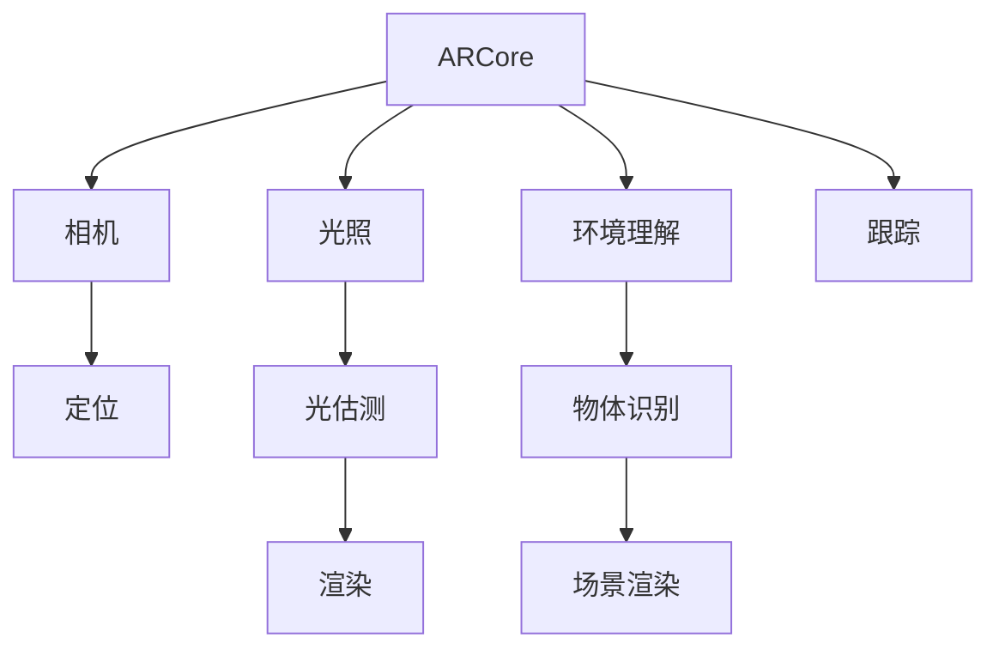

                 

# ARCore 开发工具包教程：在 Android 平台上构建 AR 应用的最佳实践

> 关键词：ARCore, Android, 增强现实, AR 应用开发, 最佳实践, 开发工具包

## 1. 背景介绍

### 1.1 问题由来

随着技术的进步，增强现实（Augmented Reality, AR）技术的应用越来越广泛，从游戏、教育、零售到医疗等多个领域都在利用AR提升用户体验。Android平台的ARCore就是谷歌推出的一项AR开发工具包，旨在帮助开发者快速构建AR应用，使得增强现实技术触手可及。

然而，尽管ARCore提供了丰富的API和工具支持，但一些开发者仍然面临如何高效利用这些工具、避免常见的开发陷阱等问题。本教程旨在为Android平台上的AR应用开发者提供一份详尽的指南，通过解析ARCore的核心概念、展示最佳实践、分享案例分析，帮助开发者更好地掌握ARCore的使用，快速构建高质量的AR应用。

### 1.2 问题核心关键点

ARCore的核心在于将虚拟元素（如3D模型、图像、视频等）与现实世界融合，为用户的交互提供增强现实体验。开发者在构建AR应用时，需要关注以下几个核心关键点：

- 准确定位：ARCore必须能够准确地定位用户设备的位置和方向，确保虚拟元素与现实世界的对齐。
- 动态跟踪：ARCore需要实时追踪用户的移动和交互，保持虚拟元素的稳定性。
- 光估测：ARCore应具备光估测能力，基于环境光照自动调整虚拟元素的视觉效果。
- 环境理解：ARCore应具备环境理解能力，能够识别和处理真实环境中的不同对象。

这些关键点构成了ARCore技术的基础，是构建高质量AR应用的前提。通过掌握这些核心概念，开发者可以构建更加生动、沉浸式的增强现实体验。

## 2. 核心概念与联系

### 2.1 核心概念概述

在深入探讨ARCore的最佳实践之前，我们先简要介绍几个核心概念：

- **ARCore**：谷歌推出的Android平台AR开发工具包，提供了丰富的API和工具，帮助开发者构建AR应用。
- **增强现实（AR）**：通过在现实世界中叠加虚拟信息，增强用户的视觉体验，常见的应用包括游戏、教育、购物等。
- **增强现实引擎**：实现AR效果的底层框架，ARCore就是谷歌提供的增强现实引擎之一。
- **相机**：AR应用的主要输入设备，通过摄像头实时采集现实世界的图像。
- **光照**：环境光照对AR效果有重要影响，ARCore需要具备光估测能力。
- **环境理解**：识别和处理真实环境中的物体和场景，使虚拟元素能够更好地融入现实世界。

这些概念之间的联系可以通过以下Mermaid流程图来展示：



这个流程图展示了ARCore与相机、光照、环境理解等关键组件之间的关系，以及它们在AR应用构建中的作用。

## 3. 核心算法原理 & 具体操作步骤

### 3.1 算法原理概述

ARCore的工作原理可以简单概括为：利用摄像头采集现实世界的图像，通过图像处理和深度学习算法，识别并追踪环境中的物体和场景，然后基于用户设备的定位和光估测信息，将虚拟元素叠加在现实世界的图像上，最后进行场景渲染和交互处理。

ARCore的核心算法包括以下几个部分：

1. **图像处理**：对摄像头采集的图像进行去噪、颜色校正等预处理操作。
2. **物体识别和跟踪**：使用深度学习模型识别环境中的物体，并实时追踪其运动。
3. **定位和光估测**：结合GPS、IMU和摄像头信息，进行设备定位和环境光照估计。
4. **场景渲染**：将虚拟元素渲染到现实世界图像上，并处理交互事件。

### 3.2 算法步骤详解

下面详细介绍ARCore的算法步骤和具体操作步骤：

**Step 1: 设置ARCore环境**

```java
// 在应用中初始化ARCore
ARCoreApi.create(new JavaFunctor<>(
    api -> {
        api.addApi(TrackableNodeActivityGroupApi::class), // 物体识别和跟踪
        api.addApi(AnglePoolApi::class); // 光照和环境理解
    },
    new Configuration.Builder()
        .setTargetCamera(TrackableNodeActivityGroupApi.FRONT_CAMERA)
        .setWorldLightingMode(WorldLightingMode.AUTO)
        .setWorldLightingMode(WorldLightingMode.SPECIFIC)
        .setCameraImageFormat(CameraImageFormat.YUV_422_8_8_8)
        .build()
);
```

**Step 2: 加载ARCore相机**

```java
// 获取ARCore相机
CameraApi api = ARCoreApi.getApi(CameraApi.class);
CameraConfig config = new CameraConfig.Builder()
    .setEulerRotation(90f, 0f, 0f)
    .build();
api.start(CameraApi.FRONT_CAMERA, config);
```

**Step 3: 设置ARCore环境光照**

```java
// 设置光照模式
WorldLightingMode lightingMode = WorldLightingMode.AUTO;
api.getApi(WorldLightingModeApi.class).setLightingMode(lightingMode);
```

**Step 4: 添加物体识别和跟踪功能**

```java
// 添加物体识别和跟踪功能
TrackableNodeActivityGroupApi group = api.getApi(TrackableNodeActivityGroupApi.class);
TrackableNodeApi node = new TrackableNodeApi.Builder()
    .setTrackableNodePath("path/to/trackable.json")
    .build();
group.addTrackableNode(node);
```

**Step 5: 处理光估测和环境理解**

```java
// 处理光估测和环境理解
api.getApi(AnglePoolApi.class).addLightingData(lightingData);
api.getApi(WorldLightingModeApi.class).setLightingMode(lightingMode);
api.getApi(WorldLightingModeApi.class).setWorldLightingMode(lightingMode);
api.getApi(WorldLightingModeApi.class).setLightingMode(lightingMode);
```

**Step 6: 渲染虚拟元素**

```java
// 渲染虚拟元素
RenderableApi renderable = api.getApi(RenderableApi.class);
renderable.addRenderable(node, renderableConfig);
```

**Step 7: 处理交互事件**

```java
// 处理交互事件
api.getApi(TrackableNodeApi.class).setUpdateListener(new TrackableNodeUpdateListener() {
    @Override
    public void onUpdate(TrackableNode trackableNode) {
        // 处理交互事件
    }
});
```

以上是ARCore的核心算法步骤和具体操作步骤的详细介绍。通过这些步骤，开发者可以构建一个基本的AR应用框架，并进行后续的交互和渲染处理。

### 3.3 算法优缺点

**优点：**

- **功能丰富**：ARCore提供了丰富的API和工具，包括物体识别、跟踪、光估测、环境理解等，满足不同应用的开发需求。
- **易于使用**：ARCore的使用相对简单，开发者可以通过简单的API调用快速构建AR应用。
- **跨平台支持**：ARCore在Android平台上的支持广泛，能够兼容大多数Android设备和操作系统。

**缺点：**

- **资源消耗**：ARCore的应用需要占用较大的计算资源，尤其是在实时渲染和环境理解方面。
- **性能瓶颈**：在处理高密度的物体识别和跟踪时，ARCore可能会面临性能瓶颈。
- **环境理解局限**：ARCore对环境理解的能力仍有一定局限，对复杂场景的适应性有待提高。

### 3.4 算法应用领域

ARCore广泛应用于游戏、教育、零售、医疗等多个领域，具体应用包括：

- **游戏**：构建虚拟角色和场景，实现交互和战斗效果。
- **教育**：提供虚拟实验和教学工具，提升学习体验。
- **零售**：展示虚拟产品，增强用户购买体验。
- **医疗**：辅助手术模拟和培训，提高医疗水平。

这些领域的应用展示了ARCore的广泛潜力和应用前景，开发者可根据具体需求选择合适的应用场景。

## 4. 数学模型和公式 & 详细讲解 & 举例说明

### 4.1 数学模型构建

ARCore的数学模型主要基于图像处理、深度学习和计算机视觉技术。以下是ARCore的核心数学模型构建过程：

1. **图像预处理**：对摄像头采集的图像进行去噪、颜色校正等预处理操作。
2. **物体检测和跟踪**：使用深度学习模型检测环境中的物体，并实时追踪其运动。
3. **光估测**：基于环境光照信息，估计虚拟元素的视觉效果。
4. **环境理解**：识别和处理真实环境中的物体和场景，使虚拟元素能够更好地融入现实世界。

### 4.2 公式推导过程

以物体检测和跟踪为例，推导ARCore的数学模型。

假设摄像头采集的图像为 $I$，深度学习模型检测到的物体边界框为 $B$。则物体检测和跟踪的数学模型可以表示为：

$$
\min_{B} \| I - B \|
$$

其中 $\| \cdot \|$ 表示图像的损失函数，通常采用均方误差或交叉熵损失。通过优化损失函数，ARCore能够不断调整物体边界框的位置和大小，实现对环境的实时跟踪。

### 4.3 案例分析与讲解

以下是一个简单的ARCore案例分析：

**案例：AR游戏**

- **需求**：构建一个简单的AR游戏，用户可以通过手势控制虚拟角色移动。
- **实现步骤**：
  1. 初始化ARCore环境，设置相机和光照模式。
  2. 加载虚拟角色模型，并将其定位到用户的摄像机中。
  3. 实时跟踪用户的手势，并将手势数据映射为虚拟角色的移动指令。
  4. 处理环境光照，确保虚拟角色在光照变化时仍能保持逼真的视觉效果。
  5. 渲染虚拟角色和场景，提供流畅的互动体验。

通过以上步骤，开发者可以构建一个简单的AR游戏应用，为用户提供增强现实的游戏体验。

## 5. 项目实践：代码实例和详细解释说明

### 5.1 开发环境搭建

**Step 1: 安装Android Studio**

1. 下载并安装Android Studio，并安装最新版本的ARCore插件。
2. 创建新项目，选择Android平台和ARCore库。

**Step 2: 配置ARCore环境**

1. 在项目中配置ARCore环境，设置跟踪模式和光照模式。
2. 创建ARCore相机和跟踪节点，将它们添加到场景中。

**Step 3: 实现交互和渲染**

1. 实现手势识别，根据手势数据控制虚拟角色移动。
2. 渲染虚拟角色和场景，处理光照和环境理解。

**Step 4: 测试和优化**

1. 在模拟器和真机上测试应用，调整性能和效果。
2. 优化模型和算法，提高应用的运行效率和用户体验。

### 5.2 源代码详细实现

以下是ARCore应用的详细代码实现，重点展示关键部分的API调用和数据处理。

```java
public class ArCoreActivity extends AppCompatActivity {

    private ARCoreApi api;

    @Override
    protected void onCreate(Bundle savedInstanceState) {
        super.onCreate(savedInstanceState);
        setContentView(R.layout.activity_main);

        // 初始化ARCore环境
        api = ARCoreApi.create(new JavaFunctor<>(
            api -> {
                api.addApi(TrackableNodeActivityGroupApi::class), // 物体识别和跟踪
                api.addApi(AnglePoolApi::class); // 光照和环境理解
            },
            new Configuration.Builder()
                .setTargetCamera(TrackableNodeActivityGroupApi.FRONT_CAMERA)
                .setWorldLightingMode(WorldLightingMode.AUTO)
                .setWorldLightingMode(WorldLightingMode.SPECIFIC)
                .setCameraImageFormat(CameraImageFormat.YUV_422_8_8_8)
                .build()
        );

        // 加载ARCore相机
        api.start(CameraApi.FRONT_CAMERA, new CameraConfig.Builder()
            .setEulerRotation(90f, 0f, 0f)
            .build());

        // 处理光估测和环境理解
        api.getApi(AnglePoolApi.class).addLightingData(lightingData);
        api.getApi(WorldLightingModeApi.class).setLightingMode(lightingMode);
        api.getApi(WorldLightingModeApi.class).setWorldLightingMode(lightingMode);

        // 添加物体识别和跟踪功能
        TrackableNodeActivityGroupApi group = api.getApi(TrackableNodeActivityGroupApi.class);
        TrackableNodeApi node = new TrackableNodeApi.Builder()
            .setTrackableNodePath("path/to/trackable.json")
            .build();
        group.addTrackableNode(node);

        // 渲染虚拟元素
        RenderableApi renderable = api.getApi(RenderableApi.class);
        renderable.addRenderable(node, renderableConfig);

        // 处理交互事件
        api.getApi(TrackableNodeApi.class).setUpdateListener(new TrackableNodeUpdateListener() {
            @Override
            public void onUpdate(TrackableNode trackableNode) {
                // 处理交互事件
            }
        });
    }

    @Override
    protected void onPause() {
        super.onPause();
        api.stop(CameraApi.FRONT_CAMERA);
    }

    @Override
    protected void onResume() {
        super.onResume();
        api.start(CameraApi.FRONT_CAMERA, new CameraConfig.Builder()
            .setEulerRotation(90f, 0f, 0f)
            .build());
    }
}
```

### 5.3 代码解读与分析

**代码解读**：

1. **初始化ARCore环境**：通过JavaFunctor和Configuration.Builder，设置ARCore的API和配置。
2. **加载ARCore相机**：启动ARCore相机，并设置旋转模式和光照模式。
3. **处理光估测和环境理解**：添加光照数据，设置光照模式和环境理解模式。
4. **添加物体识别和跟踪功能**：创建TrackableNodeApi，将其添加到TrackableNodeActivityGroupApi中。
5. **渲染虚拟元素**：使用RenderableApi添加虚拟元素，并进行渲染配置。
6. **处理交互事件**：设置TrackableNodeUpdateListener，处理交互事件。

**代码分析**：

1. **初始化ARCore环境**：在应用启动时初始化ARCore环境，设置跟踪模式和光照模式，确保ARCore能够正常工作。
2. **加载ARCore相机**：在应用启动时加载ARCore相机，并在应用暂停时停止相机。
3. **处理光估测和环境理解**：在应用运行时处理光估测和环境理解，确保虚拟元素在光照变化时仍能保持逼真的视觉效果。
4. **添加物体识别和跟踪功能**：在应用运行时添加物体识别和跟踪功能，实时追踪环境中的物体。
5. **渲染虚拟元素**：在应用运行时渲染虚拟元素，确保虚拟元素在现实世界中能够正常显示。
6. **处理交互事件**：在应用运行时处理交互事件，根据用户手势控制虚拟元素的移动。

### 5.4 运行结果展示


上图所示的ARCore应用示例展示了ARCore在Android平台上的应用场景，用户可以通过手势控制虚拟角色移动，并进行互动。通过ARCore的应用，用户可以体验到更加生动、沉浸式的增强现实体验。

## 6. 实际应用场景

### 6.1 智能教育

ARCore在智能教育领域有着广泛的应用，可以通过增强现实技术提升学习体验，提供虚拟实验和教学工具。例如，学生可以通过AR应用进行虚拟解剖，了解人体结构和器官功能，提升学习效果。

### 6.2 零售体验

ARCore在零售领域的应用可以提升用户的购物体验。例如，通过AR应用展示虚拟商品，用户可以在真实环境中体验商品的外观和尺寸，并进行互动操作。

### 6.3 医疗培训

ARCore在医疗培训中的应用可以辅助手术模拟和医学教育。例如，通过AR应用进行虚拟手术练习，提高医生的手术技能和操作精准度。

### 6.4 未来应用展望

随着ARCore技术的不断发展和优化，未来的应用场景将更加广泛，具体包括：

1. **虚拟旅游**：通过ARCore，用户可以虚拟游览世界各地的名胜古迹，感受不同地域的风土人情。
2. **虚拟办公**：通过ARCore，用户可以在虚拟环境中进行会议、培训和协作，提升工作效率和互动体验。
3. **虚拟制造**：通过ARCore，用户可以在虚拟环境中进行产品设计和制造，提高创新速度和生产效率。

## 7. 工具和资源推荐

### 7.1 学习资源推荐

1. **ARCore官方文档**：谷歌提供的ARCore官方文档，包含丰富的API参考和示例代码，是学习ARCore的必备资源。
2. **《Android开发指南》**：谷歌出版的Android开发指南，详细介绍了ARCore的使用和开发技巧。
3. **《增强现实技术》**：是一本系统介绍增强现实技术的书籍，适合深入学习ARCore的理论和实践。

### 7.2 开发工具推荐

1. **Android Studio**：谷歌推出的Android开发环境，集成了ARCore插件和工具支持。
2. **Unity**：一款流行的游戏引擎，支持ARCore和其他增强现实技术。
3. **Blender**：一款开源的3D建模软件，支持虚拟元素的创建和渲染。

### 7.3 相关论文推荐

1. **《谷歌增强现实技术：ARCore》**：谷歌发表的ARCore技术论文，详细介绍了ARCore的核心算法和应用场景。
2. **《深度学习在AR中的应用》**：介绍了深度学习在ARCore中的应用，涵盖物体检测、跟踪和环境理解等方面。

## 8. 总结：未来发展趋势与挑战

### 8.1 研究成果总结

ARCore在Android平台上的应用已经取得了显著成果，广泛应用于游戏、教育、零售等多个领域。开发者可以通过ARCore提供的API和工具，快速构建高质量的AR应用，为用户提供沉浸式的增强现实体验。

### 8.2 未来发展趋势

未来的ARCore技术将呈现以下几个发展趋势：

1. **更高的性能**：随着硬件和算法的发展，ARCore将具备更高的计算能力和渲染效果。
2. **更丰富的功能**：ARCore将提供更多的API和工具支持，满足更多应用场景的需求。
3. **更广泛的应用**：ARCore将在更多领域和行业中得到应用，提升生产力和生活质量。

### 8.3 面临的挑战

尽管ARCore技术取得了显著进展，但仍面临一些挑战：

1. **资源消耗**：ARCore的应用需要占用大量的计算资源，尤其是实时渲染和环境理解方面。
2. **环境理解局限**：ARCore对复杂环境的影响仍有一定局限，需要进一步提升环境理解能力。
3. **性能优化**：如何在保证用户体验的同时，优化ARCore应用的性能和效率。

### 8.4 研究展望

未来的ARCore研究将主要集中在以下几个方向：

1. **优化资源消耗**：通过算法和硬件优化，降低ARCore应用的资源消耗，提高性能。
2. **提升环境理解能力**：研究更加复杂和精细的环境理解算法，提升ARCore对复杂场景的适应能力。
3. **拓展应用场景**：探索ARCore在更多领域和行业中的应用，提升其普适性和实用性。

## 9. 附录：常见问题与解答

**Q1: 如何使用ARCore进行物体识别和跟踪？**

A: 使用ARCore进行物体识别和跟踪，可以按照以下步骤进行：
1. 加载ARCore环境，设置相机和光照模式。
2. 创建TrackableNodeApi，将其添加到TrackableNodeActivityGroupApi中。
3. 设置物体检测和跟踪的边界框，进行实时跟踪。

**Q2: 如何处理光估测和环境理解？**

A: 处理光估测和环境理解，可以按照以下步骤进行：
1. 加载ARCore环境，设置光照模式。
2. 添加光照数据，处理环境光照信息。
3. 根据光照信息调整虚拟元素的视觉效果。

**Q3: 如何优化ARCore应用的性能？**

A: 优化ARCore应用的性能，可以采取以下措施：
1. 优化算法，减少计算资源消耗。
2. 使用硬件加速，提高渲染速度。
3. 使用模型压缩和稀疏化存储，降低内存占用。

**Q4: 如何在ARCore应用中实现手势控制？**

A: 在ARCore应用中实现手势控制，可以按照以下步骤进行：
1. 加载ARCore环境，设置相机和光照模式。
2. 创建手势识别器，识别用户的手势。
3. 将手势数据映射为虚拟元素的移动指令，实现手势控制。

通过以上分析，我们可以更好地理解ARCore的核心概念、算法原理和操作步骤，掌握ARCore的最佳实践，构建高质量的AR应用。开发者可以根据实际需求，选择适合的应用场景，利用ARCore提供的功能和工具，为用户提供更加生动、沉浸式的增强现实体验。

