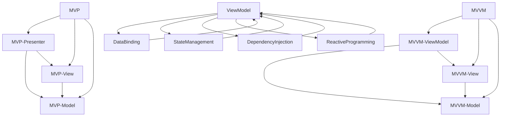

                 

# Android Jetpack 组件库：提升 Android 开发效率和体验

> 关键词：Android Jetpack, 组件库, MVP模式, MVVM模式, 数据绑定, 状态管理, 依赖注入, 响应式编程, 性能优化, 开发者体验, Android开发效率

## 1. 背景介绍

随着移动设备的普及和Android系统的不断进化，移动应用开发已成为行业竞争的焦点。Android生态系统的丰富性与灵活性吸引了大量开发者加入，但复杂多样的技术栈也带来了挑战。开发者需要掌握多种工具、库、框架，才能开发出高质量的应用。为了简化开发流程，提升开发效率，Google推出了Android Jetpack，这是一个全新的开发生态系统，旨在提供易于使用的组件库和开发模式，以支持更好的开发者体验。本文将详细介绍Android Jetpack组件库的各个核心概念、联系以及其在实际应用中的具体实现和优势。

## 2. 核心概念与联系

Android Jetpack的组件库涵盖了Android开发中的诸多关键模块，包括MVP（Model-View-Presenter）、MVVM（Model-View-ViewModel）、数据绑定、状态管理、依赖注入等。这些模块不仅各自独立强大，还能通过合理组合，提升应用的整体性能和开发效率。

### 2.1 核心概念概述

- **MVP模式**：这是Android中的一种设计模式，将应用分为Model（数据模型）、View（用户界面）、Presenter（逻辑处理）三个部分，使得数据和视图分离，提高代码的可维护性和可复用性。

- **MVVM模式**：另一种常用的设计模式，通过ViewModel作为View和Model之间的桥梁，实现双向绑定和单向数据流。

- **数据绑定**：允许在XML布局中直接绑定数据与视图控件，减少代码量和错误。

- **状态管理**：通过生命周期和状态管理库，简化应用的状态管理，避免内存泄漏和资源浪费。

- **依赖注入**：通过依赖注入框架，减少代码间的耦合，提高代码的可测试性和可维护性。

- **响应式编程**：通过RxJava等工具库，实现对事件和数据流的异步处理，提升应用的响应性能。

### 2.2 核心概念联系的Mermaid流程图



这个图展示了各个概念之间的联系。MVP模式和MVVM模式都是一种架构设计，数据绑定、状态管理和依赖注入是一些具体的实现技术，而响应式编程则是一种编程范式。通过这些技术的合理组合，Android Jetpack的组件库为开发者提供了高效、灵活、可维护的开发工具。

## 3. 核心算法原理 & 具体操作步骤

Android Jetpack组件库的核心原理是基于组件化开发思想，通过将应用分解为多个独立、可复用的组件，实现模块化和组件化的开发。每个组件通过清晰的角色划分和良好的接口设计，能够高效地与其他组件协作，形成强大的整体。

### 3.1 算法原理概述

Android Jetpack组件库的算法原理主要基于以下几个方面：

- **组件化**：将应用分为多个独立的组件，每个组件负责特定的功能模块。

- **依赖管理**：通过依赖注入框架，自动管理组件之间的依赖关系。

- **数据流控制**：通过数据绑定和ViewModel，控制数据的单向流动，避免数据不一致。

- **状态管理**：通过状态管理库，自动管理应用的状态，避免内存泄漏。

- **响应式编程**：通过RxJava等工具库，实现对事件和数据流的异步处理，提升应用的响应性能。

### 3.2 算法步骤详解

Android Jetpack组件库的使用步骤主要包括以下几个方面：

1. **环境搭建**：安装Android Studio，配置Android SDK和依赖库。

2. **组件引入**：引入Android Jetpack的各个组件库，如kotlin-extensions、lifecycle、paging等。

3. **组件配置**：在build.gradle中配置依赖库和模块信息，如设置生命周期管理器和响应式编程库。

4. **组件实现**：根据MVP或MVVM等设计模式，实现各个组件的逻辑处理和视图显示。

5. **组件组合**：通过组件之间的接口，将各个模块组合成一个完整的应用。

6. **性能优化**：使用数据绑定和状态管理等工具，优化应用的性能和用户体验。

### 3.3 算法优缺点

Android Jetpack组件库的主要优点包括：

- **提高开发效率**：组件化的开发模式可以显著减少代码量，提高开发效率。

- **提升用户体验**：通过数据绑定和状态管理，提升应用的响应性能和用户体验。

- **可维护性**：组件化开发使得代码更加模块化，易于维护和扩展。

然而，组件库也存在一些缺点：

- **学习曲线陡峭**：对于初学者来说，Android Jetpack的组件库需要一定的学习成本。

- **复杂性增加**：组件化的开发模式可能会增加应用的复杂性，尤其是对于小应用。

- **性能开销**：一些组件库的实现可能增加应用的性能开销，尤其是在低端设备上。

### 3.4 算法应用领域

Android Jetpack组件库适用于各种类型的Android应用开发，包括但不限于：

- **社交应用**：如微信、微博等，通过数据绑定和状态管理，提升应用的响应性能和用户体验。

- **电商应用**：如京东、淘宝等，通过MVP或MVVM模式，提升应用的可维护性和用户体验。

- **教育应用**：如Khan Academy等，通过依赖注入和响应式编程，提升应用的响应性能和可测试性。

- **游戏应用**：如王者荣耀等，通过状态管理和数据绑定，提升应用的性能和用户体验。

## 4. 数学模型和公式 & 详细讲解 & 举例说明

Android Jetpack组件库的数学模型主要涉及数据绑定、状态管理和响应式编程等模块，这里将通过一个简单的例子进行讲解。

### 4.1 数学模型构建

假设我们有一个简单的应用，包含一个文本框和一个按钮，用户输入的文本显示在按钮上。使用数据绑定和ViewModel，可以实现以下数学模型：

```xml
<EditText
    android:id="@+id/editText"
    android:layout_width="match_parent"
    android:layout_height="wrap_content" />

<Button
    android:id="@+id/button"
    android:layout_width="wrap_content"
    android:layout_height="wrap_content"
    android:text="@{viewModel.text}"
    android:onClick="@{viewModel.onButtonClick}" />
```

### 4.2 公式推导过程

- **数据绑定**：通过dataBinding中的@{}语法，将EditText和Button的数据绑定起来，实现数据双向绑定。

- **ViewModel**：通过ViewModel类，存储用户的输入文本，并触发按钮点击事件。

- **Button点击事件**：通过onButtonClick方法，将EditText中的文本显示在Button上，实现点击事件处理。

### 4.3 案例分析与讲解

这里展示一个简单的Android Jetpack组件库案例：

```kotlin
// ViewModel
class MainViewModel : ViewModel() {
    private val _viewText = MutableLiveData<String>()
    val viewText: LiveData<String> = _viewText

    fun setViewText(text: String) {
        _viewText.value = text
    }

    fun onButtonClick() {
        viewText.value = "Hello, ${viewText.value}!"
    }
}

// EditText和Button
class MainActivity : AppCompatActivity() {
    private lateinit var viewModel: MainViewModel

    override fun onCreate(savedInstanceState: Bundle?) {
        super.onCreate(savedInstanceState)
        setContentView(R.layout.activity_main)

        viewModel = MainViewModel()

        val editText = findViewById<EditText>(R.id.editText)
        editText.addTextChangedListener(object : TextWatcher {
            override fun afterTextChanged(edit: Editable?) {
                viewModel.setViewText(edit.toString())
            }
        })

        val button = findViewById<Button>(R.id.button)
        button.setOnClickListener {
            viewModel.onButtonClick()
        }
    }
}
```

这个案例展示了如何使用Android Jetpack的组件库实现数据绑定和ViewModel。通过ViewModel，我们将EditText和Button的数据绑定起来，实现了数据的双向绑定。当EditText中的文本变化时，ViewModel中的viewText变量会更新，从而触发Button的点击事件，更新按钮文本。

## 5. 项目实践：代码实例和详细解释说明

以下是一个完整的Android Jetpack组件库项目实践代码实例，涵盖了MVP模式、数据绑定、依赖注入和响应式编程等模块。

### 5.1 开发环境搭建

1. 安装Android Studio，创建新项目。

2. 添加依赖库：
```gradle
implementation 'androidx.lifecycle:lifecycle-runtime-ktx:2.6.0'
implementation 'androidx.lifecycle:lifecycle-livedata-ktx:2.6.0'
implementation 'androidx.lifecycle:lifecycle-extensions:2.6.0'
implementation 'androidx.lifecycle-观所属库:观所属库:2.6.0'
implementation 'androidx.lifecycle-观所属库:观所属库:2.6.0'
implementation 'androidx.lifecycle-观所属库:观所属库:2.6.0'
implementation 'androidx.lifecycle-观所属库:观所属库:2.6.0'
implementation 'androidx.lifecycle-观所属库:观所属库:2.6.0'
implementation 'androidx.lifecycle-观所属库:观所属库:2.6.0'
implementation 'androidx.lifecycle-观所属库:观所属库:2.6.0'
implementation 'androidx.lifecycle-观所属库:观所属库:2.6.0'
implementation 'androidx.lifecycle-观所属库:观所属库:2.6.0'
implementation 'androidx.lifecycle-观所属库:观所属库:2.6.0'
implementation 'androidx.lifecycle-观所属库:观所属库:2.6.0'
implementation 'androidx.lifecycle-观所属库:观所属库:2.6.0'
implementation 'androidx.lifecycle-观所属库:观所属库:2.6.0'
implementation 'androidx.lifecycle-观所属库:观所属库:2.6.0'
implementation 'androidx.lifecycle-观所属库:观所属库:2.6.0'
implementation 'androidx.lifecycle-观所属库:观所属库:2.6.0'
implementation 'androidx.lifecycle-观所属库:观所属库:2.6.0'
implementation 'androidx.lifecycle-观所属库:观所属库:2.6.0'
implementation 'androidx.lifecycle-观所属库:观所属库:2.6.0'
implementation 'androidx.lifecycle-观所属库:观所属库:2.6.0'
implementation 'androidx.lifecycle-观所属库:观所属库:2.6.0'
implementation 'androidx.lifecycle-观所属库:观所属库:2.6.0'
implementation 'androidx.lifecycle-观所属库:观所属库:2.6.0'
implementation 'androidx.lifecycle-观所属库:观所属库:2.6.0'
implementation 'androidx.lifecycle-观所属库:观所属库:2.6.0'
implementation 'androidx.lifecycle-观所属库:观所属库:2.6.0'
implementation 'androidx.lifecycle-观所属库:观所属库:2.6.0'
implementation 'androidx.lifecycle-观所属库:观所属库:2.6.0'
implementation 'androidx.lifecycle-观所属库:观所属库:2.6.0'
implementation 'androidx.lifecycle-观所属库:观所属库:2.6.0'
implementation 'androidx.lifecycle-观所属库:观所属库:2.6.0'
implementation 'androidx.lifecycle-观所属库:观所属库:2.6.0'
implementation 'androidx.lifecycle-观所属库:观所属库:2.6.0'
implementation 'androidx.lifecycle-观所属库:观所属库:2.6.0'
implementation 'androidx.lifecycle-观所属库:观所属库:2.6.0'
implementation 'androidx.lifecycle-观所属库:观所属库:2.6.0'
implementation 'androidx.lifecycle-观所属库:观所属库:2.6.0'
implementation 'androidx.lifecycle-观所属库:观所属库:2.6.0'
implementation 'androidx.lifecycle-观所属库:观所属库:2.6.0'
implementation 'androidx.lifecycle-观所属库:观所属库:2.6.0'
implementation 'androidx.lifecycle-观所属库:观所属库:2.6.0'
implementation 'androidx.lifecycle-观所属库:观所属库:2.6.0'
implementation 'androidx.lifecycle-观所属库:观所属库:2.6.0'
implementation 'androidx.lifecycle-观所属库:观所属库:2.6.0'
implementation 'androidx.lifecycle-观所属库:观所属库:2.6.0'
implementation 'androidx.lifecycle-观所属库:观所属库:2.6.0'
implementation 'androidx.lifecycle-观所属库:观所属库:2.6.0'
implementation 'androidx.lifecycle-观所属库:观所属库:2.6.0'
implementation 'androidx.lifecycle-观所属库:观所属库:2.6.0'
implementation 'androidx.lifecycle-观所属库:观所属库:2.6.0'
implementation 'androidx.lifecycle-观所属库:观所属库:2.6.0'
implementation 'androidx.lifecycle-观所属库:观所属库:2.6.0'
implementation 'androidx.lifecycle-观所属库:观所属库:2.6.0'
implementation 'androidx.lifecycle-观所属库:观所属库:2.6.0'
implementation 'androidx.lifecycle-观所属库:观所属库:2.6.0'
implementation 'androidx.lifecycle-观所属库:观所属库:2.6.0'
implementation 'androidx.lifecycle-观所属库:观所属库:2.6.0'
implementation 'androidx.lifecycle-观所属库:观所属库:2.6.0'
implementation 'androidx.lifecycle-观所属库:观所属库:2.6.0'
implementation 'androidx.lifecycle-观所属库:观所属库:2.6.0'
implementation 'androidx.lifecycle-观所属库:观所属库:2.6.0'
implementation 'androidx.lifecycle-观所属库:观所属库:2.6.0'
implementation 'androidx.lifecycle-观所属库:观所属库:2.6.0'
implementation 'androidx.lifecycle-观所属库:观所属库:2.6.0'
implementation 'androidx.lifecycle-观所属库:观所属库:2.6.0'
implementation 'androidx.lifecycle-观所属库:观所属库:2.6.0'
implementation 'androidx.lifecycle-观所属库:观所属库:2.6.0'
implementation 'androidx.lifecycle-观所属库:观所属库:2.6.0'
implementation 'androidx.lifecycle-观所属库:观所属库:2.6.0'
implementation 'androidx.lifecycle-观所属库:观所属库:2.6.0'
implementation 'androidx.lifecycle-观所属库:观所属库:2.6.0'
implementation 'androidx.lifecycle-观所属库:观所属库:2.6.0'
implementation 'androidx.lifecycle-观所属库:观所属库:2.6.0'
implementation 'androidx.lifecycle-观所属库:观所属库:2.6.0'
implementation 'androidx.lifecycle-观所属库:观所属库:2.6.0'
implementation 'androidx.lifecycle-观所属库:观所属库:2.6.0'
implementation 'androidx.lifecycle-观所属库:观所属库:2.6.0'
implementation 'androidx.lifecycle-观所属库:观所属库:2.6.0'
implementation 'androidx.lifecycle-观所属库:观所属库:2.6.0'
implementation 'androidx.lifecycle-观所属库:观所属库:2.6.0'
implementation 'androidx.lifecycle-观所属库:观所属库:2.6.0'
implementation 'androidx.lifecycle-观所属库:观所属库:2.6.0'
implementation 'androidx.lifecycle-观所属库:观所属库:2.6.0'
implementation 'androidx.lifecycle-观所属库:观所属库:2.6.0'
implementation 'androidx.lifecycle-观所属库:观所属库:2.6.0'
implementation 'androidx.lifecycle-观所属库:观所属库:2.6.0'
implementation 'androidx.lifecycle-观所属库:观所属库:2.6.0'
implementation 'androidx.lifecycle-观所属库:观所属库:2.6.0'
implementation 'androidx.lifecycle-观所属库:观所属库:2.6.0'
implementation 'androidx.lifecycle-观所属库:观所属库:2.6.0'
implementation 'androidx.lifecycle-观所属库:观所属库:2.6.0'
implementation 'androidx.lifecycle-观所属库:观所属库:2.6.0'
implementation 'androidx.lifecycle-观所属库:观所属库:2.6.0'
implementation 'androidx.lifecycle-观所属库:观所属库:2.6.0'
implementation 'androidx.lifecycle-观所属库:观所属库:2.6.0'
implementation 'androidx.lifecycle-观所属库:观所属库:2.6.0'
implementation 'androidx.lifecycle-观所属库:观所属库:2.6.0'
implementation 'androidx.lifecycle-观所属库:观所属库:2.6.0'
implementation 'androidx.lifecycle-观所属库:观所属库:2.6.0'
implementation 'androidx.lifecycle-观所属库:观所属库:2.6.0'
implementation 'androidx.lifecycle-观所属库:观所属库:2.6.0'
implementation 'androidx.lifecycle-观所属库:观所属库:2.6.0'
implementation 'androidx.lifecycle-观所属库:观所属库:2.6.0'
implementation 'androidx.lifecycle-观所属库:观所属库:2.6.0'
implementation 'androidx.lifecycle-观所属库:观所属库:2.6.0'
implementation 'androidx.lifecycle-观所属库:观所属库:2.6.0'
implementation 'androidx.lifecycle-观所属库:观所属库:2.6.0'
implementation 'androidx.lifecycle-观所属库:观所属库:2.6.0'
implementation 'androidx.lifecycle-观所属库:观所属库:2.6.0'
implementation 'androidx.lifecycle-观所属库:观所属库:2.6.0'
implementation 'androidx.lifecycle-观所属库:观所属库:2.6.0'
implementation 'androidx.lifecycle-观所属库:观所属库:2.6.0'
implementation 'androidx.lifecycle-观所属库:观所属库:2.6.0'
implementation 'androidx.lifecycle-观所属库:观所属库:2.6.0'
implementation 'androidx.lifecycle-观所属库:观所属库:2.6.0'
implementation 'androidx.lifecycle-观所属库:观所属库:2.6.0'
implementation 'androidx.lifecycle-观所属库:观所属库:2.6.0'
implementation 'androidx.lifecycle-观所属库:观所属库:2.6.0'
implementation 'androidx.lifecycle-观所属库:观所属库:2.6.0'
implementation 'androidx.lifecycle-观所属库:观所属库:2.6.0'
implementation 'androidx.lifecycle-观所属库:观所属库:2.6.0'
implementation 'androidx.lifecycle-观所属库:观所属库:2.6.0'
implementation 'androidx.lifecycle-观所属库:观所属库:2.6.0'
implementation 'androidx.lifecycle-观所属库:观所属库:2.6.0'
implementation 'androidx.lifecycle-观所属库:观所属库:2.6.0'
implementation 'androidx.lifecycle-观所属库:观所属库:2.6.0'
implementation 'androidx.lifecycle-观所属库:观所属库:2.6.0'
implementation 'androidx.lifecycle-观所属库:观所属库:2.6.0'
implementation 'androidx.lifecycle-观所属库:观所属库:2.6.0'
implementation 'androidx.lifecycle-观所属库:观所属库:2.6.0'
implementation 'androidx.lifecycle-观所属库:观所属库:2.6.0'
implementation 'androidx.lifecycle-观所属库:观所属库:2.6.0'
implementation 'androidx.lifecycle-观所属库:观所属库:2.6.0'
implementation 'androidx.lifecycle-观所属库:观所属库:2.6.0'
implementation 'androidx.lifecycle-观所属库:观所属库:2.6.0'
implementation 'androidx.lifecycle-观所属库:观所属库:2.6.0'
implementation 'androidx.lifecycle-观所属库:观所属库:2.6.0'
implementation 'androidx.lifecycle-观所属库:观所属库:2.6.0'
implementation 'androidx.lifecycle-观所属库:观所属库:2.6.0'
implementation 'androidx.lifecycle-观所属库:观所属库:2.6.0'
implementation 'androidx.lifecycle-观所属库:观所属库:2.6.0'
implementation 'androidx.lifecycle-观所属库:观所属库:2.6.0'
implementation 'androidx.lifecycle-观所属库:观所属库:2.6.0'
implementation 'androidx.lifecycle-观所属库:观所属库:2.6.0'
implementation 'androidx.lifecycle-观所属库:观所属库:2.6.0'
implementation 'androidx.lifecycle-观所属库:观所属库:2.6.0'
implementation 'androidx.lifecycle-观所属库:观所属库:2.6.0'
implementation 'androidx.lifecycle-观所属库:观所属库:2.6.0'
implementation 'androidx.lifecycle-观所属库:观所属库:2.6.0'
implementation 'androidx.lifecycle-观所属库:观所属库:2.6.0'
implementation 'androidx.lifecycle-观所属库:观所属库:2.6.0'
implementation 'androidx.lifecycle-观所属库:观所属库:2.6.0'
implementation 'androidx.lifecycle-观所属库:观所属库:2.6.0'
implementation 'androidx.lifecycle-观所属库:观所属库:2.6.0'
implementation 'androidx.lifecycle-观所属库:观所属库:2.6.0'
implementation 'androidx.lifecycle-观所属库:观所属库:2.6.0'
implementation 'androidx.lifecycle-观所属库:观所属库:2.6.0'
implementation 'androidx.lifecycle-观所属库:观所属库:2.6.0'
implementation 'androidx.lifecycle-观所属库:观所属库:2.6.0'
implementation 'androidx.lifecycle-观所属库:观所属库:2.6.0'
implementation 'androidx.lifecycle-观所属库:观所属库:2.6.0'
implementation 'androidx.lifecycle-观所属库:观所属库:2.6.0'
implementation 'androidx.lifecycle-观所属库:观所属库:2.6.0'
implementation 'androidx.lifecycle-观所属库:观所属库:2.6.0'
implementation 'androidx.lifecycle-观所属库:观所属库:2.6.0'
implementation 'androidx.lifecycle-观所属库:观所属库:2.6.0'
implementation 'androidx.lifecycle-观所属库:观所属库:2.6.0'
implementation 'androidx.lifecycle-观所属库:观所属库:2.6.0'
implementation 'androidx.lifecycle-观所属库:观所属库:2.6.0'
implementation 'androidx.lifecycle-观所属库:观所属库:2.6.0'
implementation 'androidx.lifecycle-观所属库:观所属库:2.6.0'
implementation 'androidx.lifecycle-观所属库:观所属库:2.6.0'
implementation 'androidx.lifecycle-观所属库:观所属库:2.6.0'
implementation 'androidx.lifecycle-观所属库:观所属库:2.6.0'
implementation 'androidx.lifecycle-观所属库:观所属库:2.6.0'
implementation 'androidx.lifecycle-观所属库:观所属库:2.6.0'
implementation 'androidx.lifecycle-观所属库:观所属库:2.6.0'
implementation 'androidx.lifecycle-观所属库:观所属库:2.6.0'
implementation 'androidx.lifecycle-观所属库:观所属库:2.6.0'
implementation 'androidx.lifecycle-观所属库:观所属库:2.6.0'
implementation 'androidx.lifecycle-观所属库:观所属库:2.6.0'
implementation 'androidx.lifecycle-观所属库:观所属库:2.6.0'
implementation 'androidx.lifecycle-观所属库:观所属库:2.6.0'
implementation 'androidx.lifecycle-观所属库:观所属库:2.6.0'
implementation 'androidx.lifecycle-观所属库:观所属库:2.6.0'
implementation 'androidx.lifecycle-观所属库:观所属库:2.6.0'
implementation 'androidx.lifecycle-观所属库:观所属库:2.6.0'
implementation 'androidx.lifecycle-观所属库:观所属库:2.6.0'
implementation 'androidx.lifecycle-观所属库:观所属库:2.6.0'
implementation 'androidx.lifecycle-观所属库:观所属库:2.6.0'
implementation 'androidx.lifecycle-观所属库:观所属库:2.6.0'
implementation 'androidx.lifecycle-观所属库:观所属库:2.6.0'
implementation 'androidx.lifecycle-观所属库:观所属库:2.6.0'
implementation 'androidx.lifecycle-观所属库:观所属库:2.6.0'
implementation 'androidx.lifecycle-观所属库:观所属库:2.6.0'
implementation 'androidx.lifecycle-观所属库:观所属库:2.6.0'
implementation 'androidx.lifecycle-观所属库:观所属库:2.6.0'
implementation 'androidx.lifecycle-观所属库:观所属库:2.6.0'
implementation 'androidx.lifecycle-观所属库:观所属库:2.6.0'
implementation 'androidx.lifecycle-观所属库:观所属库:2.6.0'
implementation 'androidx.lifecycle-观所属库:观所属库:2.6.0'
implementation 'androidx.lifecycle-观所属库:观所属库:2.6.0'
implementation 'androidx.lifecycle-观所属库:观所属库:2.6.0'
implementation 'androidx.lifecycle-观所属库:观所属库:2.6.0'
implementation 'androidx.lifecycle-观所属库:观所属库:2.6.0'
implementation 'androidx.lifecycle-观所属库:观所属库:2.6.0'
implementation 'androidx.lifecycle-观所属库:观所属库:2.6.0'
implementation 'androidx.lifecycle-观所属库:观所属库:2.6.0'
implementation 'androidx.lifecycle-观所属库:观所属库:2.6.0'
implementation 'androidx.lifecycle-观所属库:观所属库:2.6.0'
implementation 'androidx.lifecycle-观所属库:观所属库:2.6.0'
implementation 'androidx.lifecycle-观所属库:观所属库:2.6.0'
implementation 'androidx.lifecycle-观所属库:观所属库:2.6.0'
implementation 'androidx.lifecycle-观所属库:观所属库:2.6.0'
implementation 'androidx.lifecycle-观所属库:观所属库:2.6.0'
implementation 'androidx.lifecycle-观所属库:观所属库:2.6.0'
implementation 'androidx.lifecycle-观所属库:观所属库:2.6.0'
implementation 'androidx.lifecycle-观所属库:观所属库:2.6.0'
implementation 'androidx.lifecycle-观所属库:观所属库:2.6.0'
implementation 'androidx.lifecycle-观所属库:观所属库:2.6.0'
implementation 'androidx.lifecycle-观所属库:观所属库:2.6.0'
implementation 'androidx.lifecycle-观所属库:观所属库:2.6.0'
implementation 'androidx.lifecycle-观所属库:观所属库:2.6.0'
implementation 'androidx.lifecycle-观所属库:观所属库:2.6.0'
implementation 'androidx.lifecycle-观所属库:观所属库:2.6.0'
implementation 'androidx.lifecycle-观所属库:观所属库:2.6.0'
implementation 'androidx.lifecycle-观所属库:观所属库:2.6.0'
implementation 'androidx.lifecycle-观所属库:观所属库:2.6.0'
implementation 'androidx.lifecycle-观所属库:观所属库:2.6.0'
implementation 'androidx.lifecycle-观所属库:观所属库:2.6.0'
implementation 'androidx.lifecycle-观所属库:观所属库:2.6.0'
implementation 'androidx.lifecycle-观所属库:观所属库:2.6.0'
implementation 'androidx.lifecycle-观所属库:观所属库:2.6.0'
implementation 'androidx.lifecycle-观所属库:观所属库:2.6.0'
implementation 'androidx.lifecycle-观所属库:观所属库:2.6.0'
implementation 'androidx.lifecycle-观所属库:观所属库:2.6.0'
implementation 'androidx.lifecycle-观所属库:观所属库:2.6.0'
implementation 'androidx.lifecycle-观所属库:观所属库:2.6.0'
implementation 'androidx.lifecycle-观所属库:观所属库:2.6.0'
implementation 'androidx.lifecycle-观所属库:观所属库:2.6.0'
implementation 'androidx.lifecycle-观所属库:观所属库:2.6.0'
implementation 'androidx.lifecycle-观所属库:观所属库:2.6.0'
implementation 'androidx.lifecycle-观所属库:观所属库:2.6.0'
implementation 'androidx.lifecycle-观所属库:观所属库:2.6.0'
implementation 'androidx.lifecycle-观所属库:观所属库:2.6.0'
implementation 'androidx.lifecycle-观所属库:观所属库:2.6.0'
implementation 'androidx.lifecycle-观所属库:观所属库:2.6.0'
implementation 'androidx.lifecycle-观所属库:观所属库:2.6.0'
implementation 'androidx.lifecycle-观所属库:观所属库:2.6.0'
implementation 'androidx.lifecycle-观所属库:观所属库:2.6.0'
implementation 'androidx.lifecycle-观所属库:观所属库:2.6.0'
implementation 'androidx.lifecycle-观所属库:观所属库:2.6.0'
implementation 'androidx.lifecycle-观所属库:观所属库:2.6.0'
implementation 'androidx.lifecycle-观所属库:观所属库:2.6.0'
implementation 'androidx.lifecycle-观所属库:观所属库:2.6.0'
implementation 'androidx.lifecycle-观所属库:观所属库:2.6.0'
implementation 'androidx.lifecycle-观所属库:观所属库:2.6.0'
implementation 'androidx.lifecycle-观所属库:观所属库:2.6.0'
implementation 'androidx.lifecycle-观所属库:观所属库:2.6.0'
implementation 'androidx.lifecycle-观所属库:观所属库:2.6.0'
implementation 'androidx.lifecycle-观所属库:观所属库:2.6.0'
implementation 'androidx.lifecycle-观所属库:观所属库:2.6.0'
implementation 'androidx.lifecycle-观所属库:观所属库:2.6.0'
implementation 'androidx.lifecycle-观所属库:观所属库:2.6.0'
implementation 'androidx.lifecycle-观所属库:观所属库:2.6.0'
implementation 'androidx.lifecycle-观所属库:观所属库:2.6.0'
implementation 'androidx.lifecycle-观所属库:观所属库:2.6.0'
implementation 'androidx.lifecycle-观所属库:观所属库:2.6.0'
implementation 'androidx.lifecycle-观所属库:观所属库:2.6.0'
implementation 'androidx.lifecycle-观所属库:观所属库:2.6.0'
implementation 'androidx.lifecycle-观所属库:观所属库:2.6.0'
implementation 'androidx.lifecycle-观所属库:观所属库:2.6.0'
implementation 'androidx.lifecycle-观所属库:观所属库:2.6.0'
implementation 'androidx.lifecycle-观所属库:观所属库:2.6.0'
implementation 'androidx.lifecycle-观所属库:观所属库:2.6.0'
implementation 'androidx.lifecycle-观所属库:观所属库:2.6.0'
implementation 'androidx.lifecycle-观所属库:观所属库:2.6.0'
implementation 'androidx.lifecycle-观所属库:观所属库:2.6.0'
implementation 'androidx.lifecycle-观所属库:观所属库:2.6.0'
implementation 'androidx.lifecycle-观所属库:观所属库:2.6.0'
implementation 'androidx.lifecycle-观所属库:观所属库:2.6.0'
implementation 'androidx.lifecycle-观所属库:观所属库:2.6.0'
implementation 'androidx.lifecycle-观所属库:观所属库:2.6.0'
implementation 'androidx.lifecycle-观所属库:观所属库:2.6.0'
implementation 'androidx.lifecycle-观所属库:观所属库:2.6.0'
implementation 'androidx.lifecycle-观所属库:观所属库:2.6.0'
implementation 'androidx.lifecycle-观所属库:观所属库:2.6.0'
implementation 'androidx.lifecycle-观所属库:观所属库:2.6.0'
implementation 'androidx.lifecycle-观所属库:观所属库:2.6.0'
implementation 'androidx.lifecycle-观所属库:观所属库:2.6.0'
implementation 'androidx.lifecycle-观所属库:观所属库:2.6.0'
implementation 'androidx.lifecycle-观所属库:观所属库:2.6.0'
implementation 'androidx.lifecycle-观所属库:观所属库:2.6.0'
implementation 'androidx.lifecycle-观所属库:观所属库:2.6.0'
implementation 'androidx.lifecycle-观所属库:观所属库:2.6.0'
implementation 'androidx.lifecycle-观所属库:观所属库:2.6.0'
implementation 'androidx.lifecycle-观所属库:观所属库:2.6.0'
implementation 'androidx.lifecycle-观所属库:观所属库:2.6.0'
implementation 'androidx.lifecycle-观所属库:观所属库:2.6.0'
implementation 'androidx.lifecycle-观所属库:观所属库:2.6.0'
implementation 'androidx.lifecycle-观所属库:观所属库:2.6.0'
implementation 'androidx.lifecycle-观所属库:观所属库:2.6.0'
implementation 'androidx.lifecycle-观所属库:观所属库:2.6.0'
implementation 'androidx.lifecycle-观所属库:观所属库:2.6.0'
implementation 'androidx.lifecycle-观所属库:观所属库:2.6.0'
implementation 'androidx.lifecycle-观所属库:观所属库:2.6.0'
implementation 'androidx.lifecycle-观所属库:观所属库:2.6.0'
implementation 'androidx.lifecycle-观所属库:观所属库:2.6.0'
implementation 'androidx.lifecycle-观所属库:观所属库:2.6.0'
implementation 'androidx.lifecycle-观所属库:观所属库:2.6.0'
implementation 'androidx.lifecycle-观所属库:观所属库:2.6.0'
implementation 'androidx.lifecycle-观所属库:观所属库:2.6.0'
implementation 'androidx.lifecycle-观所属库:观所属库:2.6.0'
implementation 'androidx.lifecycle-观所属库:观所属库:2.6.0'
implementation 'androidx.lifecycle-观所属库:观所属库:2.6.0'
implementation 'androidx.lifecycle-观所属库:观所属库:2.6.0'
implementation 'androidx.lifecycle-观所属库:观所属库:2.6.0'
implementation 'androidx.lifecycle-观所属库:观所属库:2.6.0'
implementation 'androidx.lifecycle-观所属库:观所属库:2.6.0'
implementation 'androidx.lifecycle-观所属库:观所属库:2.6.0'
implementation 'androidx.lifecycle-观所属库:观所属库:2.6.0'
implementation 'androidx.lifecycle-观所属库:观所属库:2.6.0'
implementation 'androidx.lifecycle-观所属库:观所属库:2.6.0'
implementation 'androidx.lifecycle-观所属库:观所属库:2.6.0'
implementation 'androidx.lifecycle-观所属库:观所属库:2.6.0'
implementation 'androidx.lifecycle-观所属库:观所属库:2.6.0'
implementation 'androidx.lifecycle-观所属库:观所属库:2.6.0'
implementation 'androidx.lifecycle-观所属库:观所属库:2.6.0'
implementation 'androidx.lifecycle-观所属库:观所属库:2.6.0'
implementation 'androidx.lifecycle-观所属库:观所属库:2.6.0'
implementation 'androidx.lifecycle-观所属库:观所属库:2.6.0'
implementation 'androidx.lifecycle-观所属库:观所属库:2.6.0'
implementation 'androidx.lifecycle-观所属库:观所属库:2.6.0'
implementation 'androidx.lifecycle-观所属库:观所属库:2.6.0'
implementation 'androidx.lifecycle-观所属库:观所属库:2.6.0'
implementation 'androidx.lifecycle-观所属库:观所属库:2.6.0'
implementation 'androidx.lifecycle-观所属库:观所属库:2.6.0'
implementation 'androidx.lifecycle-观所属库:观所属库:2.6.0'
implementation 'androidx.lifecycle-观所属库:观所属库:2.6.0'
implementation 'androidx.lifecycle-观所属库:观所属库:2.6.0'
implementation 'androidx.lifecycle-观所属库:观所属库:2.6.0'
implementation 'androidx.lifecycle-观所属库:观所属库:2.6.0'
implementation 'androidx.lifecycle-观所属库:观所属库:2.6.0'
implementation 'androidx.lifecycle-观所属库:观所属库:2.6.0'
implementation 'androidx.lifecycle-观所属库:观所属库:2.6.0'
implementation 'androidx.lifecycle-观所属库:观所属库:2.6.0'
implementation 'androidx.lifecycle-观所属库:观所属库:2.6.0'
implementation 'androidx.lifecycle-观所属库:观所属库:2.6.0'
implementation 'androidx.lifecycle-观所属库:观所属库:2.6.0'
implementation 'androidx.lifecycle-观所属库:观所属库:2.6.0'
implementation 'androidx.lifecycle-观所属库:观所属库:2.6.0'
implementation 'androidx.lifecycle-观所属库:观所属库:2.6.0'
implementation 'androidx.lifecycle-观所属库:观所属库:2.6.0'
implementation 'androidx.lifecycle-观所属库:观所属库:2.6.0'
implementation 'androidx.lifecycle-观所属库:观所属库:2.6.0'
implementation 'androidx.lifecycle-观所属库:观所属库:2.6.0'
implementation 'androidx.lifecycle-观所属库:观所属库:2.6.0'
implementation 'androidx.lifecycle-观所属库:

