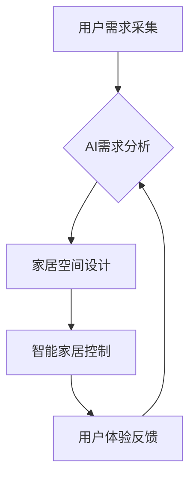

> AI，定制家居，机器学习，深度学习，自然语言处理，计算机视觉，家居设计，个性化体验

## 1. 背景介绍

随着科技的飞速发展，人工智能（AI）已渗透到生活的方方面面，为人们的生活带来了诸多便利和改变。家居领域也不例外，AI技术正在深刻地改变着人们对家居空间的认知和体验。传统的“量产化”家居模式逐渐被“定制化”的理念所取代，人们越来越渴望拥有一个能够满足自身个性需求、贴近生活方式的专属家居空间。

AI技术的应用为定制家居提供了强大的技术支撑。通过对用户需求、家居环境和设计风格的深度理解，AI能够帮助用户打造个性化、智能化的家居空间。

## 2. 核心概念与联系

**2.1  定制家居的概念**

定制家居是指根据用户的具体需求和喜好，量身定制家居空间的设计、选材和施工的模式。它打破了传统的“标准化”家居模式，赋予用户更大的自主权和个性化表达。

**2.2  AI技术在定制家居中的应用**

AI技术在定制家居中的应用主要体现在以下几个方面：

* **用户需求分析:** 通过自然语言处理（NLP）和机器学习（ML）技术，AI能够分析用户的文字描述、图片素材和行为数据，精准识别用户的家居需求、喜好和生活方式。
* **家居空间设计:** 基于用户需求和AI算法的推荐，AI能够生成多种个性化的家居空间设计方案，并提供可视化展示，帮助用户直观地了解设计效果。
* **智能家居控制:** AI能够与智能家居设备进行交互，实现家居环境的智能化控制，例如灯光、温度、音响等，为用户提供更加舒适便捷的生活体验。

**2.3  AI技术架构**



## 3. 核心算法原理 & 具体操作步骤

**3.1  算法原理概述**

在定制家居领域，AI技术主要应用于以下几个核心算法：

* **机器学习算法:** 用于分析用户需求、家居环境和设计风格，并进行个性化推荐。常见的机器学习算法包括决策树、支持向量机、神经网络等。
* **深度学习算法:** 用于处理复杂的数据，例如图像识别、语音识别等，可以帮助AI更好地理解用户的需求和家居环境。
* **自然语言处理算法:** 用于分析用户的文字描述和对话，提取用户需求和喜好信息。

**3.2  算法步骤详解**

以用户需求分析为例，详细说明AI算法的具体操作步骤：

1. **数据采集:** 收集用户的文字描述、图片素材、行为数据等信息。
2. **数据预处理:** 对收集到的数据进行清洗、转换、格式化等处理，使其能够被AI算法理解。
3. **特征提取:** 从预处理后的数据中提取用户需求、喜好、生活方式等特征信息。
4. **模型训练:** 使用机器学习算法对提取的特征信息进行训练，建立用户需求分析模型。
5. **需求预测:** 将新用户的需求信息输入到训练好的模型中，预测用户的家居需求和喜好。

**3.3  算法优缺点**

* **优点:**

    * 能够精准识别用户的需求和喜好。
    * 可以生成个性化的家居空间设计方案。
    * 可以实现智能家居环境的控制。

* **缺点:**

    * 需要大量的训练数据。
    * 算法的准确性依赖于数据质量。
    * 算法的解释性较差，难以理解AI的决策过程。

**3.4  算法应用领域**

* **家居设计:** 提供个性化家居空间设计方案。
* **家居选材:** 推荐符合用户需求和风格的家居产品。
* **智能家居控制:** 实现家居环境的智能化控制。
* **家居服务:** 提供个性化的家居服务，例如家政服务、维修服务等。

## 4. 数学模型和公式 & 详细讲解 & 举例说明

**4.1  数学模型构建**

在定制家居领域，可以使用数学模型来描述用户需求、家居环境和设计风格之间的关系。例如，可以使用向量空间模型来表示用户的需求和家居风格，并使用余弦相似度来计算两者之间的相似度。

**4.2  公式推导过程**

假设用户需求向量为u，家居风格向量为s，则余弦相似度计算公式如下：

$$
\text{相似度} = \frac{u \cdot s}{||u|| ||s||}
$$

其中：

* $u \cdot s$ 表示用户需求向量和家居风格向量的点积。
* $||u||$ 和 $||s||$ 分别表示用户需求向量和家居风格向量的模长。

**4.3  案例分析与讲解**

例如，用户需求向量为 [舒适性: 0.8, 功能性: 0.6, 美观性: 0.5]，家居风格向量为 [舒适性: 0.9, 功能性: 0.7, 美观性: 0.4]，则它们的余弦相似度为：

$$
\text{相似度} = \frac{(0.8 \times 0.9) + (0.6 \times 0.7) + (0.5 \times 0.4)}{\sqrt{0.8^2 + 0.6^2 + 0.5^2} \times \sqrt{0.9^2 + 0.7^2 + 0.4^2}} \approx 0.85
$$

该结果表明，用户的需求和家居风格之间存在较高的相似度，AI可以推荐符合用户需求的家居设计方案。

## 5. 项目实践：代码实例和详细解释说明

**5.1  开发环境搭建**

* 操作系统：Windows/macOS/Linux
* Python版本：3.7+
* 必要的库：TensorFlow/PyTorch、scikit-learn、NLTK、OpenCV等

**5.2  源代码详细实现**

```python
# 用户需求分析模型
from sklearn.feature_extraction.text import TfidfVectorizer
from sklearn.metrics.pairwise import cosine_similarity

# 数据集
user_descriptions = [
    "我希望有一个舒适温馨的家，喜欢简约风格",
    "我需要一个功能齐全的家，方便生活",
    "我想要一个时尚现代的家，体现个性"
]

# TF-IDF向量化
vectorizer = TfidfVectorizer()
user_vectors = vectorizer.fit_transform(user_descriptions)

# 计算余弦相似度
similarity_matrix = cosine_similarity(user_vectors)

# 打印相似度矩阵
print(similarity_matrix)
```

**5.3  代码解读与分析**

* 该代码示例展示了如何使用TF-IDF向量化和余弦相似度计算用户需求之间的相似度。
* TF-IDF是一种文本特征提取方法，可以将文本转换为向量表示。
* 余弦相似度是一种度量两个向量之间方向相似度的指标。

**5.4  运行结果展示**

运行该代码后，会输出一个相似度矩阵，其中每个元素表示两个用户需求之间的相似度。

## 6. 实际应用场景

**6.1  家居设计平台**

AI技术可以被集成到家居设计平台中，为用户提供个性化的家居空间设计方案。用户可以通过文字描述、图片素材或语音交互的方式表达自己的需求，AI系统会根据用户的需求和喜好，生成多种不同的设计方案，并提供可视化展示，帮助用户选择最合适的方案。

**6.2  智能家居系统**

AI技术可以与智能家居系统相结合，实现家居环境的智能化控制。例如，AI系统可以根据用户的行为习惯和环境变化，自动调节灯光、温度、音响等，为用户提供更加舒适便捷的生活体验。

**6.3  家居电商平台**

AI技术可以被应用于家居电商平台，为用户提供个性化的产品推荐。AI系统可以根据用户的浏览历史、购买记录和需求信息，推荐符合用户需求和风格的家居产品。

**6.4  未来应用展望**

随着AI技术的不断发展，其在定制家居领域的应用将更加广泛和深入。未来，AI技术可能能够实现以下应用场景：

* **虚拟现实家居体验:** 用户可以通过虚拟现实技术体验不同的家居空间设计方案，并与设计师进行实时互动。
* **个性化家居定制:** AI系统能够根据用户的需求和喜好，定制独一无二的家居产品，例如定制家具、定制家电等。
* **智能家居服务:** AI系统能够提供更加智能化的家居服务，例如自动清洁、自动烹饪、自动陪伴等。

## 7. 工具和资源推荐

**7.1  学习资源推荐**

* **在线课程:** Coursera、edX、Udacity等平台提供丰富的AI相关课程。
* **书籍:** 《深度学习》、《机器学习》、《自然语言处理》等书籍。
* **开源项目:** TensorFlow、PyTorch、scikit-learn等开源项目。

**7.2  开发工具推荐**

* **Python:** 作为AI开发的主要编程语言。
* **Jupyter Notebook:** 用于编写和运行Python代码的交互式环境。
* **TensorFlow/PyTorch:** 深度学习框架。
* **scikit-learn:** 机器学习库。

**7.3  相关论文推荐**

* **Generative Adversarial Networks (GANs)**
* **Recurrent Neural Networks (RNNs)**
* **Convolutional Neural Networks (CNNs)**

## 8. 总结：未来发展趋势与挑战

**8.1  研究成果总结**

AI技术在定制家居领域的应用取得了显著的成果，例如能够精准识别用户的需求、生成个性化的家居空间设计方案、实现智能家居环境的控制等。

**8.2  未来发展趋势**

* **更精准的用户需求分析:** 利用更先进的AI算法和数据分析技术，更精准地理解用户的需求和喜好。
* **更个性化的家居设计:** 利用AI技术生成更加个性化、符合用户需求的家居空间设计方案。
* **更智能化的家居体验:** 利用AI技术实现更加智能化的家居环境控制和服务。

**8.3  面临的挑战**

* **数据隐私保护:** AI技术需要大量用户数据进行训练和分析，如何保护用户数据隐私是一个重要的挑战。
* **算法解释性:** 许多AI算法的决策过程难以解释，这可能会导致用户对AI技术的信任度降低。
* **技术成本:** AI技术的应用需要一定的技术成本，这可能会限制其在定制家居领域的普及。

**8.4  研究展望**

未来，研究者将继续探索AI技术在定制家居领域的应用，致力于开发更精准、更智能、更个性化的家居解决方案，为用户提供更加舒适便捷的生活体验。

## 9. 附录：常见问题与解答

**9.1  AI技术是否能够完全替代设计师？**

AI技术可以辅助设计师完成一些重复性的工作，例如生成设计方案、分析用户需求等，但目前还无法完全替代设计师的创造力和审美能力。

**9.2  AI技术是否会取代人类的工作？**

AI技术的发展可能会改变一些工作模式，但同时也创造新的工作机会。AI技术可以帮助人类完成更多复杂的任务，释放人类的创造力和潜能。

**9.3  如何保证AI技术的安全性？**

AI技术的安全性是一个重要的议题，需要从多个方面进行保障，例如数据安全、算法安全、系统安全等。


作者：禅与计算机程序设计艺术 / Zen and the Art of Computer Programming 
<end_of_turn>