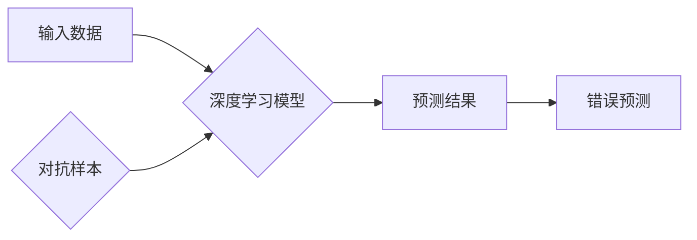

> 对抗样本，Adversarial Examples，机器学习，深度学习，安全，攻击，防御

## 1. 背景介绍

近年来，深度学习在计算机视觉、自然语言处理等领域取得了显著的进展，其强大的学习能力和预测精度为我们带来了许多便利。然而，随着深度学习模型的广泛应用，其安全性也逐渐受到关注。对抗样本（Adversarial Examples）作为一种针对深度学习模型的攻击手段，能够有效地扰乱模型的预测结果，从而导致模型失效。

对抗样本是指通过对输入数据进行微小的、不可察觉的扰动，而导致模型预测结果发生显著变化的样本。这些扰动通常是针对模型的特定结构和参数设计的，能够巧妙地利用模型的脆弱性，使其产生错误的判断。

对抗样本的出现对深度学习模型的安全性构成了重大挑战。它不仅可能导致模型在实际应用中出现错误，甚至可能被恶意攻击者利用，造成不可预知的损失。因此，研究对抗样本的生成、检测和防御机制，对于保障深度学习模型的安全性和可靠性至关重要。

## 2. 核心概念与联系

### 2.1  核心概念

* **深度学习模型:**  深度学习模型是一种基于多层神经网络的机器学习模型，能够学习复杂的数据模式和关系。
* **输入数据:**  深度学习模型的输入数据可以是图像、文本、音频等各种形式的数据。
* **扰动:**  对抗样本的生成过程就是对输入数据进行微小的扰动。
* **预测结果:**  深度学习模型对输入数据的预测结果，例如图像分类的结果、文本情感分析的结果等。

### 2.2  核心联系

深度学习模型的预测结果依赖于其对输入数据的学习和理解。对抗样本通过对输入数据进行扰动，改变了模型对数据的感知，从而导致模型的预测结果发生错误。

**Mermaid 流程图:**



## 3. 核心算法原理 & 具体操作步骤

### 3.1  算法原理概述

对抗样本的生成通常采用梯度下降算法，通过迭代地调整输入数据，使得模型的预测结果朝着目标方向变化。

### 3.2  算法步骤详解

1. **选择目标模型:**  首先需要选择一个目标深度学习模型，该模型将被用来生成对抗样本。
2. **定义目标函数:**  目标函数用于衡量对抗样本的有效性，通常是模型预测结果与目标预测结果之间的差异。
3. **初始化输入数据:**  选择一个原始的输入数据作为对抗样本的初始值。
4. **迭代更新输入数据:**  使用梯度下降算法，根据目标函数的梯度，迭代地更新输入数据，使得模型的预测结果朝着目标方向变化。
5. **终止条件:**  当目标函数达到预设的阈值或迭代次数达到上限时，停止迭代，得到生成的对抗样本。

### 3.3  算法优缺点

**优点:**

* 能够生成有效的对抗样本，能够有效地攻击深度学习模型。
* 算法原理相对简单，易于理解和实现。

**缺点:**

* 算法的效率较低，生成对抗样本需要较长时间。
* 算法生成的对抗样本可能过于明显，容易被检测到。

### 3.4  算法应用领域

对抗样本的生成算法广泛应用于以下领域:

* **安全研究:**  研究深度学习模型的安全性，发现模型的漏洞。
* **模型测试:**  使用对抗样本对深度学习模型进行测试，评估模型的鲁棒性。
* **防御机制研究:**  研究对抗样本的检测和防御机制。

## 4. 数学模型和公式 & 详细讲解 & 举例说明

### 4.1  数学模型构建

假设我们有一个深度学习模型 $f(x)$，输入数据为 $x$，输出预测结果为 $y$。对抗样本的生成目标是找到一个微小的扰动 $\epsilon$，使得模型对扰动后的输入数据 $x + \epsilon$ 的预测结果发生显著变化。

我们可以使用以下数学模型来描述对抗样本的生成过程:

$$
\min_{\epsilon} L(f(x + \epsilon), y')
$$

其中:

* $L$ 是损失函数，用于衡量模型预测结果与目标预测结果 $y'$ 之间的差异。
* $\epsilon$ 是对抗样本的扰动。

### 4.2  公式推导过程

为了最小化损失函数，我们可以使用梯度下降算法迭代地更新扰动 $\epsilon$。梯度下降算法的更新公式如下:

$$
\epsilon = \epsilon - \alpha \nabla_{\epsilon} L(f(x + \epsilon), y')
$$

其中:

* $\alpha$ 是学习率，控制着扰动更新的步长。
* $\nabla_{\epsilon} L(f(x + \epsilon), y')$ 是损失函数对扰动 $\epsilon$ 的梯度。

### 4.3  案例分析与讲解

例如，对于图像分类任务，我们可以使用交叉熵损失函数来衡量模型预测结果与真实标签之间的差异。目标预测结果 $y'$ 可以设置为模型预测错误的类别。通过迭代地更新扰动 $\epsilon$，我们可以生成一个对抗样本，使得模型将该样本分类为错误的类别。

## 5. 项目实践：代码实例和详细解释说明

### 5.1  开发环境搭建

* Python 3.6+
* TensorFlow 2.0+
* NumPy
* Matplotlib

### 5.2  源代码详细实现

```python
import tensorflow as tf
import numpy as np
import matplotlib.pyplot as plt

# 加载预训练的图像分类模型
model = tf.keras.applications.VGG16(weights='imagenet')

# 选择一个图像作为输入数据
image_path = 'path/to/image.jpg'
image = tf.keras.preprocessing.image.load_img(image_path, target_size=(224, 224))
image = tf.keras.preprocessing.image.img_to_array(image)
image = np.expand_dims(image, axis=0)

# 生成对抗样本
epsilon = 0.01
loss_fn = tf.keras.losses.CategoricalCrossentropy()

def generate_adversarial_example(image, epsilon):
    with tf.GradientTape() as tape:
        tape.watch(image)
        predictions = model(image)
        loss = loss_fn(tf.one_hot(tf.argmax(predictions, axis=1), num_classes=1000), predictions)
    gradients = tape.gradient(loss, image)
    adversarial_example = image + epsilon * tf.sign(gradients)
    return adversarial_example

adversarial_image = generate_adversarial_example(image, epsilon)

# 显示原始图像和对抗样本
plt.subplot(1, 2, 1)
plt.imshow(image[0])
plt.title('Original Image')
plt.subplot(1, 2, 2)
plt.imshow(adversarial_image[0])
plt.title('Adversarial Example')
plt.show()
```

### 5.3  代码解读与分析

* 代码首先加载预训练的图像分类模型 VGG16。
* 然后选择一个图像作为输入数据，并将其预处理为模型所需的格式。
* 接下来定义一个函数 `generate_adversarial_example`，该函数使用梯度下降算法生成对抗样本。
* 函数内部使用 `tf.GradientTape` 记录梯度信息，并计算损失函数。
* 然后使用 `tape.gradient` 计算损失函数对输入图像的梯度。
* 最后，根据梯度信息，对输入图像进行扰动，生成对抗样本。
* 最后，代码显示原始图像和对抗样本。

### 5.4  运行结果展示

运行代码后，会显示原始图像和对抗样本的对比图。对抗样本可能看起来与原始图像几乎没有区别，但它能够有效地欺骗模型，导致模型预测错误。

## 6. 实际应用场景

### 6.1  安全领域

* **网络攻击:**  攻击者可以利用对抗样本攻击网络安全系统，例如入侵检测系统、身份验证系统等，从而绕过安全防护措施。
* **数据欺诈:**  攻击者可以利用对抗样本欺骗机器学习模型，例如欺诈检测模型、信用评分模型等，从而进行数据欺诈。

### 6.2  医疗领域

* **医疗诊断:**  对抗样本可能导致医疗诊断模型产生错误的诊断结果，从而危及患者的生命安全。
* **药物研发:**  对抗样本可能影响药物研发模型的预测精度，导致药物研发失败。

### 6.3  自动驾驶领域

* **车辆识别:**  对抗样本可能导致自动驾驶车辆识别错误，从而引发交通事故。
* **路径规划:**  对抗样本可能干扰自动驾驶车辆的路径规划，导致车辆行驶到危险区域。

### 6.4  未来应用展望

随着深度学习技术的不断发展，对抗样本的应用场景将会更加广泛。未来，对抗样本可能被用于以下领域:

* **人工智能安全研究:**  对抗样本可以作为一种工具，帮助研究人员发现深度学习模型的漏洞，并开发更安全的模型。
* **机器学习模型测试:**  对抗样本可以用于测试机器学习模型的鲁棒性，评估模型在实际应用中的可靠性。
* **数据增强:**  对抗样本可以作为一种数据增强技术，提高机器学习模型的泛化能力。

## 7. 工具和资源推荐

### 7.1  学习资源推荐

* **论文:**  
    * Goodfellow, I., Shlens, J., & Szegedy, C. (2014). Explaining and harnessing adversarial examples.
    * Szegedy, C., Zaremba, W., Sutskever, I., Bruna, J., Erhan, D., Goodfellow, I., & Fergus, R. (2013). Intriguing properties of neural networks.
* **博客:**  
    * https://towardsdatascience.com/adversarial-examples-a-comprehensive-overview-a79996991197
    * https://blog.openai.com/adversarial-examples/

### 7.2  开发工具推荐

* **TensorFlow:**  https://www.tensorflow.org/
* **PyTorch:**  https://pytorch.org/

### 7.3  相关论文推荐

* **Generating Adversarial Examples for Machine Learning**
* **Adversarial Examples in the Physical World**
* **Robustness of Deep Learning Models to Adversarial Attacks**

## 8. 总结：未来发展趋势与挑战

### 8.1  研究成果总结

近年来，对抗样本研究取得了显著进展，包括对抗样本的生成、检测和防御机制等方面。

### 8.2  未来发展趋势

* **更有效的对抗样本生成方法:**  研究人员将继续探索更有效的对抗样本生成方法，例如基于生成对抗网络 (GAN) 的方法。
* **更鲁棒的防御机制:**  研究人员将继续开发更鲁棒的防御机制，例如对抗训练、正则化等方法。
* **对抗样本的应用研究:**  对抗样本的应用场景将会更加广泛，例如在安全领域、医疗领域、自动驾驶领域等。

### 8.3  面临的挑战

* **对抗样本的泛化性:**  目前，许多对抗样本的生成方法只能针对特定的模型和数据集有效，缺乏泛化性。
* **对抗样本的检测难度:**  检测对抗样本仍然是一个具有挑战性的问题，需要开发更有效的检测方法。
* **对抗样本的伦理问题:**  对抗样本的应用可能带来一些伦理问题，例如隐私泄露、信息操纵等。

### 8.4  研究展望

未来，对抗样本研究将继续是一个重要的研究方向，需要