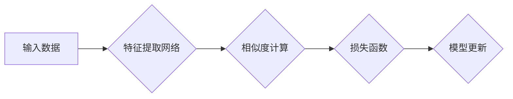

> 对比学习，自监督学习，特征提取，图像识别，推荐系统，深度学习，迁移学习

## 1. 背景介绍

在深度学习领域，获取高质量的标注数据一直是训练高性能模型的瓶颈。传统的监督学习方法依赖于大量人工标注数据，而标注数据成本高昂且耗时。为了解决这个问题，自监督学习（Self-Supervised Learning）应运而生。自监督学习通过设计巧妙的预训练任务，利用未标记数据进行训练，学习到通用的特征表示，为下游任务提供强大的基础。

对比学习（Contrastive Learning）是自监督学习中的一种重要方法，它通过学习数据点之间的相似性和差异性来进行特征学习。简单来说，对比学习的目标是让模型将相似的样本映射到相近的特征空间，而将不同的样本映射到相远的空间。

## 2. 核心概念与联系

对比学习的核心思想是通过对比相似的样本和不同的样本，学习到更有效的特征表示。

**核心概念：**

* **正样本（Positive Sample）：** 相似的样本，例如同一张图片的不同裁剪，同一用户喜欢的不同商品。
* **负样本（Negative Sample）：** 不同的样本，例如不同图片，不同用户喜欢的不同商品。
* **相似度度量（Similarity Metric）：** 用于衡量样本相似度的函数，例如欧氏距离、余弦相似度等。
* **损失函数（Loss Function）：** 用于衡量模型预测的相似度与真实相似度的差距，例如交叉熵损失、triplet损失等。

**架构图：**



## 3. 核心算法原理 & 具体操作步骤

### 3.1  算法原理概述

对比学习算法的核心是通过对比正样本和负样本的相似度来学习特征表示。

1. **特征提取:** 将输入数据输入到一个特征提取网络中，得到每个样本的特征向量。
2. **相似度计算:** 使用相似度度量函数计算正样本和负样本之间的相似度。
3. **损失函数:** 使用损失函数衡量模型预测的相似度与真实相似度的差距。
4. **模型更新:** 通过反向传播算法更新模型参数，使得模型能够更好地区分正样本和负样本。

### 3.2  算法步骤详解

1. **数据准备:** 准备一个包含大量未标记数据的集合。
2. **数据增强:** 对数据进行增强操作，例如随机裁剪、旋转、翻转等，生成多个不同的样本表示。
3. **特征提取网络:** 选择一个合适的特征提取网络，例如CNN、Transformer等。
4. **相似度度量函数:** 选择一个合适的相似度度量函数，例如欧氏距离、余弦相似度等。
5. **损失函数:** 选择一个合适的损失函数，例如交叉熵损失、triplet损失等。
6. **模型训练:** 将数据输入到模型中进行训练，优化模型参数，使得模型能够更好地区分正样本和负样本。

### 3.3  算法优缺点

**优点:**

* 不需要人工标注数据，可以利用海量未标记数据进行训练。
* 可以学习到通用的特征表示，适用于多种下游任务。
* 训练效率高，可以利用分布式训练加速训练速度。

**缺点:**

* 训练效果依赖于数据增强策略和相似度度量函数的选择。
* 对于一些特定任务，可能需要进行额外的微调才能达到最佳效果。

### 3.4  算法应用领域

对比学习算法在图像识别、自然语言处理、推荐系统等领域都有广泛的应用。

* **图像识别:** 用于图像分类、目标检测、图像分割等任务。
* **自然语言处理:** 用于文本分类、情感分析、机器翻译等任务。
* **推荐系统:** 用于用户画像、商品推荐等任务。

## 4. 数学模型和公式 & 详细讲解 & 举例说明

### 4.1  数学模型构建

对比学习的目标是学习一个映射函数 f，将输入数据 x 映射到特征空间 Z 中，使得相似的样本在特征空间中距离较近，而不同的样本距离较远。

**数学模型:**

$$
f(x) \in Z
$$

其中，x 是输入数据，f(x) 是特征向量。

### 4.2  公式推导过程

常用的对比学习损失函数是交叉熵损失函数。

**交叉熵损失函数:**

$$
L = -\sum_{i=1}^{N} \log \frac{exp(s(f(x_i), f(x_j)) / \tau)}{\sum_{k=1}^{N} exp(s(f(x_i), f(x_k)) / \tau)}
$$

其中，

* N 是样本数量
* $x_i$ 和 $x_j$ 是正样本和负样本
* $s(f(x_i), f(x_j))$ 是特征向量之间的相似度
* $\tau$ 是温度参数

### 4.3  案例分析与讲解

假设我们有一个图像分类任务，需要将图像分类为猫和狗。我们可以使用对比学习算法来学习图像特征。

1. **数据准备:** 准备一个包含大量猫狗图像的集合。
2. **数据增强:** 对图像进行随机裁剪、旋转、翻转等增强操作，生成多个不同的样本表示。
3. **特征提取网络:** 使用一个CNN网络作为特征提取网络。
4. **相似度度量函数:** 使用余弦相似度作为相似度度量函数。
5. **损失函数:** 使用交叉熵损失函数作为损失函数。
6. **模型训练:** 将数据输入到模型中进行训练，优化模型参数，使得模型能够更好地区分猫和狗图像。

## 5. 项目实践：代码实例和详细解释说明

### 5.1  开发环境搭建

* Python 3.7+
* PyTorch 1.7+
* CUDA 10.2+

### 5.2  源代码详细实现

```python
import torch
import torch.nn as nn
import torch.optim as optim

# 定义特征提取网络
class FeatureExtractor(nn.Module):
    def __init__(self):
        super(FeatureExtractor, self).__init__()
        # ...

    def forward(self, x):
        # ...

# 定义对比学习模型
class ContrastiveLearningModel(nn.Module):
    def __init__(self, feature_extractor):
        super(ContrastiveLearningModel, self).__init__()
        self.feature_extractor = feature_extractor
        self.similarity_function = nn.CosineSimilarity(dim=1)
        self.margin = 1.0

    def forward(self, x1, x2):
        # ...

# 实例化模型和优化器
model = ContrastiveLearningModel(feature_extractor)
optimizer = optim.Adam(model.parameters(), lr=0.001)

# 训练循环
for epoch in range(num_epochs):
    for batch in dataloader:
        # ...

        # 计算损失
        loss = model.forward(batch)

        # 反向传播
        optimizer.zero_grad()
        loss.backward()
        optimizer.step()

```

### 5.3  代码解读与分析

* **特征提取网络:** 用于提取输入数据的特征表示。
* **对比学习模型:** 负责计算正样本和负样本之间的相似度，并使用损失函数进行优化。
* **相似度度量函数:** 用于衡量特征向量之间的相似度。
* **损失函数:** 用于衡量模型预测的相似度与真实相似度的差距。
* **训练循环:** 迭代训练模型，更新模型参数。

### 5.4  运行结果展示

训练完成后，可以评估模型的性能，例如在图像分类任务中，可以使用准确率、召回率、F1-score等指标进行评估。

## 6. 实际应用场景

### 6.1  图像识别

对比学习算法可以用于图像分类、目标检测、图像分割等任务。例如，可以利用对比学习算法学习到通用的图像特征，然后将这些特征用于训练图像分类模型。

### 6.2  自然语言处理

对比学习算法也可以应用于自然语言处理任务，例如文本分类、情感分析、机器翻译等。例如，可以利用对比学习算法学习到文本语义的表示，然后将这些表示用于训练文本分类模型。

### 6.3  推荐系统

对比学习算法可以用于用户画像、商品推荐等任务。例如，可以利用对比学习算法学习到用户的兴趣偏好，然后根据用户的兴趣偏好进行商品推荐。

### 6.4  未来应用展望

对比学习算法在未来将有更广泛的应用场景，例如：

* **多模态学习:** 将图像、文本、音频等多种模态数据进行融合学习。
* **强化学习:** 用于训练强化学习代理，学习更有效的策略。
* **生成模型:** 用于训练生成模型，生成更逼真的数据。

## 7. 工具和资源推荐

### 7.1  学习资源推荐

* **论文:**
    * SimCLR: A Simple Framework for Contrastive Learning of Visual Representations
    * MoCo: Momentum Contrast for Self-Supervised Learning
    * BYOL: Bootstrap Your Own Latent

* **博客:**
    * Towards Data Science
    * Machine Learning Mastery

### 7.2  开发工具推荐

* **PyTorch:** 深度学习框架
* **TensorFlow:** 深度学习框架
* **Keras:** 深度学习框架

### 7.3  相关论文推荐

* SimCLR: https://arxiv.org/abs/2002.05709
* MoCo: https://arxiv.org/abs/1912.03982
* BYOL: https://arxiv.org/abs/2006.07733

## 8. 总结：未来发展趋势与挑战

### 8.1  研究成果总结

对比学习算法取得了显著的成果，在图像识别、自然语言处理等领域取得了优异的性能。

### 8.2  未来发展趋势

* **多模态对比学习:** 将图像、文本、音频等多种模态数据进行融合学习。
* **自适应对比学习:** 根据不同的任务和数据自动调整对比学习策略。
* **高效对比学习:** 降低对比学习算法的计算复杂度，提高训练效率。

### 8.3  面临的挑战

* **数据效率:** 对比学习算法仍然依赖于大量的训练数据。
* **泛化能力:** 对比学习算法的泛化能力仍然需要进一步提升。
* **理论解释:** 对比学习算法的理论基础仍然需要进一步研究。

### 8.4  研究展望

未来，对比学习算法将继续发展，成为深度学习领域的重要研究方向。

## 9. 附录：常见问题与解答

* **Q1: 对比学习算法与监督学习算法相比有什么优势？**

* **A1:** 对比学习算法不需要人工标注数据，可以利用海量未标记数据进行训练，降低数据标注成本。

* **Q2: 对比学习算法的训练过程如何？**

* **A2:** 对比学习算法的训练过程是通过对比正样本和负样本的相似度来学习特征表示。

* **Q3: 对比学习算法有哪些应用场景？**

* **A3:** 对比学习算法可以应用于图像识别、自然语言处理、推荐系统等领域。


作者：禅与计算机程序设计艺术 / Zen and the Art of Computer Programming 
<end_of_turn>