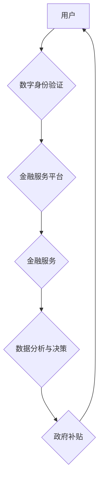

> 数字普惠金融，全民基本收入，人工智能，区块链，大数据，机器学习，普惠式发展

## 1. 背景介绍

21世纪初，全球贫困问题依然严峻。联合国将消除贫困列为其可持续发展目标之一，并设定了2030年实现这一目标的期限。然而，传统的减贫模式面临着诸多挑战，例如：

* **金融服务不平等:** 许多贫困人口缺乏银行账户和金融服务，无法获得贷款、储蓄和保险等金融工具，难以脱贫。
* **信息获取障碍:** 贫困人口往往缺乏信息获取渠道，难以了解政府扶贫政策、就业机会和市场信息，难以提升自身技能和创造财富。
* **基础设施不足:** 许多贫困地区基础设施薄弱，交通、通讯、电力等条件落后，难以吸引投资和促进经济发展。

随着人工智能、区块链、大数据等技术的快速发展，数字普惠金融和全民基本收入等新模式逐渐成为减贫的新方向。

## 2. 核心概念与联系

**2.1 数字普惠金融**

数字普惠金融是指利用数字技术，为低收入群体提供便捷、安全、可负担的金融服务，帮助他们获得金融工具和知识，提升自身经济能力。

**2.2 全民基本收入**

全民基本收入是指政府向所有公民定期发放一定金额的现金，以保障其基本生活需求，实现社会公平正义。

**2.3 核心概念联系**

数字普惠金融和全民基本收入相互补充，共同构成了普惠式发展的核心。数字普惠金融为全民基本收入的实施提供了技术支撑，而全民基本收入则为数字普惠金融的普及提供了市场需求。

**2.4 核心架构**



## 3. 核心算法原理 & 具体操作步骤

**3.1 算法原理概述**

数字普惠金融和全民基本收入的实施需要依赖于一系列复杂的算法，例如：

* **信用评分算法:** 用于评估用户的信用风险，决定是否提供贷款和保险等金融服务。
* **风险控制算法:** 用于识别和预防金融欺诈和洗钱等风险行为。
* **个性化推荐算法:** 用于根据用户的需求和行为，推荐合适的金融产品和服务。
* **资源分配算法:** 用于根据用户的贫困程度和社会贡献，分配政府补贴和基本收入。

**3.2 算法步骤详解**

例如，信用评分算法的具体步骤如下：

1. 收集用户的金融数据，例如收入、支出、贷款记录等。
2. 使用机器学习算法对数据进行分析，提取用户的信用特征。
3. 根据用户的信用特征，计算出用户的信用评分。
4. 根据信用评分，决定是否提供金融服务，以及提供服务的条件。

**3.3 算法优缺点**

数字普惠金融和全民基本收入的算法具有以下优缺点：

* **优点:**

    * 可以提高金融服务的效率和公平性。
    * 可以帮助政府更精准地分配资源，提高社会福利。
    * 可以促进经济发展和社会进步。

* **缺点:**

    * 算法的准确性和公平性需要不断改进。
    * 算法的透明度和可解释性需要提高。
    * 算法的安全性需要加强，防止数据泄露和滥用。

**3.4 算法应用领域**

数字普惠金融和全民基本收入的算法应用领域广泛，例如：

* **金融服务:** 贷款、保险、支付、投资等。
* **社会福利:** 贫困救助、医疗保险、教育补贴等。
* **公共服务:** 交通、能源、住房等。

## 4. 数学模型和公式 & 详细讲解 & 举例说明

**4.1 数学模型构建**

我们可以构建一个数学模型来描述数字普惠金融和全民基本收入的相互作用关系。

假设：

* $P$ 为贫困人口数量。
* $F$ 为金融服务覆盖率。
* $I$ 为全民基本收入水平。
* $E$ 为经济增长率。

则我们可以建立以下数学模型：

$$
\frac{dP}{dt} = -F \cdot I \cdot E
$$

其中：

* $\frac{dP}{dt}$ 为贫困人口数量随时间的变化率。
* $F$ 为金融服务覆盖率，表示金融服务能够覆盖多少贫困人口。
* $I$ 为全民基本收入水平，表示政府发放的基本收入金额。
* $E$ 为经济增长率，表示经济发展水平。

**4.2 公式推导过程**

该模型的推导过程如下：

1. 贫困人口数量的变化率取决于金融服务覆盖率、全民基本收入水平和经济增长率。
2. 当金融服务覆盖率和全民基本收入水平提高时，贫困人口数量的变化率会降低。
3. 当经济增长率提高时，贫困人口数量的变化率会降低。

**4.3 案例分析与讲解**

假设一个国家有1000万贫困人口，金融服务覆盖率为50%，全民基本收入水平为1000元/月，经济增长率为5%。根据上述模型，我们可以计算出该国家的贫困人口数量变化率为：

$$
\frac{dP}{dt} = -0.5 \cdot 1000 \cdot 0.05 = -25000
$$

这意味着该国家的贫困人口数量每年会减少25000人。

## 5. 项目实践：代码实例和详细解释说明

**5.1 开发环境搭建**

为了实现数字普惠金融和全民基本收入的项目，我们需要搭建一个开发环境，包括：

* **服务器:** 用于存储数据和运行应用程序。
* **数据库:** 用于存储用户数据、金融数据和社会福利数据。
* **编程语言:** 用于开发应用程序，例如Python、Java等。
* **机器学习框架:** 用于训练和部署机器学习模型，例如TensorFlow、PyTorch等。

**5.2 源代码详细实现**

以下是一个简单的Python代码示例，用于计算用户的信用评分：

```python
import pandas as pd
from sklearn.model_selection import train_test_split
from sklearn.linear_model import LogisticRegression

# 加载用户数据
data = pd.read_csv("user_data.csv")

# 分割训练集和测试集
X_train, X_test, y_train, y_test = train_test_split(data.drop("credit_score", axis=1), data["credit_score"], test_size=0.2)

# 训练逻辑回归模型
model = LogisticRegression()
model.fit(X_train, y_train)

# 预测测试集的信用评分
y_pred = model.predict(X_test)

# 计算模型的准确率
accuracy = model.score(X_test, y_test)
print(f"模型准确率: {accuracy}")
```

**5.3 代码解读与分析**

该代码首先加载用户数据，然后将数据分割成训练集和测试集。接着，使用逻辑回归模型训练一个信用评分模型。最后，使用训练好的模型预测测试集的信用评分，并计算模型的准确率。

**5.4 运行结果展示**

运行该代码后，会输出模型的准确率。

## 6. 实际应用场景

数字普惠金融和全民基本收入的应用场景广泛，例如：

* **农村贫困地区:** 利用移动支付和微贷款等工具，帮助农民获得金融服务，提升农业生产效率和收入水平。
* **城市低收入群体:** 提供廉价的住房、医疗和教育等社会福利，帮助低收入群体改善生活条件。
* **失业和边缘化人群:** 提供失业救济、职业培训和创业扶持等服务，帮助他们重新融入社会。

**6.4 未来应用展望**

随着人工智能、区块链等技术的不断发展，数字普惠金融和全民基本收入的应用场景将会更加广泛，并发挥更大的作用。

## 7. 工具和资源推荐

**7.1 学习资源推荐**

* **书籍:**

    * 《数字普惠金融》
    * 《全民基本收入》
    * 《人工智能与社会》

* **在线课程:**

    * Coursera: 数字金融
    * edX: 人工智能与机器学习
    * Udacity: 区块链技术

**7.2 开发工具推荐**

* **编程语言:** Python, Java, C++
* **机器学习框架:** TensorFlow, PyTorch, scikit-learn
* **数据库:** MySQL, PostgreSQL, MongoDB
* **云平台:** AWS, Azure, Google Cloud

**7.3 相关论文推荐**

* 《数字普惠金融的挑战与机遇》
* 《全民基本收入的经济学分析》
* 《人工智能与社会公平》

## 8. 总结：未来发展趋势与挑战

**8.1 研究成果总结**

数字普惠金融和全民基本收入是解决全球贫困问题的重要手段，具有巨大的潜力。

**8.2 未来发展趋势**

未来，数字普惠金融和全民基本收入的发展趋势包括：

* **技术创新:** 利用人工智能、区块链等新技术，提高金融服务的效率和公平性。
* **政策支持:** 政府制定相关政策，鼓励数字普惠金融和全民基本收入的发展。
* **社会参与:** 社会各界共同参与，推动数字普惠金融和全民基本收入的普及。

**8.3 面临的挑战**

数字普惠金融和全民基本收入的发展也面临着一些挑战，例如：

* **数据安全:** 保护用户数据安全和隐私。
* **算法公平性:** 确保算法的公平性和透明性。
* **监管机制:** 建立完善的监管机制，防止金融风险和滥用。

**8.4 研究展望**

未来，我们需要继续深入研究数字普惠金融和全民基本收入的理论和实践，探索更有效的减贫模式，实现普惠式发展。

## 9. 附录：常见问题与解答

**9.1 如何获取数字普惠金融服务？**

您可以通过以下方式获取数字普惠金融服务：

* **手机银行:** 下载手机银行应用程序，注册账户，即可享受金融服务。
* **互联网金融平台:** 注册互联网金融平台账户，即可获得贷款、投资等服务。
* **社区金融服务点:** 许多社区设有金融服务点，提供简单的金融服务。

**9.2 全民基本收入的实施条件是什么？**

全民基本收入的实施需要满足以下条件：

* **经济基础:** 国家经济发展水平达到一定程度，能够负担基本收入的支出。
* **社会保障体系:** 完善的社会保障体系，保障基本生活需求。
* **政治制度:** 民主政治制度，保障公民的权利和利益。


作者：禅与计算机程序设计艺术 / Zen and the Art of Computer Programming 
<end_of_turn>