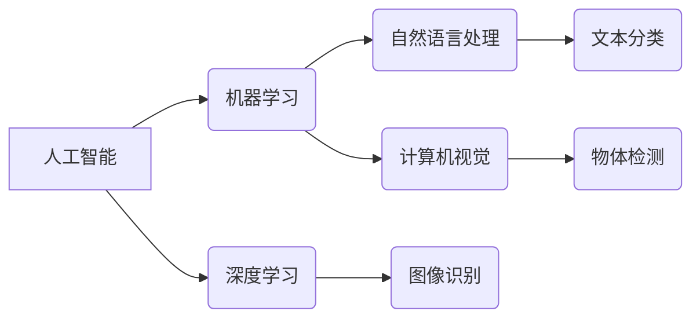

> 人工智能，AI，机器学习，深度学习，自然语言处理，计算机视觉，方向选择，职业规划，学习资源

## 1. 背景介绍

人工智能（AI）正以惊人的速度发展，它正在改变着我们生活的方方面面，从医疗保健到金融，从交通到娱乐。对于年轻人来说，AI 领域充满了机遇和挑战，但同时也充满了迷茫和困惑。如何在这个充满变革的领域找到自己的方向，成为许多年轻人的共同问题。

## 2. 核心概念与联系

**2.1  人工智能 (AI)**

人工智能是指模拟人类智能的计算机系统。它涵盖了广泛的领域，包括机器学习、深度学习、自然语言处理、计算机视觉等。

**2.2  机器学习 (ML)**

机器学习是人工智能的一个子领域，它使计算机能够从数据中学习，无需明确编程。机器学习算法可以识别模式、做出预测和决策。

**2.3  深度学习 (DL)**

深度学习是机器学习的一个子领域，它使用多层神经网络来模拟人类大脑的学习过程。深度学习算法能够处理复杂的数据，并取得了令人瞩目的成果。

**2.4  自然语言处理 (NLP)**

自然语言处理是指使计算机能够理解和处理人类语言。NLP 涉及许多技术，例如文本分类、情感分析、机器翻译等。

**2.5  计算机视觉 (CV)**

计算机视觉是指使计算机能够“看”和理解图像和视频。CV 涉及许多技术，例如图像识别、物体检测、图像分割等。

**2.6  AI 应用场景**

AI 技术已经应用于各个领域，例如：

* **医疗保健:** 疾病诊断、药物研发、个性化治疗
* **金融:** 欺诈检测、风险管理、投资决策
* **交通:** 自动驾驶、交通流量预测、智能交通管理
* **零售:** 商品推荐、个性化营销、库存管理
* **娱乐:** 内容推荐、游戏开发、虚拟现实

**2.7  AI 发展趋势**

* **更强大的计算能力:** 随着硬件技术的进步，AI 模型将变得更加强大。
* **更丰富的训练数据:** 数据是 AI 的燃料，数据量的增加将推动 AI 的发展。
* **更先进的算法:** 研究人员不断开发新的 AI 算法，提高 AI 的性能。
* **更广泛的应用场景:** AI 将应用于更多领域，改变我们的生活方式。

**Mermaid 流程图**



## 3. 核心算法原理 & 具体操作步骤

### 3.1  算法原理概述

机器学习算法的核心原理是通过学习数据中的模式来进行预测或决策。常见的机器学习算法包括：

* **监督学习:** 使用标记数据训练模型，例如分类和回归。
* **无监督学习:** 使用未标记数据发现数据中的模式，例如聚类和降维。
* **强化学习:** 通过试错学习，在环境中获得最大奖励。

### 3.2  算法步骤详解

**监督学习算法的步骤:**

1. **数据收集和预处理:** 收集相关数据并进行清洗、转换和特征工程。
2. **模型选择:** 根据任务选择合适的算法，例如逻辑回归、决策树、支持向量机等。
3. **模型训练:** 使用标记数据训练模型，调整模型参数。
4. **模型评估:** 使用测试数据评估模型性能，例如准确率、召回率、F1-score等。
5. **模型部署:** 将训练好的模型部署到实际应用场景中。

### 3.3  算法优缺点

不同的机器学习算法具有不同的优缺点，需要根据具体任务选择合适的算法。

**例如:**

* **逻辑回归:** 简单易用，但对非线性数据拟合能力有限。
* **决策树:** 可解释性强，但容易过拟合。
* **支持向量机:** 对高维数据处理能力强，但训练时间较长。

### 3.4  算法应用领域

机器学习算法广泛应用于各个领域，例如：

* **图像识别:** 人脸识别、物体检测、图像分类。
* **自然语言处理:** 文本分类、情感分析、机器翻译。
* **推荐系统:** 商品推荐、内容推荐、用户画像。
* **预测分析:** 销售预测、风险评估、客户流失预测。

## 4. 数学模型和公式 & 详细讲解 & 举例说明

### 4.1  数学模型构建

机器学习算法通常基于数学模型，例如线性回归、逻辑回归、支持向量机等。这些模型通过数学公式来描述数据之间的关系。

**例如:**

* **线性回归模型:**

$$
y = w_0 + w_1x_1 + w_2x_2 + ... + w_nx_n + \epsilon
$$

其中:

* $y$ 是预测值
* $w_0, w_1, ..., w_n$ 是模型参数
* $x_1, x_2, ..., x_n$ 是输入特征
* $\epsilon$ 是误差项

### 4.2  公式推导过程

机器学习算法的训练过程通常涉及优化模型参数，使模型预测值与真实值之间的误差最小化。

**例如:**

* **线性回归模型的损失函数:**

$$
Loss = \frac{1}{n} \sum_{i=1}^{n} (y_i - \hat{y}_i)^2
$$

其中:

* $n$ 是样本数量
* $y_i$ 是真实值
* $\hat{y}_i$ 是预测值

通过梯度下降算法，可以迭代更新模型参数，使损失函数最小化。

### 4.3  案例分析与讲解

**例如:**

* 使用线性回归模型预测房价。

输入特征包括房屋面积、房间数量、地理位置等。

通过训练模型，可以得到房价预测公式，并根据新的房屋信息进行预测。

## 5. 项目实践：代码实例和详细解释说明

### 5.1  开发环境搭建

* **操作系统:** Linux, macOS, Windows
* **编程语言:** Python
* **机器学习库:** scikit-learn, TensorFlow, PyTorch
* **数据处理库:** Pandas, NumPy

### 5.2  源代码详细实现

```python
from sklearn.linear_model import LinearRegression
from sklearn.model_selection import train_test_split
from sklearn.metrics import mean_squared_error

# 加载数据
data = pd.read_csv('house_price.csv')

# 划分训练集和测试集
X = data[['area', 'rooms']]
y = data['price']
X_train, X_test, y_train, y_test = train_test_split(X, y, test_size=0.2, random_state=42)

# 创建线性回归模型
model = LinearRegression()

# 训练模型
model.fit(X_train, y_train)

# 预测测试集数据
y_pred = model.predict(X_test)

# 计算模型性能
mse = mean_squared_error(y_test, y_pred)
print(f'Mean Squared Error: {mse}')
```

### 5.3  代码解读与分析

* **数据加载:** 使用 Pandas 库加载数据。
* **数据划分:** 使用 train_test_split 函数将数据划分成训练集和测试集。
* **模型创建:** 使用 LinearRegression 类创建线性回归模型。
* **模型训练:** 使用 fit 方法训练模型。
* **模型预测:** 使用 predict 方法预测测试集数据。
* **模型性能评估:** 使用 mean_squared_error 函数计算模型性能。

### 5.4  运行结果展示

运行代码后，会输出模型的均方误差值，用于评估模型的预测精度。

## 6. 实际应用场景

### 6.1  医疗保健

* **疾病诊断:** 使用机器学习算法分析患者的医疗记录、影像数据等，辅助医生诊断疾病。
* **药物研发:** 使用机器学习算法分析药物分子结构和生物活性数据，加速药物研发过程。
* **个性化治疗:** 使用机器学习算法分析患者的基因信息、生活方式等，制定个性化的治疗方案。

### 6.2  金融

* **欺诈检测:** 使用机器学习算法分析交易数据，识别异常交易行为，防止欺诈行为。
* **风险管理:** 使用机器学习算法分析客户信用评分、投资组合等数据，评估风险，制定风险管理策略。
* **投资决策:** 使用机器学习算法分析市场数据、公司财务数据等，辅助投资决策。

### 6.3  交通

* **自动驾驶:** 使用机器学习算法分析传感器数据，控制车辆行驶，实现自动驾驶功能。
* **交通流量预测:** 使用机器学习算法分析交通流量数据，预测未来交通流量，优化交通管理。
* **智能交通管理:** 使用机器学习算法分析交通数据，优化交通信号灯控制、道路规划等，提高交通效率。

### 6.4  未来应用展望

AI 技术将继续发展，应用于更多领域，改变我们的生活方式。

* **更智能的个人助理:** AI 助手将能够更好地理解我们的需求，提供更个性化的服务。
* **更安全的社会:** AI 技术将用于提高安全监控、预防犯罪等。
* **更可持续的未来:** AI 技术将用于优化能源使用、减少环境污染等。

## 7. 工具和资源推荐

### 7.1  学习资源推荐

* **在线课程:** Coursera, edX, Udacity
* **书籍:**
    * 《深度学习》
    * 《机器学习实战》
    * 《Python机器学习》
* **博客:**
    * Towards Data Science
    * Machine Learning Mastery

### 7.2  开发工具推荐

* **Python:** 
* **Jupyter Notebook:** 用于代码编写和可视化
* **TensorFlow:** 深度学习框架
* **PyTorch:** 深度学习框架
* **scikit-learn:** 机器学习库

### 7.3  相关论文推荐

* **《ImageNet Classification with Deep Convolutional Neural Networks》**
* **《Attention Is All You Need》**
* **《BERT: Pre-training of Deep Bidirectional Transformers for Language Understanding》**

## 8. 总结：未来发展趋势与挑战

### 8.1  研究成果总结

近年来，AI 技术取得了令人瞩目的成果，例如图像识别、自然语言处理、语音识别等领域取得了突破性进展。

### 8.2  未来发展趋势

* **更强大的计算能力:** 随着硬件技术的进步，AI 模型将变得更加强大。
* **更丰富的训练数据:** 数据是 AI 的燃料，数据量的增加将推动 AI 的发展。
* **更先进的算法:** 研究人员不断开发新的 AI 算法，提高 AI 的性能。
* **更广泛的应用场景:** AI 将应用于更多领域，改变我们的生活方式。

### 8.3  面临的挑战

* **数据隐私和安全:** AI 算法依赖于大量数据，如何保护数据隐私和安全是一个重要挑战。
* **算法偏见:** AI 算法可能存在偏见，导致不公平的结果。
* **AI 伦理:** 如何确保 AI 技术的负责任使用是一个重要的伦理问题。

### 8.4  研究展望

未来，AI 研究将继续探索更强大的算法、更丰富的训练数据、更安全的应用场景等方面。

## 9. 附录：常见问题与解答

**常见问题:**

* **如何学习 AI？**

**解答:**

* 参加在线课程、阅读书籍、参与开源项目等。

* **哪些 AI 技能最受欢迎？**

**解答:**

* 机器学习、深度学习、自然语言处理、计算机视觉等。

* **AI 领域有哪些职业机会？**

**解答:**

* AI 工程师、数据科学家、机器学习工程师、AI 研究员等。


作者：禅与计算机程序设计艺术 / Zen and the Art of Computer Programming 
<end_of_turn>