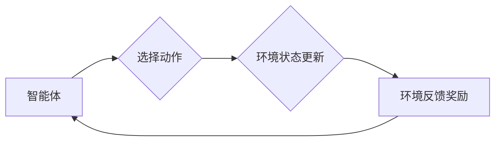

> 强化学习，学习率，折扣因子，算法原理，数学模型，代码实现，应用场景

## 1. 背景介绍

强化学习 (Reinforcement Learning, RL) 作为机器学习领域的重要分支，近年来取得了显著进展，并在机器人控制、游戏 AI、推荐系统等领域展现出强大的应用潜力。强化学习的核心在于训练智能体在环境中通过与环境交互，学习最优策略，以最大化累积奖励。

在强化学习算法中，学习率和折扣因子是两个至关重要的超参数，它们直接影响着学习过程的效率和最终策略的性能。学习率决定了模型参数更新的步长，而折扣因子则控制了未来奖励的权重。选择合适的学习率和折扣因子对于强化学习算法的成功至关重要。

## 2. 核心概念与联系

**2.1 强化学习基本概念**

强化学习的核心要素包括：

* **智能体 (Agent):**  学习和决策的实体。
* **环境 (Environment):** 智能体所处的外部世界。
* **状态 (State):** 环境的当前描述。
* **动作 (Action):** 智能体在特定状态下可以执行的操作。
* **奖励 (Reward):** 环境对智能体动作的反馈，可以是正向或负向。
* **策略 (Policy):** 智能体在不同状态下选择动作的规则。

**2.2 学习率与折扣因子的关系**

学习率和折扣因子共同影响着强化学习算法的学习过程：

* **学习率 (Learning Rate):** 控制模型参数更新的步长。学习率过大可能导致模型震荡，无法收敛；学习率过小则会导致学习过程缓慢。
* **折扣因子 (Discount Factor):** 控制未来奖励的权重。折扣因子越接近1，则未来奖励的影响越大；折扣因子越接近0，则未来奖励的影响越小。

**2.3  核心概念流程图**



## 3. 核心算法原理 & 具体操作步骤

**3.1 算法原理概述**

强化学习算法的核心思想是通过不断与环境交互，学习一个最优策略，使得智能体在环境中获得最大的累积奖励。常用的强化学习算法包括：

* **Q-学习:** 通过构建一个Q表，存储每个状态-动作对的期望奖励，并通过迭代更新Q表，学习最优策略。
* **SARSA:** 与Q-学习类似，但SARSA在更新Q表时使用的是当前状态-动作对的实际奖励，而不是期望奖励。
* **Deep Q-Network (DQN):** 将Q-学习算法与深度神经网络结合，能够处理高维状态空间。

**3.2 算法步骤详解**

以Q-学习算法为例，其具体步骤如下：

1. 初始化Q表，将所有状态-动作对的Q值设置为0。
2. 在环境中进行交互，观察当前状态和环境反馈的奖励。
3. 根据当前状态和动作选择策略，选择一个动作执行。
4. 更新Q表，根据Bellman方程更新状态-动作对的Q值。
5. 重复步骤2-4，直到Q表收敛。

**3.3 算法优缺点**

* **优点:** 
    * 能够学习最优策略。
    * 适用于离散状态空间和动作空间。
* **缺点:** 
    * 对于高维状态空间，Q表会变得非常庞大。
    * 难以处理连续状态空间和动作空间。

**3.4 算法应用领域**

* **机器人控制:** 训练机器人执行复杂的任务，例如导航、抓取等。
* **游戏 AI:** 训练游戏 AI 策略，例如玩游戏、打败对手等。
* **推荐系统:** 训练推荐系统，推荐用户感兴趣的内容。

## 4. 数学模型和公式 & 详细讲解 & 举例说明

**4.1 数学模型构建**

强化学习的数学模型通常由以下几个要素组成：

* **状态空间 (S):** 所有可能的环境状态的集合。
* **动作空间 (A):** 智能体在每个状态下可以执行的动作集合。
* **策略 (π):** 智能体在每个状态下选择动作的概率分布。
* **奖励函数 (R):** 描述环境对智能体动作的反馈，通常是一个从状态-动作对到实数的函数。
* **折扣因子 (γ):** 控制未来奖励的权重，通常取值在0到1之间。

**4.2 公式推导过程**

强化学习的目标是找到一个最优策略，使得智能体在环境中获得最大的累积奖励。

**Bellman方程:**

$$
Q^*(s,a) = R(s,a) + \gamma \max_{a'} Q^*(s',a')
$$

其中：

* $Q^*(s,a)$ 是状态 $s$ 下执行动作 $a$ 的期望奖励。
* $R(s,a)$ 是状态 $s$ 下执行动作 $a$ 的即时奖励。
* $\gamma$ 是折扣因子。
* $s'$ 是执行动作 $a$ 后进入的下一个状态。
* $a'$ 是在下一个状态 $s'$ 下可以执行的动作。

**4.3 案例分析与讲解**

假设有一个简单的强化学习环境，智能体可以执行两个动作：向上和向下。环境的状态是智能体的当前位置，奖励函数是：

* 当智能体到达目标位置时，奖励为10。
* 当智能体移动到其他位置时，奖励为0。

折扣因子设置为0.9。

使用Bellman方程可以迭代更新每个状态-动作对的Q值，最终找到最优策略，使得智能体能够到达目标位置并获得最大奖励。

## 5. 项目实践：代码实例和详细解释说明

**5.1 开发环境搭建**

* Python 3.x
* TensorFlow 或 PyTorch

**5.2 源代码详细实现**

```python
import numpy as np

# 定义状态空间和动作空间
states = [0, 1, 2, 3, 4]
actions = ['up', 'down']

# 定义奖励函数
reward_function = {
    (0, 'up'): 0,
    (0, 'down'): 0,
    (1, 'up'): 0,
    (1, 'down'): 0,
    (2, 'up'): 0,
    (2, 'down'): 0,
    (3, 'up'): 0,
    (3, 'down'): 0,
    (4, 'up'): 10,  # 到达目标位置奖励
    (4, 'down'): 0
}

# 定义折扣因子
gamma = 0.9

# 初始化Q表
q_table = np.zeros((len(states), len(actions)))

# Q-学习算法
def q_learning(episodes):
    for episode in range(episodes):
        state = 0
        while state != 4:
            action = np.argmax(q_table[state])  # 选择动作
            next_state, reward = get_next_state_and_reward(state, action)
            q_table[state, action] = reward + gamma * np.max(q_table[next_state])
            state = next_state

# 获取下一个状态和奖励
def get_next_state_and_reward(state, action):
    # ...

# 运行Q-学习算法
q_learning(1000)

# 打印Q表
print(q_table)
```

**5.3 代码解读与分析**

* 代码首先定义了状态空间、动作空间、奖励函数和折扣因子。
* 然后初始化了一个Q表，用于存储每个状态-动作对的期望奖励。
* Q-学习算法的核心是迭代更新Q表，使用Bellman方程计算每个状态-动作对的期望奖励。
* 代码中使用`np.argmax()`函数选择动作，选择Q值最大的动作。
* `get_next_state_and_reward()`函数模拟环境的交互，根据当前状态和动作获取下一个状态和奖励。

**5.4 运行结果展示**

运行代码后，会输出一个Q表，其中每个元素代表了在特定状态下执行特定动作的期望奖励。

## 6. 实际应用场景

**6.1 游戏 AI**

强化学习算法可以训练游戏 AI 策略，例如玩游戏、打败对手等。例如，AlphaGo 使用强化学习算法战胜了世界围棋冠军。

**6.2 机器人控制**

强化学习算法可以训练机器人执行复杂的任务，例如导航、抓取等。例如，机器人可以使用强化学习算法学习如何自主导航在复杂环境中。

**6.3 推荐系统**

强化学习算法可以训练推荐系统，推荐用户感兴趣的内容。例如，Netflix 使用强化学习算法推荐电影和电视剧。

**6.4 未来应用展望**

强化学习算法在未来将有更广泛的应用，例如：

* 自动驾驶
* 医疗诊断
* 金融交易

## 7. 工具和资源推荐

**7.1 学习资源推荐**

* **书籍:**
    * Reinforcement Learning: An Introduction by Richard S. Sutton and Andrew G. Barto
    * Deep Reinforcement Learning Hands-On by Maxim Lapan
* **在线课程:**
    * Coursera: Reinforcement Learning Specialization by David Silver
    * Udacity: Deep Reinforcement Learning Nanodegree

**7.2 开发工具推荐**

* **TensorFlow:** 深度学习框架，支持强化学习算法的实现。
* **PyTorch:** 深度学习框架，支持强化学习算法的实现。
* **OpenAI Gym:** 强化学习环境库，提供各种标准强化学习环境。

**7.3 相关论文推荐**

* Deep Q-Network (DQN)
* Proximal Policy Optimization (PPO)
* Trust Region Policy Optimization (TRPO)

## 8. 总结：未来发展趋势与挑战

**8.1 研究成果总结**

近年来，强化学习算法取得了显著进展，在许多领域取得了成功应用。

**8.2 未来发展趋势**

* **更强大的算法:** 研究更强大的强化学习算法，能够处理更复杂的环境和任务。
* **更有效的训练方法:** 研究更有效的训练方法，例如迁移学习和联邦学习。
* **更安全的强化学习:** 研究更安全的强化学习算法，避免算法出现不可预知的行为。

**8.3 面临的挑战**

* **样本效率:** 强化学习算法通常需要大量的样本数据进行训练。
* **探索与利用的平衡:** 强化学习算法需要在探索新策略和利用已知策略之间找到平衡。
* **可解释性:** 强化学习算法的决策过程通常难以解释。

**8.4 研究展望**

未来，强化学习将继续是一个重要的研究方向，有望在更多领域取得突破。


## 9. 附录：常见问题与解答

**9.1 如何选择合适的学习率和折扣因子？**

学习率和折扣因子是强化学习算法中的超参数，需要根据具体任务和环境进行调整。

* **学习率:** 过大可能导致模型震荡，无法收敛；过小则会导致学习过程缓慢。可以使用学习率衰减策略，逐渐降低学习率。
* **折扣因子:** 越接近1，则未来奖励的影响越大；越接近0，则未来奖励的影响越小。通常情况下，折扣因子取值在0.9到1之间。

**9.2 强化学习算法与监督学习算法有什么区别？**

* **监督学习:** 使用标记数据训练模型，预测输出。
* **强化学习:** 使用奖励信号训练模型，学习最优策略。

**9.3 强化学习算法有哪些应用场景？**

强化学习算法的应用场景非常广泛，例如：

* 游戏 AI
* 机器人控制
* 推荐系统
* 自动驾驶
* 医疗诊断


作者：禅与计算机程序设计艺术 / Zen and the Art of Computer Programming 
<end_of_turn>