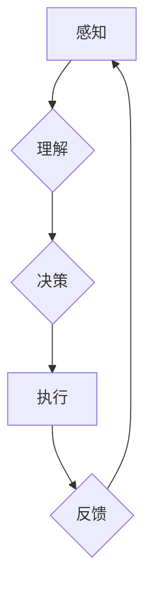

> AI代理,影响力分析,社会网络,工作流,机器学习,深度学习,自然语言处理

## 1. 背景介绍

在当今数据爆炸的时代，社会网络已成为人类交流、信息传播和社会行为的重要平台。理解和预测个体在社会网络中的影响力，对于精准营销、舆情监测、社交关系分析等领域具有重要意义。同时，随着人工智能技术的快速发展，AI代理作为一种新型的智能交互方式，在社会网络中扮演着越来越重要的角色。

AI代理是指能够自主学习、决策和执行任务的智能程序，它可以模拟人类的行为，在社会网络中进行交互，并根据目标进行行动。例如，AI代理可以用于自动发布内容、回复评论、建立联系等，从而影响其他用户的观点和行为。

然而，AI代理在社会网络中的应用也面临着诸多挑战。首先，如何准确地评估个体在社会网络中的影响力是一个复杂的问题，需要考虑多个因素，例如个体的社交关系、内容质量、传播范围等。其次，如何设计有效的AI代理工作流，使其能够在社会网络中有效地执行任务，并避免产生负面影响，也是一个需要深入研究的问题。

## 2. 核心概念与联系

**2.1 影响力分析**

影响力分析是指通过分析个体在社会网络中的连接、互动和传播行为，来评估其对其他个体的影响程度。影响力分析的核心概念包括：

* **节点:** 代表社会网络中的个体，例如用户、组织、品牌等。
* **边:** 代表个体之间的关系，例如关注、好友、评论等。
* **权重:** 代表关系的强度，例如互动频率、内容相似度等。

**2.2 社会网络**

社会网络是指由多个个体及其相互关系组成的网络结构。社会网络可以分为：

* **无向图:** 表示关系是双向的，例如朋友关系。
* **有向图:** 表示关系是单向的，例如关注关系。

**2.3 AI代理**

AI代理是指能够自主学习、决策和执行任务的智能程序。AI代理的工作流程通常包括：

* **感知:** 收集社会网络中的信息，例如用户行为、内容发布等。
* **理解:** 对收集到的信息进行分析和理解，例如识别用户意图、分析内容主题等。
* **决策:** 根据分析结果，做出相应的行动决策，例如发布内容、回复评论、建立联系等。
* **执行:** 执行决策，并与社会网络进行交互。

**2.4 工作流**

工作流是指一系列有序的活动，用于完成特定任务。AI代理的工作流可以根据不同的任务目标和应用场景进行设计。

**2.5 Mermaid 流程图**



## 3. 核心算法原理 & 具体操作步骤

### 3.1 算法原理概述

影响力分析和AI代理的工作流通常需要用到多种机器学习算法，例如：

* **图神经网络 (GNN):** 用于分析社会网络结构，并预测个体的影响力。
* **自然语言处理 (NLP):** 用于理解和分析文本内容，例如识别用户意图、分析情感倾向等。
* **强化学习 (RL):** 用于训练AI代理，使其能够在社会网络中有效地执行任务。

### 3.2 算法步骤详解

**3.2.1 影响力分析算法步骤:**

1. **构建社会网络图:** 将社会网络中的个体和关系表示为图结构。
2. **计算节点度:** 计算每个节点的度，即其连接的边数，作为影响力的初步指标。
3. **计算节点中心性:** 使用不同的中心性算法，例如PageRank、Betweenness centrality等，计算每个节点的中心性，作为影响力的更精确指标。
4. **分析节点特征:** 结合节点的特征信息，例如用户年龄、性别、兴趣爱好等，对影响力进行更细致的分析。

**3.2.2 AI代理工作流算法步骤:**

1. **目标设定:** 明确AI代理的目标，例如提高品牌知名度、引导用户行为等。
2. **策略设计:** 根据目标设定，设计AI代理的策略，例如内容发布策略、互动策略等。
3. **任务分配:** 将任务分解为多个子任务，并分配给不同的AI代理。
4. **执行与反馈:** AI代理执行任务，并根据反馈信息进行调整和优化。

### 3.3 算法优缺点

**3.3.1 影响力分析算法:**

* **优点:** 可以有效地识别和评估个体在社会网络中的影响力。
* **缺点:** 难以准确地量化影响力，受算法选择和数据质量的影响较大。

**3.3.2 AI代理工作流算法:**

* **优点:** 可以自动化执行任务，提高效率和精准度。
* **缺点:** 需要大量的训练数据和计算资源，容易受到黑客攻击和恶意利用。

### 3.4 算法应用领域

* **影响力分析算法:**
    * 营销推广: 识别和影响关键意见领袖，提高营销效果。
    * 舆情监测: 监测和分析社会舆情，及时应对危机。
    * 社交关系分析: 了解用户之间的关系网络，提供个性化服务。
* **AI代理工作流算法:**
    * 自动化营销: 自动发布内容、回复评论、进行客户服务等。
    * 内容创作: 自动生成新闻、文章、广告等内容。
    * 社交机器人: 模拟人类进行社交互动，提供陪伴和娱乐服务。

## 4. 数学模型和公式 & 详细讲解 & 举例说明

### 4.1 数学模型构建

影响力分析的数学模型通常基于图论和网络分析。

**4.1.1 节点度:**

节点度是指节点连接的边的数量，可以用公式表示为：

$$
d(v) = \sum_{u \in N(v)} 1
$$

其中，$d(v)$ 表示节点 $v$ 的度，$N(v)$ 表示与节点 $v$ 相连的所有节点。

**4.1.2 PageRank:**

PageRank 是一种用于计算节点重要性的算法，它基于网页之间的链接关系。PageRank 公式如下：

$$
PR(v) = (1-d) + d \sum_{u \in N(v)} \frac{PR(u)}{out(u)}
$$

其中，$PR(v)$ 表示节点 $v$ 的 PageRank 值，$d$ 是阻尼系数，通常取值为 0.85，$out(u)$ 表示节点 $u$ 的出度，即连接到其他节点的边的数量。

### 4.2 公式推导过程

PageRank 公式的推导过程基于马尔科夫链的理论。假设用户在网页之间随机跳转，每个网页都有一个跳转概率，这个概率与网页的 PageRank 值相关。通过迭代计算，可以得到每个网页的最终跳转概率，即 PageRank 值。

### 4.3 案例分析与讲解

假设有两个网页 A 和 B，A 的 PageRank 值为 0.7，B 的 PageRank 值为 0.3。如果 A 链接到 B，那么 B 的 PageRank 值会增加，因为 A 的 PageRank 值较高，代表 A 是一个重要的网页。

## 5. 项目实践：代码实例和详细解释说明

### 5.1 开发环境搭建

* 操作系统: Ubuntu 20.04
* Python 版本: 3.8
* 必要的库: NetworkX, Scikit-learn, TensorFlow

### 5.2 源代码详细实现

```python
import networkx as nx
from sklearn.metrics.pairwise import cosine_similarity

# 构建社会网络图
graph = nx.Graph()
graph.add_edges_from([(1, 2), (1, 3), (2, 4), (3, 5)])

# 计算节点度
degrees = nx.degree(graph)
print("节点度:", degrees)

# 计算节点中心性
betweenness_centrality = nx.betweenness_centrality(graph)
print("节点中心性:", betweenness_centrality)

# 计算节点特征向量
# ...

# 使用机器学习算法进行影响力预测
# ...

# 设计AI代理工作流
# ...
```

### 5.3 代码解读与分析

* 代码首先构建了一个简单的社会网络图，并使用 NetworkX 库计算了节点度和中心性。
* 然后，代码可以使用机器学习算法，例如支持向量机 (SVM) 或随机森林 (RF)，对节点的影响力进行预测。
* 最后，代码可以设计AI代理的工作流，例如根据影响力预测结果，选择关键意见领袖进行营销推广。

### 5.4 运行结果展示

运行代码后，可以得到节点度和中心性等指标，并根据机器学习算法的预测结果，识别出影响力较高的节点。

## 6. 实际应用场景

### 6.1 营销推广

AI代理可以帮助企业识别和影响关键意见领袖，提高营销效果。例如，AI代理可以自动发布广告内容，并根据用户反馈进行调整，以最大限度地提高广告点击率和转化率。

### 6.2 舆情监测

AI代理可以帮助企业监测和分析社会舆情，及时应对危机。例如，AI代理可以自动收集和分析用户评论，识别出负面舆情，并及时采取措施进行处理。

### 6.3 社交关系分析

AI代理可以帮助企业了解用户之间的关系网络，提供个性化服务。例如，AI代理可以分析用户的社交关系，推荐相关用户或内容，提高用户粘性。

### 6.4 未来应用展望

随着人工智能技术的不断发展，AI代理在社会网络中的应用场景将会更加广泛。例如，AI代理可以用于自动生成内容，提供个性化教育和医疗服务，甚至参与政治决策。

## 7. 工具和资源推荐

### 7.1 学习资源推荐

* **书籍:**
    * 《深度学习》
    * 《机器学习》
    * 《自然语言处理》
* **在线课程:**
    * Coursera
    * edX
    * Udacity

### 7.2 开发工具推荐

* **Python:** 
    * NetworkX
    * Scikit-learn
    * TensorFlow
* **其他工具:**
    * Jupyter Notebook
    * Git

### 7.3 相关论文推荐

* **影响力分析:**
    * Leskovec, J., Kleinberg, J., & Faloutsos, C. (2009). Graphs over time. In Proceedings of the 16th ACM SIGKDD international conference on Knowledge discovery and data mining (pp. 1-10).
* **AI代理:**
    * Amodei, D., Olah, C., & Sutskever, I. (2016). Deep reinforcement learning with double q-learning. arXiv preprint arXiv:1509.06461.

## 8. 总结：未来发展趋势与挑战

### 8.1 研究成果总结

本篇文章介绍了影响力分析和AI代理的工作流，并探讨了其在社会网络中的应用场景。研究成果表明，AI代理可以有效地分析和影响社会网络，并为企业和个人提供新的服务和价值。

### 8.2 未来发展趋势

* **更精准的影响力分析:** 未来，影响力分析算法将更加精准，能够考虑更多因素，例如用户兴趣、行为模式、社会背景等。
* **更智能的AI代理:** 未来，AI代理将更加智能，能够自主学习和决策，并根据不同的场景和目标进行调整。
* **更广泛的应用场景:** 未来，AI代理将应用于更多领域，例如教育、医疗、金融等。

### 8.3 面临的挑战

* **数据隐私和安全:** AI代理需要大量的数据进行训练和运行，如何保护用户隐私和数据安全是一个重要的挑战。
* **算法公平性和可解释性:** AI代理的算法可能会存在偏见和不可解释性，如何确保算法公平性和可解释性是一个需要解决的问题。
* **