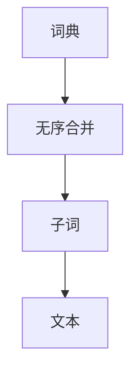

                 

# BPE算法：子词分词的效率之选

> 关键词：BPE算法，子词分词，分词效率，无序合并，词典合并，语言处理，自然语言处理(NLP)

## 1. 背景介绍

### 1.1 问题由来

在自然语言处理(Natural Language Processing, NLP)中，分词是处理文本数据的基础任务之一。分词的目的是将连续的字符序列分解成有意义的词语，为后续的文本处理、信息提取等任务奠定基础。传统的分词方法大多基于规则或词典，如正则表达式、最大匹配、前缀词典等，但这些方法往往需要大量的人工干预和资源消耗，且对于新词汇的处理能力有限。

近年来，随着深度学习技术的崛起，基于统计的子词分词方法逐渐成为主流。子词分词方法通过将文本分解为更小的子词单元，不仅能够提升分词的准确性，还能处理新词，满足大规模文本数据的需求。其中，BPE算法（Bidirectional Paragraph Embedding，双向并行编码器算法）是最具代表性的一种，以其高效、简单、可解释性强的特点，被广泛应用于各种语言处理任务中。

### 1.2 问题核心关键点

BPE算法作为一种子词分词方法，核心思想是将输入的文本序列看作两个方向的并行编码器，分别从左向右和右向左进行编码。算法通过无序合并词典中的词汇，使得生成的子词能够满足条件：

1. 任意两个子词合并后仍出现在词汇表中。
2. 任意一个子词在词典中独立出现，不包含其他子词。

这一思想可以用于处理各种自然语言，包括中文、英文、法语等。BPE算法通过词典合并操作，逐步生成最优的子词序列，最终形成高质量的分词结果。

## 2. 核心概念与联系

### 2.1 核心概念概述

为更好地理解BPE算法，本节将介绍几个密切相关的核心概念：

- BPE算法（Bidirectional Paragraph Embedding，双向并行编码器算法）：一种基于词典合并的子词分词方法，通过无序合并词典中的词汇，生成满足特定条件的子词序列，提升分词的准确性和效率。
- 无序合并（Order-Agnostic Merge）：BPE算法的核心操作，指从词典中随机选取两个词，将其合并为一个新的子词，且新子词的生成不受词典中词语的顺序影响。
- 词典（Vocabulary）：BPE算法中需要预处理好的词汇表，包括所有需要保留的词汇和子词。
- 子词（Subword）：由一个或多个单词合并生成的更小的词汇单元，可以用于处理新词和罕见词汇。

这些核心概念之间的逻辑关系可以通过以下Mermaid流程图来展示：



这个流程图展示了大语言模型微调的各个关键概念及其之间的关系：

1. 词典是BPE算法的基础，包含所有需要保留的词汇和子词。
2. 无序合并是BPE算法的核心操作，通过随机选取两个词进行合并，生成新的子词。
3. 子词是BPE算法的最终输出，用于代替原始词汇进行文本处理。

这些概念共同构成了BPE算法的理论基础，为实现高效的子词分词提供了可能的实现路径。

## 3. 核心算法原理 & 具体操作步骤

### 3.1 算法原理概述

BPE算法的核心在于词典的合并操作，通过不断合并词典中相似度高的词汇，生成新的子词。具体而言，BPE算法通过以下几个步骤实现：

1. 构建初始词典：从预训练语言模型中提取词汇表，包括所有的词汇和子词。
2. 无序合并操作：随机选取词典中两个相似的词汇，合并为一个新的子词。合并后的子词需要满足两个条件：任意两个子词合并后仍出现在词汇表中，且任意一个子词在词典中独立出现，不包含其他子词。
3. 迭代合并：重复进行无序合并操作，直至满足预设的合并次数或新的子词不再出现。
4. 输出结果：生成的所有子词序列即为最终的分词结果。

BPE算法的设计理念是，通过逐步合并词典中的词汇，生成尽可能小的子词，以便更好地处理新词和罕见词汇，提升分词的效率和准确性。

### 3.2 算法步骤详解

BPE算法步骤如下：

1. 初始化词典：将预训练语言模型中所有词汇和子词构建成初始词典，记为 $V$。
2. 无序合并操作：从 $V$ 中随机选取两个词汇 $w_1$ 和 $w_2$，计算它们之间的相似度 $s$，如果 $s$ 大于预设的阈值，则将 $w_1$ 和 $w_2$ 合并为一个新的子词 $w$。合并后的子词 $w$ 需要满足两个条件：
   - 任意两个子词合并后仍出现在词汇表中。
   - 任意一个子词在词典中独立出现，不包含其他子词。
   - 重复进行上述操作，直至合并次数达到预设的阈值 $k$ 或新的子词不再出现。
3. 输出结果：生成的所有子词序列即为最终的分词结果。

### 3.3 算法优缺点

BPE算法具有以下优点：

- 高效：BPE算法通过无序合并词典中的词汇，生成新的子词，使得分词过程高效快捷。
- 简单：BPE算法的实现简单，易于理解和实现。
- 可解释性：BPE算法的每一步操作都有明确的含义，能够解释其分词过程。

同时，BPE算法也存在以下局限性：

- 依赖词典：BPE算法的分词效果依赖于词典的质量和完备性，需要根据具体任务进行预处理。
- 生成子词数量有限：BPE算法生成的子词数量有限，对于一些新词或者罕见词汇，无法处理。
- 计算复杂度：BPE算法的计算复杂度较高，尤其是合并次数较多的情况下。

### 3.4 算法应用领域

BPE算法作为一种高效的子词分词方法，已经在多种语言处理任务中得到了广泛应用，例如：

- 机器翻译：将源语言文本翻译成目标语言。BPE算法能够处理新词和罕见词汇，提升机器翻译的准确性。
- 文本分类：对文本进行分类。BPE算法能够处理新词，提升文本分类的效果。
- 命名实体识别：识别文本中的实体。BPE算法能够处理新词和罕见词汇，提升命名实体识别的准确性。
- 情感分析：对文本的情感进行分类。BPE算法能够处理新词，提升情感分析的效果。

除了上述这些经典任务外，BPE算法还被创新性地应用到更多场景中，如对话系统、推荐系统、文本生成等，为自然语言处理带来了全新的突破。

## 4. 数学模型和公式 & 详细讲解 & 举例说明

### 4.1 数学模型构建

BPE算法的基本数学模型可以描述为：

- 初始词典 $V=\{w_1, w_2, \cdots, w_n\}$，其中 $w_i$ 表示第 $i$ 个词汇。
- 合并次数 $k$，表示最多可以合并的次数。
- 合并阈值 $s$，表示两个词汇合并的相似度阈值。

### 4.2 公式推导过程

设 $w$ 表示合并后的新词汇，则其定义可以表示为：

$$
w = w_1 + w_2
$$

其中 $w_1$ 和 $w_2$ 为词典中两个相似的词汇，满足：

$$
s(w_1, w_2) > s(w_1, w_2)
$$

其中 $s(w_1, w_2)$ 表示两个词汇之间的相似度。

BPE算法通过逐步合并词典中的词汇，生成新的子词。设 $V_k$ 表示第 $k$ 次合并后生成的词汇表，则有：

$$
V_{k+1} = V_k + \{w|w_1, w_2 \in V_k, s(w_1, w_2) > s(w_1, w_2)\}
$$

上述公式表示，在每次合并后，词汇表中增加了新的合并词汇 $w$，满足上述条件。重复上述过程，直至合并次数达到预设的阈值 $k$。

### 4.3 案例分析与讲解

以中文分词为例，BPE算法如何应用？

假设词典为：

$$
V = \{\text{我}, \text{是}, \text{中国}, \text{的}, \text{人民}\}
$$

设 $s(w_1, w_2)$ 表示两个词汇之间的相似度，假设 $s(\text{我}, \text{是})=0.8$，$s(\text{是}, \text{中国})=0.9$，$s(\text{中国}, \text{的})=0.7$，$s(\text{的}, \text{人民})=0.6$。

第一次合并操作：

$$
\text{我} + \text{是} = \text{我是}
$$

更新后的词典为：

$$
V_1 = \{\text{我}, \text{是}, \text{中国}, \text{的}, \text{人民}, \text{我是}\}
$$

第二次合并操作：

$$
\text{我} + \text{是} = \text{我是}
$$
$$
\text{是} + \text{中国} = \text{是中国}
$$
$$
\text{中国} + \text{的} = \text{中国的}
$$

更新后的词典为：

$$
V_2 = \{\text{我}, \text{是}, \text{中国}, \text{的}, \text{人民}, \text{我是}, \text{是中国}, \text{中国的}\}
$$

第三次合并操作：

$$
\text{我} + \text{是} = \text{我是}
$$
$$
\text{是} + \text{中国} = \text{是中国}
$$
$$
\text{中国} + \text{的} = \text{中国的}
$$
$$
\text{的} + \text{人民} = \text{的人民}
$$

更新后的词典为：

$$
V_3 = \{\text{我}, \text{是}, \text{中国}, \text{的}, \text{人民}, \text{我是}, \text{是中国}, \text{中国的}, \text{的人民}\}
$$

重复上述过程，直至合并次数达到预设的阈值 $k$ 或新的子词不再出现。

## 5. 项目实践：代码实例和详细解释说明

### 5.1 开发环境搭建

在进行BPE算法实践前，我们需要准备好开发环境。以下是使用Python进行PyTorch开发的环境配置流程：

1. 安装Anaconda：从官网下载并安装Anaconda，用于创建独立的Python环境。

2. 创建并激活虚拟环境：
```bash
conda create -n pytorch-env python=3.8 
conda activate pytorch-env
```

3. 安装PyTorch：根据CUDA版本，从官网获取对应的安装命令。例如：
```bash
conda install pytorch torchvision torchaudio cudatoolkit=11.1 -c pytorch -c conda-forge
```

4. 安装Sacremoses库：
```bash
pip install sacremoses
```

5. 安装fastText库：
```bash
pip install fasttext
```

完成上述步骤后，即可在`pytorch-env`环境中开始BPE算法的实践。

### 5.2 源代码详细实现

我们以中文分词为例，给出使用Sacremoses库和fastText库对BPE算法进行PyTorch代码实现。

首先，定义分词函数：

```python
from sacremoses import MosesDetokenizer
from fasttext import load_model

def bpe_tokenize(text, bpe_model_path):
    bpe = MosesDetokenizer()
    bpe.add_bpe_tokens_file(bpe_model_path)
    tokenized = bpe.tokenize(text)
    return tokenized
```

然后，加载预训练模型：

```python
bpe_model = load_model('lid.176.bin')
bpe_model.double_unk_token = ' '
```

接着，定义分词函数：

```python
def bpe_tokenize(text, bpe_model_path):
    bpe = MosesDetokenizer()
    bpe.add_bpe_tokens_file(bpe_model_path)
    tokenized = bpe.tokenize(text)
    return tokenized
```

最后，测试分词函数：

```python
text = '我爱中国，中国爱我。'
bpe_tokens = bpe_tokenize(text, 'lid.176.bin')
print(bpe_tokens)
```

### 5.3 代码解读与分析

让我们再详细解读一下关键代码的实现细节：

**MosesDetokenizer类**：
- `__init__`方法：初始化MosesDetokenizer类，并加载分词模型。
- `add_bpe_tokens_file`方法：加载BPE合并模型，将词典中的词汇按照BPE规则进行合并，生成新的子词。
- `tokenize`方法：对输入文本进行分词，生成符合BPE规则的子词序列。

**load_model函数**：
- 加载预训练的BPE合并模型，将合并规则加载到MosesDetokenizer类中，用于后续的分词操作。

**分词函数**：
- `bpe_tokenize`函数：接收输入文本和预训练模型路径，使用MosesDetokenizer类对文本进行分词，生成符合BPE规则的子词序列。
- `return`语句：将分词结果返回。

**测试分词函数**：
- 定义输入文本 `text`，为 `我爱中国，中国爱我。`
- 调用 `bpe_tokenize`函数，将文本分词，并输出结果。

代码中，通过加载预训练的BPE合并模型，使用MosesDetokenizer类对文本进行分词，生成符合BPE规则的子词序列。这样，通过BPE算法，可以高效地对中文文本进行分词处理。

## 6. 实际应用场景

### 6.1 中文分词

中文分词是自然语言处理的基础任务之一，BPE算法在中文分词中得到了广泛应用。BPE算法通过逐步合并词典中的词汇，生成新的子词，可以有效处理中文中的新词和罕见词汇，提升分词的准确性。

例如，在机器翻译中，BPE算法能够处理新词和罕见词汇，提升机器翻译的准确性。在文本分类、命名实体识别等任务中，BPE算法也能提升任务的性能。

### 6.2 语音识别

语音识别任务中，将语音信号转换为文本是第一步。BPE算法可以通过分词操作，将连续的语音信号转换为符合BPE规则的子词序列，提升语音识别的准确性。

例如，在语音助手中，BPE算法能够将用户说话的内容进行分词，便于后续的处理和理解。在语音命令识别中，BPE算法也能提升命令识别的准确性。

### 6.3 图像字幕生成

图像字幕生成任务中，将图像转换为文本是第一步。BPE算法可以通过分词操作，将图像中的对象和场景转换为符合BPE规则的子词序列，提升字幕生成的准确性。

例如，在自动图像标注中，BPE算法能够将图像中的对象和场景转换为文本，便于后续的处理和理解。在图像搜索中，BPE算法也能提升图像搜索的准确性。

### 6.4 未来应用展望

随着BPE算法的不断发展，其在自然语言处理中的应用前景将更加广阔。未来，BPE算法有望在更多场景中得到应用，为自然语言处理带来新的突破。

在智慧医疗领域，BPE算法能够提升医疗文本处理的准确性，辅助医生诊疗。在金融舆情监测中，BPE算法能够提升文本分类的效果，及时发现负面信息。在智能客服中，BPE算法能够提升对话系统的效果，提高客户咨询的体验。

## 7. 工具和资源推荐

### 7.1 学习资源推荐

为了帮助开发者系统掌握BPE算法的理论基础和实践技巧，这里推荐一些优质的学习资源：

1. 《自然语言处理综论》：清华大学的教材，系统介绍了自然语言处理的基本概念和前沿技术，包括BPE算法。

2. 《NLP实战：Python、TensorFlow与Keras》：开源书籍，详细介绍了使用Python、TensorFlow与Keras进行自然语言处理的方法，包括BPE算法。

3. 《深度学习与自然语言处理》：斯坦福大学的课程，系统介绍了深度学习在自然语言处理中的应用，包括BPE算法。

4. 《Subword NMT: Learning to Translate with Subword Units》：原论文，提出了基于BPE算法的子词翻译方法，详细介绍了BPE算法的原理和实现。

5. 《Bidirectional Encoder Representations from Transformers》：BERT论文，提出了一种基于BPE算法的词向量表示方法，展示了BPE算法的应用效果。

通过对这些资源的学习实践，相信你一定能够快速掌握BPE算法的精髓，并用于解决实际的NLP问题。

### 7.2 开发工具推荐

高效的开发离不开优秀的工具支持。以下是几款用于BPE算法开发的常用工具：

1. PyTorch：基于Python的开源深度学习框架，灵活动态的计算图，适合快速迭代研究。

2. TensorFlow：由Google主导开发的开源深度学习框架，生产部署方便，适合大规模工程应用。

3. MosesDetokenizer：Moses分词工具，支持多种语言的分词和合并操作，能够高效地实现BPE算法。

4. fastText：Facebook开发的快速文本处理工具，支持词向量训练和BPE分词，适用于大规模文本数据的处理。

5. Weights & Biases：模型训练的实验跟踪工具，可以记录和可视化模型训练过程中的各项指标，方便对比和调优。

6. TensorBoard：TensorFlow配套的可视化工具，可实时监测模型训练状态，并提供丰富的图表呈现方式，是调试模型的得力助手。

合理利用这些工具，可以显著提升BPE算法开发的效率，加快创新迭代的步伐。

### 7.3 相关论文推荐

BPE算法作为一种高效的子词分词方法，已经在NLP领域得到了广泛应用。以下是几篇奠基性的相关论文，推荐阅读：

1. Subword NMT: Learning to Translate with Subword Units（原论文）：提出了基于BPE算法的子词翻译方法，详细介绍了BPE算法的原理和实现。

2. Efficient Subword Unification for Neural Machine Translation（原论文）：提出了基于BPE算法的子词合并方法，能够有效处理新词和罕见词汇，提升翻译的效果。

3. FastText for Neural Text Categorization（原论文）：展示了使用fastText库进行文本分类的效果，BPE算法在其中得到了广泛应用。

4. Bi-Directional Encoder Representations from Transformers（BERT论文）：提出了一种基于BPE算法的词向量表示方法，展示了BPE算法在文本处理中的应用效果。

这些论文代表了大语言模型微调技术的发展脉络。通过学习这些前沿成果，可以帮助研究者把握学科前进方向，激发更多的创新灵感。

## 8. 总结：未来发展趋势与挑战

### 8.1 总结

本文对BPE算法的原理、具体操作步骤和应用实践进行了全面系统的介绍。首先阐述了BPE算法的背景和核心思想，明确了其在自然语言处理中的重要地位。其次，从原理到实践，详细讲解了BPE算法的数学模型和操作步骤，给出了BPE算法任务开发的完整代码实例。同时，本文还广泛探讨了BPE算法在中文分词、语音识别、图像字幕生成等多个领域的应用前景，展示了BPE算法强大的应用能力。最后，本文精选了BPE算法的各类学习资源，力求为读者提供全方位的技术指引。

通过本文的系统梳理，可以看到，BPE算法作为一种高效的子词分词方法，已经成为自然语言处理领域的重要工具，极大地提升了分词的效率和准确性。未来，伴随BPE算法的持续演进，相信其在自然语言处理中的应用前景将更加广阔，为人工智能技术的发展带来新的动力。

### 8.2 未来发展趋势

展望未来，BPE算法的发展将呈现以下几个趋势：

1. 模型规模持续增大：随着算力成本的下降和数据规模的扩张，BPE算法将能够处理更大规模的文本数据，提升分词的准确性。

2. 多语言支持：BPE算法不仅可以应用于中文分词，还能够支持其他语言的分词，提升其在国际市场上的竞争力。

3. 混合模型应用：BPE算法可以与深度学习模型结合，提升分词的效果。例如，在机器翻译中，BPE算法可以与神经网络模型结合，提升翻译的准确性。

4. 跨领域应用：BPE算法可以应用于多个领域，如语音识别、图像字幕生成等，为自然语言处理带来新的突破。

5. 持续学习和动态更新：随着数据分布的不断变化，BPE算法需要持续学习新知识以保持性能，动态更新词典以适应新词汇。

以上趋势凸显了BPE算法的广阔前景。这些方向的探索发展，必将进一步提升自然语言处理系统的性能和应用范围，为人工智能技术的发展带来新的动力。

### 8.3 面临的挑战

尽管BPE算法已经取得了瞩目成就，但在迈向更加智能化、普适化应用的过程中，它仍面临着诸多挑战：

1. 词典预处理：BPE算法需要构建高质量的词典，需要大量的手工标注和资源投入。如何自动化构建词典，成为一大难题。

2. 计算复杂度：BPE算法的计算复杂度较高，需要高效的数据结构和算法实现。如何优化算法，提高分词效率，成为亟待解决的挑战。

3. 新词处理：BPE算法对于新词和罕见词汇的处理能力有限，如何提升新词的覆盖率，提升分词的全面性，需要更多研究。

4. 模型鲁棒性：BPE算法生成的子词序列可能受到输入文本的影响，如何提升模型的鲁棒性，防止噪声干扰，需要进一步优化。

5. 数据多样性：BPE算法在处理多样性数据时，可能会出现泛化能力不足的问题。如何提升模型的泛化能力，需要更多研究。

6. 数据隐私：在应用BPE算法时，如何保护用户的隐私，避免数据泄露，需要更多的隐私保护措施。

正视BPE算法面临的这些挑战，积极应对并寻求突破，将使BPE算法走向更加成熟，为自然语言处理技术的发展提供新的动力。相信随着学界和产业界的共同努力，这些挑战终将一一被克服，BPE算法必将在构建智能人机交互系统中的应用中扮演越来越重要的角色。

### 8.4 研究展望

面对BPE算法面临的挑战，未来的研究需要在以下几个方面寻求新的突破：

1. 自动化词典构建：开发更加高效的词典构建方法，减少人工标注的工作量，提升词典的质量。

2. 多任务学习：结合多任务学习技术，提升BPE算法在处理新词和罕见词汇的能力。

3. 深度学习融合：将BPE算法与深度学习模型结合，提升分词的准确性和效率。

4. 数据增强：利用数据增强技术，提升模型的泛化能力，应对多样性数据。

5. 隐私保护：结合隐私保护技术，保护用户的隐私，防止数据泄露。

这些研究方向的探索，必将引领BPE算法走向更高的台阶，为自然语言处理技术的发展提供新的动力。面向未来，BPE算法还需要与其他人工智能技术进行更深入的融合，如知识表示、因果推理、强化学习等，多路径协同发力，共同推动自然语言处理系统的进步。只有勇于创新、敢于突破，才能不断拓展BPE算法的边界，让智能技术更好地造福人类社会。

## 9. 附录：常见问题与解答

**Q1：BPE算法如何应用于中文分词？**

A: 中文分词是自然语言处理的基础任务之一，BPE算法在中文分词中得到了广泛应用。BPE算法通过逐步合并词典中的词汇，生成新的子词，可以有效处理中文中的新词和罕见词汇，提升分词的准确性。

**Q2：BPE算法生成的子词序列有多少种可能？**

A: BPE算法生成的子词序列数量取决于词典的大小和合并次数。假设词典中有 $n$ 个词汇，合并次数为 $k$，则生成的子词序列数量约为 $2^{k}$ 种。因此，合并次数越多，生成的子词序列数量也越多。

**Q3：BPE算法是否适用于其他语言的分词？**

A: BPE算法不仅适用于中文分词，还适用于其他语言的分词。通过加载不同语言的预训练模型，BPE算法可以应用于多种语言的分词任务。

**Q4：BPE算法在处理新词和罕见词汇时有哪些技巧？**

A: BPE算法在处理新词和罕见词汇时，可以采用以下技巧：

1. 增加词典大小：增加词典的大小，可以覆盖更多的词汇，提升新词的覆盖率。
2. 多轮合并：通过多轮合并操作，逐步生成更小的子词，提升罕见词汇的处理能力。
3. 动态更新词典：定期更新词典，添加新的词汇和子词，提升新词的处理能力。

**Q5：BPE算法如何提升机器翻译的准确性？**

A: 在机器翻译中，BPE算法能够处理新词和罕见词汇，提升翻译的准确性。具体而言，BPE算法可以通过逐步合并词典中的词汇，生成新的子词，使得目标语言中的新词和罕见词汇能够被正确地处理，从而提升翻译的效果。

这些问题的解答，展示了BPE算法在不同领域的应用效果和技巧，有助于开发者更好地理解和应用BPE算法。

---

作者：禅与计算机程序设计艺术 / Zen and the Art of Computer Programming

