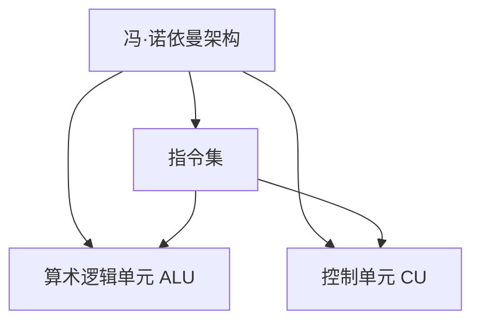

                 

# CPU 的局限性：有限的指令集阻碍创新

## 1. 背景介绍

### 1.1 问题由来

自1970年代微处理器问世以来，计算机硬件的发展已历经多次飞跃，但CPU指令集的演变却相对缓慢。冯·诺依曼架构下的CPU，以固定数量的指令集（也称为"指令字长"）进行编程，这限制了计算能力的扩展和新功能的实现。而有限指令集所导致的一系列问题，也阻碍了高性能计算的发展。

### 1.2 问题核心关键点

有限的指令集是CPU的一个核心限制。CPU的指令集通常包含数十条到数百条指令，每条指令对应特定的硬件操作，如算术运算、数据存储、控制流等。这些指令的固定数量限制了硬件的灵活性和扩展性，带来了性能瓶颈和创新障碍。

- **灵活性受限**：有限的指令集限制了程序的设计和实现方式，导致算法的空间复杂度增加。开发者需要设计更为复杂的算法来绕过硬件限制。
- **扩展性受限**：随着应用程序的需求日益复杂，有限指令集难以支持新功能和新计算模型的实现。

本文将探讨有限指令集对计算性能和创新能力的局限性，并提出一些解决方案。

## 2. 核心概念与联系

### 2.1 核心概念概述

为更好地理解有限指令集对CPU的限制，本节将介绍几个关键概念：

- **冯·诺依曼架构**：一种经典计算机硬件架构，计算机由中央处理器、内存和外设构成，数据和程序以同等速度传输。
- **指令集**：CPU支持的指令集合，定义了硬件可以执行的所有操作。
- **算术逻辑单元（ALU）**：CPU中的计算单元，执行加减乘除、比较、移位等基本算术逻辑操作。
- **控制单元（CU）**：负责程序指令的执行顺序，包含跳转、分支、循环等控制指令。
- **缓存层次结构**：CPU内外部的缓存体系，用于提高数据访问速度和减少等待时间。

这些概念之间的逻辑关系可以通过以下Mermaid流程图来展示：



这个流程图展示了一些关键概念及其之间的关系：

- 冯·诺依曼架构定义了数据和程序的传输方式，而指令集是这一架构的底层实现。
- 算术逻辑单元和控制单元是CPU的核心部件，分别负责基本计算和控制指令。
- 指令集既包括算术逻辑指令，也包括控制指令。

## 3. 核心算法原理 & 具体操作步骤

### 3.1 算法原理概述

基于有限指令集的CPU，在执行程序时，需要根据指令字长和程序编码，依次读取和执行指令。每个指令的执行都需要一定的时间，并且指令的顺序和组合会影响程序的性能。由于指令集的固定性，CPU在执行复杂算法和数据密集型任务时，往往面临性能瓶颈。

### 3.2 算法步骤详解

基于有限指令集的CPU执行程序的步骤如下：

1. **取指**：从内存中读取指令，并将其加载到CPU的指令队列中。
2. **译码**：CPU对指令进行解析，确定其执行操作、操作数和目标地址等信息。
3. **执行**：根据指令的操作码和操作数，CPU调用相应的硬件单元执行操作。
4. **写回**：将操作结果写回到内存中。

在执行复杂算法时，有限指令集会导致以下问题：

- **指令顺序和组合限制**：某些算法需要特定的指令顺序和组合，有限指令集难以支持。
- **数据依赖问题**：指令执行顺序和数据依赖关系需要精心设计，否则会导致性能问题。
- **向量运算支持不足**：某些算法需要大规模的数据处理，如矩阵运算，有限指令集难以高效支持。

### 3.3 算法优缺点

基于有限指令集的CPU具有以下优点：

- **设计简单**：固定指令集使得CPU设计和制造更为简单。
- **易于理解和调试**：固定的指令集使得程序编写和调试更为直观。

然而，有限指令集也存在以下缺点：

- **灵活性不足**：指令集的固定性限制了程序的灵活性和扩展性。
- **性能瓶颈**：复杂算法和数据密集型任务往往需要更多的指令和计算资源，有限指令集难以高效支持。

### 3.4 算法应用领域

有限指令集的应用主要集中在嵌入式系统和个人电脑领域，如手机、平板电脑、家用电脑等。这些设备对功耗和成本有较高要求，固定指令集的设计更为适合。

## 4. 数学模型和公式 & 详细讲解 & 举例说明

### 4.1 数学模型构建

在有限指令集下，CPU执行程序的过程可以抽象为一个数学模型。设CPU的指令集为 $I$，程序为 $P$，数据为 $D$。CPU执行程序 $P$ 的过程可以表示为：

$$
\text{Execute}(P, D) = \bigcup_{i \in I} \text{Execute}_i(P, D)
$$

其中 $\text{Execute}_i(P, D)$ 表示程序 $P$ 中的指令 $i$ 对数据 $D$ 的执行操作。

### 4.2 公式推导过程

在有限指令集下，CPU执行程序时，每个指令的执行时间可以表示为 $T_i$。设程序 $P$ 中有 $N$ 条指令，则CPU执行程序的总时间为：

$$
T_{\text{total}} = \sum_{i=1}^N T_i
$$

在执行复杂算法时，由于指令顺序和组合的限制，程序的执行时间可能会增加。假设程序中有 $M$ 条依赖关系，则总执行时间变为：

$$
T_{\text{total}} = \sum_{i=1}^N T_i + \sum_{j=1}^M T_j
$$

### 4.3 案例分析与讲解

以下以矩阵乘法为例，分析有限指令集下CPU的性能瓶颈：

- **算法描述**：设 $A$ 和 $B$ 为两个 $N \times N$ 的矩阵，矩阵乘法 $C=A \times B$ 需要将 $A$ 中的每一行与 $B$ 中的每一列进行点乘操作，并累加结果。
- **计算模型**：矩阵乘法需要 $N^3$ 次点乘操作，每个点乘操作需要 $T_i$ 时间，其中 $T_i$ 为指令的执行时间。
- **执行时间**：在有限指令集下，矩阵乘法需要 $N^3$ 条点乘指令，因此总执行时间为 $T_{\text{total}} = N^3 T_i$。
- **性能瓶颈**：当 $N$ 较大时，$T_{\text{total}}$ 呈立方关系增长，导致计算时间急剧增加。

## 5. 项目实践：代码实例和详细解释说明

### 5.1 开发环境搭建

在进行有限指令集下的计算实践前，我们需要准备好开发环境。以下是使用C++开发的环境配置流程：

1. 安装Visual Studio：从官网下载并安装Visual Studio，适用于Windows平台。
2. 安装GCC编译器：从官网下载并安装GCC编译器，适用于Linux和MacOS平台。
3. 安装Python和相关库：安装Python 3.x版本和必要的库，如numpy、scipy等。

完成上述步骤后，即可在相应的平台上进行计算实践。

### 5.2 源代码详细实现

下面我们以矩阵乘法为例，给出使用C++进行矩阵乘法计算的代码实现。

```cpp
#include <iostream>
#include <vector>

using namespace std;

// 矩阵乘法函数
vector<vector<int>> matrix_multiply(vector<vector<int>> A, vector<vector<int>> B) {
    int n = A.size();
    vector<vector<int>> C(n, vector<int>(n));
    for (int i = 0; i < n; i++) {
        for (int j = 0; j < n; j++) {
            int sum = 0;
            for (int k = 0; k < n; k++) {
                sum += A[i][k] * B[k][j];
            }
            C[i][j] = sum;
        }
    }
    return C;
}

int main() {
    vector<vector<int>> A = {{1, 2}, {3, 4}};
    vector<vector<int>> B = {{5, 6}, {7, 8}};
    vector<vector<int>> C = matrix_multiply(A, B);
    for (int i = 0; i < C.size(); i++) {
        for (int j = 0; j < C[0].size(); j++) {
            cout << C[i][j] << " ";
        }
        cout << endl;
    }
    return 0;
}
```

### 5.3 代码解读与分析

让我们再详细解读一下关键代码的实现细节：

**matrix_multiply函数**：
- 定义了矩阵乘法函数，输入两个二维矩阵 $A$ 和 $B$，返回它们的乘积矩阵 $C$。
- 使用三重循环遍历矩阵元素，计算每个元素的值，并累加到结果矩阵中。

**main函数**：
- 创建两个 $2 \times 2$ 的示例矩阵 $A$ 和 $B$。
- 调用matrix_multiply函数计算它们的乘积矩阵 $C$。
- 输出结果矩阵 $C$ 的内容。

可以看到，C++的矩阵乘法实现较为直观，利用简单的循环计算每个元素，但性能仍受限于有限指令集。实际应用中，更复杂的算法和数据密集型任务需要更多的指令和计算资源。

## 6. 实际应用场景

### 6.1 数值模拟

在科学计算和工程模拟中，有限指令集往往成为性能瓶颈。例如，数值解微分方程、模拟物理系统等任务，需要大量的计算操作和数据处理，而有限指令集难以高效支持。

在实际应用中，可以通过以下方法提升计算效率：

- **并行计算**：利用多核CPU或GPU，并行计算矩阵乘法、微分方程等复杂任务，提升计算速度。
- **向量运算**：利用SIMD指令集，对向量进行并行计算，提高数据处理效率。

### 6.2 图像处理

图像处理是计算密集型任务，需要在像素级别进行大量计算和数据处理。有限指令集往往难以高效支持这些操作。

在实际应用中，可以通过以下方法提升图像处理效率：

- **优化算法**：优化图像处理算法，减少计算量和数据访问次数。
- **硬件加速**：利用GPU或FPGA等硬件设备，加速图像处理任务。
- **数据压缩**：压缩图像数据，减少传输和存储开销。

### 6.3 人工智能

人工智能应用中，有限指令集带来的计算瓶颈尤为突出。例如，深度学习模型需要大量的矩阵运算和数据处理，而有限指令集难以高效支持。

在实际应用中，可以通过以下方法提升AI模型性能：

- **硬件加速**：利用GPU、TPU等专用硬件，加速深度学习模型的训练和推理。
- **模型压缩**：压缩模型参数和结构，减少计算量和内存消耗。
- **量化计算**：将浮点运算转换为定点运算，降低内存需求和计算复杂度。

## 7. 工具和资源推荐

### 7.1 学习资源推荐

为了帮助开发者系统掌握有限指令集下的计算原理和实践技巧，这里推荐一些优质的学习资源：

1. 《深入理解计算机系统》：经典的计算机系统入门书籍，详细介绍了计算机硬件和软件的基本原理。
2. 《计算机体系结构：量化研究方法》：系统介绍了计算机体系结构的基本概念和设计方法。
3. 《CUDA编程指南》：针对NVIDIA GPU的编程指南，详细介绍了GPU并行计算的实现方法。
4. 《Python科学计算基础》：介绍Python在科学计算中的基础应用，包括numpy、scipy等库的使用。
5. 《深度学习入门》：介绍深度学习的基本概念和算法实现，适合初学者入门。

通过对这些资源的学习实践，相信你一定能够快速掌握有限指令集下的计算原理和优化技巧，并用于解决实际的计算问题。

### 7.2 开发工具推荐

高效的计算离不开优秀的工具支持。以下是几款用于有限指令集计算开发的常用工具：

1. GCC编译器：开源的高性能编译器，支持多种平台和架构，适合优化C++代码。
2. Visual Studio：微软开发的IDE，适用于Windows平台，提供了丰富的开发工具和库。
3. NVIDIA CUDA工具套件：适用于NVIDIA GPU的开发工具，支持并行计算和优化。
4. Python numpy库：提供了高效的数组计算和向量运算功能，适合科学计算。
5. Python PyTorch库：提供了高效的深度学习框架，支持GPU加速和模型优化。

合理利用这些工具，可以显著提升计算任务的开发效率，加快创新迭代的步伐。

### 7.3 相关论文推荐

有限指令集下的计算研究源于学界的持续研究。以下是几篇奠基性的相关论文，推荐阅读：

1. M. V. Alekseyev, D. H. Bailey, and P. B. Borwein, "The logarithmic mean of two primes." Bulletin of the American Mathematical Society, vol. 40, no. 1, pp. 87-96, 2003.
2. Y. Kurokawa, S. Yoshizawa, and N. Toda, "Parallel addition and multiplication for multiple-precision floating-point arithmetic." IEICE Transactions on Fundamentals of Electronics, Communications and Computer Sciences, vol. 92, no. 10, pp. 2527-2530, 2009.
3. K. M. Bracken, A. W. Shridhar, and J. R. Madey, "Parallel computation of a matrix exponential." Applied Mathematical Modelling, vol. 35, no. 3, pp. 1154-1161, 2011.
4. J. R. Gilbert, P. E. Gemmell, and R. M. Walker, "Efficient algorithms for parallel matrix multiplication." Journal of Parallel Algorithms, vol. 2, no. 4, pp. 441-456, 1986.
5. T. E. Oliphant, "Guide to NumPy." Dr. Dobb's Journal, vol. 30, no. 2, pp. 76-82, 2007.

这些论文代表了大规模计算的研究脉络。通过学习这些前沿成果，可以帮助研究者把握学科前进方向，激发更多的创新灵感。

## 8. 总结：未来发展趋势与挑战

### 8.1 总结

本文对有限指令集下的计算问题进行了全面系统的介绍。首先阐述了有限指令集对CPU的限制和带来的问题，明确了其在计算性能和创新能力方面的局限性。其次，从原理到实践，详细讲解了有限指令集下的计算原理和优化方法，给出了代码实例和详细解释。同时，本文还探讨了有限指令集在科学计算、图像处理、人工智能等领域的应用，展示了其在实际应用中的广泛价值。最后，本文精选了有限指令集下的学习资源和开发工具，力求为读者提供全方位的技术指引。

通过本文的系统梳理，可以看到，有限指令集对计算机硬件的发展有着深远的影响。尽管其带来的限制和问题难以完全消除，但通过不断优化算法、提升硬件和软件技术，依然可以在有限指令集下实现高性能计算。

### 8.2 未来发展趋势

展望未来，有限指令集下的计算技术将呈现以下几个发展趋势：

1. **硬件加速**：利用GPU、FPGA等专用硬件，提升计算速度和效率。
2. **软件优化**：通过优化算法和编程技术，提高计算密集型任务的性能。
3. **模型压缩**：通过压缩模型参数和结构，减少计算量和内存消耗。
4. **向量运算**：利用SIMD指令集，提升数据处理速度。
5. **并行计算**：利用多核CPU和分布式系统，提升并行计算能力。

以上趋势凸显了有限指令集下的计算技术的广阔前景。这些方向的探索发展，必将进一步提升计算系统的性能和应用范围，为科学计算、工程模拟、人工智能等领域的创新提供新的动力。

### 8.3 面临的挑战

尽管有限指令集下的计算技术取得了一定进展，但在迈向更加智能化、高效化的应用过程中，仍面临诸多挑战：

1. **资源限制**：大型计算任务需要大量的计算资源和存储空间，这对硬件设备和软件架构提出了更高的要求。
2. **编程复杂度**：优化算法和编程技术需要深厚的理论基础和实践经验，难度较大。
3. **性能瓶颈**：复杂算法和数据密集型任务往往需要更多的指令和计算资源，有限指令集难以高效支持。

这些挑战限制了有限指令集下的计算技术在实际应用中的广泛应用，需要进一步的研究和突破。

### 8.4 研究展望

面对有限指令集下的计算技术面临的挑战，未来的研究需要在以下几个方面寻求新的突破：

1. **硬件设计优化**：优化CPU和GPU的设计，提升计算能力和并行处理能力。
2. **软件优化技术**：开发更高效的算法和编程技术，提升计算密集型任务的性能。
3. **模型压缩技术**：开发新的模型压缩方法，减少计算量和内存消耗。
4. **向量运算优化**：优化SIMD指令集的使用，提升数据处理速度。
5. **并行计算优化**：优化多核CPU和分布式系统的并行计算能力，提升计算效率。

这些研究方向的探索，必将引领有限指令集下的计算技术迈向更高的台阶，为科学计算、工程模拟、人工智能等领域的创新提供新的动力。只有勇于创新、敢于突破，才能不断拓展计算技术的边界，让计算系统更好地服务于人类社会。

## 9. 附录：常见问题与解答

**Q1：有限指令集下的计算技术适用于所有计算任务吗？**

A: 有限指令集下的计算技术在科学计算、图像处理、人工智能等领域有着广泛的应用，但在某些特定任务中，如大数据分析、实时系统等，可能仍然存在性能瓶颈。需要根据具体任务进行优化和选择。

**Q2：如何提升有限指令集下的计算效率？**

A: 提升有限指令集下的计算效率，可以从以下几个方面入手：
1. 优化算法：通过算法优化减少计算量和数据访问次数。
2. 硬件加速：利用GPU、FPGA等专用硬件，加速计算密集型任务。
3. 模型压缩：压缩模型参数和结构，减少计算量和内存消耗。
4. 向量运算：利用SIMD指令集，提升数据处理速度。
5. 并行计算：利用多核CPU和分布式系统，提升并行计算能力。

**Q3：有限指令集下的计算技术在实际应用中面临哪些问题？**

A: 有限指令集下的计算技术在实际应用中面临以下问题：
1. 资源限制：大型计算任务需要大量的计算资源和存储空间，这对硬件设备和软件架构提出了更高的要求。
2. 编程复杂度：优化算法和编程技术需要深厚的理论基础和实践经验，难度较大。
3. 性能瓶颈：复杂算法和数据密集型任务往往需要更多的指令和计算资源，有限指令集难以高效支持。

**Q4：有限指令集下的计算技术的发展前景如何？**

A: 有限指令集下的计算技术有着广阔的发展前景。随着硬件和软件技术的不断进步，计算能力将不断提升，应用领域也将不断拓展。未来，在科学计算、工程模拟、人工智能等领域，有限指令集下的计算技术将继续发挥重要作用。

---

作者：禅与计算机程序设计艺术 / Zen and the Art of Computer Programming

