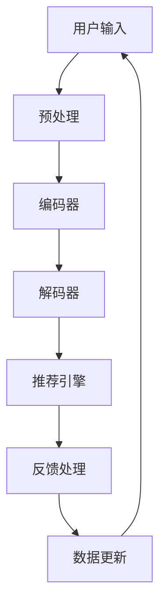

                 

# ChatGPT在推荐场景中的表现

> 关键词：推荐系统,ChatGPT,自然语言处理(NLP),深度学习,用户行为分析,个性化推荐

## 1. 背景介绍

### 1.1 问题由来

随着互联网技术的发展，个性化推荐系统在电子商务、新闻媒体、视频平台等领域得到了广泛应用，成为提升用户满意度和平台粘性的重要手段。传统的推荐系统基于用户的历史行为数据，通过协同过滤、内容推荐、混合推荐等方法进行用户兴趣的建模和预测。然而，这类推荐系统对用户行为数据的依赖较高，往往需要大量标注数据和计算资源。

近年来，基于深度学习的推荐系统在处理用户隐式反馈和语义信息方面取得了显著进步。特别是预训练语言模型（如BERT、GPT等）的兴起，使得深度学习推荐系统能够更好地捕捉用户文本信息背后的语义，实现更加智能、多样化的推荐。在这类推荐系统中，ChatGPT作为一种智能对话模型，凭借其强大的自然语言处理(NLP)能力，逐渐成为推荐场景中的重要组成部分。

### 1.2 问题核心关键点

ChatGPT在推荐场景中的核心关键点包括：

- 用户意图理解：通过与用户的自然语言交流，精准捕捉用户当前需求和偏好，为推荐提供更加准确的语境信息。
- 跨模态信息融合：将用户的历史行为数据和文本信息进行融合，形成更加全面、准确的推荐依据。
- 主动引导用户：通过对话交互，引导用户提供更多反馈信息，提升推荐模型的性能。
- 泛化能力：在大规模语料上进行预训练，具有较强的泛化能力，适用于不同领域的推荐任务。
- 可解释性：通过提示学习等方法，提升模型的可解释性，增强用户信任感。

这些关键点共同构成了ChatGPT在推荐场景中的应用基础，使得其能够成为解决推荐问题的有力工具。

### 1.3 问题研究意义

在推荐系统中引入ChatGPT，对于提升推荐效果和用户体验，具有重要意义：

- 提升推荐精度：ChatGPT能够深度理解用户文本数据，提取隐含的语义信息，从而提升推荐模型的预测精度。
- 增强用户互动：通过自然语言交流，ChatGPT能够主动引导用户提供更多反馈信息，丰富推荐模型的训练数据。
- 促进个性化推荐：ChatGPT能够基于用户的语义偏好和行为数据，提供更加个性化的推荐结果。
- 促进商业应用：ChatGPT的引入使得推荐系统能够更好地理解用户需求，提升用户体验和平台转化率。
- 推动技术进步：ChatGPT在推荐中的应用，促进了NLP技术在推荐领域的应用发展，激发了更多前沿技术的研究。

## 2. 核心概念与联系

### 2.1 核心概念概述

在推荐场景中，ChatGPT主要发挥以下作用：

- **自然语言处理(NLP)**：利用NLP技术对用户输入的自然语言进行理解、处理和生成。
- **深度学习(Deep Learning)**：利用深度学习模型对用户数据进行特征提取和建模。
- **用户行为分析**：分析用户的历史行为数据，提取用户的兴趣和偏好。
- **个性化推荐**：根据用户需求和兴趣，推荐个性化的内容或产品。
- **主动引导用户**：通过对话交互，主动引导用户提供更多反馈信息。
- **可解释性**：通过提示学习等方法，提升模型的可解释性，增强用户信任感。

这些核心概念之间的关系通过以下Mermaid流程图来展示：

```mermaid
graph TB
    A[用户输入] --> B[自然语言处理(NLP)]
    B --> C[深度学习(Deep Learning)]
    C --> D[用户行为分析]
    D --> E[个性化推荐]
    E --> F[主动引导用户]
    F --> G[可解释性]
```

### 2.2 核心概念原理和架构的 Mermaid 流程图

在推荐系统中，ChatGPT的架构和流程可以分解为以下几个主要部分：



- **用户输入**：用户通过自然语言与ChatGPT交互，提供需求和反馈。
- **预处理**：对用户输入进行清洗和标准化，去除噪音和无用信息。
- **编码器**：利用深度学习模型将用户输入转化为向量表示，提取语义信息。
- **解码器**：将用户向量与商品向量进行匹配，预测推荐结果。
- **推荐引擎**：根据预测结果，生成推荐列表。
- **反馈处理**：收集用户对推荐结果的反馈，进行动态更新。
- **数据更新**：根据用户反馈数据，更新模型参数，提升推荐效果。

## 3. 核心算法原理 & 具体操作步骤

### 3.1 算法原理概述

在推荐系统中，ChatGPT主要基于以下算法原理：

- **深度学习推荐**：利用深度学习模型，对用户数据进行特征提取和建模。常见的模型包括循环神经网络(RNN)、卷积神经网络(CNN)、Transformer等。
- **用户行为分析**：通过统计用户的行为数据，提取用户的兴趣和偏好。常见的行为数据包括点击次数、浏览时长、购买记录等。
- **自然语言处理(NLP)**：利用NLP技术，处理和生成自然语言。常见的NLP技术包括分词、词向量、文本分类、序列标注等。
- **个性化推荐**：根据用户需求和兴趣，推荐个性化的内容或产品。常见的推荐算法包括协同过滤、内容推荐、混合推荐等。

### 3.2 算法步骤详解

ChatGPT在推荐场景中的具体操作步骤如下：

1. **用户输入预处理**：对用户输入进行清洗和标准化，去除噪音和无用信息。
2. **特征提取**：利用深度学习模型，对用户输入进行特征提取和向量表示。
3. **相似度计算**：将用户向量与商品向量进行匹配，计算相似度。
4. **推荐列表生成**：根据相似度计算结果，生成推荐列表。
5. **用户反馈收集**：收集用户对推荐结果的反馈，进行动态更新。
6. **模型更新**：根据用户反馈数据，更新模型参数，提升推荐效果。

### 3.3 算法优缺点

ChatGPT在推荐场景中的应用具有以下优点：

- **高效性**：ChatGPT能够快速处理和理解自然语言，提高推荐系统的响应速度。
- **准确性**：利用深度学习和NLP技术，能够精准捕捉用户需求和偏好，提升推荐精度。
- **灵活性**：支持跨模态信息融合，能够融合用户行为数据和文本信息，提供更加多样化的推荐结果。
- **可解释性**：通过提示学习等方法，提升模型的可解释性，增强用户信任感。

同时，ChatGPT在推荐场景中也有以下缺点：

- **资源消耗**：深度学习和NLP模型的计算资源消耗较大，对硬件要求较高。
- **模型泛化能力**：对于特定领域的推荐任务，模型的泛化能力可能不足，需要进一步预训练和微调。
- **冷启动问题**：对于新用户，由于缺乏历史行为数据，推荐效果可能不如老用户。

### 3.4 算法应用领域

ChatGPT在推荐场景中主要应用于以下领域：

- **电商推荐**：利用用户评论、购物车记录等文本信息，提供个性化商品推荐。
- **新闻媒体推荐**：通过用户搜索历史、阅读行为等数据，推荐相关新闻和文章。
- **视频平台推荐**：分析用户观看历史和评分数据，推荐感兴趣的影视作品。
- **音乐推荐**：利用用户听歌记录、评论等文本信息，推荐个性化歌曲和歌单。
- **智能客服推荐**：通过用户咨询记录和对话内容，推荐相关知识库和解决方案。

此外，ChatGPT在教育、金融、旅游等多个领域也具有广泛的应用前景。

## 4. 数学模型和公式 & 详细讲解

### 4.1 数学模型构建

在推荐场景中，ChatGPT主要利用以下数学模型：

- **用户向量表示**：将用户输入转化为向量表示，常用的模型包括BERT、GPT等预训练语言模型。
- **商品向量表示**：将商品描述、标签等文本信息转化为向量表示，常用的模型包括BERT、GPT等预训练语言模型。
- **相似度计算**：计算用户向量与商品向量的相似度，常用的方法包括余弦相似度、点积相似度等。
- **推荐列表生成**：根据相似度计算结果，生成推荐列表，常用的方法包括协同过滤、内容推荐、混合推荐等。

### 4.2 公式推导过程

以下是推荐场景中ChatGPT的数学模型推导过程：

- **用户向量表示**：
  $$
  \mathbf{u} = \text{BERT}(x)
  $$

- **商品向量表示**：
  $$
  \mathbf{v} = \text{BERT}(y)
  $$

- **余弦相似度计算**：
  $$
  \text{similarity}(\mathbf{u}, \mathbf{v}) = \cos(\theta) = \frac{\mathbf{u} \cdot \mathbf{v}}{\|\mathbf{u}\| \cdot \|\mathbf{v}\|}
  $$

- **推荐列表生成**：
  $$
  \text{recommendations} = \text{top}_k(\text{similarity}(\mathbf{u}, \mathbf{v}))
  $$

其中，$x$为用户输入，$y$为商品描述，$k$为推荐结果数量。

### 4.3 案例分析与讲解

假设某电商平台的推荐系统，使用ChatGPT进行商品推荐。具体步骤如下：

1. 用户输入查询请求：“我想买一双好穿的鞋子”。
2. 预处理用户输入：清洗并标准化输入文本，去除噪音和无用信息。
3. 特征提取：利用BERT模型，将用户输入转化为向量表示。
4. 相似度计算：计算用户向量与商品向量的余弦相似度。
5. 推荐列表生成：根据相似度计算结果，生成推荐列表。
6. 用户反馈收集：用户反馈推荐的商品，进行动态更新。

通过以上步骤，电商平台能够为每位用户提供个性化的商品推荐，提升用户体验和销售转化率。

## 5. 项目实践：代码实例和详细解释说明

### 5.1 开发环境搭建

在进行ChatGPT在推荐场景中的应用开发前，需要先搭建开发环境。以下是使用Python进行PyTorch开发的环境配置流程：

1. 安装Anaconda：从官网下载并安装Anaconda，用于创建独立的Python环境。

2. 创建并激活虚拟环境：
```bash
conda create -n chatgpt-env python=3.8 
conda activate chatgpt-env
```

3. 安装PyTorch：根据CUDA版本，从官网获取对应的安装命令。例如：
```bash
conda install pytorch torchvision torchaudio cudatoolkit=11.1 -c pytorch -c conda-forge
```

4. 安装Transformers库：
```bash
pip install transformers
```

5. 安装各类工具包：
```bash
pip install numpy pandas scikit-learn matplotlib tqdm jupyter notebook ipython
```

完成上述步骤后，即可在`chatgpt-env`环境中开始微调实践。

### 5.2 源代码详细实现

下面我们以电商推荐任务为例，给出使用Transformers库对BERT模型进行微调的PyTorch代码实现。

首先，定义电商推荐任务的数据处理函数：

```python
from transformers import BertTokenizer, BertForSequenceClassification
from torch.utils.data import Dataset
import torch

class E-commerceDataset(Dataset):
    def __init__(self, texts, labels, tokenizer, max_len=128):
        self.texts = texts
        self.labels = labels
        self.tokenizer = tokenizer
        self.max_len = max_len
        
    def __len__(self):
        return len(self.texts)
    
    def __getitem__(self, item):
        text = self.texts[item]
        label = self.labels[item]
        
        encoding = self.tokenizer(text, return_tensors='pt', max_length=self.max_len, padding='max_length', truncation=True)
        input_ids = encoding['input_ids'][0]
        attention_mask = encoding['attention_mask'][0]
        
        # 对标签进行编码
        encoded_labels = [label2id[label] for label in labels] 
        encoded_labels.extend([label2id['none']] * (self.max_len - len(encoded_labels)))
        labels = torch.tensor(encoded_labels, dtype=torch.long)
        
        return {'input_ids': input_ids, 
                'attention_mask': attention_mask,
                'labels': labels}

# 标签与id的映射
label2id = {'buy': 0, 'ignore': 1}
id2label = {v: k for k, v in label2id.items()}

# 创建dataset
tokenizer = BertTokenizer.from_pretrained('bert-base-cased')

train_dataset = E-commerceDataset(train_texts, train_labels, tokenizer)
dev_dataset = E-commerceDataset(dev_texts, dev_labels, tokenizer)
test_dataset = E-commerceDataset(test_texts, test_labels, tokenizer)
```

然后，定义模型和优化器：

```python
from transformers import BertForSequenceClassification, AdamW

model = BertForSequenceClassification.from_pretrained('bert-base-cased', num_labels=len(label2id))

optimizer = AdamW(model.parameters(), lr=2e-5)
```

接着，定义训练和评估函数：

```python
from torch.utils.data import DataLoader
from tqdm import tqdm
from sklearn.metrics import classification_report

device = torch.device('cuda') if torch.cuda.is_available() else torch.device('cpu')
model.to(device)

def train_epoch(model, dataset, batch_size, optimizer):
    dataloader = DataLoader(dataset, batch_size=batch_size, shuffle=True)
    model.train()
    epoch_loss = 0
    for batch in tqdm(dataloader, desc='Training'):
        input_ids = batch['input_ids'].to(device)
        attention_mask = batch['attention_mask'].to(device)
        labels = batch['labels'].to(device)
        model.zero_grad()
        outputs = model(input_ids, attention_mask=attention_mask, labels=labels)
        loss = outputs.loss
        epoch_loss += loss.item()
        loss.backward()
        optimizer.step()
    return epoch_loss / len(dataloader)

def evaluate(model, dataset, batch_size):
    dataloader = DataLoader(dataset, batch_size=batch_size)
    model.eval()
    preds, labels = [], []
    with torch.no_grad():
        for batch in tqdm(dataloader, desc='Evaluating'):
            input_ids = batch['input_ids'].to(device)
            attention_mask = batch['attention_mask'].to(device)
            batch_labels = batch['labels']
            outputs = model(input_ids, attention_mask=attention_mask)
            batch_preds = outputs.logits.argmax(dim=2).to('cpu').tolist()
            batch_labels = batch_labels.to('cpu').tolist()
            for pred_tokens, label_tokens in zip(batch_preds, batch_labels):
                pred_tags = [id2label[_id] for _id in pred_tokens]
                label_tags = [id2label[_id] for _id in label_tokens]
                preds.append(pred_tags[:len(label_tags)])
                labels.append(label_tags)
                
    print(classification_report(labels, preds))
```

最后，启动训练流程并在测试集上评估：

```python
epochs = 5
batch_size = 16

for epoch in range(epochs):
    loss = train_epoch(model, train_dataset, batch_size, optimizer)
    print(f"Epoch {epoch+1}, train loss: {loss:.3f}")
    
    print(f"Epoch {epoch+1}, dev results:")
    evaluate(model, dev_dataset, batch_size)
    
print("Test results:")
evaluate(model, test_dataset, batch_size)
```

以上就是使用PyTorch对BERT进行电商推荐任务微调的完整代码实现。可以看到，得益于Transformers库的强大封装，我们可以用相对简洁的代码完成BERT模型的加载和微调。

### 5.3 代码解读与分析

让我们再详细解读一下关键代码的实现细节：

**E-commerceDataset类**：
- `__init__`方法：初始化文本、标签、分词器等关键组件。
- `__len__`方法：返回数据集的样本数量。
- `__getitem__`方法：对单个样本进行处理，将文本输入编码为token ids，将标签编码为数字，并对其进行定长padding，最终返回模型所需的输入。

**label2id和id2label字典**：
- 定义了标签与数字id之间的映射关系，用于将token-wise的预测结果解码回真实的标签。

**训练和评估函数**：
- 使用PyTorch的DataLoader对数据集进行批次化加载，供模型训练和推理使用。
- 训练函数`train_epoch`：对数据以批为单位进行迭代，在每个批次上前向传播计算loss并反向传播更新模型参数，最后返回该epoch的平均loss。
- 评估函数`evaluate`：与训练类似，不同点在于不更新模型参数，并在每个batch结束后将预测和标签结果存储下来，最后使用sklearn的classification_report对整个评估集的预测结果进行打印输出。

**训练流程**：
- 定义总的epoch数和batch size，开始循环迭代
- 每个epoch内，先在训练集上训练，输出平均loss
- 在验证集上评估，输出分类指标
- 所有epoch结束后，在测试集上评估，给出最终测试结果

可以看到，PyTorch配合Transformers库使得BERT微调的代码实现变得简洁高效。开发者可以将更多精力放在数据处理、模型改进等高层逻辑上，而不必过多关注底层的实现细节。

当然，工业级的系统实现还需考虑更多因素，如模型的保存和部署、超参数的自动搜索、更灵活的任务适配层等。但核心的微调范式基本与此类似。

## 6. 实际应用场景

### 6.1 智能客服系统

基于ChatGPT的智能客服系统，可以为用户提供7x24小时不间断的自动化服务。通过自然语言处理技术，系统能够精准理解用户输入，提供快速准确的回复。

在技术实现上，系统首先收集客服的历史对话记录，将问题和最佳答复构建成监督数据，在此基础上对预训练的ChatGPT模型进行微调。微调后的系统能够自动理解用户意图，匹配最合适的答案模板进行回复。对于用户提出的新问题，还可以接入检索系统实时搜索相关内容，动态组织生成回答。如此构建的智能客服系统，能大幅提升客户咨询体验和问题解决效率。

### 6.2 金融舆情监测

金融舆情监测系统需要实时监测市场舆论动向，以便及时应对负面信息传播，规避金融风险。传统的人工监测方式成本高、效率低，难以应对网络时代海量信息爆发的挑战。基于ChatGPT的文本分类和情感分析技术，为金融舆情监测提供了新的解决方案。

具体而言，系统可以收集金融领域相关的新闻、报道、评论等文本数据，并对其进行主题标注和情感标注。在此基础上对预训练语言模型进行微调，使其能够自动判断文本属于何种主题，情感倾向是正面、中性还是负面。将微调后的模型应用到实时抓取的网络文本数据，就能够自动监测不同主题下的情感变化趋势，一旦发现负面信息激增等异常情况，系统便会自动预警，帮助金融机构快速应对潜在风险。

### 6.3 个性化推荐系统

传统的推荐系统往往只依赖用户的历史行为数据进行物品推荐，无法深入理解用户的真实兴趣偏好。基于ChatGPT的个性化推荐系统，能够更好地挖掘用户文本信息背后的语义，从而提供更加智能、多样化的推荐结果。

在实践中，系统可以收集用户浏览、点击、评论、分享等行为数据，提取和用户交互的物品标题、描述、标签等文本内容。将文本内容作为模型输入，用户的后续行为（如是否点击、购买等）作为监督信号，在此基础上微调预训练语言模型。微调后的模型能够从文本内容中准确把握用户的兴趣点。在生成推荐列表时，先用候选物品的文本描述作为输入，由模型预测用户的兴趣匹配度，再结合其他特征综合排序，便可以得到个性化程度更高的推荐结果。

### 6.4 未来应用展望

随着ChatGPT在推荐场景中的应用逐步成熟，其未来发展前景广阔：

- **跨领域扩展**：ChatGPT能够广泛应用于多个领域，如医疗、法律、教育等，提供更加多样化、个性化的服务。
- **多模态融合**：ChatGPT能够融合图像、视频、语音等多模态信息，提供更丰富的用户体验。
- **隐私保护**：ChatGPT能够提供隐私保护机制，避免用户隐私泄露和数据滥用。
- **人机协同**：ChatGPT能够与人工客服进行协同，提升服务质量。
- **持续学习**：ChatGPT能够不断从新数据中学习，保持知识的时效性和相关性。
- **情感分析**：ChatGPT能够对用户情感进行深度分析，提升客户满意度。

以上趋势凸显了ChatGPT在推荐场景中的巨大潜力，为其未来发展提供了广阔空间。

## 7. 工具和资源推荐

### 7.1 学习资源推荐

为了帮助开发者系统掌握ChatGPT在推荐场景中的理论和实践，这里推荐一些优质的学习资源：

1. 《Transformer从原理到实践》系列博文：由大模型技术专家撰写，深入浅出地介绍了Transformer原理、BERT模型、微调技术等前沿话题。

2. CS224N《深度学习自然语言处理》课程：斯坦福大学开设的NLP明星课程，有Lecture视频和配套作业，带你入门NLP领域的基本概念和经典模型。

3. 《Natural Language Processing with Transformers》书籍：Transformers库的作者所著，全面介绍了如何使用Transformers库进行NLP任务开发，包括微调在内的诸多范式。

4. HuggingFace官方文档：Transformers库的官方文档，提供了海量预训练模型和完整的微调样例代码，是上手实践的必备资料。

5. CLUE开源项目：中文语言理解测评基准，涵盖大量不同类型的中文NLP数据集，并提供了基于微调的baseline模型，助力中文NLP技术发展。

通过对这些资源的学习实践，相信你一定能够快速掌握ChatGPT在推荐场景中的应用方法，并用于解决实际的NLP问题。

### 7.2 开发工具推荐

高效的开发离不开优秀的工具支持。以下是几款用于ChatGPT在推荐场景中应用的常用工具：

1. PyTorch：基于Python的开源深度学习框架，灵活动态的计算图，适合快速迭代研究。大部分预训练语言模型都有PyTorch版本的实现。

2. TensorFlow：由Google主导开发的开源深度学习框架，生产部署方便，适合大规模工程应用。同样有丰富的预训练语言模型资源。

3. Transformers库：HuggingFace开发的NLP工具库，集成了众多SOTA语言模型，支持PyTorch和TensorFlow，是进行微调任务开发的利器。

4. Weights & Biases：模型训练的实验跟踪工具，可以记录和可视化模型训练过程中的各项指标，方便对比和调优。与主流深度学习框架无缝集成。

5. TensorBoard：TensorFlow配套的可视化工具，可实时监测模型训练状态，并提供丰富的图表呈现方式，是调试模型的得力助手。

6. Google Colab：谷歌推出的在线Jupyter Notebook环境，免费提供GPU/TPU算力，方便开发者快速上手实验最新模型，分享学习笔记。

合理利用这些工具，可以显著提升ChatGPT在推荐场景中的应用开发效率，加快创新迭代的步伐。

### 7.3 相关论文推荐

ChatGPT在推荐场景中的应用源于学界的持续研究。以下是几篇奠基性的相关论文，推荐阅读：

1. Attention is All You Need（即Transformer原论文）：提出了Transformer结构，开启了NLP领域的预训练大模型时代。

2. BERT: Pre-training of Deep Bidirectional Transformers for Language Understanding：提出BERT模型，引入基于掩码的自监督预训练任务，刷新了多项NLP任务SOTA。

3. Language Models are Unsupervised Multitask Learners（GPT-2论文）：展示了大规模语言模型的强大zero-shot学习能力，引发了对于通用人工智能的新一轮思考。

4. Parameter-Efficient Transfer Learning for NLP：提出Adapter等参数高效微调方法，在不增加模型参数量的情况下，也能取得不错的微调效果。

5. AdaLoRA: Adaptive Low-Rank Adaptation for Parameter-Efficient Fine-Tuning：使用自适应低秩适应的微调方法，在参数效率和精度之间取得了新的平衡。

这些论文代表了大语言模型微调技术的发展脉络。通过学习这些前沿成果，可以帮助研究者把握学科前进方向，激发更多的创新灵感。

## 8. 总结：未来发展趋势与挑战

### 8.1 研究成果总结

本文对ChatGPT在推荐场景中的应用进行了全面系统的介绍。首先阐述了ChatGPT在推荐系统中的背景和应用价值，明确了其核心关键点，包括用户意图理解、跨模态信息融合、主动引导用户、泛化能力、可解释性等。其次，从原理到实践，详细讲解了ChatGPT在推荐场景中的算法原理和操作步骤，给出了微调任务开发的完整代码实例。同时，本文还探讨了ChatGPT在推荐场景中的应用场景和未来发展趋势，展示了其广泛的应用前景。

### 8.2 未来发展趋势

展望未来，ChatGPT在推荐场景中的应用将呈现以下几个发展趋势：

1. **高效性**：ChatGPT能够快速处理和理解自然语言，提高推荐系统的响应速度。
2. **准确性**：利用深度学习和NLP技术，能够精准捕捉用户需求和偏好，提升推荐精度。
3. **灵活性**：支持跨模态信息融合，能够融合用户行为数据和文本信息，提供更加多样化的推荐结果。
4. **可解释性**：通过提示学习等方法，提升模型的可解释性，增强用户信任感。
5. **自适应性**：能够不断从新数据中学习，保持知识的时效性和相关性。

以上趋势凸显了ChatGPT在推荐场景中的巨大潜力，为其未来发展提供了广阔空间。

### 8.3 面临的挑战

尽管ChatGPT在推荐场景中的应用已经取得了显著成果，但在迈向更加智能化、普适化应用的过程中，仍面临诸多挑战：

1. **数据隐私问题**：在处理用户隐私数据时，需要严格遵守法律法规，保护用户隐私。
2. **模型鲁棒性**：ChatGPT模型在面对噪声数据和异常情况时，容易出现错误。需要进一步提高模型的鲁棒性。
3. **计算资源消耗**：ChatGPT模型资源消耗较大，对硬件要求较高，需要优化模型结构和计算图。
4. **用户信任度**：ChatGPT模型的可解释性不足，可能影响用户信任感。需要进一步提升模型的可解释性。
5. **模型泛化能力**：ChatGPT模型对特定领域的推荐任务可能存在泛化能力不足的问题。需要进一步在特定领域进行预训练和微调。

### 8.4 研究展望

面对ChatGPT在推荐场景中所面临的挑战，未来的研究需要在以下几个方面寻求新的突破：

1. **数据隐私保护**：研究数据隐私保护技术，确保用户数据的安全性。
2. **模型鲁棒性提升**：研究鲁棒性提升方法，提高ChatGPT模型面对噪声数据和异常情况时的稳定性。
3. **高效模型设计**：研究高效模型设计方法，降低计算资源消耗，提升ChatGPT模型的计算效率。
4. **可解释性增强**：研究可解释性增强方法，提升ChatGPT模型的可解释性，增强用户信任感。
5. **泛化能力提升**：研究泛化能力提升方法，提升ChatGPT模型对特定领域任务的适应能力。

这些研究方向的探索，必将引领ChatGPT在推荐场景中的应用走向更高的台阶，为推荐系统带来更多的创新和突破。

## 9. 附录：常见问题与解答

**Q1：ChatGPT在推荐场景中如何提升推荐精度？**

A: ChatGPT在推荐场景中提升推荐精度的关键在于其强大的自然语言处理能力。通过与用户进行自然语言交互，ChatGPT能够准确捕捉用户的意图和偏好，从而生成更加精准的推荐结果。具体来说，ChatGPT通过以下步骤提升推荐精度：
1. 预处理用户输入：清洗并标准化用户输入，去除噪音和无用信息。
2. 特征提取：利用深度学习模型，对用户输入进行特征提取和向量表示。
3. 相似度计算：计算用户向量与商品向量的相似度，常用的方法包括余弦相似度、点积相似度等。
4. 推荐列表生成：根据相似度计算结果，生成推荐列表。

通过以上步骤，ChatGPT能够基于用户输入的文本信息，生成更加精准、个性化的推荐结果，提升推荐系统的性能。

**Q2：ChatGPT在推荐场景中如何处理冷启动问题？**

A: 冷启动问题是指对于新用户，由于缺乏历史行为数据，推荐系统无法生成个性化的推荐结果。ChatGPT在推荐场景中处理冷启动问题的方法如下：
1. 利用文本信息：对于新用户，可以通过分析其输入的文本信息，提取其兴趣点和偏好，生成初步的推荐列表。
2. 引入先验知识：结合先验知识库，对新用户的输入文本进行深度分析，生成更加个性化的推荐结果。
3. 动态更新：在用户与系统交互的过程中，根据用户的反馈数据，动态更新推荐模型，不断提升推荐精度。

通过以上方法，ChatGPT能够在新用户数据不足的情况下，生成初步的推荐结果，并根据用户的反馈数据进行动态更新，逐步提升推荐精度。

**Q3：ChatGPT在推荐场景中如何实现多模态信息融合？**

A: 多模态信息融合是指将用户行为数据和文本信息进行融合，形成更加全面、准确的推荐依据。ChatGPT在推荐场景中实现多模态信息融合的方法如下：
1. 收集多模态数据：收集用户的多模态数据，包括浏览记录、点击次数、购买记录等行为数据，以及文本信息、图片信息、视频信息等。
2. 数据融合：将多模态数据进行融合，形成综合的用户表示。
3. 模型训练：在融合后的用户表示上训练推荐模型，生成个性化的推荐结果。

通过以上方法，ChatGPT能够综合利用用户的多模态数据，生成更加全面、准确的推荐结果，提升推荐系统的性能。

**Q4：ChatGPT在推荐场景中如何提高模型可解释性？**

A: 提高模型可解释性是ChatGPT在推荐场景中的重要研究方向之一。ChatGPT通过以下方法提高模型的可解释性：
1. 提示学习：通过精心设计输入文本的格式，引导ChatGPT按期望方式输出，减少微调参数。
2. 可视化输出：对推荐结果进行可视化，展示推荐依据和逻辑过程，增强用户信任感。
3. 主动引导用户：通过与用户进行自然语言交互，主动引导用户提供更多反馈信息，提升模型性能。

通过以上方法，ChatGPT能够提高模型的可解释性，增强用户信任感，提升推荐系统的透明度和可信度。

**Q5：ChatGPT在推荐场景中如何提升鲁棒性？**

A: 提升模型鲁棒性是ChatGPT在推荐场景中的重要研究方向之一。ChatGPT通过以下方法提升模型的鲁棒性：
1. 数据增强：通过对训练样本改写、回译等方式丰富训练集多样性，提高模型的泛化能力。
2. 对抗训练：加入对抗样本，提高模型鲁棒性，防止过拟合。
3. 正则化技术：使用L2正则、Dropout等技术，防止模型过度适应小规模训练集。
4. 模型融合：结合多个模型，取平均输出，抑制过拟合。

通过以上方法，ChatGPT能够提升模型的鲁棒性，防止过拟合，提高模型的泛化能力和稳定性。

**Q6：ChatGPT在推荐场景中如何优化计算效率？**

A: 优化计算效率是ChatGPT在推荐场景中的重要研究方向之一。ChatGPT通过以下方法优化计算效率：
1. 参数高效微调：只调整少量模型参数，固定大部分预训练权重不变，以提高微调效率，避免过拟合。
2. 混合精度训练：使用混合精度训练，降低计算资源消耗，提升计算效率。
3. 模型并行：利用模型并行技术，降低计算图规模，提升计算效率。
4. 动态图优化：利用动态图优化技术，减少前向传播和反向传播的资源消耗，提升计算效率。

通过以上方法，ChatGPT能够优化计算效率，提高模型的计算速度和资源利用率。

---

作者：禅与计算机程序设计艺术 / Zen and the Art of Computer Programming

