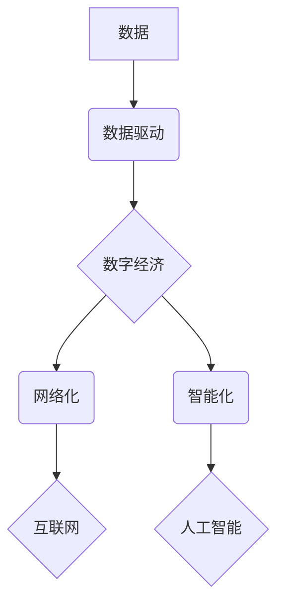

> 数字经济、数据驱动、人工智能、云计算、大数据、区块链、物联网

## 1. 背景介绍

21世纪，科技发展日新月异，互联网、移动互联网、大数据、人工智能等技术的蓬勃发展，深刻地改变着人类社会生产方式、生活方式和社会组织方式。其中，数字经济作为以数字化、网络化、智能化为特征的新型经济形态，正成为全球经济增长的重要引擎，对社会发展产生着深远影响。

数字经济的本质是利用数字技术，将信息、数据、知识、服务等要素进行数字化、网络化、智能化处理和应用，从而创造新的价值。它涵盖了广泛的领域，包括电子商务、数字内容、在线教育、数字金融、智能制造、智慧城市等。

数字经济的快速发展，为社会带来了诸多机遇和挑战。一方面，它推动了经济增长、创造了新的就业机会、提高了生活水平，为人类社会带来了前所未有的发展机遇。另一方面，数字经济也带来了新的问题，例如数据安全、隐私保护、数字鸿沟、算法偏见等，需要我们认真思考和解决。

## 2. 核心概念与联系

数字经济的核心概念包括：

* **数据驱动:** 数字经济的核心是数据，数据是数字经济的生产要素、资源和动力。
* **网络化:** 数字经济依赖于网络基础设施，通过网络连接不同的人、组织和设备，实现信息共享和资源整合。
* **智能化:** 数字经济利用人工智能、机器学习等技术，赋予数据和系统智能化能力，实现自动化、智能化决策和服务。

**数字经济核心概念关系图:**



## 3. 核心算法原理 & 具体操作步骤

### 3.1  算法原理概述

数字经济的核心算法原理主要包括：

* **机器学习:** 利用算法从数据中学习模式和规律，实现预测、分类、聚类等功能。
* **深度学习:** 基于神经网络的机器学习算法，能够处理更复杂的数据，实现更精准的预测和识别。
* **自然语言处理:** 处理和理解人类语言，实现文本分析、机器翻译、语音识别等功能。
* **推荐算法:** 根据用户的历史行为和偏好，推荐相关商品、服务或内容。

### 3.2  算法步骤详解

以机器学习算法为例，其基本步骤包括：

1. **数据收集和预处理:** 收集相关数据，并进行清洗、转换、特征提取等预处理工作。
2. **模型选择:** 根据具体任务选择合适的机器学习算法模型。
3. **模型训练:** 利用训练数据训练模型，调整模型参数，使其能够准确预测或分类。
4. **模型评估:** 利用测试数据评估模型的性能，例如准确率、召回率、F1-score等。
5. **模型部署:** 将训练好的模型部署到实际应用场景中，用于预测、分类或其他任务。

### 3.3  算法优缺点

每个算法都有其优缺点，需要根据具体任务选择合适的算法。例如，机器学习算法能够自动学习数据模式，但需要大量数据进行训练；深度学习算法能够处理更复杂的数据，但训练时间更长，计算资源要求更高。

### 3.4  算法应用领域

数字经济中的核心算法广泛应用于各个领域，例如：

* **电子商务:** 商品推荐、用户画像、欺诈检测
* **金融科技:** 风险评估、信用评分、投资决策
* **医疗健康:** 疾病诊断、药物研发、个性化医疗
* **智能制造:** 工厂自动化、质量控制、 predictive maintenance

## 4. 数学模型和公式 & 详细讲解 & 举例说明

### 4.1  数学模型构建

数字经济中的许多现象可以用数学模型来描述和分析。例如，用户行为模型可以用来预测用户的购买行为，网络流量模型可以用来分析网络流量的特性，推荐算法模型可以用来优化商品推荐结果。

### 4.2  公式推导过程

在构建数学模型时，需要根据实际问题，选择合适的数学公式和变量，并推导公式的解。例如，用户行为模型中常用的公式包括：

* **贝叶斯公式:** 用于计算事件发生的概率，在推荐算法中用于计算用户对商品的兴趣概率。
* **逻辑回归:** 用于预测二分类问题，例如用户是否会购买商品。

### 4.3  案例分析与讲解

以商品推荐为例，可以使用协同过滤算法构建推荐模型。协同过滤算法基于用户的历史行为数据，计算用户之间和商品之间的相似度，推荐用户可能感兴趣的商品。

**协同过滤算法公式:**

$$
similarity(u,v) = \frac{\sum_{i=1}^{n} r_{ui} * r_{vi}}{\sqrt{\sum_{i=1}^{n} r_{ui}^2} * \sqrt{\sum_{i=1}^{n} r_{vi}^2}}
$$

其中：

* $u$ 和 $v$ 表示两个用户
* $i$ 表示一个商品
* $r_{ui}$ 表示用户 $u$ 对商品 $i$ 的评分

**案例分析:**

假设用户 A 和用户 B 都购买了商品 1 和商品 2，并且对这两个商品的评分都较高。根据协同过滤算法，我们可以计算出用户 A 和用户 B 之间的相似度。如果相似度较高，则表示用户 A 和用户 B 的口味相似，我们可以推荐用户 A 喜欢的商品 3 给用户 B。

## 5. 项目实践：代码实例和详细解释说明

### 5.1  开发环境搭建

数字经济项目开发通常需要搭建以下开发环境：

* **操作系统:** Linux、Windows 或 macOS
* **编程语言:** Python、Java、C++ 等
* **数据库:** MySQL、MongoDB、PostgreSQL 等
* **云平台:** AWS、Azure、GCP 等

### 5.2  源代码详细实现

以 Python 语言为例，实现一个简单的商品推荐系统代码：

```python
import pandas as pd
from sklearn.metrics.pairwise import cosine_similarity

# 加载用户评分数据
ratings = pd.read_csv('ratings.csv')

# 计算用户-商品之间的相似度矩阵
user_item_similarity = cosine_similarity(ratings)

# 获取用户 ID
user_id = 1

# 获取用户已评分的商品 ID
rated_items = ratings[ratings['user_id'] == user_id]['item_id'].tolist()

# 获取用户未评分的商品 ID
unrated_items = set(range(1, ratings['item_id'].max() + 1)) - set(rated_items)

# 计算用户与其他用户的相似度
similar_users = user_item_similarity[user_id].argsort()[:-10:-1]

# 推荐用户可能感兴趣的商品
recommendations = []
for similar_user in similar_users:
    for item in unrated_items:
        if ratings.loc[similar_user, item] > 0:
            recommendations.append(item)

# 输出推荐结果
print(f'推荐给用户 {user_id} 的商品：{recommendations}')
```

### 5.3  代码解读与分析

这段代码实现了基于协同过滤算法的商品推荐系统。

1. 首先，加载用户评分数据，并计算用户-商品之间的相似度矩阵。
2. 然后，获取用户 ID 和已评分的商品 ID。
3. 接着，计算用户与其他用户的相似度，并获取相似用户的 ID。
4. 最后，根据相似用户的评分数据，推荐用户可能感兴趣的商品。

### 5.4  运行结果展示

运行这段代码后，会输出一个包含推荐商品 ID 的列表。

## 6. 实际应用场景

数字经济的核心算法在各个领域都有广泛的应用场景，例如：

### 6.1  电子商务

* **商品推荐:** 根据用户的历史购买记录、浏览记录和兴趣偏好，推荐用户可能感兴趣的商品。
* **个性化营销:** 根据用户的画像和行为数据，进行精准的营销推广，提高营销效果。
* **欺诈检测:** 利用机器学习算法识别和预防欺诈行为，保障交易安全。

### 6.2  金融科技

* **风险评估:** 利用机器学习算法评估借款人的信用风险，提高贷款审批效率和安全性。
* **信用评分:** 根据用户的信用记录和行为数据，计算用户的信用评分，为贷款、保险等服务提供参考。
* **投资决策:** 利用机器学习算法分析市场数据，预测股票价格走势，辅助投资决策。

### 6.3  医疗健康

* **疾病诊断:** 利用机器学习算法分析患者的症状、检查结果和病历数据，辅助医生进行疾病诊断。
* **药物研发:** 利用机器学习算法分析药物分子结构和生物活性数据，加速药物研发过程。
* **个性化医疗:** 根据患者的基因信息、生活习惯和病史数据，提供个性化的医疗方案。

### 6.4  未来应用展望

随着人工智能、大数据、云计算等技术的不断发展，数字经济将更加深入地融入到各个领域，带来更多创新应用。例如：

* **智慧城市:** 利用大数据和人工智能技术，构建智慧交通、智慧医疗、智慧教育等城市服务，提高城市管理效率和居民生活质量。
* **工业互联网:** 利用物联网和人工智能技术，实现工业生产过程的智能化、自动化和数据化，提高生产效率和产品质量。
* **数字孪生:** 利用数字孪生技术，构建虚拟的城市、工厂、产品等模型，进行模拟和预测，辅助决策和优化设计。

## 7. 工具和资源推荐

### 7.1  学习资源推荐

* **在线课程:** Coursera、edX、Udacity 等平台提供丰富的数字经济和相关技术领域的在线课程。
* **书籍:** 《数字经济》、《数据驱动》、《人工智能》等书籍可以帮助读者深入了解数字经济的概念、原理和应用。
* **博客和论坛:** 关注相关领域的博客和论坛，可以获取最新的技术资讯和行业动态。

### 7.2  开发工具推荐

* **编程语言:** Python、Java、C++ 等编程语言是数字经济开发中常用的工具。
* **数据分析工具:** Pandas、NumPy、Scikit-learn 等工具可以帮助进行数据分析和机器学习。
* **云平台:** AWS、Azure、GCP 等云平台提供丰富的计算、存储和网络资源，支持数字经济项目的开发和部署。

### 7.3  相关论文推荐

* **数字经济发展趋势:** 《数字经济发展趋势与挑战》
* **人工智能应用:** 《人工智能在数字经济中的应用》
* **数据安全与隐私保护:** 《数据安全与隐私保护在数字经济中的挑战》

## 8. 总结：未来发展趋势与挑战

### 8.1  研究成果总结

数字经济的研究取得了丰硕的成果，为社会发展提供了新的动力。核心算法的不断发展，为数字经济的应用提供了技术支撑。

### 8.2  未来发展趋势

数字经济将继续朝着更加智能化、个性化、融合化的方向发展。人工智能、大数据、云计算等技术的融合将推动数字经济的创新发展。

### 8.3  面临的挑战

数字经济的发展也面临着一些挑战，例如：

* **数据安全与隐私保护:** 数字经济依赖于数据的收集和利用，如何保障数据安全和隐私保护是重要的挑战。
* **数字鸿沟:** 数字经济的发展可能会加剧数字鸿沟，需要采取措施缩小数字鸿沟，让更多人能够共享数字经济的红利。
* **算法偏见:** 算法模型可能会存在偏见，需要采取措施解决算法偏见问题，确保算法公平公正。

### 8.4  研究展望

未来，数字经济研究需要关注以下几个方面：

* **更智能的算法:** 开发更智能、更精准、更安全的算法模型。
* **更安全的数字环境:** 建立更加安全可靠的数字环境，保障数据安全和隐私保护。
* **更公平的数字经济:** 缩小数字鸿沟，让更多人能够共享数字经济的红利。


## 9. 附录：常见问题与解答

