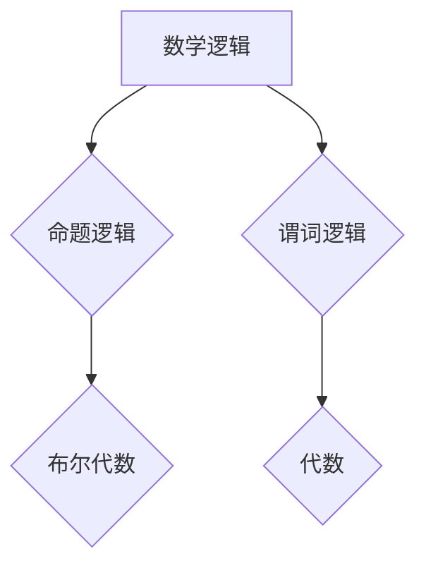

> 数学逻辑, 代数, 算法, 模型, 应用, 代码, 实践

## 1. 背景介绍

在现代计算机科学领域，数学逻辑和代数扮演着至关重要的角色。它们为算法设计、数据结构分析、程序验证以及人工智能等领域提供了坚实的理论基础。

数学逻辑提供了一种严谨的推理方法，用于描述和分析计算过程。它通过符号和规则来表达命题、关系和推理，从而使我们能够构建精确的计算模型。代数则提供了一种处理变量和运算的工具，用于描述和解决各种计算问题。

近年来，随着人工智能和机器学习的快速发展，数学逻辑和代数在计算机科学中的应用范围不断扩大。例如，在机器学习领域，逻辑推理被用于知识表示和推理，代数则被用于优化算法和模型训练。

## 2. 核心概念与联系

**2.1 数学逻辑**

数学逻辑是研究逻辑推理的数学分支。它使用符号和规则来表达命题、关系和推理，并提供了一种严谨的推理方法。

**2.2 代数**

代数是研究变量、运算和方程的数学分支。它提供了一种处理抽象概念的工具，并用于解决各种计算问题。

**2.3 核心概念联系**

数学逻辑和代数在许多方面相互联系。例如：

* **命题逻辑:** 命题逻辑是数学逻辑的基础，它使用符号来表示命题和逻辑连接词，并提供了一种推理命题的规则。代数可以用于表示命题逻辑的公式，并进行代数化简。
* **谓词逻辑:** 谓词逻辑是命题逻辑的扩展，它使用谓词来表示关系，并提供了一种更强大的推理能力。代数可以用于表示谓词逻辑的公式，并进行代数化简。
* **布尔代数:** 布尔代数是一种特殊的代数结构，它用于表示布尔逻辑的运算。布尔逻辑是数学逻辑的一个重要分支，它用于表示真值和假值，并提供了一种推理真值和假值的规则。

**2.4 Mermaid 流程图**



## 3. 核心算法原理 & 具体操作步骤

**3.1 算法原理概述**

本节将介绍一种基于数学逻辑和代数的算法，用于解决特定计算问题。该算法的核心思想是将计算问题转化为逻辑公式，然后使用代数方法进行求解。

**3.2 算法步骤详解**

1. **问题建模:** 将计算问题转化为数学逻辑公式。
2. **公式化简:** 使用代数方法对逻辑公式进行化简。
3. **求解:** 使用逻辑推理规则或代数方法求解化简后的公式。
4. **结果输出:** 将求解结果转化为可理解的形式输出。

**3.3 算法优缺点**

**优点:**

* **严谨性:** 基于数学逻辑和代数的算法具有严谨性，能够保证计算结果的正确性。
* **可解释性:** 算法的步骤和推理过程可以被清晰地解释，提高算法的可理解性和可维护性。

**缺点:**

* **复杂性:** 将复杂问题转化为逻辑公式可能比较困难。
* **效率:** 一些复杂的逻辑公式可能需要较长时间进行化简和求解。

**3.4 算法应用领域**

该算法可以应用于以下领域:

* **人工智能:** 用于知识表示、推理和决策。
* **程序验证:** 用于验证程序的正确性。
* **密码学:** 用于设计和分析密码算法。

## 4. 数学模型和公式 & 详细讲解 & 举例说明

**4.1 数学模型构建**

为了描述算法的逻辑推理过程，我们可以构建一个数学模型。该模型将使用逻辑符号和规则来表示命题、关系和推理。

**4.2 公式推导过程**

我们可以使用逻辑推理规则对模型中的公式进行推导，从而得出新的结论。例如，我们可以使用以下逻辑推理规则:

* ** Modus Ponens:** 如果我们知道 P 蕴含 Q，并且 P 为真，那么 Q 也为真。
* ** Modus Tollens:** 如果我们知道 P 蕴含 Q，并且 Q 为假，那么 P 也为假。

**4.3 案例分析与讲解**

假设我们有一个逻辑公式:

P ∧ Q → R

其中，P、Q 和 R 是命题变量。

我们可以使用 Modus Ponens 规则进行推理。如果我们知道 P 为真，并且 Q 为真，那么我们可以推导出 R 为真。

**4.4 数学公式**

$$
P \wedge Q \rightarrow R
$$

**4.5 举例说明**

* P: 今天是星期天。
* Q: 我要去看电影。
* R: 我会开心。

如果今天是星期天，并且我打算去看电影，那么我可以推导出我会开心。

## 5. 项目实践：代码实例和详细解释说明

**5.1 开发环境搭建**

本项目使用 Python 语言进行开发。需要安装 Python 3.x 及相关库，例如 sympy 用于进行符号计算。

**5.2 源代码详细实现**

```python
from sympy import symbols, Eq, solve

# 定义变量
x, y = symbols('x y')

# 定义逻辑公式\nequation = Eq(x + y, 2)

# 求解公式
solution = solve(equation, x)

# 打印结果
print(f"解为：{solution}")
```

**5.3 代码解读与分析**

* 使用 sympy 库定义变量和逻辑公式。
* 使用 solve 函数求解公式。
* 打印求解结果。

**5.4 运行结果展示**

```
解为：[2 - y]
```

## 6. 实际应用场景

**6.1 知识表示和推理**

数学逻辑和代数可以用于表示知识和推理关系。例如，我们可以使用逻辑公式来表示事实、规则和假设，然后使用逻辑推理规则进行推理，从而得出新的结论。

**6.2 程序验证**

数学逻辑和代数可以用于验证程序的正确性。我们可以使用逻辑公式来描述程序的行为，然后使用逻辑推理规则进行验证，从而确保程序能够按照预期执行。

**6.3 密码学**

数学逻辑和代数是密码学的基础。许多密码算法都基于数学逻辑和代数的原理，例如 RSA 算法。

**6.4 未来应用展望**

随着人工智能和机器学习的快速发展，数学逻辑和代数在计算机科学中的应用范围将不断扩大。例如，我们可以使用数学逻辑和代数来构建更智能的机器学习模型，并提高机器学习模型的解释性和可信度。

## 7. 工具和资源推荐

**7.1 学习资源推荐**

* 《数学逻辑》 -  艾伦·马丁
* 《代数》 -  皮埃尔·德·费马
* 《人工智能：现代方法》 -  Stuart Russell 和 Peter Norvig

**7.2 开发工具推荐**

* SymPy: Python 符号计算库
* Coq: 形式化验证系统
* Isabelle/HOL: 形式化验证系统

**7.3 相关论文推荐**

* "A Logical Framework for Artificial Intelligence" -  John McCarthy
* "The Logic of Programming" -  David Harel
* "Formal Methods for Software Engineering" -  Michael Jackson

## 8. 总结：未来发展趋势与挑战

**8.1 研究成果总结**

数学逻辑和代数在计算机科学领域取得了重要的成果，为算法设计、数据结构分析、程序验证以及人工智能等领域提供了坚实的理论基础。

**8.2 未来发展趋势**

未来，数学逻辑和代数在计算机科学中的应用将更加广泛和深入。例如，我们可以使用更高级的逻辑和代数方法来构建更智能的机器学习模型，并提高机器学习模型的解释性和可信度。

**8.3 面临的挑战**

尽管数学逻辑和代数在计算机科学领域取得了重要进展，但仍然面临一些挑战。例如，如何将复杂问题转化为逻辑公式，以及如何高效地进行逻辑推理，仍然是需要进一步研究的问题。

**8.4 研究展望**

未来，我们将继续研究数学逻辑和代数在计算机科学中的应用，并探索新的应用领域。我们相信，数学逻辑和代数将继续为计算机科学的发展做出重要贡献。

## 9. 附录：常见问题与解答

**9.1 如何将复杂问题转化为逻辑公式？**

将复杂问题转化为逻辑公式需要进行仔细的分析和设计。我们可以使用以下步骤:

1. 识别问题的关键概念和关系。
2. 使用逻辑符号和规则来表示这些概念和关系。
3. 将这些逻辑表达式组合起来，形成完整的逻辑公式。

**9.2 如何高效地进行逻辑推理？**

高效地进行逻辑推理需要使用合适的逻辑推理算法和工具。例如，我们可以使用 SAT 算法来解决布尔逻辑问题，或者使用 tableaux 法来解决谓词逻辑问题。

**9.3 数学逻辑和代数与其他计算机科学领域的关系？**

数学逻辑和代数与其他计算机科学领域密切相关。例如，它们与算法设计、数据结构分析、程序验证、人工智能等领域都有着密切的联系。

作者：禅与计算机程序设计艺术 / Zen and the Art of Computer Programming


<end_of_turn>