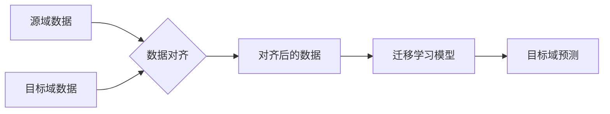

> 数据集对齐，迁移学习，跨领域学习，数据分布，特征映射，领域适应

## 1. 背景介绍

迁移学习作为机器学习领域的一项重要突破，旨在利用已训练模型在源域上的知识，迁移到目标域，从而提高目标域任务的性能。然而，现实世界中源域和目标域的数据分布往往存在显著差异，这导致模型在目标域上表现不佳，称为“领域适应”问题。

数据集对齐是解决领域适应问题的关键技术之一。它旨在通过对源域和目标域数据进行变换，使它们的分布更加一致，从而提高模型的迁移能力。

近年来，随着深度学习的兴起，数据集对齐技术取得了显著进展。各种基于特征映射、对抗学习和自监督学习的方法被提出，取得了令人瞩目的效果。

## 2. 核心概念与联系

**2.1 数据集对齐的概念**

数据集对齐是指将源域和目标域的数据分布进行调整，使其尽可能接近，从而使模型能够更好地迁移到目标域。

**2.2 领域适应问题**

领域适应是指在源域和目标域数据分布不同的情况下，利用源域模型的知识迁移到目标域，提高目标域任务的性能。

**2.3 迁移学习的流程**

迁移学习的流程通常包括以下步骤：

1. 在源域上训练一个模型。
2. 对源域和目标域数据进行对齐。
3. 将对齐后的源域数据和目标域数据联合训练，得到一个新的模型。
4. 在目标域上使用新的模型进行预测。

**2.4 数据集对齐与领域适应的关系**

数据集对齐是解决领域适应问题的关键技术之一。通过对齐源域和目标域数据，可以减少数据分布差异，从而提高模型的迁移能力。



## 3. 核心算法原理 & 具体操作步骤

### 3.1 算法原理概述

数据集对齐算法的目标是将源域和目标域的数据分布进行调整，使其尽可能接近。常用的数据集对齐算法包括：

* **特征映射方法:** 通过学习一个映射函数，将源域和目标域的数据映射到同一个特征空间，从而减少数据分布差异。
* **对抗学习方法:** 使用生成对抗网络 (GAN) 等方法，训练一个生成器来生成目标域的数据，使其与真实目标域数据更加相似。
* **自监督学习方法:** 利用源域和目标域数据的共性特征，训练一个模型来预测这些特征，从而学习到对齐的知识。

### 3.2 算法步骤详解

以特征映射方法为例，其具体步骤如下：

1. **提取特征:** 对源域和目标域的数据进行特征提取，可以使用预训练模型或深度学习模型。
2. **学习映射函数:** 使用一个神经网络模型学习一个映射函数，将源域和目标域的特征映射到同一个特征空间。
3. **评估对齐效果:** 使用一些度量指标，例如KL散度或Wasserstein距离，评估源域和目标域特征在映射后的分布差异。
4. **调整模型参数:** 根据对齐效果，调整映射函数的参数，使其能够更好地对齐源域和目标域数据。

### 3.3 算法优缺点

**优点:**

* 可以有效减少数据分布差异。
* 能够提高模型在目标域上的性能。

**缺点:**

* 需要大量的源域和目标域数据。
* 算法训练复杂，需要较高的计算资源。

### 3.4 算法应用领域

数据集对齐技术广泛应用于以下领域：

* **图像识别:** 将源域图像识别模型迁移到目标域图像识别任务中。
* **自然语言处理:** 将源域语言模型迁移到目标域语言理解或生成任务中。
* **医疗诊断:** 将源域医学图像识别模型迁移到目标域医学图像诊断任务中。

## 4. 数学模型和公式 & 详细讲解 & 举例说明

### 4.1 数学模型构建

假设源域数据分布为 $P_S(x)$, 目标域数据分布为 $P_T(x)$, 其中 $x$ 表示数据样本。

数据集对齐的目标是找到一个映射函数 $f(x)$，使得 $P_S(f(x))$ 与 $P_T(x)$ 的分布尽可能接近。

### 4.2 公式推导过程

常用的度量指标包括KL散度和Wasserstein距离。

* **KL散度:**

$$
KL(P_S(f(x))||P_T(x)) = \int P_S(f(x)) \log \frac{P_S(f(x))}{P_T(x)} dx
$$

* **Wasserstein距离:**

$$
W(P_S(f(x)), P_T(x)) = \inf_{f} \mathbb{E}_{x \sim P_S(f(x))} [||f(x) - y||]
$$

其中，$||\cdot||$ 表示距离度量，$y$ 是目标域数据样本。

### 4.3 案例分析与讲解

假设我们想要将一个源域图像识别模型迁移到目标域图像识别任务中。

我们可以使用特征映射方法，将源域和目标域图像特征映射到同一个特征空间。

通过最小化KL散度或Wasserstein距离，我们可以训练一个映射函数，使得源域和目标域特征分布更加一致。

## 5. 项目实践：代码实例和详细解释说明

### 5.1 开发环境搭建

* Python 3.7+
* TensorFlow 2.0+
* PyTorch 1.0+

### 5.2 源代码详细实现

```python
# 使用 TensorFlow 实现特征映射方法

import tensorflow as tf

# 定义映射函数
def mapping_function(x):
  # 使用多层神经网络进行特征映射
  x = tf.keras.layers.Dense(128, activation='relu')(x)
  x = tf.keras.layers.Dense(64, activation='relu')(x)
  x = tf.keras.layers.Dense(32, activation='relu')(x)
  return x

# 训练映射函数
source_data = ... # 源域数据
target_data = ... # 目标域数据

# 将源域和目标域数据进行特征提取
source_features = mapping_function(source_data)
target_features = mapping_function(target_data)

# 使用KL散度作为损失函数
loss_fn = tf.keras.losses.KLDivergence()
optimizer = tf.keras.optimizers.Adam()

# 训练循环
for epoch in range(num_epochs):
  with tf.GradientTape() as tape:
    loss = loss_fn(source_features, target_features)
  gradients = tape.gradient(loss, mapping_function.trainable_variables)
  optimizer.apply_gradients(zip(gradients, mapping_function.trainable_variables))

# 保存训练好的映射函数
mapping_function.save('mapping_function.h5')
```

### 5.3 代码解读与分析

* 代码首先定义了一个映射函数，使用多层神经网络进行特征映射。
* 然后，将源域和目标域数据进行特征提取，并使用KL散度作为损失函数，训练映射函数。
* 训练完成后，保存训练好的映射函数。

### 5.4 运行结果展示

训练完成后，可以使用训练好的映射函数将源域数据映射到目标域特征空间，并评估模型在目标域上的性能。

## 6. 实际应用场景

### 6.1 医疗诊断

将源域医学图像识别模型迁移到目标域医学图像诊断任务中，例如将源域肺部CT图像识别模型迁移到目标域脑部MRI图像诊断任务中。

### 6.2 自然语言处理

将源域语言模型迁移到目标域语言理解或生成任务中，例如将源域英语文本分类模型迁移到目标域中文文本分类任务中。

### 6.3 自动驾驶

将源域自动驾驶数据训练的模型迁移到目标域不同环境下的自动驾驶任务中，例如将源域晴天道路驾驶模型迁移到目标域雨天道路驾驶任务中。

### 6.4 未来应用展望

随着深度学习技术的不断发展，数据集对齐技术将有更广泛的应用场景，例如：

* **跨语言迁移学习:** 将源语言模型迁移到目标语言任务中，例如将英语模型迁移到中文任务中。
* **跨模态迁移学习:** 将源模态模型迁移到目标模态任务中，例如将图像识别模型迁移到语音识别任务中。
* **个性化迁移学习:** 将源用户数据训练的模型迁移到目标用户任务中，例如将源用户个性化推荐模型迁移到目标用户任务中。

## 7. 工具和资源推荐

### 7.1 学习资源推荐

* **论文:**
    * "Domain Adaptation" by Long et al. (2015)
    * "Transfer Learning" by Pan and Yang (2010)
* **书籍:**
    * "Deep Learning" by Goodfellow et al. (2016)
    * "Hands-On Machine Learning with Scikit-Learn, Keras & TensorFlow" by Aurélien Géron (2019)

### 7.2 开发工具推荐

* **TensorFlow:** https://www.tensorflow.org/
* **PyTorch:** https://pytorch.org/
* **Keras:** https://keras.io/

### 7.3 相关论文推荐

* "Adversarial Domain Adaptation" by Tzeng et al. (2017)
* "Domain-Invariant Feature Learning" by Hoffman et al. (2018)
* "Self-Supervised Domain Adaptation" by Chen et al. (2020)

## 8. 总结：未来发展趋势与挑战

### 8.1 研究成果总结

数据集对齐技术取得了显著进展，为跨领域迁移学习提供了有效的解决方案。

### 8.2 未来发展趋势

* **更鲁棒的算法:** 开发更鲁棒的算法，能够应对更复杂的领域适应问题。
* **更少的标注数据:** 研究利用更少的标注数据进行数据集对齐。
* **跨模态迁移学习:** 将数据集对齐技术应用于跨模态迁移学习任务。

### 8.3 面临的挑战

* **数据分布差异:** 现实世界中源域和目标域数据分布差异往往很大，难以完全消除。
* **计算资源:** 一些数据集对齐算法需要大量的计算资源，难以在实际应用中部署。
* **可解释性:** 一些数据集对齐算法的决策过程难以解释，难以获得用户的信任。

### 8.4 研究展望

未来，数据集对齐技术将继续朝着更鲁棒、更高效、更可解释的方向发展，为跨领域迁移学习提供更强大的支持。

## 9. 附录：常见问题与解答

**Q1: 数据集对齐和数据增强有什么区别？**

**A1:** 数据集对齐和数据增强都是为了提高模型的泛化能力，但它们的目标不同。

数据集对齐旨在减少源域和目标域数据分布的差异，而数据增强旨在增加训练数据的多样性。

**Q2: 数据集对齐需要多少标注数据？**

**A2:** 不同的数据集对齐算法对标注数据的需求不同。

一些算法，例如对抗学习方法，可以利用无标注数据进行训练，而一些算法，例如特征映射方法，则需要一定的标注数据。

**Q3: 数据集对齐技术有哪些局限性？**

**A3:** 数据集对齐技术仍然存在一些局限性，例如难以完全消除数据分布差异，需要大量的计算资源，以及决策过程难以解释等。


作者：禅与计算机程序设计艺术 / Zen and the Art of Computer Programming 
<end_of_turn>