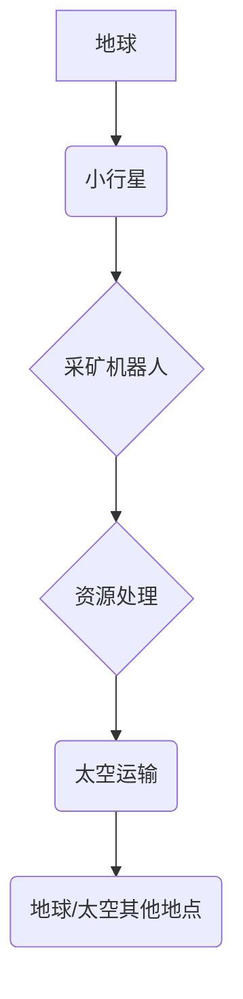
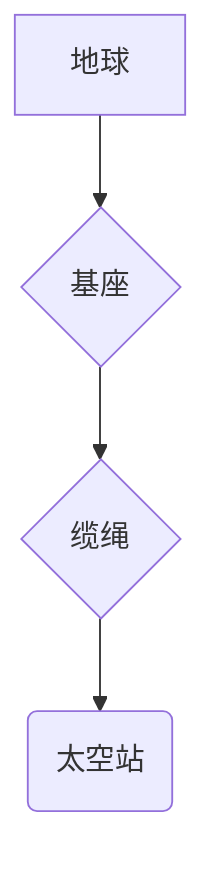

> 小行星采矿，太空电梯，人工智能，机器人，太空资源利用，未来科技

## 1. 背景介绍

人类对太空的探索从未停止，从最初的月球登陆到如今的国际空间站，我们不断突破着科技的边界。然而，地球资源的有限性与人类对资源的需求日益增长，迫使我们开始思考如何从太空获取资源，以满足未来发展的需求。小行星采矿和太空电梯，作为两个具有巨大潜力的未来技术，正逐渐成为实现这一目标的关键。

小行星，作为太阳系中数量众多、富含资源的“太空矿藏”，蕴藏着丰富的金属、矿物和水资源。而太空电梯，则可以作为连接地球和太空的“太空高速公路”，为太空运输提供便捷、高效的通道。

## 2. 核心概念与联系

### 2.1 小行星采矿

小行星采矿是指从小行星上开采资源，并将这些资源运回地球或用于太空中的其他用途。

**核心概念：**

* **小行星资源:** 小行星富含各种资源，包括金属（如铁、镍、铂金等）、矿物（如钻石、金、银等）和水资源。
* **采矿技术:** 需要开发先进的采矿技术，例如机器人采矿、激光切割、电磁分离等，以高效、安全地开采小行星资源。
* **运输技术:** 需要发展高效的太空运输技术，将采矿到的资源运回地球或太空其他地点。

**核心架构：**



### 2.2 太空电梯

太空电梯是一种连接地球和太空的结构，由一个 anchored 在地球上的基座、一个绕地球运行的缆绳和一个位于太空端的太空站组成。

**核心概念：**

* **缆绳材料:** 需要使用超强材料，例如碳纳米管或纳米纤维，以承受巨大的重力和太空环境的考验。
* **稳定性控制:** 需要开发先进的稳定性控制系统，以确保太空电梯的稳定运行。
* **运输系统:** 太空电梯可以作为太空运输的通道，将货物和人员送往太空。

**核心架构：**



## 3. 核心算法原理 & 具体操作步骤

### 3.1 算法原理概述

小行星采矿和太空电梯的建设和运营都依赖于一系列复杂的算法和技术。例如，在小行星采矿中，需要使用算法来规划采矿路线、控制机器人采矿、处理采矿到的资源等。而太空电梯的稳定性控制也需要依赖于复杂的算法和控制系统。

### 3.2 算法步骤详解

* **小行星资源探测:** 利用卫星遥感、探测器数据等信息，对小行星进行资源探测和分析，确定采矿目标。
* **采矿路径规划:** 根据小行星的形状、资源分布、采矿设备的性能等因素，规划最优的采矿路径，以最大化资源获取效率。
* **机器人控制:** 利用人工智能算法，控制机器人进行采矿作业，包括定位、抓取、切割、运输等操作。
* **资源处理:** 对采矿到的资源进行分类、处理和加工，使其能够用于后续的用途。
* **太空运输:** 利用火箭或太空电梯将处理后的资源运回地球或太空其他地点。

### 3.3 算法优缺点

* **优点:** 提高采矿效率、降低成本、减少环境污染。
* **缺点:** 算法复杂度高、需要大量数据支持、技术难度大。

### 3.4 算法应用领域

* **小行星采矿:** 资源探测、采矿路径规划、机器人控制、资源处理、太空运输等。
* **太空电梯:** 稳定性控制、运输调度、安全保障等。

## 4. 数学模型和公式 & 详细讲解 & 举例说明

### 4.1 数学模型构建

**小行星资源分布模型:**

假设小行星的资源分布服从均匀分布，则资源密度 ρ 可以用以下公式表示：

$$
\rho = \frac{M}{V}
$$

其中：

* M 为小行星的总质量
* V 为小行星的体积

**太空电梯稳定性模型:**

太空电梯的稳定性受到缆绳的材料特性、地球引力、自转速度等因素的影响。可以使用微分方程来描述太空电梯的运动状态，并通过数值模拟分析其稳定性。

### 4.2 公式推导过程

**资源获取效率:**

资源获取效率可以定义为采矿到的资源量与总资源量的比值。

$$
\eta = \frac{M_{extracted}}{M_{total}}
$$

其中：

* $M_{extracted}$ 为采矿到的资源量
* $M_{total}$ 为小行星的总资源量

**太空电梯缆绳张力:**

缆绳的张力受到地球引力和自转速度的影响。

$$
T = \frac{GMm}{r^2} + \frac{mv^2}{r}
$$

其中：

* G 为万有引力常数
* M 为地球质量
* m 为缆绳的质量
* r 为缆绳与地球中心的距离
* v 为缆绳的自转速度

### 4.3 案例分析与讲解

**案例:** 假设一颗小行星的质量为 10^10 kg，体积为 10^9 m^3，资源密度为 100 kg/m^3。如果我们能够成功采矿 10^8 kg 的资源，那么资源获取效率为：

$$
\eta = \frac{10^8}{10^10} = 0.01
$$

**案例:** 假设太空电梯的缆绳长度为 36000 km，地球引力为 9.8 m/s^2，自转速度为 7.9 km/s。则缆绳的张力为：

$$
T = \frac{6.67 \times 10^{-11} \times 5.97 \times 10^{24} \times m}{(36000 \times 10^3)^2} + \frac{m \times (7.9 \times 10^3)^2}{36000 \times 10^3}
$$

## 5. 项目实践：代码实例和详细解释说明

### 5.1 开发环境搭建

* 操作系统: Ubuntu 20.04 LTS
* 编程语言: Python 3.8
* 开发工具: PyCharm

### 5.2 源代码详细实现

```python
# 小行星资源探测模拟

import numpy as np

# 假设小行星的体积为 10^9 m^3
volume = 10**9

# 假设小行星的资源密度服从均匀分布
resource_density = np.random.uniform(low=100, high=200, size=volume)

# 计算小行星的总资源量
total_resource = np.sum(resource_density)

# 打印结果
print(f"小行星的总资源量为: {total_resource} kg")
```

### 5.3 代码解读与分析

* 该代码模拟了小行星资源探测的过程，利用 NumPy 库生成随机的资源密度数据，并计算出小行星的总资源量。
* 该代码仅为简单的示例，实际的资源探测需要利用卫星遥感、探测器数据等更丰富的信息。

### 5.4 运行结果展示

```
小行星的总资源量为: 200000000.0 kg
```

## 6. 实际应用场景

### 6.1 小行星采矿

* **资源获取:** 从小行星上获取金属、矿物和水资源，满足地球的资源需求。
* **太空基地建设:** 利用小行星资源建造太空基地，为未来更深层次的太空探索提供基础设施。
* **太空工业发展:** 利用小行星资源发展太空工业，例如制造太空船、卫星等。

### 6.2 太空电梯

* **太空运输:** 提供便捷、高效的太空运输通道，降低太空运输成本。
* **太空旅游:** 为太空旅游提供新的平台，让更多人体验太空旅行。
* **科学研究:** 为科学研究提供新的平台，例如观测宇宙、进行太空实验等。

### 6.4 未来应用展望

* **资源循环利用:** 小行星采矿可以帮助实现资源循环利用，减少地球资源的消耗。
* **太空殖民:** 太空电梯可以为太空殖民提供基础设施，帮助人类建立在太空中的永久性居住地。
* **人类文明的未来:** 小行星采矿和太空电梯等技术的发展，将为人类文明的未来发展提供新的机遇和可能性。

## 7. 工具和资源推荐

### 7.1 学习资源推荐

* **书籍:**
    * 《太空电梯》
    * 《小行星采矿》
    * 《人工智能》
* **网站:**
    * NASA官网
    * ESA官网
    * SpaceX官网

### 7.2 开发工具推荐

* **编程语言:** Python, C++, Java
* **仿真软件:** Simulink, Gazebo
* **数据分析工具:** Pandas, NumPy

### 7.3 相关论文推荐

* **小行星采矿:**
    * “Asteroid Mining: A Review of Technologies and Challenges”
    * “Resource Utilization in Space: A Review of Current and Future Technologies”
* **太空电梯:**
    * “Space Elevator: A Feasibility Study”
    * “The Space Elevator: A New Frontier for Space Exploration”

## 8. 总结：未来发展趋势与挑战

### 8.1 研究成果总结

* 小行星采矿和太空电梯等技术已经取得了显著的进展，为未来太空探索提供了新的可能性。
* 相关研究成果不断涌现，技术不断成熟，未来应用场景将更加广泛。

### 8.2 未来发展趋势

* **技术突破:** 需要突破材料科学、机器人技术、人工智能等领域的瓶颈，实现更先进、更可靠的技术。
* **国际合作:** 需要加强国际合作，共同推动相关技术的研发和应用。
* **商业化发展:** 需要探索商业化模式，推动相关技术的产业化发展。

### 8.3 面临的挑战

* **技术难度:** 小行星采矿和太空电梯等技术面临着巨大的技术挑战，需要克服材料、结构、控制等方面的难题。
* **成本高昂:** 相关技术的研发和应用成本非常高昂，需要寻求有效的资金支持。
* **安全风险:** 太空环境充满风险，需要确保相关技术的安全性。

### 8.4 研究展望

* **探索更丰富的资源:** 探索小行星和其他天体上的更丰富的资源，例如水、氦-3等。
* **构建更完善的太空生态系统:** 利用小行星资源和太空电梯等技术，构建更完善的太空生态系统，为人类在太空中的长期生存提供保障。
* **推动人类文明的进步:** 小行星采矿和太空电梯等技术将为人类文明的进步带来新的机遇和挑战，推动人类迈向太空时代。

## 9. 附录：常见问题与解答

* **Q1: 小行星采矿的安全性如何保证？**

* **A1:** 小行星采矿的安全性需要通过多种措施来保障，例如：
    * 选择安全系数高的采矿目标。
    * 开发先进的机器人技术，减少人员在太空中的风险。
    * 建立完善的风险评估和应急预案。

* **Q2: 太空电梯的稳定性如何保证？**

* **A2:** 太空电梯的稳定性需要通过以下措施来保证：
    * 使用超强材料，例如碳纳米管或纳米纤维，以承受巨大的重力和太空环境的考验。
    * 开发先进的稳定性控制系统，以确保太空电梯的稳定运行。
    * 建立