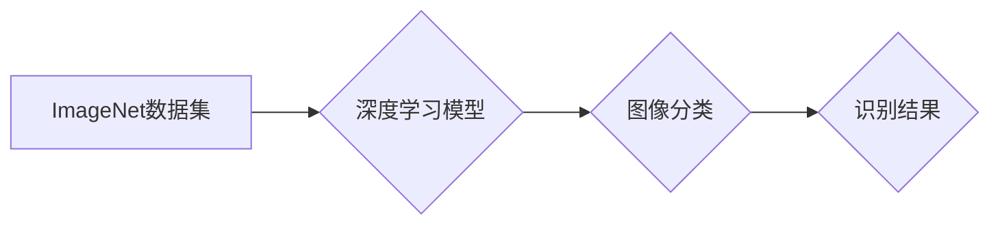

> ImageNet, 深度学习, 计算机视觉, 图像分类, 大规模数据集, 算法创新, 

## 1. 背景介绍

2000年代初，计算机视觉领域正处于一个重要的转折点。传统的计算机视觉算法，例如基于特征的匹配和模板匹配，在识别复杂场景和物体方面表现有限。随着互联网的快速发展，海量图像数据涌现，为深度学习的兴起提供了 fertile ground。

在这个背景下，斯坦福大学教授李飞飞教授和她的团队于2009年发起了一个名为ImageNet的项目。ImageNet是一个大型的图像识别数据集，包含超过1400万张图像，并被分类到超过20,000个不同的类别。这个项目旨在为计算机视觉研究提供一个统一的标准平台，并推动深度学习算法的创新。

## 2. 核心概念与联系

ImageNet的成功离不开以下几个核心概念：

* **大规模数据集:** ImageNet拥有海量图像数据，为深度学习模型提供了充足的训练样本，从而提高了模型的泛化能力。
* **多标签分类:** ImageNet采用多标签分类的方式，即一张图像可以属于多个类别，这使得模型能够学习到更丰富的语义信息。
* **层次结构分类:** ImageNet的类别结构采用层次化的方式，将图像按照不同的层级进行分类，这使得模型能够学习到图像之间的语义关系。

**Mermaid 流程图:**



## 3. 核心算法原理 & 具体操作步骤

### 3.1  算法原理概述

ImageNet的成功离不开深度学习算法的突破。其中，卷积神经网络（CNN）是深度学习领域最成功的算法之一。CNN能够自动学习图像特征，并将其用于图像分类、目标检测等任务。

### 3.2  算法步骤详解

1. **数据预处理:** 将图像数据进行预处理，例如调整大小、归一化等，以提高模型的训练效率。
2. **卷积层:** 使用卷积核对图像进行卷积运算，提取图像特征。
3. **池化层:** 对卷积层的输出进行池化运算，例如最大池化，减少特征图的大小，提高模型的鲁棒性。
4. **全连接层:** 将池化层的输出连接到全连接层，进行分类。
5. **损失函数:** 使用交叉熵损失函数衡量模型的预测结果与真实标签之间的差异。
6. **优化算法:** 使用梯度下降算法优化模型参数，降低损失函数的值。

### 3.3  算法优缺点

**优点:**

* 能够自动学习图像特征，无需人工设计特征。
* 性能优于传统的计算机视觉算法。
* 能够处理高分辨率图像。

**缺点:**

* 训练时间长，需要大量的计算资源。
* 对训练数据要求高，数据质量直接影响模型性能。
* 容易过拟合，需要进行正则化等技术来避免。

### 3.4  算法应用领域

CNN算法在图像识别、目标检测、图像分割等计算机视觉领域有着广泛的应用，例如：

* **人脸识别:** 用于身份验证、人脸搜索等应用。
* **物体检测:** 用于自动驾驶、安防监控等应用。
* **图像分类:** 用于医学图像诊断、产品分类等应用。

## 4. 数学模型和公式 & 详细讲解 & 举例说明

### 4.1  数学模型构建

CNN的数学模型主要包括卷积层、池化层和全连接层。

* **卷积层:** 使用卷积核对图像进行卷积运算，提取图像特征。卷积运算的数学公式如下：

$$
y_{i,j} = \sum_{m=0}^{M-1} \sum_{n=0}^{N-1} x_{i+m,j+n} * w_{m,n} + b
$$

其中：

* $x_{i,j}$ 是图像像素值。
* $w_{m,n}$ 是卷积核的权重。
* $b$ 是卷积层的偏置项。
* $y_{i,j}$ 是卷积层的输出值。

* **池化层:** 对卷积层的输出进行池化运算，例如最大池化，减少特征图的大小。最大池化的数学公式如下：

$$
y_{i,j} = \max_{m=0}^{M-1} \max_{n=0}^{N-1} x_{i*M+m,j*N+n}
$$

其中：

* $x_{i*M+m,j*N+n}$ 是卷积层的输出值。
* $y_{i,j}$ 是池化层的输出值。

* **全连接层:** 将池化层的输出连接到全连接层，进行分类。全连接层的数学公式如下：

$$
y_i = \sum_{j=0}^{N-1} x_j * w_{ij} + b_i
$$

其中：

* $x_j$ 是池化层的输出值。
* $w_{ij}$ 是全连接层的权重。
* $b_i$ 是全连接层的偏置项。
* $y_i$ 是全连接层的输出值。

### 4.2  公式推导过程

上述公式的推导过程涉及到线性代数、微积分等数学知识。

### 4.3  案例分析与讲解

通过对CNN算法的数学模型进行分析，我们可以更好地理解其工作原理，并进行模型优化。例如，我们可以通过调整卷积核的大小、步长、池化窗口的大小等参数，来提高模型的性能。

## 5. 项目实践：代码实例和详细解释说明

### 5.1  开发环境搭建

使用Python语言和深度学习框架TensorFlow或PyTorch进行开发。

### 5.2  源代码详细实现

```python
# 使用TensorFlow框架实现CNN模型

import tensorflow as tf

# 定义模型结构
model = tf.keras.models.Sequential([
    tf.keras.layers.Conv2D(32, (3, 3), activation='relu', input_shape=(224, 224, 3)),
    tf.keras.layers.MaxPooling2D((2, 2)),
    tf.keras.layers.Conv2D(64, (3, 3), activation='relu'),
    tf.keras.layers.MaxPooling2D((2, 2)),
    tf.keras.layers.Flatten(),
    tf.keras.layers.Dense(10, activation='softmax')
])

# 编译模型
model.compile(optimizer='adam',
              loss='sparse_categorical_crossentropy',
              metrics=['accuracy'])

# 训练模型
model.fit(x_train, y_train, epochs=10)

# 评估模型
loss, accuracy = model.evaluate(x_test, y_test)
print('Test loss:', loss)
print('Test accuracy:', accuracy)
```

### 5.3  代码解读与分析

这段代码定义了一个简单的CNN模型，并使用TensorFlow框架进行训练和评估。

* `tf.keras.models.Sequential` 创建了一个顺序模型，即层级结构。
* `tf.keras.layers.Conv2D` 定义了一个卷积层，用于提取图像特征。
* `tf.keras.layers.MaxPooling2D` 定义了一个最大池化层，用于减少特征图的大小。
* `tf.keras.layers.Flatten` 将多维特征图转换为一维向量。
* `tf.keras.layers.Dense` 定义了一个全连接层，用于分类。
* `model.compile` 编译模型，指定优化器、损失函数和评价指标。
* `model.fit` 训练模型，使用训练数据进行训练。
* `model.evaluate` 评估模型，使用测试数据进行评估。

### 5.4  运行结果展示

训练完成后，可以查看模型的训练损失和准确率，以及测试损失和准确率。

## 6. 实际应用场景

ImageNet的成功推动了深度学习在计算机视觉领域的广泛应用，例如：

* **自动驾驶:** 用于识别道路标志、车辆、行人等，辅助驾驶决策。
* **医疗诊断:** 用于识别病灶、辅助医生诊断疾病。
* **安防监控:** 用于人脸识别、行为分析，提高安防效率。
* **电商推荐:** 用于商品分类、图像搜索，提高用户体验。

### 6.4  未来应用展望

随着深度学习技术的不断发展，ImageNet的应用场景将更加广泛，例如：

* **增强现实 (AR) 和虚拟现实 (VR):** 用于场景理解、物体识别，增强用户体验。
* **机器人视觉:** 用于机器人感知环境、导航、抓取等。
* **智能家居:** 用于图像识别、语音识别，实现智能家居控制。

## 7. 工具和资源推荐

### 7.1  学习资源推荐

* **书籍:**
    * 《深度学习》
    * 《计算机视觉:算法与应用》
* **在线课程:**
    * Coursera: 深度学习
    * Udacity: 计算机视觉

### 7.2  开发工具推荐

* **深度学习框架:** TensorFlow, PyTorch
* **图像处理库:** OpenCV

### 7.3  相关论文推荐

* **ImageNet Classification with Deep Convolutional Neural Networks**
* **AlexNet**

## 8. 总结：未来发展趋势与挑战

### 8.1  研究成果总结

ImageNet项目取得了巨大的成功，推动了深度学习在计算机视觉领域的应用。

### 8.2  未来发展趋势

未来，ImageNet将继续发展，例如：

* **更大规模的数据集:** 构建更庞大、更全面的图像数据集。
* **更复杂的模型架构:** 开发更深、更复杂的深度学习模型。
* **跨模态学习:** 将图像数据与其他模态数据（例如文本、音频）进行融合学习。

### 8.3  面临的挑战

ImageNet的发展也面临着一些挑战，例如：

* **数据标注:** 大规模图像数据集的标注工作非常耗时和费力。
* **计算资源:** 训练大型深度学习模型需要大量的计算资源。
* **模型解释性:** 深度学习模型的决策过程难以解释，这限制了其在一些领域中的应用。

### 8.4  研究展望

未来，我们需要继续探索新的算法、模型和数据集，以克服这些挑战，推动ImageNet的发展，并将其应用于更多领域。

## 9. 附录：常见问题与解答

* **Q: ImageNet数据集的类别有哪些？**
* **A:** ImageNet数据集包含超过20,000个不同的类别，涵盖了各种物体、场景和概念。

* **Q: 如何获取ImageNet数据集？**
* **A:** ImageNet数据集可以通过官方网站下载。

* **Q: 如何使用ImageNet数据集进行训练？**
* **A:** 可以使用深度学习框架TensorFlow或PyTorch进行训练。

作者：禅与计算机程序设计艺术 / Zen and the Art of Computer Programming


<end_of_turn>