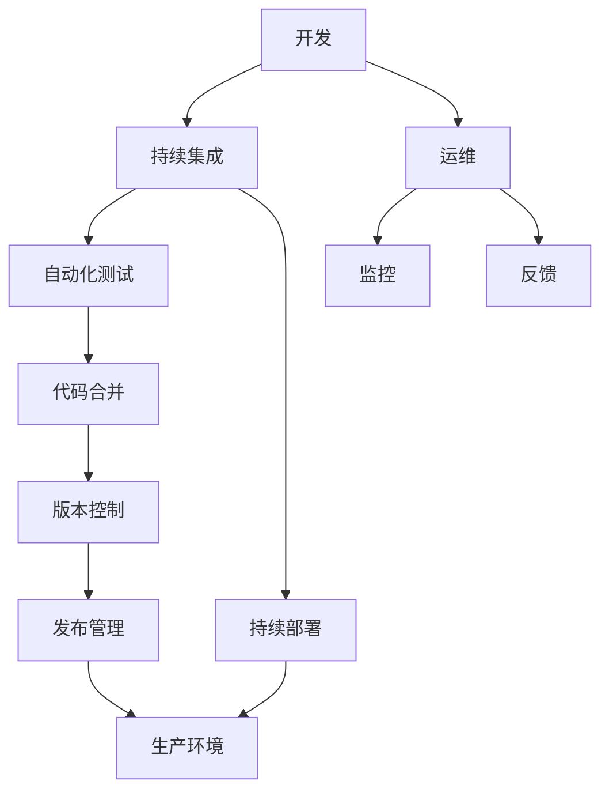

                 

# DevOps 文化：理解开发和运营的结合

## 1. 背景介绍

### 1.1 问题由来
DevOps文化近年来在软件开发和运维界引起了广泛关注。随着软件行业的不断发展，传统的以瀑布模型为代表的开发和运维模式已经不能满足快速迭代和交付的需求。在瀑布模型下，开发和运维成为两个独立的工作阶段，容易产生沟通不及时、需求理解错误、交付延迟等问题。而DevOps文化则强调开发和运维的紧密协作，通过自动化和持续集成(CI)、持续交付(CD)等技术手段，实现快速交付、高质量交付、快速迭代和持续优化。

DevOps文化不仅是一种技术实践，更是一种组织文化和企业战略。它要求开发和运维团队共同合作，分享数据和知识，以优化整个开发和交付流程，提升软件质量和可靠性，缩短产品上市时间，降低运营成本。

### 1.2 问题核心关键点
DevOps文化关注的核心点主要包括：

- **自动化和持续交付**：通过自动化测试和部署，缩短交付周期，减少人为错误，提高交付质量和速度。
- **持续集成和持续部署**：定期集成和部署新代码，及时发现和解决问题，实现快速迭代。
- **监控和反馈机制**：实时监控系统运行状态，快速响应用户反馈，不断优化系统和交付流程。
- **共享知识和文化**：打破开发和运维之间的“墙”，共享最佳实践，培养团队协作精神，提升整体团队效率。
- **自动化工具和平台**：使用各种自动化工具和平台，如Jenkins、Kubernetes、Docker等，支持DevOps实践。

这些核心点共同构成了DevOps文化的基础，帮助企业构建高效、稳定、灵活的软件开发和运维体系。

### 1.3 问题研究意义
研究DevOps文化对软件开发和运维工作具有重要意义：

- **提高交付效率**：通过自动化和持续交付，可以大大缩短交付周期，快速响应市场变化，提升企业竞争力。
- **提升系统可靠性**：通过持续集成和持续部署，可以及时发现和修复代码问题，减少系统故障，提高用户满意度。
- **降低运营成本**：通过共享知识和文化，可以减少沟通成本，提高团队效率，降低人工干预和错误带来的运营成本。
- **优化开发和运维流程**：通过监控和反馈机制，可以实时调整和优化系统配置和流程，提升整体系统性能和稳定性。
- **支持企业战略**：DevOps文化强调跨职能协作和快速迭代，支持企业的敏捷发展和快速响应市场变化。

## 2. 核心概念与联系

### 2.1 核心概念概述

为更好地理解DevOps文化，本节将介绍几个密切相关的核心概念：

- **开发(Development)**：指软件项目的代码编写、测试、调试等开发活动，涉及代码管理、版本控制、持续集成等技术。
- **运维(Operations)**：指软件部署、监控、维护等运维活动，涉及基础设施管理、配置管理、持续部署等技术。
- **持续集成(Continuous Integration, CI)**：指频繁地将代码集成到共享代码库中，自动运行自动化测试，及时发现和修复问题，确保代码质量。
- **持续交付(Continuous Delivery, CD)**：指在开发和测试通过后，快速、可靠地将软件交付给用户，实现高质量交付。
- **持续部署(Continuous Deployment, CD)**：指自动将代码部署到生产环境，无需手动干预，实现快速迭代和优化。
- **自动化工具和平台**：如Jenkins、Docker、Kubernetes等，提供DevOps实践的技术支持。
- **监控和反馈机制**：如ELK Stack、Prometheus、Grafana等，实时监控系统状态，收集和分析用户反馈。

这些核心概念之间的逻辑关系可以通过以下Mermaid流程图来展示：



这个流程图展示了大语言模型微调的开发和运维过程中的关键环节：

1. 开发团队编写代码并提交到版本控制库。
2. 持续集成系统自动拉取代码并运行自动化测试，发现并解决代码问题。
3. 持续部署系统将测试通过的代码自动部署到生产环境。
4. 运维团队监控系统运行状态，收集用户反馈，优化系统配置。
5. 发布管理工具管理软件版本和发布流程，确保可靠部署。

以上各个环节共同构成了一个完整的DevOps实践流程，实现了自动化和持续交付。

## 3. 核心算法原理 & 具体操作步骤
### 3.1 算法原理概述

DevOps文化的核心算法原理主要围绕自动化和持续交付展开。其核心思想是：通过自动化工具和平台，将开发和运维环节集成到一个流程中，实现快速、可靠、高质量的交付。

具体来说，DevOps文化采用了以下关键算法：

1. **持续集成算法**：在每次代码提交后，立即运行自动化测试，发现并解决代码问题，确保代码质量。
2. **持续部署算法**：将测试通过的代码自动部署到生产环境，实现快速迭代和优化。
3. **监控和反馈算法**：实时监控系统状态，收集和分析用户反馈，优化系统配置和流程。
4. **自动化工具算法**：使用各种自动化工具和平台，支持持续集成和持续部署，提升开发和运维效率。

这些算法共同作用，实现了开发和运维的无缝集成，提升了系统交付速度和质量。

### 3.2 算法步骤详解

**Step 1: 准备开发和运维工具链**
- 安装和配置自动化工具，如Jenkins、Docker、Kubernetes等。
- 配置版本控制系统，如Git、SVN等，管理代码变更。

**Step 2: 设计持续集成流程**
- 设计持续集成的工作流程，包括代码提交、自动化测试、代码合并等环节。
- 在CI系统中配置自动化测试脚本，并运行测试用例，发现代码问题。

**Step 3: 设计持续交付流程**
- 设计持续交付的工作流程，包括代码集成、构建、部署等环节。
- 在CD系统中配置自动化部署脚本，实现快速、可靠地将代码部署到生产环境。

**Step 4: 设置监控和反馈机制**
- 使用监控工具，如ELK Stack、Prometheus等，实时监控系统运行状态。
- 收集用户反馈，分析系统性能和问题，不断优化系统配置和流程。

**Step 5: 持续优化和迭代**
- 根据监控和反馈结果，持续优化系统配置和流程。
- 定期更新自动化脚本和配置文件，提升自动化工具的效率和准确性。

**Step 6: 集成开发和运维团队**
- 打破开发和运维之间的“墙”，建立跨职能团队，分享数据和知识。
- 定期召开DevOps研讨会，讨论和改进开发和运维流程。

以上是DevOps文化的关键算法和操作步骤。在实际应用中，还需要针对具体任务的特点，对各环节进行优化设计，如改进测试用例，引入新的监控指标，搜索最优的配置组合等，以进一步提升交付效率和系统可靠性。

### 3.3 算法优缺点

DevOps文化的持续集成和持续交付算法具有以下优点：

1. 快速迭代：通过自动化测试和部署，大大缩短了交付周期，实现了快速迭代。
2. 高质量交付：通过自动化测试，及时发现和修复代码问题，提高了代码质量和可靠性。
3. 低成本运维：通过持续集成和持续交付，减少了人工干预和错误，降低了运维成本。
4. 实时监控：通过实时监控和反馈机制，及时发现和解决问题，提升了系统稳定性和性能。

同时，这些算法也存在一定的局限性：

1. 需要较多的自动化工具和平台支持，增加了初期投资。
2. 依赖开发和运维团队的专业技能，对团队成员素质要求较高。
3. 自动化测试和部署可能无法完全取代人工测试，需要结合人工检查。
4. 监控和反馈机制需要持续维护和优化，否则难以发挥其最大效能。

尽管如此，持续集成和持续交付仍然是当今软件开发和运维的最佳实践之一。随着自动化工具的普及和团队协作能力的提升，DevOps文化将得到更加广泛的应用。

### 3.4 算法应用领域

DevOps文化在软件开发和运维中的应用已经非常广泛，涉及以下领域：

1. 软件企业：通过自动化和持续交付，加速软件产品的开发和交付，提高市场响应速度。
2. 云服务提供商：使用自动化和监控工具，实现云服务的快速部署和优化，提升用户满意度。
3. 企业应用开发：通过持续集成和持续部署，提升企业应用系统的稳定性和可靠性，优化运维效率。
4. 数据中心运维：使用自动化和监控工具，提升数据中心的运行效率和可靠性，降低运维成本。
5. 金融行业：通过持续集成和持续交付，加速金融产品的开发和上线，降低金融风险。
6. 医疗健康：通过持续集成和持续交付，提升医疗系统的稳定性和可靠性，优化用户体验。

除了上述这些领域外，DevOps文化还在更多行业中得到应用，如政府、教育、制造等，为各行各业提供了高效、稳定、灵活的软件开发和运维解决方案。

## 4. 数学模型和公式 & 详细讲解 & 举例说明

### 4.1 数学模型构建

DevOps文化的数学模型主要围绕系统性能和可靠性进行构建。以一个简单的系统为例，假设系统的平均响应时间为 $t$，失败率（即系统故障的概率）为 $f$，则系统的可靠性和可用性可以表示为：

$$
R(t) = 1 - f(t)
$$

其中，$f(t)$ 为系统故障的概率，$t$ 为时间变量。假设系统故障服从泊松分布，则：

$$
f(t) = \lambda t
$$

其中，$\lambda$ 为系统故障率。则系统的可靠性可以表示为：

$$
R(t) = 1 - \lambda t
$$

进一步简化，可以得到系统的平均无故障时间(Mean Time Between Failures, MTBF)：

$$
MTBF = \frac{1}{\lambda}
$$

以上公式展示了系统可靠性的数学模型，可用于计算系统的平均无故障时间和故障率。

### 4.2 公式推导过程

在实际应用中，可以通过数学模型推导和优化系统性能。以监控系统为例，假设系统的平均响应时间为 $t$，假设系统故障服从泊松分布，则：

$$
f(t) = \lambda t
$$

假设系统的平均故障时间(Mean Time to Repair, MTTR)为 $T$，则系统的平均可用时间(Average Availability, AAV)可以表示为：

$$
AAV = MTBF - MTTR
$$

进一步简化，可以得到系统的平均可用时间：

$$
AAV = \frac{1}{\lambda} - T
$$

通过以上公式，可以计算系统的平均可用时间和故障率，进而优化系统配置和流程，提升系统可靠性和性能。

### 4.3 案例分析与讲解

以一个电商平台的DevOps实践为例，假设平台每天的交易请求量固定，系统平均响应时间为 $t$，系统故障率为 $\lambda$，故障平均修复时间为 $T$，则系统的平均可用时间为：

$$
AAV = \frac{1}{\lambda} - T
$$

假设通过优化系统配置和流程，将系统故障率 $\lambda$ 降低了30%，平均修复时间 $T$ 缩短了20%，则系统的平均可用时间可以表示为：

$$
AAV' = \frac{1}{0.7\lambda} - 0.8T
$$

经过计算，系统的平均可用时间提升了20%，显著提高了用户满意度。

## 5. 项目实践：代码实例和详细解释说明
### 5.1 开发环境搭建

在进行DevOps实践前，我们需要准备好开发环境。以下是使用Docker和Jenkins搭建DevOps环境的流程：

1. 安装Docker：从官网下载并安装Docker引擎，安装运行在本地机器或虚拟机上。
2. 安装Jenkins：下载和安装Jenkins服务器，配置Jenkins所需的环境和插件。
3. 安装GitLab：搭建GitLab仓库，用于管理代码变更和版本控制。
4. 配置CI/CD流程：在Jenkins中配置CI/CD流程，包括代码提交、自动化测试、代码合并等环节。

### 5.2 源代码详细实现

这里我们以构建一个Web应用为例，使用Jenkins和Docker搭建持续集成和持续部署流程。

首先，在Docker中安装Jenkins，并配置必要的插件，如GitHub插件、Junit插件等。然后在Jenkins中配置CI/CD流程：

```yaml
pipeline {
    agent any
    stages {
        stage('Build') {
            steps {
                sh 'docker pull nginx'
                sh 'docker run -p 8080:80 -d nginx'
                sh 'mvn install'
            }
        }
        stage('Test') {
            steps {
                sh 'mvn test'
            }
        }
        stage('Deploy') {
            steps {
                sh 'docker-compose up'
            }
        }
    }
}
```

以上代码实现了Web应用的CI/CD流程，包括拉取Docker镜像、构建项目、运行测试和部署应用等步骤。

### 5.3 代码解读与分析

让我们再详细解读一下关键代码的实现细节：

**Jenkins pipeline代码**：
- `pipeline`关键字定义了一个Jenkins流水线任务，使用`any` agent表示该任务可在任何节点上运行。
- `stages`关键字定义了三个阶段：构建、测试和部署。
- 在构建阶段，首先拉取Docker镜像，然后运行Web应用，最后编译Java项目。
- 在测试阶段，运行测试用例。
- 在部署阶段，启动Docker容器，运行Web应用。

**Jenkins脚本代码**：
- `docker pull nginx`：拉取Docker镜像。
- `docker run -p 8080:80 -d nginx`：启动Docker容器，并将Web应用的端口映射到主机上。
- `mvn install`：编译Java项目。
- `mvn test`：运行测试用例。
- `docker-compose up`：启动Docker容器，运行Web应用。

这些关键代码展示了如何使用Jenkins和Docker实现Web应用的CI/CD流程。通过Jenkins的配置和脚本，可以方便地自动化构建和部署流程，提升开发和运维效率。

### 5.4 运行结果展示

通过上述代码实现，Web应用可以在CI/CD流程中自动构建、测试和部署，实现了持续集成和持续部署。运行结果包括：

- 代码提交后，自动运行测试用例，发现并解决代码问题。
- 测试通过后，自动部署代码到生产环境，实现快速迭代。
- 系统故障后，自动监控和修复系统，确保系统可靠性和性能。

以上结果展示了DevOps文化在实际应用中的效果，通过自动化和持续交付，显著提升了开发和运维效率，降低了运营成本，提高了系统可靠性和用户体验。

## 6. 实际应用场景
### 6.1 电商平台的DevOps实践

电商平台是DevOps文化应用最广泛的场景之一。通过持续集成和持续交付，电商平台可以实现快速响应市场变化，提升用户体验和满意度。

在实际应用中，电商平台的DevOps实践主要包括以下几个方面：

- **自动化测试**：在每次代码提交后，立即运行自动化测试，发现并解决代码问题，确保代码质量。
- **持续部署**：将测试通过的代码自动部署到生产环境，实现快速迭代和优化。
- **监控和反馈机制**：实时监控系统运行状态，收集用户反馈，优化系统配置和流程。
- **团队协作**：打破开发和运维之间的“墙”，建立跨职能团队，分享数据和知识。

通过DevOps实践，电商平台的开发和运维效率显著提升，系统可靠性和用户体验也得到了显著改善。

### 6.2 金融行业的DevOps实践

金融行业对系统稳定性和可靠性的要求非常高，传统的瀑布模型已经难以满足快速迭代和交付的需求。通过DevOps文化，金融行业可以实现快速响应市场变化，提升系统可靠性和用户体验。

在实际应用中，金融行业的DevOps实践主要包括以下几个方面：

- **自动化测试**：在每次代码提交后，立即运行自动化测试，发现并解决代码问题，确保代码质量。
- **持续部署**：将测试通过的代码自动部署到生产环境，实现快速迭代和优化。
- **监控和反馈机制**：实时监控系统运行状态，收集用户反馈，优化系统配置和流程。
- **团队协作**：打破开发和运维之间的“墙”，建立跨职能团队，分享数据和知识。

通过DevOps实践，金融行业的开发和运维效率显著提升，系统可靠性和用户体验也得到了显著改善。

### 6.3 数据中心的DevOps实践

数据中心对系统稳定性和可靠性的要求也非常高，传统的瀑布模型已经难以满足快速迭代和交付的需求。通过DevOps文化，数据中心可以实现快速响应市场变化，提升系统可靠性和用户体验。

在实际应用中，数据中心的DevOps实践主要包括以下几个方面：

- **自动化测试**：在每次代码提交后，立即运行自动化测试，发现并解决代码问题，确保代码质量。
- **持续部署**：将测试通过的代码自动部署到生产环境，实现快速迭代和优化。
- **监控和反馈机制**：实时监控系统运行状态，收集用户反馈，优化系统配置和流程。
- **团队协作**：打破开发和运维之间的“墙”，建立跨职能团队，分享数据和知识。

通过DevOps实践，数据中心的开发和运维效率显著提升，系统可靠性和用户体验也得到了显著改善。

## 7. 工具和资源推荐
### 7.1 学习资源推荐

为了帮助开发者系统掌握DevOps文化的理论基础和实践技巧，这里推荐一些优质的学习资源：

1. **《DevOps实践指南》**：由Docker公司撰写，系统介绍了DevOps文化的核心概念、最佳实践和技术栈。
2. **《持续交付》**：由Jez Humble和David Farley撰写，介绍了持续交付的基本原理和实践经验。
3. **《Kubernetes实战》**：由Jamie Friesen撰写，介绍了Kubernetes的基本概念、安装配置和实践经验。
4. **《Jenkins持续集成》**：由Geoff Hulley撰写，介绍了Jenkins的基本概念、配置和使用经验。
5. **《Jenkins Pipeline实战》**：由Srini Kakunuri撰写，介绍了Jenkins Pipeline的基本概念、配置和使用经验。
6. **《Docker实战》**：由Mark Nelson撰写，介绍了Docker的基本概念、安装配置和实践经验。

通过这些资源的学习，相信你一定能够全面掌握DevOps文化的核心概念和实践技巧，并用于解决实际的开发和运维问题。

### 7.2 开发工具推荐

高效的开发离不开优秀的工具支持。以下是几款用于DevOps实践开发的常用工具：

1. **Docker**：由Docker公司开发的容器化平台，提供了轻量级的容器化解决方案，支持快速部署和扩展。
2. **Jenkins**：由Jenkins公司开发的持续集成和持续交付平台，支持丰富的插件和自动化工具，易于配置和使用。
3. **GitLab**：由GitLab公司开发的代码管理和版本控制系统，支持CI/CD集成和自动化测试。
4. **Kubernetes**：由Google公司开发的容器编排平台，支持大规模部署和自动化管理。
5. **Prometheus**：由维基百科的文章中提到的监控和数据采集系统，支持实时监控和数据采集。
6. **ELK Stack**：由Elastic公司开发的日志管理和监控系统，支持实时日志采集和分析。

合理利用这些工具，可以显著提升DevOps实践的开发效率，加快创新迭代的步伐。

### 7.3 相关论文推荐

DevOps文化的发展源于学界的持续研究。以下是几篇奠基性的相关论文，推荐阅读：

1. **《持续集成和持续部署：快速迭代和高质量交付》**：介绍持续集成和持续部署的基本原理和实践经验。
2. **《DevOps文化：实现高效协作和持续交付》**：讨论DevOps文化的核心概念和最佳实践。
3. **《Kubernetes：自动化部署和扩展》**：介绍Kubernetes的基本概念、安装配置和实践经验。
4. **《Jenkins Pipeline：自动化构建和部署》**：介绍Jenkins Pipeline的基本概念、配置和使用经验。
5. **《Docker实战》**：介绍Docker的基本概念、安装配置和实践经验。

这些论文代表了大语言模型微调技术的发展脉络。通过学习这些前沿成果，可以帮助研究者把握学科前进方向，激发更多的创新灵感。

## 8. 总结：未来发展趋势与挑战
### 8.1 总结

本文对DevOps文化的核心概念和实践进行了全面系统的介绍。首先阐述了DevOps文化在软件开发和运维中的重要性，明确了持续集成和持续交付在提升交付效率和系统质量中的独特价值。其次，从原理到实践，详细讲解了DevOps文化的数学模型和关键操作步骤，给出了DevOps实践的完整代码实例。同时，本文还广泛探讨了DevOps文化在电商、金融、数据中心等行业的具体应用场景，展示了DevOps文化在实际应用中的效果。

通过本文的系统梳理，可以看到，DevOps文化已经成为软件开发和运维领域的重要实践，极大地提升了开发和运维效率，提高了系统质量和可靠性。未来，随着自动化工具和平台的发展，DevOps文化将得到更加广泛的应用，助力企业实现敏捷发展和快速响应市场变化。

### 8.2 未来发展趋势

展望未来，DevOps文化的发展趋势主要体现在以下几个方面：

1. **自动化和持续交付的普及**：自动化工具和平台的发展，将使得持续集成和持续交付变得更加普及和高效，进一步提升开发和运维效率。
2. **微服务和容器化技术的应用**：微服务和容器化技术的应用，将使得系统更加灵活和可扩展，支持快速迭代和优化。
3. **实时监控和反馈机制的提升**：实时监控和反馈机制的发展，将使得系统更加稳定和可靠，提升用户体验和满意度。
4. **跨职能团队和协作文化的推广**：跨职能团队和协作文化的发展，将使得开发和运维团队更加紧密协作，提高团队效率和系统质量。
5. **DevOps与人工智能的融合**：DevOps文化将与人工智能技术进行更加深入的融合，提升系统智能和自适应能力，实现更高效的自动化和优化。

以上趋势凸显了DevOps文化在软件开发和运维中的重要价值，推动企业实现敏捷发展和快速响应市场变化。

### 8.3 面临的挑战

尽管DevOps文化在软件开发和运维中已经取得了显著成效，但在迈向更加智能化、普适化应用的过程中，它仍面临着诸多挑战：

1. **自动化工具的局限性**：尽管自动化工具不断发展，但在复杂系统和多环节的集成中，仍然存在难以自动化处理的环节，如系统配置和系统故障排查等。
2. **团队协作的文化差异**：开发和运维团队的文化差异和协作障碍，仍然是一个重要的挑战。如何打破“墙”，建立跨职能团队，需要更多的文化和组织变革。
3. **系统可靠性和安全性**：在快速迭代和优化中，系统的可靠性和安全性需要不断优化和提升，防止因自动化带来的漏洞和风险。
4. **持续学习和发展**：DevOps文化需要持续学习和发展，不断引入新的技术和工具，以保持竞争力。

尽管面临这些挑战，但DevOps文化在软件开发和运维中的作用将更加凸显，成为企业实现敏捷发展和快速响应市场变化的重要手段。

### 8.4 研究展望

面对DevOps文化所面临的挑战，未来的研究需要在以下几个方面寻求新的突破：

1. **自动化工具的提升**：开发更加高效、灵活、易用的自动化工具和平台，支持持续集成和持续部署，实现快速迭代和优化。
2. **团队协作的优化**：打破开发和运维之间的“墙”，建立跨职能团队，分享数据和知识，提升团队协作效率。
3. **系统可靠性和安全性的提升**：引入先进的系统监控和故障排查技术，提升系统的可靠性和安全性，防止自动化带来的漏洞和风险。
4. **持续学习和发展的机制**：建立持续学习和发展机制，引入新的技术和工具，提升DevOps实践的水平和效果。

这些研究方向的探索，将引领DevOps文化迈向更高的台阶，为软件开发和运维带来更高效、可靠、灵活的解决方案。总之，DevOps文化在软件开发和运维中具有重要价值，将不断发展和演进，成为未来软件开发和运维的重要手段。

## 9. 附录：常见问题与解答

**Q1：DevOps文化是否适用于所有软件开发项目？**

A: DevOps文化适用于需要快速迭代和高质量交付的软件开发项目，尤其适用于大型企业项目和复杂系统。但对于一些规模较小、开发周期较短的项目，可能存在过度复杂化的问题，需要根据具体情况进行灵活应用。

**Q2：持续集成和持续交付是否适用于所有开发团队？**

A: 持续集成和持续交付主要适用于大型开发团队和复杂系统，需要具备一定的自动化工具和平台支持。对于规模较小、结构简单的项目，持续集成和持续交付可能过于复杂，可以考虑更灵活的开发流程。

**Q3：持续集成和持续交付是否会增加开发成本？**

A: 持续集成和持续交付初期需要一定的投入，如自动化工具和平台的安装和配置。但长期来看，通过自动化和持续交付，可以大大减少人工干预和错误，降低运维成本，提高开发和运维效率，最终实现成本节约。

**Q4：持续集成和持续交付是否会降低系统安全性？**

A: 持续集成和持续交付通过自动化和持续交付，可以及时发现和修复系统漏洞，提升系统安全性。但自动化工具和平台的安全性也需要持续关注和优化，防止自动化带来的漏洞和风险。

**Q5：如何选择合适的持续集成和持续交付工具？**

A: 选择合适的持续集成和持续交付工具需要考虑以下几个因素：
1. 工具的功能和易用性，是否支持自动化测试、代码合并、持续部署等环节。
2. 工具的兼容性和集成能力，是否支持多种开发语言和平台。
3. 工具的扩展性和可定制性，是否支持自定义插件和配置。
4. 工具的稳定性和可靠性，是否经过充分的测试和验证。

通过选择合适的持续集成和持续交付工具，可以大大提升开发和运维效率，实现快速迭代和高质量交付。

---

作者：禅与计算机程序设计艺术 / Zen and the Art of Computer Programming

