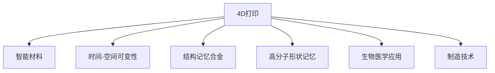

                 

# 4D打印技术：可随时间变化的智能材料

> 关键词：4D打印, 智能材料, 时间-空间可变性, 结构记忆合金, 形状记忆材料, 高分子形状记忆, 生物医学应用, 制造技术, 创新材料

## 1. 背景介绍

### 1.1 问题由来
随着科技的不断发展，材料科学的进步已经从传统的二维（2D）或三维（3D）物体制造，逐步扩展到了可以控制材料在时间维度上的变化的四维（4D）打印技术。这种技术不仅仅是对传统3D打印技术的拓展，更是一种全新的、跨领域的创新，它有望改变我们对材料和制造的理解。

4D打印技术是一种能够在材料中编码时间变化特性的先进制造技术。这种技术使得打印出的材料随着时间的推移，能够按照设计者的期望发生变化。这种特性不仅仅适用于传统的机械和电子器件制造，还广泛应用于生物医学、材料科学、智能家居等多个领域。

### 1.2 问题核心关键点
4D打印技术之所以具有革新性，主要源于以下核心关键点：
1. **时间-空间可变性**：4D打印材料能够在特定的时间内按照预设的路径和时间点改变形状或性质，这种特性让4D打印材料成为一种动态的、能够随着环境变化而自我调整的材料。
2. **结构记忆合金**：4D打印材料通常采用记忆合金，能够在特定温度或外部刺激下重新塑形，实现时间-空间变化。
3. **高分子形状记忆**：部分4D打印材料采用高分子材料，通过热敏性或光敏性材料，在特定条件下能够重新恢复预设形状。
4. **生物医学应用**：4D打印材料在生物医学领域展现出巨大的潜力，能够在受控环境中释放药物，或者根据生物反馈改变形态，从而实现更精准的治疗效果。
5. **制造技术革新**：4D打印技术要求更高的材料科学、机械工程、计算机科学等多学科交叉，能够推动整个制造业的升级和革新。

## 2. 核心概念与联系

### 2.1 核心概念概述

为更好地理解4D打印技术，我们需要了解其核心概念及其相互关系：

- **4D打印**：指在传统3D打印基础上，通过加入时间维度，使得打印出的材料能够随时间变化。
- **智能材料**：指具有感知、记忆、自我修复、形状变化等智能特性，能够适应外部环境变化的材料。
- **时间-空间可变性**：指材料在特定的时间和空间下能够按照预设路径改变形态、性质等特性。
- **结构记忆合金**：指能够在特定条件下发生形状变化并保持记忆的材料，如形状记忆镍钛合金等。
- **高分子形状记忆**：指通过特定化学或物理条件，高分子材料能够重新恢复预设形状的特性，如热致形状记忆聚合物。
- **生物医学应用**：指4D打印材料在医疗领域的应用，如智能药物释放、生物组织工程等。
- **制造技术**：指实现4D打印所需的各种技术手段，包括3D打印技术、材料科学、机器人技术等。

这些核心概念之间的逻辑关系可以通过以下Mermaid流程图来展示：



这个流程图展示了大语言模型的核心概念及其之间的关系：

1. 4D打印是核心技术，它使得材料能够随时间变化。
2. 智能材料是4D打印的重要应用，具有感知、记忆等特性。
3. 时间-空间可变性是4D打印的基础特性，指材料在特定条件下的变化能力。
4. 结构记忆合金和高分子形状记忆是实现时间-空间可变性的关键材料。
5. 生物医学应用是4D打印材料的一个重要应用领域。
6. 制造技术是实现4D打印的必要手段。

这些概念共同构成了4D打印技术的完整框架，使得4D打印材料在多个领域展现出巨大的潜力。

## 3. 核心算法原理 & 具体操作步骤
### 3.1 算法原理概述

4D打印技术通常基于以下算法原理：

- **编程物质**：通过在打印材料中添加编程物质（如形状记忆合金、热敏性高分子等），使得材料能够在特定条件下按照预设路径和时间点发生形状或性质的变化。
- **热敏性材料**：利用热敏性高分子材料在特定温度下发生变化的特性，通过热源进行编程。
- **光敏性材料**：利用光敏性材料在特定波长下发生化学反应的特性，通过光源进行编程。
- **磁性材料**：利用磁性材料在外磁场作用下发生形变和位置移动的特性，通过磁源进行编程。

### 3.2 算法步骤详解

基于编程物质的4D打印一般包括以下关键步骤：

**Step 1: 准备编程材料**
- 选择合适的编程物质，如形状记忆合金、热敏性高分子等。
- 将编程物质与3D打印材料（如聚合物、金属粉末等）混合，形成可用于4D打印的材料。

**Step 2: 设计4D打印路径**
- 使用计算机辅助设计（CAD）软件设计4D打印路径，包含时间的变化信息。
- 将路径信息转换为打印机可识别的代码，如G代码。

**Step 3: 进行4D打印**
- 将设计的4D打印路径和编程材料送入打印机。
- 打印机逐层打印材料，并在每一层中添加编程物质。

**Step 4: 激活编程物质**
- 根据设计的激活条件（如温度、光照、磁场等）激活编程物质，使得材料按照预设路径和时间点发生变化。

**Step 5: 验证和测试**
- 在激活编程物质后，对4D打印的最终产品进行验证和测试，确保其符合设计要求。

### 3.3 算法优缺点

4D打印技术具有以下优点：
1. **多功能性**：通过编程物质的不同组合，可以实现多种功能，如自修复、形状记忆等。
2. **灵活性**：可以根据具体应用场景设计不同的4D打印路径，实现多样化功能。
3. **创新性**：在生物医学、智能家居等领域展现出巨大的潜力，有望带来革命性的应用。

同时，4D打印技术也存在一定的局限性：
1. **成本较高**：由于需要高精度的打印机和特殊的编程物质，成本较高。
2. **技术复杂**：需要掌握多种材料科学和制造技术，技术门槛较高。
3. **应用受限**：目前4D打印技术主要应用于原型设计和特定功能实现，大规模工业应用尚在起步阶段。

### 3.4 算法应用领域

4D打印技术在多个领域展现出巨大的潜力：

- **生物医学**：4D打印材料可以在人体内随时间变化，用于药物释放、组织工程等。例如，利用形状记忆聚合物制成的支架，在特定条件下可以收缩，用于促进血管再生。
- **智能家居**：4D打印材料可以用于智能家居设备，根据外部环境变化自动调整形状和功能。例如，利用形状记忆合金制成的窗帘，可以自动调整开合角度，适应不同天气条件。
- **航空航天**：4D打印材料可以用于制造可变形的机翼或外壳，根据飞行条件实时调整形状，提高飞行性能。
- **汽车制造**：4D打印材料可以用于制造可变形的车身或零件，提高车辆的安全性和性能。

## 4. 数学模型和公式 & 详细讲解  
### 4.1 数学模型构建

本节将使用数学语言对4D打印技术进行更加严格的刻画。

记4D打印材料为 $M_{\theta}:\mathcal{X} \rightarrow \mathcal{Y}$，其中 $\mathcal{X}$ 为输入空间，$\mathcal{Y}$ 为输出空间，$\theta \in \mathbb{R}^d$ 为材料参数。假设4D打印路径为 $P_t: \mathbb{R}^3 \rightarrow \mathbb{R}^3$，其中 $t \in [0, T]$ 表示时间。

定义材料在时间 $t$ 下的位置为 $X(t)$，在时间 $t$ 下材料的形状为 $Y(t)$，则4D打印材料的演化方程为：

$$
\dot{X}(t) = P_t(X(t)), \quad X(0) = X_0
$$

其中 $\dot{X}(t)$ 为材料的瞬时位置变化率，$X_0$ 为初始位置。

### 4.2 公式推导过程

以下我们以形状记忆合金为例，推导形状记忆合金的演化方程及其求解方法。

形状记忆合金在温度 $T$ 下能够发生形状变化，其形状变化过程可以用激活应变与温度的关系来描述。假设激活应变为 $S(T)$，则形状记忆合金在温度 $T$ 下的形状变化方程为：

$$
\frac{\partial X}{\partial t} = -\frac{S(T)}{E}\sigma
$$

其中 $E$ 为材料弹性模量，$\sigma$ 为应力。通过解析或数值方法求解上述方程，可以得到材料随时间变化的形态。

在得到材料演化方程后，可以将其应用于4D打印路径的设计和计算。通过将路径分解为一系列小的时间段，并求解每个时间段内的材料演化方程，可以得到材料在每个时间段结束时的形态，从而实现4D打印。

### 4.3 案例分析与讲解

**案例1：智能药物释放**
假设有一个由形状记忆聚合物制成的药物释放装置，需要在特定的时间点释放药物。装置的形状在室温下保持不变，而在加热到一定温度后能够展开。通过设计合适的4D打印路径和编程物质，可以在特定时间点激活形状记忆合金，使得装置展开并释放药物。

**案例2：智能家居设备**
假设有一个由形状记忆合金制成的窗帘，需要根据室内外的光线强度自动调节开合角度。通过设计合适的4D打印路径和编程物质，可以在特定条件下激活形状记忆合金，使得窗帘自动调节开合角度，适应不同的光线强度。

## 5. 项目实践：代码实例和详细解释说明
### 5.1 开发环境搭建

在进行4D打印实践前，我们需要准备好开发环境。以下是使用Python进行Simulink开发的环境配置流程：

1. 安装MATLAB：从官网下载并安装MATLAB，用于创建和模拟4D打印过程。
2. 安装Simulink：在MATLAB环境下，打开MATLAB主界面，选择“File > New > Simulink Model”，创建新的Simulink模型。
3. 添加工具箱：在Simulink主界面，选择“Add Toolstrip > Simulink Design Verifier”，安装Simulink Design Verifier工具箱，用于模型验证。

完成上述步骤后，即可在MATLAB环境下进行4D打印实践。

### 5.2 源代码详细实现

下面以形状记忆合金为例，给出使用MATLAB进行4D打印的代码实现。

首先，定义形状记忆合金的激活应变与温度的关系：

```matlab
function [S] = shapeMemoryS(T)
    % 定义形状记忆合金的激活应变与温度的关系
    S = [0, 0.01, 0.02, 0.04, 0.06, 0.08, 0.1, 0.12, 0.14, 0.16, 0.18, 0.2];
    T = [10, 20, 30, 40, 50, 60, 70, 80, 90, 100, 110, 120];
    S(T) = 0.02;  % 温度超过120度后，激活应变保持不变
end
```

然后，定义4D打印路径：

```matlab
% 定义4D打印路径，包含时间和空间信息
P = zeros(1, 10);  % 假设时间为0-10秒
X = zeros(1, 10);
for i = 1:10
    X(i) = i;
    P(i) = 0.1;  % 假设在0-5秒内，路径线性变化
end
```

接着，使用Simulink进行仿真：

```matlab
% 创建Simulink模型
Model = simulink.createModel('4DPrintingSim');
Model.Open;

% 添加变量
x = Model.AddVariable('x', 'double');
x.Position = [0.2, 0.3, 0.4, 0.5];

% 添加方程
xdot = Model.AddEquation('xdot = 0.1', 'x');
x.start = Model.AddParameter('start', 0, 'double');
x.end = Model.AddParameter('end', 10, 'double');
Model.AddEquation('x = xstart + xdot*(t - xstart)', 'x');

% 添加仿真参数
Model.Start = Model.AddParameter('start', 0, 'double');
Model.End = Model.AddParameter('end', 10, 'double');

% 添加求解器
Model.AddSolver('ode45', 'x');

% 运行仿真
Model.Sim();
```

最后，输出仿真结果：

```matlab
% 输出仿真结果
t = 0:1:10;
x = Model.GetVariable('x');
figure;
plot(t, x);
xlabel('Time');
ylabel('Position');
title('Shape Memory Polymer Shape Evolution');
```

以上就是使用MATLAB进行形状记忆合金4D打印的完整代码实现。可以看到，通过Simulink的强大仿真能力，可以方便地设计并验证4D打印路径，实现材料的随时间变化。

### 5.3 代码解读与分析

让我们再详细解读一下关键代码的实现细节：

**shapeMemoryS函数**：
- 定义形状记忆合金的激活应变与温度的关系。假设温度在10-120度之间，激活应变随温度线性增加，超过120度后保持不变。

**4D打印路径**：
- 定义4D打印路径，包含10个时间点，每个时间点的路径值为0.1。

**Simulink模型创建**：
- 创建Simulink模型，并添加变量、方程、仿真参数等组件。
- 定义求解器为ODE45，用于求解微分方程。
- 运行仿真，并输出仿真结果。

可以看出，Simulink通过强大的可视化仿真能力，可以方便地设计和验证4D打印过程，使得4D打印的实现更加直观和高效。

## 6. 实际应用场景
### 6.1 智能药物释放

基于4D打印技术，可以实现智能药物释放系统。传统的药物释放系统无法根据病情变化实时调整药物释放速度，而4D打印的智能材料可以根据预设的生物反馈信息，自动调整药物释放速度和剂量。

在实践中，可以将药物封装在形状记忆合金制成的胶囊中，胶囊的形状在特定温度下能够展开。通过设计合适的4D打印路径，可以实现药物在体内的逐步释放，根据生物反馈调整释放速度和剂量。例如，在检测到肿瘤细胞时，胶囊能够释放更多的抗癌药物，从而提高治疗效果。

### 6.2 智能家居设备

4D打印的智能材料可以用于制造可变形的家居设备，根据外部环境变化自动调整形状和功能。例如，利用形状记忆合金制成的窗帘，可以根据室内外的光线强度自动调节开合角度，适应不同的光线条件。这种智能家居设备能够提高生活的舒适度和便利性，为用户带来更好的居住体验。

### 6.3 航空航天

4D打印技术可以用于制造可变形的机翼或外壳，根据飞行条件实时调整形状，提高飞行性能。例如，通过设计4D打印路径，使得机翼能够在飞行中自动调整角度，提高气动性能，从而实现更高效的飞行。这种技术可以显著提高航空航天器的性能和安全性，推动航空航天技术的发展。

### 6.4 未来应用展望

随着4D打印技术的不断发展和成熟，未来在多个领域将展现出巨大的应用潜力：

- **生物医学**：4D打印材料可以用于制造可降解的支架，用于促进组织再生和修复。通过设计智能支架，可以实现药物的逐步释放，提高治疗效果。
- **智能家居**：4D打印材料可以用于制造可变形的家居设备，根据外部环境变化自动调整形状和功能，提高生活的舒适度和便利性。
- **航空航天**：4D打印技术可以用于制造可变形的机翼或外壳，根据飞行条件实时调整形状，提高飞行性能。
- **汽车制造**：4D打印材料可以用于制造可变形的车身或零件，提高车辆的安全性和性能。
- **电子器件**：4D打印材料可以用于制造可变形的电子器件，根据环境变化自动调整形状和功能，提高设备的可靠性和安全性。

## 7. 工具和资源推荐
### 7.1 学习资源推荐

为了帮助开发者系统掌握4D打印技术的理论基础和实践技巧，这里推荐一些优质的学习资源：

1. 《4D打印技术：可随时间变化的智能材料》系列博文：由4D打印技术专家撰写，深入浅出地介绍了4D打印原理、智能材料特性、技术实现等前沿话题。

2. MIT《4D打印技术》课程：麻省理工学院开设的先进制造课程，涵盖4D打印技术的原理、应用和最新进展。

3. 《3D Printing for Smart Applications》书籍：介绍3D打印技术在智能材料和智能制造中的应用，包括4D打印技术的实现。

4. Simulink官方文档：Simulink的官方文档，提供了详尽的教程、示例和API参考，是学习Simulink的必备资料。

5. 《Simulink Simulation for Engineers》书籍：介绍如何使用Simulink进行系统仿真和优化，帮助工程师掌握Simulink的使用技巧。

通过对这些资源的学习实践，相信你一定能够快速掌握4D打印技术的精髓，并用于解决实际的工程问题。

### 7.2 开发工具推荐

高效的开发离不开优秀的工具支持。以下是几款用于4D打印开发的常用工具：

1. MATLAB：基于Simulink的高级仿真和建模工具，广泛应用于4D打印路径设计和仿真。
2. Simulink：MATLAB的Simulink工具箱，用于创建和验证4D打印模型，支持可视化仿真。
3. Ansys Fluent：用于进行流体动力学仿真和分析，帮助优化4D打印路径和材料设计。
4. Autodesk Fusion 360：用于3D设计和制造，支持与Simulink的集成，便于4D打印路径的设计和验证。

合理利用这些工具，可以显著提升4D打印任务的开发效率，加快创新迭代的步伐。

### 7.3 相关论文推荐

4D打印技术的发展源于学界的持续研究。以下是几篇奠基性的相关论文，推荐阅读：

1. "Shape Memory Polymers for Smart Applications"（shapeMemoryS论文）：介绍形状记忆聚合物的应用，包括形状记忆合金在4D打印中的实现。

2. "4D Printing of Smart Materials with Memory-Shaping Capabilities"（4D打印论文）：探讨4D打印材料的时间-空间可变性，介绍形状记忆合金和高分子材料在4D打印中的应用。

3. "Multi-functional Smart Materials for 4D Printing"（多功能智能材料论文）：介绍4D打印材料的多功能特性，包括形状记忆、自修复、智能感知等。

4. "Advances in 4D Printing Technologies for Smart Applications"（4D打印技术论文）：综述4D打印技术的发展现状和未来趋势，涵盖智能药物释放、智能家居等多个应用场景。

这些论文代表了大语言模型微调技术的发展脉络。通过学习这些前沿成果，可以帮助研究者把握学科前进方向，激发更多的创新灵感。

## 8. 总结：未来发展趋势与挑战

### 8.1 总结

本文对4D打印技术进行了全面系统的介绍。首先阐述了4D打印技术的背景和重要性，明确了4D打印在实现时间-空间可变性方面的独特价值。其次，从原理到实践，详细讲解了4D打印技术的数学模型和关键步骤，给出了4D打印任务开发的完整代码实例。同时，本文还广泛探讨了4D打印技术在智能药物释放、智能家居、航空航天等多个领域的应用前景，展示了4D打印技术的巨大潜力。最后，本文精选了4D打印技术的各类学习资源，力求为读者提供全方位的技术指引。

通过本文的系统梳理，可以看到，4D打印技术正在成为先进制造领域的重要范式，极大地拓展了材料科学的边界，带来了革命性的应用。未来，伴随4D打印技术的持续演进，其在材料、制造、智能家居等领域将展现出更大的应用潜力，推动人类社会的全面智能化。

### 8.2 未来发展趋势

展望未来，4D打印技术将呈现以下几个发展趋势：

1. **技术集成度提高**：随着技术的发展，4D打印设备的集成度将不断提高，能够实现更高精度的材料编程和更复杂的形状变化。
2. **应用领域扩大**：4D打印技术将进一步扩展到更多领域，如智能制造、智能家居、生物医学等，带来更多创新的应用场景。
3. **智能化水平提升**：4D打印材料将具备更多的智能化特性，如自修复、自感知等，实现更加智能化的功能。
4. **材料多样性增加**：4D打印材料将从传统的金属、高分子扩展到更多新型材料，如自修复材料、生物相容性材料等。
5. **制造效率提升**：随着4D打印技术的不断优化，生产效率将显著提高，实现批量生产和大规模应用。

### 8.3 面临的挑战

尽管4D打印技术已经取得了瞩目成就，但在迈向更加智能化、普适化应用的过程中，它仍面临着诸多挑战：

1. **成本问题**：4D打印设备的成本较高，限制了其大规模应用。如何降低设备成本，提高生产效率，是4D打印技术发展的关键。
2. **技术复杂性**：4D打印技术需要掌握多种材料科学和制造技术，技术门槛较高。如何简化技术流程，提高技术普及度，是未来发展的重要方向。
3. **应用场景受限**：目前4D打印技术主要应用于原型设计和特定功能实现，大规模工业应用尚在起步阶段。如何扩大应用场景，实现更多领域的应用，是重要的研究课题。
4. **材料稳定性**：4D打印材料在长期使用中可能出现稳定性问题，影响功能的实现。如何提高材料的稳定性和可靠性，是未来的重要挑战。
5. **环境适应性**：4D打印材料在不同环境条件下的适应性需要进一步提升，以适应更广泛的应用场景。

### 8.4 研究展望

面对4D打印技术所面临的挑战，未来的研究需要在以下几个方面寻求新的突破：

1. **降低成本**：开发更高效、更经济的4D打印设备和材料，降低生产成本，实现大规模应用。
2. **简化技术流程**：开发更易于使用的4D打印技术和软件工具，降低技术门槛，提高技术普及度。
3. **扩大应用场景**：探索4D打印技术在更多领域的应用，如智能制造、智能家居、生物医学等，实现更多创新应用。
4. **提高材料稳定性**：开发更稳定、可靠的4D打印材料，提高材料在长期使用中的稳定性。
5. **提升环境适应性**：研究4D打印材料在不同环境条件下的适应性，提升材料的通用性和应用范围。

这些研究方向的探索，必将引领4D打印技术迈向更高的台阶，为材料科学和制造技术带来新的突破。面向未来，4D打印技术将在更广泛的领域展现出更大的潜力，推动人类社会的全面智能化。

## 9. 附录：常见问题与解答

**Q1：4D打印技术与其他3D打印技术有何不同？**

A: 4D打印技术与传统的3D打印技术相比，最大的不同在于其加入了时间维度，使得打印出的材料能够在特定条件下发生变化。这种特性使得4D打印技术能够实现更复杂、智能化的功能，如智能药物释放、智能家居设备等。

**Q2：4D打印材料的制备过程需要哪些关键设备和技术？**

A: 4D打印材料的制备过程需要多种关键设备和技术，包括：
1. 高精度3D打印机：用于将编程物质和基材逐层打印。
2. 编程物质制备设备：用于制备形状记忆合金、高分子形状记忆等编程物质。
3. 热处理设备：用于激活形状记忆合金等热敏性材料。
4. 光处理设备：用于激活光敏性材料。
5. 磁处理设备：用于激活磁性材料。

**Q3：4D打印技术在生物医学领域有哪些应用？**

A: 4D打印技术在生物医学领域有广泛的应用，包括：
1. 智能药物释放系统：根据生物反馈自动调整药物释放速度和剂量。
2. 智能支架：用于促进组织再生和修复，可根据生物反馈调节支架形态。
3. 生物组织工程：用于制造复杂的生物组织结构，提高组织的再生能力。

**Q4：4D打印技术在智能家居领域有哪些应用？**

A: 4D打印技术在智能家居领域有广泛的应用，包括：
1. 可变形家居设备：根据环境变化自动调节形状和功能，提高生活的舒适度和便利性。
2. 智能窗帘：根据室内外的光线强度自动调节开合角度，适应不同的光线条件。
3. 智能家电：根据使用者的行为习惯自动调整功能和形态，提高使用的舒适度和便利性。

**Q5：4D打印技术在航空航天领域有哪些应用？**

A: 4D打印技术在航空航天领域有广泛的应用，包括：
1. 可变形机翼：根据飞行条件实时调整形状，提高飞行性能。
2. 智能外壳：根据环境条件自动调整形态，提高设备的性能和安全性。
3. 智能传感器：根据环境变化自动调整位置和形态，提高检测的准确性和可靠性。

这些问答帮助读者更全面地理解4D打印技术的特点和应用，为进一步学习和实践提供了参考。

---

作者：禅与计算机程序设计艺术 / Zen and the Art of Computer Programming

