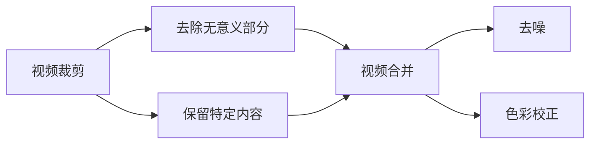

                 

# FFmpeg 视频编辑技巧分享：裁剪、合并和过滤视频片段的艺术

> 关键词：FFmpeg, 视频编辑, 裁剪, 合并, 过滤, 参数优化

## 1. 背景介绍

在当今数字媒体时代，视频已经成为了人们日常生活中不可或缺的一部分。无论是用于娱乐、教育还是专业领域，高质量的视频内容都具有巨大的需求。因此，视频编辑成为了一个热门领域。在众多视频编辑工具中，FFmpeg以其开源、功能强大、效率高而著称。它不仅支持多种视频格式，还提供了强大的命令线接口，能轻松实现视频裁剪、合并、过滤等多种操作。本文将介绍一些FFmpeg的视频编辑技巧，帮助你掌握如何裁剪、合并和过滤视频片段。

## 2. 核心概念与联系

### 2.1 核心概念概述

在进行视频编辑时，我们经常会遇到一些基本概念，如视频裁剪、合并、过滤等。这些概念是视频编辑的基础，需要我们在操作前理解它们的原理和应用场景。

- **视频裁剪**：将视频的一部分截取出来，通常用于去除视频中的无意义部分或只保留特定内容。
- **视频合并**：将多个视频片段拼接在一起，形成一个完整的视频。
- **视频过滤**：通过特定的算法对视频进行去噪、色彩校正等处理，提升视频质量。

### 2.2 核心概念原理和架构的 Mermaid 流程图



这个流程图展示了视频编辑的基本操作流程：首先进行视频裁剪，去除无用部分或保留特定内容；然后将不同部分进行合并，形成一个完整视频；最后进行视频过滤，提升整体质量。

## 3. 核心算法原理 & 具体操作步骤

### 3.1 算法原理概述

FFmpeg的核心算法是基于编解码器的。它支持H.264、H.265等广泛使用的视频编解码器，能够在压缩和解压过程中实现高质量的视频处理。在进行视频编辑时，FFmpeg通过编解码器对视频数据进行处理，实现裁剪、合并、过滤等操作。

### 3.2 算法步骤详解

#### 3.2.1 视频裁剪

- **参数设置**：使用`-vf`参数指定视频裁剪的操作。例如，`-vf 'crop=20:20:640:480'`表示裁剪视频，使长宽比变为4:3，分辨率为640x480。
- **应用场景**：在录制视频时，如果录制角度不对，可以进行裁剪，使其符合观看习惯。

#### 3.2.2 视频合并

- **参数设置**：使用`-f`参数指定输入视频格式，使用`-vf`参数指定合并操作。例如，`-vf 'concat=n=3:v=1:ext=mp4,i=\d'`表示将三个MP4格式的视频片段合并。
- **应用场景**：在制作视频剪辑时，需要将多个视频片段拼接在一起，形成一个完整的视频。

#### 3.2.3 视频过滤

- **参数设置**：使用`-af`参数指定音频过滤操作，使用`-vf`参数指定视频过滤操作。例如，`-vf 'contrast=1.2'`表示增加对比度，`-af 'silence=silence_threshold=-50dB:a=-50'`表示对音频进行去噪。
- **应用场景**：在视频剪辑时，需要对视频进行去噪、色彩校正等处理，提升整体质量。

### 3.3 算法优缺点

- **优点**：
  - **功能强大**：FFmpeg支持多种视频格式，能够进行复杂的编辑操作。
  - **性能高效**：FFmpeg使用优化后的编解码器，处理速度快。
  - **开源免费**：FFmpeg是一个开源工具，使用成本低。

- **缺点**：
  - **复杂度高**：由于功能强大，命令和参数较多，新手可能需要较长时间学习。
  - **技术门槛高**：对于高级操作，需要一定的技术基础。

### 3.4 算法应用领域

FFmpeg广泛应用于视频编辑、视频压缩、音频处理等领域。它不仅适用于专业视频编辑人员，还适用于普通用户进行日常的视频处理工作。

## 4. 数学模型和公式 & 详细讲解 & 举例说明

### 4.1 数学模型构建

在进行视频编辑时，我们可以用数学模型来描述视频流的结构。视频流由一系列帧组成，每帧包含视频和音频信息。我们可以用以下公式来表示视频流：

$$
X = (X_1, X_2, ..., X_n)
$$

其中，$X_i$表示第$i$帧的视频信息。

### 4.2 公式推导过程

- **视频裁剪**：
  $$
  \text{CroppedVideo} = \text{Crop}(\text{OriginalVideo}, \text{CropBox})
  $$

  其中，$\text{CropBox}$表示裁剪区域。

- **视频合并**：
  $$
  \text{MergedVideo} = \text{Concat}(\text{Video1}, \text{Video2}, ..., \text{VideoN})
  $$

  其中，$\text{Concat}$表示拼接操作。

- **视频过滤**：
  $$
  \text{FilteredVideo} = \text{Filter}(\text{OriginalVideo}, \text{FilterParameters})
  $$

  其中，$\text{FilterParameters}$表示过滤参数。

### 4.3 案例分析与讲解

假设我们有一个1080p的视频，需要将其裁剪为720p，并将前5秒和后5秒分别提取出来。可以使用以下命令：

```bash
ffmpeg -i input.mp4 -vf 'crop=720:720:480:480' -c copy -c:v copy output1.mp4
ffmpeg -i input.mp4 -ss 5 -to 10 -c copy -c:v copy output2.mp4
ffmpeg -i input.mp4 -t 10 -c copy -c:v copy output3.mp4
```

## 5. 项目实践：代码实例和详细解释说明

### 5.1 开发环境搭建

在进行视频编辑前，需要搭建好FFmpeg的开发环境。以下是在Linux系统中安装FFmpeg的步骤：

1. 打开终端，输入以下命令安装FFmpeg：
   ```bash
   sudo apt-get update
   sudo apt-get install ffmpeg
   ```

2. 安装FFmpeg库和依赖：
   ```bash
   sudo apt-get install libavcodec-dev libavformat-dev libavutil-dev libswscale-dev
   ```

3. 安装FFmpeg的图形界面工具：
   ```bash
   sudo apt-get install graphical-toolkit
   ```

4. 安装FFmpeg的库文件和开发头文件：
   ```bash
   sudo apt-get install libavcodec-dev libavformat-dev libavutil-dev libswscale-dev
   ```

### 5.2 源代码详细实现

#### 5.2.1 视频裁剪

```bash
ffmpeg -i input.mp4 -vf 'crop=720:720:480:480' -c copy -c:v copy output1.mp4
```

- **参数解释**：`-i`表示输入文件，`-vf`表示视频滤镜，`-c copy`表示复制视频流，`-c:v copy`表示复制视频流。

#### 5.2.2 视频合并

```bash
ffmpeg -i input1.mp4 -i input2.mp4 -i input3.mp4 -filter_complex "[0:v][1:v][2:v]concat=n=3:v=1:ext=mp4,i=\d" -c copy output.mp4
```

- **参数解释**：`-f`表示输入文件格式，`-filter_complex`表示复合滤镜，`[0:v][1:v][2:v]concat=n=3:v=1:ext=mp4,i=\d`表示拼接操作。

#### 5.2.3 视频过滤

```bash
ffmpeg -i input.mp4 -vf 'contrast=1.2' -af 'silence=silence_threshold=-50dB:a=-50' output.mp4
```

- **参数解释**：`-vf`表示视频滤镜，`-af`表示音频滤镜。

### 5.3 代码解读与分析

FFmpeg的命令和参数比较多，但可以通过组合不同的滤镜和参数，实现复杂的视频编辑操作。下面是对上述代码的详细解读：

- **视频裁剪**：`-vf 'crop=720:720:480:480'`表示裁剪视频，使长宽比变为4:3，分辨率为480x480。
- **视频合并**：`-filter_complex "[0:v][1:v][2:v]concat=n=3:v=1:ext=mp4,i=\d"`表示将三个视频片段拼接在一起，形成一个完整的视频。
- **视频过滤**：`-af 'silence=silence_threshold=-50dB:a=-50'`表示对音频进行去噪，`-vf 'contrast=1.2'`表示增加对比度。

### 5.4 运行结果展示

运行上述代码，将输出处理后的视频文件，可以在播放器中进行播放。

## 6. 实际应用场景

### 6.1 视频剪辑

在进行视频剪辑时，需要处理大量的视频素材。FFmpeg可以通过高效的视频编辑操作，快速完成剪辑任务。例如，将一段长视频分割成多个短视频，或者将多个短视频拼接成一个长视频。

### 6.2 视频转码

在进行视频格式转换时，可以使用FFmpeg将不同格式的视频文件进行转换。例如，将MP4格式的视频文件转换为H.265格式。

### 6.3 视频压缩

在进行视频压缩时，可以使用FFmpeg对视频文件进行压缩，以减小文件大小。例如，将1080p的视频文件压缩为720p。

## 7. 工具和资源推荐

### 7.1 学习资源推荐

- **FFmpeg官方文档**：FFmpeg提供了详细的官方文档，包含各种命令和参数的说明，是学习和使用FFmpeg的重要资源。
- **Linux视频编辑教程**：在Linux系统中，可以学习一些视频编辑教程，例如《Linux视频编辑实战》一书，该书详细介绍了Linux系统下的视频编辑技巧。

### 7.2 开发工具推荐

- **FFmpeg**：FFmpeg是视频编辑的核心工具，支持多种视频格式和滤镜操作。
- **HandBrake**：HandBrake是一个开源的视频转码工具，可以用于将视频转换为多种格式。

### 7.3 相关论文推荐

- **“A Fast Real-Time Video Encoding and Decoding Framework”**：这篇论文详细介绍了FFmpeg的架构和实现，是FFmpeg学习的重要参考资料。
- **“Optimization Techniques for High-Quality Video Streaming”**：这篇论文介绍了FFmpeg在视频编码和解码中的优化技术，是视频处理领域的重要文献。

## 8. 总结：未来发展趋势与挑战

### 8.1 研究成果总结

FFmpeg作为视频编辑的核心工具，在视频处理领域具有重要的地位。它不仅支持多种视频格式，还提供了强大的命令线和图形界面，能够实现复杂的视频编辑操作。

### 8.2 未来发展趋势

- **多平台支持**：未来的FFmpeg将支持更多的操作系统平台，为用户提供更便捷的使用体验。
- **更高效率**：FFmpeg将继续优化编解码器，提高视频处理的效率。
- **更丰富的功能**：FFmpeg将增加更多的滤镜和参数，支持更多的视频格式和编辑操作。

### 8.3 面临的挑战

- **技术门槛**：FFmpeg的命令和参数较多，新手可能难以入门。
- **资源消耗**：在进行大规模视频处理时，FFmpeg的资源消耗较大。
- **兼容性问题**：不同版本的FFmpeg可能存在兼容性问题，需要用户进行版本管理。

### 8.4 研究展望

未来的FFmpeg将不断改进和优化，为用户提供更加高效、便捷的视频处理体验。同时，伴随着深度学习和AI技术的发展，FFmpeg将引入更多先进的算法和模型，提升视频处理的智能化水平。

## 9. 附录：常见问题与解答

**Q1：如何进行视频剪辑？**

A：可以使用FFmpeg的`-c`参数指定输入和输出视频格式，使用`-ss`参数指定起始时间，使用`-t`参数指定时间长度，使用`-i`参数指定输入文件。例如，`ffmpeg -i input.mp4 -ss 00:00:00 -t 00:01:00 output.mp4`表示将视频的前1秒剪切出来，保存为output.mp4文件。

**Q2：如何进行视频压缩？**

A：可以使用FFmpeg的`-vcodec`参数指定编解码器，使用`-preset`参数指定预设选项，使用`-q:v`参数指定质量。例如，`ffmpeg -i input.mp4 -vcodec libx264 -preset veryslow -q:v 30 output.mp4`表示将视频压缩为H.264格式，质量为30。

**Q3：如何进行视频去噪？**

A：可以使用FFmpeg的`-af`参数指定音频滤镜，使用`-vf`参数指定视频滤镜。例如，`ffmpeg -i input.mp4 -af silenc=silence_threshold=-60dB:a=-15 -vf noise=3000dB:mean=30:2:0 output.mp4`表示对视频进行去噪，参数`noise=3000dB:mean=30:2:0`表示噪声强度为3000dB，均值为30，持续时间2秒。

**Q4：如何进行视频颜色校正？**

A：可以使用FFmpeg的`-vf`参数指定视频滤镜，使用`chroma`参数进行颜色校正。例如，`ffmpeg -i input.mp4 -vf chroma=c=1.5:h=1.2:r=1.4 -c copy output.mp4`表示将视频的颜色对比度增加1.5倍，饱和度增加1.2倍，亮度增加1.4倍。

---

作者：禅与计算机程序设计艺术 / Zen and the Art of Computer Programming

