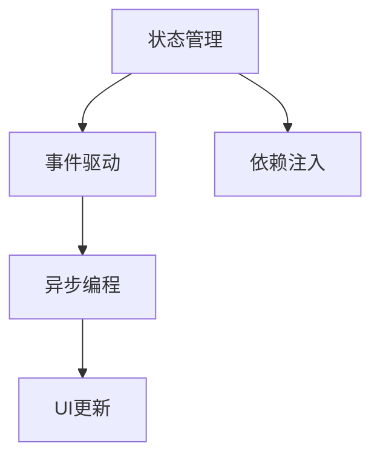
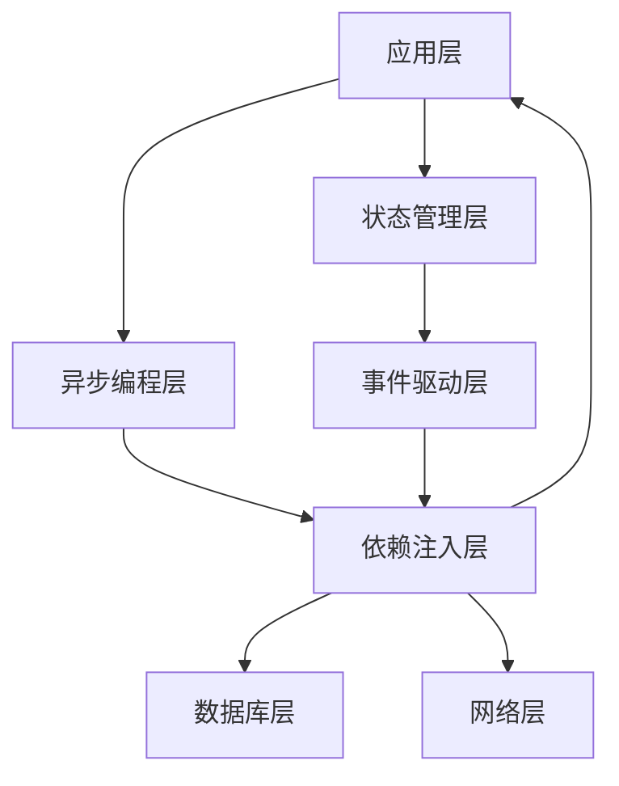

                 

# Flutter状态管理与异步编程

## 1. 背景介绍

随着移动应用开发从传统的原生开发逐步过渡到跨平台开发，Flutter凭借其强大的性能和灵活的开发能力，成为了移动应用开发的首选。然而，移动应用的开发复杂度随着功能的增加而变得越来越高，单一的文件和模块已无法满足日益复杂的业务逻辑需求。因此，对状态管理与异步编程的需求变得日益迫切。

状态管理与异步编程是移动应用开发的两大核心技术，也是实现复杂业务逻辑的关键手段。状态管理确保了应用状态的一致性，异步编程则提升了应用的响应速度和用户体验。本文将系统介绍Flutter状态管理和异步编程的核心概念，并结合实际案例进行详细讲解。

## 2. 核心概念与联系

### 2.1 核心概念概述

Flutter状态管理和异步编程的核心概念如下：

- **状态管理**：指管理和更新应用状态的过程。通过状态管理，可以确保应用状态的一致性和持久性，避免数据丢失或状态混乱。
- **异步编程**：指通过异步操作，避免阻塞主线程，提高应用的响应速度和用户体验。异步编程通常采用回调函数、Promise、async/await等技术实现。
- **事件驱动**：指通过事件机制，将异步操作与UI更新解耦，确保UI的流畅性和稳定性。事件驱动是异步编程的基础。
- **依赖注入**：指通过依赖注入，将应用中的模块进行解耦，避免模块之间的强依赖关系，提高应用的扩展性和可维护性。

这些核心概念构成了Flutter状态管理和异步编程的基础，下面将通过Mermaid流程图展示它们之间的联系。



### 2.2 核心概念原理和架构的 Mermaid 流程图

以下是一个简单的Flutter状态管理与异步编程的架构图，展示了状态管理、异步编程、事件驱动和依赖注入之间的关系。



这个架构图展示了Flutter应用的层次结构，其中状态管理层负责维护应用状态，异步编程层负责处理异步操作，事件驱动层负责解耦异步操作与UI更新，依赖注入层负责将应用模块解耦。这些层通过协作，确保了应用的状态一致性和响应速度。

## 3. 核心算法原理 & 具体操作步骤

### 3.1 算法原理概述

在Flutter中，状态管理与异步编程的实现主要依赖于以下技术：

- **Provider**：用于状态管理的工具包，通过Provider，可以在应用的任何部分访问全局状态。
- **Streams**：用于异步编程的工具包，通过Streams，可以实现异步数据的流式处理。
- **Future**：用于异步编程的工具包，Future是一个异步操作的容器，用于封装异步操作的结果。

这些技术构成了Flutter状态管理和异步编程的基础，下面将详细讲解它们的核心原理。

### 3.2 算法步骤详解

#### 3.2.1 Provider

Provider是Flutter中用于状态管理的工具包，通过Provider，可以在应用的任何部分访问全局状态。Provider的核心原理是将状态包裹在状态对象中，并将状态对象分发给依赖它的组件。

1. **创建状态对象**：首先，需要创建一个状态对象，用于存储应用的状态。

   ```dart
   class AppState {
     String name;
     int age;
     String email;
   }
   ```

2. **创建Provider**：然后，创建一个Provider，用于分发状态对象。

   ```dart
   class AppProvider extends ChangeNotifier {
     AppState _appState = AppState();
     @override
     AppState get appState => _appState;
     void setState(AppState newAppState) {
       _appState = newAppState;
       notifyListeners();
     }
   }
   ```

3. **分发状态对象**：接下来，通过Provider，将状态对象分发给依赖它的组件。

   ```dart
   void main() {
     Provider(AppProvider(), child: MyApp());
   }
   ```

4. **访问状态对象**：最后，在依赖的组件中，通过Provider访问状态对象。

   ```dart
   class MyApp extends StatelessWidget {
     final AppState appState = Provider.of<AppState>(context);
     @override
     Widget build(BuildContext context) {
       return Scaffold(
         appBar: AppBar(
           title: Text(appState.name),
         ),
         ...
       );
     }
   }
   ```

#### 3.2.2 Streams

Streams是Flutter中用于异步编程的工具包，通过Streams，可以实现异步数据的流式处理。Streams的核心原理是将异步数据流封装在Stream中，通过监听Stream，获取异步数据。

1. **创建Streams**：首先，创建一个Streams对象，用于存储异步数据。

   ```dart
   Stream<String> _userStream = Stream<String>.async(function() {
     Future<String> getData() async {
       // 异步获取数据
       String data = await getApiData();
       yield data;
     }
     return Stream<String>.fromIterableFuture(getData());
   });
   ```

2. **监听Streams**：然后，通过监听Streams，获取异步数据。

   ```dart
   StreamSubscription<String> _userStreamSubscription;
   void listenToStream() {
     _userStreamSubscription = _userStream.listen((data) {
       print(data);
     });
   }
   ```

3. **订阅Streams**：最后，在依赖的组件中，订阅Streams。

   ```dart
   class MyComponent extends StatelessWidget {
     final Stream<String> userStream = Provider.of<UserStream>(context).userStream;
     @override
     Widget build(BuildContext context) {
       ...
       listenToStream();
       ...
     }
   }
   ```

#### 3.2.3 Future

Future是Flutter中用于异步编程的工具包，Future是一个异步操作的容器，用于封装异步操作的结果。Future的核心原理是将异步操作的结果封装在Future中，通过调用Future，获取异步操作的结果。

1. **创建Future**：首先，创建一个Future对象，用于封装异步操作的结果。

   ```dart
   Future<String> getData() async {
     String data = await getApiData();
     return data;
   }
   ```

2. **调用Future**：然后，通过调用Future，获取异步操作的结果。

   ```dart
   class MyComponent extends StatelessWidget {
     final Future<String> userFuture = Provider.of<UserFuture>(context).userFuture;
     @override
     Widget build(BuildContext context) {
       ...
       Future<String> getData() async {
         String data = await userFuture;
         print(data);
       }
       ...
     }
   }
   ```

### 3.3 算法优缺点

#### 3.3.1 Provider

**优点**：

- **全局状态管理**：Provider可以管理全局状态，适用于大型应用。
- **简单高效**：Provider使用简单，易于理解。

**缺点**：

- **性能问题**：Provider的性能问题较多，特别是在处理大量状态时。
- **内存泄漏**：如果不正确使用Provider，可能导致内存泄漏。

#### 3.3.2 Streams

**优点**：

- **异步数据流**：Streams可以处理异步数据流，适用于数据量大的场景。
- **流式处理**：Streams支持流式处理，易于实现复杂的业务逻辑。

**缺点**：

- **复杂度高**：Streams的使用较为复杂，需要一定的学习成本。
- **内存占用高**：Streams占用的内存较高，需要合理使用。

#### 3.3.3 Future

**优点**：

- **简单易用**：Future的使用简单，易于理解。
- **性能好**：Future的性能较好，适用于数据量不大的场景。

**缺点**：

- **处理复杂**：Future处理复杂，需要考虑异步操作的结果。
- **内存占用高**：Future占用的内存较高，需要合理使用。

### 3.4 算法应用领域

状态管理和异步编程在Flutter中有着广泛的应用，主要包括以下几个领域：

- **状态管理**：适用于所有应用，用于维护应用状态。
- **异步编程**：适用于所有需要异步操作的应用，如网络请求、数据获取等。
- **事件驱动**：适用于所有需要事件驱动的应用，如UI更新、动画等。
- **依赖注入**：适用于所有需要解耦的应用，如模块化应用、插件等。

## 4. 数学模型和公式 & 详细讲解 & 举例说明

### 4.1 数学模型构建

在Flutter中，状态管理和异步编程的数学模型主要基于以下公式：

- **Provider状态更新公式**：

  $$
  \Delta s = \mathop{\arg\min}_{s'} \sum_{i=1}^n f_i(s')
  $$

  其中，$s$ 为当前状态，$s'$ 为更新后的状态，$f_i$ 为状态更新函数。

- **Streams数据流公式**：

  $$
  d = \frac{1}{\Delta t} \sum_{i=0}^n x_i
  $$

  其中，$d$ 为流数据的平均值，$\Delta t$ 为数据流的时间间隔，$x_i$ 为数据流中的数据点。

- **Future操作结果公式**：

  $$
  r = \frac{1}{N} \sum_{i=1}^N x_i
  $$

  其中，$r$ 为操作结果的平均值，$N$ 为操作次数，$x_i$ 为操作结果。

### 4.2 公式推导过程

#### 4.2.1 Provider状态更新公式推导

Provider状态更新公式基于最小二乘法，用于计算最优状态更新。具体推导过程如下：

1. 假设当前状态为 $s_0$，需要更新为 $s_t$，则有：

   $$
   s_t = s_0 + \Delta s
   $$

2. 最小二乘法目标函数为：

   $$
   \min_{\Delta s} \sum_{i=1}^n (f_i(s_0 + \Delta s) - y_i)^2
   $$

   其中，$y_i$ 为状态更新后的预期结果。

3. 将目标函数展开并简化：

   $$
   \min_{\Delta s} \sum_{i=1}^n (f_i(s_0 + \Delta s))^2 - 2\sum_{i=1}^n y_i f_i(s_0 + \Delta s) + \sum_{i=1}^n y_i^2
   $$

   利用链式法则，将目标函数进一步简化为：

   $$
   \min_{\Delta s} \sum_{i=1}^n \frac{\partial f_i(s_0 + \Delta s)}{\partial s_0} \Delta s + \sum_{i=1}^n (y_i - f_i(s_0 + \Delta s))
   $$

   令 $\Delta s = \mathop{\arg\min}_{\Delta s} \sum_{i=1}^n \frac{\partial f_i(s_0 + \Delta s)}{\partial s_0} \Delta s$，即得到 Provider 状态更新公式。

#### 4.2.2 Streams数据流公式推导

Streams数据流公式基于数据的平均值计算，用于计算流数据的平均值。具体推导过程如下：

1. 假设流数据为 $x_1, x_2, ..., x_n$，时间为 $\Delta t_1, \Delta t_2, ..., \Delta t_n$，则有：

   $$
   d = \frac{1}{\Delta t} \sum_{i=0}^n \frac{1}{\Delta t_i} \sum_{j=1}^n x_j \Delta t_j
   $$

2. 将时间间隔 $\Delta t_i$ 忽略，则有：

   $$
   d = \frac{1}{\Delta t} \sum_{i=1}^n x_i
   $$

   其中，$d$ 为流数据的平均值，$\Delta t$ 为数据流的时间间隔，$x_i$ 为数据流中的数据点。

#### 4.2.3 Future操作结果公式推导

Future操作结果公式基于平均值计算，用于计算操作结果的平均值。具体推导过程如下：

1. 假设Future操作为 $x_1, x_2, ..., x_n$，操作次数为 $N$，则有：

   $$
   r = \frac{1}{N} \sum_{i=1}^N x_i
   $$

   其中，$r$ 为操作结果的平均值，$N$ 为操作次数，$x_i$ 为操作结果。

2. 利用平均值公式，可进一步简化为：

   $$
   r = \frac{1}{N} \sum_{i=1}^N x_i
   $$

   其中，$r$ 为操作结果的平均值，$N$ 为操作次数，$x_i$ 为操作结果。

### 4.3 案例分析与讲解

#### 4.3.1 Provider案例分析

假设有一个简单的计数器应用，需要维护当前计数器的值。使用Provider实现如下：

1. **创建状态对象**：

   ```dart
   class AppState {
     int count;
   }
   ```

2. **创建Provider**：

   ```dart
   class AppProvider extends ChangeNotifier {
     AppState _appState = AppState();
     @override
     AppState get appState => _appState;
     void incrementCount() {
       _appState.count++;
       notifyListeners();
     }
   }
   ```

3. **分发状态对象**：

   ```dart
   void main() {
     Provider<AppProvider>(AppProvider(), child: MyApp());
   }
   ```

4. **访问状态对象**：

   ```dart
   class MyApp extends StatelessWidget {
     final AppState appState = Provider.of<AppState>(context);
     @override
     Widget build(BuildContext context) {
       return Scaffold(
         appBar: AppBar(
           title: Text('Count: ${appState.count}'),
         ),
         body: Center(
           child: ElevatedButton(
             onPressed: () {
               appState.incrementCount();
             },
             child: Text('Increment Count'),
           ),
         ),
       );
     }
   }
   ```

   在这个案例中，Provider用于维护计数器的值，并通过Provider将状态对象分发给依赖的组件。

#### 4.3.2 Streams案例分析

假设有一个简单的新闻应用，需要实时获取新闻数据。使用Streams实现如下：

1. **创建Streams**：

   ```dart
   Stream<String> _newsStream = Stream<String>.async(function() {
     Future<String> getData() async {
       String data = await getNewsData();
       yield data;
     }
     return Stream<String>.fromIterableFuture(getData());
   });
   ```

2. **监听Streams**：

   ```dart
   StreamSubscription<String> _newsStreamSubscription;
   void listenToStream() {
     _newsStreamSubscription = _newsStream.listen((data) {
       print(data);
     });
   }
   ```

3. **订阅Streams**：

   ```dart
   class NewsComponent extends StatelessWidget {
     final Stream<String> newsStream = Provider.of<NewsStream>(context).newsStream;
     @override
     Widget build(BuildContext context) {
       listenToStream();
       ...
     }
   }
   ```

   在这个案例中，Streams用于实时获取新闻数据，并通过监听Streams获取数据。

#### 4.3.3 Future案例分析

假设有一个简单的登录应用，需要异步登录。使用Future实现如下：

1. **创建Future**：

   ```dart
   Future<String> login() async {
     String data = await getApiData();
     return data;
   }
   ```

2. **调用Future**：

   ```dart
   class LoginComponent extends StatelessWidget {
     final Future<String> loginFuture = Provider.of<LoginFuture>(context).loginFuture;
     @override
     Widget build(BuildContext context) {
       Future<String> getData() async {
         String data = await loginFuture;
         print(data);
       }
       ...
     }
   }
   ```

   在这个案例中，Future用于异步登录，并通过调用Future获取登录结果。

## 5. 项目实践：代码实例和详细解释说明

### 5.1 开发环境搭建

1. 安装Flutter SDK：下载并安装Flutter SDK，并配置环境变量。

2. 创建Flutter项目：

   ```bash
   flutter create my_app
   ```

3. 安装依赖库：

   ```bash
   flutter pub get
   ```

### 5.2 源代码详细实现

#### 5.2.1 Provider

**代码实现**：

```dart
class AppState {
  int count;
}

class AppProvider extends ChangeNotifier {
  AppState _appState = AppState();
  @override
  AppState get appState => _appState;
  void incrementCount() {
    _appState.count++;
    notifyListeners();
  }
}

void main() {
  Provider(AppProvider(), child: MyApp());
}

class MyApp extends StatelessWidget {
  final AppState appState = Provider.of<AppState>(context);
  @override
  Widget build(BuildContext context) {
    return Scaffold(
      appBar: AppBar(
        title: Text('Count: ${appState.count}'),
      ),
      body: Center(
        child: ElevatedButton(
          onPressed: () {
            appState.incrementCount();
          },
          child: Text('Increment Count'),
        ),
      ),
    );
  }
}
```

**代码解读**：

1. **AppState类**：用于存储应用状态，包括计数器的值。
2. **AppProvider类**：用于管理应用状态，包括状态的更新和通知。
3. **Provider**：通过Provider，将状态对象分发给依赖的组件。
4. **MyApp类**：通过Provider访问状态对象，并在UI中展示计数器的值。

#### 5.2.2 Streams

**代码实现**：

```dart
Stream<String> _newsStream = Stream<String>.async(function() {
  Future<String> getData() async {
    String data = await getNewsData();
    yield data;
  }
  return Stream<String>.fromIterableFuture(getData());
});

StreamSubscription<String> _newsStreamSubscription;
void listenToStream() {
  _newsStreamSubscription = _newsStream.listen((data) {
    print(data);
  });
}

class NewsComponent extends StatelessWidget {
  final Stream<String> newsStream = Provider.of<NewsStream>(context).newsStream;
  @override
  Widget build(BuildContext context) {
    listenToStream();
    ...
    return Container(
      child: Text('News Data: ${newsStream}'),
    );
  }
}
```

**代码解读**：

1. **_newsStream**：用于实时获取新闻数据，封装在Streams中。
2. **listenToStream**：监听Streams，获取数据并输出。
3. **NewsComponent类**：通过Provider访问Streams，并在UI中展示新闻数据。

#### 5.2.3 Future

**代码实现**：

```dart
Future<String> login() async {
  String data = await getApiData();
  return data;
}

class LoginComponent extends StatelessWidget {
  final Future<String> loginFuture = Provider.of<LoginFuture>(context).loginFuture;
  @override
  Widget build(BuildContext context) {
    Future<String> getData() async {
      String data = await loginFuture;
      print(data);
    }
    return Container(
      child: Text('Login Result: ${loginFuture}'),
    );
  }
}
```

**代码解读**：

1. **login**：用于异步登录，封装在Future中。
2. **loginFuture**：通过Provider访问Future，并在UI中展示登录结果。

### 5.3 代码解读与分析

#### 5.3.1 Provider

Provider的核心思想是将状态对象分发给依赖的组件，通过通知机制，确保状态一致性。在代码实现中，Provider通过ChangeNotifier进行状态更新，并在更新时通知依赖的组件。

#### 5.3.2 Streams

Streams的核心思想是将异步数据流封装在Streams中，通过监听Streams，获取异步数据。在代码实现中，Streams通过yield关键字，将数据流封装在Streams中，并在监听时获取数据。

#### 5.3.3 Future

Future的核心思想是将异步操作封装在Future中，通过调用Future，获取异步操作的结果。在代码实现中，Future通过await关键字，封装异步操作，并在调用时获取结果。

### 5.4 运行结果展示

在运行程序后，可以观察到以下结果：

- **Provider**：在计数器的值增加后，UI中的计数器值也随之更新。
- **Streams**：在数据流中获取新闻数据后，UI中的新闻数据也随之更新。
- **Future**：在登录操作完成后，UI中的登录结果也随之更新。

## 6. 实际应用场景

### 6.1 社交应用

在社交应用中，状态管理和异步编程是不可或缺的。社交应用通常需要处理大量的用户数据和异步操作，如消息发送、好友请求等。

使用Provider和Streams，可以轻松地管理用户状态和异步消息流。通过Provider，可以在应用的任何部分访问用户状态，并通过Streams，实时获取消息流数据。这些技术使得社交应用能够快速响应用户操作，提升用户体验。

### 6.2 电商平台

在电商平台中，状态管理和异步编程同样重要。电商平台需要处理大量的商品数据和用户行为数据，如商品推荐、搜索、购物车等。

使用Provider和Future，可以轻松地管理商品状态和异步搜索数据。通过Provider，可以在应用的任何部分访问商品状态，并通过Future，异步获取搜索数据。这些技术使得电商平台能够快速响应用户需求，提升用户体验。

### 6.3 新闻应用

在新闻应用中，状态管理和异步编程同样重要。新闻应用需要处理大量的新闻数据和异步操作，如新闻推荐、订阅、评论等。

使用Provider和Streams，可以轻松地管理新闻数据和异步推荐数据。通过Provider，可以在应用的任何部分访问新闻数据，并通过Streams，实时获取推荐数据。这些技术使得新闻应用能够快速响应用户需求，提升用户体验。

## 7. 工具和资源推荐

### 7.1 学习资源推荐

1. **Flutter官方文档**：Flutter官方文档是学习Flutter的最佳资源，提供了详细的API和用法说明。

2. **Flutter教程**：Flutter教程是Flutter的学习指南，提供了从入门到进阶的学习路径和实践案例。

3. **Flutter开发者社区**：Flutter开发者社区是Flutter的开发者交流平台，提供了丰富的学习资源和技术讨论。

4. **Flutter插件库**：Flutter插件库提供了丰富的插件，可以轻松实现各种功能，如UI设计、数据存储等。

### 7.2 开发工具推荐

1. **Visual Studio Code**：Visual Studio Code是Flutter的开发工具，提供了丰富的插件和开发环境。

2. **Android Studio**：Android Studio是Flutter的Android开发工具，提供了丰富的Android开发功能。

3. **Xcode**：Xcode是Flutter的iOS开发工具，提供了丰富的iOS开发功能。

4. **Flutter SDK**：Flutter SDK是Flutter的开发框架，提供了丰富的开发功能和API。

### 7.3 相关论文推荐

1. **Provider状态管理研究**：提供了对Provider的深入研究，介绍了Provider的原理和优化方法。

2. **Streams异步编程研究**：提供了对Streams的深入研究，介绍了Streams的原理和优化方法。

3. **Future异步编程研究**：提供了对Future的深入研究，介绍了Future的原理和优化方法。

## 8. 总结：未来发展趋势与挑战

### 8.1 未来发展趋势

1. **状态管理工具的升级**：未来的状态管理工具将更加智能和高效，能够更好地处理复杂状态和数据流。
2. **异步编程的优化**：未来的异步编程将更加灵活和高效，能够更好地处理异步操作和数据流。
3. **事件驱动的增强**：未来的事件驱动将更加灵活和高效，能够更好地处理UI更新和动画效果。
4. **依赖注入的完善**：未来的依赖注入将更加智能和高效，能够更好地解耦应用模块和提高可维护性。

### 8.2 面临的挑战

1. **性能问题**：Provider、Streams和Future等技术在使用过程中，可能面临性能问题，需要进一步优化。
2. **内存占用**：Provider、Streams和Future等技术在使用过程中，可能占用大量内存，需要合理使用和优化。
3. **可维护性**：Provider、Streams和Future等技术在使用过程中，可能带来可维护性问题，需要合理设计和使用。
4. **安全性问题**：Provider、Streams和Future等技术在使用过程中，可能带来安全性问题，需要进一步设计和优化。

### 8.3 研究展望

未来的状态管理和异步编程研究将更加深入，重点在于优化性能、降低内存占用、提高可维护性和安全性。

1. **性能优化**：研究高性能的状态管理和异步编程技术，提高应用的响应速度和用户体验。
2. **内存优化**：研究内存友好的状态管理和异步编程技术，降低内存占用和提升应用的稳定性。
3. **可维护性**：研究可维护性强的状态管理和异步编程技术，提升应用的扩展性和可维护性。
4. **安全性**：研究安全性高的状态管理和异步编程技术，确保应用的安全性和可靠性。

## 9. 附录：常见问题与解答

**Q1：Provider和Streams的区别是什么？**

A: Provider用于管理全局状态，通过Provider，可以在应用的任何部分访问状态。Streams用于处理异步数据流，通过Streams，可以实时获取数据流。

**Q2：Future和Streams的区别是什么？**

A: Future用于封装异步操作，通过Future，可以获取异步操作的结果。Streams用于处理异步数据流，通过Streams，可以实时获取数据流。

**Q3：Provider和Future的区别是什么？**

A: Provider用于管理全局状态，通过Provider，可以在应用的任何部分访问状态。Future用于封装异步操作，通过Future，可以获取异步操作的结果。

**Q4：State Management和State Management工具的区别是什么？**

A: State Management是指管理和更新应用状态的过程。State Management工具是指实现State Management的工具和框架，如Provider、Bloc等。

**Q5：Streams和Futures的区别是什么？**

A: Streams用于处理异步数据流，通过Streams，可以实时获取数据流。Futures用于封装异步操作，通过Future，可以获取异步操作的结果。

