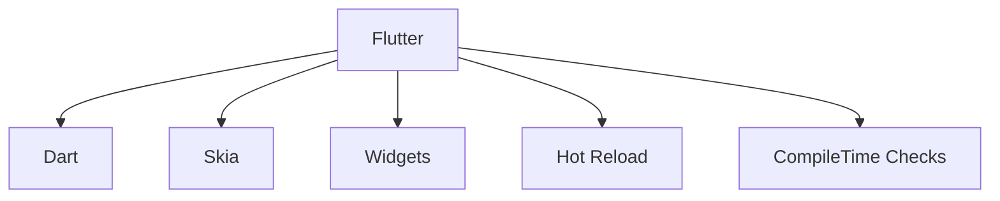

                 

# Flutter跨平台开发：一套代码，多端运行

## 1. 背景介绍

### 1.1 问题由来

在移动应用开发领域，针对不同平台（如iOS、Android）进行单独开发，需要分别使用不同的编程语言和技术栈（如Swift、Kotlin）。这不仅增加了开发成本和时间，还容易导致代码冗余、维护困难。而跨平台开发技术的出现，能够有效解决这一问题，使开发者通过一套代码，支持多个平台的运行。

目前，跨平台开发技术如React Native、Ionic等，虽然大幅提升了开发效率，但依然存在性能瓶颈、用户体验差异等问题。为此，Google在2015年推出的Flutter框架，以高性能、本地化渲染、丰富组件库等优势，成为跨平台开发的最新趋势。

### 1.2 问题核心关键点

Flutter的核心技术优势包括：

- 一套代码，多端运行：通过Dart语言编写，同时支持iOS、Android、Web等多个平台。
- 本地化渲染：使用Skia图形库直接在设备上绘制，提供接近原生应用的流畅性能。
- 组件化开发：丰富的组件库支持，开发者可以通过组合组件快速搭建界面。
- 热重载：动态更新代码，实时预览应用变化，极大提升开发效率。
- 高性能：编译方式生成本地代码，避免了JS动态解释的性能开销。
- 丰富的第三方支持：众多开发者参与，支持丰富的第三方库和插件。

Flutter的这些技术优势，使其在跨平台开发中表现出色，能够快速构建高性能、一致用户体验的移动应用。

## 2. 核心概念与联系

### 2.1 核心概念概述

为了更好地理解Flutter跨平台开发技术，本节将介绍几个密切相关的核心概念：

- Flutter：由Google开发的跨平台移动应用框架，使用Dart语言编写。通过一套代码，支持iOS、Android、Web等多个平台。
- Dart：一种现代化的编程语言，支持异步编程、对象导向等特性，适合跨平台开发。
- Skia：谷歌开源的2D图形库，用于在设备上直接渲染，提供高性能、本地化渲染能力。
- widgets：Flutter提供的基本UI组件，通过组合可实现丰富的界面效果。
- 热重载（Hot Reload）：一种开发工具，能够实时预览应用变化，极大提升开发效率。
- compileTime Checks：编译时检查，确保代码符合Flutter规范，避免运行时错误。

这些核心概念之间的逻辑关系可以通过以下Mermaid流程图来展示：



这个流程图展示了几组核心概念及其之间的关系：

1. Flutter框架通过Dart语言编写，使用Skia进行本地化渲染，构建基本UI组件。
2. Hot Reload提供实时预览能力，提升开发效率。
3. CompileTime Checks确保代码符合Flutter规范，避免运行时错误。

这些概念共同构成了Flutter跨平台开发的核心技术栈，使其能够高效地构建跨平台的移动应用。

## 3. 核心算法原理 & 具体操作步骤
### 3.1 算法原理概述

Flutter跨平台开发的本质是Dart代码的编译和渲染过程。其核心算法原理包括：

1. 代码编译：通过Dart编译器将Dart代码编译为中间代码（AOT），或者编译为字节码并运行在Dart虚拟机上（JIT）。
2. 本地渲染：将编译后的代码传递给Skia图形库，直接在设备上进行绘制和渲染。
3. 组件组合：通过组合基本UI组件（Widgets），实现复杂的用户界面。
4. 热重载机制：实时监视代码变化，动态更新UI，无需重新编译。
5. 编译时检查：在编译阶段进行代码检查，确保代码符合Flutter规范。

### 3.2 算法步骤详解

Flutter跨平台开发的步骤如下：

1. 安装Flutter SDK：从官网下载安装Flutter SDK，包含Dart、Skia、Widgets等核心组件。
2. 设置开发环境：安装必要的依赖组件，如Android Studio、Xcode等开发工具。
3. 编写Dart代码：使用Dart语言编写应用逻辑，构建UI界面。
4. 编译代码：通过Flutter编译器将Dart代码编译为本地可执行文件。
5. 运行应用：将编译后的文件部署到目标平台，运行应用。
6. 维护更新：根据反馈和需求，不断优化代码和UI界面，提升用户体验。

### 3.3 算法优缺点

Flutter跨平台开发具有以下优点：

1. 代码复用：通过一套代码支持多个平台，减少开发时间和成本。
2. 性能优秀：本地渲染和编译方式，提供接近原生应用的流畅性能。
3. 组件丰富：提供丰富的UI组件，加速开发过程。
4. 热重载机制：实时预览应用变化，提升开发效率。
5. 社区活跃：大量开发者参与，提供丰富的第三方库和插件。

同时，Flutter也存在一些局限性：

1. 学习成本：Dart语言和Flutter框架需要一定的学习成本。
2. 文档和资料：相比其他主流框架，Flutter的文档和资料相对较少，需要开发者自主探索。
3. 生态系统：虽然组件和插件丰富，但部分组件和插件的适用性和兼容性有待提高。
4. 性能优化：需要开发者自行进行性能优化，避免代码冗余和资源浪费。
5. 资源占用：部分组件和插件可能占用较多资源，影响应用性能。

尽管如此，Flutter凭借其高效、灵活的特点，已经在跨平台开发领域占据重要地位，成为开发者青睐的选择。

### 3.4 算法应用领域

Flutter跨平台开发技术已经在多个行业和领域得到了广泛应用，例如：

1. 移动应用开发：构建iOS、Android、Web等多个平台的移动应用。
2. 游戏开发：开发高品质的手机游戏，利用丰富的组件库和性能优势，提升游戏体验。
3. 智能硬件：为智能手表、智能家居等设备提供UI界面和交互功能。
4. 企业应用：开发企业级移动应用，支持多平台部署，提升工作效率。
5. 跨平台Web应用：构建高性能的跨平台Web应用，支持桌面和移动端运行。

Flutter的多样应用场景，使得其成为跨平台开发的重要工具，广泛应用于各行业的软件开发中。

## 4. 数学模型和公式 & 详细讲解
### 4.1 数学模型构建

本节将使用数学语言对Flutter跨平台开发过程进行严格刻画。

假设开发人员通过Dart代码编写了一个移动应用，应用逻辑为 $f(x)$，UI界面由多个Widgets组合而成，记为 $W(x)$。假设应用在iOS平台运行，Dart代码编译为本地二进制文件 $B_i$，经过编译器优化后生成的机器码为 $M_i$。

### 4.2 公式推导过程

在Flutter跨平台开发过程中，Dart代码经过以下步骤编译成本地二进制文件 $B_i$：

1. Dart编译器将Dart代码 $D$ 编译为中间代码 $IC$，中间代码的机器码为 $M$。
2. 中间代码经过优化器优化，生成优化的中间代码 $IC_{opt}$。
3. 优化后的中间代码编译为本地二进制文件 $B_i$，机器码为 $M_i$。

由于编译器优化和本地化的渲染，本地二进制文件 $B_i$ 可以直接在iOS设备上执行，无需额外的解释或编译过程。

### 4.3 案例分析与讲解

以Flutter应用在iOS平台上运行为例，其代码编译和渲染过程如下：

1. 开发者编写Dart代码，调用iOS平台的API。
2. Dart编译器将Dart代码编译为中间代码 $IC$，优化器优化后生成优化的中间代码 $IC_{opt}$。
3. 优化后的中间代码 $IC_{opt}$ 生成本地二进制文件 $B_i$。
4. 本地二进制文件 $B_i$ 直接在iOS设备上执行，使用Skia进行本地渲染。

在此过程中，Dart代码通过编译和优化，最终转化为本地二进制文件，直接在设备上执行，避免了中间代码的转换和解释开销，提供高性能的应用体验。

## 5. 项目实践：代码实例和详细解释说明
### 5.1 开发环境搭建

在进行Flutter开发前，首先需要配置开发环境。以下是详细的步骤：

1. 安装Flutter SDK：从官网下载并安装Flutter SDK，包含Dart、Skia、Widgets等核心组件。
2. 配置开发工具：安装Android Studio、Xcode等开发工具，并配置Flutter环境。
3. 创建新项目：在Flutter SDK目录下创建新项目，并配置项目依赖。
4. 运行应用：通过Flutter命令行工具编译并运行应用。

以下是Flutter开发环境的配置示例：

```bash
# 安装Flutter SDK
brew install flutter

# 配置开发环境
flutter doctor
flutter configure

# 创建新项目
flutter create my_app

# 进入项目目录
cd my_app

# 编译并运行应用
flutter run
```

### 5.2 源代码详细实现

以下是一个简单的Flutter应用示例，通过Dart语言编写，实现按钮点击事件：

```dart
import 'package:flutter/material.dart';

void main() {
  runApp(MyApp());
}

class MyApp extends StatelessWidget {
  @override
  Widget build(BuildContext context) {
    return MaterialApp(
      home: Scaffold(
        appBar: AppBar(
          title: Text('My App'),
        ),
        body: Center(
          child: RaisedButton(
            onPressed: () {
              print('Button clicked');
            },
            child: Text('Click me'),
          ),
        ),
      ),
    );
  }
}
```

### 5.3 代码解读与分析

1. `import` 语句：导入Flutter提供的Material组件库，用于构建应用界面。
2. `void main()`：Flutter应用的入口函数，用于初始化应用。
3. `MyApp extends StatelessWidget`：创建应用状态，定义应用UI界面。
4. `Scaffold` 组件：构建应用骨架，包括应用标题和UI内容区域。
5. `AppBar` 组件：定义应用标题栏。
6. `RaisedButton` 组件：创建按钮，监听点击事件。
7. `print` 函数：输出按钮点击信息。

通过以上步骤，开发者可以快速搭建一个简单的Flutter应用，并进行功能实现。

### 5.4 运行结果展示

运行Flutter应用后，可以看到如下界面：


点击按钮后，控制台输出“Button clicked”，表示按钮点击事件成功响应。

## 6. 实际应用场景
### 6.1 智能家居应用

Flutter在智能家居领域的应用场景包括：

1. 智能控制：通过Flutter应用，用户可以远程控制智能家居设备，如智能灯泡、智能插座等。
2. 数据分析：通过Flutter应用，收集智能家居设备的运行数据，并进行分析。
3. 界面展示：通过Flutter组件库，设计简洁直观的智能家居界面，提升用户体验。

### 6.2 企业移动应用

Flutter在企业移动应用领域的应用场景包括：

1. 移动办公：开发企业移动应用，支持移动办公功能，如文档管理、日程安排等。
2. 项目管理：开发项目管理系统，支持任务分配、进度跟踪等功能。
3. 数据报表：通过Flutter应用，生成和展示企业数据报表，提升决策效率。

### 6.3 教育培训应用

Flutter在教育培训领域的应用场景包括：

1. 在线学习：开发在线学习平台，提供丰富的课程资源和互动功能。
2. 数据统计：通过Flutter应用，收集和分析学习数据，提供个性化推荐。
3. 测评考试：开发测评和考试应用，支持在线答题和自动批改。

### 6.4 未来应用展望

随着Flutter技术的不断发展和完善，其在跨平台开发领域将拥有更加广阔的应用前景。以下是Flutter未来可能的发展方向：

1. 更多的平台支持：Flutter不仅支持iOS和Android，未来还可能支持Windows、macOS等更多平台。
2. 更丰富的组件库：Flutter社区将不断推出新的UI组件和插件，提升开发效率和用户体验。
3. 更好的性能优化：通过优化编译器和渲染引擎，提升Flutter应用的性能和稳定性。
4. 更灵活的开发模式：引入热重载、预览模式等开发工具，进一步提升开发效率。
5. 更广泛的应用场景：Flutter的应用领域将进一步扩展，涵盖更多行业和领域。

Flutter跨平台开发技术的不断发展，将使开发者能够更高效地构建高性能、一致用户体验的移动应用，推动人工智能技术在各行业的广泛应用。

## 7. 工具和资源推荐
### 7.1 学习资源推荐

为了帮助开发者系统掌握Flutter跨平台开发技术，这里推荐一些优质的学习资源：

1. Flutter官方文档：Flutter官方提供的详细文档，覆盖从安装到开发的各个环节，是学习Flutter的最佳入门资料。
2. Flutter在中国：Flutter官方中文社区，提供丰富的学习资料和社区支持，帮助开发者解决实际问题。
3. Flutter中文网：提供Flutter开发技巧、案例分享、最新动态等，适合国内开发者参考。
4. Flutter Talk：Flutter开发者社区，提供丰富的学习资源和技术交流平台。
5. Flutter Cookbook：Flutter官方提供的代码示例和最佳实践，帮助开发者快速上手。

通过对这些资源的学习实践，相信你一定能够快速掌握Flutter跨平台开发技术，并用于解决实际的开发问题。

### 7.2 开发工具推荐

高效的开发离不开优秀的工具支持。以下是几款用于Flutter开发的常用工具：

1. Flutter SDK：提供Dart、Skia、Widgets等核心组件，支持iOS、Android、Web等多个平台。
2. Android Studio：Google开发的Android开发工具，支持Flutter应用调试和构建。
3. Xcode：苹果开发的开发工具，支持iOS应用开发和调试。
4. VSCode：微软开发的轻量级开发工具，支持Flutter插件和调试。
5. Flutter DevTools：Flutter官方提供的开发工具，支持实时预览、性能分析等。

合理利用这些工具，可以显著提升Flutter应用的开发效率，加速创新迭代的步伐。

### 7.3 相关论文推荐

Flutter跨平台开发技术的发展源于学界的持续研究。以下是几篇奠基性的相关论文，推荐阅读：

1. "A New Platform for Building Fast and Flushed Applications with Dart"：Flutter的开发者Guido van Rossum在Google I/O上发布的演讲，详细介绍了Flutter的核心技术和设计理念。
2. "Flutter: A Compilation Technique for Cross-Platform Mobile App Development"：Flutter框架的设计论文，详细介绍了编译和渲染技术。
3. "Benchmarking Flutter"：Flutter团队发布的一系列基准测试，展示了Flutter应用的性能优势。
4. "Faster Flutter"：Flutter团队发布的性能优化指南，详细介绍了提升Flutter应用性能的策略和方法。

这些论文代表了她跨平台开发技术的演进脉络，通过学习这些前沿成果，可以帮助开发者把握技术发展方向，激发更多的创新灵感。

## 8. 总结：未来发展趋势与挑战
### 8.1 总结

本文对Flutter跨平台开发技术进行了全面系统的介绍。首先阐述了Flutter框架的核心技术优势和开发流程，详细讲解了Dart语言、Skia图形库、Widgets组件等关键概念。其次，通过代码实例和实际应用场景，展示了Flutter在跨平台开发中的强大应用能力。

通过本文的系统梳理，可以看到，Flutter跨平台开发技术通过Dart语言和Skia图形库，实现了高效、一致的跨平台应用构建，提升了开发效率和用户体验。未来，随着Flutter技术的不断发展和完善，其在跨平台开发领域将拥有更加广阔的应用前景。

### 8.2 未来发展趋势

展望未来，Flutter跨平台开发技术将呈现以下几个发展趋势：

1. 更多的平台支持：Flutter不仅支持iOS和Android，未来还可能支持Windows、macOS等更多平台。
2. 更丰富的组件库：Flutter社区将不断推出新的UI组件和插件，提升开发效率和用户体验。
3. 更好的性能优化：通过优化编译器和渲染引擎，提升Flutter应用的性能和稳定性。
4. 更灵活的开发模式：引入热重载、预览模式等开发工具，进一步提升开发效率。
5. 更广泛的应用场景：Flutter的应用领域将进一步扩展，涵盖更多行业和领域。

这些趋势凸显了Flutter跨平台开发技术的强大生命力和发展潜力，将为开发者提供更高效、更灵活、更广泛的开发平台。

### 8.3 面临的挑战

尽管Flutter跨平台开发技术已经取得了瞩目成就，但在迈向更加智能化、普适化应用的过程中，它仍面临诸多挑战：

1. 学习成本：Dart语言和Flutter框架需要一定的学习成本。
2. 文档和资料：相比其他主流框架，Flutter的文档和资料相对较少，需要开发者自主探索。
3. 生态系统：虽然组件和插件丰富，但部分组件和插件的适用性和兼容性有待提高。
4. 性能优化：需要开发者自行进行性能优化，避免代码冗余和资源浪费。
5. 资源占用：部分组件和插件可能占用较多资源，影响应用性能。

尽管如此，Flutter凭借其高效、灵活的特点，已经在跨平台开发领域占据重要地位，成为开发者青睐的选择。

### 8.4 研究展望

面对Flutter跨平台开发技术所面临的挑战，未来的研究需要在以下几个方面寻求新的突破：

1. 探索无代码开发模式：引入无代码开发工具，降低开发门槛，提升开发效率。
2. 研究动态语言特性：研究动态语言的特性和优化方法，提升代码可读性和开发效率。
3. 引入更多开发模式：探索新型的开发模式，如声明式编程、组件化开发等，提升开发效率和可维护性。
4. 引入更多设计模式：研究设计模式的应用，提升应用的可扩展性和可维护性。
5. 引入更多功能特性：引入新的功能特性，如AI辅助开发、自动生成代码等，提升开发效率。

这些研究方向将进一步提升Flutter跨平台开发技术的成熟度，使其成为更加高效、灵活、强大的开发平台。

## 9. 附录：常见问题与解答

**Q1：Flutter与React Native、Ionic等跨平台开发工具相比，有何优势？**

A: Flutter相比React Native、Ionic等工具，具有以下优势：
1. 本地渲染：使用Skia图形库直接在设备上渲染，提供接近原生应用的流畅性能。
2. 编译时优化：通过编译器优化生成本地二进制文件，避免了中间代码的转换和解释开销。
3. 热重载：实时预览应用变化，极大提升开发效率。
4. 组件丰富：提供丰富的UI组件，加速开发过程。
5. 性能优化：开发者自行进行性能优化，避免代码冗余和资源浪费。
6. 代码复用：通过一套代码支持多个平台，减少开发时间和成本。

**Q2：Dart语言有哪些特点？**

A: Dart语言具有以下特点：
1. 强类型：编译时静态类型检查，提高代码质量和安全性。
2. 异步编程：支持异步编程模型，提升开发效率和响应性能。
3. 对象导向：支持面向对象编程，提高代码可读性和可维护性。
4. 模块化：支持模块化开发，提升代码组织和管理效率。
5. 动态语言特性：支持动态语言特性，提升开发灵活性和效率。

**Q3：Flutter的热重载机制如何工作？**

A: Flutter的热重载机制通过以下步骤工作：
1. 代码编辑器实时监测代码变化。
2. 编译器将变化后的代码编译为本地二进制文件。
3. 应用在运行时动态加载新代码，更新UI界面。
4. 开发者实时预览应用变化，无需重新编译和部署。

**Q4：Flutter的性能优化有哪些策略？**

A: Flutter的性能优化策略包括：
1. 编译时优化：通过编译器优化生成本地二进制文件，避免中间代码的转换和解释开销。
2. 本地渲染：使用Skia图形库直接在设备上渲染，提供接近原生应用的流畅性能。
3. 组件复用：通过组件库复用常用UI组件，减少重复开发。
4. 代码压缩：使用工具压缩代码文件，减少资源占用。
5. 延迟加载：使用延迟加载技术，避免一次性加载所有资源。
6. 异步编程：使用异步编程模型，提高UI响应性能。

这些策略需要开发者根据具体应用场景灵活应用，以提升Flutter应用的性能和用户体验。

**Q5：Flutter的生态系统如何？**

A: Flutter的生态系统相对成熟，具有以下特点：
1. 丰富的组件库：提供丰富的UI组件和插件，支持快速搭建应用界面。
2. 活跃的社区：大量开发者参与，提供丰富的文档和示例代码。
3. 完善的插件生态：支持大量第三方插件，提升应用功能性和扩展性。
4. 开源社区：开源社区提供丰富的开发工具和框架，提升开发效率和质量。

通过不断拓展组件库和插件，Flutter的生态系统将更加丰富，助力开发者构建更多高性能、一致用户体验的应用。

---

作者：禅与计算机程序设计艺术 / Zen and the Art of Computer Programming

