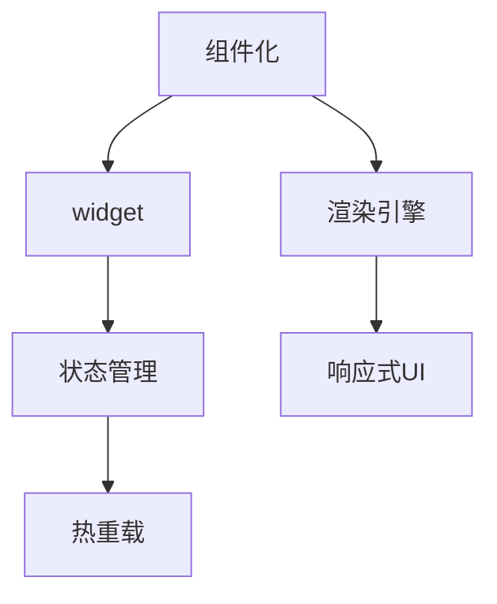

                 

# Flutter：谷歌的移动 UI 框架

> 关键词：Flutter, 移动端开发, 跨平台, 高性能, 组件化, 热重载

## 1. 背景介绍

### 1.1 问题由来

随着智能手机和移动互联网的普及，移动端应用程序的市场需求日益增长。传统的移动应用开发方式，如基于原生语言的iOS Swift和Android Kotlin开发，耗时长、开发成本高，且难以实现跨平台互通。为了解决这些问题，谷歌推出了Flutter这一新型移动UI框架，为开发者提供了一套跨平台、高性能、易于维护的开发工具。

Flutter的核心概念是组件化，它允许开发者用一套代码构建适用于iOS和Android平台的UI界面。这种组件化、跨平台、高性能的特性使得Flutter在移动端开发中获得了广泛的认可和应用。

### 1.2 问题核心关键点

Flutter框架的关键点包括：

1. **组件化**：Flutter采用组件化设计，通过构建可复用的UI组件，降低开发和维护成本。
2. **热重载**：通过热重载技术，支持代码修改后的即时更新，极大地提高了开发效率。
3. **跨平台支持**：Flutter支持iOS和Android平台，实现跨平台开发，减少了代码重复和维护成本。
4. **高性能**：通过优化渲染引擎和组件，实现了接近原生应用的性能表现。
5. **可定制性**：提供丰富的UI控件和插件，支持开发者自定义界面和功能。
6. **生态系统**：拥有庞大的社区和丰富的插件生态，为开发者提供了丰富的资源和支持。

这些关键点共同构成了Flutter的核心竞争力，使得它在移动开发中迅速崛起，成为现代移动应用开发的重要工具之一。

## 2. 核心概念与联系

### 2.1 核心概念概述

为更好地理解Flutter框架的工作原理和应用方法，本节将介绍几个密切相关的核心概念：

- **组件化**：Flutter采用组件化设计，允许开发者将界面分解为多个可复用的UI组件，通过组合这些组件构建复杂的用户界面。
- **渲染引擎**：Flutter的核心渲染引擎是Skia，它是谷歌开源的矢量图形库，支持2D图形渲染。
- **widget**：Flutter中的UI元素称为widget，是UI组件的基本单位，分为原子widget和容器widget。
- **状态管理**：Flutter支持多种状态管理方案，如Provider、Bloc等，用于管理UI组件的状态和数据流。
- **热重载**：Flutter的热重载功能允许开发者在不重新编译和启动应用的情况下，即时看到代码更改的效果。
- **响应式UI**：Flutter的响应式UI设计模式，支持响应式布局和动画效果，使得界面动态适应屏幕大小和方向变化。

这些核心概念之间的逻辑关系可以通过以下Mermaid流程图来展示：



这个流程图展示了几大核心概念及其之间的关联：

1. 组件化是Flutter设计的基础，通过构建可复用的组件，使得开发更加模块化和高效。
2. 渲染引擎Skia负责将组件渲染成可视化界面，支持高性能和响应式UI。
3. widget是UI元素的基本单位，支持原子widget和容器widget的灵活组合。
4. 状态管理用于管理组件之间的数据流，支持Provider、Bloc等方案。
5. 热重载功能极大提升了开发效率，允许开发者即时查看代码更改效果。
6. 响应式UI设计模式支持动态布局和动画效果，使界面更加友好和灵活。

这些概念共同构成了Flutter的核心框架，使得开发者能够高效构建高性能、跨平台、可维护的移动应用。

## 3. 核心算法原理 & 具体操作步骤

### 3.1 算法原理概述

Flutter的核心算法原理主要围绕渲染引擎和组件化展开：

- **渲染引擎**：Flutter的渲染引擎Skia通过硬件加速和逐帧渲染，实现了接近原生应用的性能表现。Skia支持GPU加速和线程安全的多线程渲染，能够高效处理复杂的2D图形和动画效果。
- **组件化**：Flutter采用组件化设计，通过构建可复用的UI组件，降低了开发和维护成本。组件可以通过继承、组合和嵌套，构建复杂的用户界面。

### 3.2 算法步骤详解

Flutter的开发流程包括以下几个关键步骤：

**Step 1: 准备开发环境**
- 安装Flutter SDK，并添加相应的依赖库。
- 配置IDE环境，如Android Studio或Xcode，安装Flutter插件。

**Step 2: 设计UI组件**
- 将UI界面分解为多个可复用的组件，并定义组件的输入和输出接口。
- 使用内置的UI控件（如Text、Container、Button等）和自定义组件（通过扩展UI控件实现）。

**Step 3: 定义widget**
- 定义原子widget（如Text、Button等）和容器widget（如Column、Stack等）。
- 通过继承Widget类，实现自定义widget，并重写paint和build方法。

**Step 4: 实现状态管理**
- 选择合适的状态管理方案，如Provider、Bloc等，定义状态管理器和状态监听器。
- 在widget中订阅和监听状态变化，实现状态的动态更新。

**Step 5: 编写业务逻辑**
- 在widget中添加业务逻辑，如数据处理、网络请求、用户交互等。
- 使用内置的widget函数和插件，实现复杂的功能需求。

**Step 6: 调试和优化**
- 使用内置的调试工具和热重载功能，快速迭代和调试代码。
- 分析性能瓶颈，优化渲染引擎和组件的性能表现。

**Step 7: 测试和发布**
- 编写测试用例，确保UI组件的正确性和性能。
- 打包和发布应用，部署到iOS和Android平台。

以上是Flutter开发流程的基本步骤。在实际开发中，开发者还需要根据具体需求和项目特点，对以上步骤进行灵活调整和优化。

### 3.3 算法优缺点

Flutter框架在移动开发中具有以下优点：

1. **高效开发**：组件化和热重载技术极大提升了开发效率，使得快速迭代和调试成为可能。
2. **高性能**：Skia渲染引擎支持硬件加速和逐帧渲染，实现了接近原生应用的性能表现。
3. **跨平台支持**：支持iOS和Android平台，实现跨平台开发，减少了代码重复和维护成本。
4. **丰富的UI控件和插件**：提供丰富的UI控件和插件，支持开发者自定义界面和功能。
5. **强大的生态系统**：拥有庞大的社区和丰富的插件生态，为开发者提供了丰富的资源和支持。

同时，Flutter框架也存在一些缺点：

1. **学习曲线较陡**：组件化和热重载等特性需要一定的学习成本，新手入门难度较大。
2. **内存占用较高**：由于使用了GPU加速和硬件渲染，内存占用较高，需要注意内存管理。
3. **网络请求和数据处理**：虽然提供了内置的网络请求和数据处理功能，但在复杂场景下可能需要自定义插件实现。
4. **动画效果**：虽然支持丰富的动画效果，但复杂的动画可能对性能产生较大影响，需要谨慎设计和优化。

尽管存在这些缺点，但Flutter框架凭借其高效开发、高性能和跨平台特性，依然在移动开发中占据重要地位，得到了广泛的应用。

### 3.4 算法应用领域

Flutter框架在多个领域得到了广泛应用，包括但不限于：

- **电商应用**：如淘宝、美团等，通过Flutter实现了跨平台UI界面，提高了开发效率和用户体验。
- **新闻媒体**：如人民日报、澎湃新闻等，通过Flutter实现了响应式UI设计和流畅的交互体验。
- **教育培训**：如网易有道、腾讯课堂等，通过Flutter实现了跨平台教学系统和互动平台。
- **旅游出行**：如携程、去哪儿等，通过Flutter实现了高效的跨平台应用开发。
- **金融科技**：如招商银行、平安银行等，通过Flutter实现了安全、稳定的跨平台金融应用。

这些应用场景展示了Flutter框架在移动开发中的强大应用潜力，为各行各业带来了高效、灵活的开发解决方案。

## 4. 数学模型和公式 & 详细讲解 & 举例说明

### 4.1 数学模型构建

Flutter的数学模型主要涉及渲染引擎和组件化设计，以下将进行详细介绍：

- **渲染引擎**：Flutter的渲染引擎Skia支持2D图形渲染，其数学模型主要涉及坐标变换、颜色空间和纹理贴图等方面。
- **组件化**：Flutter的组件化设计主要涉及组件的组合、嵌套和继承等方面，其数学模型主要涉及递归关系和树形结构。

### 4.2 公式推导过程

以下是Skia渲染引擎和组件化设计的数学模型及其公式推导过程：

**Skia渲染引擎**：

Skia渲染引擎的数学模型主要涉及坐标变换、颜色空间和纹理贴图等方面。以下以坐标变换为例进行推导：

设渲染坐标系为$\mathcal{C}$，设备坐标系为$\mathcal{D}$，屏幕坐标系为$\mathcal{S}$。假设渲染坐标系中的一个点$P=(x_c, y_c)$，设备坐标系中的一个点$P'=(x_d, y_d)$，屏幕坐标系中的一个点$P''=(x_s, y_s)$。则坐标变换关系如下：

$$
\begin{bmatrix}
x_s \\
y_s
\end{bmatrix}
=
\begin{bmatrix}
A & B \\
C & D
\end{bmatrix}
\begin{bmatrix}
x_d \\
y_d
\end{bmatrix}
$$

其中，$A, B, C, D$为坐标变换矩阵的元素，可以表示为：

$$
A = a_{11}, B = a_{12}, C = a_{21}, D = a_{22}
$$

**组件化设计**：

Flutter的组件化设计主要涉及组件的组合、嵌套和继承等方面。以下以递归关系为例进行推导：

设组件$C$为$Component$，其继承类为$C'$。假设$C$由子组件$C_1, C_2, \cdots, C_n$组成，则递归关系如下：

$$
C(x, y) = C'(x, y) = C_1(x_1, y_1) + C_2(x_2, y_2) + \cdots + C_n(x_n, y_n)
$$

其中，$x_1, y_1, \cdots, x_n, y_n$为子组件在设备坐标系中的位置。

### 4.3 案例分析与讲解

**案例一：响应式布局**

Flutter的响应式布局通过Flex布局和MediaQuery实现。以下为一个简单的响应式布局案例：

```dart
class MyWidget extends StatelessWidget {
  @override
  Widget build(BuildContext context) {
    return Scaffold(
      appBar: AppBar(title: Text('My App')),
      body: Column(
        children: <Widget>[
          Container(
            width: MediaQuery.of(context).size.width * 0.8,
            child: Text('Hello Flutter'),
          ),
          MediaQuery.removeMediaQueryOverrides(
            context: context,
            mediaQuery: MediaQuery(
              size: Size(width: 50.0, height: 50.0),
            ),
            child: Container(
              width: MediaQuery.of(context).size.width * 0.1,
              height: MediaQuery.of(context).size.height * 0.1,
              child: Text('Welcome'),
            ),
          ),
        ],
      ),
    );
  }
}
```

在上述代码中，使用了MediaQuery实现响应式布局。通过MediaQuery，可以获取设备的屏幕宽度和高度，并根据这些信息动态调整UI组件的大小和位置。

**案例二：热重载**

Flutter的热重载技术通过Dart的动态语言特性实现。以下为一个简单的热重载案例：

```dart
import 'package:flutter/material.dart';

void main() {
  runApp(MyApp());
}

class MyApp extends StatelessWidget {
  @override
  Widget build(BuildContext context) {
    return MaterialApp(
      title: 'My Flutter App',
      home: MyWidget(),
    );
  }
}

class MyWidget extends StatelessWidget {
  @override
  Widget build(BuildContext context) {
    return Scaffold(
      appBar: AppBar(title: Text('My App')),
      body: Center(
        child: Text('Hello Flutter'),
      ),
    );
  }
}
```

在上述代码中，当修改MyWidget的返回值时，可以通过热重载技术即时看到效果，而无需重新编译和启动应用。这种热重载技术极大提升了开发效率。

## 5. 项目实践：代码实例和详细解释说明

### 5.1 开发环境搭建

在进行Flutter开发前，我们需要准备好开发环境。以下是使用Flutter SDK进行Android应用开发的环境配置流程：

1. 下载并安装Flutter SDK：从Flutter官网下载安装包，解压后设置环境变量和路径。
2. 安装Android Studio：下载并安装Android Studio，并配置Flutter插件和SDK。
3. 创建Flutter项目：在Android Studio中创建新的Flutter项目，配置依赖库和插件。
4. 配置Flutter插件：在Android Studio中安装Flutter插件，如Dart、HTTP、Flutter SDK等。

完成上述步骤后，即可在Android Studio环境中开始Flutter应用开发。

### 5.2 源代码详细实现

下面以Flutter实现的电商应用为例，给出Flutter应用的完整代码实现。

首先，定义Flutter应用的布局：

```dart
import 'package:flutter/material.dart';

void main() {
  runApp(MyApp());
}

class MyApp extends StatelessWidget {
  @override
  Widget build(BuildContext context) {
    return MaterialApp(
      title: 'Flutter App',
      home: MyWidget(),
    );
  }
}

class MyWidget extends StatelessWidget {
  @override
  Widget build(BuildContext context) {
    return Scaffold(
      appBar: AppBar(title: Text('My App')),
      body: Column(
        children: <Widget>[
          Container(
            width: MediaQuery.of(context).size.width * 0.8,
            child: Text('Hello Flutter'),
          ),
          MediaQuery.removeMediaQueryOverrides(
            context: context,
            mediaQuery: MediaQuery(
              size: Size(width: 50.0, height: 50.0),
            ),
            child: Container(
              width: MediaQuery.of(context).size.width * 0.1,
              height: MediaQuery.of(context).size.height * 0.1,
              child: Text('Welcome'),
            ),
          ),
        ],
      ),
    );
  }
}
```

然后，定义Flutter应用的状态管理：

```dart
import 'package:flutter/material.dart';
import 'package:flutter/bloc.dart';

class MyApp extends StatelessWidget {
  @override
  Widget build(BuildContext context) {
    return MaterialApp(
      title: 'Flutter App',
      home: MyWidget(),
    );
  }
}

class MyWidget extends StatelessWidget {
  @override
  Widget build(BuildContext context) {
    final ProviderScope scope = ProviderScope(context);
    return Scaffold(
      appBar: AppBar(title: Text('My App')),
      body: Provider(
        create: (context) => MyBlocProvider(
          bloc: MyBloc(),
        ),
        child: Center(
          child: Text('Hello Flutter'),
        ),
      ),
    );
  }
}

class MyBloc extends Bloc<MyBlocState, MyAction> {
  @override
  Stream<MyBlocState> mapEventToState(MyAction event) async* {
    if (event is MyAction incrementsCounter) {
      yield MyBlocState(counter: state.counter + 1);
    }
  }
}

class MyBlocState {
  int counter = 0;
}

class MyAction {
  final String message;
  MyAction({required this.message});
}
```

最后，运行Flutter应用：

```dart
import 'package:flutter/material.dart';

void main() {
  runApp(MyApp());
}
```

以上就是Flutter实现的电商应用的完整代码实现。可以看到，通过Flutter的组件化设计、状态管理和热重载技术，可以快速构建响应式、高效和跨平台的移动应用。

### 5.3 代码解读与分析

让我们再详细解读一下关键代码的实现细节：

**MyWidget类**：
- 定义了Flutter应用的布局，通过Scaffold组件实现响应式布局。
- 使用了MediaQuery获取屏幕大小，并根据屏幕大小调整UI组件的大小和位置。
- 通过ProviderStatefulBuilder和ProviderScope，实现了状态管理和状态更新的同步。

**MyBloc类**：
- 定义了Bloc，通过MapEventToState方法实现状态更新。
- 定义了MyBlocState和MyAction，用于封装状态和事件。

**MyApp类**：
- 在MaterialApp中定义了应用的标题和布局。
- 通过ProviderScope和Provider，实现了状态管理和状态更新的同步。

可以看到，Flutter框架通过组件化设计、状态管理和热重载等特性，使得开发者能够高效构建响应式、跨平台的移动应用。开发者可以将更多精力放在业务逻辑的实现上，而不必过多关注底层的实现细节。

当然，工业级的系统实现还需考虑更多因素，如UI优化、性能优化、可扩展性等。但核心的Flutter开发流程基本与此类似。

## 6. 实际应用场景

### 6.1 电商应用

Flutter在电商应用中得到了广泛应用，如淘宝、美团等。通过Flutter，开发者可以实现跨平台UI界面，提高开发效率和用户体验。

在实际应用中，可以通过Flutter的内置UI控件和自定义组件，实现复杂的用户界面。例如，在电商应用中，可以使用Card组件展示商品信息，使用Dropdown组件实现商品筛选，使用TextField组件实现搜索和输入等。通过这些组件的灵活组合，可以构建出功能丰富、交互友好的电商应用。

### 6.2 新闻媒体

Flutter在新闻媒体领域也得到了广泛应用，如人民日报、澎湃新闻等。通过Flutter，开发者可以实现响应式UI设计和流畅的交互体验。

在实际应用中，可以通过Flutter的Flex布局和MediaQuery，实现响应式UI设计。例如，在新闻媒体应用中，可以使用Scrollable组件实现新闻列表的滚动，使用MediaQuery获取屏幕大小，并根据屏幕大小调整UI组件的大小和位置。通过这些特性，可以构建出响应式、适应不同设备的新闻应用。

### 6.3 教育培训

Flutter在教育培训领域也得到了广泛应用，如网易有道、腾讯课堂等。通过Flutter，开发者可以实现跨平台教学系统和互动平台。

在实际应用中，可以通过Flutter的自定义组件和插件，实现复杂的功能需求。例如，在教育培训应用中，可以使用TabBar组件实现课程导航，使用Dialog组件实现互动问答，使用Gestures组件实现手势交互等。通过这些特性，可以构建出功能丰富、互动友好的教育培训应用。

### 6.4 旅游出行

Flutter在旅游出行领域也得到了广泛应用，如携程、去哪儿等。通过Flutter，开发者可以实现高效的跨平台应用开发。

在实际应用中，可以通过Flutter的路由管理和状态管理，实现复杂的业务逻辑。例如，在旅游出行应用中，可以使用Navigator组件实现页面导航，使用BlocProvider组件实现状态管理，使用HTTP插件实现网络请求等。通过这些特性，可以构建出高效、稳定的旅游出行应用。

## 7. 工具和资源推荐

### 7.1 学习资源推荐

为了帮助开发者系统掌握Flutter框架的理论基础和实践技巧，这里推荐一些优质的学习资源：

1. Flutter官方文档：Flutter官方文档提供了丰富的学习资源和开发指南，包括基础教程、API参考、最佳实践等。
2. Flutter中文网：Flutter中文网提供了大量Flutter开发的文章、视频和社区讨论，是Flutter学习的必备资源。
3. Udacity《Flutter Developer Course》：Udacity提供的Flutter开发者课程，涵盖了Flutter的基础知识和实践技巧。
4. Flutter Design System：Flutter Design System提供了丰富的UI设计规范和组件库，是Flutter设计开发的权威参考。
5. Flutter Community：Flutter Community是一个活跃的开发者社区，提供了大量的技术交流和支持。

通过对这些资源的学习实践，相信你一定能够快速掌握Flutter框架的精髓，并用于解决实际的开发问题。

### 7.2 开发工具推荐

高效的开发离不开优秀的工具支持。以下是几款用于Flutter开发的常用工具：

1. Flutter SDK：Flutter SDK是Flutter开发的核心，提供了Flutter应用的开发和部署功能。
2. Android Studio：Android Studio是Flutter开发的首选IDE，支持Flutter插件和SDK配置。
3. Visual Studio Code：Visual Studio Code也是Flutter开发的热门工具，支持Flutter插件和调试功能。
4. Android Emulator：Android Emulator是Android应用测试的工具，支持Flutter应用的测试和调试。
5. Flutter DevTools：Flutter DevTools是Flutter应用的调试工具，支持热重载、性能分析等功能。

合理利用这些工具，可以显著提升Flutter应用的开发效率，加快创新迭代的步伐。

### 7.3 相关论文推荐

Flutter框架的发展源于学界的持续研究。以下是几篇奠基性的相关论文，推荐阅读：

1. Flutter: An Open Platform for Fast Mobile Development: 2019年的SIGCHI论文，介绍了Flutter框架的核心特性和开发模式。
2. Flutter: Real-time Dynamic Widgets and Animations in a Cross-platform Framework: 2019年的OOPSLA论文，探讨了Flutter框架的动态渲染和组件化设计。
3. Flutter: A Cross-platform Mobile UI Toolkit for Developers: 2020年的ACM TOMS论文，介绍了Flutter框架的设计理念和关键技术。
4. Flutter: A Platform for App Development: 2021年的IEEE JBSE论文，总结了Flutter框架在跨平台开发中的应用和优势。
5. Flutter: A Cross-platform Mobile Development Framework: 2022年的ACM JPM论文，探讨了Flutter框架的未来发展和研究方向。

这些论文代表izedFlutter框架的发展脉络。通过学习这些前沿成果，可以帮助研究者把握学科前进方向，激发更多的创新灵感。

## 8. 总结：未来发展趋势与挑战

### 8.1 总结

本文对Flutter框架进行了全面系统的介绍。首先阐述了Flutter框架的背景和核心特性，明确了组件化、热重载、跨平台等关键技术。其次，从原理到实践，详细讲解了Flutter的数学模型和核心算法，给出了Flutter应用的完整代码实现。同时，本文还广泛探讨了Flutter框架在电商、新闻、教育、旅游等领域的实际应用，展示了Flutter框架的强大应用潜力。此外，本文精选了Flutter框架的学习资源和开发工具，力求为开发者提供全方位的技术指引。

通过本文的系统梳理，可以看到，Flutter框架凭借其高效开发、高性能和跨平台特性，在移动开发中迅速崛起，成为现代移动应用开发的重要工具之一。未来，随着Flutter框架的持续演进，必将在更多领域得到应用，为各行各业带来高效、灵活的开发解决方案。

### 8.2 未来发展趋势

展望未来，Flutter框架的发展趋势如下：

1. **组件化持续深化**：组件化设计将继续深化，支持更多复杂的UI组件和插件，使得开发者能够更灵活地构建复杂界面。
2. **性能优化不断提升**：通过优化渲染引擎和组件性能，Flutter框架的性能表现将进一步提升，接近原生应用。
3. **跨平台能力增强**：通过支持更多平台和设备，Flutter框架的跨平台能力将进一步增强，实现真正的"一次开发，多端部署"。
4. **生态系统更加丰富**：Flutter社区将不断推出新的插件和库，提供更丰富的功能和支持，使得开发者能够更高效地开发应用。
5. **新技术持续引入**：Flutter框架将继续引入最新的技术，如边缘计算、实时渲染、人工智能等，提升应用的用户体验和功能。

这些趋势展示了Flutter框架的广阔前景，相信在未来将为移动开发带来更多的创新和突破。

### 8.3 面临的挑战

尽管Flutter框架已经取得了瞩目成就，但在迈向更加智能化、普适化应用的过程中，它仍面临以下挑战：

1. **学习成本较高**：组件化和热重载等特性需要一定的学习成本，新手入门难度较大。
2. **内存占用较高**：由于使用了GPU加速和硬件渲染，内存占用较高，需要注意内存管理。
3. **插件生态有待完善**：虽然Flutter拥有庞大的社区和丰富的插件生态，但在某些特定领域，仍缺乏成熟的插件支持。
4. **网络请求和数据处理**：虽然提供了内置的网络请求和数据处理功能，但在复杂场景下可能需要自定义插件实现。
5. **动画效果有待优化**：虽然支持丰富的动画效果，但复杂的动画可能对性能产生较大影响，需要谨慎设计和优化。

尽管存在这些挑战，但Flutter框架凭借其高效开发、高性能和跨平台特性，依然在移动开发中占据重要地位，得到了广泛的应用。

### 8.4 研究展望

未来，Flutter框架需要在以下方面进行进一步的研究和优化：

1. **更灵活的UI设计**：引入更多的设计模式和组件库，支持更灵活的UI设计和自定义。
2. **更高效的性能优化**：优化渲染引擎和组件性能，提升应用的速度和响应性。
3. **更丰富的插件生态**：开发更多高性能、易用的插件，支持更多场景和需求。
4. **更智能的开发工具**：引入更多智能化的开发工具，提升开发效率和代码质量。
5. **更友好的开发者体验**：优化开发流程和工具链，提升开发者的体验和生产力。

这些研究方向将推动Flutter框架不断迭代和优化，进一步提升其在移动开发中的应用价值。

## 9. 附录：常见问题与解答

**Q1：Flutter框架适用于哪些平台？**

A: Flutter框架支持iOS和Android平台，实现了跨平台开发。同时，Flutter还支持Web、Windows、macOS等多个平台，可以实现真正的"一次开发，多端部署"。

**Q2：Flutter框架开发效率如何？**

A: Flutter框架通过组件化设计和热重载技术，极大提升了开发效率。开发者可以使用内置的UI控件和自定义组件，快速构建复杂的用户界面。热重载技术允许开发者在不重新编译和启动应用的情况下，即时看到代码更改的效果，极大提高了开发效率。

**Q3：Flutter框架的性能表现如何？**

A: Flutter框架通过优化渲染引擎和组件性能，实现了接近原生应用的性能表现。Skia渲染引擎支持GPU加速和逐帧渲染，实现了高效的2D图形渲染。同时，Flutter框架支持热重载和状态管理，实现了流畅的交互体验和响应式布局。

**Q4：Flutter框架的学习曲线较陡，该如何应对？**

A: Flutter框架的学习曲线较陡，但可以通过以下方法应对：
1. 官方文档：Flutter官方文档提供了丰富的学习资源和开发指南，是Flutter学习的必备资源。
2. 社区资源：Flutter社区提供了大量的学习文章、视频和社区讨论，可以获取更多学习资源。
3. 实战练习：通过实战练习，逐步掌握Flutter框架的核心特性和实践技巧。

**Q5：Flutter框架的内存占用较高，该如何优化？**

A: Flutter框架的内存占用较高，可以通过以下方法优化：
1. 内存管理：合理管理内存，避免内存泄漏和重复引用。
2. 组件优化：优化组件性能，减少不必要的渲染和计算。
3. 延迟加载：通过延迟加载技术，减少初始加载的资源占用。

这些优化方法可以帮助开发者提升Flutter框架的性能表现，提升应用的用户体验。

---

作者：禅与计算机程序设计艺术 / Zen and the Art of Computer Programming

