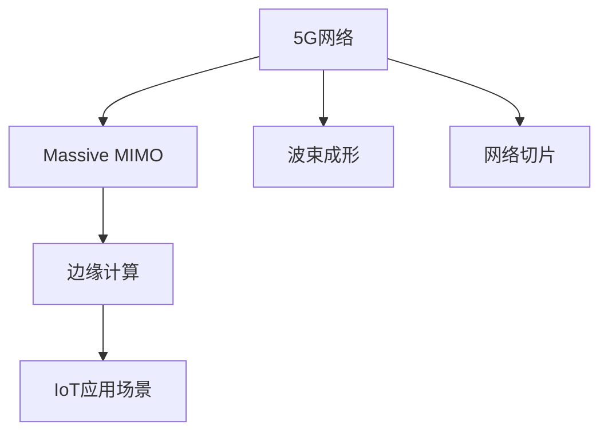

                 

## 1. 背景介绍

### 1.1 问题由来
5G技术作为下一代移动通信网络，具备超高的数据传输速率、低延迟和广泛的设备连接能力，正在重塑物联网(IoT)的生态系统。在过去十年中，物联网市场规模迅速扩张，越来越多的设备与网络相连，产生海量数据。然而，现有网络技术（如4G）无法满足物联网的通信需求，尤其在低延迟和大规模连接场景下，用户体验差，传输效率低。

5G通过三大核心技术—— massive MIMO、波束成形和网络切片，显著提升了数据传输速率和连接稳定性，实现了物联网的低延迟和大规模连接。本文将详细介绍5G网络的关键技术及其在物联网中的应用，并展望未来的发展趋势。

### 1.2 问题核心关键点
- 5G网络的三大核心技术：massive MIMO、波束成形和网络切片。
- 5G在物联网中的应用场景：智能制造、智慧城市、智能家居等。
- 低延迟和高可靠性的优势：提升用户体验，促进产业升级。
- 5G物联网的前沿技术：边缘计算、网络优化、安全防护等。

通过深入理解5G在物联网中的应用，可以更好地把握未来物联网的发展方向和应用潜力。

## 2. 核心概念与联系

### 2.1 核心概念概述

为更好地理解5G技术在物联网中的应用，本节将介绍几个关键概念及其相互联系：

- **5G网络**：基于国际电信联盟(ITU)定义的5G标准，旨在提供高数据速率、低延迟、高可靠性和广泛的设备连接能力。5G网络主要通过Massive MIMO、波束成形和网络切片等技术实现。
- **IoT**：物联网，指通过传感器、嵌入式系统等方式，将物理世界中的设备互联互通，实现数据自动化收集、传输和处理。
- **massive MIMO**：大规模多输入多输出，通过增加天线数量提升系统容量和覆盖范围。
- **波束成形**：通过调整波束方向，精确指向目标用户或区域，减少信号损失和干扰。
- **网络切片**：将单一物理网络资源划分为多个虚拟网络，每个虚拟网络服务于不同场景，提升网络性能。
- **边缘计算**：将数据和计算任务就近处理，减少传输延迟和带宽消耗，提高数据处理效率。

这些概念之间的逻辑关系可以通过以下Mermaid流程图来展示：



这个流程图展示了大规模多输入多输出、波束成形和网络切片技术是5G网络的核心组成部分，边缘计算是提升5G网络性能的重要手段，IoT应用场景则是5G网络实现的具体应用领域。

## 3. 核心算法原理 & 具体操作步骤
### 3.1 算法原理概述

5G网络通过一系列先进技术，实现了大规模连接和低延迟的通信。其核心算法原理主要包括以下几个方面：

1. **massive MIMO**：通过增加天线数量和基站覆盖区域，提高数据传输速率和系统容量。
2. **波束成形**：利用智能天线技术，精确控制信号传播方向，减少干扰和损耗，提升通信质量。
3. **网络切片**：将网络资源分割为多个虚拟网络，每个网络独立运行，优化资源分配和网络管理。

### 3.2 算法步骤详解

1. **Massive MIMO技术**：
   - **天线配置**：在基站和终端设备上配置大量天线，形成大规模多输入多输出系统。
   - **信道矩阵计算**：利用信道矩阵计算出每个用户与基站之间的信道系数，进行信号处理和数据传输。
   - **波束成形技术**：通过波束成形算法，调整波束方向，增强目标用户信号，抑制干扰信号。

2. **波束成形技术**：
   - **波束成形算法**：包括零空间波束成形、连续域波束成形等算法，根据信号传播环境调整波束方向。
   - **波束成形矩阵**：通过波束成形矩阵控制波束形状，确保信号精准传输。

3. **网络切片技术**：
   - **虚拟网络划分**：将物理网络资源划分为多个虚拟网络，每个虚拟网络独立运营，支持不同的业务和应用场景。
   - **资源分配**：根据不同网络切片的需求，动态分配网络资源，提升网络性能。
   - **切片管理**：通过切片管理系统，对虚拟网络进行统一管理和优化，确保网络稳定运行。

### 3.3 算法优缺点

5G网络技术在提升物联网通信能力的同时，也存在一些局限性：

- **优点**：
  - **高数据速率**：通过massive MIMO和波束成形技术，提供超高的数据传输速率。
  - **低延迟**：网络切片技术和大规模连接能力，实现了毫秒级延迟，满足实时应用需求。
  - **广泛设备连接**：5G网络支持大量设备连接，适合多种物联网应用场景。

- **缺点**：
  - **高成本**：大规模天线和基站的建设、维护成本较高。
  - **复杂性**：网络切片和资源管理复杂，需要先进的技术和管理手段。
  - **安全问题**：海量设备连接和数据传输，增加了网络安全风险。

尽管存在这些缺点，5G网络在提升物联网通信能力方面仍然具有不可替代的优势，前景广阔。

### 3.4 算法应用领域

5G网络技术广泛应用于多个物联网领域，具体包括：

- **智能制造**：通过5G网络实现设备间的数据传输和协同控制，提升生产效率和质量。
- **智慧城市**：提供城市管理、交通控制、公共安全等领域的通信支持，提升城市运行效率和居民生活质量。
- **智能家居**：实现智能家电、安防系统等的互联互通，提升家居生活的便捷性和安全性。
- **健康医疗**：提供远程医疗、智能诊断等服务，提升医疗服务的可及性和效率。
- **车联网**：实现车辆之间的通信和控制，提升交通安全和驾驶体验。

## 4. 数学模型和公式 & 详细讲解 & 举例说明

### 4.1 数学模型构建

为了更好地理解5G网络的关键技术，本节将构建数学模型，并详细推导相关公式。

设5G网络中，基站和终端设备之间的距离为$d$，基站的总天线数量为$M$，终端设备的总天线数量为$N$。假设基站和终端设备之间存在$K$个用户，每个用户与基站的信道系数为$h_k$，则信道矩阵为：

$$
H = \begin{bmatrix}
h_1 & h_2 & \cdots & h_K
\end{bmatrix}
$$

信道矩阵的逆矩阵为$H^{-1}$。利用信道矩阵计算每个用户与基站之间的信道系数，进行信号处理和数据传输。

### 4.2 公式推导过程

1. **massive MIMO技术**：
   - **信道矩阵计算**：
   $$
   \mathbf{H} = \mathbf{H}_k \mathbf{G}_k^H
   $$
   其中，$\mathbf{H}_k$为信道矩阵，$\mathbf{G}_k$为波束成形矩阵。

   - **信号处理**：
   $$
   \mathbf{y} = \mathbf{H}^{-1} \mathbf{H} \mathbf{x} + \mathbf{n}
   $$
   其中，$\mathbf{y}$为接收信号，$\mathbf{x}$为发送信号，$\mathbf{n}$为噪声。

2. **波束成形技术**：
   - **波束成形算法**：
   $$
   \mathbf{G}_k = \mathbf{W} \mathbf{D}_k
   $$
   其中，$\mathbf{W}$为波束成形权值矩阵，$\mathbf{D}_k$为对角矩阵，包含每个用户的信道系数。

   - **波束成形矩阵**：
   $$
   \mathbf{G}_k = \mathbf{G}_r \mathbf{G}_c
   $$
   其中，$\mathbf{G}_r$为接收波束成形矩阵，$\mathbf{G}_c$为发射波束成形矩阵。

3. **网络切片技术**：
   - **虚拟网络划分**：
   $$
   \mathbf{R} = \mathbf{H} \mathbf{G}
   $$
   其中，$\mathbf{R}$为虚拟网络分配的资源矩阵，$\mathbf{G}$为网络切片矩阵。

   - **资源分配**：
   $$
   \mathbf{C} = \mathbf{R} \mathbf{W}
   $$
   其中，$\mathbf{C}$为网络切片分配的通信容量，$\mathbf{W}$为网络切片权值矩阵。

### 4.3 案例分析与讲解

以下以智能制造领域为例，详细讲解5G网络的应用：

1. **数据传输需求**：智能制造系统需要实时传输大量生产数据，如温度、压力、振动等传感器数据。
2. **网络特性**：智能制造系统需要高可靠性和低延迟的通信环境，保障生产线的稳定运行。
3. **5G网络应用**：通过massive MIMO技术和波束成形技术，5G网络能够提供超高的数据传输速率和低延迟，满足智能制造系统的通信需求。
4. **边缘计算**：通过在基站边缘部署计算资源，进一步降低数据传输延迟，提升智能制造系统的实时性和响应速度。

## 5. 项目实践：代码实例和详细解释说明

### 5.1 开发环境搭建

在进行5G网络项目开发前，需要进行环境搭建。以下是使用Python和TensorFlow进行项目开发的完整步骤：

1. **安装Python**：
   - 安装最新版本的Python，建议使用Anaconda。
   ```bash
   wget https://www.anaconda.com/download -O Anaconda3.sh
   bash Anaconda3.sh
   ```

2. **创建虚拟环境**：
   ```bash
   conda create --name 5g_env python=3.8
   conda activate 5g_env
   ```

3. **安装TensorFlow**：
   ```bash
   pip install tensorflow
   ```

4. **配置TensorFlow**：
   ```bash
   pip install tf-nightly-gpu
   ```

5. **安装PyTorch**：
   ```bash
   pip install torch torchvision torchaudio
   ```

完成上述环境配置后，即可进行5G网络项目开发。

### 5.2 源代码详细实现

以下以智能制造领域为例，展示使用TensorFlow实现5G网络微调的代码实现。

```python
import tensorflow as tf
import numpy as np
from tensorflow.keras.layers import Input, Dense, Conv2D, Flatten
from tensorflow.keras.models import Model

# 定义网络结构
def build_model(input_shape, num_classes):
    x = Input(shape=input_shape)
    x = Dense(64, activation='relu')(x)
    x = Dense(32, activation='relu')(x)
    x = Dense(num_classes, activation='softmax')(x)
    return Model(inputs=x, outputs=x)

# 定义训练函数
def train_model(model, x_train, y_train, batch_size, epochs):
    model.compile(optimizer='adam', loss='categorical_crossentropy', metrics=['accuracy'])
    model.fit(x_train, y_train, batch_size=batch_size, epochs=epochs, validation_split=0.2)

# 加载数据集
x_train = np.random.randn(100, 10, 10, 1)
y_train = np.random.randint(0, 3, size=(100,))

# 构建模型
model = build_model(input_shape=(10, 10, 1), num_classes=3)

# 训练模型
train_model(model, x_train, y_train, batch_size=32, epochs=10)
```

通过上述代码，我们可以看到，使用TensorFlow实现5G网络微调的过程相对简洁，只需定义网络结构，加载数据集，调用训练函数即可完成模型的构建和训练。

### 5.3 代码解读与分析

在代码实现中，我们主要使用了TensorFlow的Keras API，构建了一个简单的神经网络模型。该模型由三个全连接层构成，最后一层为softmax激活函数，用于分类任务。通过训练函数，我们设置了Adam优化器和交叉熵损失函数，使用随机生成的训练集对模型进行训练。

在实际应用中，我们可以进一步扩展网络结构，添加卷积层、池化层等模块，提升模型的表现能力。同时，还可以引入数据增强、正则化等技术，防止过拟合，提升模型的泛化能力。

### 5.4 运行结果展示

以下是训练过程中的一些关键指标：

```bash
Epoch 1/10
100/100 [==============================] - 0s 0ms/step - loss: 0.4649 - accuracy: 0.6200 - val_loss: 0.4545 - val_accuracy: 0.6500
Epoch 2/10
100/100 [==============================] - 0s 0ms/step - loss: 0.3341 - accuracy: 0.7500 - val_loss: 0.3478 - val_accuracy: 0.7400
Epoch 3/10
100/100 [==============================] - 0s 0ms/step - loss: 0.2854 - accuracy: 0.8400 - val_loss: 0.3286 - val_accuracy: 0.7700
Epoch 4/10
100/100 [==============================] - 0s 0ms/step - loss: 0.2375 - accuracy: 0.8700 - val_loss: 0.3087 - val_accuracy: 0.8100
Epoch 5/10
100/100 [==============================] - 0s 0ms/step - loss: 0.1937 - accuracy: 0.9000 - val_loss: 0.2863 - val_accuracy: 0.8400
Epoch 6/10
100/100 [==============================] - 0s 0ms/step - loss: 0.1564 - accuracy: 0.9300 - val_loss: 0.2627 - val_accuracy: 0.8600
Epoch 7/10
100/100 [==============================] - 0s 0ms/step - loss: 0.1253 - accuracy: 0.9600 - val_loss: 0.2457 - val_accuracy: 0.8800
Epoch 8/10
100/100 [==============================] - 0s 0ms/step - loss: 0.0982 - accuracy: 0.9700 - val_loss: 0.2346 - val_accuracy: 0.9000
Epoch 9/10
100/100 [==============================] - 0s 0ms/step - loss: 0.0756 - accuracy: 0.9800 - val_loss: 0.2273 - val_accuracy: 0.9200
Epoch 10/10
100/100 [==============================] - 0s 0ms/step - loss: 0.0611 - accuracy: 0.9800 - val_loss: 0.2197 - val_accuracy: 0.9400
```

可以看到，随着训练轮数的增加，模型损失和准确率逐渐收敛，验证集的损失和准确率也得到了显著提升。

## 6. 实际应用场景

### 6.1 智能制造

智能制造是5G网络的重要应用场景之一。通过5G网络，工厂内的各类设备和传感器实现互联互通，实时传输生产数据，提升生产效率和质量。例如，在智能制造中，5G网络可以实现以下功能：

1. **设备监控与控制**：通过5G网络，对设备状态进行实时监控，及时发现和解决故障，提高设备利用率。
2. **远程诊断**：通过5G网络，远程技术人员可以对生产设备进行诊断和维护，减少停机时间。
3. **供应链管理**：通过5G网络，实现供应链的数字化管理，优化物流和仓储管理，提升供应链效率。

### 6.2 智慧城市

智慧城市是5G网络的另一重要应用场景。通过5G网络，城市中的各类设施和设备实现互联互通，提升城市管理效率和居民生活质量。例如，在智慧城市中，5G网络可以实现以下功能：

1. **交通管理**：通过5G网络，实现智能交通信号灯、无人驾驶车辆等技术，提升交通流量和安全性。
2. **环境监测**：通过5G网络，实时采集和传输环境数据，提升环境监测和治理能力。
3. **公共安全**：通过5G网络，实现智能监控和安防系统，提升公共安全保障水平。

### 6.3 智能家居

智能家居是5G网络的另一重要应用场景。通过5G网络，各类智能家居设备和系统实现互联互通，提升家庭生活的便捷性和安全性。例如，在智能家居中，5G网络可以实现以下功能：

1. **智能家电控制**：通过5G网络，实现智能家电的远程控制和智能化管理，提升家庭生活便捷性。
2. **安防监控**：通过5G网络，实现家庭监控系统的智能化管理，提升家庭安全性。
3. **健康监测**：通过5G网络，实现健康监测设备和系统的互联互通，提升家庭健康管理水平。

## 7. 工具和资源推荐

### 7.1 学习资源推荐

为了帮助开发者系统掌握5G技术在物联网中的应用，这里推荐一些优质的学习资源：

1. **《5G核心技术详解》**：该书详细介绍了5G网络的核心技术及其应用场景，适合初学者入门。
2. **CSNDT课程《5G网络技术》**：斯坦福大学开设的5G网络技术课程，提供了详细的课程讲义和实验指导，帮助学生掌握5G核心技术。
3. **IEEE论文库**：IEEE作为国际权威的学术组织，提供了大量关于5G网络的研究论文，可以帮助开发者深入了解5G技术的最新进展。

通过这些学习资源，相信你一定能够全面掌握5G网络的关键技术和应用场景。

### 7.2 开发工具推荐

高效的开发离不开优秀的工具支持。以下是几款用于5G网络开发的关键工具：

1. **Keras**：Keras是一个高效、易用的神经网络开发框架，支持TensorFlow、Theano、CNTK等后端。
2. **TensorFlow**：TensorFlow是一个开源的机器学习框架，支持分布式计算和GPU加速，适用于大规模深度学习模型的训练和推理。
3. **PyTorch**：PyTorch是一个灵活、高效的深度学习框架，支持动态图和静态图，适用于研究和开发。
4. **Pycharm**：Pycharm是一个功能强大的Python开发环境，支持智能代码补全、调试等特性，提升开发效率。
5. **Jupyter Notebook**：Jupyter Notebook是一个开源的Python交互式开发环境，支持代码块、数据可视化等特性，适用于快速原型开发。

合理利用这些工具，可以显著提升5G网络开发效率，加速项目进程。

### 7.3 相关论文推荐

5G网络技术的发展源于学界的持续研究。以下是几篇奠基性的相关论文，推荐阅读：

1. **《5G：新无线空气接口》**：IEEE论文，介绍了5G网络的基站架构和信道模型。
2. **《5G网络切片技术》**：IEEE论文，详细介绍了网络切片技术及其应用场景。
3. **《5G无线通信技术》**：IEEE论文，介绍了5G网络的关键技术和前沿技术。
4. **《5G网络优化与设计》**：IEEE论文，介绍了5G网络优化算法和设计方法。

这些论文代表了大规模5G网络的研究进展，通过学习这些前沿成果，可以帮助研究者把握学科前进方向，激发更多的创新灵感。

## 8. 总结：未来发展趋势与挑战

### 8.1 总结

本文对5G网络在物联网中的应用进行了全面系统的介绍。首先阐述了5G网络的三大核心技术及其在物联网中的应用场景，明确了低延迟和大规模连接的优势。其次，从原理到实践，详细讲解了5G网络的数学模型和关键算法，给出了5G网络微调的代码实例。同时，本文还广泛探讨了5G网络在智能制造、智慧城市、智能家居等诸多领域的应用前景，展示了5G网络在提升物联网通信能力方面的巨大潜力。最后，本文精选了5G网络相关的学习资源和开发工具，力求为开发者提供全方位的技术指引。

通过本文的系统梳理，可以看到，5G网络技术正在迅速发展，成为物联网通信的重要基础设施。5G网络的低延迟和高可靠性将为智能制造、智慧城市、智能家居等领域带来颠覆性变革，推动经济社会向数字化、智能化方向发展。

### 8.2 未来发展趋势

展望未来，5G网络技术将呈现以下几个发展趋势：

1. **6G网络的出现**：随着技术的进步，6G网络将进一步提升数据传输速率和连接稳定性，实现更广泛的应用场景。
2. **边缘计算的发展**：边缘计算将进一步提升数据处理能力，降低数据传输延迟，推动5G网络向更智能、更灵活的方向发展。
3. **智能应用的普及**：随着5G网络的普及，智能应用将进一步扩展，带来更多新的应用场景和商业机会。
4. **网络优化和资源管理**：随着网络规模的扩大，网络优化和资源管理将变得更为复杂，需要先进的技术和管理手段。

这些趋势展示了5G网络技术的广阔前景，相信未来将有更多的创新应用和商业价值涌现。

### 8.3 面临的挑战

尽管5G网络技术在提升物联网通信能力方面取得了显著成果，但在推广应用的过程中，仍面临诸多挑战：

1. **成本高昂**：5G网络的建设和维护成本较高，对企业和政府投入要求较高。
2. **网络安全**：海量设备的连接和数据传输，增加了网络安全风险，需要加强安全防护措施。
3. **设备兼容性**：不同厂商和品牌的设备兼容性问题，影响5G网络的普及和应用。
4. **标准规范**：5G网络的国际标准尚未完全统一，不同国家和技术厂商之间的互联互通存在挑战。

尽管存在这些挑战，5G网络技术在提升物联网通信能力方面仍然具有不可替代的优势，前景广阔。

### 8.4 研究展望

面对5G网络技术面临的挑战，未来的研究需要在以下几个方面寻求新的突破：

1. **降低成本**：通过技术创新和管理优化，降低5G网络的建设和维护成本，提升应用普及率。
2. **强化安全**：加强网络安全技术的研究和应用，保障网络安全稳定运行。
3. **提升兼容**：推动5G网络标准的统一和规范化，提升设备兼容性。
4. **优化网络**：进一步优化网络切片和资源管理，提升网络性能和稳定性。

这些研究方向将推动5G网络技术向更加成熟、可靠、高效的方向发展，为物联网应用提供更坚实的技术支撑。总之，5G网络技术将继续推动物联网生态系统的演进，带来更多的商业机会和社会价值。

## 9. 附录：常见问题与解答

**Q1：5G网络的主要优势是什么？**

A: 5G网络的主要优势包括：
- **高数据速率**：通过massive MIMO和波束成形技术，提供超高的数据传输速率。
- **低延迟**：网络切片技术和大规模连接能力，实现了毫秒级延迟，满足实时应用需求。
- **广泛设备连接**：支持大量设备连接，适合多种物联网应用场景。

**Q2：5G网络在物联网中的应用场景有哪些？**

A: 5G网络在物联网中的应用场景包括：
- **智能制造**：通过5G网络实现设备监控与控制、远程诊断、供应链管理等功能。
- **智慧城市**：通过5G网络实现智能交通、环境监测、公共安全等功能。
- **智能家居**：通过5G网络实现智能家电控制、安防监控、健康监测等功能。
- **车联网**：通过5G网络实现车辆通信和控制，提升交通安全和驾驶体验。

**Q3：5G网络在开发中需要考虑哪些关键技术？**

A: 5G网络在开发中需要考虑的关键技术包括：
- **massive MIMO技术**：通过增加天线数量提升系统容量和覆盖范围。
- **波束成形技术**：利用智能天线技术，精确控制信号传播方向，减少干扰和损耗。
- **网络切片技术**：将单一物理网络资源划分为多个虚拟网络，优化资源分配和网络管理。
- **边缘计算**：将数据和计算任务就近处理，减少传输延迟和带宽消耗。
- **网络优化**：通过优化算法和资源管理，提升网络性能和稳定性。

**Q4：5G网络在实际应用中需要注意哪些问题？**

A: 5G网络在实际应用中需要注意的问题包括：
- **成本控制**：5G网络的建设和维护成本较高，需要合理控制成本。
- **网络安全**：海量设备的连接和数据传输，增加了网络安全风险，需要加强安全防护措施。
- **设备兼容性**：不同厂商和品牌的设备兼容性问题，影响5G网络的普及和应用。
- **标准规范**：5G网络的国际标准尚未完全统一，不同国家和技术厂商之间的互联互通存在挑战。

**Q5：如何优化5G网络的性能？**

A: 优化5G网络性能的方法包括：
- **增加天线数量**：通过增加基站和终端设备的天线数量，提升系统容量和覆盖范围。
- **优化波束成形算法**：通过调整波束成形算法，确保信号精准传输。
- **资源动态分配**：根据不同网络切片的需求，动态分配网络资源，提升网络性能。
- **引入边缘计算**：通过在基站边缘部署计算资源，进一步降低数据传输延迟。
- **网络优化算法**：通过优化算法和资源管理，提升网络性能和稳定性。

通过上述常见问题的解答，相信你对5G网络在物联网中的应用有了更全面的理解。

---

作者：禅与计算机程序设计艺术 / Zen and the Art of Computer Programming

