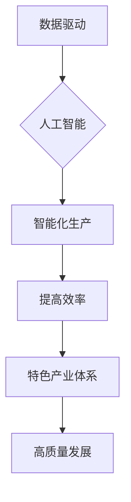

>  人工智能、产业体系、新质生产力、数据驱动、智能化转型、深度学习、机器学习、算法优化、可持续发展

## 1. 背景介绍

当前，全球经济发展进入新阶段，数字化转型成为全球共识。人工智能（AI）作为第四次工业革命的核心技术，正在深刻地改变着生产方式、生活方式和社会结构。 

传统产业体系面临着效率低下、资源浪费、创新能力不足等挑战。而人工智能技术的应用，能够打破传统生产模式的局限，赋予产业新的活力和发展动力。

构建特色产业体系的新质生产力，是实现高质量发展、推动经济转型升级的关键。

## 2. 核心概念与联系

**2.1 新质生产力**

新质生产力是指以数据为基础、以人工智能为驱动的生产力，其核心特征是：

* **数据驱动：** 以海量数据为基础，通过数据分析和挖掘，实现生产过程的智能化和优化。
* **智能化：** 利用人工智能算法，实现生产过程的自动化、智能化控制，提高生产效率和产品质量。
* **协同创新：** 打破传统产业壁垒，实现跨行业、跨领域的协同创新，加速产业升级。

**2.2 特色产业体系**

特色产业体系是指以区域资源禀赋、产业基础和市场需求为导向，构建具有独特优势和竞争力的产业集群。

构建特色产业体系，需要充分发挥区域优势，整合资源，形成产业链条，打造具有核心竞争力的产业集群。

**2.3 核心概念联系**

新质生产力是构建特色产业体系的基础，而特色产业体系则是新质生产力的应用场景。两者相互促进，共同推动产业发展。



## 3. 核心算法原理 & 具体操作步骤

**3.1 算法原理概述**

深度学习是人工智能领域的重要分支，其核心是利用多层神经网络模拟人类大脑的学习过程。

深度学习算法能够从海量数据中自动提取特征，并进行模式识别和预测。

**3.2 算法步骤详解**

1. **数据预处理：** 对原始数据进行清洗、转换、特征提取等操作，使其适合深度学习模型的训练。
2. **模型构建：** 根据具体任务需求，选择合适的深度学习模型架构，例如卷积神经网络（CNN）、循环神经网络（RNN）等。
3. **模型训练：** 利用训练数据，通过反向传播算法，调整模型参数，使模型能够准确地进行预测或分类。
4. **模型评估：** 利用测试数据，评估模型的性能，例如准确率、召回率、F1-score等。
5. **模型部署：** 将训练好的模型部署到实际应用场景中，用于进行预测或分类。

**3.3 算法优缺点**

**优点：**

* **高精度：** 深度学习算法能够从海量数据中自动提取特征，从而实现高精度的预测和分类。
* **自动化学习：** 深度学习算法能够自动学习数据中的模式，无需人工特征工程。
* **泛化能力强：** 深度学习模型能够对新的数据进行泛化，具有较强的推广能力。

**缺点：**

* **数据依赖：** 深度学习算法需要大量的训练数据，否则模型性能会下降。
* **计算资源消耗大：** 深度学习模型训练需要大量的计算资源，成本较高。
* **可解释性差：** 深度学习模型的决策过程较为复杂，难以解释模型的决策结果。

**3.4 算法应用领域**

深度学习算法广泛应用于各个领域，例如：

* **图像识别：** 人脸识别、物体检测、图像分类等。
* **自然语言处理：** 文本分类、机器翻译、语音识别等。
* **推荐系统：** 商品推荐、内容推荐等。
* **医疗诊断：** 疾病诊断、影像分析等。

## 4. 数学模型和公式 & 详细讲解 & 举例说明

**4.1 数学模型构建**

深度学习模型可以看作是一个复杂的数学模型，其核心是神经网络。

神经网络由多个层组成，每一层包含多个神经元。神经元之间通过连接权重进行信息传递。

**4.2 公式推导过程**

深度学习模型的训练过程是通过优化连接权重来实现的。

常用的优化算法包括梯度下降法、Adam算法等。

梯度下降法的核心公式如下：

$$
\theta = \theta - \alpha \nabla L(\theta)
$$

其中：

* $\theta$ 是连接权重
* $\alpha$ 是学习率
* $\nabla L(\theta)$ 是损失函数 $L(\theta)$ 的梯度

**4.3 案例分析与讲解**

假设我们有一个简单的线性回归问题，目标是预测房价。

我们可以使用一个单层神经网络模型，其输入特征包括房屋面积、房间数量等，输出为房价。

通过训练数据，我们可以优化模型的连接权重，使模型能够准确地预测房价。

## 5. 项目实践：代码实例和详细解释说明

**5.1 开发环境搭建**

深度学习开发环境通常需要安装Python语言、深度学习框架（例如TensorFlow、PyTorch）以及必要的库和工具。

**5.2 源代码详细实现**

以下是一个使用TensorFlow框架实现简单的线性回归模型的代码示例：

```python
import tensorflow as tf

# 定义模型
model = tf.keras.models.Sequential([
    tf.keras.layers.Dense(units=1, input_shape=[2])
])

# 定义损失函数和优化器
model.compile(loss='mean_squared_error', optimizer='adam')

# 训练模型
model.fit(x_train, y_train, epochs=100)

# 预测房价
predictions = model.predict(x_test)
```

**5.3 代码解读与分析**

* `tf.keras.models.Sequential` 创建一个顺序模型，即层级结构。
* `tf.keras.layers.Dense` 创建一个全连接层，输入维度为2，输出维度为1。
* `model.compile` 配置模型的损失函数、优化器等参数。
* `model.fit` 训练模型，输入训练数据和训练轮数。
* `model.predict` 使用训练好的模型预测房价。

**5.4 运行结果展示**

训练完成后，我们可以评估模型的性能，例如使用均方误差（MSE）来衡量预测结果与真实值之间的差距。

## 6. 实际应用场景

**6.1 智能制造**

人工智能可以应用于智能制造领域，例如：

* **预测性维护：** 利用机器学习算法分析设备运行数据，预测设备故障，提前进行维护。
* **质量控制：** 利用计算机视觉技术对产品进行质量检测，提高产品质量。
* **生产过程优化：** 利用数据分析和机器学习算法优化生产流程，提高生产效率。

**6.2 智能物流**

人工智能可以应用于智能物流领域，例如：

* **路径规划：** 利用机器学习算法优化物流配送路径，提高配送效率。
* **货物识别：** 利用计算机视觉技术识别货物种类和数量，提高物流效率。
* **仓储管理：** 利用人工智能算法优化仓储空间利用率，提高仓储效率。

**6.3 智能金融**

人工智能可以应用于智能金融领域，例如：

* **风险控制：** 利用机器学习算法分析客户数据，识别潜在的风险，降低金融风险。
* **欺诈检测：** 利用机器学习算法分析交易数据，识别欺诈行为，提高金融安全。
* **个性化服务：** 利用人工智能算法分析客户需求，提供个性化的金融服务。

**6.4 未来应用展望**

随着人工智能技术的不断发展，其应用场景将更加广泛，例如：

* **智能医疗：** 利用人工智能辅助医生诊断疾病、制定治疗方案。
* **智能教育：** 利用人工智能个性化教学，提高教育效率。
* **智能城市：** 利用人工智能优化城市管理，提高城市生活质量。

## 7. 工具和资源推荐

**7.1 学习资源推荐**

* **在线课程：** Coursera、edX、Udacity 等平台提供丰富的深度学习课程。
* **书籍：** 《深度学习》、《动手学深度学习》等书籍是深度学习学习的经典教材。
* **开源社区：** TensorFlow、PyTorch 等深度学习框架的官方网站和社区提供了丰富的学习资源和技术支持。

**7.2 开发工具推荐**

* **深度学习框架：** TensorFlow、PyTorch、Keras 等深度学习框架提供了丰富的工具和API，方便深度学习模型的开发和训练。
* **数据处理工具：** Pandas、NumPy 等数据处理工具可以帮助处理和分析深度学习所需的训练数据。
* **可视化工具：** Matplotlib、Seaborn 等可视化工具可以帮助可视化深度学习模型的训练过程和结果。

**7.3 相关论文推荐**

* **《ImageNet Classification with Deep Convolutional Neural Networks》**
* **《Attention Is All You Need》**
* **《BERT: Pre-training of Deep Bidirectional Transformers for Language Understanding》**

## 8. 总结：未来发展趋势与挑战

**8.1 研究成果总结**

近年来，人工智能领域取得了显著的进展，深度学习算法在图像识别、自然语言处理等领域取得了突破性进展。

**8.2 未来发展趋势**

* **模型规模和能力提升：** 未来深度学习模型将更加庞大，拥有更强的学习能力和泛化能力。
* **算法创新：** 新的深度学习算法将不断涌现，例如强化学习、生成对抗网络等。
* **跨模态学习：** 深度学习模型将能够处理多种模态数据，例如文本、图像、音频等。

**8.3 面临的挑战**

* **数据安全和隐私保护：** 深度学习算法依赖于海量数据，如何保障数据安全和隐私保护是一个重要挑战。
* **算法可解释性：** 深度学习模型的决策过程较为复杂，难以解释模型的决策结果，如何提高算法的可解释性是一个重要研究方向。
* **伦理问题：** 深度学习技术的应用可能会带来一些伦理问题，例如算法偏见、就业问题等，需要引起重视和探讨。

**8.4 研究展望**

未来，人工智能技术将继续发展，并对社会产生更深远的影响。

我们需要加强人工智能基础研究，推动算法创新，并关注人工智能技术的伦理问题，确保人工智能技术能够造福人类。

## 9. 附录：常见问题与解答

**9.1 如何选择合适的深度学习框架？**

选择深度学习框架需要根据具体项目需求和个人经验进行选择。

TensorFlow 和 PyTorch 是目前最流行的深度学习框架，各有优缺点。

**9.2 如何处理深度学习训练数据？**

深度学习训练数据需要进行清洗、转换、特征提取等操作，以使其适合模型训练。

可以使用 Pandas、NumPy 等数据处理工具进行数据处理。

**9.3 如何评估深度学习模型的性能？**

常用的评估指标包括准确率、召回率、F1-score 等。

需要根据具体任务需求选择合适的评估指标。


作者：禅与计算机程序设计艺术 / Zen and the Art of Computer Programming 
<end_of_turn>