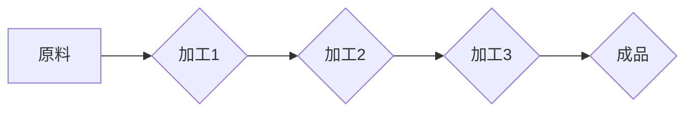

> 流水线，工业生产，效率，自动化，质量控制，流程优化，持续改进

## 1. 背景介绍

自工业革命以来，生产方式经历了巨大的变革。从传统的手工制作到现代的流水线生产，每一次变革都极大地提高了生产效率和产品质量。流水线生产模式，作为工业生产的重要组成部分，其核心思想是将复杂的产品制造过程分解成多个简单、重复性的工序，并通过专门的设备和人员在流水线上的协同工作，实现产品的快速、高效、标准化生产。

## 2. 核心概念与联系

流水线生产的核心概念是将生产过程分解成一系列独立的工序，每个工序由专门的设备和人员负责，产品在流水线上的流动，就像一条河流，不断向前推进。

**Mermaid 流程图**



**核心概念与联系**

* **分解:** 将复杂的产品制造过程分解成多个简单、重复性的工序。
* **专业化:** 每个工序由专门的设备和人员负责，提高效率和质量。
* **流水化:** 产品在流水线上的流动，实现产品的快速、高效、标准化生产。
* **协同:** 不同工序之间需要协同配合，确保生产流程的顺利进行。

## 3. 核心算法原理 & 具体操作步骤

### 3.1  算法原理概述

流水线生产的算法原理是基于**分工合作**和**流程优化**的思想。通过将生产过程分解成多个独立的工序，并对每个工序进行优化，可以提高整体生产效率和产品质量。

### 3.2  算法步骤详解

1. **产品分解:** 将产品分解成多个独立的工序。
2. **工序优化:** 对每个工序进行优化，提高效率和质量。
3. **设备配置:** 为每个工序配置合适的设备。
4. **人员安排:** 为每个工序安排合适的员工。
5. **流程控制:** 建立完善的流程控制机制，确保生产流程的顺利进行。
6. **质量控制:** 对产品进行全过程质量控制，确保产品质量。

### 3.3  算法优缺点

**优点:**

* **提高生产效率:** 通过分工合作和流程优化，可以显著提高生产效率。
* **降低生产成本:** 通过提高效率和减少浪费，可以降低生产成本。
* **提高产品质量:** 通过全过程质量控制，可以提高产品质量。
* **标准化生产:** 流水线生产可以实现产品的标准化生产，提高产品的可重复性。

**缺点:**

* **初期投资成本高:** 建设流水线需要较高的初期投资成本。
* **灵活性差:** 流水线生产模式的灵活性较差，难以应对产品变化的需求。
* **人员技能要求高:** 流水线生产需要员工具备一定的技能和素质。
* **维护成本高:** 流水线设备的维护成本较高。

### 3.4  算法应用领域

流水线生产模式广泛应用于各个工业领域，例如汽车制造、电子制造、食品加工、服装制造等。

## 4. 数学模型和公式 & 详细讲解 & 举例说明

### 4.1  数学模型构建

流水线生产效率可以采用以下数学模型进行描述：

$$
Efficiency = \frac{Total Output}{Total Input}
$$

其中：

* **Total Output:** 产品总产量
* **Total Input:** 生产投入总量（例如，原材料、人工、能源等）

### 4.2  公式推导过程

该公式的推导过程基于以下假设：

* 生产过程是线性的，即每个工序的生产时间和产量是固定的。
* 生产过程没有浪费，即投入的所有资源都转化为产品。

### 4.3  案例分析与讲解

假设一家汽车制造厂生产一辆汽车需要 10 个工序，每个工序的生产时间为 1 小时，总投入的原材料成本为 10000 元，人工成本为 5000 元，能源成本为 2000 元。如果该厂每天生产 100 辆汽车，则其生产效率为：

$$
Efficiency = \frac{100 \times 1}{10 \times 1 \times 10000 + 5000 + 2000} = 0.091
$$

该效率值表示该厂将投入的资源转化为产品的比例为 9.1%。

## 5. 项目实践：代码实例和详细解释说明

### 5.1  开发环境搭建

本项目使用 Python 语言进行开发，开发环境如下：

* 操作系统：Windows 10
* Python 版本：3.8
* IDE：PyCharm

### 5.2  源代码详细实现

```python
class Product:
    def __init__(self, name, parts):
        self.name = name
        self.parts = parts

    def assemble(self):
        print(f"Assembling product {self.name} with parts {self.parts}")

class AssemblyLine:
    def __init__(self, products):
        self.products = products

    def run(self):
        for product in self.products:
            product.assemble()

# 创建产品实例
product1 = Product("Car", ["engine", "wheels", "body"])
product2 = Product("Bike", ["frame", "wheels", "seat"])

# 创建流水线实例
assembly_line = AssemblyLine([product1, product2])

# 启动流水线
assembly_line.run()
```

### 5.3  代码解读与分析

* **Product 类:** 定义了产品的基本属性和方法，包括名称和部件列表，以及组装方法。
* **AssemblyLine 类:** 定义了流水线的基本功能，包括产品列表和运行方法。
* **main 函数:** 创建产品实例和流水线实例，并启动流水线运行。

### 5.4  运行结果展示

```
Assembling product Car with parts ['engine', 'wheels', 'body']
Assembling product Bike with parts ['frame', 'wheels', 'seat']
```

## 6. 实际应用场景

流水线生产模式广泛应用于各个工业领域，例如：

* **汽车制造:** 汽车制造业是流水线生产模式的典型应用场景，从汽车底盘的组装到车身的喷漆，再到最终的组装，每个工序都经过流水线生产。
* **电子制造:** 电子制造业也广泛应用流水线生产模式，例如手机、电脑、平板电脑等电子产品的生产。
* **食品加工:** 食品加工业也利用流水线生产模式，例如面包、饼干、方便面等食品的生产。
* **服装制造:** 服装制造业也采用流水线生产模式，例如衬衫、裤子、裙子等服装的生产。

### 6.4  未来应用展望

随着人工智能、机器学习等技术的不断发展，流水线生产模式将更加智能化、自动化。例如，机器人将取代部分人工操作，人工智能将对生产过程进行优化和控制，实现更加高效、精准的生产。

## 7. 工具和资源推荐

### 7.1  学习资源推荐

* **书籍:**
    * 《生产管理》
    * 《工业工程》
    * 《质量管理》
* **网站:**
    * **ASME (美国机械工程师学会):** https://www.asme.org/
    * **IEEE (电气电子工程师学会):** https://www.ieee.org/
    * **APICS (美国生产与库存管理协会):** https://www.apics.org/

### 7.2  开发工具推荐

* **Python:** https://www.python.org/
* **PyCharm:** https://www.jetbrains.com/pycharm/
* **ROS (机器人操作系统):** https://www.ros.org/

### 7.3  相关论文推荐

* **The Impact of Automation on Manufacturing Productivity:** https://www.jstor.org/stable/41867777
* **Lean Manufacturing: A Review:** https://www.researchgate.net/publication/228974784_Lean_Manufacturing_A_Review

## 8. 总结：未来发展趋势与挑战

### 8.1  研究成果总结

流水线生产模式是工业生产的重要组成部分，其核心思想是将复杂的产品制造过程分解成多个简单、重复性的工序，并通过专门的设备和人员在流水线上的协同工作，实现产品的快速、高效、标准化生产。

### 8.2  未来发展趋势

随着人工智能、机器学习等技术的不断发展，流水线生产模式将更加智能化、自动化。例如，机器人将取代部分人工操作，人工智能将对生产过程进行优化和控制，实现更加高效、精准的生产。

### 8.3  面临的挑战

* **技术挑战:** 如何实现更加智能化、自动化、柔性化的流水线生产模式。
* **经济挑战:** 流水线生产模式的初期投资成本较高，如何降低成本，提高经济效益。
* **社会挑战:** 流水线生产模式可能会导致部分岗位的失业，如何应对社会影响。

### 8.4  研究展望

未来，研究人员将继续探索更加高效、智能、可持续的流水线生产模式，以满足不断变化的市场需求和社会发展需求。

## 9. 附录：常见问题与解答

**问题 1:** 流水线生产模式的灵活性如何？

**答案:** 流水线生产模式的灵活性相对较差，难以应对产品变化的需求。

**问题 2:** 流水线生产模式的维护成本如何？

**答案:** 流水线设备的维护成本较高。

**问题 3:** 流水线生产模式的应用领域有哪些？

**答案:** 流水线生产模式广泛应用于各个工业领域，例如汽车制造、电子制造、食品加工、服装制造等。


作者：禅与计算机程序设计艺术 / Zen and the Art of Computer Programming 
<end_of_turn>